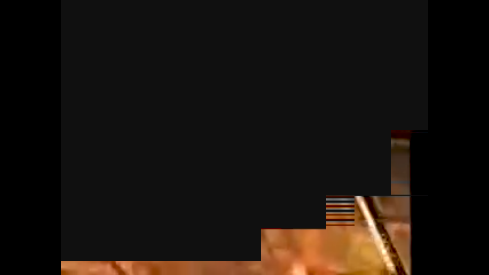
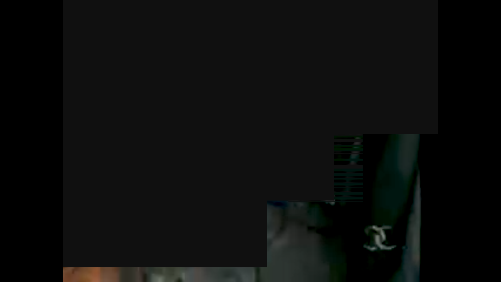
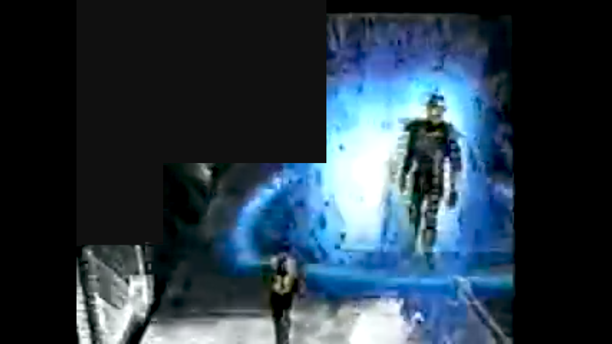
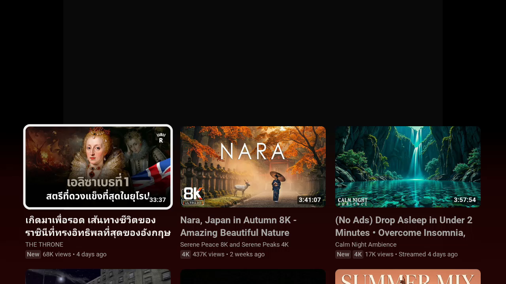
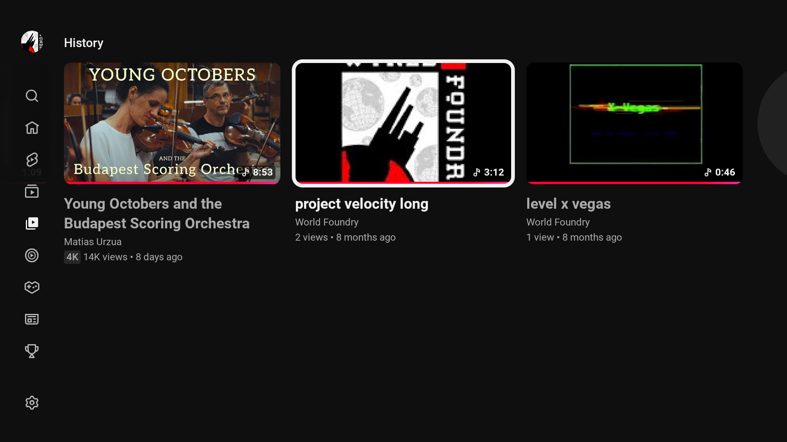
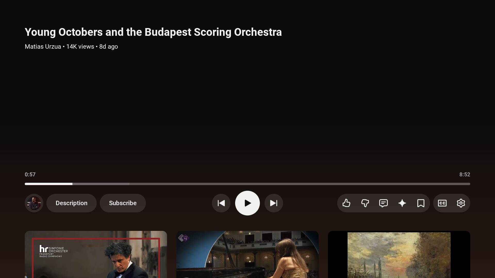
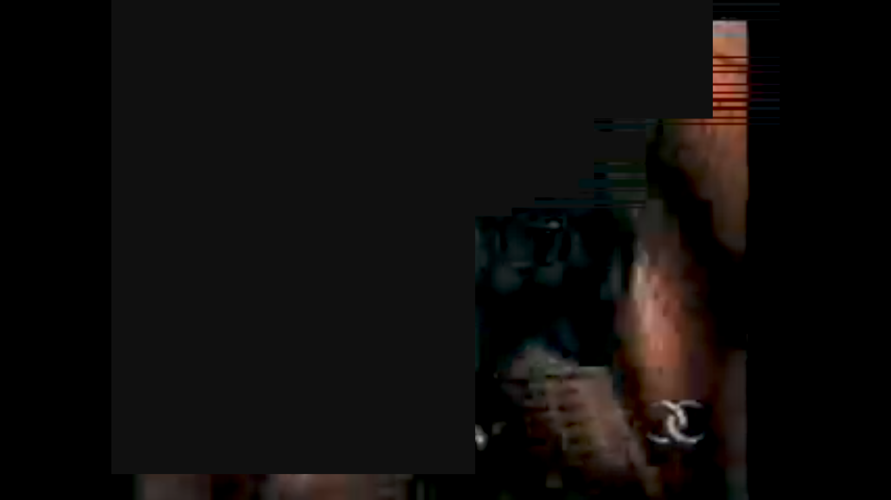
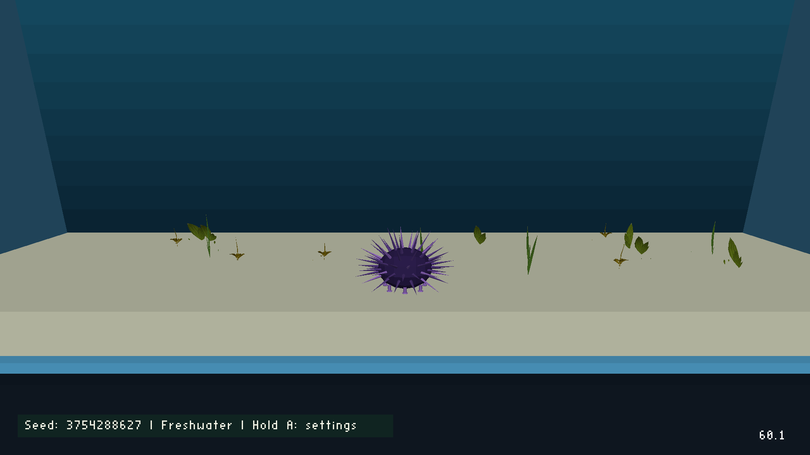

# Chromecast screenshot investigation — 2026-10-04

The capture command obtains screenshots without changing the foreground app, sending keys, waking the display or interrupting playback:

```sh
task chromecast:capture DEVICE=chromecast-test-01
```

Cast2 returned entirely transparent screenshots during YouTube playback. Cast1 returned a partial video image during playback; after Will paused the video, it returned clearly rendered YouTube controls while the video area remained dark. These are captures from Android, not photographs of the physical screens. The current evidence suggests a video capture/composition limitation; the exact vendor failure remains unproven.

## Latest comparison: four methods on both devices

The installed coordinator ran PNG capture, raw-buffer capture, UI Automation and a three-second observational recording. Each job completed with verified cleanup. “Captured” in the method receipts means an artifact was obtained; it does not mean the image is complete. The methods run successively, so moving images and app state can differ between them.

| Method | Cast1 playing video: `J-d129f5b7cba4` | Cast2 YouTube foreground: `J-ad44a9cdd524` |
|---|---|---|
| PNG | Partial video, large missing rectangular areas and horizontal artifacts | Entirely transparent; RGB and alpha zero |
| Raw buffer | Partial video with similar missing regions; alpha is 255 everywhere | Original RGB bytes all zero; alpha zero everywhere |
| UI Automation | More video visible in this sampled frame, but still a large missing rectangle | Opaque black image |
| Three-second recording | Sampled frame shows recommendations after playback changed state; moving-video capture remains unverified | Later sampled frames entirely black; first frame has only faint values up to 13/255, no recognizable content |

**PNG alpha handling is ruled out as the explanation for these samples.** Cast2's original raw buffer contains no RGB pixels to recover by changing transparency. Cast1's original raw buffer is already opaque and still incomplete. UI Automation does not reliably solve the missing regions. The exact vendor readback/composition defect remains unproven.

### Cast1: playing-video repeat

Will confirmed that cast1 was playing a video. The first comparison (`J-3f2e938525c5`) caught an “Up next” countdown, so a second comparison was run. Its PNG, raw and UI Automation images contain different video frames with missing regions. The recording subsequently captured a recommendations UI. This state change limits the recording comparison: it cannot be presented as a successful or failed moving-video recording.

PNG:



Raw buffer, original alpha preserved:



UI Automation:



Recording's first decoded frame — recommendations, not evidence of moving-video capture:



[Method receipt](chromecast-capture-J-d129f5b7cba4/capture-methods.json) · [Raw measurements](chromecast-capture-J-d129f5b7cba4/raw-analysis.json) · [Pixel analysis](chromecast-capture-J-d129f5b7cba4/image-analysis.json) · [Recording](chromecast-capture-J-d129f5b7cba4/capture.mp4) · [Earlier countdown comparison](chromecast-capture-J-3f2e938525c5/capture-methods.json).

### Cast1: menu control comparison

The earlier comparison `J-8fab5343f20e` was on YouTube's History screen. PNG, raw and UI Automation captured that menu clearly; the recording's first frame also shows it. A static recording contained only one encoded frame, so later extraction offsets yielded no images. This is a useful control showing the capture routes work for UI, but it does not establish full video capture.



[Method receipt](chromecast-capture-J-8fab5343f20e/capture-methods.json) · [Recording frame](chromecast-capture-J-8fab5343f20e/record-frame-01.png).

### Cast2: alternate routes remain empty

YouTube MainActivity was foreground. The raw buffer had **zero nonzero RGB pixels** at 1920×1080. UI Automation returned opaque black. The recording's later sampled frames were exactly black; its first frame contained only faint near-black values. These results add no recognizable video or UI. This comparison did not independently reconfirm the physical TV's current frame; the earlier playback test below had Will's confirmation.

PNG (transparent):


Raw buffer with alpha replaced by 255 for this labelled preview — RGB unchanged:


UI Automation (opaque black):


Recording sample at 1.4 seconds (black):


[Method receipt](chromecast-capture-J-ad44a9cdd524/capture-methods.json) · [Raw measurements](chromecast-capture-J-ad44a9cdd524/raw-analysis.json) · [Pixel analysis](chromecast-capture-J-ad44a9cdd524/image-analysis.json) · [Recording](chromecast-capture-J-ad44a9cdd524/capture.mp4).

### Next experiment

Use a known long-running video so the three-second recording stays within playback, then compare a controlled test app using the same content through SurfaceView and TextureView. That would distinguish a reproducible surface/composition failure from YouTube-specific behavior. No setting change to YouTube or GPU overlay policy has been made.

## Earlier cast1 capture: paused video

Will paused the video before job `J-6ceb581d5470`. The captured play button, title, timeline and recommendations are visible and coherent; the main video area is dark. Pausing therefore improves UI capture but does not demonstrate a complete video-frame capture. The capture command itself sent no input.



[Display-layer diagnostics](chromecast-capture-J-6ceb581d5470/surfaceflinger.txt) · [Receipt](chromecast-capture-J-6ceb581d5470/receipt.json).

## Cast1: video playing — partial capture

Job `J-72e95f41027a` captured visible parts of the video with large dark regions and horizontal artifacts. Some video pixels reached the capture, so this is positive evidence that video capture is possible at least in part. The missing regions make complete capture a plausible target for further testing; a reliable full frame has not yet been demonstrated.



[Pixel measurements](cast1-capture-analysis.json) · [Display-layer diagnostics](chromecast-capture-J-72e95f41027a/surfaceflinger.txt).

## Cast2: video playing — transparent captures

The initial job `J-a8a71f0fab0a` returned a valid 1920×1080 RGBA PNG containing only `(0,0,0,0)` pixels. It is fully transparent; a black background in an image viewer makes it appear black.


The repeat job `J-e33d994fc93a` produced the same empty image and also collected read-only display diagnostics. Will confirmed that the physical TV was playing a video.


[Initial pixel measurements](cast2-black-capture-analysis.json) · [Repeat findings](cast2-display-diagnosis.json).

## What the device evidence establishes

- Cast2 is awake: `mWakefulness=Awake` in the [power dump](chromecast-capture-J-e33d994fc93a/power.txt); its primary LG TV display has `powerMode=On`.
- YouTube MainActivity is resumed in the [activity dump](chromecast-capture-J-e33d994fc93a/activity.txt).
- The active video and UI layers have `isSecure=false`, `hasProtectedContent=false` and null sideband streams in the [SurfaceFlinger dump](chromecast-capture-J-e33d994fc93a/surfaceflinger.txt).
- The vendor compositor uses an unblanked hardware video plane and an unblanked overlay plane, with no client composition. This identifies the active playback path; hardware composition by itself does not prove that capture must fail.
- Video/UI buffer flags are `0x102` and `0x100`. Android 12 defines secure as `0x80` and skip-screenshot as `0x40`; neither bit is present on those buffers. The secure capability of the HDMI display itself does not mean its content is protected.

Sleep is ruled out for the observed repeat. The evidence does not support standard secure/DRM screenshot suppression and does not establish sideband tunneling. My initial DRM/tunneling suggestions were hypotheses, not diagnoses. The leading explanation remains a device/vendor screenshot-composition limitation during hardware video playback. Cast1 and cast2 differ in hardware, Android version and playback conditions, so this comparison cannot isolate the cause to one variable.

## Aquarium capture on cast2 — working comparison

An earlier check successfully captured Aquarium's generative planted tank and FPS overlay on the same device. That check restored YouTube afterward. This establishes that cast2 can capture normal game rendering; the later YouTube failure is not evidence of an Aquarium renderer failure.



[Deployment record](aquarium-cast2-deployment.md).

## Research and remaining uncertainty

Android documents that [secure windows prevent screenshots](https://developer.android.com/security/fraud-prevention/activities), but the observed YouTube layers are not marked secure. Android TV's [multimedia tunneling documentation](https://source.android.com/docs/devices/tv/multimedia-tunneling) explains that tunneled video buffers bypass the Android graphics stack, but these dumps do not prove that tunneling is active. Android 12's [SurfaceFlinger implementation](https://android.googlesource.com/platform/frameworks/native/+/refs/heads/android12-release/services/surfaceflinger/SurfaceFlinger.cpp) and [layer-state definitions](https://android.googlesource.com/platform/frameworks/native/+/refs/heads/android12-release/libs/gui/include/gui/LayerState.h) distinguish visible, secure, protected and screenshot-excluded layers.

The coordinator now saves bounded read-only power, display, window, activity, dream and SurfaceFlinger dumps after each screenshot. Collection timestamps appear in each job's `display-diagnostics.json`; these are successive observations, not an atomic snapshot. The expanded capture workflow passes all 38 coordinator tests; see [test output](coordinator-alternative-capture-tests.txt).

Further investigation would compare capture-time compositor errors, video buffer formats and alternative supported capture paths. The capture jobs sent no playback input and changed no device settings. Will controlled playback between tests.

## Further research: partial capture is a reason to keep testing

Yes: the partial cast1 image is evidence against a blanket claim that video cannot be captured. It demonstrates that some non-protected video pixels can pass through the screenshot path. It does not establish that every frame, region, buffer format or device works, but it warrants testing other paths rather than stopping at “hardware video cannot be captured.”

A closely matching [first-hand Appium issue](https://github.com/appium/appium/issues/20258), reported on an Android 12 Chromecast in June 2024, compares two builds of the reporter's own app: SurfaceView video produces blank screenshots, while TextureView video captures normally. This is corroborating evidence of a rendering-path issue, not proof that its cause is identical to ours. Our YouTube diagnostics also show SurfaceView layers. A capture tool could automate an app-specific rendering switch if YouTube exposed one. No documented YouTube TV switch or generic Android API for replacing another app’s SurfaceView with a TextureView was found. Android’s surface choice belongs to the player/view implementation, not screenshot configuration.

### What the implementations reveal

- [AndroidViewClient's snapshot implementation](https://github.com/dtmilano/AndroidViewClient/blob/master/src/com/dtmilano/android/adb/adbclient.py) uses ADB's `framebuffer:` protocol on these Android versions. Android 12's [ADB framebuffer service](https://android.googlesource.com/platform/packages/modules/adb/+/refs/heads/android12-release/daemon/framebuffer_service.cpp) implements that by running `screencap` without PNG encoding. This is an alternate output format, not an independent compositor.
- Android 12's [screencap implementation](https://android.googlesource.com/platform/frameworks/base/+/refs/heads/android12-release/cmds/screencap/screencap.cpp) captures through `ScreenshotClient::captureDisplay`. Both PNG and raw output begin with that same captured buffer. PNG encoding labels its alpha as premultiplied; raw output writes the pixel data separately from the header. Our all-zero PNG measurements therefore do not establish what the pre-encoding buffer contains.
- [UiAutomation.takeScreenshot](https://developer.android.com/reference/android/app/UiAutomation#takeScreenshot()) is a supported testing API. Its [Android 12 connection implementation](https://android.googlesource.com/platform/frameworks/base/+/refs/heads/android12-release/core/java/android/app/UiAutomationConnection.java) uses an explicit crop and size with `SurfaceControl.captureDisplay`. The [UiAutomation wrapper](https://android.googlesource.com/platform/frameworks/base/+/refs/heads/android12-release/core/java/android/app/UiAutomation.java) marks the returned bitmap as opaque. It still depends on SurfaceFlinger, but the capture arguments and alpha treatment differ.
- Android 12's [screenrecord implementation](https://android.googlesource.com/platform/frameworks/av/+/refs/heads/android12-release/cmds/screenrecord/screenrecord.cpp) creates a virtual display and sends its composition to an encoder surface. A decoded frame tests a different output route from single-buffer screenshot capture. It may still encounter the same vendor limitations.

### Experiment design

The first three experiments are now implemented and were run through coordinator ownership; actual results appear above. The controlled test app remains a proposed follow-up.

| Test | What it can establish | Practical limits |
|---|---|---|
| Raw `screencap`, preserve original RGBA bytes, compare with PNG | Whether RGB data exists before PNG encoding; whether alpha treatment contributes to the blank result | Same compositor as the current command. If raw RGB is also empty, changing alpha cannot recover video. Keep derived opaque previews clearly labelled. |
| UI Automation screenshot with explicit display crop/size | Whether the framework capture entry point yields a more complete frame | Requires a reviewed helper; must preserve existing accessibility services and foreground playback. SurfaceFlinger/vendor issues may remain. |
| Bounded 2–3 second observational screen recording; extract several frames locally | Whether virtual-display/encoder composition captures video more reliably | The existing `chromecast:record` workflow installs and launches a selected test app, so it must not be reused to observe the current YouTube screen. The implemented capture variant observes the current app. |
| A controlled SurfaceView/TextureView test app on each device | Whether the buffer/rendering path reproduces the defect independently of YouTube | Changes the foreground app; useful after observational tests. It does not change YouTube's rendering implementation. |

[PixelCopy](https://developer.android.com/reference/android/view/PixelCopy) can copy content from a SurfaceView when the app supplies that surface. It is useful for our own test app, but is not a generic external tool for copying another app's private SurfaceView. [scrcpy recording](https://github.com/Genymobile/scrcpy/blob/master/doc/recording.md) is another virtual-display candidate with documented recording/control options; it is not evidence of success on these devices and would require integration with the protected coordinator.

The leading hypothesis is still a video buffer/composition/readback problem. The new raw tests rule out PNG alpha encoding as the cause of these observed failures. Buffer format/import and synchronization remain hypotheses; the exact vendor defect is unproven.

## Implemented alternative tests

The capture workflow now implements `METHOD=png|raw|uiautomation|record|compare`. `compare` runs PNG, raw buffer, UI Automation and a three-second observational recording under one owned session; artifacts and errors are saved individually. Local analysis samples the first recording frame and later offsets when frames exist, and checks pixel/alpha ranges. Static-screen recordings can contain only one encoded frame. The fixed helper was compiled to DEX and packaged for protected installation. All 38 coordinator tests pass, including raw RGB preservation when alpha is zero and recording cleanup without app/input operations.

Android’s [Media3 surface guide](https://developer.android.com/media/media3/ui/surface) describes the rendering choice as an app player/view attribute. A capture tool could automate an app-specific switch if YouTube exposed one; no documented YouTube TV switch was found. Changing GPU overlay policy would change composition rather than replace SurfaceView with TextureView and is not part of these tests.

The protected service was installed successfully in [the 13:04 installation log](coordinator-install-20261004-130430.log). All four methods have now run on both devices. No further coordinator installation is needed to repeat them:

```sh
task chromecast:capture DEVICE=chromecast-test-01 METHOD=compare
task chromecast:capture DEVICE=chromecast-test-02 METHOD=compare
```

Both commands preserve the foreground app. Screenshot and recording observations occur successively rather than at the same instant.
