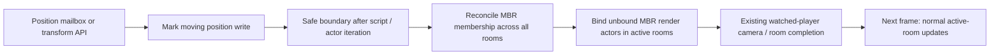

# Unloaded-source actor teleport fix — 2026-10-09

Script position writes now reconcile room membership for actors marked **Moves
Between Rooms**, including actors whose source room is inactive. A never-loaded
actor entering an already active room also receives its permanent assets.
The actor joins normal updates on the next frame without visiting its old room.

## Implementation



`Level::NotifyPositionWrite` marks a pending moving-object write.
`finishPositionWrites` runs before actor iteration, after actor scripts, and
after the Director. It coalesces separate X/Y/Z writes and never mutates room
lists while an actor iterator is using them. On a pending write it scans room
update lists, including inactive rooms, using `Room::UpdateRoomContents` with
an MBR-only filter. It then binds any unbound MBR render objects in the active
set through `ActiveRooms::BindUnboundMovingObjects`.

Inactive rooms participate in membership repair; their actors still do not run
physics or scripts until they belong to an active room. Permanent assets bind
once. The existing watched-player camera completion follows membership repair.
Normal frames without moving-object position writes incur no extra room scan.
The scan is linear in authored room-list entries per write boundary; a queued
per-object membership index would be a separate performance change.

Non-MBR relocation, outside-room removal and overlapping-room selection retain
their existing behavior. This fix does not rerun physics in the teleport frame.

## Regression

`unloaded_actor_teleports` uses the checked-in standalone fixture and the real
engine through `tests/reproduce_unloaded_actor.py --expect-fixed`. It tests:

- [x] Never-loaded MBR actor, and previously loaded / bound MBR actor.
- [x] Player script moves the target out of inactive D into active A.
- [x] One paused script frame writes the final pose; the following single frame
  increments the target heartbeat exactly once.
- [x] Target and active control continue updating over 120 Player updates.
- [x] Target becomes visible in A without reactivating D (screenshots inspected).
- [x] Movement into inactive D stops the target's script while assets stay bound.
- [x] Three repeated returns, including multiple position writes in one script.
- [x] Visiting D afterward and returning to A does not break the repaired actor.
- [x] Saved pre-fix engine fails the correctness regression on prompt updates.
- [x] Release watched-player script and transform teleports still pass.
- [x] Mutation smoke and bridge checks pass; bridge's first run missed its ping
  reply while all seven mutation checks passed, and its isolated rerun passed.
- [x] Assertions-enabled full suite: 24/24 tests passed, including all three
  teleport regressions and the mutation bridge checks.
- [ ] Android/Chromecast verification of this specific case.

Receipts, screenshots and logs live under [unloaded-actor/fixed/](unloaded-actor/fixed/).
Final assertions binary SHA-256:
`d31dd0ca221fcf71c056c4979fc4fb3a16ff063cf0c4919d88cae4385e1c863e`.
Correctness fixture SHA-256:
`14c6e203e4d05d8cbaad6869647bd8c671c324f34216b7d963f4190cb50684b8`.
The historical failing reproduction is preserved in
[unloaded-actor-review.md](unloaded-actor-review.md).

```sh
ctest --test-dir build-teleport -R 'unloaded_actor_teleports|cross_room_teleports' --output-on-failure
```

The generator option `--unloaded-actor` adds actors 20/21 and Player commands
7 (target into A), 8 (target into inactive D) and 9 (D then A writes in one
script). Distinct global heartbeat mailboxes are 480/481/482. Omitting
`--expect-fixed` still runs the historical defect assertions against an old
binary. The original default teleport fixture remains unchanged.

Implementation:
[Level](../../wfsource/source/game/level.cc),
[room membership](../../wfsource/source/room/room.cc),
[active-room binding](../../wfsource/source/room/actrooms.cc),
[regression harness](../../tests/reproduce_unloaded_actor.py).
