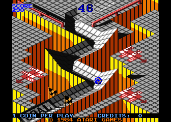
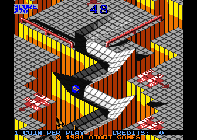
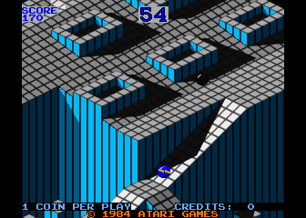
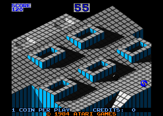
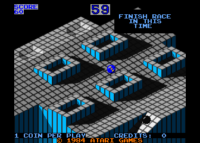
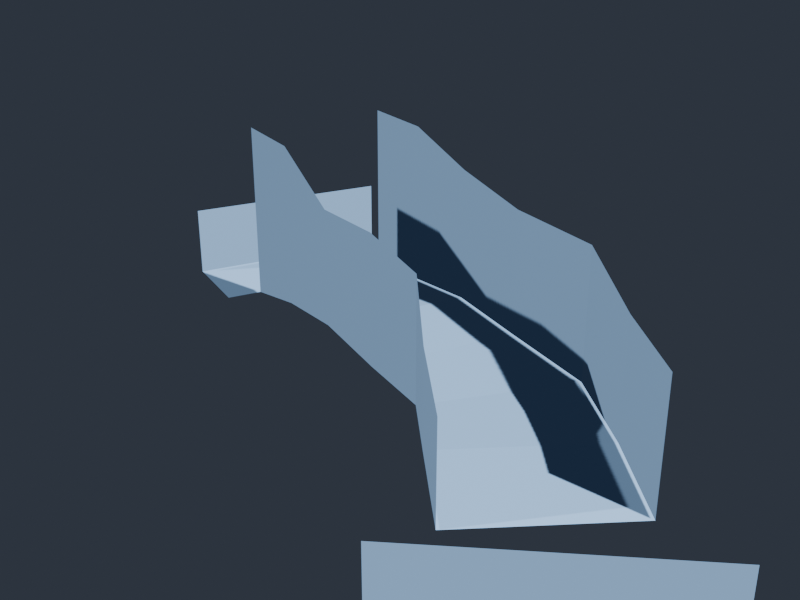
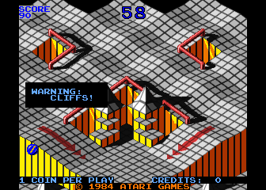

# Investigation: Marble Madness Level Elevations — Practice & Beginner

**Date:** 2026-05-01  
**Source data:** [`wflevels/marble-madness/levels.json`](../../wflevels/marble-madness/levels.json)  
**Related:** [ROM level-data investigation](2026-05-01-marble-madness-rom-level-data.md)

---

## Context

The current WF implementation (`mm_fromscratch`) is built from the **Practice** level — Marble Madness's tutorial/demo, not a race. The first actual playable race is **Beginner**. This doc dumps full elevation tables for both so we can compare the ROM geometry against what the engine currently renders.

**Calibration constants** (from `rom_to_blender.py`):

| Constant   | Value  | Meaning |
|------------|--------|---------|
| `H_ZERO`   | 5      | h_center value → Z = 0 (goal/start platform height) |
| `GAME_UNIT`| 0.05 m | metres per game-unit above H_ZERO |
| `SEG_LEN`  | 2.5 m  | metres per segment (forward step) |
| `PATH_HALF`| 2.0 m  | metres from centre to each edge vertex |

Z values: `Z = (h_value − 5) × 0.05 m`

**Calibration rationale:** GAME_UNIT was reduced from 0.1 to 0.05, and PATH_HALF from 4.0 to 2.0, after comparing WF renders against MAME captures (frame_0007 = Beginner race, frame_0018 = Practice). With GAME_UNIT=0.1 the Beginner trough walls hit 49–66° — visually too steep in WF's perspective camera. At 0.05 the wall angles are 30–48°, matching the arcade's visual profile (shallower approach troughs, deeper bowl at seg 6). PATH_HALF=2.0 m gives a ball-to-wall ratio that matches the arcade's marble appearing to nearly touch the trough sides at the widest point.

Cross-section **shape classification**:
- **crowned** — center higher than both edges; ball must be steered or it rolls off
- **trough** — both edges higher than center; ball is contained
- **wall-left / wall-right** — one edge higher than center
- **GOAL/START** — h_center ≤ H_ZERO (= 5); flat platform at Z = 0 in WF

---

## Practice Level (13 segments)

The tutorial level. All of segs 0–8 are at heading **18.28°** (ENE). Segs 9–10 turn
to **45°** (NE). Segs 11–12 are the goal zone.

| Seg | Type   | Hdg °  | h_L | h_C | h_R | Z_L   | Z_C   | Z_R   | Shape      | Note |
|-----|--------|--------|-----|-----|-----|-------|-------|-------|------------|------|
|  0  | 0x000D | 18.28  |  16 |  17 |  16 | +0.55 | +0.60 | +0.55 | crowned    | start |
|  1  | 0x000D | 18.28  |  24 |  26 |  16 | +0.95 | +1.05 | +0.55 | crowned    | |
|  2  | 0x000D | 18.28  |  16 |  27 |  24 | +0.55 | +1.10 | +0.95 | crowned    | |
|  3  | 0x000D | 18.28  |  28 |  28 |  16 | +1.15 | +1.15 | +0.55 | wall-right | |
|  4  | 0x000D | 18.28  |  16 |  29 |  28 | +0.55 | +1.20 | +1.15 | crowned    | |
|  5  | 0x000D | 18.28  |  28 |  27 |  24 | +1.15 | +1.10 | +0.95 | wall-left  | |
|  6  | 0x000D | 18.28  |  24 |  26 |  28 | +0.95 | +1.05 | +1.15 | wall-right | |
|  7  | 0x000D | 18.28  |  34 |  27 |  24 | +1.45 | +1.10 | +0.95 | wall-left  | |
|  8  | 0x000D | 18.28  |  24 |  26 |  34 | +0.95 | +1.05 | +1.45 | wall-right | |
|  9  | 0x0320 | **45.00** | 52 | 31 | 47 | +2.35 | +1.30 | +2.10 | **trough** | TURN +26.7°; wall 16–18° |
| 10  | 0x0320 | 45.00  |  48 |  30 |  51 | +2.15 | +1.25 | +2.30 | trough     | crest; wall 14–18° |
| 11  | 0x0D20 | 45.00  |  72 |   5 |  64 | +3.35 |  0.00 | +2.95 | GOAL/START | goal platform |
| 12  | 0x0D20 | 45.00  |  72 |   5 |  68 | +3.35 |  0.00 | +3.15 | GOAL/START | goal platform |

**Key observations:**
- Segs 0–8 are mostly **crowned** — the centre spine is the high point, edges lower. The marble must be actively steered or it falls off the sides. This is the signature S-curve steering challenge.
- Segs 1–8: h_left and h_right alternate high/low (L>R then R>L etc.) — the cross-path tilt reverses each segment, creating the S-bend.
- Segs 9–10 switch to deep **trough** — walls at +4.2–4.7 m vs floor at +2.5–2.6 m. The ball rolls freely downhill to the goal from here.
- Seg 11–12: goal zone, Z = 0.

---

## Beginner Level (9 segments) — Race 1

The first competitive race. Heading starts at **56.25°**, turns to **66.09°**, then **90°** (due North).

| Seg | Type   | Hdg °  | h_L | h_C | h_R | Z_L   | Z_C   | Z_R   | Wall° L | Wall° R | Shape      | Note |
|-----|--------|--------|-----|-----|-----|-------|-------|-------|---------|---------|------------|------|
|  0  | 0x0D28 | 56.25  |  61 |   3 |  56 | +2.90 | −0.10 | +2.65 | —       | —       | GOAL/START | h_center < H_ZERO — start platform |
|  1  | 0x142F | 66.09  |  64 |  18 |  78 | +2.95 | +0.65 | +3.65 | 30°     | 37°     | trough     | TURN +9.8° |
|  2  | 0x142F | 66.09  |  67 |  21 |  78 | +3.10 | +0.80 | +3.65 | 29°     | 36°     | trough     | |
|  3  | 0x1F40 | **90.00** | 81 | 19 | 86 | +3.80 | +0.70 | +4.05 | 38°     | 41°     | trough     | TURN +23.9° |
|  4  | 0x1F40 | 90.00  |  87 |  20 |  86 | +4.10 | +0.75 | +4.05 | 40°     | 40°     | trough     | |
|  5  | 0x1F40 | 90.00  |  84 |  22 |  94 | +3.95 | +0.85 | +4.45 | 38°     | 43°     | trough     | spawn here |
|  6  | 0x2940 | 90.00  | 105 |  16 | 107 | +5.00 | +0.55 | +5.10 | 48°     | 49°     | trough     | deep walls |
|  7  | 0x3240 | 90.00  | 110 |   5 | 109 | +5.25 |  0.00 | +5.20 | —       | —       | GOAL/START | goal platform |
|  8  | 0x3240 | 90.00  | 114 |   5 | 109 | +5.45 |  0.00 | +5.20 | —       | —       | GOAL/START | goal platform |

**Key observations:**
- All 7 path segments (1–6) are **troughs** — the ball is contained on all sides. Beginner is much easier to steer than Practice.
- **Seg 0 anomaly**: h_center = 3 < H_ZERO (5), so `rom_to_blender.py` currently treats it as a goal sentinel and skips it. But it appears at the *start* of the level — it's probably the **start platform**, not a goal. The filter `h_center ≤ H_ZERO → goal` is wrong for this segment.
- Walls are significantly taller than Practice: Z_wall reaches +10 m at the end vs +4.7 m in Practice.
- Path turns twice: +9.8° at seg 1, then +23.9° at seg 3 (total: from 56° to 90° = due North by the goal).
- Goal zone: segs 7–8, h_center = 5 = H_ZERO → Z = 0.

---

## Comparison: Practice vs Beginner

| Property | Practice | Beginner |
|----------|----------|----------|
| Segments | 13 | 9 |
| Path type | Crowned (segs 0–8), then trough | All trough |
| Difficulty | Must steer across crowned sections | Ball stays in trough |
| Starting heading | 18.28° (ENE) | 56.25° (NE-ish) |
| Final heading | 45.00° (NE) | 90.00° (N) |
| Goal Z | 0.0 m | 0.0 m |
| Max wall height | +2.35 m | +5.45 m |
| Max wall angle  | ~18° (trough segs) | ~49° (deep seg 6) |
| Seg-0 anomaly | h_center = 17 (normal) | h_center = 3 (below H_ZERO — start platform bug) |

---

## Reference screenshots

### Practice level — arcade (MAME captures)

**t≈15s** — marble on crowned S-curve (segs 0–8). No containment walls; marble must be actively steered or it rolls into the void. The orange void flanking the path is the defining visual of Practice.

**t≈65s** — later in the run, marble still traversing crowned sections, nearing the trough transition (segs 9–10).

---

### Beginner level — arcade (MAME captures)

**t≈35s** — marble mid-race in deep trough. Wall height here corresponds roughly to segs 3–4 (Z_wall ≈ +4 m); ball is fully contained.

**t≈55s** — near the goal end of Beginner; trough walls at maximum height (seg 6: Z_wall ≈ +5 m). Note: also stored as `img/mame-practice-level.png` (mislabeled there).

**Finishing** — "FINISH RACE IN THIS TIME"; marble crossing the goal platform (segs 7–8, h_center = H_ZERO → Z = 0).

---

### WF Blender: Beginner path mesh (GAME_UNIT=0.05, 2026-05-01)

Two turns visible (seg 1 +9.8°, seg 3 +23.9°); trough walls grow toward the goal end matching the arcade profile.

---

### Other — "WARNING: CLIFFS!" (MAME capture, Intermediate or later)

Included for reference: the cliff hazard geometry (sharp drop-offs with danger arrows) that does not appear in Practice or Beginner.

---

## What the current WF implementation has

`mm_fromscratch` is built from the **Practice** level. The Beginner level has not been converted. The main geometry difference: Practice segs 0–8 are crowned (open-sided), which is why the marble tends to fall off — there are no walls on most of the path. That is correct arcade behaviour for Practice; it is *not* what Beginner looks like.

To build the Beginner level: pass `'Beginner'` to `rom_to_blender.py::build_path_mesh()`, and fix the seg-0 start-platform filter (h_center = 3 should not be treated as a goal).
