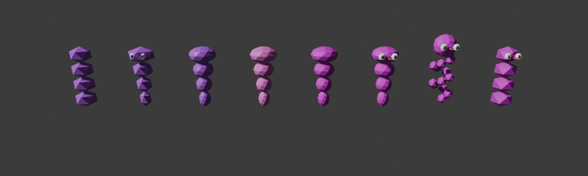

# Q*bert Coily snake — historical mesh versions

**Date:** 2026-05-11
**Purpose:** Lay out every distinct Coily snake mesh shape that has been in the codebase so the user can point at the one they originally meant by "the coil that's already there". Each variant rebuilt from the parameters in its commit (verified via `git show <sha>:wflevels/qbert_practice/blender_create_qbert.py`).

## Side-by-side lineup (left → right)

| # | Commit | Title | Body shape | Colour | Eyes | Tongue |
|---|---|---|---|---|---|---|
| **V0** | `5d2b345` | Original pre-mesh-changes | 4 equal-radius (0.40) Z-squashed icosahedra stacked at 0.55 spacing | deep purple `(0.45, 0.08, 0.75)` | — | — |
| **V1** | `1527e14` | "Snake silhouette with distinct head" | 4 *tapered* segments, radii `[0.22, 0.30, 0.38, 0.50]` bottom→top, subdiv 1 | deep purple `(0.45, 0.08, 0.75)` | buried at x=0.32 inside the 0.50-radius head | — |
| **V2** | `cb42484` | Doubled face count | Same shape as V1, **subdiv 2** segments | deep purple `(0.45, 0.08, 0.75)` | buried | — |
| **V3** | `6a5dc2e` | Arcade-faithful colours (first pass, eyeballed) | Same shape as V2 | recoloured `(0.85, 0.15, 0.70)` | buried | — |
| **V4** | `7ebac47` | Pixel-accurate colours | Same shape as V3 | pure magenta `#BA00BA` `(0.73, 0.00, 0.73)` | buried | — |
| **V5** | `1c3a4ac` | Eyes-to-surface + forked tongue | Same shape as V4 | `#BA00BA` | **on head surface** at x=0.48, grown to r=0.13; pupils at x=0.58 | **forked red tongue** `(0.90, 0.05, 0.10)` |
| **V6** | `346b5b0` | Helix reshape (REVERTED in `4674820`) | 14 small (r=0.18 subdiv 1) icospheres wound around a helix (radius 0.30, 2.5 turns over height 1.70) + bigger head sphere (r=0.42 subdiv 2) leaning forward | `#BA00BA` | on head surface | forked tongue |
| **V7** | `e91321a` (current) | Restored original-style equal stack + eyes + tongue | 4 equal-radius (0.40) **subdiv 1** segments at 0.55 spacing (matches V0's silhouette, smoother facets) | `#BA00BA` | head surface at x=0.38 (sized to 0.40-radius top sphere) | forked tongue |

## Notes per variant

### V0 — original (`5d2b345`)
The mesh that existed in the game before I touched it. Pure stack, no face features. Built via `_coily_build_mesh()` returning a single shared mesh datablock (verts + faces) reused by all Coily snake actors. From above, looks like a 4-coil spring viewed end-on; from the side, just a stack of squashed balls.

### V1 — first redesign (`1527e14`)
My unprompted reshape: I introduced per-segment radii so the top "head" was largest (0.50) and the bottom "tail" smallest (0.22), thinking that would make the head distinguishable. Eyes/pupils added at x=0.32 — but the head sphere has radius 0.50, so the eye spheres ended up *inside* the head, barely visible as faint bumps. This is the variant that read as "stack of tapered balls", not as a snake.

### V2 — smoother (`cb42484`)
Same V1 shape, body segments bumped from subdiv 1 to subdiv 2 as part of a project-wide face-count doubling pass. Eyes still buried.

### V3 — first colour fix (`6a5dc2e`)
After cropping arcade reference, recoloured Coily body from deep purple to `(0.85, 0.15, 0.70)` — eyeballed approximation. Shape unchanged.

### V4 — pixel-accurate colour (`7ebac47`)
After programmatic pixel-sampling of HG101-04 arcade screenshot, swapped to true arcade magenta `#BA00BA`. Still the tapered V1/V2 shape with buried eyes.

### V5 — eyes out + tongue (`1c3a4ac`)
Pushed eye-spheres from x=0.32 to x=0.48 (head sphere surface) and grew them from r=0.11 to r=0.13. Pupils moved correspondingly. Added two red forked-tongue cones protruding +X. First variant where the snake actually reads as a snake from the camera angle.

### V6 — helix (`346b5b0`, reverted)
I read "arcade Coily is a coil" too literally and rebuilt the body as an actual helix of 14 small balls wound around the Z axis, with a separate head sphere on top. Looked like a string of beads with a head, not a snake. Reverted in `4674820`.

### V7 — current (`e91321a`)
Restored the V0 equal-radius stack (subdiv 1 for smoother facets) and kept V5's eyes-on-surface + forked tongue. The stack itself IS the coil silhouette; the head features make it read as Coily rather than a generic stack.

## What to do next

Which of V0–V7 is the silhouette you originally meant? I can:

- Restore exactly that variant (with or without the V5 eyes/tongue), or
- Tell me a different combination ("V0 body + V5 face") and I'll wire it up.
