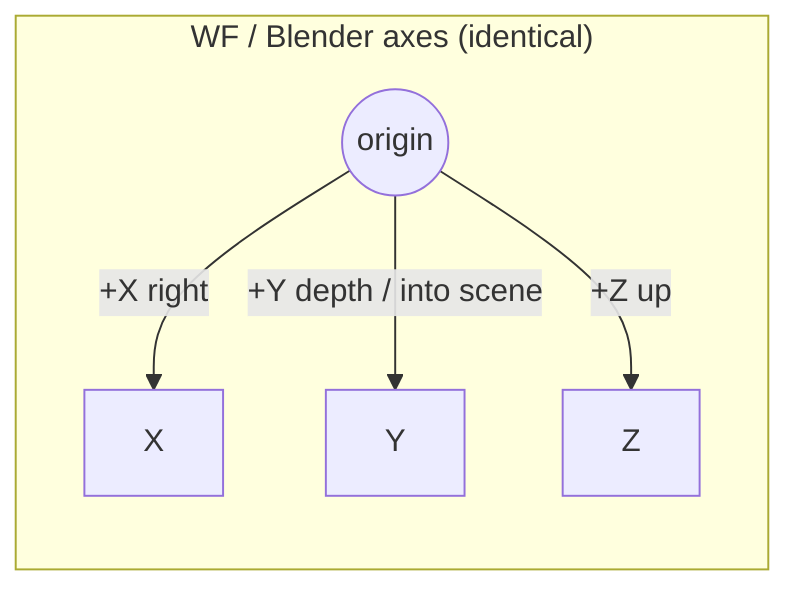
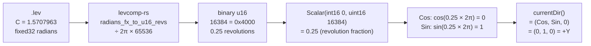
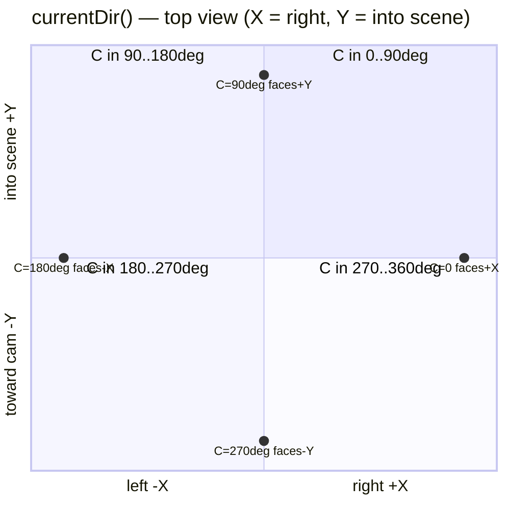
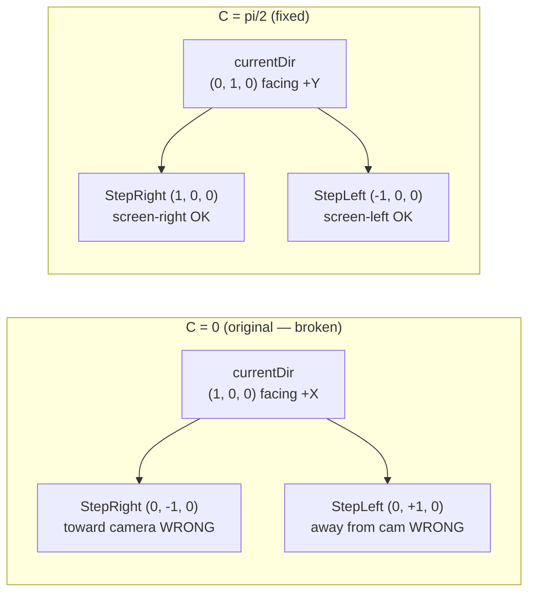
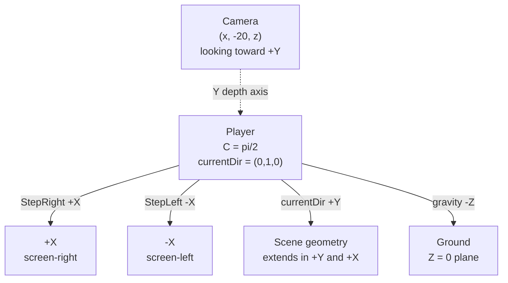

# WF coordinate system, Euler angles, and `currentDir()`

**Context:** Implementing SMB W1-1 in WF. After fixing camera placement the player
became visible, but pressing joystick-RIGHT moved the player toward the camera (−Y)
instead of screen-right (+X). Tracing the bug required reading the full numeric chain
from the `.lev` Euler field through `Angle::Sin/Cos` down to `currentDir()`.

---

## 1. Coordinate system

WF and Blender share the same axis convention. `bl_to_wf()` in
`wftools/wf_blender/export_level.py:282` is an identity transform; Euler angles
map 1-to-1 (`rotation_euler[0,1,2]` → WF `a,b,c`) with no additional rotation.

| Axis | Direction |
|------|-----------|
| X | right |
| Y | depth (into screen in a side-view level) |
| Z | up |



---

## 2. WF Euler angles and the encoding pipeline

Stored per-object as `{ 'EULR' { 'NAME' "Orientation" } { 'DATA' a b c } }` in the
`.lev` text source. Each component is a 32-bit fixed-point (1.15.16) radian value.
The chain from text source to runtime trig:



`levcomp-rs` conversion (`wftools/levcomp-rs/src/lvl_writer.rs:517`):

```rust
fn radians_fx_to_u16_revs(fx: i32) -> u16 {
    let revs = (fx as f64 / 65536.0) / TWO_PI;  // radians → revolutions (0..1)
    (revs * 65536.0) as u16
}
```

The engine reads back a raw `uint16` via `binistream >> angle._value`
(`wfsource/source/math/angle.cc:61`).

---

## 3. `Angle::Sin()` and `Angle::Cos()`

`wfsource/source/math/angle.hpi:311-325`:

```cpp
INLINE Scalar Angle::Sin() const {
    Scalar temp(int16(0), _value);   // builds revolution fraction as Scalar
    return temp.Sin();
}
```

`Scalar(int16 integer, uint16 frac)` on the float build (`scalar.hpi:79`):

```cpp
_value = integer + (FLOAT_TYPE)frac / SCALAR_ONE_LS;   // frac / 65536
```

So `Scalar(0, 16384)._value = 0.25`.

`Scalar::Sin/Cos` on the float Linux build (`scalar.cc:531,551`):

```cpp
return Scalar(sin(_value * (2.0 * PI)));   // revolution fraction × 2π
return Scalar(cos(_value * (2.0 * PI)));
```

The fixed-point path uses a 256-entry lookup table indexed on the same convention.

---

## 4. `currentDir()` — the wrong comment

`wfsource/source/physics/physicalobject.hpi:50`:

```cpp
INLINE Vector3 PhysicalObject::currentDir() const {
    return Vector3(
        GetPhysicalAttributes().Rotation().GetC().Cos(),
        GetPhysicalAttributes().Rotation().GetC().Sin(),
        Scalar::zero );
}
```

This returns **(cos C, sin C, 0)**.

There is a comment in `wfsource/source/movement/movement.cc:698`:

```cpp
Vector3 fwd = movementObject.currentDir();  // (sin C, cos C, 0)   ← WRONG
```

**The comment is wrong.** The implementation is authoritative:
`currentDir() = (cos C, sin C, 0)`.

The comment reflects a compass-heading convention (C=0 = North = +Y → `(sin C, cos C, 0)`).
The code uses the standard math convention (C=0 = East = +X → `(cos C, sin C, 0)`).

### Heading wheel — `currentDir()` by Euler C (top view)



| C (radians) | C (degrees) | u16 | currentDir | faces |
|-------------|-------------|-----|-----------|-------|
| 0 | 0° | 0 | (1, 0, 0) | +X |
| π/2 | 90° | 16384 | (0, 1, 0) | +Y (into scene) |
| π | 180° | 32768 | (−1, 0, 0) | −X |
| 3π/2 | 270° | 49152 | (0, −1, 0) | −Y (toward camera) |

---

## 5. Doom-stick strafe formula

GroundHandler and AirHandler share the same strafe formula
(`movement.cc:307-333, 762-770`) when TurnRate = 0:

```
stepVector = currentDir()         = (cos C, sin C, 0)
StepLeft  += (−stepVector.Y, +stepVector.X, 0) = (−sin C,  cos C, 0)
StepRight += (+stepVector.Y, −stepVector.X, 0) = ( sin C, −cos C, 0)
```

StepRight is 90° **clockwise** from currentDir (top view).

### Bug vs Fix — strafe directions at C=0 vs C=π/2



---

## 6. Root cause of the SMB W1-1 movement bug

The `.lev` had `C = 0.0` (from `player.rotation_euler.z = 0.0` in
`blender_create_smb.py`). With C=0 → `currentDir = (1,0,0)` → `StepRight = (0,−1,0)`,
directly toward the camera at Y=−20. The ground platform only extends ±1.5 units
in Y, so the player immediately fell off the edge.

---

## 7. Fix

Set C = π/2 so the player faces +Y (into the scene) and StepRight = +X.

**`wflevels/smb_w1_1/smb_w1_1.lev` — Player Orientation:**

```
Before: { 'EULR' … 'DATA' 0.0 -0.0 0.0000000000000000(1.15.16) }
After:  { 'EULR' … 'DATA' 0.0  0.0 1.5707963267948966(1.15.16) }
```

**`wflevels/smb_w1_1/blender_create_smb.py`:**

```python
# Before
player.rotation_euler.z = 0.0
# After — C=π/2 → faces +Y, strafes ±X
player.rotation_euler.z = math.pi / 2
```

---

## 8. Side-scroller recipe

For any side-scroller with camera at Y < 0 looking toward +Y:

1. Set `player.rotation_euler.z = math.pi / 2` (WF Euler C = π/2 ≈ 1.5707963).
2. Set `Turn Rate = 0` (doom-stick strafe mode, no rotation).
3. Map joystick LEFT → `kBtnStepLeft` (0x40) and RIGHT → `kBtnStepRight` (0x80).
4. Result: LEFT → −X (screen-left), RIGHT → +X (screen-right).



---

## 9. Files traced

| File | Role |
|------|------|
| `wfsource/source/physics/physicalobject.hpi:50` | `currentDir()` — authoritative implementation |
| `wfsource/source/math/angle.hpi:311-325` | `Angle::Sin/Cos` — wraps Scalar with revolution fraction |
| `wfsource/source/math/scalar.hpi:79` | `Scalar(int16, uint16)` — builds revolution scalar |
| `wfsource/source/math/scalar.cc:531,551` | `Scalar::Sin/Cos` — `sin/cos(value × 2π)` |
| `wfsource/source/math/angle.cc:59` | `binistream >> Angle` — reads raw `uint16` |
| `wfsource/source/math/euler.hpi:131` | `Euler::Read` — `binis >> _a >> _b >> _c` |
| `wftools/levcomp-rs/src/lvl_writer.rs:517` | `radians_fx_to_u16_revs` — compile-time radian→revolution |
| `wfsource/source/movement/movement.cc:276-333` | GroundHandler doom-stick strafe |
| `wfsource/source/movement/movement.cc:762-770` | AirHandler doom-stick strafe |
| `wfsource/source/movement/movement.cc:698` | **Wrong comment**: says `(sin C, cos C, 0)` |
| `wflevels/smb_w1_1/smb_w1_1.lev:872` | Player Euler C field (now π/2) |
| `wflevels/smb_w1_1/blender_create_smb.py:274` | `rotation_euler.z` (now `math.pi / 2`) |
| `CLAUDE.md` (repo root) | Coordinate system section added |
