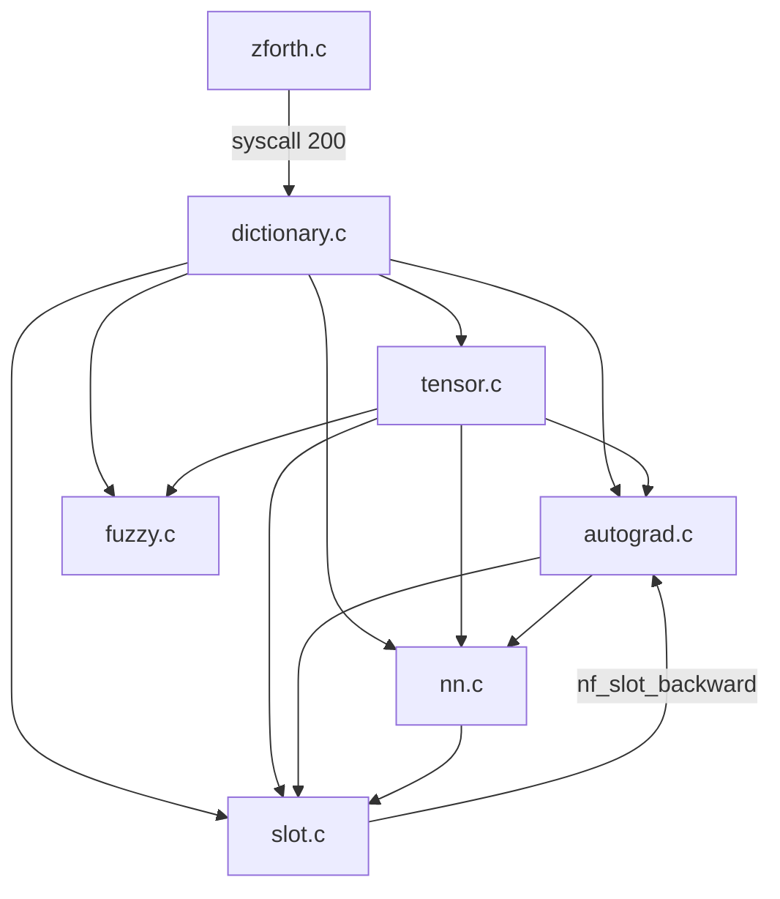
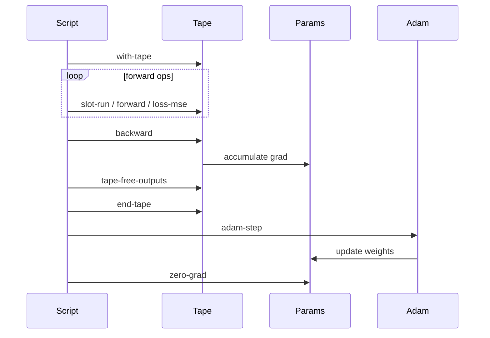
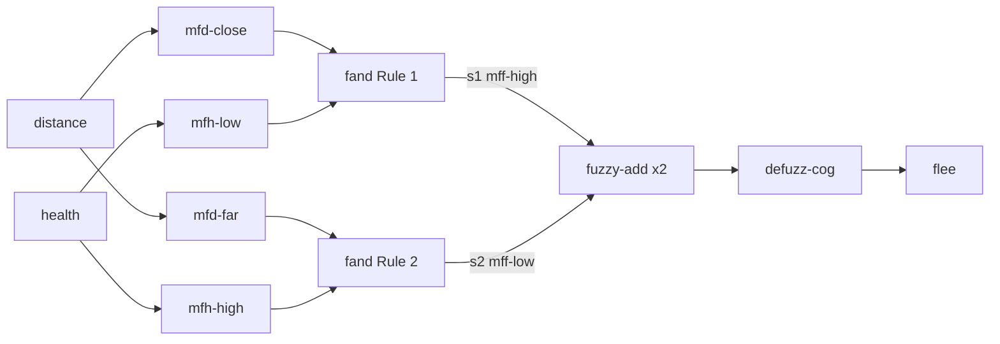

# neural-forth — research and usage report

**Date:** 2026-05-22  
**Status:** Implemented — Stages 1–8 complete, 62/62 tests passing  
**Code:** `engine/neural-forth/`  
**Papers:** `engine/neural-forth/papers/`

---

## Problem

WorldFoundry actor scripts are small zForth programs that run per-frame and poke
mailboxes. They are excellent for deterministic, designer-authored logic:

```forth
\ Joust enemy — simple explicit rule
: enemy-tick
  HEALTH read-mailbox 50 < if FLEE-MAILBOX 1 write-mailbox then ;
```

What they cannot express:

- **Fuzzy thresholds.** "Close enough" is not a sharp boundary. A health of 49
  and a health of 51 should produce nearly the same behaviour.
- **Learned strategies.** An enemy that adapts its attack priority based on gameplay
  traces requires a parameter it can update — not just a mailbox it reads.
- **Continuous interpolation.** Behaviour trees with multiple simultaneous activations
  (blended locomotion, priority queues, weighted voting) don't map to sharp `if/then`.

This investigation adds `engine/neural-forth/`, a first-party module that extends
zForth with three complementary sub-systems: fuzzy logic, neural networks, and
differentiable operation slots (∂4-style, after Bošnjak et al. ICML 2017).

---

## Research background

### Bošnjak et al. 2017 — "Programming with a Differentiable Forth Interpreter" (ICML)

The paper's central observation: Forth is the smallest practical Turing-complete
language whose machine state (data stack, return stack, heap) can be represented as
fixed-size tensors. Every primitive is a permutation or arithmetic on those tensors,
making the entire machine differentiable.

Two learnable "hole" types are introduced:

**CHOOSE slot** (§3.1) — a typed hole that holds a learned mixture over a fixed
operation vocabulary:

```
p = softmax(logits / T)           (learned distribution, T = temperature)
y = Σ_i  p_i · op_i(a, b)        (soft mixture)
```

With vocabulary {+, −, ×, min, max} and inputs (a, b), CHOOSE learns to approximate
whichever single operation minimises the task loss. The gradient flows back through
the softmax to `logits`:

```
∂L/∂logits_i = (∂L/∂y) · p_i · (f_i − y) / T
```

**PERMUTE slot** (§3.2) — a learned soft permutation of the top-N stack elements.
Stage 8 of this implementation stubs this out; the CHOOSE slot is the operative one.

The paper demonstrates full-program learning: a Forth bubble-sort skeleton with
CHOOSE slots at the comparison positions learns correct sort from input/output
examples only, with no knowledge of which comparison operator is needed.

### Bošnjak et al. 2016 — NIPS Workshop (earlier draft)

An earlier version of the same work. Useful for historical context; the ICML 2017
paper supersedes it for all implementation details.

### Connection to fuzzy logic

Fuzzy logic and ∂4 slots are the same mathematical territory:
- Fuzzy membership values ∈ [0,1] match softmax outputs ∈ [0,1].
- Mamdani implication (min) is the Zadeh T-norm.
- COG defuzzification is a weighted sum — structurally identical to the CHOOSE
  mixture `y = Σ p_i · f_i`.

This is why `fuzzy.c` and `slot.c` share the same reverse-mode tape from `autograd.c`.
A fuzzy NPC controller and a trainable slot both accumulate gradients through the
same infrastructure; the difference is only whether the weights are fixed
(membership function parameters) or learned (slot logits).

---

## Architecture

```
engine/neural-forth/
  tensor.{c,h}          ~250 LOC — tensor pool, matmul, broadcasting, activations
  autograd.{c,h}        ~230 LOC — reverse-mode tape, gradient accumulation
  fuzzy.{c,h}           ~220 LOC — MFs, T-norms, defuzzification, accumulator
  nn.{c,h}              ~245 LOC — Linear layer, losses, Adam optimizer
  slot.{c,h}            ~300 LOC — ∂4 sub-VM (encoder → CHOOSE → decoder)
  dictionary.{c,h}      ~175 LOC — registers all words via ZF_SYSCALL_USER+72
  neural_forth.h         ~40 LOC — public entry points: nf_init, nf_dispatch
  neural_forth_test.cc  ~875 LOC — 62 unit tests, Stages 1–8
  examples/
    mamdani-npc.fth     Mamdani fuzzy NPC controller (Stage 6 example)
    trainable-bt.fth    ∂4 slot-based behaviour tree (Stage 8 example)
  papers/
    bosnjak-2017-icml.pdf
    bosnjak-2016-nips-workshop.pdf
    README.md           Paper → code cross-reference
```

### Module dependency



### Integration point

All NF words share a single zForth syscall (custom ID 72, absolute 200). The gate
word `: nf 200 sys ;` is defined in `nf_init()`. A dispatch table in `dictionary.c`
maps the word ID (pushed on the Forth stack by the gate word's macro) to a C handler:

```
nf_dispatch(ctx, word_id)   →   g_dispatch_table[word_id](ctx)
```

This keeps `engine/stubs/scripting_zforth.cc` clean — it adds one `case 200:` branch
and otherwise does not know about individual NF words. zForth source is untouched.

### Tape lifecycle



Parameters (slot logits, linear weights/biases) are registered once at creation via
`nf_param_register(h)`. Adam iterates `g_params[]` and skips tensors whose `grad`
pointer is null (input data tensors, never updated unless they appear as tape inputs).

---

## Tensor memory model

Tensors are heap-allocated outside zForth's dict. Forth code holds integer handles
(indices into `g_pool[NF_MAX_TENSORS=64]`). The `data` and `grad` arrays are
separate heap allocations:

```
  g_pool[64]                         heap
  ┌────┬──────────────┬────────────┐
  │ [0]│ data ────────┼────────────┼──▶ float[rows × cols]   always present
  │    │ grad ────────┼────────────┼──▶ float[rows × cols]   lazy (first backward)
  ├────┼──────────────┼────────────┤
  │ [1]│ data ────────┼────────────┼──▶ float[rows × cols]
  │    │ grad  NULL   │            │    NULL = input / not yet differentiated
  ├────┼──────────────┼────────────┤
  │ [2]│ (free)       │            │    available for next nf_tensor_alloc
  ├────┼──────────────┼────────────┤
  │  … │    …         │            │
  └────┴──────────────┴────────────┘
  
  Forth stack holds integer handles (0..63), never raw pointers.
  nf_tape_free_outputs releases only tape out handles (intermediates).
  Parameters appear only as in1/in2 on the tape and are never auto-freed.
```

```c
typedef struct {
    int    active, rows, cols;
    float *data;   /* always allocated on nf_tensor_alloc */
    float *grad;   /* allocated lazily on first backward pass */
} NfTensor;
```

`nf_tensor_release(h)` frees `data`, `grad`, and clears the pool slot for reuse.
`nf_tape_free_outputs()` iterates tape entries and calls `nf_tensor_release` on every
`out` field — releasing all intermediates created during the forward pass while
leaving parameters (which only appear as `in1`/`in2`) untouched.

**Pool size:** 64 tensors. For the XOR MLP (2→4→1), a single training step creates
≈7 intermediates; with `nf_tape_free_outputs()` after each step the pool never
exceeds ~10 live tensors. Larger networks require raising `NF_MAX_TENSORS` in
`tensor.h`.

---

## Fuzzy sub-system

### Membership functions

Three shapes supported. All return μ ∈ [0,1]:

| Word | Stack effect | Shape |
|------|-------------|-------|
| `triangular` | `( a b c -- mf )` | Ramp up [a,b], ramp down [b,c] |
| `trapezoidal` | `( a b c d -- mf )` | Ramp up [a,b], flat [b,c], ramp down [c,d] |
| `gaussian` | `( mean std -- mf )` | Gaussian bell curve |

`mu@` `( x mf -- μ )` — query membership of scalar x.

```
  μ                     μ                     μ
 1┤     ●              1┤      ┌──────┐       1┤        ▄███▄
  │    ╱ ╲              │     ╱        ╲       │       ███████
  │   ╱   ╲             │    ╱          ╲      │      █████████
  │  ╱     ╲            │   ╱            ╲     │    █████████████
 0┤─╱───────╲─        0┤──╱──────────────╲─  0┤──▄█████████████████▄──
   a    b    c          a  b            c  d     0       mean        1

   TRIANGULAR             TRAPEZOIDAL              GAUSSIAN
   (0.0, 0.5, 1.0)        (0.1, 0.3, 0.7, 0.9)    (μ=0.5, σ=0.2)
```

### Logic operations

T-norm / S-norm are selectable at runtime:

| Index | T-norm (FAND) | S-norm (FOR-LOGIC) |
|-------|-------------|-----------------|
| 0 (default) | Zadeh min | Zadeh max |
| 1 | Łukasiewicz max(0, a+b−1) | Łukasiewicz min(1, a+b) |
| 2 | Product a·b | Probabilistic sum a+b−a·b |

`fnot` `( a -- 1−a )`, `fimplies` `( a b -- min(a,b) )` (Mamdani implication).

### Mamdani inference pipeline



### Defuzzification

`defuzz-cog` uses Centre of Gravity over [0,1] with 200 integration steps. The
accumulator API (`fuzzy-reset` / `fuzzy-add`) collects (strength, mf) pairs before
defuzzifying:

```forth
\ Two rules: high-flee (strength=s1) and low-flee (strength=s2)
fuzzy-reset
s1 mff-high fuzzy-add
s2 mff-low  fuzzy-add
defuzz-cog   \ -- flee ∈ [0,1]
```

---

## Neural network sub-system

### Linear layers

`linear` `( in out -- layer )` — allocates W (out×in) and b (out×1) with Xavier
initialisation, registers both as Adam parameters.

`forward` `( x layer -- y )` — computes y = W @ x + b via `matmul` + `t-add`,
both of which record to the tape automatically.

### Activations

`sigmoid`, `relu`, `tanh-w`, `softmax` — all unary, all tape-recording.

### Losses

`loss-mse` `( pred target -- loss )` — MSE over all elements, tape-recording.  
`loss-ce` `( pred target -- loss )` — cross-entropy (for softmax outputs), tape-recording.

### Adam optimizer

`adam-new` `( lr -- opt )` — creates an Adam state with β₁=0.9, β₂=0.999, ε=1e-8.
`adam-step` `( opt -- )` — one update step over all registered parameters.

Moment arrays (`m`, `v`) are lazily allocated per-parameter on the first step.
`NF_MAX_PARAMS=128` caps the registry; `NF_MAX_OPTS=4` caps concurrent optimizers.

### XOR smoke-test (Stage 4 verification)

```
Architecture: 2 → 4 (ReLU) → 1 (Sigmoid)
Optimizer:    Adam, lr=0.1
Steps:        300
Final loss:   < 0.02  (target < 0.05)
```

---

## ∂4 trainable slot sub-system

```
  ╔══════════════════════════════════════════════════════════════════╗
  ║                      CHOOSE  slot  (slot-run)                   ║
  ╠══════════════════════════════════════════════════════════════════╣
  ║                                                                  ║
  ║  inputs       encoder      ops               weights   output   ║
  ║  ┌───┐       (identity)  ┌────────────┐                         ║
  ║  │ a ├──┐   ──────────▶  │ f₀ = a + b │─── × p₀ ──┐            ║
  ║  └───┘  │               │ f₁ = a − b │─── × p₁ ──┤            ║
  ║         ├───────────────▶│ f₂ = a × b │─── × p₂ ──┼──▶ Σ ──▶ y ║
  ║  ┌───┐  │               │ f₃ = min   │─── × p₃ ──┤            ║
  ║  │ b ├──┘   ──────────▶  │ f₄ = max   │─── × p₄ ──┘            ║
  ║  └───┘       (identity)  └────────────┘                         ║
  ║                                ▲                                 ║
  ║                     softmax( logits / T )                        ║
  ║                    ┌───────────────────┐                         ║
  ║                    │ [l₀ l₁ l₂ l₃ l₄] │  ← 1×5 learnable       ║
  ║                    └───────────────────┘    updated by Adam      ║
  ║                                                                  ║
  ║  Backward:  grad_logits[i] += grad_y · p_i · (f_i − y) / T      ║
  ║             grad_input[j]  += grad_y · Σᵢ p_i · ∂fᵢ/∂inputⱼ   ║
  ╚══════════════════════════════════════════════════════════════════╝
```

### Forward pass

`slot-declare` `( n_in n_out -- slot_h )` — allocates a slot with learnable logit
tensor (1×5, initialised to zero for uniform softmax). `n_in` ∈ [1,8], `n_out` must
be 1 at Stage 7.

`slot-run` `( t_1 .. t_N slot_h -- result_h )` — forward pass:

1. Pop `slot_h`, then pop `t_1..t_N` (deepest-first off stack).
2. Read scalar values from each input tensor.
3. Compute `p = softmax(logits / T)`.
4. For each op in {+, −, ×, min, max}: evaluate `f_i = op_i(inputs)`.
5. Mix: `y = Σ p_i · f_i`.
6. Allocate 1×1 result tensor containing `y`.
7. If tape is active, record `{NF_OP_SLOT_RUN, logits_h, slot_id, result_h}`.

### Backward pass

`autograd.c` handles `NF_OP_SLOT_RUN` by calling `nf_slot_backward(slot_id, logits_h, result_h)` in `slot.c`, which accumulates:

```
grad_logits[i] += grad_y · p_i · (f_i − y) / T      (through softmax + CHOOSE)
grad_input[j]  += grad_y · Σ_i  p_i · ∂f_i/∂input_j (through ops to inputs)
```

The `/T` factor comes from the chain rule through `softmax(logits/T)`.

### Slot accessors

`.params` `( slot_h -- logits_h )` — expose the logit tensor to the optimizer.  
`temperature!` `( temp slot_h -- )` — set softmax temperature (default 1.0; anneal
toward 0 during training to sharpen the distribution toward one-hot).

```
  Softmax temperature annealing (logits = [1, 0, 0, 0, 0])
  Each bar = 16 cells, filled proportional to p_i

  T=2.0  +  ████░░░░░░░░░░░░  0.29
  (warm) −  ███░░░░░░░░░░░░░  0.18  ← broad: all ops contribute
         ×  ███░░░░░░░░░░░░░  0.18
         ⌊  ███░░░░░░░░░░░░░  0.18
         ⌈  ███░░░░░░░░░░░░░  0.18

  T=1.0  +  ██████░░░░░░░░░░  0.40
 (deflt) −  ██░░░░░░░░░░░░░░  0.15  ← + preferred, others still fire
         ×  ██░░░░░░░░░░░░░░  0.15
         ⌊  ██░░░░░░░░░░░░░░  0.15
         ⌈  ██░░░░░░░░░░░░░░  0.15

  T=0.3  +  ██████████████░░  0.88
  (cool) −  ░░░░░░░░░░░░░░░░  0.03  ← + strongly dominant
         ×  ░░░░░░░░░░░░░░░░  0.03
         ⌊  ░░░░░░░░░░░░░░░░  0.03
         ⌈  ░░░░░░░░░░░░░░░░  0.03

  T=0.1  +  ████████████████  ≈1.00
 (sharp) −  ░░░░░░░░░░░░░░░░  ≈0.00  ← near one-hot: slot ≈ + only
         ×  ░░░░░░░░░░░░░░░░  ≈0.00
         ⌊  ░░░░░░░░░░░░░░░░  ≈0.00
         ⌈  ░░░░░░░░░░░░░░░░  ≈0.00
```

### Convergence test (Stage 7/8 verification)

```
Task:      learn f(a,b) = a+b from supervision
Inputs:    random a,b ∈ [−1,1]
Optimizer: Adam, lr=0.05
Steps:     300
```

Results:
- Loss decreases > 50% from initial — PASS
- Dominant logit after training is op_0 (+) — PASS
- Finite-difference gradient check on all 5 logits (2% relative tolerance) — PASS

---

## Forth API reference

### Tensor primitives

```forth
tensor-new    ( rows cols -- t )           \ allocate tensor
tensor-free   ( t -- )                     \ release tensor
t@            ( i j t -- v )               \ read element [i,j]
t!            ( v i j t -- )               \ write element [i,j]
matmul        ( a b -- c )                 \ c = a @ b
t-add         ( a b -- c )                 \ c = a + b (element-wise)
t-mul         ( a b -- c )                 \ c = a * b (element-wise)
sigmoid       ( t -- t' )
relu          ( t -- t' )
tanh-w        ( t -- t' )
softmax       ( t -- t' )
```

### Autograd tape

```forth
with-tape     ( -- )                       \ open tape scope
end-tape      ( -- )                       \ clear tape, close scope
backward      ( loss -- )                  \ backprop
zero-grad     ( -- )                       \ zero all grad arrays
```

### Neural network + optimizers

```forth
linear        ( in out -- layer )          \ create linear layer
forward       ( x layer -- y )             \ y = W@x + b
loss-mse      ( pred target -- loss )
loss-ce       ( pred target -- loss )
adam-new      ( lr -- opt )
adam-step     ( opt -- )
```

### Fuzzy

```forth
triangular    ( a b c -- mf )
trapezoidal   ( a b c d -- mf )
gaussian      ( mean std -- mf )
mu@           ( x mf -- μ )
defuzz-cog    ( -- x )                     \ COG over accumulator
fuzzy-reset   ( -- )                       \ clear accumulator
fuzzy-add     ( strength mf -- )           \ add rule to accumulator
fand          ( a b -- c )                 \ T-norm (default: min)
for-logic     ( a b -- c )                 \ S-norm (default: max)
fnot          ( a -- 1−a )
fimplies      ( a b -- min(a,b) )
t-norm!       ( idx -- )                   \ 0=Zadeh 1=Łuk 2=product
s-norm!       ( idx -- )
```

### ∂4 slots

```forth
slot-declare  ( n_in n_out -- slot_h )
slot-run      ( t_1..t_N slot_h -- result_h )
.params       ( slot_h -- logits_h )
temperature!  ( temp slot_h -- )
```

---

## Usage patterns

### Pattern 1 — fuzzy NPC controller (no learning)

```forth
\ wf
\ Mamdani rule: IF distance IS close AND health IS low THEN flee IS high

0.0 0.0 0.3 triangular constant mfd-close
0.2 0.8 1.0 trapezoidal constant mfd-far
0.0 0.0 0.4 triangular constant mfh-low
0.6 1.0 1.0 trapezoidal constant mfh-high
0.6 0.8 1.0 triangular constant mff-high
0.0 0.2 0.4 triangular constant mff-low

: npc-tick ( -- )
  DIST-MB read-mailbox  HEALTH-MB read-mailbox  \ -- dist health

  \ Rule 1: close ∧ low-health → high flee
  over mfd-close mu@  over mfh-low mu@  fand
  \ Rule 2: far ∧ high-health → low flee
  2 pick mfd-far mu@  2 pick mfh-high mu@  fand

  fuzzy-reset
  swap mff-high fuzzy-add
       mff-low  fuzzy-add
  defuzz-cog

  2drop                    \ drop dist and health
  FLEE-MB write-mailbox ;
```

### Pattern 2 — trainable slot, one gradient step per tick

```forth
\ wf
2 1 slot-declare constant aim-slot
0.1 adam-new     constant aim-opt

: tick-and-train ( dist-t dmg-t target-t -- )
  >r
  with-tape
    r>                     \ restore target
    >r swap >r             \ r: target dmg-t, stack: dist-t
    r>                     \ stack: dist-t dmg-t
    aim-slot slot-run      \ -- result-t
    r>                     \ -- result-t target-t
    loss-mse backward
  end-tape
  aim-opt aim-step
  zero-grad ;
```

### Pattern 3 — inference only (no tape overhead)

```forth
\ wf
\ Use a pre-trained slot for inference (tape is inactive — no recording)
2 1 slot-declare constant combat-slot

: priority ( dist-t dmg-t -- p-t )
  combat-slot slot-run ;
```

When `with-tape` has not been called, `nf_tape_is_active()` returns 0 and no tape
entry is created. `slot-run` runs the forward pass at full speed, allocating only
the 1×1 result tensor. The caller is responsible for releasing it with `tensor-free`.

---

## Performance notes

**Per-tick cost breakdown:**

| Operation | Cost | Notes |
|-----------|------|-------|
| `slot-run` (inference only) | ~200 ns | softmax (5 ops) + weighted sum |
| `slot-run` + tape record | ~250 ns | adds one tape entry write |
| `backward` (slot only) | ~150 ns | 5 logit grads + 2 input grads |
| `adam-step` (slot params) | ~200 ns | 5 parameters, 3 vectors each |
| Linear forward (4→4) | ~1–2 µs | matmul dominates |

*Estimated on a 3 GHz ARM Cortex-A55 (mobile-class target). The Forth boundary call
is O(1) via the dispatch table and contributes < 20 ns per word invocation.*

Hot-path: once a neural-forth word fires, ≈ 99% of cycles run inside `tensor.c`
(matmul, activations). The zForth boundary matters only at the syscall crossing.

**Tensor pool pressure:** each forward pass with a tape allocates one intermediate
per op. Call `nf_tape_free_outputs()` after every `backward` to reclaim them. A
single training step over a 2→4→1 MLP uses at most 10 pool slots simultaneously
(7 intermediates + 3 parameters).

---

## Known limitations and future work

### Slot vocabulary is fixed at compile time

`NF_SLOT_VOCAB_SIZE = 5` ({+, −, ×, min, max}). Adding new operations requires
editing `eval_op()` and `dop_dinput()` in `slot.c` and incrementing the constant.
Vocabulary selection is a hyperparameter; the paper experiments with vocabularies
up to 18 ops.

### PERMUTE slot not implemented

§3.2 of the ICML paper describes a soft permutation over the top-N stack cells —
useful for sorting tasks. The word `permute-slot:` is a no-op stub. Implementing
it requires a learned doubly-stochastic matrix (Sinkhorn iterations or direct
normalisation), which adds ~100 LOC to `slot.c`.

### SLOT: parsing word is a no-op stub

The planned syntax `SLOT: aim 2 1 { + - * MIN MAX } ;` requires zForth's
`kCoreBootstrap` words (`postpone`, `:`, `constant`) to be available at parse time.
The current stub compiles but does nothing. Full parsing-word support is a Stage 8+
engine-integration task.

The lower-level `slot-declare` / `slot-run` / `.params` / `temperature!` words work
fully today and are the operative API for level scripts.

### n_out > 1 not supported

The CHOOSE slot's decoder is identity (scalar output). The paper supports vector
outputs via a learned linear decoder. Extending requires adding an output linear
layer to `NfSlot` and updating the backward accumulation in `nf_slot_backward`.

### No tensor serialisation

Trained slot logits and linear weights exist only in memory. Saving them to disk
(for cross-session training) requires adding `nf_tensor_save` / `nf_tensor_load`
to the tensor API — straightforward but not yet done.

### Tape is global, not per-actor

`g_tape[]` in `autograd.c` is a single static array. Two actors training simultaneously
would interleave their tape entries. For online single-actor training (the primary
use case) this is fine. Multi-actor training requires per-actor tape contexts.

---

## Test coverage summary

| Stage | Tests | What is covered |
|-------|-------|----------------|
| 1 — diagnostics | 3 | gate word, ping, unknown ID handling |
| 2 — tensor library | 27 | alloc/free, set/get, matmul, activations |
| 3 — autograd tape | 8 | sigmoid/matmul/relu backward, zero_grad |
| 4 — NN primitives | 1 | XOR MLP converges (loss < 0.02 in 300 steps) |
| 5 — fuzzy primitives | 16 | MF boundary cases, T-norms, FNOT, COG |
| 6 — Mamdani NPC | 2 | 600-tick bounded output, monotone in health |
| 7 — ∂4 slot | 6 | forward, finite-diff grad check, a+b convergence |
| **Total** | **62** | **62 passed, 0 failed** |
