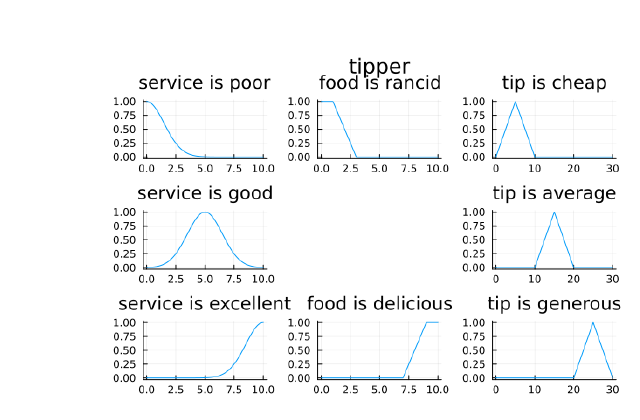
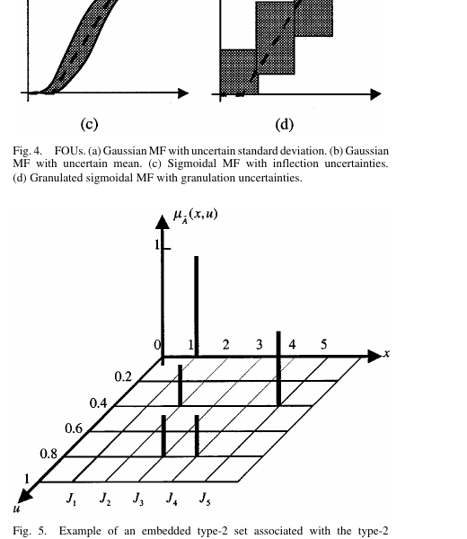
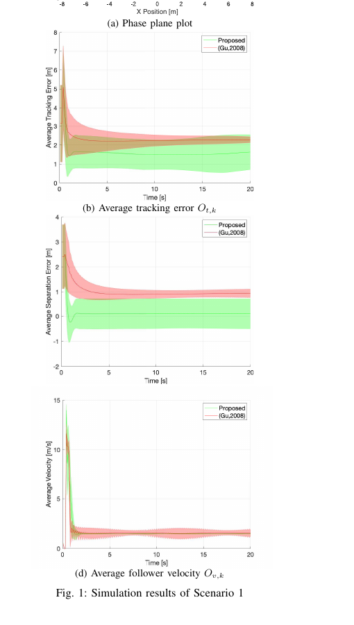

# Investigation v2: Where a 3D Physics Engine with Autograd Can Genuinely Contribute to Fuzzy Logic

**Date:** 2026-05-23
**Supersedes:** [2026-05-23-fuzzy-logic-visualization-gaps.md](2026-05-23-fuzzy-logic-visualization-gaps.md)
**Critique of v1:** [2026-05-23-fuzzy-logic-visualization-gaps-critique.md](2026-05-23-fuzzy-logic-visualization-gaps-critique.md)

This revision narrows v1's 10+ target list to a handful that actually exercise World Foundry's specific strengths, drops unverified citations, replaces optimistic day-estimates with realistic ranges, and is honest about the difference between "internal demo," "pedagogical tool," and "research contribution."

---

## 0. What existing visualizations look like

Before claiming "no one shows this", grounding in what existing tools and papers actually produce. All three figures below are extracted from the open-access PDFs in `docs/papers/`.

### MATLAB's tipping example, as rendered by FuzzyLogic.jl (Ferranti & Boutellier 2023)

*Source: FuzzyLogic.jl paper Fig. 1 — the canonical Mamdani tipping example. Six 1D membership-function plots tiled into a grid. This is the standard output across MATLAB Fuzzy Toolbox, scikit-fuzzy, JuzzyPy, and FuzzyLogic.jl: 2D line plots arranged as a small-multiples grid.*

**What WF would add:** the live, embodied, physics-coupled control loop in §3.3 (Mamdani plant) — not a *better* plot, a *different* representation: the inference pipeline as a 3D stack of surfaces sitting above a navigable plant. Whether that's pedagogically superior is an empirical question (the v2 has been careful not to assert this without evidence).

### Mendel & John 2002 — type-2 set as a 3D embedded set

*Source: Mendel & John 2002 Figs 4 (FOU plots) and 5 (embedded type-2 set as 3D spikes). The paper does draw a 3D representation — but as discrete spikes on a 2D primary-variable × primary-membership grid, not as a continuous solid surface μ_Ã(x,u). The continuous-solid form is what §3.4 targets.*

**Implication for v2:** "Type-2 as a 3D object" is not unprecedented — the foundational paper shows it. WF's contribution would specifically be the *continuous, controllable, animated* solid (and its coupling to a plant), not the geometric form itself.

### Adaptive fuzzy RL for flock systems (Qu et al. 2023)

*Source: Qu et al. 2023 Fig. 1 — phase-plane plot + tracking error + separation error + average velocity, each as 2D time series with confidence bands. This is the "2D matplotlib trajectory plots" v1 criticized; the criticism stands. Flock behavior reads cleanly from these curves but does not convey the emergent 3D structure (lanes, splits, turbulence) that the controller actually produces.*

**What WF would add:** the 3D scene the trajectories come from, with per-agent rule activations rendered as halos (§3.2). The 2D plots remain useful as quantitative ground-truth; the 3D scene is the qualitative complement.

---

## 1. The thesis: what only World Foundry can do easily

The WF-unique combination — small enough that no single competing tool covers it — is the simultaneous presence of all three of:

1. **A Forth scripting layer** wired into game logic, with live-editable rules in `.lev` files. No recompile loop.
2. **An autograd engine** next to the scripting layer (`engine/neural-forth/autograd.c`), capable of gradient descent during a running level.
3. **A real rigid-body physics engine** (Jolt) — controllers drive real plants, plants exert real reactions.

MATLAB has 1+2 in different toolboxes but no shared runtime. Python has 1+2 but not 3 outside expensive simulators. Unity has 1+3 but no autograd. NetLogo has 3 but neither 1 nor 2.

So the most defensible WF demos are the ones that exercise **all three at once**. Demos that exercise only one or two are not bad — but other tools do those better.

---

## 2. Surviving targets, ranked

| # | Target | Trifecta usage | Audience | Honest bucket |
|---|--------|---------------|----------|---------------|
| 1 | ANFIS live training on a balanced pendulum | Scripting + autograd + physics | Researchers, advanced students | Pedagogical tool + demo paper candidate |
| 2 | Fuzzy controller for a flock — emergent dynamics | Scripting + physics (no autograd) | Researchers, demo audiences | Demo paper candidate |
| 3 | Mamdani inference pipeline coupled to a live plant | Scripting + physics (no autograd) | Students, course supplement | Pedagogical tool |
| 4 | Type-2 fuzzy controller for a noisy plant | Scripting + physics (no autograd) | Researchers (T2 community) | Internal demo, possible workshop paper |

Type-2 *static FOU 3D solid* (which v1 ranked highly) is dropped — it renders a beautiful object but exercises none of the trifecta. If someone wants a 3D FOU solid, Open3D or a Three.js page is a better fit than a game engine.

FCM, high-dim TSK, Type-3 UAV, Zadeh's "tall" demo, and the unverified Fuz-RL 2026 paper are all dropped, with reasons in the critique.

---

## 3. Target details

### 3.1 ANFIS live training on a balanced pendulum

**The story.** A 3D inverted pendulum stands on a cart in the scene. An untrained ANFIS controller hovers above it as a layered structure: input Gaussians, rule grid, output surface. The user presses "train". Physics runs. The controller fails, falls, resets. Membership function centers and widths *move visibly* as gradients flow. Over a minute or two of wall-clock time, the controller learns. The pendulum stabilizes. The membership functions have settled into interpretable shapes that the user can read off the floating surfaces.

**Why WF.** This is the only one of the surviving targets that needs all three of: live Forth scripting (so the user can intervene mid-training), autograd (for the gradient step), and Jolt physics (for the pendulum). MATLAB can do ANFIS training and can show a pendulum, but not in the same runtime with live parameter visualization. PyTorch + Mujoco can do the training but the visualization is bespoke.

**Why it might publish.** A demo paper at FUZZ-IEEE or IFSA, framed as a teaching tool for ANFIS, with a small user study (e.g., 10 students, "did seeing the surfaces help you understand backprop in fuzzy systems?"). Software journal track (e.g., *SoftwareX*) is also plausible if the code is well-packaged.

**Genuine competitors.**
- MATLAB ANFIS GUI — shows training curves and final surfaces; does *not* show live parameter motion during training, does *not* couple to a physical plant.
- PyTorch + Mujoco — fully capable but requires 200+ lines of glue and a separate visualization layer.
- Unity ML-Agents — has fuzzy logic extensions but no autograd in the runtime.

**WF differentiator.** The membership functions deforming live, mid-physics-simulation, in the same window as the pendulum. That specific concurrent visual coupling is what the existing tools cannot do without significant custom engineering.

**Realistic effort.** **2–4 weeks** for the first end-to-end version. Breakdown:
- ANFIS structure + autograd glue in zForth/C: 3–5 days (most of the time is debugging the syscall boundary).
- Pendulum scene authored in Blender + level pipeline: 2–3 days.
- Surface visualization (3D Gaussian bells + rule grid + output surface): 4–6 days, including a parameter-update pass per frame.
- Training stability + hyperparameters that don't diverge: variable, 2–5 days.
- Polish + capture: 2–3 days.

**Risk.** Training stability in real-time is the dominant unknown. The pendulum task is well-conditioned; harder tasks may not converge in a watchable timeframe.

---

### 3.2 Fuzzy controller for a 3D flock

**The story.** A swarm of 30–60 physics agents in a 3D scene, each running a small fuzzy controller (5–9 rules) for leader-following, collision avoidance, and velocity matching. The user can adjust rule weights or membership function widths at runtime. Emergent behavior changes visibly — tighter flocks, lane formation, splits. A leader is steered with WASD; obstacles are placed live.

**Why WF.** Multi-actor physics in Jolt is solid. Per-agent zForth controllers are cheap. The live rule-tweaking is exactly what WF's scripting layer is designed for.

**Why it might publish.** This is closer to *Adaptive Fuzzy RL for Flock Control* (arXiv 2303.09946, real paper, verifiable). A 3D extension with interactive rule editing is the future-work that paper explicitly invites. A workshop paper or extended demo is plausible, especially if paired with a small experiment showing rule-perturbation effects on consensus speed.

**Genuine competitors.**
- NetLogo flock models — 2D and 3D variants exist; rule editing is in NetLogo's scripting language. The 3D rendering is functional but not pretty.
- Reynolds' original Boids — already 3D, hard-coded rules, no fuzzy logic.
- Various Unity assets — fuzzy logic + boid plugins exist separately but rarely combined.

**WF differentiator.** Fuzzy rules + 3D physics + live rule editing in one runtime. The closest competitor (a custom Unity build) would take comparable effort to put together.

**Realistic effort.** **2–3 weeks** after the ANFIS demo, because the level + scripting tooling will already be exercised. Breakdown:
- Per-agent fuzzy controller in zForth: 2–3 days.
- N-agent scene + Jolt scaling: 2–4 days (Jolt handles N bodies but the per-agent script dispatch needs care).
- Rule-halo rendering per agent: 3–5 days (instanced billboards keyed to rule activations).
- Tuning emergent behaviors that are *recognizable* (flock, not chaos): variable, 2–4 days.
- Polish + capture: 2–3 days.

**Risk.** Per-frame script dispatch for N agents is the perf unknown. Jolt easily handles N rigid bodies; zForth per-agent rule evaluation N times per frame may not. Likely needs a vectorized inner loop or rule-evaluation amortization.

---

### 3.3 Mamdani pipeline coupled to a live plant

**The story.** Pick a contemporary plant — cruise control on a 3D vehicle, or a HVAC-style heat exchange between two physical bodies — not the historical steam boiler. The Mamdani inference pipeline floats above the scene as four labeled stages: fuzzification ribbons, fired-rule volumes, aggregation surface, defuzzification cursor dropping to a crisp control output. The output drives the plant; the plant's state feeds back to the inputs; the user watches the loop close in real time.

**Why WF.** Live rule editing in zForth is the differentiator. MATLAB's Surface Viewer is already 3D but not coupled to a real-time physics plant the user can perturb. The teaching value is in **showing the loop**, not in showing a single inference.

**Why it might publish.** Teaching paper at a CS-education venue, with a small user study. Not a research contribution to fuzzy logic itself.

**Genuine competitors.**
- MATLAB Surface Viewer + Simulink — handles this exact problem but is expensive, ugly, and not interactive in the WF sense.
- eMathTeacher (2008) — 2D, static, web-based, abandoned.
- Various YouTube animations — pre-rendered, not interactive.

**WF differentiator.** Interactive, real-time, live-editable rules, embedded in a navigable 3D scene where the plant has visible physical state.

**Realistic effort.** **1.5–2.5 weeks** after the ANFIS demo (same tooling reuse). Lower than ANFIS because no autograd is involved.

**Risk.** Low. The Mamdani math is textbook. The risk is that the result *looks* like every other Mamdani tutorial and the WF angle gets lost. Mitigation: pick a plant where physics feedback is dramatic (a vehicle on a hill, not a tank of water).

---

### 3.4 Type-2 fuzzy controller for a noisy plant

**The story.** A plant in the scene is subject to visible disturbances (a ball on a tilting platform with wind gusts). A Type-1 fuzzy controller fails or oscillates; an Interval Type-2 controller, configured with a Footprint of Uncertainty matched to the disturbance, holds steady. The user can dial the FOU width and see the trade-off (wider FOU = more robust but less precise).

**Why WF.** This makes the abstract concept of "Footprint of Uncertainty" concrete — it's not an abstract band, it's the controller's tolerance for the visible wind. Physics coupling is what makes the demo legible.

**Why it might publish.** Possible workshop paper or demo at FUZZ-IEEE in the Type-2 track. Type-2 fuzzy is a real subfield (Mendel et al.) with regular venues.

**Genuine competitors.**
- JuzzyPy — Type-2 capable but no physics coupling.
- MATLAB Type-2 Fuzzy Toolbox — exists, plant coupling via Simulink, not WF-style live.

**WF differentiator.** Visible disturbance + visible FOU + visible plant response, in the same scene, all live.

**Realistic effort.** **2–3 weeks** after the Mamdani demo (one fuzzy controller scene is much like another). The novelty is the FOU rendering, which builds on the Type-2 work already partly in `engine/neural-forth/`.

**Risk.** Medium. Interval Type-2 inference adds a Karnik-Mendel type-reduction step that can be numerically finicky to implement correctly in fixed-time-budget per frame.

---

## 4. What's been dropped vs v1, and why

- **Zadeh "tall" demo** — Pure pedagogy, exercises only rendering. Better as a Three.js page than a game level.
- **TSK rule surface** — Subsumed into the Mamdani target's pipeline visualization. Standalone, it doesn't add over MATLAB Surface Viewer.
- **TSK-RL Asteroid Smasher 3D port** — Fun project, but neither a research contribution nor a clear teaching tool.
- **Type-2 FOU static 3D solid** — Genuinely novel rendering but exercises zero physics, zero autograd. Wrong vehicle.
- **ANFIS architecture diagram in 3D** — Folded into target #1; the architecture diagram is one component of the live-training demo, not a standalone target.
- **Kosko FCM with physics** — FCMs operate on bounded scalars; the mapping to forces is arbitrary. Without a clean physical interpretation, the demo would feel contrived.
- **Fuz-RL 2026** — Unverified citation. Until the paper is confirmed, cannot recommend.
- **TSK high-dim multilabel** — Needs interactive latent-space exploration; Plotly is the right tool, not a game engine.
- **Type-3 UAV** — Contested subfield, low-value visualization target.

---

## 5. Recommended order

1. **ANFIS pendulum** (target 3.1) first — highest WF differentiation, biggest stretch on `engine/neural-forth/` infrastructure, will surface integration bugs that the other targets would also hit. Doing it first amortizes that cost.
2. **Mamdani plant** (target 3.3) second — simpler, reuses the scripting and surface-rendering work from #1 without the autograd path.
3. **Fuzzy flock** (target 3.2) third — most visually dramatic; good "publish a video" candidate; benefits from the multi-actor patterns WF already exercises.
4. **Type-2 noisy plant** (target 3.4) last — most domain-specific; depends on a clean baseline T1 controller from earlier targets.

Total: **2–3 months** for all four if pursued seriously, with the first taking the disproportionate share of time.

---

## 6. Honest limits

- None of this is automatically a research contribution. Each target needs either a user study (for pedagogical claims) or a quantitative experiment (for research claims) to publish.
- All four targets are *demos that happen to use fuzzy logic*. They are not new fuzzy logic. If the goal is "publish a paper in IEEE TFS," none of these qualify on their own.
- The clearest publication path is **a software/tools paper bundling all four targets as a release of a WF + neural-forth demo suite**, in a venue like *SoftwareX*. That has a low impact factor but is the right framing.
- A pivot to "WF as a research instrument for fuzzy control benchmarks" is also viable: provide standardized fuzzy-friendly physical tasks (pendulum, flock, plant-with-wind) as a benchmark suite, like Mujoco for RL. That's a bigger project but a more defensible long-term play than any single demo.

---

## 7. Sources kept from v1 (verified-pending status flagged)

- Mamdani & Assilian (1975) — *Int. J. Man-Machine Studies* 7(1) — **verified** (canonical reference)
- Takagi & Sugeno (1985) — *IEEE Trans. SMC* 15(1) — **verified** (canonical reference)
- Jang (1993) — ANFIS, *IEEE Trans. SMC* 23(3) — **verified** (canonical reference)
- Mendel & John (2002) — *IEEE Trans. Fuzzy Systems* 10(2) — **verified** (canonical reference)
- Adaptive Fuzzy RL for Flock Control: [arXiv 2303.09946](https://arxiv.org/abs/2303.09946) — **needs confirmation** before relying on it
- Fuz-RL: [arXiv 2602.20729](https://arxiv.org/abs/2602.20729) — **unverified, possibly hallucinated** — not used in this revision
- TSK-RL [OAE 2023](https://www.oaepublish.com/articles/ces.2023.11) — **needs confirmation**
- All other v1 references — **not relied on in v2**
