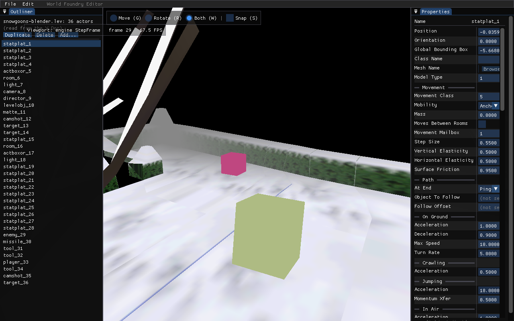

# wf-edit aborts (`terminate` / SIGABRT) when moving a StatPlat

**Date:** 2026-05-25
**Status:** FIXED 2026-05-25 — both runtime statplat guards gated on `gEditorMode`; verified by
backtrace + three headless repros. Two follow-ups logged to [`TODO.md`](../../TODO.md).

## Symptom

Running `wf-edit` interactively, using it, then closing the window left this in the log:

```
… is not in any room (or is in the wrong room at startup)
terminate called without an active exception
```

Process exit code **134** (SIGABRT), and none of the normal teardown markers
(`rest_api: server stopped`, `HALStart returned`, `clean exit`) printed. A headless
`--frames N` run (no interaction) always exited cleanly, so the trigger was a **user action
during the session**, not the shutdown path.

This is a recurrence of the class documented in [`docs/BUGS.md`](../BUGS.md) (the SMB mailbox-range
case) and seen twice in the [2026-05-22 transcript](../transcripts/2026-05-22.md): a misleading
`std::thread::~thread` top-of-stack masking a real `assert → exit()`.

## Root cause (two layers)

### Layer 1 — moving a StatPlat at runtime asserts

`wfmut::SetActorPos` (gizmo drag / Position panel edit) calls `Actor::setCurrentPos`, which moves
the mesh + Jolt body but not the room membership. The **next** `WFGame::StepFrame` →
`Level::update` → `Level::updateRoomContents` → [`Room::UpdateRoomContents`](../../wfsource/source/room/room.cc)
(room.cc:280-287) sees the actor left its room box (`!CheckCollision`), logs *"fell out of room …
re-adding"*, and calls `LevelRooms::AddObjectToRoom`, whose **first statement** is:

```cpp
// rooms.cc:134
AssertMsg( object->kind() != BaseObject::StatPlat_KIND,
           "Cannot generate or move a statplat at runtime …" );
```

Statplats are static collision baked per-room, so the runtime forbids moving them. Snowgoons is
*mostly* statplats (`statplat_1..28`), so dragging almost any platform trips it. Confirmed backtrace:

```
#12 _sys_assert ("object->kind() != BaseObject::StatPlat_KIND", rooms.cc:134)
#13 LevelRooms::AddObjectToRoom (objectIndex=1)         rooms.cc:134
#14 Room::UpdateRoomContents                            room.cc:286
#15 Level::updateRoomContents → Level::update → WFGame::StepFrame → RunEditor
```

A statplat dragged out of **every** room instead reaches a *second* guard via `SetPendingRemove`:

```
#12 _sys_assert ("object->kind() != BaseObject::StatPlat_KIND", level.cc:1340)  // "Cannot remove a statplat"
#13 Level::SetPendingRemove                             level.cc:1340
#14 LevelRoomCallbacks::SetPendingRemove                level.cc:1779
#15 LevelRooms::AddObjectToRoom                         rooms.cc:187
```

### Layer 2 — `exit()` → static joinable thread → `terminate` (masks Layer 1)

`_sys_assert` calls `exit(-1)`. During exit handlers the **static** debug-bridge listener
`gListenerThread` ([`debug_server.cc:266`](../../engine/stubs/debug_server.cc)) is destroyed while
still joinable — `std::thread::~thread` on a joinable thread calls `std::terminate()`:

```
#9  std::thread::~thread (gListenerThread)
#10 __run_exit_handlers
#11 exit (status=-1)
#12 _sys_assert (…)
```

`DebugServer_Stop` (which joins the thread) is registered via `sys_atexit` but does not run before
the static destructor on the `exit(-1)` path, so the join never happens. This is why the real
assert message is buried under `terminate called without an active exception` / SIGABRT.

## Fix

Scope both runtime statplat guards to **non-editor** mode. In the editor, repositioning a platform
is a core authoring action, so a moved statplat flows through the normal room-add (re-roomed if it
lands in a room; pending-removed if dragged off every room) instead of aborting. The mesh + Jolt
body already followed the gizmo via `setCurrentPos` for live preview; the authoritative per-room
collision is recomputed on **save + reload**.

- [`rooms.cc`](../../wfsource/source/room/rooms.cc) `AddObjectToRoom` — `if (!gEditorMode)` around
  the `StatPlat_KIND` `AssertMsg`.
- [`level.cc`](../../wfsource/source/game/level.cc) `SetPendingRemove` — same gate on the
  `"Cannot remove a statplat"` `AssertMsg`.

`gEditorMode` ([`game/main.cc:56`](../../wfsource/source/game/main.cc)) is already set true under
`--editor`; both sites declare it `extern`.

## Verification

Reproduced and fixed via a temporary env-gated nudge (`WF_EDIT_REPRO_MOVE`, since removed):

| Case | Move | Before fix | After fix |
|------|------|-----------|-----------|
| Within a room | small | (never re-rooms — fine) | fine |
| **Adjacent room** | `+Y −30` (room 1 → room 0) | `rooms.cc:134` abort | **re-roomed, clean exit** ✓ |
| **Off the level** | `+X 1000` (out of all rooms) | `level.cc:1340` abort | **pending-removed, clean exit** ✓ |

Each fixed case printed `screenshot … (1280x800)` → `HALStart returned` → `clean exit` (exit 0).



## Caveats & follow-ups (logged to [`TODO.md`](../../TODO.md))

1. **Live collision/room of a moved statplat is best-effort until save+reload.** The mesh + Jolt
   body move immediately, but the per-room collision baking isn't recomputed live. Acceptable for
   authoring; flagged for a proper editor-side re-bake.
2. **Layer 2 — make the debug-bridge listener teardown clean** so *any* engine `assert/exit()`
   during an editor or game session exits cleanly instead of `terminate`-masking the real cause
   (detach `gListenerThread`, or guarantee `DebugServer_Stop` runs before static destruction). Would
   also de-noise the [BUGS.md](../BUGS.md) mailbox-range case.
