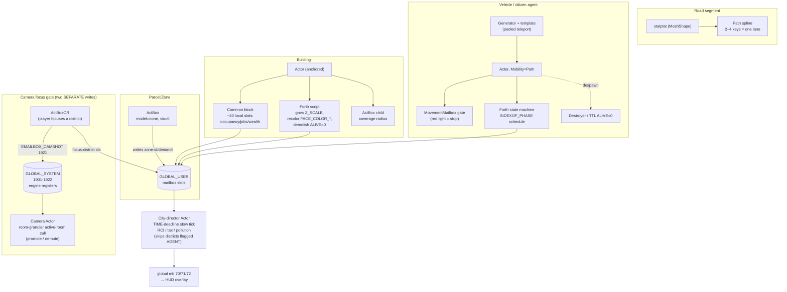

# Investigation: World Foundry as an authoring platform for city-builder→simulation experiences

**Date:** 2026-05-29
**Status:** Design vision (grounded in engine audit)
**Scope:** A platform for a RANGE of city-sim experiences across two axes — **fidelity** (statistical ↔ agent-based ↔ hybrid) and **purpose/rigor** (entertainment game ↔ serious/educational game ↔ planning-grade validated simulation). Hybrid is one setting on the dial, not the mandate.
**Depends on:**
- [World Foundry vs Godot](2026-04-29-world-foundry-vs-godot.md) — engine capability baseline, the no‑nav‑mesh finding
- [SMB features → WF primitives](2026-05-25-smb-features-to-wf-primitives.md) — the composition legend reused here
- [spawn‑template Forth primitive](2026-05-26-spawn-template-forth-primitive.md) — the pooled‑Generator spawn pattern + the ~1‑day syscall
- [Engine capabilities survey](2026-04-28-engine-capabilities-survey.md) — the "snapshot, descriptive not normative" discipline applied throughout

---

## Summary

| Question | Verdict |
|----------|---------|
| Can WF author a RANGE of city sims, not just one? | **Yes**, by design — the OAD schema⊥instance split + mailbox bus + composition ethos is genuinely a substrate, not a single game. |
| The distinct hook? | **The camera IS the fidelity selector.** WF's active‑room cull already simulates only what the camera frames; "your attention brings the city alive" is a built‑in mechanic, not a feature to invent. |
| Statistical city sim (game)? | **Strong fit.** ~1900 global float slots + a TIME‑deadline "city director" actor = a cheap aggregate sim, arbitrarily large, ~free per frame. |
| Agent city sim (game)? | **Bounded fit.** Real fit for **low hundreds** of on‑camera agents (draw‑call + per‑actor‑script + 2048‑actor ceilings); never thousands. No nav‑mesh — routing is baked PATH splines. |
| Hybrid (game)? | **Strong fit, *one setting* not the mandate.** Foreground agents in active rooms, statistical pools elsewhere — the room‑granular cull enforces the *coarse* split, but the seam is clean only when the camera follows the agent, and the three‑tier picture forces a topology choice (§4). |
| Exploratory / educational planning? | **Credible** with honest framing ("unvalidated, intuition‑building"). |
| Planning‑GRADE (calibrated, validated, defensible forecasting)? | **No, not today, and possibly out of scope.** WF has zero GIS ingestion, no headless batch, no calibration/validation harness, no reproducibility manifest for sim runs. This is a research‑grade programme, not a subsystem. |
| Single biggest enabler | A **deterministic headless batch tick** (factor Render/PageFlip out of the seven‑phase loop). |
| Single biggest blocker | **No save/load of mutated world state** + **no statistical‑tick layer** + (for planning) **no georeferenced data ingestion**. |

---

## 1. The thesis

World Foundry should be positioned not as "a city‑builder game" but as a **substrate for authoring a range of city‑builder→simulation experiences**, the same way it is already a substrate for authoring a range of arcade games (Joust, Q*bert, Marble Madness, an SMB conversion) rather than one hard‑coded platformer. The one distinct hook is that **the camera is the fidelity selector**: WF's per‑tick loop only simulates, collides, and renders actors in the camera‑watched active rooms (`Level::update` → `_theActiveRooms->UpdateRoom(camera->GetWatchObject())`, `level.cc:941‑964`), so "simulate individuals where the player is looking, statistics everywhere else" — the GlassBox half of the hybrid model — is **already implemented as load‑bearing engine behaviour**, not something to bolt on. The player's attention literally is what brings the city to life, and that is free. Two caveats stated up front and detailed in §8: this gate is **room‑granular, not a per‑pixel frustum test** (WF has no camera frustum/view query — gating is membership of the watch object's room, not the on‑screen rectangle), and it is **resident‑capped at 3 rooms**. It is the coarse foreground/background boundary, not a screen‑accurate one.

Why WF specifically? First, it is **already a composition‑of‑primitives platform**: a building, zone, road, or citizen is just an `Actor` + a chosen OAD block schema + a Forth script, exactly as a Goomba is `Enemy` + walk + a stomp script — the [SMB doc](2026-05-25-smb-features-to-wf-primitives.md) proves this composition ethos authors a whole game from shipped parts. Second, the architecture WF needed for PS1‑era arcade games — schema⊥instance (`OAS/OAD`), a deterministic seven‑phase tick, and a named‑addressable mailbox register file — turns out to be **three of the hardest pillars** an agent‑simulation substrate requires, present by accident of its constraints. Third, extending this ethos to a new genre family costs mostly *data and bindings*, not a re‑platform — which is the entire point of an authoring platform versus a game.

---

## 2. The design space (2D map)

Two orthogonal axes:

- **Fidelity** (how the city is represented): **statistical** (rate equations / cellular fields / stocks‑and‑flows; no individuals) ↔ **agent‑based** (every citizen/vehicle is a discrete object; macro emerges) ↔ **hybrid** (agents where observed, statistics elsewhere).
- **Purpose/rigor** (the epistemic load the model carries): **entertainment** (validated by the player's experience; fudgeable) ↔ **serious/educational** (same model, instrumented to teach causality) ↔ **planning‑grade** (validated against a world that exists independently — counts, parcels, census; cannot be faked).

Reference points:

- **Classic SimCity (1989–SC4)** — statistical / game. RCI is a global scalar triple; pollution/land‑value/crime are diffusion grids; "traffic" is a tile‑flow approximation. Cheap, scalable, honest‑and‑sufficient for play.
- **Cities: Skylines (2015/II)** — agent / game. Every cim and vehicle is pathed on a lane graph. Gorgeous, but the agent cost is where it collapses: a **hard pooled cap** (commonly cited ~16 384 simultaneously‑*pathing* vehicle instances; some sources cite a larger ~65 k *total*‑agent figure — vehicle‑instance and total‑agent caps differ) means big cities look *thin* on the road, and C:S II's launch was a performance catastrophe from full agent fidelity. The qualitative point survives the number: a fixed pooled cap *fakes* scale rather than simulating it.
- **SimCity 2013 / GlassBox** — hybrid / game. Agents where visible, aggregate underneath. Famous credibility gap: Sims grabbed the *nearest* job/house, so "your" worker was no one — it sold agent fidelity it did not run.
- **UrbanSim & MATSim** — agent‑or‑hybrid / **planning‑grade**. Households/jobs/parcels microsimulated; the defining workflow is *estimate coefficients on local census, calibrate, validate by backcasting, quantify uncertainty* — none of which is on a game engine's critical path.
- **Validated digital twin (Virtual Singapore)** — high‑fidelity / planning. A semantic CityGML database first, a visualisation second; the geometry is the cheap part, the calibrated analytics are the value.

**Where WF can credibly play:** the **left and middle of the fidelity axis** crossed with the **left and middle of the purpose axis** — i.e. statistical and hybrid city *games*, and *exploratory/educational* planning experiences that are explicitly unvalidated. Even the educational/front‑of‑house role is not *zero* engineering: to "consume a real tool's validated outputs" WF still needs a **minimal one‑way import** of pre‑baked scenario geometry + per‑feature attributes (a far smaller lift than full GIS calibration ingestion, but not nothing — see §5). Distinguish **consuming static pre‑baked outputs** (near‑term, modest) from **generating forecasts** (out of scope). **Where it cannot play:** the **top‑right "validated predictive forecasting" corner**. That corner is defined by calibration against ground truth and an uncertainty band, and the asymmetry is structural (you can polish a game into believability; you cannot polish a forecast into being right). WF starts from roughly zero on that axis — no GIS/CRS ingestion, no headless calibration sweep, no validation/backcasting, no run‑provenance manifest. See §5 and §12(a) for the shaded reachable region.

---

## 3. Shared substrate vs per‑project deltas

The crux of authoring a *range*: there is a **common engine core** every point on the 2D map needs, and **per‑project deltas** that must live in data/config, never baked into the engine. The genre lives in the data and the bindings, not the core.

| Substrate pillar | What it must provide | What WF already has (audit evidence) | Gap for the range |
|------------------|----------------------|--------------------------------------|-------------------|
| **Entity / agent model** | Schema defines attributes once; instances carry per‑entity data; no domain entity hard‑coded | **Strong.** `OAS/OAD` is "a genuine ECS from 1996": one runtime `Actor` configured by OAD blocks (`actor.hp:117‑121`); ~40–99 per‑instance float slots (`LOCAL_USER` 2000‑2099) | Bump OAD local‑mailbox cap 40→99 if needed (one‑line) |
| **Spatial model** | Pluggable grid / graph / continuous behind one neighbourhood‑query interface | **Partial.** Room graph is *one* AABB partition wired for streaming (`room.cc:127`); coarse zones map onto rooms | Need a finer cell/zone grid + a *peer* spatial backend, not a hack on rooms (🚧) |
| **Sim tick / scheduler** | Deterministic, **fixed** timestep, phase‑ordered, seedable | **Partial.** Fixed seven‑phase loop; deltaTime clamped to ≥10 Hz (`level.cc:808`) | Tick rate is *variable*; `INDEXOF_DT`/`GAME_TIME_S` mailboxes deferred — a fixed sim‑step is a prerequisite for statistical integration + determinism (🚧) |
| **Data / parameter binding** | Every parameter named, addressable, externally settable without recompiling | **Strong primitive.** Mailbox bus: ~1900 named global float slots (`mailbox.inc:8,66`), read/write syscalls 128/129/130; broadcast idiom is O(readers) | Need a *scenario‑file → mailbox‑slot* binding layer + bulk initial‑state load |
| **Scripting** | Behaviour as data, hot‑swappable, sandboxed from engine state | **Strong / over‑delivers.** zForth per‑actor per‑tick (`actor.cc:964`); Lua/JS/Wren/WASM backends ride the same bridge; Forth/WASM are determinism‑friendly | Fidelity choice must move from *compile‑time* (scripting backend) to *data/config* (per‑project, per‑system) |
| **Rendering** | A *detachable consumer* of sim state; tick must not depend on the frame | **Partial.** VBO+GLSL, room‑cull is the only culling; no instancing, no frustum cull | Tick ends in `Render`/`PageFlip` — sim has *never* run without drawing a frame (🚧, see headless) |
| **Save / load** | Full sim state + RNG seed, versioned | **Blocker.** Runtime is read‑only (`DiskFile` HAL has no write path; `binostream` is `WRITER`‑gated and never compiled); only runtime write is `hscore.cc`'s raw `fwrite` | A save subsystem must be built from scratch (🚧 blocker) |
| **Headless / batch** | Run to completion, renderer/audio/input absent, deterministic, CLI‑driven, machine‑readable output | **Absent.** No documented headless path | The single highest‑leverage missing capability for the planning end (🚧) |

**Per‑project deltas** (must stay out of the engine): model semantics (the economy/demand curves), data provenance (hand‑authored art vs GIS‑imported parcels), the output contract (a fun loop vs a CSV+manifest of validated metrics), and — critically — the *authoring front‑end* (a scene editor for designers vs an experiment/sweep harness for researchers). Baking any one project's economy model or coordinate assumptions into the substrate is the failure mode that makes a platform mediocre at all three.

---

## 4. The fidelity dial

Fidelity is **an authoring choice, per‑project and per‑system** — not a single global slider, and **hybrid is just one setting**, not the destination. The right fidelity is a property of the *question each system answers*: traffic can be agent‑based while the economy stays statistical, in the same city, because they answer different questions.

How the **same** WF primitives configure for each setting:

### Pure statistical (no agents)
The whole city is per‑district math. A single **"city director" actor** (the Q*bert‑director pattern — a 25 592‑char inline script already scans a 28‑element occupancy array with `28 0 do 200 i + read-mailbox … loop` and drives 28 cube actors) latches off the `TIME` global mailbox (1906) and recomputes RCI demand, tax, land value, pollution diffusion every ~1 s of sim time, reading/writing `GLOBAL_USER` slots (a base+stride block: `DISTRICT_BASE + i*STRIDE + field`). Cost is O(districts), independent of population, ~free per frame. ~1900 slots ≈ 230–300 districts of aggregate state. This is the cheapest, most scalable, *honest* baseline and fits the mobile ceiling effortlessly. No `Actor` is ever spawned for a citizen. Note the honesty boundary that matters the moment anyone eyes the planning axis: the constants in those rate equations (RCI demand elasticity, diffusion coefficients, growth curves) are **hand‑tuned by feel and calibration‑free** — they have no mechanistic grounding. That is fine and sufficient for a *game* (the player validates by experience), but it is precisely the line a planner must understand before any of this could be repurposed (§5).

### Pure agent
Every visible citizen/vehicle is a real `Actor`: spawned by `Generator`+template (pooled‑teleport idiom from the [spawn‑template doc](2026-05-26-spawn-template-forth-primitive.md)), `Mobility=Path`/`Follow`, with a per‑actor Forth state machine reading mailboxes for goals. Macro emerges from micro. **Bounded hard**: the 2048‑`Actor` ceiling (11‑bit `_idxActor`), the fixed temp‑object pool (default 200, OAD max 500), the per‑actor‑script per‑frame cost, and the draw‑call wall (no instancing). Realistic: **low hundreds** of on‑camera agents. No nav‑mesh — routing is a baked graph of short PATH splines (one spline = one lane segment), de‑conflicted at author time.

### Hybrid (one setting, not the goal)
Tier 0 (inside the camera focus volume): real `Actor`s with coherent identity. Tier 1 (visible, distant): cosmetic "token" movers playing the *average* behaviour drawn from district stats. Tier 2 (off‑camera): pure statistics in mailbox slots, zero actors, slow tick. The active‑room cull already enforces the Tier 0/Tier 2 boundary.

**WF has a *binary* simulation gate, not three independent cost tiers.** This is the fact most easily glossed. The engine has exactly two mechanical states for an actor: *in an active room* (full cost — it draws *and* ticks its script, `level.cc:948‑964,1153`) or *not* (zero cost, invisible, frozen). There is no cheaper hardware tier for "visible but distant". So Tier 0 and Tier 1 are **both** "in an active room" and both pay draw‑calls + per‑frame script ticks; Tier 1's savings are *per‑actor* only — a simpler script and a 2‑triangle `RenderActorScarecrow` billboard instead of a full animated mesh — **not** a free distant tier. Tier 1 tokens count against the *same* on‑camera budget as Tier 0 (see §9). Tier 2 is the only genuinely free tier (dormant room = zero cost).

**The three‑tier picture forces a topology choice — the two options are mutually exclusive without an engine fork:**

- **(a) Many district‑rooms.** Room‑LOD works and off‑camera districts cost nothing (true Tier 0/Tier 2 split for free) — but **at most 3 rooms are ever resident** (`MAX_ACTIVE_ROOMS=3`, == transient texture slots, §8), so **at most 3 districts are ever visible at once and there is NO simultaneous multi‑district Tier 1**. "Token movers per *distant* district" is therefore *not available* in this topology without forking `MAX_ADJACENT_ROOMS`/`MAX_TRANSIENT_SLOTS`. This is the right shape for a *drill‑into‑one‑district* / follow‑an‑agent experience.
- **(b) One big city room.** All districts are visible and Tier 1 token movers work across the whole view — but **every actor ticks every frame** (no room‑cull at all), so the foreground per‑frame budget *alone* governs and the "camera = free fidelity gate" thesis must be **re‑implemented at the agent/script level** (each agent self‑throttles on distance to camera, which is readable but is per‑actor scripting work, not the engine's free cull).

Diagram (c) assumes topology (a) for the Tier 0/Tier 2 columns and topology (b) for a same‑view Tier 1; an author picks one per level and the diagram is not a single simultaneous frame.

### The GAME‑end fun loops the dial must serve
The dial is *machinery*; the *fun* is what the player feels. The genre's three most‑cited fun sources all fit WF's budget — and crucially the two biggest ones are **per‑segment / statistical**, i.e. *cheap*, not the expensive per‑agent layer.

**Delegated authorship — "zone‑and‑watch / my city came alive".** The defining emotional hook is *I drew rules → the sim authored detail I didn't place*. On WF: the player paints a zone (an `ActBox`) or draws a road → the **statistical director** raises that district's demand and grows building `Actor`s (level‑up = `Z_SCALE` step + `FACE_COLOR_*` recolor) and spawns cosmetic agents to match → the reward must land in the **3–15 s "settle" window** (not instant, not a minute). The growth driver is the **cheap statistical demand model**, never agent fidelity — which is the whole point: *delegated authorship is satisfiable on the mobile budget precisely because the detail is grown statistically*, with agents as the sampled liveness on top. The growth‑dopamine "just one more" arc (paint → settle → population ticks → milestone unlocks → new problem) rides the same statistical core.

**Traffic as a solvable, expressive PUZZLE — without emergent A\*.** This is the genre's #1 fun source *and* its #1 performance failure (C:S routes every vehicle, and that is where it collapses). WF threads the needle by **modelling traffic statistically and rendering it cosmetically**: compute **per‑segment flow/load** as a cheap origin‑destination solve over the baked spline graph, recomputed on the **slow district tick** (not per‑frame per‑agent); render a *bounded* set of cosmetic vehicles whose **density and speed reflect the computed load**; and let the player **edit the spline graph / gate junctions** to reduce the computed load and *see the visual response* (a clogged amber segment thinning to green). The player still gets the puzzle ("redesign the intersection, watch congestion drop") and the "aha", while WF sidesteps the entire C:S pathfinding‑pathology class of bugs it has no nav‑mesh to attempt anyway. *Congestion here is an authored statistical field, not emergent — and that is a feature, not a compromise.*

**Tactile network drawing — the road tool *is* the interface.** In C:S ~90 % of player input is laying/adjusting network geometry, and it is kinesthetically satisfying *on its own*. It is also the **highest‑value, lowest‑cost** game feature, because roads are **per‑segment, not per‑agent** — well within the mobile budget where per‑agent traffic is not. WF should ship a runtime **node‑and‑segment placement verb** (snapping, curves, live cost‑tick as you drag, auto‑stitched intersections, elevation steps) that authors the baked spline graph **in place**, mapping onto WF's existing constraint‑prop placement tooling and the `wfmut` runtime‑mutation API. Re‑baking the affected spline segments on edit is **off‑the‑hot‑loop** work. (See §10 P1 for the build item.)

**Failure / crisis / firefighting — the spice that breaks placement monotony.** A poorly‑designed city‑builder dies of the *solved‑city / boring mid‑game*: once the budget is positive there is nothing left to do. WF seeds fresh problems cheaply: **budget bankruptcy** as a pure‑statistical fail check (a treasury accumulator crossing zero — free); **crises via existing primitives** (a fire = a spreading `ActBox`/mailbox cellular effect; a gridlock alert from the computed segment load); **milestone‑gated escalation** where each unlock creates the next problem (more population → more traffic/pollution/demand). Heed the SimCity lesson on *spectacle*: agents earn their cost when the event is **rare, dramatic, and the player wants to watch the individual** — so a disaster/dispatch vehicle is a legitimate visible agent even when everyday traffic is statistical. Avoid the no‑stakes‑sandbox failure mode by always having *a* pressure, even a gentle one.

### What the engine must expose to dial this
1. **Per‑system fidelity enum in OAD/config** — `sim.traffic.fidelity = AGENT`, `sim.economy.fidelity = STATISTICAL`. A natural home in the scoped OAD property model; no new file format.
2. **A fidelity‑agnostic query bus** — consumers (renderer, HUD, neighbouring systems) read a result *by name* and never branch on the producer's representation. WF's mailbox bus is exactly this: a statistical system publishes `zone_A_demand` to a `GLOBAL_USER` slot (0‑1899); an agent system publishes the *reduced aggregate* to the **same** slot; the HUD reads the slot and never learns which produced it. **Band caution:** district aggregate stats live in `GLOBAL_USER` (0‑1899, the user register file the dial partitions), but the camera‑control slots — `EMAILBOX_CAMSHOT` (1921) and `CAMROLL` (1904) — are `GLOBAL_SYSTEM` engine registers (1901‑1922, `mailbox.inc:74‑95`), semantically distinct. The "one `ActBoxOR` write both moves the camera AND turns on high‑fidelity spawning" idiom is therefore **two writes**: the focus‑district index to a `GLOBAL_USER` slot the district scripts read, and *separately* `CAMSHOT` (system) for the camera. Do not present the camera path as part of the `GLOBAL_USER` district bus.
3. **LIFT / PROJECT adapters at every seam.** STATISTICAL→AGENT = LIFT (sample N concrete, deterministically‑seeded agents from the aggregate distribution so totals match on the swap tick). AGENT→STATISTICAL = PROJECT (bin agents back into counts/means/histograms). Statistics are the **ground truth**; agents are a *sampled render* of them — never the reverse. When a building demotes, discard the agents, keep the stat (the slow tick advanced it in parallel).

### Keeping a district consistent when fidelity changes
Define **conserved invariants** (population, money, vehicles) that both representations must respect, and calibrate so the statistical model is the **mean‑field limit** of the agent model — i.e. the agent run's *projected* aggregates match the statistical run's outputs *in expectation* for the same inputs. If they do not agree in expectation, the dial produces two different games, not two views of one city. This mean‑field consistency is an *assumption that must be verified per system*, not assumed; it is recurring work. Determinism (same seed + same fidelity ⇒ same result, swap preserves macro within a stated tolerance band) is reachable on WF's fixed‑point Scalar path *once the variable‑tick issue is fixed*.

**Reconciliation‑ownership invariant (or the promoted district double‑counts).** A district must be advanced by **exactly one source at a time**: the director's rate equation *while Tier 2*, the agent deltas *while Tier 0* — never both. The hazard is direct: if the slow Tier‑2 tick keeps advancing District 7's population/economy in its `GLOBAL_USER` slots *while* District 7 is promoted and its real agents are *also* mutating those same slots (an agent completing a home→work trip incrementing a "commute satisfied" counter), the aggregate is advanced **twice**. The fix is a per‑district fidelity flag the director reads *before* recomputing: on **promote**, the director STOPS ticking that district's aggregate (its per‑district loop skips any district flagged `AGENT`); on **demote**, PROJECT the live agents into the stat **once**, then the director resumes. This is what makes "stats are ground truth" actually conserve totals across a promote/demote cycle rather than silently double‑advancing.

### How the seam actually behaves in WF (engine‑specific, not the reference recipe)
The reference‑game recipe ("spawn one ring beyond the frustum so agents materialise off‑screen") **does not transfer to WF unchanged**, because WF's active set is a hard **3‑room linear chain keyed to the single watch object** — there is no 2D buffer ring to spawn into. The seam therefore has a clean case and a broken case, and the design must pick the clean one:

- **Clean case — camera FOLLOWS the agent (`TrackObjectMailbox`, `movecam.cc:263‑276`).** The watch object *is* the followed agent, so the 3‑room window **travels with it**; the followed agent never leaves the active set, and surrounding rooms auto‑activate around it. This is the *only* camera mode in which the seam is automatically clean. It is exactly the "click a citizen, follow them home" showcase.
- **Broken case — FIXED god‑view of a district.** Here an agent that path‑drives across the active‑window edge is **not** gracefully demoted by the engine — it is grabbed by `Room::UpdateRoomContents` → `LevelRooms::AddObjectToRoom` (`rooms.cc:128‑191`) and either **re‑filed into a now‑dormant room** (where it *freezes* mid‑path, because `updateRoomContents`/`StartFrame`/predict only iterate active rooms, `level.cc:1020‑1026`) or, if it lands in no room's AABB, **killed outright** via `SetPendingRemove` (`rooms.cc:185‑189`). Neither is the soft fade the reference recipe assumes.

**Design consequence:** in hybrid god‑view you must **demote at a script‑defined margin *inside* the active‑room boundary** and never let a Tier‑0 agent path across the edge. Promotion/demotion is gated on **distance‑to‑active‑room‑edge**, not distance‑to‑camera, and the "one ring beyond the frustum" buffer band is replaced by "PROJECT‑then‑recycle before the agent reaches the room edge", driven by the agent's own distance check (camera/room position is readable from script). Let the engine's migrate‑or‑kill path fire and the seam breaks.

### What persists across dormancy, and what does not
The two object classes behave **oppositely** at the seam, and conflating them is a bug:

- **Building / zone / road `Actor`s are level‑authored and survive dormancy intact.** `ChangeActiveRoom` frees only *asset slots* (`UnBindAssets`/`FreeRoomSlot`, `actrooms.cc:163‑194`), not actors, so a building's local‑mailbox state persists while its room is dormant. On re‑activation a startup script **can** reconstruct the building from the aggregate counters the director maintained — but that catch‑up is **authored content, not an engine behaviour**.
- **Spawned citizen/vehicle agents do NOT persist — by design.** They occupy the recycled temp pool and are **PROJECTED‑then‑discarded on demote**, then **re‑LIFTed from the district stat on re‑promote**. They have no dormant existence to resume; that is precisely why the stat must be the ground truth. ("Agents resume coherently on re‑activation" is true for static building actors and *false* for pooled agents — the ones the seam is actually about.)

---

## 5. The purpose/rigor axis: game ↔ planning tool

Moving rightward changes the *loss function*, not the renderer. A game sim is validated **internally** — if traffic *looks* congested and zoning *feels* responsive, it is correct by definition, and the author may hard‑code, fudge, and special‑case. A planning tool is validated **externally** against a world that exists independently of the model (count stations, parcels, census, historical growth), and that cannot be faked.

**The serious‑games / Planning Support Systems lineage** is real and instructive: SimCity has been used in classrooms for decades; Cities: Skylines was used in actual Stockholm and Tennessee planning *workshops* — and the planners' own finding was that it is **excellent for stakeholder engagement and terrible for prediction** (its shortest‑path agent traffic is visually plausible but quantitatively invalid). Dedicated PSS tools — **CommunityViz**, **ArcGIS Urban**, **UrbanSim** — abandon the game loop entirely for calibrated, data‑bound, defensible models.

**Hard requirements the planning end adds** (all roughly orthogonal to rendering and gameplay):

- **GIS / census ingestion** on a real coordinate reference system — shapefile / GeoJSON / OSM networks / CityGML / LODES origin‑destination employment data. This is a *data‑ingestion pipeline*, the planner‑facing analog of the art pipeline. Deep, under‑budgeted work (CRS, parcel topology, network connectivity, demographic aggregation units, data cleaning) — *not* "another importer".
- **Calibration to ground truth** — fit model coefficients on local observed data until output matches a historical baseline within tolerance. Calibration is *not* designer tuning; it needs an optimisation loop and a baseline dataset. (SLEUTH's brute‑force calibration was CPU‑intensive enough to *block adoption*; uncalibrated traffic microsim can overestimate volumes by **200 %+**.)
- **Validation / backcasting** — run forward over held‑out history and check it reproduces what happened.
- **Sensitivity & uncertainty** — which inputs move outputs; propagate stochastic + data + structural error; ship *distributions with error bands*, never single deterministic numbers.
- **Equity / accessibility metrics** — isochrone/cumulative‑opportunity access (15‑minute‑city), Gini/Lorenz on access distribution, environmental‑justice exposure overlays. Distinguish the two grades: a **cheap, explicitly‑approximate access heatmap** (a coarse radius/cell proxy) is plausible for the *educational/participatory* tier and worth shipping; the **validated accessibility analysis** (true network shortest‑path/isochrone over a real graph) needs the graph/A\* machinery WF lacks (§8) and belongs to the planning track.
- **Audit / reproducibility** — versioned inputs, documented assumptions, an exportable model description (ODD/TRACE‑style), and a run manifest tying outputs to exact inputs + code + seed. Planning outputs feed public decisions; a black box is inadmissible.
- **Export** — results to CSV / GeoJSON / Parquet for downstream statistical/GIS analysis.

Even the *exploratory/educational* tier is not a rigor‑free zone. Because authorable agent‑rule sims **invite plausible‑but‑wrong "just‑so" models** (the reason the ABM field built the ODD/TRACE documentation protocols and Pattern‑Oriented Modelling), an unvalidated *educational* WF sim should still be expected to **reproduce at least one qualitative observed pattern — and say which** (e.g. "land value falls near heavy industry", "congestion concentrates on arterials") to avoid being a confident‑but‑wrong teaching artifact. That is a far lighter bar than full calibration, but it is not zero.

**Frank verdict.** WF can credibly author the **game end** (statistical, agent‑bounded, and hybrid city *games*) and the **exploratory/educational/participatory** planning end (what‑if intuition, public engagement, scenario *walkthroughs* — ideally **consuming** outputs from a real tool run elsewhere, front‑of‑house to someone else's validated back‑of‑house). The **validated predictive end is a research‑grade bar WF does not meet today** and may legitimately be out of scope: the gap is not "a few weeks like the FPS‑camera gaps", it is the *absence of the entire data/model/audit stack*. The honest discipline of the capability survey applies — label any WF city sim **game‑grade**, carry an explicit **validity level** in metadata, and never let a pretty render imply rigor it has not earned. WF's per‑*asset* licence provenance culture is the right *cultural* seed for a run‑manifest, but it is unrelated to *simulation* auditability and must not be conflated with it. One place the renderer **is** a genuine planning‑end asset rather than a liability: *if* WF takes the recommended front‑of‑house role consuming a validated tool's outputs, its rendering + flexible camera are well suited to **embodied scenario walkthroughs and honest uncertainty‑band visualisation** (rendering error bands spatially, scrubbing between scenarios) — the one way the renderer earns its keep on this axis. The "a pretty render manufactures unearned credibility" warning still stands; the two are not in tension because the visualisation consumes numbers it does not itself claim to have produced.

---

## 6. Authoring workflows across the range

These are two professions pointed at one substrate; the platform must offer **two front‑ends**.

**Game‑designer path (supported today).** Author content in Blender → export `.lev` (text) → `levcomp-rs` → `.lvl` (binary) → `iffcomp-rs` → `cd.iff` (asset bundle); behaviours in zForth per‑actor scripts; tune balance constants by feel in a fast play loop (optionally constant‑folded at build time via `wftools/prep/eval`); buildings/agents placed at runtime via `ConstructTemplateObject`+`AddObject`. The designer authors **the world**. This path is real and works.

**Planner/researcher path (largely missing).** IMPORT (GIS/CSV → initial agent population + spatial graph — the single biggest delta; there is no art pipeline, there is a data pipeline) → CALIBRATE (fit parameters to a historical baseline) → SWEEP (run N scenarios × M parameter combos *headless*, often thousands of runs) → EXPORT (CSV/GeoJSON + a run manifest of seed + parameters + provenance + validity level) → DOCUMENT assumptions for defensibility. The researcher authors **the experiment** (parameter space + metrics + reproducibility seed).

**What WF's pipeline supports / lacks:**

| Workflow step | WF today |
|---------------|----------|
| Author world (scene/agents/behaviour) | ✅ Blender→.lev→.lvl→.iff + zForth |
| Runtime placement of buildings/agents | 🧩 `ConstructTemplateObject`+`AddObject` (bounded by temp pool) |
| Persist a mutated/grown city | 🚧 **no save subsystem** (runtime is read‑only) |
| Tune balance constants | ✅ Forth + build‑time `prep/eval` constant‑folding |
| Import GIS/census initial state | 🚧 absent (pipeline is geometry+textures only) |
| Calibrate to ground truth | 🚧 absent (no fitting loop, no baseline harness) |
| Headless scenario sweep | 🚧 absent (tick married to Render/PageFlip) |
| Export metrics + run manifest | 🚧 absent (no metrics export; asset‑provenance culture is a seed, not the thing) |

---

## 7. Mapping the substrate to WF primitives

Legend (from the [SMB doc](2026-05-25-smb-features-to-wf-primitives.md)): ✅ **done** · 🧩 **compose** (wire shipped primitives, no engine change) · 🔧 **compose + Forth** (per‑actor script) · 🚧 **engine work**.

| Platform capability | WF composition | Status |
|---------------------|----------------|--------|
| **Parcel / zone** | invisible `ActBox` (model=none, visibility=0) whose volume writes a zone‑id/demand mailbox on entry/query; zoning state in global + per‑zone local mailboxes | 🧩 |
| **Building** | one `Actor`/building (or /block), anchored mesh (`statplat`‑style, zero per‑tick physics) + Common block (~40 local slots: occupancy/jobs/wealth/health) + optional `ActBox` child for service/coverage radius; grows via `Z_SCALE`, recolors via `FACE_COLOR_*`, demolishes via `ALIVE=0` | 🔧 |
| **Road‑network segment** | anchored `statplat` for the drivable surface (static `MeshShape` under Jolt) + a short baked `Path` spline per lane; routing is authored, not pathfound. **Splines MUST be short/sparse (2–4 keys)** — `LinearChannel::Value` is an O(6×keys) *linear scan from index 0 every sample*, so long dense lanes get expensive per pathed actor per frame; short segments keep the scan cheap (and fix the `WarpBack ≥0.5 s` constraint). | 🧩 |
| **Traffic flow / congestion** | per‑segment **statistical** load (cheap O‑D solve over the spline graph, slow tick) drives a density/speed tint + a *bounded* set of cosmetic vehicles; player edits the graph to lower computed load. **Not** emergent A* (no nav‑mesh). | 🔧 |
| **Road‑drawing tool** | runtime node/segment placement (snap, curve, live cost‑tick, auto‑stitch) authoring the baked spline graph in place via `wfmut` mutation; re‑bake affected segments off the hot loop | 🚧 (game, P1) |
| **Citizen agent** | template `Actor` spawned by `Generator` (pooled teleport), `Mobility=Path`/`Follow`, per‑actor Forth state machine (`INDEXOF_PHASE` dispatch for daily schedules); despawn via `Destroyer`/TTL `ALIVE=0` | 🔧 |
| **Vehicle agent** | `PATH` actor on a lane spline, `MovementMailbox`‑gated for lights/stops; convoys = staggered path‑times on a shared spline; facing free from baked C‑rotation channel. **Caveat:** PATH motion is *kinematic* — it writes `PredictedPosition` directly and **does not yield to collision**, so two pathed cars on crossing splines interpenetrate. De‑confliction is **author‑time + script‑time**: design lanes not to overlap except at scripted junctions, and gate junction entry with `ActBox` occupancy + `MovementMailbox`. | 🔧 |
| **Statistical district tick** | one "city director" `Actor` latching off `TIME` (1906), recomputing RCI/tax/pollution into `GLOBAL_USER` base+stride arrays every ~1 s (Q*bert‑director pattern) | 🔧 |
| **Data / parameter binding** | `GLOBAL_USER` slots 0‑1899 as the named register file; read/write syscalls 128/129/130 | ✅ primitive; 🚧 scenario‑file binding layer |
| **Save / load of mutated state** | keep authoritative state in a plain model; serialize via a new IFF chunk (reader exists, `IFFChunkIter`; writer missing) or extend `hscore.cc` `fwrite` | 🚧 |
| **Runtime authoring / placement** | `wfmut::SpawnActor/RemoveActor/SetActorField` (live mutation API) — but compiled out of shipped builds (`WF_DEBUG_BRIDGE`/`WF_ENABLE_EDITOR`) | 🧩 (debug) / 🚧 (ship) |
| **The fidelity dial** | per‑system OAD enum + mailbox query bus + LIFT/PROJECT adapters + conserved invariants | 🚧 |
| **Camera focus = fidelity gate** | `ActBoxOR` writes the focus‑district index to a `GLOBAL_USER` slot (district scripts read it) AND *separately* writes `EMAILBOX_CAMSHOT` (`GLOBAL_SYSTEM` 1921) to select the shot; the room‑granular active‑room cull promotes/demotes; `TrackObjectMailbox` = click‑to‑follow an agent (the *clean* seam mode, §4) | 🧩 (zoom needs the FOV→`SetProjection` ~1‑line fix, 🔧) |
| **GIS / census import** | — none — | 🚧 (deep) |
| **Calibration** | — none — | 🚧 (research‑grade) |
| **Scenario compare** | — none — (would consume headless run outputs) | 🚧 |
| **Headless batch run** | — none — (tick ends in Render/PageFlip) | 🚧 |

---

## 8. Engine reality check (gap analysis)

Severities carried from the audit. **Split by what blocks the *game* end vs the *planning‑grade* end.**

### Game‑blocking gaps

| Gap | Severity | Workaround / fix |
|-----|----------|------------------|
| **2048‑`Actor` ceiling** (11‑bit `_idxActor`), shared by buildings+roads+zones+agents | **blocker** | Design around it: only camera‑visible agents are real `Actor`s; the rest is aggregate data. Widening it ripples into mailbox actor‑index encoding, room int16 lists — a real fork. |
| **No statistical‑tick layer** — off‑camera rooms freeze, they do not simulate cheaply | **major** | Build the aggregate sim *outside* the room system: a director actor + global‑mailbox math on a `TIME` deadline. Per‑instance mailbox state *persists* while a building's room is dormant, so a startup script **can** reconstruct a re‑activated building from the aggregate counters the director maintained — but this catch‑up is **authored content, not an engine behaviour** (§4). |
| **No save/load** of mutated state | **major** (game) | A new IFF‑chunk save subsystem (reader exists; only a writer is missing) or the editor's CRDT `Doc`+`SaveDocToLev` round‑trip. |
| **No pathfinding** (no nav‑mesh/A*/waypoint graph) | **blocker** (for emergent routing) | *Don't do emergent routing.* Roads = baked PATH splines; junctions = `Warp`/`Generator` hand‑offs + `ActBox`‑gated occupancy. This also avoids the C:S pathfinding‑pathology class of bugs. |
| **PATH motion is kinematic — does NOT yield to collision** (writes `PredictedPosition` directly; collision msgs drained/ignored) | **major** | Two pathed cars on crossing splines *interpenetrate*. De‑conflict at **author‑time + script‑time**: lanes never spatially overlap except at scripted junctions; gate junction entry with `ActBox` occupancy + clearing the car's `MovementMailbox`. All de‑confliction is design/script, never physics. |
| **`Channel::Value` is an O(6×keys) linear keyframe scan** from index 0 every sample, per pathed actor per frame | **major** | Keep lane splines **short and sparse (2–4 keys)** — the reason §7 prescribes it. Long dense lanes get expensive at agent scale. Alt: a ~20‑line binary‑search/cursor‑cache fix to `LinearChannel::Value` before pushing past a few hundred concurrent visible agents. |
| **No GPU instancing**; per‑frame VBO re‑upload; no frustum cull | **major** | Merge repeated static geometry per district into few large meshes (instancing‑by‑authoring); distant agents as `RenderActorScarecrow` billboards (2 tris); far districts as `ScrollingMatte` dissolved into fog. |
| **Fixed runtime spawn pool** (`NumberOfTemporaryObjects` 200/500) | **major** | Size to worst‑case on‑camera concurrent agents; pair every spawn with a despawn (recycled free list). |
| **Variable tick rate** (no fixed sim‑step; `DT`/`GAME_TIME_S` deferred) | **major** | Land the dt mailboxes / a fixed logical sim‑step — prerequisite for statistical integration *and* deterministic fidelity swaps. |
| **3‑room active window** (linear chain, ≤2 neighbours) caps simultaneous visible districts | **blocker** (whole‑city god view) | One big room (lose room‑LOD) for a camera‑bounded block, OR fork `MAX_ADJACENT_ROOMS`/`MAX_TRANSIENT_SLOTS`+`InitRoomSlotMap` for true grid streaming. |
| **No camera FOV zoom** (computed, never applied to projection) | **major** | ~1‑line `SetProjection(field, aspect, hither, yon)` fix; until then, dolly the CamShot. |

### Planning‑grade‑blocking gaps (separate, harder track)

| Gap | Severity | Note |
|-----|----------|------|
| **No georeferenced data ingestion** (no CRS, shapefile/OSM/CityGML reader) | **blocker** | First hard gate. Without it you can build a city‑*flavoured* game, never a city *model*. |
| **No headless / deterministic batch tick** | **blocker** | Tick ends in `Render`/`PageFlip`; sim has never run frameless. The cleanest test of sim⊥render. |
| **No calibration / validation harness** | **blocker** | No fitting loop, no ground‑truth baseline attachment, no backcasting. Majority of the scientific work. |
| **No uncertainty representation** | **major** | Outputs are single floats; planning needs distributions + error bands. |
| **No GIS/graph analytics** (isochrone, shortest path, Gini/Lorenz) | **major** | Needs the graph machinery WF explicitly lacks (no A*). |
| **No simulation‑run provenance/audit manifest** | **major** | Per‑asset licence provenance ≠ per‑run seed+params+inputs manifest. |
| **Sim state fused to scene actors; untyped float slots** | **major** | Blocks headless re‑run, diffing, calibration sweeps; no strings/structs/arrays per agent. |

---

## 9. Scale & performance

Concrete audit numbers. **WF's mobile budget is a *game* constraint; a desktop planning/headless build can relax draw‑call and frame limits** (the statistical core is renderer‑independent and would run far larger headless). **Rows marked † are reasoned estimates from the code path, NOT in‑tree benchmarks — measure the keyframe‑scan, draw‑call, and script‑tick ceilings before committing to an agent count.**

| Dimension | Ceiling (audit) | Notes |
|-----------|-----------------|-------|
| **Total live `Actor`s / level** | **2048 hard** (11‑bit `_idxActor`) | Shared by buildings + roads + zones + camera + every agent. |
| **Concurrent spawnable agents** | **200 default, 500 OAD max** (`NumberOfTemporaryObjects`) | Fixed at level load; recycle via despawn. |
| **On‑camera full‑mesh animated agents †** | **~30–80** on mobile | Draw‑call + per‑face CPU cost; no instancing. **Tier 0 *and* Tier 1 tokens both count here** (binary active/dormant gate, §4). |
| **On‑camera billboard agents †** (`Scarecrow`) | **a few hundred** | 2 tris each; the cheapest animated agent. Tier 1 tokens use this path. |
| **Distinct drawn objects / frame †** | **~150–400** as separate actors; **effectively thousands** of buildings if merged into per‑district meshes | Draw‑call bound, not triangle bound. |
| **Fully‑scripted ticking agents / frame †** | **~100–300** on mobile | Only active‑room actors tick; zForth bytecode‑threaded, mailbox accessors virtual. |
| **Aggregate (statistical) state** | **~230–300 districts** at 6–8 global slots each (1900 slots) | One‑line extendable at ~4 bytes/slot. |
| **Statistical tick cost** | **~free** | O(districts) float math gated to ~1 Hz by a TIME‑deadline director. |
| **Resident/simulated rooms** | **3** (`MAX_ACTIVE_ROOMS`, == transient texture slots) | Linear chain; whole‑city render needs a fork or one big room. |
| **District (room) count** | <500 (RangeCheck) / ≤1000 (`Room::Construct`) | Soft asserts; linear 1D corridor topology. |
| **Asset catalog** | 4096 rooms × 4096 indices × 256 types | `packedAssetID` — ample for a city's mesh library. |

Per‑fidelity scaling: **statistical** is O(districts), population‑independent — a 1 M‑citizen city costs the same as a 1 k one, mobile‑friendly at any size. **Agent** is O(N × interaction degree), blows the frame budget — capped by the † ceilings above. **Hybrid** is O(visible agents) + O(districts) — *constant per frame, independent of total city size*, which is the only version that fits the mobile envelope.

**Numeric precision / reproducibility interaction.** Two facts pull in opposite directions and a reviewer will want both stated. WF's **fixed‑point `Scalar` path is bit‑exact across platforms** — an under‑appreciated determinism asset that is exactly what would make a reproducible run *credible* (same seed + inputs ⇒ identical output across hardware), once the fixed sim‑step lands. But **mailbox storage is 32‑bit float** in the shipping build (~7 significant digits), so a citywide counter past ~16.7 M quantizes. Keep per‑district pools in the thousands‑to‑low‑millions (exact), treat any citywide total as tolerating cosmetic rounding, and split across two slots (hi/lo) only in the rare case an exact large integer is required. Do not claim full numeric reproducibility on the float path; claim it on the fixed‑point path.

---

## 10. What WF would have to build — roadmap

Each item tagged with the axis‑region it unlocks: **[core]** shared substrate (serves all points) · **[game]** game‑end polish · **[plan]** planning‑grade rigor (separate, harder track).

### P0 — unblock the genre at all
1. **[core] Statistical district tick** — a "city director" actor pattern + `GLOBAL_USER` base+stride convention + a `TIME`‑deadline slow cadence. *Size: content + a small Forth library, days.* Unlocks the entire statistical‑game corner.
2. **[core] Save/load of mutated city state** — a new IFF chunk (`GRID`/`STAT`/`INST`) with a writer (reader exists). *Size: ~1 week.* Without it, build‑watch‑quit‑resume has no foundation.
3. **[game] spawn‑template Forth syscall** — `( vx vy vz x y z template_idx -- idx )`, ~15 LOC + the `wfmut::SpawnActor` missing‑`AddObject` fix. *Size: ~1 day (fully designed).* Unlocks continuous arbitrary‑velocity agent streams. *(Dispatch‑table note: the live code uses `custom==2` for write‑actor‑mailbox and reserves `custom==3` for read‑actor‑mailbox, `scripting_zforth.cc:139‑157`; the public mailbox words are syscalls 128/129/130. "Syscall 132" and "custom 3" name slots in the same dispatch table under different offsets — pick one convention per implementation and footnote the other to avoid confusing an implementer.)*
4. **[game] Fixed sim‑step + DT/GAME_TIME_S mailboxes** — *Size: small.* Prerequisite for correct statistical integration and deterministic swaps.

### P1 — make it a real, legible game
5. **[game] Camera FOV→`SetProjection` fix** — *Size: ~1 line + testing.* Real god↔street zoom (today: dolly only).
6. **[game] read‑actor‑mailbox** (the reserved `custom==3` slot, mirroring `write‑actor‑mailbox` at `scripting_zforth.cc:139‑152`) — *Size: ~10 LOC.* Lets agents query neighbours directly (else publish/subscribe through globals).
7. **[core] Scenario/parameter‑binding layer** — a config file mapping named params → mailbox slots + bulk initial‑state load. *Size: ~1–2 weeks.* Turns the register file into the parameter pillar; serves game tuning AND planner inputs. *(Also the minimal one‑way import the front‑of‑house/educational role needs to ingest a real tool's pre‑baked outputs — §2, §5.)*
8. **[game] Recycled agent pool + focus‑volume promote/demote** — LIFT on entry, PROJECT/discard on exit. *Size: ~1–2 weeks of script + a little engine glue.* The hybrid dial's foreground tier. **Constraint that drives the estimate:** demote at a **script margin *inside* the active‑room boundary**, gated on distance‑to‑active‑room‑edge (NOT distance‑to‑camera, and NOT a "ring beyond the frustum" — WF's 3‑room chain has no 2D buffer ring). The engine's `Room::UpdateRoomContents` → `AddObjectToRoom` path (`rooms.cc:128‑191`) will **freeze or kill** any Tier‑0 agent that crosses the actual edge (§4 "How the seam actually behaves"), so the margin check is mandatory, not optional — budget for it.
9. **[game] Inspector overlay** (tap a building/agent → governing mailbox slots + their inputs). *Size: ~1 week.* Legibility is a first‑class genre requirement, not polish.
10. **[game] Heatmap overlays** (demand/pollution/land‑value/coverage as per‑cell rasters). *Size: ~1 week.* Cheap, mobile‑friendly, the genre's core "aha".
11. **[game] Road‑drawing tool + statistical traffic** — runtime node/segment placement (snap, curve, live cost‑tick, auto‑stitch) authoring the baked spline graph in place via `wfmut`, re‑baking affected segments off the hot loop; per‑segment O‑D flow solve on the slow tick driving cosmetic‑vehicle density. *Size: ~2–3 weeks.* This is **the highest‑value, lowest‑cost game feature** — the road tool is ~90 % of player input, it is per‑segment (cheap), and it delivers traffic‑as‑puzzle without emergent A* (§4).
12. **[game] Crisis / fail‑state loop** — budget‑bankruptcy statistical check, spreading‑`ActBox` fire, milestone‑gated escalation, rare visible dispatch/disaster agents. *Size: ~1–2 weeks.* Seeds fresh problems; avoids the solved‑city dead end (§4).

### P2 — the planning‑grade track (research‑flavoured; do NOT under‑budget)
**Dependency note:** items 14–17 below are **strictly downstream of 13 (headless) and the P0 fixed sim‑step (item 4)** — calibration, sweeps, and validation are *not startable* until deterministic frameless runs exist. This is a sequenced research programme, not a parallel grab‑bag.
13. **[plan] Deterministic headless batch tick** — factor `Render`/`PageFlip`/audio/input out of the seven‑phase loop; CLI‑driven; machine‑readable output; audit for nondeterminism leaks (wall‑clock, GPU values). *Size: weeks of refactoring.* The single highest‑leverage planning enabler and the cleanest sim⊥render test.
14. **[plan] GIS/census ingestion** — CRS handling, shapefile/GeoJSON/OSM readers → initial agent population + spatial graph. *Size: a deep subsystem, not "another importer".*
15. **[plan] Peer spatial backend** — a cell/parcel/network model behind a neighbourhood‑query interface, alongside (not hacked onto) the room graph. *Size: large.*
16. **[plan] Calibration + validation harness** — attach ground‑truth targets, sweep, score fit, backcast on held‑out history. *Size: large; the majority of the *scientific* work.*
17. **[plan] Uncertainty + sensitivity + export + run manifest** — distributions/error bands, global SA, CSV/GeoJSON export, seed+params+provenance+validity‑level manifest (extend the asset‑provenance culture to *runs*). *Size: large, ongoing.*

**Near‑term proof‑of‑substrate gate:** a cellular/agent city demo authored entirely as OAD entities + mailbox‑bound params + Forth/Lua behaviour that (a) runs in‑engine with the renderer for the "game" experience AND (b) runs **headless from a CLI producing a CSV of per‑tick metrics from the identical model**. If it passes, WF is a genre‑family platform. If the sim cannot run without `PageFlip`, it is still a game engine.

---

## 11. Risks & open questions

- **The big strategic question:** *chase planning‑grade validity, or deliberately target the games + exploratory/educational‑planning sweet spot and NOT claim predictive validity?* The honest recommendation is the latter: WF's strengths (small binary, mobile reach, Blender authoring, script‑driven actors, the flexible camera) suit *front‑of‑house* — a "walk through a proposed scenario" or "toy city to build intuition" — that **consumes** a real tool's validated outputs, rather than generating forecasts. Planning‑grade is a multi‑subsystem research programme (P2 items 13–17), not a backlog item.
- **The validity‑drift trap.** A convincing‑looking WF city sim *will* be tempting to cite as if it forecasts. Guard the framing as hard as the capability docs guard "snapshot, not normative": carry an explicit **validity level** in metadata, never let render quality stand in for rigor. A pretty render is an *active liability* at the serious end (it manufactures unearned credibility).
- **Mean‑field consistency is unproven per system.** "Best of both" is an overclaim — switching to statistical *removes* emergent behaviour the author may rely on; switching to agent *introduces* pathologies to debug. The dial trades one failure‑mode set for another. The agent run must average to the statistical run *in expectation*, verified, or the dial ships two different games.
- **The hybrid seam — and WF's engine‑specific version of it.** Conservation violations (a vehicle that "arrives" as a flow but was never an agent), double‑counting, and stat‑vs‑agent disagreement under inspection are the signature hybrid bugs (GlassBox's nearest‑job lie was a seam symptom). Reconciliation is where a hybrid model lives or dies; it is the highest‑authoring‑cost setting. WF adds three *concrete* hazards beyond the generic ones, all detailed in §4: (1) the active set is a **3‑room linear chain keyed to one watch object**, so the clean seam exists *only* when the camera follows the agent (`TrackObjectMailbox`); in fixed god‑view the engine's own `Room::UpdateRoomContents`→`AddObjectToRoom` path **freezes or kills** an agent that crosses the active‑window edge, so promote/demote must fire at a script margin *inside* the boundary; (2) the slow Tier‑2 tick will **double‑count** a promoted district unless the director skips districts flagged `AGENT` (the reconciliation‑ownership invariant); (3) **spawned agents do not persist** across dormancy (only level‑authored building actors do), so an agent must be PROJECTed‑then‑discarded on demote and re‑LIFTed on promote. An implementer who follows the reference recipe verbatim hits exactly these.
- **Baked‑budget overflow.** WF pre‑allocates the object/temp pool at compile time; a city that wants more agents than the baked pool *asserts*, it does not gracefully degrade. The agent budget is a fixed ceiling decided before the level runs.
- **Variable tick = silent corruption.** Integrating rate equations against a wobbling dt produces frame‑rate‑dependent macro outcomes and breaks determinism — easy to ship by accident, hard to diagnose. Fix the sim‑step before any heavy temporal logic.
- **Two professions, two front‑ends.** "Blender is the editor" answers the *designer* question and silently leaves the *researcher* front‑end (scenario files, batch driver, results inspector) unbuilt.

---

## 12. Mockups

### (a) The 2D design space — fidelity × purpose, WF's reachable region shaded

```
              PURPOSE / RIGOR  ──────────────────────────────▶
            Entertainment          Serious / Educational  Planning‑GRADE
            (internal valid)       (instr. teaching)      (external valid)
        ┌───────────────────────┬───────────────────────┬───────────────────────┐
 Stat   │░░░░░░░░░░░░░░░░░░░░░░░│░░░░░░░░░░░░░░░░░░░░░░░│                       │
        │░ Classic SimCity     ░│░ "toy city" intuition░│ UrbanSim              │
        │░ (RCI + grids)       ░│░ build (unvalidated) ░│ (land‑use, calib.)    │
 F      │░░░░░░░░░ WF ░░░░░░░░░░│░░░░░░░░░ WF ░░░░░░░░░░│ ▲ research‑grade gap  │
        ├───────────────────────┼───────────────────────┼───────────────────────┤
 D Hyb  │░░░░░░░░░░░░░░░░░░░░░░░│░░░░░░░░░░░░░░░░░░░░░░░│                       │
 E      │░ GlassBox / SC 2013  ░│░ scenario walkthru   ░│ (hybrid micro‑sim,    │
 L      │░░░░░░ WF (best) ░░░░░░│░ consuming real data ░│  calibrated)          │
 I      │░░░░░░░░░░░░░░░░░░░░░░░│░░░░░░░░░ WF ░░░░░░░░░░│                       │
        ├───────────────────────┼───────────────────────┼───────────────────────┤
 Y Agent│░░░░░░░░░░░░░░░░░░░░░░░│                       │                       │
        │░ Cities:Skylines     ░│ embodied teaching     │ MATSim                │
        │░ WF (≤ few hundred   ░│ (small N agents)      │ Virtual Singapore     │
        │░  on‑camera agents)  ░│                       │ (validated twin)      │
        └───────────────────────┴───────────────────────┴───────────────────────┘
          ░ = WF can credibly author here     (blank top‑right = WF cannot)
```

### (b) Shared core vs per‑project deltas (stack)

```
   ┌─────────────────────────────────────────────────────────────┐
   │  PER‑PROJECT DELTAS  (data + bindings — NEVER in the engine)  │
   │  ┌──────────────┬──────────────────┬─────────────────────┐   │
   │  │ Entertainment│ Serious / Educ.  │ Planning‑grade      │   │
   │  │ tuned curves │ + instrumentation│ + GIS data, calib., │   │
   │  │ juice, win/  │ overlays, reset, │ validation, uncert.,│   │
   │  │ fail framing │ guardrails       │ export, audit man.  │   │
   │  └──────────────┴──────────────────┴─────────────────────┘   │
   ├─────────────────────────────────────────────────────────────┤
   │  FIDELITY DIAL  (per‑project, per‑system enum + LIFT/PROJECT) │
   │      STATISTICAL  ◀────────  HYBRID  ────────▶  AGENT         │
   ├─────────────────────────────────────────────────────────────┤
   │  SHARED SUBSTRATE CORE  (serves every point on the 2D map)   │
   │  ┌─────────────┬─────────────┬──────────────┬─────────────┐  │
   │  │ Entity model│ Spatial     │ Fixed sim‑   │ Param/data  │  │
   │  │ OAS/OAD  ✅ │ rooms 🧩→🚧 │ tick  🚧     │ mailbox  ✅ │  │
   │  ├─────────────┼─────────────┼──────────────┼─────────────┤  │
   │  │ Scripting   │ Rendering   │ Save / load  │ Headless    │  │
   │  │ zForth+  ✅ │ detach. 🚧  │ 🚧 (writer)  │ batch 🚧    │  │
   │  └─────────────┴─────────────┴──────────────┴─────────────┘  │
   └─────────────────────────────────────────────────────────────┘
```

### (c) The fidelity dial — the SAME district, three ways

```
  STATISTICAL                SAMPLED / HYBRID            FULL AGENT
  (Tier 2, off‑camera)       (Tier 1, midground)         (Tier 0, in focus)
  ┌───────────────┐          ┌───────────────┐           ┌───────────────┐
  │ District 7    │          │ ▓░  ▓    ░    │           │ 🏠→🚗  🏠 🏢  │
  │ pop      4 280│          │   ░    🚗  ▓  │           │ 🚶  🚗→  🚶   │
  │ jobs     0.81 │   LIFT   │ ▓   ░    ▓  ░ │   LIFT    │ 🚗→ 🏢  🚶→🏠 │
  │ mood     0.64 │  ──────▶ │  3 token cars │  ──────▶  │ 42 real sims, │
  │ traffic  load │          │  drawn from   │           │ each w/ home, │
  │ = 0.7 (amber) │ ◀────── │  the stats    │  ◀──────  │ job, own path │
  │ 0 actors      │ PROJECT  │ ~handful      │  PROJECT  │ ≤ pool / 2048 │
  │ ~free / frame │          │ cosmetic only │           │ low‑100s cap  │
  └───────────────┘          └───────────────┘           └───────────────┘
   stats = GROUND TRUTH ; agents = a VIEW (PROJECTed‑then‑discarded on demote,
   re‑LIFTed on promote — spawned agents do NOT persist; only building Actors do)

   NOT a single frame: Tier 0 / Tier 2 assume the many‑district‑rooms topology
   (≤3 rooms resident, drill‑into‑one); a same‑view Tier 1 assumes the one‑big‑
   room topology (all visible, no room‑cull). Pick ONE per level (§4). Tier 1
   tokens still pay full on‑camera draw+tick cost — WF's gate is binary, not 3
   hardware tiers. Demote at a margin INSIDE the room edge, never at the edge
   (the engine freezes/kills agents that cross it).
```

### (d) Composition — how city objects are built from WF primitives



> Note the two distinct mailbox bands: district aggregate stats are in **GLOBAL_USER** (0‑1899, the dial's register file); the camera shot lives in **GLOBAL_SYSTEM** (1921). "One trigger does both" is two writes to two bands, not one.

### (e) Authoring pipelines — designer path vs planner/data path

```
  GAME‑DESIGNER PATH (supported today)        PLANNER / RESEARCHER PATH (mostly 🚧)
  ┌──────────────┐                            ┌──────────────────────────┐
  │ Blender      │                            │ GIS / CSV / OSM / census │ 🚧
  │ (author world│                            │ (real CRS, parcels, net) │
  └──────┬───────┘                            └────────────┬─────────────┘
         │ export .lev (text)                              │ INGEST → agents + graph
  ┌──────▼───────┐                            ┌────────────▼─────────────┐
  │ levcomp‑rs   │ → .lvl                      │ CALIBRATE to baseline    │ 🚧
  └──────┬───────┘                            │ (fit coeffs, optimise)   │
  ┌──────▼───────┐                            └────────────┬─────────────┘
  │ iffcomp‑rs   │ → cd.iff                    ┌───────────▼─────────────┐
  └──────┬───────┘                            │ SWEEP headless           │ 🚧
         │                                     │ N scenarios × M params   │
  ┌──────▼───────┐                            └────────────┬─────────────┘
  │ wf_game      │  play loop, zForth tuning   ┌───────────▼─────────────┐
  │ tune by FEEL │  ◀── fast iterate           │ EXPORT CSV/GeoJSON +     │ 🚧
  └──────────────┘                             │ run manifest (seed,      │
   authors THE WORLD                           │ params, validity level)  │
                                               └──────────────────────────┘
                                                authors THE EXPERIMENT
```

### (f) Planning‑tool UI mock — scenario compare + calibration panel

> **TARGET‑state UI for the P2 planning‑grade track — NONE of this exists today.** The calibration/headless/sweep machinery (`R²` fit‑to‑link‑counts, error bands, backcast, run manifest) is gated behind P2 items 13–17 (§8 planning‑grade blockers, §10). Numbers are *illustrative*, not WF output. This mock shows what the front end would look like *if* that research programme were funded; it is not a screenshot of a capability.

```
  ┌─ Scenario Compare ──────────────────────────────┬─ Calibration [needs P2 13–17] ─┐
  │            BASELINE 2026   │  SCENARIO B (tram)  │ Target dataset: PSRC‑2024      │
  │  ──────────────────────────┼──────────────────  │ Fit metric:  link counts       │
  │  Population   142 k ±6 k    │  151 k ±8 k    ▲   │ ┌────────────────────────────┐ │
  │  Mean commute 24.1 min      │  19.8 min      ▼   │ │ sim vs observed (link)     │ │
  │  CO₂ index    0.71 ±0.05    │  0.58 ±0.06    ▼   │ │  ▁▂▅▇█▇▅▂  R² = 0.83        │ │
  │  Access (15m) Gini 0.198    │  0.171         ▼   │ │  ░░ residual band ░░        │ │
  │  Treasury     +€2.1 M/yr    │  −€0.4 M/yr    ▲   │ └────────────────────────────┘ │
  │  ───────────────────────────────────────────    │ Params swept: 4   Runs: 256    │
  │  [ heatmap: land value ▼ ]  [ overlay: traffic ] │ Seed: 0x4F2A (locked)          │
  │  ⚠ VALIDITY: EXPLORATORY — NOT a forecast.       │ [ Re‑sweep ]  [ Export ▾ ]     │
  │     Uncertainty bands shown. Backcast: pending.  │ Manifest: run‑2026‑05‑29…      │
  └──────────────────────────────────────────────────┴────────────────────────────────┘
   (illustrative figures only — the R²/backcast/manifest fields require the
    headless + calibration harness that does not exist today, §10 P2)
```

---

## 13. Verdict

**Where WF is a genuinely good substrate:** the **statistical and hybrid city *game*** quadrants, and the **exploratory/educational** planning slice — the bottom‑and‑middle‑left of the 2D map. The OAD schema⊥instance model, the ~1900‑slot mailbox register file, the Q*bert‑director proof that a "controller over many tiles" already runs, and the **camera‑driven active‑room cull that gives the *coarse, room‑granular* hybrid fidelity gate for free** make WF closer to an agent‑sim substrate than its "side‑scroller engine" self‑image suggests. A statistical city sim is nearly free; a hybrid one fits the mobile envelope precisely because cost is constant per frame regardless of city size. The honest caveat the hybrid pitch must carry: the gate is **room‑granular, not frustum‑accurate**, and the three‑tier model forces a topology choice — **either** many district‑rooms (true room‑LOD, but ≤3 districts ever resident and *no* simultaneous multi‑district Tier 1) **or** one big room (all districts visible with Tier 1 tokens, but no room‑cull, so the "free gate" must be re‑built at the agent‑script level). "Token movers per *distant* district" is **not** available without forking `MAX_ADJACENT_ROOMS`/`MAX_TRANSIENT_SLOTS`. The seam is clean only when the camera *follows* an agent; in fixed god‑view the engine's own room‑migration logic freezes or kills boundary‑crossing agents, so promote/demote must be scripted at a margin inside the room edge (§4).

**Where it is a stretch:** **pure‑agent at scale** (the 2048‑actor and draw‑call ceilings cap it at *low hundreds* of visible agents — an *unbenchmarked code‑path estimate; measure before committing* — and there is no nav‑mesh, so routing must be baked), and **whole‑city god‑view** (the 3‑room window forces either one big room or an engine fork).

**Where it cannot credibly play, today or soon:** the **validated‑predictive planning corner**. That is an external‑validity bar — calibration against ground truth, backcasting, uncertainty bands, GIS ingestion, reproducible headless runs — and WF starts from zero on the entire data/model/audit stack. Honest framing ("game‑grade", "exploratory, not a forecast", a surfaced validity level) is worth more than any amount of rendering polish.

**Single biggest enabler:** a **deterministic headless batch tick** — factoring `Render`/`PageFlip` out of the seven‑phase loop. It is the cleanest test of sim⊥render, it unlocks calibration/sweeps/reproducibility, and it is *refactoring*, in keeping with WF's composition ethos, not a new subsystem.

**Single biggest blocker:** the **absence of save/load + a statistical‑tick layer** for the game end, and the **absence of georeferenced data ingestion** for the planning end. Build‑watch‑quit‑resume has no foundation without the first; "city model" (versus "city‑flavoured game") is impossible without the second. Target the reachable region deliberately, label the validity honestly, and WF becomes a real authoring platform for a *range* of city sims — not a single mediocre attempt at all three.
