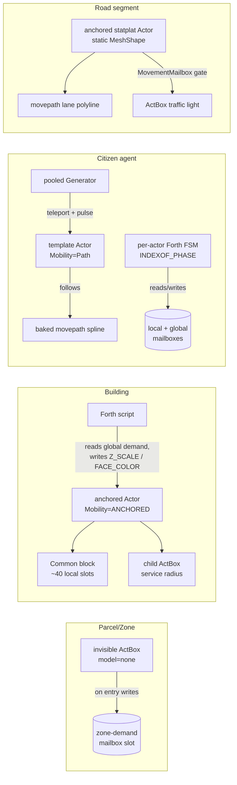

# Investigation: World Foundry as an authoring platform for city-builder→simulation experiences

**Date:** 2026-05-29
**Status:** Design vision (grounded in engine audit)
**Scope:** a platform for a RANGE of city-builder→simulation experiences across two axes — FIDELITY (statistical ↔ agent-based ↔ hybrid) and PURPOSE/RIGOR (entertainment game ↔ serious/educational game ↔ planning-grade validated simulation). Hybrid is one setting on the dial, not the mandate.
**Depends on:**
[2026‑04‑29 World Foundry vs Godot](2026-04-29-world-foundry-vs-godot.md) ·
[2026‑04‑28 Engine capabilities survey](2026-04-28-engine-capabilities-survey.md) ·
[2026‑05‑25 SMB features → WF primitives](2026-05-25-smb-features-to-wf-primitives.md) ·
[2026‑05‑26 spawn-template Forth primitive](2026-05-26-spawn-template-forth-primitive.md) ·
[2026‑05‑25 wf-edit code review](2026-05-25-wf-edit-code-review.md)

---

## Summary

| Question | Answer (short) |
|----------|----------------|
| Can WF author a city-builder *game*? | **Yes** — buildings/zones/roads/agents all map onto existing primitives (`Generator`+template, `ActBox`, `Warp`, `movepath`, mailboxes); the camera-driven active-room cull is a built-in hybrid-fidelity gate. |
| Can WF author across the FIDELITY dial? | **Yes**, with caveats. Pure-statistical and hybrid are natural; pure-agent is bounded by the **~2048-Actor ceiling** (11‑bit `_idxActor`) and a **few‑hundred** live-script / draw-call budget on mobile. |
| Can WF author exploratory / educational planning? | **Yes** — and wf-edit's real-time multi-user co-editing (CRDT + relay + voice/video) is a genuine differentiator for stakeholder workshops. |
| Can WF do planning-GRADE validated forecasting? | **No, not today** — no GIS ingestion, no calibration/validation harness, no headless batch, variable tick rate. This is a research-grade programme, not a subsystem of work. Be honest about it. |
| Is runtime placement / save of city state a blocker? | **Downgraded from blocker to major.** wf-edit's `wfcrdt::Doc` + `engine_bridge` + `level_save` already deliver runtime-mutable level state with save-back for *editing/moving/retyping* actors. The remaining edge is live CREATION of brand-new **non-templated** actors. |
| Single biggest enabler | The **mailbox bus + OAD schema⊥instance + camera-driven active-room cull**, plus wf-edit as a working runtime-mutable authoring surface. |
| Single biggest blocker (game) | The **seven hard engine blockers** (§8): 2048‑Actor cap · no pathfinding · no background/statistical tick · linear room chain · no GPU instancing · 3‑active‑room cap · no save-game in the runtime. |
| Single biggest blocker (planning) | The entire **data → model → calibrate → validate → export** stack is absent; WF is a presentation/experience engine, not a model engine. |
| Is anything in this document *unbuilt*? | **Most of the planning track, and the fidelity dial.** Every planning-grade element shown anywhere here (including the §12f calibration mockup) is **target-state / unbuilt** (P2, all 🚧). The per-system fidelity dial + LIFT/PROJECT seam (§4) is a design target (P1), not shipping code. Treat the prose, not the mockups, as the capability statement. |

---

## 1. The thesis

World Foundry is already a **composition-of-primitives platform that authors a range of arcade games** — Joust, Q\*bert, a Super Mario Bros conversion, snowgoons, minecart — by configuring one concrete `Actor` class with OAD data blocks, sensor/reference primitives (`ActBox`, `Warp`, `Generator`, `Destroyer`, `Spike`, `Shield`), and per-actor Forth scripts that talk to a mailbox bus. This document argues that the *same ethos* extends to a new genre family: city‑builder→simulation experiences, authored not as a single game but as a **range across two independent axes** — how *individuated* the simulation is (statistical ↔ agent ↔ hybrid) and how *rigorous* it must be (entertainment ↔ serious/educational ↔ planning-grade). The one distinct hook WF brings that SimCity, Cities: Skylines, and most desktop planning tools do **not** have is **wf-edit's real-time, multi-user, in-engine co-editing with presence, chat and built-in voice/video** — a collaborative authoring/observation surface that is as natural for two designers building a level as it is for a planner and a community group walking a scenario together.

**Why WF specifically.** (1) It already proves the composition model works across wildly different games using one `Actor` + OAD + Forth + mailboxes, so adding "city actors" (parcel, building, road segment, citizen) is *more content of the same kind*, not a new architecture. (2) Its camera-driven active-room culling — only the camera's room + 2 neighbours ever tick — is, by accident of its arcade-streaming heritage, the **foreground half** of a hybrid-fidelity model: the "simulate what you can see" gate, built in and free (`level.cc:941`). The matching "aggregate the rest" half the engine does **not** provide — off-camera rooms *freeze* (zero sim), they do not advance statistically (§8 blocker 3); that aggregate layer is the single biggest thing the author must build on top. (3) Its mailbox bus is a fidelity-agnostic blackboard: a value written by a per-agent script and a value written by an aggregate city controller are read identically by any consumer, which is precisely the substrate a per-system fidelity dial needs.

---

## 2. The design space (2D map)

Two orthogonal axes. The **fidelity axis** asks "is an individual citizen a simulated entity, or a number in a density field?" The **purpose/rigor axis** asks "is this validated against the real world, or validated by the player's experience?"

```
          PURPOSE / RIGOR  →   entertainment        serious / educational      planning-grade (validated)
 FIDELITY
   ↑
 statistical          ┌─ classic SimCity ────────── SimCity-in-classrooms ─────── SLEUTH (CA) / four-step ─┐
 (cells / stocks)     │  (RCI demand bars)          (teach feedback loops)         system-dynamics models   │
                      │                                                                                     │
 agent-based          │  Cities: Skylines           NetLogo / GAMA teaching        MATSim / SUMO            │
 (per-entity)         │  (every cim routed)         agent demos                    (calibrated transport)   │
                      │                                                                                     │
 hybrid               └─ SimCity 2013 / GlassBox ── instrumented hybrid demo ────── UrbanSim + travel model ┘
 (agents where seen)     (hybrid done right:                                       (parcel micro + ABM)
                          stats = ground truth)

 OFF-AXIS (not a fidelity point): the digital twin (Virtual Singapore) is a semantic CityGML/GIS database +
 analysis-as-a-service. Its value is the queryable semantic model, not the render or any sim-fidelity setting.
```

The three fidelity settings are **peers on a dial, none privileged** (§4): statistical is the **cheapest, safest baseline that scales to any city size**; hybrid is the **richest setting the camera-cull makes affordable**; agent is a **bounded showcase**. The per-project, per-system *choice* among them is the point — not a march toward hybrid.

**Where WF can credibly play** (shaded region — see Mockup 12a):

- **Statistical / entertainment** — strong fit. Per-district math over mailbox slots; cheap; scales to any city size. The cheapest, safest baseline.
- **Hybrid / entertainment** — strong fit; the camera-active-room cull is the fidelity boundary. The richest setting the cull makes affordable. The signature "zoom from god-view to follow one citizen" beat is reachable (with the camera FOV fix and the hero-agent carve-out, §4). Note the design map plots **SimCity 2013 / GlassBox** here as the hybrid *architecture* WF targets — but with the seam discipline GlassBox lacked: stats are ground truth, agents are a sampled render, so WF avoids GlassBox's "agent went to the nearest house, not its own" credibility break.
- **Agent / entertainment** — reachable but bounded. The ~2048-Actor ceiling and few-hundred live-script / 30–80 draw-call budget cap the *visible* agent count; the rest must be statistics. Cities: Skylines' "route every cim" is **out of reach**; its *pooled, capped, dummy-traffic* trick (which C:S itself uses) is exactly the right model.
- **Statistical & hybrid / serious-educational** — strong fit, and wf-edit's collaborative co-editing is a differentiator for participatory/classroom use.

**Where WF cannot credibly play:**

- **The top-right "validated forecasting" corner is the hardest and is out of reach today.** UrbanSim/MATSim are defined by being *estimated and calibrated on local data, then validated by backcasting*; uncalibrated microsimulation can overestimate traffic volume by 200%+. WF has zero of the data/model/audit stack required. A WF city sim can *look* congested; it cannot *predict* congestion. This corner is a research programme, not engine work — and a pretty render here is an active liability because it manufactures unearned credibility.

---

## 3. Shared substrate vs per-project deltas

The crux of authoring a *range* is a thin, honest **shared core** that serves every point in the space, with the genre/fidelity/rigor differences living in **swappable data and bindings**, not the engine. The eight substrate pillars, what WF already has (grounded in the audit), and what each region adds as a delta:

| Substrate pillar | What it must do | What WF already has | Per-project delta by region |
|---|---|---|---|
| **Entity / agent model** | type schema + per-instance state | ✅ **Strong.** One `Actor` class configured by OAD blocks (schema⊥instance, "a genuine ECS from 1996"); ~40–99 per-instance fixed-point mailbox slots (`baseobject.hp:97`, `mailbox.inc:97`). | game: art-driven actors · planning: parcel/household/job records (need richer-than-scalar storage). |
| **Spatial model** | grid / graph / continuous + neighbourhood queries | 🧩 **Partial.** Room graph = a coarse partition, but it's a **linear chain (≤2 neighbours)**, not a 2D map (`levelcon.h:52`). Continuous positions via Jolt. | game: room-per-district · planning: a finer cell/parcel/network model layered under rooms (engine work). |
| **Sim tick / scheduler** | fixed deterministic timestep, phase order, slow + fast cadence | 🧩 **Partial.** One per-frame pass over active rooms; deltaTime clamped to 0.1 s (10 Hz floor, `level.cc:808`). **No slow/statistical cadence; tick rate is variable.** | game: deadline-latch a 1 Hz economy tick in Forth · planning: a true fixed sim-step (engine work, prerequisite). |
| **Data / parameter binding** | named, addressable, externally-settable state | ✅ **Strong.** ~1900 named global mailbox slots (`mailbox.inc:66`) + OAD scoped property paths; wf-edit's `WriteFieldLeaf` sets any field live. | game: tune-by-feel · planning: bind named parameters to a scenario file + bulk-load initial state. |
| **Scripting / behaviour** | behaviour as data, hot-swappable, sandboxed | ✅ **Strong.** zForth per-actor scripts; multi-backend bridge (Lua/JS/WASM/Wren) over one mailbox API; proven at scale (Q\*bert director = 25,592‑char script driving 28 actors). **Caveat:** backend is a *compile-time* choice (`WF_FORTH_ENGINE` etc.) — "pick Lua for schedule-heavy agents" is **not** a per-project data switch yet. | game: zForth/Lua state machines · planning: same, plus calibration-tunable constants. |
| **Rendering** | detachable consumer of sim state | ✅/🚧 Renderer works but is **fused to the tick** (loop ends in Render/PageFlip); no instancing, no frustum cull (`backend_modern.cc`). | game: late‑90s look is fine · planning: render *uncertainty* honestly (new work, but a place WF could add value). |
| **Save / load of mutated state** | serialise full sim state | 🧩 **Mostly solved for editing** via wf-edit's `wfcrdt::Doc` → `levtree print` → .lev round-trip; runtime engine itself is read-only (`binstrm.hp:277`, only `hscore.cc` writes). | game: build-mode save = Doc save · planning: versioned run manifest (seed + params + provenance). |
| **Headless / batch** | run to completion, renderer absent, deterministic | 🚧 **Absent.** No documented headless path; tick married to the render phase. | game: not needed · planning: **mandatory** for calibration sweeps & sensitivity analysis (engine work). |

The pattern: **WF is genuinely strong on the four pillars that are about *state and behaviour* (entity model, parameter binding, scripting, and — via wf-edit — mutable save/load), and weak on the four that are about *rigor and scale* (a proper spatial model, a fixed/multi-rate scheduler, sim⊥render decoupling, headless batch).** That maps exactly onto "good at the game/exploratory regions, weak at the planning-grade region."

---

## 4. The fidelity dial

Fidelity is **an authoring choice, per project AND per system** — traffic can be agent-based while the economy stays statistical, because the right fidelity is a property of the *question each system answers*. Hybrid is just the middle detent, not the destination.

### How the SAME WF primitives configure for each setting

**Pure statistical (no agents).** The whole city's aggregate state lives in a `base+stride` block of global mailbox slots (`DISTRICT_BASE + i*STRIDE + field`) holding R/C/I demand, land value, pollution, occupancy per district. ~6–8 slots/district × 1900 slots = **~230–300 districts** of aggregate state. Cost is a handful of float updates gated to ~1 Hz — effectively free, **independent of "population"**. No `Generator`, no `movepath`, no per-citizen actor. The cheapest, safest baseline; scales to any city size.

> **Where the statistical tick must run — and where it must NOT.** It is tempting to put a director `Actor` *inside each district-room*. **That does not work:** only actors in the ≤3 *active* rooms run their scripts (`level.cc:1015` iterates `_theActiveRooms` only); a director living in an inactive district-room is **frozen** and cannot advance that district at all. The statistical tick must therefore run from an **always-active controller**: either (a) **one global "city-economy" director `Actor`** placed so it is never culled — in the permanent slot, or pinned to the camera's watch-object room — iterating *all* districts' `base+stride` global-slot blocks every slow tick regardless of which rooms are active; or (b) a host-side C++ pass outside the room loop. This is the spatial audit's own resolution (it rates a room-resident background tick a **blocker**): run the aggregate sim *outside* the room system; rooms contribute only the foreground window. The latch idiom is the shipping SMB `SMB_PIRANHA_NEXT` deadline pattern, just hosted on the one always-active controller.

**Pure agent (every visible entity is a real Actor).** Citizens/vehicles are template-flagged actors spawned by pooled `Generator`s (the teleport-a-pooled-generator idiom from the spawn-template doc), `Mobility=Path`/`Follow` following baked `movepath` splines, each with a per-actor Forth state machine (the Goomba/Koopa pattern). Bounded **first** by the **few-hundred live-script + 30–80 full-mesh draw-call budget** (which bites long before the index ceiling for anything with non-trivial per-agent AI), and **then hard** by the **~2048-Actor ceiling** (shared by *all* live entities incl. buildings/roads). Viable for a *small* focused district; not for a city's full population.

**Hybrid (agents in focus, statistics elsewhere).** The richest setting the camera-cull makes affordable — *not* the destination, just the middle detent. The always-active statistical controller (above) runs the whole city every slow tick; the camera-active room(s) additionally *promote* their district to agents — spawn `floor(occupancy × visible_fraction)` citizens synthesised to match the authoritative stat, let them path/behave, then *demote* (despawn) on room exit while the stat keeps advancing in parallel.

The active-room cull (`level.cc:941`) gives the promote/demote **trigger** for free — it tells the city-sim *which* district(s) just became camera-active. It does **not** give the mechanism: the LIFT/PROJECT spawn/despawn/recycle logic is city-sim code you must write (the engine has no aggregate layer — entity-model + spatial audits).

**The hard consequence of the 3‑active‑room cap.** Only 3 rooms are ever resident (current + ≤2 *linear-chain* neighbours; `MAX_ACTIVE_ROOMS=3`, camera audit). If district = room (the §7/§8 mapping), then **at most 3 district-rooms can hold live agents at once** — in practice the focused district plus its two chain-neighbours. **Agents exist only along the camera's current stretch of the room chain; every other district is pure statistics.** A whole-city simultaneous agent view is therefore out of reach by design — which is exactly why the diorama / drill-into-one-district framing (§11) is the honest product shape, not a workaround.

### What the engine must expose to dial it (design target — P1; not built)

- **A per-system fidelity enum in OAD** — `sim.traffic.fidelity = AGENT`, `sim.economy.fidelity = STATISTICAL` as scoped properties. OAD already supports scoped paths; this is a schema delta, not a runtime change.
- **A slow city tick** decoupled from the frame, hosted on the one always-active controller (a deadline-latch director actor today; a real fixed sim-step is the planning-grade upgrade).
- **LIFT and PROJECT adapters at the seam.** LIFT = sample N agents from an aggregate (statistical→agent on room activation). PROJECT = bin agents back into counts/means (agent→statistical on exit). **Stats are ground truth; agents are a sampled render of them, never the reverse** — the single rule that keeps a district consistent across a fidelity change and avoids GlassBox's "agents went to the nearest house, not their own" credibility gap.
- **Deterministic LIFT seeding.** LIFT must be seeded *deterministically per district* (e.g. `seed = district_id ⊕ stat_snapshot_hash`), so look-away→look-back **regenerates the SAME individuals** (same houses occupied, same agent appearances) rather than a fresh random draw an attentive player would catch. Only when the underlying stat has *materially* changed should the sampled population visibly change. This is the missing third leg alongside conserved-invariants and stats-as-truth.
- **Conserved invariants** (population, money, vehicles) the engine can assert across a swap, so dialling fidelity preserves totals on the swap tick.

### The hero-agent carve-out (reconciling "follow one citizen" with despawn)

"Follow one citizen home" uses `TrackObjectMailbox` to make the chosen agent the camera **watch object** — and the watch object *drives* the active room set (`GetWatchObject`, camera audit). So a followed agent **must be exempt from PROJECT/despawn** (despawning the watch object is undefined), and its destination district stays activated automatically (it *is* the watch object). A followed agent is therefore promoted to a **persistent Tier‑0 "hero" entity** that:

- is **never** PROJECTed/despawned while followed;
- carries its **own coherent** home/work identity, *not* a per-district re-synthesised one (re-synthesising on each district crossing is precisely the GlassBox nearest-house lie);
- is **subtracted from its current district's statistical occupancy** so it is not double-counted (once as a live Actor, once in the population number) — a concrete instance of the conserved-quantity rule above.

### The conservation accounting at the seam (concrete WF mechanism)

On promote, `LIFT` spawns `floor(occupancy × visible_fraction)` agents; the **un-shown remainder** stays as the district's aggregate occupancy slot. A completed agent action (e.g. a finished commute) must write an **aggregate delta** to a well-known global slot (a "commute-satisfied" counter the slow tick folds into the stat) — and must **not** also be re-counted when the agent is PROJECTed on demote. The convention: agents read FROM stats and write back only *aggregate deltas at defined moments*; PROJECT discards the live agents and keeps the stat (which the slow tick advanced in parallel), so the two layers can never contradict. One subtlety to reconcile in code: the engine's own automatic actor→room migration (`MovesBetweenRooms`/`UpdateRoomContents`) can re-file or kill an agent crossing the active-window boundary — this competes with the city-sim's PROJECT-on-exit and the two despawn paths must be coordinated (one owner per agent), or the same agent is double-handled.

Keeping it consistent: the statistical model is authored to be the *mean-field limit* of the agent model (their projected aggregates agree in expectation for the same inputs), so swapping fidelity changes the *view*, not the *game*. Two honesty caveats: (1) if the two halves are calibrated independently they diverge — cross-calibration is real per-system work, not a free lunch; and (2) for some city systems (nonlinear traffic, threshold-driven economies) a *provable* mean-field limit may not exist at all — the statistical layer is then an empirical fit with its own residual error, and the fidelity swap will change behaviour within that error no matter how much you calibrate.

---

## 4b. Is the GAME end still fun? — the four core city-sim loops

Proving WF *can build* city primitives is not the same as proving the resulting game is *fun*. The genre's pleasure lives in four loops, and each survives WF's constraints — but only because the constraints happen to align with the *cheap* version of each loop the reference games already use.

**1. The self-stoking RCI demand loop (the macro engine).** Zone R → population rises → that raises C/I demand (residents need jobs + shops) → zone those → which raises R demand again. The player's whole macro job is keeping the three bars balanced. In WF this is **three global mailbox accumulators** updated by the always-active controller's slow tick and surfaced as a HUD gauge (the `SCORE`→`DrawHud` path, mb 70). The loop is the *feedback*, not the data structure: each balancing move the player makes shifts the demand the next move chases. Cheap, statistical, and exactly classic SimCity's RCI model — fully within the mobile budget.

**2. Traffic as a solvable puzzle (does it survive pre-baked routing?).** This is the single most-cited fun factor for the agent end ("the same congestion solved a thousand ways; mastery is visible and shareable"). The worry: if routing is baked `movepath` splines + a statistical edge-load number rather than emergent A*, is it still a *puzzle* or just a diorama with scripted cars? **It survives** — walk the loop end to end: the player redraws a junction (wf-edit road tool) → the per-edge **statistical flow solve** recomputes congestion as `edge-load = Σ trips assigned over the graph` (recomputed every N seconds, not per-frame per-agent) → the congestion **density tint** and the speed of a handful of **cosmetic token vehicles** visibly respond → the player sees the win. The player is optimising **computed edge-load**, not babysitting emergent pathfinding — which *preserves the puzzle* AND sidesteps the entire C:S "all cars funnel into one lane" pathfinding-stupidity failure class. The puzzle is real because the load is real math the player provably reduced; the cars are a readout of it.

**3. Cause→effect inspectability (the genre's #1 fun factor AND #1 failure mode).** "Opaque simulation" is the genre killer; GlassBox's deepest failure was *lying* about being per-agent. WF's cheap win: **every stat that drives a decision already flows through the mailbox bus, so the inspector is nearly free.** Tap a building or agent → an overlay surfaces the governing mailbox slots and their input deltas — `mood 0.4 ← no road access −0.3, high pollution −0.2`. This is also *how the player "sees"* the statistical systems that have no visible agents at all (pollution, land value, demand): the overlay substitutes for agents on the cheap systems. **Promote inspectability to a first-class game requirement, not polish** — without an inspectable chain back to a cause, the whole appeal evaporates into noise.

**4. Failure/loss + the anti-"solved-city" progression.** A sandbox with no stakes goes inert; the "boring mid-game / solved city" is a documented genre death. The counter is **escalating milestone tiers** where *each solution seeds the next problem*: a population threshold (a cheap mailbox comparison + a zForth unlock) opens a new building/zone/service tier, which creates more traffic/pollution/demand, which is the next problem. Pair that with a **legible failure surface** (budget deficit, district revolt, service-coverage collapse) so there are real stakes. **Critical anti-pattern to design around:** do **NOT** gate a service outcome on a dispatched vehicle physically *arriving* — that is the source of C:S's death-wave / garbage-pileup bug class (a hearse stuck in traffic ⇒ uncollected dead ⇒ cascading failure that feels unfair and is really a traffic bug in disguise). **Resolve the service outcome in the macro model** (coverage radius + capacity, a number); spawn the truck *cosmetically* for flavour. This is the cleanest place WF's statistical-core discipline turns a famous failure mode into a non-issue.

**The visible-agent budget is sufficient for the *fun*, even though it's far below a real population.** The scale table (§9) gives ~30–80 full-mesh + a few-hundred billboard agents on mobile. That is **enough to deliver the "living diorama" fun factor** — a small number of well-animated foreground agents reads as "alive" far beyond their actual count. The headcount ceiling constrains *simulation truth*, not *perceived liveness*; "place it and watch the city come alive" is satisfiable with cosmetic liveness over a statistical core, which is the whole point of the hybrid/statistical split.

---

## 5. The purpose/rigor axis: game ↔ planning tool

Moving rightward changes the **validation loss function**, and the change is structural, not cosmetic:

| | Entertainment game | Serious / educational | Planning-grade (validated) |
|---|---|---|---|
| Validated by | the player's experience | a teaching objective | the real world (counts, parcels, census) |
| Model can be | hand-tuned, fudged, special-cased | same, but instrumented to expose causality | **calibrated to local data, then validated by backcasting** |
| Output is | "feels congested" | "see why it's congested" | a forecast distribution **with an uncertainty band** |
| Honest claim | "fun" | "illustrative / intuition-building" | "predictive within stated tolerance" |

**The serious-games / Planning Support Systems lineage is real and credible:** SimCity has long been used in classrooms to teach feedback loops; Cities: Skylines has reportedly been used in municipal planning *workshops* — and the documented finding is the load-bearing one (the engagement-vs-prediction split, which does not depend on any specific city): it was **great for stakeholder engagement and useless for prediction** (its shortest-path agent traffic is visually plausible but quantitatively invalid). Desktop PSS tools (CommunityViz binding to ArcGIS layers, ArcGIS Urban, UrbanSim feeding a travel-demand model) occupy the rigorous end and abandon the game loop entirely.

**The hard requirements planning adds** (each absent in WF today): GIS/census ingestion on a real coordinate reference system (shapefile/GeoJSON/OSM/CityGML, LODES/LEHD origin-destination employment data); calibration of model coefficients to observed ground truth — **which first requires acquiring, cleaning, and licensing a baseline ground-truth dataset** (count stations, household travel survey, parcel/assessor data); this data sourcing is often the *dominant* cost and a hard institutional dependency, not a coding task; validation/backcasting on held-out history; sensitivity analysis and uncertainty quantification (Monte Carlo + data + structural error, often global SA over the parameter space — cf. SLEUTH's brute-force calibration that was CPU-intensive enough to *block adoption*); **uncertainty represented as a first-class quantity** in the data model (outputs are distributions / error bands, not single deterministic numbers — a substrate property WF lacks, distinct from merely *rendering* uncertainty); equity/accessibility metrics (15‑minute‑city isochrones, Gini/Lorenz on access distribution, environmental-justice exposure overlays); and an audit/reproducibility trail (versioned inputs + assumptions + seed + code, ODD/TRACE-style) because planning outputs feed public decisions and litigation. Note: WF's per-*asset* licence provenance is **not** simulation auditability — they sound similar and are unrelated.

**Frank verdict.** WF can credibly author the **game** end and the **exploratory / educational-planning** end (what-if intuition, public engagement, scenario walkthroughs that *consume* a real tool's outputs). The **validated predictive** end is a research-grade bar WF does not meet today and likely should not claim — the right framing is "WF is the front-of-house for someone else's validated back-of-house model (UrbanSim/MATSim run elsewhere)," never "WF forecasts." Guard this framing as fiercely as the capability survey guards "snapshot, not normative."

**WF's unusual asset for the planning/educational end:** wf-edit's **real-time multi-user co-editing** — a `wfcrdt::Doc` CRDT synced over a WebSocket relay with presence dots, Markdown chat, server-side room snapshots, and **built-in WebRTC voice/video** plus one-link Cloudflare-tunnel invites. SimCity and Cities: Skylines are single-author; most desktop PSS tools are too. A planner and a community group co-editing and *talking over* one live scenario, in-tool, is a genuine differentiator.

---

## 6. Authoring workflows across the range

**wf-edit is the primary in-tool authoring surface** for both the city-builder build-mode and the planner's interactive scenario editor — complementary to, not a replacement for, the Blender→.lev→.lvl→.iff art pipeline. It embeds the engine for a live viewport, represents the level as a lossless `wfcrdt::Doc`, and provides an ImGui dockspace: Outliner (left), OAD-keyed property panel (right), ImGuizmo move/rotate/scale gizmo, with the live engine render passed through the centre node.

### How much of the city-builder "place/edit at runtime" verb wf-edit already delivers

Per the editor audit, **a lot** — enough to downgrade the old "runtime mutation / save of state" gap from *blocker* to *major*:

- ✅ **Edit / move / retype existing actors live.** Every Doc edit flows through `engine_bridge` → `DrainEngineSync` → `wfmut::SetActorPos/Orientation/Field` into the *running* engine each frame (across 77 common/movebloc/mesh fields). The gizmo previews live and writes the Doc on release.
- ✅ **Save-back round-trips losslessly** via Doc→JSON→`levtree print`→.lev, then the 5-stage `build_level_binary.sh`→.iff. Structural and remote edits persist, not just value edits.
- ✅ **Native undo/redo** (Yrs `UndoManager`, content-scope, local-origin only) reverses field edits, gizmo moves, *and* add/delete; drag/typing bursts coalesce into one step.
- ✅ **Collaborative** edits, presence, chat, voice/video — all riding the same Doc→bridge path as local edits.

### What's still missing for a smooth build-mode

- 🚧 **Live CREATION of brand-new actors.** `AddActor`/`Duplicate` write the Doc and save correctly, but the new actor only appears in the *running viewport* if it's a **templated (spawnable)** class — a fresh `AddActor` has `_src_eid=''` so no live counterpart is spawned, and real Actor-kind `SpawnActor` is **unconfirmed in code** (`RunSpawnConfirmTest` notes Room/Tool/Level templates abort in their OAS constructor). *Workaround / design rule:* make every placeable city type (house, road segment, citizen, prop) a **template/generator-spawnable** class so live plopping works through the confirmed path; otherwise accept place→save→reload for offline build-mode. **Confirming Actor-kind `SpawnActor` end-to-end is the single highest-value unblock.**
- 🚧 **No domain build-mode tools** — no road/network drawing, no parametric/brush/zone-paint placement, no GIS import UI, no scenario branch/compare, no headless scenario runner. All are *additive ImGui panels + Doc writers on existing primitives* (a road tool emits a strip of templated segment actors; GIS import bulk-`AddActor`s; scenario compare diffs two Docs via the already-exposed Yrs `stateVector`/`stateDiff`) — substantial UI cost (weeks each), **no engine architecture change**.
- 🚧 **No outliner virtualization.** It renders every row each frame with an O(peers) presence scan per row — comfortable to a few hundred actors, degrading by ~1–2k, unusable as a flat list at the 10k+ a city implies. Needs `ImGuiListClipper` + search/filter/group-by-room (pure UI work).
- 🔧 **Shared-OAD-block writes are in-place** — editing one actor that shares a flyweight page changes both; copy-on-write deferred. For a city this is often *desirable* (tune "all residential" at once); per-instance overrides need the scoped COW follow-up.

### The two authoring paths (collaborative co-editing is shared infrastructure for both)

- **Game-designer path** (well-supported today): hand-author content + art in Blender → compile; tune behaviours as zForth scripts; iterate in wf-edit's live viewport with gizmo + property panel; build-mode save = Doc save. The artifact is hand-authored and intentionally non-real.
- **Planner/researcher path** (mostly missing today): IMPORT GIS/CSV → initial agent population + spatial graph (no importer exists — the WF pipeline is *art*, Blender→IFF); CALIBRATE model parameters to a baseline (no fitting loop); SWEEP N scenarios headless (no headless mode); EXPORT to CSV/GeoJSON + a run manifest (no metrics export). A designer authors the *world*; a researcher authors the *experiment* (parameter space + metrics + seed). wf-edit serves the former; the latter front-end is unbuilt.

---

## 7. Mapping the substrate to WF primitives

Legend (from the SMB doc):

| | meaning |
|---|---|
| ✅ | **done** — already implemented and working |
| 🧩 | **compose** — wire existing LIVE primitives in the level; no engine change, little/no script |
| 🔧 | **compose + Forth** — existing primitives plus a per-actor script (state machine / AI) |
| 🚧 | **engine work** — needs a new mode, new class, ingestion, or tooling; not expressible by composition today |

| Platform capability | WF primitive composition | Status |
|---|---|---|
| **Parcel / zone** | Invisible `ActBox` (model=none, visibility=0); on agent/query entry writes zone-id/demand mailbox; zone state in global + per-zone local slots (`actbox.cc:84`) | 🧩 |
| **Building** | One anchored `Actor` per building/block (`Mobility=ANCHORED`→`NullHandler`, zero per-tick physics) + Common block (~40 local slots: occupancy/jobs/wealth) + optional child `ActBox` for service radius | 🧩 |
| **Building grows / levels up** | building Forth script writes `FACE_COLOR_*` (confirmed live override) and/or `Z_SCALE` from local demand vs a global slot. *`Z_SCALE` is in the LOCAL_SYSTEM register list but runtime visible-rescale is **not demonstrated** in the audit — verify, or fall back to swapping to a taller template for the level-up visual.* | 🔧 |
| **Single road lane segment** | anchored `statplat` Actor (static MeshShape under Jolt) for one short straight lane; a single baked `movepath` polyline (2–4 keys) | 🧩 |
| **Road *network* (routed)** | many short lane-segment Actors + Forth+mailbox junction routing (one path per actor is bound at construction; cars hand off between segments via `Warp`/re-base or a re-fire). Kinematic paths **don't yield in physics** — de-conflict junctions at author/script time with `ActBox`+mailbox. Long dense lanes hit the **O(6·keys) linear keyframe scan** (`movepath` PERFORMANCE WARNING) — keep splines short, or land the ~20-line binary-search fix before scaling agent counts. | 🔧 |
| **Citizen agent (visible)** | template `Actor` spawned by pooled `Generator`, `Mobility=Path`/`Follow`, per-actor Forth state machine reading mailboxes | 🔧 |
| **Vehicle agent (visible)** | identical: kinematic `movepath` follower, `MovementMailbox`-gated for stop/lights (`movepath.cc:89`); convoy = N cars staggered on one shared spline | 🔧 |
| **Traffic stop / light / yield** | clear the car's `MovementMailbox` to freeze on its spline; `ActBox`/global mailbox drives the light | 🧩 |
| **Statistical city/district tick** | one **always-active** director `Actor` + Forth latched off `TIME` (1906) deadline idiom, iterating all districts' `base+stride` global slots. *Requires an always-active controller (permanent slot / camera-room-resident, or a host pass) — a per-district director **inside** an inactive room is frozen (scripting + spatial audits).* | 🔧 |
| **Demand (RCI) gauges** | three global mailbox accumulators → HUD via the `SCORE`→`DrawHud` path (mb 70) | 🧩 |
| **Pollution / land-value field** | per-cell float array (own data) updated on slow tick; visualised as overlay; never per-agent | 🚧 (own data structures) |
| **Service dispatch (fire/police)** | coverage = statistical field check and the **outcome is resolved in the macro model** (a number); the truck is a *cosmetic* `Generator`-spawned path-follower for flavour — **never** gate the outcome on the truck arriving (that is C:S's death-wave bug class) | 🔧 |
| **Demolition / despawn** | `Destroyer` (remove on mailbox flip) or TTL `ALIVE=0` recycle | 🧩 |
| **Cause→effect inspector** | tap actor → overlay surfaces its governing mailbox slots + input deltas (all cross-actor state already on the bus) | 🧩 (data) / 🚧 (overlay UI) |
| **Milestone / unlock progression** | mailbox-threshold compare + zForth unlock; each tier seeds the next problem | 🔧 |
| **Data / parameter binding** | global mailbox slots + OAD scoped paths; wf-edit `WriteFieldLeaf` live; scenario→slot loader | 🧩 / 🚧 (bulk loader) |
| **Save / load — build-mode (authoring)** | wf-edit `wfcrdt::Doc` + `engine_bridge` + `level_save` → .lev/.iff round-trip | ✅ (edit) / 🚧 (live create non-templated) |
| **Save / load — in-game resume** | runtime HAL is read-only (`binstrm.hp:277`); needs a new versioned IFF-chunk writer over an out-of-engine city-state model (reader exists) | 🚧 (blocker 7) |
| **Runtime authoring / placement** | wf-edit gizmo + property panel + Add…; live for templated classes, save-then-reload for non-templated | 🧩 / 🚧 |
| **Fidelity dial (per-system)** | OAD scoped `sim.<system>.fidelity` enum + LIFT/PROJECT seam logic in Forth/C++ | 🚧 |
| **Camera focus (god↔street)** | `CamShot` keyframes + `PanCameraHandler` dolly; `TrackObjectMailbox` follow-an-agent; `ActBoxOR`→`EMAILBOX_CAMSHOT` district focus | 🧩 (dolly) / 🚧 (true FOV zoom: 1‑line `SetProjection` fix) |
| **Camera-driven sim LOD** | active-room cull: only camera room + 2 neighbours tick (`level.cc:941`) | ✅ |
| **GIS / shapefile / CSV import** | parser → levtree-shaped JSON → `BuildChunk` bulk-`AddActor`; needs CRS/projection handling | 🚧 |
| **Calibration to ground truth** | (none) — needs fitting loop + baseline dataset + objective | 🚧 (research-grade) |
| **Scenario compare / branch** | diff two `wfcrdt::Doc`s via Yrs `stateVector`/`stateDiff` (already exposed) + a compare panel | 🚧 (UI) |
| **Headless batch run** | factor the 7-phase tick so Script→Movement→Collision→Animation runs with Render/PageFlip absent, CLI-driven, seeded | 🚧 (refactor, prerequisite for planning) |

---

## 8. Engine reality check (gap analysis)

### The seven hard, evidence-backed engine blockers (the spine of the verdict)

These seven are not opinions or "weeks of work" gaps — each is a concrete, audited code fact, and together they are the spine of the honest verdict in §13. The document must not read as more feasible than these allow. For each: what it is (with file/symbol evidence), **what it blocks across the design space**, and what — if anything — mitigates it (**wf-edit**, a **desktop/non-mobile build**, or **scoped engine work**).

**1. Hard 2048‑Actor cap — shared by *everything*.** `Actor::_flags._idxActor` is an **11‑bit field** (`actor.hp:269`, `unsigned _idxActor : 11; // 2048 objects max.`). This single index space is shared by **all** live actors at once: static buildings, road-segment actors, zone trigger boxes, the camera, *and* every spawned citizen/vehicle. *Blocks:* a fully-individuated city — even a few thousand simultaneous agents+buildings overflows it; caps the pure-agent setting to a small focused district. *Mitigation:* design — keep instantiated Actors under ~2048 and hold the city's background as aggregate (non-Actor) data; the hybrid model exists precisely to respect this. **Not** fixed by wf-edit or a desktop build (it is an index width, not a budget). Widening `_idxActor` is **scoped engine work** that ripples into the Scalar-encoded actor index in mailboxes, the room `int16` lists, and `BaseObjectIteratorFromInt16List` — a real fork, not composition.

**2. NO pathfinding of any kind.** Engine-wide grep for navmesh/astar/pathfind/waypoint/steering/flocking returns only false positives — there is **no** nav-mesh, A*, Dijkstra, waypoint graph, or flow field. Every trajectory must be **pre-authored or scripted**. *Blocks:* emergent traffic/agent routing; any agent computing its own route; the C:S "route every cim" model. *Mitigation:* design — model roads as a baked `movepath` segment graph, route between segments with a Forth+mailbox state machine at junctions (this also *sidesteps* the entire C:S pathfinding-pathology failure class, so it is partly a feature). **Not** fixed by wf-edit or a desktop build. A real nav-mesh/A* layer is **large scoped engine work** WF has never had.

**3. NO background / statistical tick — off-window rooms are fully frozen.** Only the ≤3 active rooms run: `Level::updateRoomContents` iterates `_theActiveRooms` only (`level.cc:1015`); off-window rooms get **zero** `ActorStartFrame`/predict/collision/`UpdateRoomContents`/script. The engine has only **binary** resident-and-full-sim (3 rooms) vs not-resident-and-zero-sim (all others) — there is no "simulate this region cheaply." *Blocks:* the "aggregate the rest" half of the hybrid model out of the box; a self-advancing off-camera economy. *Mitigation:* design — run the aggregate sim **outside** the room system on one **always-active** controller over global mailbox slots (§4). **Not** fixed by wf-edit or a desktop build (it is an architectural absence). A first-class background tick is **scoped engine work**.

**4. The room graph is a LINEAR chain, not a 2D city map.** `MAX_ADJACENT_ROOMS=2` (`levelcon.h:52`); each room carries exactly `adjacentRooms[2]`, and `InitRoomSlotMap` walks the chain strictly forward/backward, **asserting a clean prev/next (1‑D corridor) topology** that will assert-fail on a branching graph. `MAX_TRANSIENT_SLOTS=3`. *Blocks:* a contiguous 2D/4‑connected city; streamed grid districts; any layout that is not a 1‑D corridor of rooms. *Mitigation:* design — either one big single room (lose room-LOD and streaming) or accept the corridor. **Not** fixed by wf-edit or a desktop build. A 2D streamed map is **scoped engine work** (rewrite `InitRoomSlotMap`, `ChangeActiveRoom` slot accounting, asset sizing) — an engine fork.

**5. NO GPU instancing.** No `glDrawArraysInstanced`/`glVertexAttribDivisor`/`gl_InstanceID` anywhere in `gfx`/`renderassets`/`particle`; geometry is re-uploaded every frame via `glBufferData(GL_STREAM_DRAW)` on each `Flush` (`backend_modern.cc`); no frustum cull either. **1000 identical buildings = 1000+ draw calls.** *Blocks:* "thousands of identical buildings/cars as individual objects"; dense visible crowds. *Mitigation:* design — merge repeated static geometry per district into a *few* large author-time meshes; far agents as `RenderActorScarecrow` billboards; distant districts as a `ScrollingMatte` dissolved into fog. A **desktop build** raises the draw-call ceiling (no mobile thermal/RAM wall) but does **not** add instancing — the shape is identical, just higher. **Not** fixed by wf-edit. True instancing is **scoped engine work**.

**6. Hard cap of 3 active rooms.** `MAX_ACTIVE_ROOMS = MAX_ADJACENT_ROOMS+1 = 3`, and it is hard-asserted equal to `VideoMemory::MAX_TRANSIENT_SLOTS=3` (`actrooms.cc:48`). At most the focus room + its ≤2 chain-neighbours render/tick/collide at once. *Blocks:* N simultaneously-visible simulated districts; a true whole-city god-view through the room system. *Mitigation:* design — one big room (everything ticks, lose room-LOD), or embrace the "drill into one district / diorama" framing as the product (§11). A **desktop build** does not lift it (it is tied to the transient texture-slot count, asserted). **Not** fixed by wf-edit. Raising/decoupling it is **scoped engine work** (and pairs with blocker 4).

**7. NO save-game system in the runtime.** The `DiskFile` HAL (`DiskFileHD`/`DiskFileCD`) is strictly **read-only** — no `Write`/`WrBytes`; `binostream` and all serialise-out operators are `WRITER`-gated and compiled in **no** build (`binstrm.hp:277`); the only runtime file write is `hscore.cc`'s raw `fwrite` of a high-score blob. Nothing in the shipped game serialises live actor/mailbox/spawned state. *Blocks:* the city-sim core loop (build, watch it grow, quit, **resume**). *Mitigation — and this is the one blocker wf-edit substantially closes, for authoring:* the editor's **`wfcrdt::Doc` + `level_save` (`SaveDocToLev`→`levtree print`→.lev→.iff)** path *is* a working mutate-then-persist round-trip — so for an **editor/build-mode** workflow (place, edit, save the level), save/load is largely solved. **What remains in the shipped *game* runtime:** that path lives entirely in the editor app and relies on the Rust `levtree`/`levcomp` tools and a .lev→.iff recompile to reload; the **game runtime itself still has no writer**, so an in-play "save my grown city and resume" needs a new save subsystem (lightest: a versioned IFF-chunk writer — the reader already exists; only the writer is missing — over a city-state model kept *outside* the engine actor list). So: **authoring/build-mode save ✅ via wf-edit; in-game save 🚧 (scoped engine work).** A desktop build does not change this.

| # | Blocker | Evidence | Blocks | Mitigation |
|---|---|---|---|---|
| 1 | 2048‑Actor cap | `actor.hp:269` (`_idxActor : 11`) | fully-individuated city; pure-agent at scale | design (aggregate background); widening = scoped engine fork |
| 2 | No pathfinding | engine-wide grep negative | emergent routing; route-every-cim | design (baked `movepath` graph + Forth junctions); navmesh = large engine work |
| 3 | No background tick | `level.cc:1015` (active rooms only) | self-advancing off-camera city; hybrid "aggregate rest" | design (always-active controller, §4); first-class tick = engine work |
| 4 | Linear room chain | `levelcon.h:52`, `InitRoomSlotMap` assert | 2D city map; streamed grid | design (one room / corridor); 2D streaming = engine fork |
| 5 | No GPU instancing | `backend_modern.cc` (per-frame `glBufferData`) | thousands of identical objects | author-time merge + billboards; desktop raises ceiling; instancing = engine work |
| 6 | 3 active rooms | `actrooms.cc:48` (`==MAX_TRANSIENT_SLOTS`) | N visible districts; whole-city god-view | design (diorama framing); raising it = engine work |
| 7 | No runtime save-game | `binstrm.hp:277` (`WRITER`-gated), read-only HAL | build→grow→quit→**resume** | **build-mode save ✅ via wf-edit Doc**; in-game save = scoped engine work |

### Other game-shaping gaps (not among the seven, but real)

| Subsystem | Gap | Severity | Note |
|---|---|---|---|
| Movement | one path per actor, bound at construction; kinematic paths don't yield in physics; O(6·keys) linear keyframe scan | major | Pool one PATH actor per lane segment; de-conflict junctions with `ActBox`+mailbox at author/script time; keep splines short (2–4 keys) or add the ~20-line binary-search fix. |
| Camera | per-shot **FOV/hither/yon computed but never applied** (~2003 KTS TODO); no ortho; no free orbit | major | True zoom is a ~1-line `SetProjection` fix; orbit/pan via a script-driven dolly actor + camera mailboxes. |
| Sim state precision | mailbox cell is 32‑bit **float** (`Scalar=float`, `zf_cell=float`); integer exactness lost above ~16.7M | minor | City-wide population/treasury totals quantize at ~7 significant digits (cosmetic for a city sim); keep per-district pools in the exact range, or split a citywide total across high/low slots if exactness is ever required. |

### Planning-grade-blocking gaps (a separate, harder track)

| Need | WF state | Severity |
|---|---|---|
| GIS / census ingestion on a real CRS | **absent** — pipeline is Blender→IFF (art, not data); no shapefile/OSM/CityGML reader | **blocker** |
| Sim⊥render decoupling (headless) | **absent** — tick ends in Render/PageFlip; never run without a frame drawn | **blocker** |
| Fixed deterministic sim-step | **absent** — variable tick rate; `INDEXOF_DT`/`GAME_TIME_S` deferred | **blocker** (corrupts rate-equation integration + determinism) |
| Calibration / fitting loop | **absent** | **blocker** (this is the *majority* of the scientific work, not a backlog item) |
| Baseline ground-truth dataset | **absent** — must be sourced, cleaned, licensed (counts/survey/parcel) | **blocker** (institutional dependency, often the dominant cost; not a coding task) |
| Validation / backcasting | **absent** | blocker |
| Sensitivity & uncertainty (Monte Carlo, global SA) | **absent** — needs headless sweeps first | blocker |
| Uncertainty as a first-class output quantity | **absent** — outputs are single floats, not distributions/error bands | major (a substrate property, distinct from rendering uncertainty) |
| Equity metrics (isochrones, Gini/Lorenz) | **absent** — needs graph/shortest-path machinery WF lacks | major |
| Audit / provenance for SIM runs | **absent** for the sim layer (per-asset licence provenance is unrelated) | major |
| Analysis export (CSV/GeoJSON + run manifest) | **absent** | major |

### Re-evaluation of "runtime mutation / save of state" in light of wf-edit

**Downgraded from blocker to major.** The editor audit shows `wfcrdt::Doc` + `engine_bridge` (`DrainEngineSync` every frame via `wfmut`) + `level_save` (Doc→levtree→.lev→.iff) already provide a working **runtime-mutable level state with lossless save-back**, plus collaborative multi-user editing, presence, and native undo/redo. Precisely what *remains*:

- **Live CREATION of new non-templated actors** (🚧) — `AddActor` saves correctly but only *templated* classes spawn into the running viewport; real Actor-kind `SpawnActor` is unconfirmed. *The remaining true edge of the gap.*
- **Scale** — the flat outliner + O(actors×peers) per-frame loops wall at ~1–2k actors; a city's thousands of agents must be the engine's *hybrid* aggregate (not individually Doc-listed), with only camera-visible agents materialized. wf-edit's outliner, not the renderer, is the first wall.
- **Shared-OAD-block COW** for per-instance overrides (deferred).
- **Bridge reset** for in-session scenario switching (today File→Open re-execs a fresh process; a `ResetBridge()` is scoped).

**Net effect on the seven:** wf-edit substantially closes **blocker 7 (no runtime save-game) for the authoring/build-mode workflow** — place/edit/move/retype/save round-trips today — leaving only **in-game** resume as scoped engine work. It does **nothing** for the other six (2048 cap, no pathfinding, no background tick, linear room chain, no instancing, 3 active rooms), which are architectural facts wf-edit cannot touch. And on the planning side it leaves the whole data → model → calibrate → validate → export stack untouched.

---

## 9. Scale & performance

Concrete numbers from the audit (reasoned from the code path; no in-tree benchmark exists — measure before committing to counts):

| Constraint | Mobile (game budget) | Desktop (planning build can relax) |
|---|---|---|
| **Hard Actor ceiling** | **~2048 total live Actors** (11‑bit `_idxActor`) — shared by buildings + roads + zones + camera + every agent | Same hard cap until `_idxActor` is widened (real engine change). |
| **Concurrent spawn pool** | `NumberOfTemporaryObjects` fixed at load (default 200, OAD max 500) | Same; size up front, pair every spawn with a despawn. |
| **Live scripted agents** | **~100–300** moderate per-tick scripts before the single-context zForth loop + virtual mailbox calls dominate 60 Hz (extrapolated from Q\*bert's ~4,700 tokens/frame running fine on desktop). **This is the script-tick ceiling, NOT the visible-agent ceiling** — for visible full-mesh agents the renderer (next row) binds first. The achievable visible budget = `min(script, draw-call, 2048-index)`; for anything rendered, draw calls bite first. | Higher — desktop CPU headroom; still bounded by the Actor ceiling. |
| **Visible animated agents (full mesh)** | **~30–80** before draw-call + per-face CPU cost dominates — **the binding ceiling for visible animated agents**; **~few hundred** as `RenderActorScarecrow` billboards | Several × more (no thermal/RAM ceiling), still no instancing. |
| **PATH keyframe scan** | `LinearChannel::Value` does an **O(6·keys) linear scan from index 0 every sample per pathed actor** (`movepath` PERFORMANCE WARNING) — keep lane splines short (2–4 keys) or the scan, not the script, caps pathed-agent count | Same; the ~20-line binary-search/cursor-cache fix removes it on both targets. |
| **Distinct drawn objects** | **~150–400** if each is its own actor; **effectively thousands** of buildings if merged into few per-district meshes at author time | More, but the no-instancing / per-frame-VBO-re-upload wall is the same shape. |
| **Districts (rooms)** | soft-capped <500 (`ActiveRooms` RangeCheck), ≤1000 (`Room::Construct`); **only 3 active at once** | Same caps; relaxing the 3-active limit is an engine fork. |
| **Aggregate state** | **~230–300 districts** × 6–8 global slots (1900-slot file, one-line extendable). Slots are 32‑bit **float** — exact integers only below ~16.7M; citywide totals quantize at ~7 significant digits (cosmetic), or split high/low for exactness | Same; trivially extendable at ~4 bytes/slot. |
| **Statistical tick** | essentially free — a handful of global-slot float updates at ~1 Hz on the one always-active controller, **independent of city "population"** | Free; this is what buys WF arbitrary city size. |

The decisive lesson (SC4 big-statistical-beloved vs SC2013 small-agent-criticized): **let statistics buy you scale.** WF's mobile budget is a *game* constraint; a desktop planning/educational build can render more cosmetic agents and list more actors, but the **seven hard blockers in §8 (2048 cap, no pathfinding, no background tick, linear room chain, no instancing, 3 active rooms, no in-game save) are architectural, not budgetary** — a desktop build raises only the draw-call/CPU ceilings, not the index width, the room topology, or the missing subsystems; they bind both targets until scoped engine work lands.

**The headcount ceiling constrains simulation *truth*, not perceived *liveness*.** The ~30–80 full-mesh + few-hundred billboard budget is enough to deliver the "living diorama" fun factor (§4b) — a small number of well-animated foreground agents reads as alive far beyond its actual count. "Place it and watch the city come alive" is satisfiable with cosmetic liveness over a statistical core, which is the whole point of the hybrid/statistical split.

---

## 10. What WF would have to build — roadmap

Tagged by axis-region unlocked: **[CORE]** shared substrate · **[GAME]** entertainment polish · **[PLAN]** planning-grade rigor (separate, harder track).

### P0 — unblock the game + exploratory regions

1. **[CORE] Confirm Actor-kind `SpawnActor` end-to-end** in `wfmut`/`engine_bridge`; fix the `wfmut::SpawnActor` missing-`AddObject` bug. *(~1 day; the single highest-value unblock — turns wf-edit into a true live build-mode.)*
2. **[CORE] spawn-template Forth syscall** `( vx vy vz x y z template_idx -- idx )` (Approach B, fully designed). *(~1 day, ~25 LOC; enables continuous runtime agent streams with arbitrary velocity.)*
3. **[CORE] Statistical city tick pattern** — one **always-active** deadline-latched director actor (permanent slot / camera-room-resident — *not* per-district room actors, which freeze) iterating a `base+stride` global-slot convention over all districts. *(content+Forth, days; the missing aggregate layer of blocker 3, built on shipped primitives outside the room loop.)*
4. **[GAME] Camera FOV→`SetProjection` fix** for true god↔street zoom; un-stub roll. *(~1 line + roll fix; the signature zoom beat.)*
5. **[GAME] Baked road-segment path graph** + junction-routing Forth idiom; pool-one-PATH-per-lane. *(content + script convention, days–weeks.)*
6. **[CORE] `read-actor-mailbox` syscall** at the reserved custom==3 slot. *(~10 LOC; lets agents pull neighbour state without the global-bus detour.)*

### P1 — game polish & authoring ergonomics

7. **[GAME] wf-edit outliner virtualization** — `ImGuiListClipper` + search/filter/group-by-room; index presence by `selected_eid`. *(pure UI; lifts the authoring wall to low-thousands of actors.)*
8. **[GAME] Domain build-mode tools** — road/network draw, zone paint, brush/parametric placement, fidelity-dial panel. *(additive ImGui panels + Doc writers; weeks each.)*
9. **[GAME] Overlay/heatmap system** — render the per-cell statistical fields (demand, pollution, land value, congestion). *(grid math + a render pass; the genre's core legibility loop, cheap & high-value.)*
10. **[CORE] Per-system fidelity enum in OAD** + LIFT/PROJECT seam helpers + conserved-invariant asserts. *(schema + seam logic; the dial.)*
11. **[GAME] Recycled agent pool + buffer-band promote/demote** so agents materialize off-screen, never pop. *(script + pool convention.)*

### P2 — planning-grade rigor (separate research-flavoured track; do not conflate with above)

12. **[PLAN] Headless/batch mode** — factor the 7-phase tick so sim phases run with Render/PageFlip absent, CLI-driven, deterministic. *(refactor; **prerequisite for everything below**; also the cleanest test that sim⊥render is real.)*
13. **[PLAN] Fixed deterministic sim-step** + land the deferred `DT`/`GAME_TIME_S` mailboxes. *(engine work; prerequisite for correct rate-equation integration & reproducible sweeps.)*
14. **[PLAN] GIS/CSV ingestion** on a real CRS → bulk-`AddActor` initial population + spatial graph. *(deep subsystem — projections, parcel topology, network connectivity, census units, data cleaning; weeks–months, **not** "another importer".)*
15. **[PLAN] A peer spatial model** (parcel/cell/network) behind a neighbourhood-query interface, layered under rooms; includes graph shortest-path/isochrone machinery. *(engine work.)*
16. **[PLAN] Scenario/experiment harness** — scenario file (parameter space + metrics + seed), sweep runner, fit-scoring, run store. *(tooling; turns the engine from a viewer into a tool.)*
17. **[PLAN] Calibration loop + baseline-dataset binding + validation/backcasting + sensitivity/uncertainty.** *(the majority of the scientific work; research-grade.)*
18. **[PLAN] Export + run manifest** (CSV/GeoJSON + seed/params/provenance/declared-validity-level) — extend WF's asset-provenance *culture* to sim runs. *(tooling.)*

---

## 11. Risks & open questions

- **The big strategic question: chase planning-grade validity, or deliberately target games + exploratory/educational planning and *not* claim predictive validity?** The honest recommendation is the latter. The validated corner is a multi-subsystem research programme (P2 entirely), and the failure mode is letting a convincing-looking WF city sim get *cited as a forecast* — the exact overclaim the Cities: Skylines planning literature warns against. WF's defensible niche is "the embodied, collaborative front-of-house for intuition-building and stakeholder engagement, consuming a real tool's validated outputs."
- **Mean-field consistency is an assumption, not a guarantee.** The statistical model is only a faithful stand-in for the agent model if it's the agent model's mean-field limit. Independently-tuned halves diverge, and dialling fidelity then visibly changes behaviour. Per-system cross-calibration is recurring work.
- **The hybrid seam is where conservation breaks** (a car that "arrives" as a statistic but was never spawned; double-counting). Stats-as-ground-truth + deterministically-seeded LIFT/PROJECT + conserved invariants are the discipline that prevents it; they need their own regression tests. Two concrete WF wrinkles: a **followed "hero" agent must be subtracted from its district's occupancy** so it isn't counted twice (§4), and the engine's automatic **`MovesBetweenRooms` actor→room migration competes with the city-sim's PROJECT-on-exit** — one owner per agent, or the same agent is double-handled at the window boundary.
- **Per-system fidelity multiplies the test surface** — each system × fidelity × neighbour-interaction is a configuration that can misbehave; the dial is a bug generator without invariant tests.
- **The diorama IS the product, not a consolation.** The 3-active-room cap and bounded-level memory are usually framed as limits; for the *game* end they are the aesthetic — "a beautifully alive, focused slice you can drill into and inspect" is a coherent, shippable promise, and it is the framing that makes the seven blockers feel intentional rather than like a budget hack. Lean into the bounded living diorama; do not promise an open metropolis.
- **The 2048-Actor ceiling.** Open question: live with it (force aggregate background, which is the *right* design anyway) or widen `_idxActor` (ripples into mailbox encoding, room lists, iterators — a real fork)?
- **Variable tick rate is a present hazard,** not hypothetical: it silently makes statistical macro outcomes frame-rate-dependent and breaks determinism. Land the fixed sim-step before any heavy temporal logic.
- **Does whole-city god-view justify forking the room graph** (linear chain → 2D map, raise `MAX_TRANSIENT_SLOTS`), or is the "drill into one district at a time / diorama" framing actually the better *product* (turning the limit into the aesthetic)? Lean toward the diorama.
- **No benchmarks exist.** Every agent/draw-call number here is reasoned from the code path. Measure the zForth script-tick cost and the draw-call ceiling on a real mid-range phone before committing to an agent budget.

---

## 12. Mockups (ASCII)

### (a) The 2D design space — WF's reachable region shaded (`▓` = strong fit · `░` = stretch · blank = out of reach)

```
                    entertainment      serious/educational   planning-grade (validated)
                  ┌──────────────────┬──────────────────────┬──────────────────────────┐
   statistical    │ ▓▓▓▓▓▓▓▓▓▓▓▓▓▓▓▓ │ ▓▓▓▓▓▓▓▓▓▓▓▓▓▓▓▓▓▓▓▓ │ ░░░░ SLEUTH / SD models  │
   (cells/stocks) │ ▓ classic SimCity│ ▓ teach feedback     │      (needs calibration) │
                  ├──────────────────┼──────────────────────┼──────────────────────────┤
   agent-based    │ ░░░ Cities:Skyl. │ ░░░ NetLogo / GAMA    │      MATSim / SUMO        │
   (per-entity)   │ ░ (capped pool)  │ ░ teaching demos      │      (calibrated)         │
                  ├──────────────────┼──────────────────────┼──────────────────────────┤
   hybrid         │ ▓▓▓▓▓▓▓▓▓▓▓▓▓▓▓▓ │ ▓▓▓▓▓▓▓▓▓▓▓▓▓▓▓▓▓▓▓▓ │      UrbanSim + travel    │
   (agents+stats) │ ▓ SimCity 2013   │ ▓ instrumented demo  │                           │
                  │   (hybrid done   │                      │                           │
                  │    right: stats  │                      │                           │
                  │    = ground truth│                      │                           │
                  │    — WF adds the │                      │                           │
                  │    seam GlassBox │                      │                           │
                  │    lacked)       │                      │                           │
                  └──────────────────┴──────────────────────┴──────────────────────────┘
   ▓ WF strong (composition today)   ░ WF stretch (engine work)   blank = research programme
   (digital twin = OFF-AXIS: a semantic CityGML/GIS database, not a fidelity point — not plotted)
                                    biggest single differentiator across the whole ▓/░ band:
                                    wf-edit real-time multi-user co-editing + voice/video
```

### (b) Shared core vs per-project deltas (stack)

```
   ┌──────────────────────────── PER-PROJECT DELTAS (data + bindings) ─────────────────────────────┐
   │  GAME:        art actors · hand-tuned curves · win/fail framing                                │
   │  EDUCATIONAL: + causality overlays · guardrails · reset-to-known-state                         │
   │  PLANNING:    + GIS-sourced state · calibration targets · scenario sweeps · export · validity  │
   └───────────────────────────────────────────────▲───────────────────────────────────────────────┘
                                                    │  (swappable; never baked into the engine)
   ┌────────────────────────────── SHARED SUBSTRATE CORE (the engine) ─────────────────────────────┐
   │  entity model (OAD ✅) · parameter binding (mailbox ✅) · scripting (zForth/Lua ✅)            │
   │  spatial model (room graph 🧩) · scheduler (per-frame ✅ / slow tick 🚧 / fixed-step 🚧)       │
   │  rendering (✅ but fused to tick) · save-load (🧩 edit ✅ / in-game create 🚧) · headless (🚧)  │
   └───────────────────────────────────────────────────────────────────────────────────────────────┘
   ✅ WF has it    🧩 partial / compose    🚧 engine work
```

### (c) The fidelity dial — the SAME district, three ways  *(design target — P1 engine work; LIFT/PROJECT seam 🚧 not built)*

```
   ◀──────────────── DIAL (per-system authoring choice; none privileged) ────────────────▶
   STATISTICAL              HYBRID                          AGENT
   (whole city, always-     (camera-active stretch          (small focused district)
    active controller)       of the room chain)

   ┌──────────────┐         ┌──────────────┐                ┌──────────────┐
   │ District 7   │         │ District 7   │  ▒ sampled     │ District 7   │  ☺ ☺ ☺ ☺
   │              │         │   ☺   🚗      │    agents,     │ ☺ 🚗 ☺  🚗 ☺ │  every cim
   │  pop  : 4200 │         │ ☺   ▒   🚗    │  DETERMINISTIC-│  🚗 ☺ ☺ 🚗   │  is a real
   │  jobs : 0.81 │         │   ▒    ☺      │  ally seeded   │ ☺ 🚗 ☺ ☺ 🚗  │  Actor +
   │  land : 0.63 │         │ stat stays    │  drawn FROM    │  ☺  🚗  ☺ ☺  │  Forth FSM
   │  (6-8 mailbox│         │ authoritative │  the stat;     │              │
   │   slots)     │         │ underneath    │  stat = truth  │ bounded FIRST│
   │              │         │               │  pop=4200      │ by ~100-300  │
   │              │         │               │  (42 shown)    │ live-script, │
   │              │         │               │                │ THEN 2048    │
   └──────────────┘         └──────────────┘                └──────────────┘
   cost: ~free, O(1)        cost: O(visible agents)          cost: O(N) live scripts
   any city size            + O(1) stat                      → ~100-300 budget bites
   ≤3 rooms hold agents at once (focus + ≤2 chain-neighbours); all else is pure stats
   LIFT ───────────────────────▶ (seeded spawn to match stat on room activation)
            PROJECT ◀─────────────────────── (bin agents back to stat on room exit)
```

### (d) Composition diagram — how a parcel / agent / road segment is built



### (e) Authoring pipeline — designer path vs planner/data path

```
   GAME-DESIGNER PATH (supported today)              PLANNER / RESEARCHER PATH (mostly 🚧)
   ────────────────────────────────────              ──────────────────────────────────────
   Blender model ─┐                                  GIS / census / OSM ─┐
                  ▼                                  (shapefile/CSV)      ▼
   .lev ─ levcomp ─ .lvl ─ iffcomp ─ .iff            🚧 ingest → levtree-shaped JSON → BuildChunk
                  │                                                       │  (bulk AddActor)
                  ▼                                                       ▼
   ┌──────────────────────────── wf-edit (in-engine) ───────────────────────────────┐
   │  live viewport · OAD property panel · gizmo · Outliner · Add/Duplicate          │
   │  ✅ edit/move/retype live   🚧 live-create non-templated   🚧 road/zone tools    │
   │  ───────────── COLLABORATIVE CO-EDITING (CRDT + relay + voice/video) ──────────  │  ← shared
   └──────────────────────────────────┬─────────────────────────────────────────────┘     by both
                  │ Doc save                                  │
                  ▼                                           ▼
   zForth behaviours · tune-by-feel              🚧 CALIBRATE → SWEEP (headless) → EXPORT
   build-mode save = Doc save                    🚧 (CSV/GeoJSON + run manifest: seed/params/validity)
```

### (f) Planning-tool UI mock — scenario compare + calibration  *(ASPIRATIONAL / UNBUILT)*

> **This entire panel depicts the P2 planning-grade track (roadmap items 12–18), NONE of which WF has today.** Every element here — calibration RMSE/GEH against a named count dataset, the 64×10 headless Monte-Carlo sweep, scenario compare deltas, seeded 1,000-run manifests — is 🚧 / research-grade. It is shown to illustrate what the *validated end would require*, not what WF can do. The "VALIDITY: ILLUSTRATIVE" tag inside the mock is what such a tool would show *its* user about the city sim's output; it is **not** a claim that this calibration UI exists.

```
   ┌─ Scenario Compare ──────────────────────────────────┬─ Calibration ───────────────────────┐
   │            BASELINE 2026      ▸ PLAN-A "BRT corridor"│  Target dataset: PSRC_2020_counts    │
   │  population   412,000           418,300   ▲ +1.5%    │  ┌────────────────────────────────┐  │
   │  mean commute  31.2 min         27.8 min  ▼ -10.9%   │  │ link 14 sim 1,840 / obs 1,910  │  │
   │  PM2.5 max     38 µg            34 µg     ▼ -10.5%   │  │ link 22 sim 2,510 / obs 2,300  │  │
   │  15-min access 0.61             0.74      ▲ (Gini    │  │ RMSE 142  ·  GEH 4.1  ✔ < 5    │  │
   │                                  0.21→0.16 ▼ better) │  └────────────────────────────────┘  │
   │  ┌── access overlay ──┐  ┌── access overlay ──┐      │  ⚠ UNCALIBRATED runs may be 200%+   │
   │  │ ░░▒▒▓▓██  (sparse) │  │ ▓▓██████  (even)   │      │    off observed counts.              │
   │  └────────────────────┘  └────────────────────┘      │  [ Run sweep: 64 combos × 10 MC ]   │
   │  seed 4471 · 1,000 runs · manifest ✓ · VALIDITY:     │  status: ░░░░░░░░░░ 38%  (headless)  │
   │  ILLUSTRATIVE — not a forecast                       │                                      │
   └──────────────────────────────────────────────────────┴──────────────────────────────────────┘
```

### (g) wf-edit in city build / scenario mode

```
   ┌─ Outliner ────────────┬──────────── 3D Viewport (live engine) ─────────────┬─ Properties (OAD) ──┐
   │ 🔍 [residential____]  │                                                    │ Actor: house_0042   │
   │ ▾ District 3 (1,204)  │            ╔═══════╗   ← placed building            │ Class: ResBuilding  │
   │   ● house_0041        │            ║ ▟▙ ▟▙ ║      (gizmo: G/R/W)            │ ─ common ─          │
   │   ◆ house_0042  ◀sel  │       🚗──►║ ▜▛ ▜▛ ║◄── road segment (movepath)     │ Occupancy  [ 42 ]   │
   │   ● shop_0188     ⬤Ana│            ╚═══╤═══╝                                │ WealthTier [ 2 ]▼   │
   │ ▸ District 4 (   …)   │          ▒  ▒  │  ▒   ← sampled hybrid agents       │ Demand→mb [ 214 ]   │
   │ ▸ Roads      ( 318)   │      ◇ ActBox (service radius, invisible)           │ Script  house.fth   │
   │ ▸ Zones      (  27)   │                                                    │ ─ fidelity dial ─   │
   │ [+ Add…▾] [Dup] [Del] │  ┌─ 🚧 Fidelity (design) ───────┐                   │ traffic   ◀▓▓▓░▶ AGT │
   │ ───────────────────── │  │ 🚧 economy  STATISTICAL ◀▓░░▶│                   │ 🚧 economy ◀░░░░▶ STAT│
   │ 👥 Ana (editing 188)  │  │ 🚧 traffic  AGENT(focus)◀▓▓▓▶│                   ├─────────────────────┤
   │ 🎙 Voice: Ana, Sam ●  │  └──────────────────────────────┘                  │ Undo  Redo  Save+▣  │
   └───────────────────────┴────────────────────────────────────────────────────┴─────────────────────┘
   ⬤Ana = presence dot   🎙 = built-in WebRTC voice (CRDT co-editing)   🚧 = design target, not built
   ✅ today: outliner search+group, gizmo, OAD property panel, Add/Dup/Del, live edit, collab+voice/video
   🚧 design: fidelity-dial panel, road/zone build tools, live-create of non-templated actors, sampled agents
```

---

## 13. Verdict

The honest verdict is bounded by the **seven hard, audited engine blockers** of §8 — they are the spine, and nothing below reads as more feasible than they allow.

**Where WF is a genuinely good substrate:** the **left and middle columns of the bottom two rows** — statistical and hybrid fidelity, for entertainment *and* exploratory/educational use. The composition model maps city primitives onto shipped `Actor`/`ActBox`/`Generator`/`movepath`/mailbox parts almost one-to-one; the camera-driven active-room cull *is* the foreground half of the hybrid-fidelity gate; the four core city-sim loops (self-stoking RCI demand, traffic-as-puzzle over statistical edge-load, mailbox-bus inspectability, milestone-gated escalation) survive WF's constraints (§4b); and wf-edit already delivers a working runtime-mutable, collaborative, save-back **build-mode** authoring surface that is, in its multi-user + voice/video form, a real differentiator no mainstream city-builder or desktop PSS tool has. But "good substrate" here means *for a bounded, camera-focused diorama of a city*, not a metropolis — because of the seven.

**The seven blockers, and what they cost the design:**

- **(1) 2048‑Actor cap** (`actor.hp:269`) and **(5) no GPU instancing** (`backend_modern.cc`) together forbid a fully-individuated city: agents+buildings+roads share one 2048 index space and 1000 identical buildings cost 1000+ draw calls. → **pure-agent is a small focused district only; the background MUST be aggregate.** A desktop build raises the draw-call ceiling but not the index width; widening either is an engine fork.
- **(2) No pathfinding** (engine-wide grep negative) → **all routing is baked `movepath` + Forth junctions**; emergent "route every cim" is out of reach (and good riddance to its pathologies).
- **(3) No background tick** (`level.cc:1015`) → **the "aggregate the rest" half of the hybrid model does not exist** and must be built as one always-active controller outside the room loop; off-camera rooms genuinely freeze.
- **(4) Linear room chain** (`levelcon.h:52`) and **(6) 3 active rooms** (`actrooms.cc:48`) → **no 2D city map and at most 3 districts hold agents at once** (focus + ≤2 chain-neighbours); a whole-city simultaneous god-view through the room system is impossible without an engine fork.
- **(7) No runtime save-game** (`binstrm.hp:277`, read-only HAL) → the build→grow→quit→**resume** loop has no foundation in the shipped runtime; **wf-edit's `wfcrdt::Doc` + `level_save` closes this for the authoring/build-mode workflow** (place/edit/save round-trips today), but **in-play save/resume remains scoped engine work** (a versioned IFF-chunk writer over an out-of-engine city-state model; the reader exists, the writer does not).

**Where it's a stretch (consequence of the seven):** pure-agent at scale (blockers 1, 5, and the ~30–80 visible / ~100–300 live-script budget — fine for a focused district, never a fully-individuated metropolis) and whole-city god-view (blockers 4, 6 — better embraced as a "diorama / drill into one district" aesthetic than forked).

**Where it cannot credibly play:** the **top-right validated-forecasting corner**. WF is a presentation/experience engine, not a model engine; the data→model→calibrate→validate→export stack is absent (and on top of it the variable tick rate corrupts rate-equation integration). This is a research programme, not a subsystem. Author here only as honest, explicitly-unvalidated exploration that *consumes* a real tool's outputs — and remember every planning-grade element shown in this document (the §12f mockup especially) is target-state, not capability.

**The single biggest enabler:** the **mailbox bus + OAD schema⊥instance + camera-active-room cull**, made interactive and persistent by **wf-edit's CRDT Doc + engine_bridge + collaborative co-editing** — together they already supply parameter binding, fidelity-agnostic state, the foreground LOD gate, and (for build-mode) runtime-mutable save-back.

**Bottom line:** WF can author a *fun, legible, collaborative, bounded-diorama* city-builder across the statistical↔hybrid fidelity range for the entertainment and exploratory/educational purpose-bands — reusing shipped primitives, with the seven blockers defining the shape (aggregate background, baked routing, one always-active controller, a focused 1–3-district window, author-time merged geometry, wf-edit for build-mode save). It cannot author a fully-individuated metropolis, a freely-streamed 2D city, or a validated planning forecast without crossing into real engine work or a research programme — and the document's job is to keep those three honestly out of the "feasible today" column.
