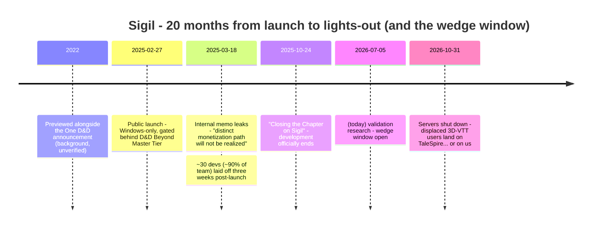
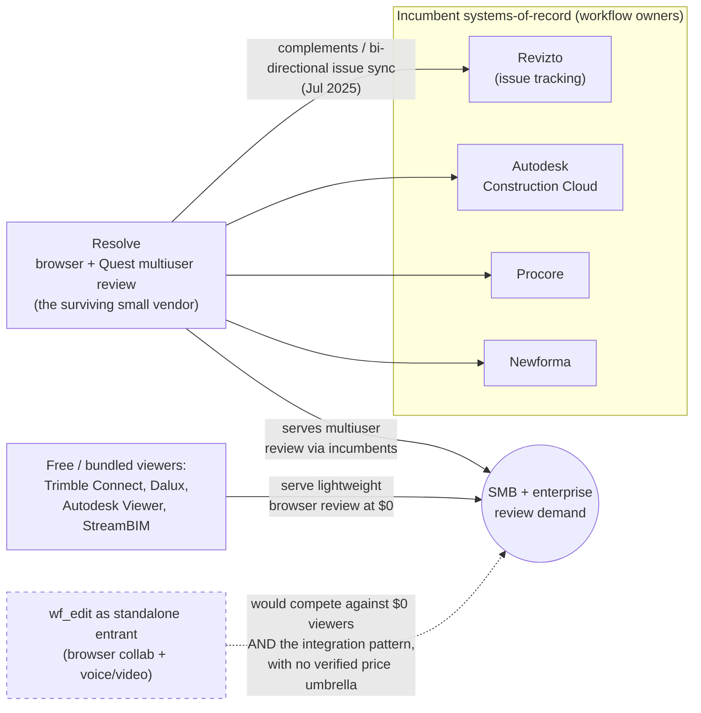

# Investigation: wf_edit market validation — wedge pick and AEC go/no-go

**Date:** 2026-07-05
**Status:** Deep-research output (verified). Companion to [2026-07-05-wf-edit-monetization.md](2026-07-05-wf-edit-monetization.md), whose Fermi estimates this partially corrects.
**Method:** 5 parallel search angles → 24 sources fetched → 120 falsifiable claims extracted → top 25 adversarially verified (3 independent refute-votes each; 2/3 refutes kills a claim) → 22 confirmed, 3 refuted, 0 left unverified. 106 agents total. All vendor prices below were re-checked against live pages on 2026-07-05 unless noted.

**Terminology used throughout:** VTT — *virtual tabletop*, the software category groups use to play tabletop role-playing games (TTRPGs) like D&D online: shared maps/scenes, tokens, dice, usually alongside voice chat. GM — *game master*, the player who runs the game (and, per the findings below, the one who pays). AEC — *architecture, engineering & construction*. BIM — *building information modeling*, the structured-3D-model workflow AEC runs on. [glTF](https://www.khronos.org/gltf/) — *GL Transmission Format*, the Khronos-standard 3D interchange format. [IFC](https://www.buildingsmart.org/standards/bsi-standards/industry-foundation-classes/) — *Industry Foundation Classes*, buildingSMART's open building-data standard. TAM/SAM — *total / serviceable addressable market*, the standard market-sizing pair. [COPPA](https://www.ftc.gov/legal-library/browse/rules/childrens-online-privacy-protection-rule-coppa) — the *Children's Online Privacy Protection Act* (US law on collecting data from children under 13). [FERPA](https://studentprivacy.ed.gov/ferpa) — the *Family Educational Rights and Privacy Act* (US student-records privacy law). WotC — Wizards of the Coast, D&D's publisher (a Hasbro subsidiary).

---

## The two judgments

**Decision A — near-term wedge (3–12 months): pick VTT over education.** Paid-VTT demand is proven and still growing; the buyer is a consumer GM/host making a $25–50 credit-card purchase with zero procurement; and WotC's Sigil shutdown leaves displaced 3D-VTT users with almost nowhere to go. Education lost on price compression ($0–7/seat incumbent anchors) and on evidence: *no* education market-size, compliance-cost, or post-mortem claims survived verification at all. Confidence: medium (synthesis judgment over high-confidence findings).

**Decision B — AEC glTF/IFC bet (12+ months): no-go, for now.** The browser multiuser-review slot is already served via incumbent-plus-startup integration ([Revizto](https://revizto.com/) + [Resolve](https://www.resolvebim.com/), July 2025); the one visible small-vendor survival mode is *complementing* the incumbent system-of-record, not competing standalone; and every AEC economics sub-question (per-seat pricing, procurement cycles, voice/video differentiation, post-mortems) returned **no verifiable public data** — an opacity consistent with quote-driven enterprise sales that a 1–3 person team is poorly positioned to survive. This is an absence-of-evidence no-go, not a disproof: revisit only via primary design-partner discovery, not more desk research.

**Critical caveat on both:** coverage was asymmetric — 9 surviving claims cover VTT, 5 education, 2 AEC. Education was out-argued on pricing mechanics and evidence thinness, not sized and rejected.

---

## Decision A evidence

### VTT market shape (confidence: high)

- **The audience is large, but the growth spike was a one-time COVID step change, now decelerating.** [Roll20](https://roll20.net/) (largest web VTT): 1M registered users (Jul 2015) → 2M (Jan 2017) → 8M (Q4 2020) → 10M+ (Feb 2022). WotC reported virtual D&D play +86% in 2020. [Foundry VTT](https://foundryvtt.com/)'s paid-license growth has decelerated 52% → 32% → 22% YoY (2023–2025), and it stopped disclosing in May 2026. **All Roll20 figures are cumulative free registered accounts — not active, not paying.** ([Roll20 blog/Orr report](https://wiki.roll20.net/Orr_Industry_Report); LA Times 2021-01-13; [foundryvtt.com year-in-review posts](https://foundryvtt.com/article/year-in-review-2024/). 3-0 votes.)
- **Monetization is anchored low and host-pays everywhere.** Foundry VTT: **$50 one-time perpetual license** ([purchase page](https://foundryvtt.com/purchase/), unchanged 2020 → live check 2026-07-05); only the host pays, players free. Roll20: freemium, Plus $59.99/yr, Pro $109.99/yr (first increase ever was [Jul 2021](https://bloghub.roll20.net/posts/roll20-pricing-increase-announcement/); Elite $150/yr tier added Oct 2025). TaleSpire (3D): **$24.99 buy-once**. Revenue concentrates on ~one payer per gaming group. (Vendor pages + Steam API, all fetched 2026-07-05. 3-0.)
- **Foundry is the demonstrated indie business model:** cheap one-time host license + premium-content ecosystem. Its [premium catalog](https://foundryvtt.com/packages/premium) grew 467 → 862 packages (+85% YoY) with ~30 new publisher partners; an official marketplace launched Feb 2025 (500+ modules, 60+ publishers), reaching ~1,760+ packages by Jul 2026. **Foundry discloses no absolute license counts, no revenue, no take-rate.** (foundryvtt.com. 3-0.)
- **The only public 3D-VTT revenue datapoint is thin.** [TaleSpire](https://talespire.com/) ([Steam](https://store.steampowered.com/app/720620/TaleSpire/)) — the surviving indie 3D-VTT benchmark, by [Bouncyrock Entertainment](https://bouncyrock.com/) — launched into Steam Early Access on April 14, 2021 at $24.99 buy-once (per [Bouncyrock's own launch post](https://bouncyrock.com/news/articles/early-access-release-date-and-pricing)), added Mac in Aug 2023, and is *still* in Early Access as of July 2026. Its sole public revenue figure is an *estimated* ~$79k gross in its first ~4 days (algorithmic review-multiplier estimate, single Wayback snapshot of games-stats.com, Apr 2021). Lifetime revenue and active users: unpublished. Confidence: medium. This is the weakest plank under the wedge — 3D-specific willingness-to-pay is evidenced only by TaleSpire's opaque niche.

### The Sigil post-mortem (confidence: high on facts, medium on attribution)

**What Sigil was** *(background context; the bullets below it are the verified claim set)*: Sigil was Wizards of the Coast's official 3D virtual tabletop for Dungeons & Dragons — a drag-and-drop 3D encounter builder and play space built on Unreal Engine 5, integrated with [D&D Beyond](https://www.dndbeyond.com/) (WotC's digital D&D platform), and first previewed alongside the "One D&D" digital push announced in 2022. It launched as a Windows-only beta whose full features were gated behind D&D Beyond's paid Master Tier subscription rather than sold as its own product. It is the best-resourced 3D VTT ever attempted — D&D brand, AAA engine, captive audience — which is exactly why its failure is the definitive post-mortem for this category. Key coverage: WotC's official shutdown notice ["Closing the Chapter on Sigil"](https://www.dndbeyond.com/posts/2086) (Oct 24, 2025); [PC Gamer on the layoffs and leaked memo](https://www.pcgamer.com/games/hasbro-pushed-sigil-out-of-the-nest-d-and-ds-latest-layoffs-happened-because-the-distinct-monetization-path-for-its-virtual-tabletop-sigil-never-materialized/); [Gizmodo's cancellation report](https://gizmodo.com/dnd-sigil-vtt-canceled-hasbro-wizards-of-the-coast-2000578128); the [EN World community thread](https://www.enworld.org/threads/project-sigil-3d-virtual-tabletop-finally-laid-to-rest.715907/); [Rascal News](https://www.rascal.news/), which broke the internal memo.

The verified facts:

- Launched Feb 27, 2025 (Windows-only, gated behind the paid D&D Beyond Master Tier). **~30 developers (~90% of the team) laid off three weeks after launch** (Mar 18–19, 2025). Internal memo (leaked to Rascal News, confirmed legitimate by design lead Andy Collins): *"our aspirations for Sigil as a larger, standalone game with a distinct monetization path will not be realized."* Development officially ended Oct 24, 2025; **servers shut down end of October 2026**. Total lifespan ~20 months. (PC Gamer, Gizmodo, EN World, dndbeyond.com post 2086. 3-0 across four merged claims.)
- Failure mode per an ex-employee (single anonymous source, mechanism corroborated by the confirmed memo): Hasbro *"treated Sigil like a video game instead of a VTT,"* expecting passive Baldur's-Gate-style revenue. Sigil never had a standalone revenue line at all — access was a Master Tier perk, and affected users were compensated with 6-month Master Tier credits.
- **Verifiers explicitly scoped the lesson: Sigil proves WotC failed to find a standalone 3D-VTT model amid organizational dysfunction — not that no model can exist.** It constrains the *model*, not the *wedge*: monetize like a VTT (host-pays license + content marketplace, the Foundry pattern — the only one publicly demonstrated to work), not like a game.
- **Timing implication:** Sigil's end-of-October-2026 server shutdown strands its 3D-VTT users with TaleSpire ($24.99, niche, still Early Access after 5 years) as the main remaining option. That displaced-user window dates the opportunity: roughly the next four months.

(Also surfaced during search: [One More Multiverse, another VTT platform, announced closure](https://techraptor.net/tabletop/news/one-more-multiverse-vtt-platform-announces-closure) — reinforcing that undifferentiated VTTs die; not among the 25 verified claims.)

### Education evidence (confidence: high on prices; the rest is absence)

- **Incumbent price anchors are brutal** (all live vendor pages, 2026-07-05): [Minecraft Education](https://edusupport.minecraft.net/hc/en-us/articles/360047119092-FAQ-Availability-Pricing-and-Licensing) **$5.04/user/yr** for eligible institutions ($36/user/yr otherwise since Sep 2025) — and **included free with Microsoft 365 Education A3/A5** (Microsoft's mid/top school license bundles), making many districts' marginal cost $0. [Construct 3 education](https://www.construct.net/en/make-games/buy-construct-3/educational-plans): $32.99/seat/yr (1–10 seats) tiering to $9.90/seat/yr (51+). CoSpaces Edu (now [Delightex](https://www.delightex.com/pricing); cospaces.io/pricing 301-redirects there): $50/yr first seat + **$7/yr per additional seat** — ≈$260/yr for a 1-teacher-30-student classroom. (3-0 each.)
- **Revenue scales per student, and the procurement boundary sits near $750:** Delightex licensing is strictly per-user (every student needs a seat); purchase orders are accepted in the direct channel only at 100+ seats (≈$743/yr at list) — below that it's credit-card self-serve, though edtech resellers (e.g. [Eduporium](https://www.eduporium.com/)) take POs at any size. (Vendor price-list PDF, policy stable 2022–2026. 3-0.)
- **What produced zero surviving evidence:** education TAM/SAM, COPPA/FERPA compliance cost for a small vendor, and any edtech post-mortem. The education thesis is under-evidenced, not disproven. (A [Rest of World piece on the K-12 edtech funding collapse](https://restofworld.org/2026/edtech-funding-collapse-k12-startups-ai-workforce/) was fetched but none of its claims survived to the verified set.)

---

## Decision B evidence (AEC)

- **The slot is being served, and the survival pattern is integration:** on Jul 8, 2025, [Revizto](https://revizto.com/) (Lausanne-based AEC issue-tracking incumbent) + startup [Resolve](https://www.resolvebim.com/) launched an [integration](https://resolvebim.com/integrations/revizto-vr) bringing Revizto issues into Resolve's multiuser BIM review platform on web browsers and untethered Meta Quest headsets. Resolve's stated posture is to *"complement"* and *"augment"* Revizto — issue tracking stays in Revizto as system-of-record; Resolve adds no-expertise-required review, and likewise integrates [Autodesk Construction Cloud](https://construction.autodesk.com/), [Procore](https://www.procore.com/), and [Newforma](https://www.newforma.com/). Standalone browser review already exists from incumbents ([Trimble Connect](https://connect.trimble.com/), [Dalux](https://www.dalux.com/), [Autodesk Viewer](https://viewer.autodesk.com/), [StreamBIM](https://www.streambim.com/)). (Confidence: medium — one claim passed 2-1, sources include co-marketing PR triangulated by [AEC Magazine](https://aecmag.com/vr-mr/resolve-brings-revizto-issues-into-vr)/Architosh; the original Revizto announcement URL has since been removed and survives via Wayback.)
- **Every AEC economics question came back empty.** No verified per-seat price exists for *any* of Revizto, Resolve, ACC/BIM 360, Trimble Connect, Dalux, StreamBIM — the sole pricing claim attempted (Resolve's quote-based tiers) was **refuted** in verification. No procurement-cycle data, no buyer-behavior data, no post-mortems survived ([Flux's $29M burn-down](https://bricks-bytes.com/newsletter/how-flux-burned-through-29m-lessons-for-aec-innovators/) and [contech-fragmentation](https://www.constructiondive.com/news/despite-50b-of-investment-contech-is-being-held-back-by-its-fragmented-cu/652240/) pieces were fetched but didn't survive claim verification). Public-price opacity at this scale is itself a signal: quote-driven enterprise sales motions.
- **No evidence that built-in voice/video wins AEC deals** — the differentiator hypothesis found nothing either way.

The market structure the research found — the standalone slot a new entrant would want is already occupied from two directions:

---

## Refuted claims — do not cite these

1. ~~Resolve publishes two quote-based tiers (Team/Project licenses)~~ — refuted 1-2. ([source attempted](https://blog.resolvebim.com/new-pricing-options-to-make-resolve-more-accessible/))
2. ~~Roll20's Orr Industry Report ran 2014–2021 and has been on hold since Dec 2022~~ — refuted 0-2 (fetch of the [live series](https://wiki.roll20.net/Orr_Industry_Report) also failed; treat Orr-report status as unknown).
3. ~~Sigil survives as a D&D Beyond feature with a small team~~ — refuted 0-3. It was fully sunset ([Oct 24, 2025 announcement](https://www.dndbeyond.com/posts/2086); servers off end of Oct 2026).

## Open questions (ranked by how much they'd change the plan)

1. **Does built-in voice/video/chat actually win deals anywhere, or do Discord (VTT tables) and Teams/Zoom (AEC reviews) neutralize wf_edit's core differentiator?** No surviving evidence addressed this at all. It is the first hypothesis to test with real users — it strikes at the product's central premise.
2. **Is there durable paid demand for 3D specifically within VTTs?** TaleSpire's lifetime economics are unpublished. [SteamDB owner-estimate triangulation](https://steamdb.info/app/720620/) or direct outreach to the Bouncyrock/TaleSpire community before committing the wedge.
3. **Education TAM/SAM and small-vendor COPPA/FERPA cost** — unanswered; education remains a plausible *secondary* channel (camps/after-school via sub-$750 credit-card self-serve), not the wedge.
4. **Real AEC seat prices and SMB (small/mid-size business) sales-cycle lengths** — only primary discovery with design-partner firms can answer whether a self-serve SMB wedge exists beneath the enterprise sales layer.

## Corrections to the monetization doc's Fermi estimates

| Monetization-doc assumption | What verification found |
|---|---|
| B3.1 priced the GM offer at $8–15/**mo** subscription | Market anchors are $50 **one-time** (Foundry) or $60–110/yr (Roll20). A $96–180/yr subscription overshoots the segment's demonstrated willingness to pay; the indie-proven model is buy-once + content marketplace |
| B3 assumed marketplace take-rates were knowable (est. 30%) | Foundry's take-rate is undisclosed; no public benchmark survived |
| B2.1 assumed $300–800/classroom/yr | Delightex charges ≈$260/yr per 31-seat classroom; Minecraft Education is $5.04/seat and often effectively $0 (A3/A5 bundling). The estimate sits 1.5–3× above incumbent anchors |
| B2 "COPPA/FERPA is real but bounded" | Cost is unverifiable from public sources — treat as unknown, not bounded |
| A2 ceiling $10–50M ARR, entry 9–18 months | Unfalsifiable from public data (zero verified price points in the entire category); slot already served by Revizto+Resolve integration; downgraded to no-go pending design-partner discovery |
| §4 sequencing: "validate A2 vs A3, commit to one" | Both now validated **no-go**: A2 AEC (this doc) and A3 film previz ([2026-07-07](2026-07-07-a3-previz-validation.md)) — same failure mode, a collaborative-3D incumbent already fills the slot |
| B3 risk note flagged only the Foundry-VTT naming collision | Add: Sigil's Oct 2026 shutdown creates a ~4-month displaced-user window — a timing argument the original doc missed |

## Sources (verified-claim contributors)

Primary: [foundryvtt.com](https://foundryvtt.com/) (year-in-review 2023–2026, [purchase page](https://foundryvtt.com/purchase/), [premium directory](https://foundryvtt.com/packages/premium)), Steam store API appid 720620, [bouncyrock.com](https://bouncyrock.com/news/articles/early-access-release-date-and-pricing), [edusupport.minecraft.net](https://edusupport.minecraft.net/hc/en-us/articles/360047119092-FAQ-Availability-Pricing-and-Licensing) (updated 2026-06-29), [construct.net educational plans](https://www.construct.net/en/make-games/buy-construct-3/educational-plans), [cospaces.io→delightex.com pricing](https://www.delightex.com/pricing) + price-list PDF, [dndbeyond.com post 2086](https://www.dndbeyond.com/posts/2086), [resolvebim.com](https://resolvebim.com/integrations/revizto-vr), revizto.com (Wayback 2025-08-15).
Secondary: [Roll20 wiki](https://wiki.roll20.net/Orr_Industry_Report)/blog + [Wikipedia](https://en.wikipedia.org/wiki/Roll20), LA Times (2021-01-13), [Rascal News](https://www.rascal.news/) (2025-03-19, leaked memo), [PC Gamer](https://www.pcgamer.com/games/hasbro-pushed-sigil-out-of-the-nest-d-and-ds-latest-layoffs-happened-because-the-distinct-monetization-path-for-its-virtual-tabletop-sigil-never-materialized/), [Gizmodo](https://gizmodo.com/dnd-sigil-vtt-canceled-hasbro-wizards-of-the-coast-2000578128), [EN World](https://www.enworld.org/threads/project-sigil-3d-virtual-tabletop-finally-laid-to-rest.715907/), [GamesRadar](https://www.gamesradar.com/tabletop-gaming/project-sigil-is-officially-dead-and-i-cant-believe-d-and-d-fumbled-its-best-idea-in-years/), [TechRaptor](https://techraptor.net/tabletop/news/one-more-multiverse-vtt-platform-announces-closure), Engadget, [AEC Magazine](https://aecmag.com/vr-mr/resolve-brings-revizto-issues-into-vr) (2025-07-08), Architosh, Capterra, SelectHub, [Construction Dive](https://www.constructiondive.com/news/despite-50b-of-investment-contech-is-being-held-back-by-its-fragmented-cu/652240/), [Bricks & Bytes](https://bricks-bytes.com/newsletter/how-flux-burned-through-29m-lessons-for-aec-innovators/), ConTech Roundup.
Discarded as unreliable during fetch: businessresearchinsights.com TTRPG market report.

One search-agent failure (Roll20 Orr-report page fetch, connection closed) — its claims were either re-sourced or dropped; nothing in the verified set depends on it.
