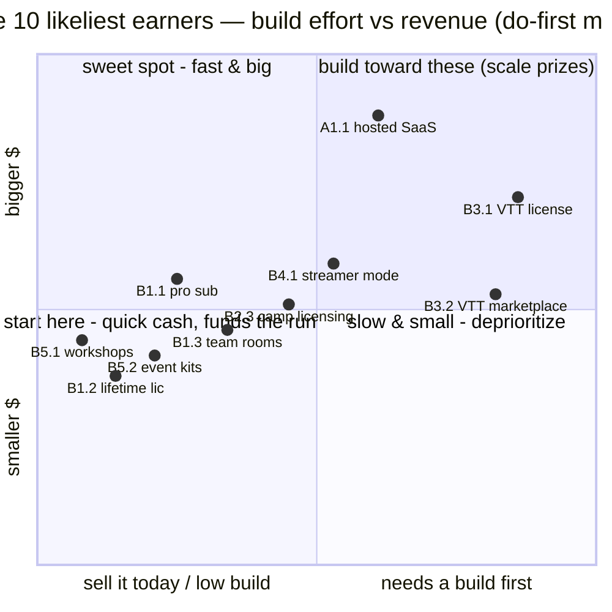
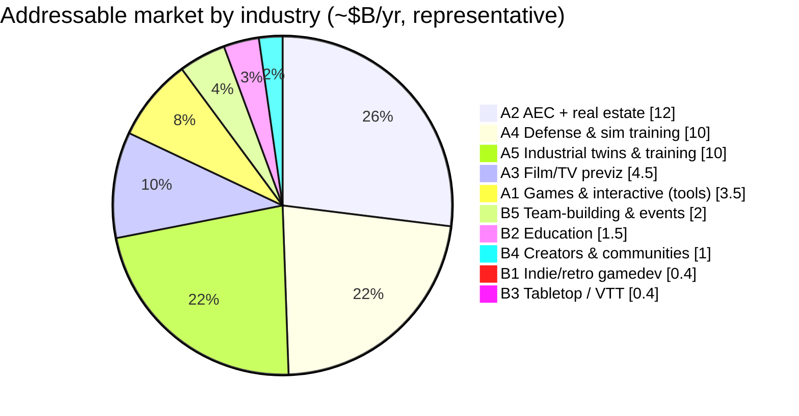
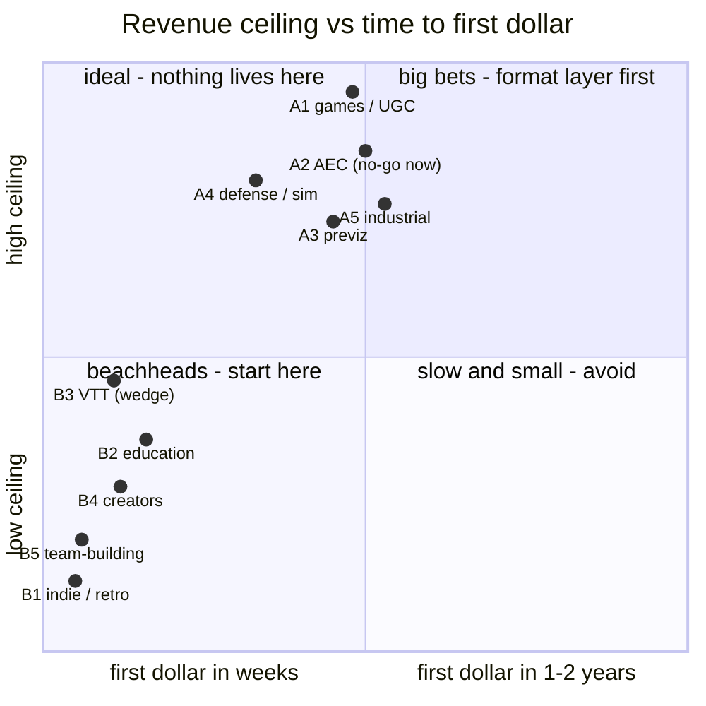
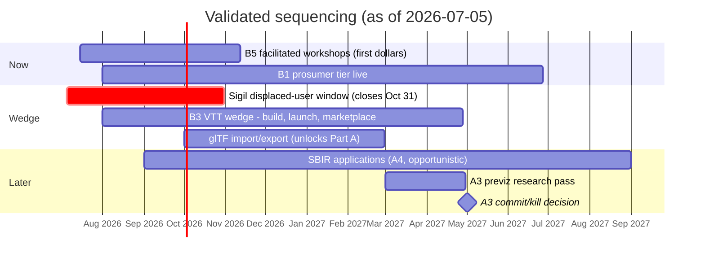

# Investigation: monetizing wf_edit — the real-time collaborative 3D level editor

**Date:** 2026-07-05
**Status:** Brainstorm / market scan. All figures are Fermi estimates, not researched numbers — see §2 before quoting anything from this document.
**Update 2026-07-05:** a verified deep-research pass ([2026-07-05-wf-edit-market-validation.md](2026-07-05-wf-edit-market-validation.md)) settled two decisions: **B3 (VTT — *virtual tabletop*, the software category groups use to play tabletop role-playing games like D&D online) is confirmed as the near-term wedge** — but with a buy-once host-pays license + content marketplace, not the subscription priced in idea B3.1 — and **A2 (AEC — *architecture, engineering & construction*) is downgraded to no-go-for-now**. Sections A2, B2, B3, §4, and §5 carry inline corrections; the companion doc has the evidence and citations.
**Product:** `engine/wf_edit` on `origin/2026-new-level` (not present on this local branch — see the reconcile item in root `TODO.md`).
**See also:** [2026-07-05-worldfoundry-default-sim-environment.md](2026-07-05-worldfoundry-default-sim-environment.md) — the eleventh analysis: the platform ambition beyond per-industry monetization.

---

## TL;DR — the 10 likeliest revenue earners

The 100 ideas below, filtered to the ten with the best odds of *actually* producing meaningful revenue and ranked by **likelihood, not size**. "Likelihood" is a rough, subjective probability the idea reaches at least its low-end estimate if pursued as a focused effort (everything here is ±10× Fermi — see §2); "$/yr" is annual revenue at maturity. The pattern is the point: the near-certain earners are the low-friction **B-track** — services, prosumer, and the validated VTT wedge — not the big-ceiling enterprise verticals (both A-verticals tested, AEC and previz, came back no-go). The next table places each *category's* biggest-ceiling idea in the full 100-idea ranking — including where "Retro Roblox" actually lands.

| # | Idea | Likelihood | $/yr (maturity) | Why it's a likely earner |
|---|---|:--:|---|---|
| 1 | **B5.1 — Facilitated build-together workshops** | ~85% | $50–300k | Sellable in 2–6 weeks on the product *as it exists today* — zero new engineering; the fastest first dollar in the doc |
| 2 | **B1.1 — Indie Pro subscription** | ~80% | $50–500k | The product already *is* the indie tool; proven willingness to pay; live in 1–2 months |
| 3 | **B1.2 — Lifetime license (itch.io)** | ~80% | $20–200k | Retro crowd prefers buy-once; ~1 month; near-zero friction |
| 4 | **B3.1 — VTT GM license (buy-once)** | ~70% | $100k–1M | The **validated wedge** — proven paid-VTT demand + the Sigil-shutdown window — but needs the VTT build + relay auth first (see the [VTT plan](../plans/2026-07-07-vtt-wedge.md)) |
| 5 | **B5.2 — Self-serve event kits** | ~70% | $30–200k | Productized version of #1; self-serve, 1–3 months |
| 6 | **B1.3 — Team rooms (small studios)** | ~70% | $30–300k | Natural upsell from #2; 2–3 months |
| 7 | **B4.1 — Streamer mode** | ~60% | $50–500k | Collaborative building *is* content; creators buy content tools; attention-dependent |
| 8 | **B3.2 — VTT map & asset marketplace** | ~60% | $50–500k | The proven Foundry revenue engine — but only once the VTT base (#4) exists |
| 9 | **A1.1 — Hosted collab-editor SaaS** | ~55% | $200k–2M | Biggest $ of the likely set; works today, but more competitive and slower to first dollar |
| 10 | **B2.3 — Camp/after-school licensing** | ~55% | $100–500k | Self-serve education under the ~$750 PO threshold; seasonal but sticky |

*Ranked by likelihood, not ceiling — for the ceiling-vs-speed view see the §3 quadrant, and for how each industry's own 10 ideas split its opportunity see the table at the end of each industry section. Selection reflects the [validation pass](2026-07-05-wf-edit-market-validation.md): VTT confirmed as the wedge, education demoted to self-serve, AEC + previz both no-go.*

### Each category's biggest swing, ranked among all 100

Taking the single highest-**ceiling** idea from each of the ten categories and placing it in the full 100-idea likelihood ranking. The split *is* the story — every B-track flagship lands in the top quarter, every A-track flagship in the bottom third: **the biggest ceilings are the longest shots.**

| Rank /100 | Category | Its biggest-ceiling idea | Likelihood | $ ceiling | |
|:--:|---|---|:--:|--:|---|
| **#1** | B5 team-building | Facilitated workshops | ~85% | $300k | also the overall #1 earner |
| **#2** | B1 indie/retro | Pro subscription | ~80% | $500k | the product already *is* their tool |
| **#4** | B3 tabletop / VTT | GM license (buy-once) | ~70% | $1M | the validated wedge |
| **#11** | B4 creators | Streamer mode | ~60% | $500k | collaborative building *is* content |
| **#24** | B2 education | Classroom site license | ~54% | $1M | self-serve, but district POs add friction |
| **#62** | A5 industrial twins | Factory/warehouse planning | ~38% | $10M | enterprise sales, slow |
| **#71** | A4 defense / sim | Mission-rehearsal sandbox | ~30% | $5M | SBIR-adjacent; long cycle |
| **#78** | A1 games | "Retro Roblox" UGC platform | ~28% | **$100M+** | highest ceiling in the doc, lowest odds — the lottery ticket |
| **#83** | A2 AEC | Design-review rooms | ~24% | $10M | validated **no-go** (incumbent-filled) |
| **#85** | A3 film previz | Virtual location scouting | ~24% | $5M | validated **no-go** (incumbent-filled) |

*Ranks use the same subjective likelihood estimates as the table above (±10× Fermi) — read them as tiers, not exact positions. "Biggest-ceiling idea" ≠ "best idea": most categories have a likelier, smaller idea (A1's best *odds* are its hosted SaaS at #23, not the UGC platform at #78).*

**The same ten as a do-first map.** Likelihood barely varies across a list already filtered *for* likelihood, so the axes that actually separate these ten are **build effort** (sell it today vs. build first) and **revenue ceiling**. Read it as a sequence: start bottom-left (quick, reliable cash that funds the runway) and build toward top-right (the scale prizes — the VTT wedge and the hosted SaaS). This is the shortlist-idea counterpart to the §3 *industry* quadrant.

The top-left "fast **and** big" sweet spot is nearly empty — the honest signal that the biggest ceilings (A1.1, B3.1) all require a build; nothing is both instant and large. B3.2 (marketplace) sits build-heavy because it only pays off once the VTT base (B3.1) exists.

## 1. What we're actually selling

Capability inventory, assembled from the branch history and file tree (notably `ac3680d2` "one-click .lev export shipped — web editor v1 feature-complete"). Caveat: assessed from commit messages and file listings, not hands-on testing.

- **Native level editor** — [ImGui](https://github.com/ocornut/imgui)-based: gizmo manipulation, property panel over the OAD attribute system (OAD — WorldFoundry's object-attribute-description schema), level document + save, live engine bridge (`engine/wf_edit/`).
- **Runs in the browser** — [WebAssembly](https://webassembly.org/) (wasm) via [Emscripten](https://emscripten.org/), WebGL/GLES3, no install. Boots with a preloaded level.
- **Real-time multiplayer editing** — CRDT document sync (CRDT — *conflict-free replicated data type*, the data structure that lets multiple people edit one document simultaneously without a locking server; see [crdt.tech](https://crdt.tech/)). Ours is [Yrs/Yjs](https://github.com/y-crdt/y-crdt) via yffi, cross-compiled to wasm, with multi-peer join-and-receive seeding.
- **Presence + text chat** — collaborators panel, per-peer presence.
- **Voice + video** — [WebRTC](https://webrtc.org/); native build has RTCP PLI fast keyframe recovery and per-peer decoders; receive-only mode (`WF_COLLAB_NO_CAM`).
- **One-click `.lev` export** into the engine pipeline; the engine itself runs on Linux, Android, Chromecast/Google TV, iOS (in progress), with Steam packaging planned.
- **Engine traits with commercial relevance** — fixed-point math and a small footprint (runs on very low-spec, legacy, and retro hardware), scriptable actors (Lua/Fennel/zForth/wasm, experimental neural-forth), Blender round-trip pipeline.

The honest one-liner: **"Figma-style multiplayer editing for 3D scenes — with voice, video, and chat built in — running in the browser."**

Two structural facts drive everything below:

1. **The reusable asset is the collaboration substrate** (CRDT doc + WebRTC A/V + wasm 3D viewport), not the WorldFoundry format. Today the editor edits `.lev`/OAD only. Every non-game industry in Part A requires a **general scene-format layer** — at minimum [glTF](https://www.khronos.org/gltf/) (*GL Transmission Format*, the Khronos-standard interchange format for 3D scenes, often called "the JPEG of 3D") import/export, plus [USD](https://openusd.org/) (*Universal Scene Description*, Pixar's film-pipeline scene format) for film work — plus auth, hosted persistence, TURN/SFU relay infrastructure (TURN — the relay servers WebRTC traffic falls back to when peers can't connect directly; SFU — a selective forwarding unit that routes multi-party video), and billing before the first dollar arrives. The Part B industries mostly do not.
2. **A/V has real marginal cost.** TURN relay bandwidth runs ~$0.05–0.40/GB depending on provider; sustained multi-party video caps gross margins at ~50–70%, below the 75–90% of classic SaaS (*software as a service*). Pricing needs to meter or cap A/V minutes.

## 2. How to read the estimates

- Assumes a 1–3 person team building on the existing stack, bootstrapped or lightly funded.
- **"Maturity"** = plausible annual revenue 3–5 years in, *if that idea is pursued as the main bet and executed well*.
- **"First revenue"** = elapsed time from deciding to pursue the idea to the first paying customer.
- **Confidence is low.** Any individual number is ±10×. The *rankings* (which industries are bigger, which are faster) are far more defensible than the absolute figures.
- Market-size figures are ballpark, from general knowledge as of early 2026, and unverified; no formal TAM/SAM analysis is attempted (TAM — *total addressable market*; SAM — *serviceable addressable market*, the slice you could realistically reach). The validation doc flags where even researched TAM/SAM numbers proved unverifiable. Validate the top 2–3 picks with a real research pass (customer interviews + competitive scan) before committing a roadmap to any of them.
- **Per-industry breakdown tables.** Each industry section ends with a table sizing its 10 ideas by the geometric mean of the revenue range in each bullet — the honest centre of a ±10× multiplicative range. Read the ranking and rough shares, not the digits; true per-idea *market* sizes aren't in public data.
- **Revenue ≠ profit.** Rough gross margins: pure software SaaS 75–90%; A/V-heavy usage 50–70% after relay bandwidth; facilitated services/workshops 30–60%. Profit at this team size ≈ gross margin × revenue − (mostly) salaries.

---

## Part A — Five industries with the largest absolute-dollar potential

Ranked by realistic ceiling *for this product*, not by raw industry size.

### A1. Games & interactive entertainment

**Why:** Native fit — zero repositioning. Consumer games spend is ~$185B/yr; tools/middleware is a $2–5B slice; and UGC (*user-generated content*) platforms are the existence proof that *editors* can out-earn games ([Roblox](https://ir.roblox.com/) books ~$4B/yr selling what is, at core, a collaborative editor plus distribution). wf_edit is already a game level editor with multiplayer built in.
**Entry cost:** Lowest of any industry here — the product works today. Platform-shaped ideas additionally need hosting, moderation, and payments.
**Ceiling:** A seat-license tools business plateaus around $1–10M ARR (*annual recurring revenue*); a UGC platform that hits is $100M+, but that outcome is hits-driven (lottery-shaped, not grind-shaped).

1. **Hosted collaborative level-editor SaaS for indie teams.** Per-seat subscription ($10–25/seat/mo) for private rooms, cloud saves, version history. Estimate: $200k–2M ARR at maturity; first revenue in 2–4 months.
2. **"Retro Roblox" UGC platform.** Players build, publish, and play retro-styled worlds in the browser; monetize via premium currency and a 70/30 creator marketplace. Estimate: $1M–100M+ (power-law outcome); 12–24 months to first marketplace revenue.
3. **White-label collab SDK.** License the CRDT + WebRTC + wasm-viewport substrate to other engine and tool vendors who want "multiplayer editing" without building it. Estimate: $50k–500k/yr per licensee, 2–5 licensees realistic → $100k–2M ARR; 6–12 months.
4. **Live-ops levels-as-a-service for F2P (*free-to-play*) studios.** Studios ship weekly content; sell the collaborative pipeline (design → review-on-call → export) as an enterprise contract. Estimate: $100k–1M/yr per studio, a handful of logos → $500k–5M ARR; 9–18 months.
5. **Paid game-jam hosting.** Branded jams (à la [itch.io jams](https://itch.io/jams)) with built-in team formation, live collab, and sponsor placement. Estimate: $5k–50k per event, 10–30 events/yr → $100k–1M/yr; 3–6 months.
6. **Co-development review rooms.** Studios working with external art/level outsourcers review work-in-progress together on video instead of trading builds. Estimate: $99–499/mo per studio-vendor pair → $300k–3M ARR; 6–12 months.
7. **Live playtest sessions.** Developers watch players navigate a level, talk to them, and edit the level live between runs; usage-priced. Estimate: $100k–1M ARR; 4–8 months.
8. **Level & asset marketplace.** 15–30% take rate on community-made levels, tilesets, and prefabs, attached to the SaaS user base. Estimate: $50k–2M/yr scaling with the base; 6–12 months after the SaaS exists.
9. **Commercial retro/homebrew toolchain licensing.** License the editor + engine export to publishers doing PSX-era re-releases and licensed minigames on set-top/TV hardware (the Chromecast/Google TV port is the wedge; fixed-point is the moat). Estimate: $25k–250k per deal, a few deals/yr; 6–12 months.
10. **AI level-design copilot.** In-editor agent that drafts layouts, places actors, and wires scripting (the neural-forth and scripting hooks make this unusually plausible here); sold as a +$10–30/mo add-on. Estimate: $100k–1M ARR as an attach to the SaaS; 6–12 months.

*Opportunity split — each idea sized by the geometric mean of its revenue range (~$k/yr); ±10× Fermi, read the ranking not the digits.*

| Idea | ~$k/yr | share | |
|---|--:|--:|---|
| "Retro Roblox" UGC platform | 10,000 | 66% | ████████████████████ |
| Live-ops levels for F2P | 1,581 | 10% | ███ |
| Co-development review rooms | 949 | 6% | ██ |
| Hosted collab-editor SaaS | 632 | 4% | █ |
| White-label collab SDK | 447 | 3% | █ |
| Paid game-jam hosting | 316 | 2% | █ |
| Live playtest sessions | 316 | 2% | █ |
| Level & asset marketplace | 316 | 2% | █ |
| AI level-design copilot | 316 | 2% | █ |
| Retro toolchain licensing | 237 | 2% | █ |

### A2. Architecture, engineering & construction (AEC) + real estate

**Why:** Construction is a ~$10–13T/yr global industry with famously poor multi-party coordination; AEC software exceeds $10B/yr, and design-review/coordination tools ([Revizto](https://revizto.com/), [Autodesk Construction Cloud](https://construction.autodesk.com/), [Resolve](https://www.resolvebim.com/)) already command $100s–1000s per seat per year. The daily workflow this industry runs on — several stakeholders on a call staring at a 3D model, one person driving — is exactly what wf_edit collapses: everyone in the model, voice/video native, decisions captured in place. A lightweight browser viewport is a *feature* here (site laptops, client iPads).
**Entry cost:** Medium-high. Needs [IFC](https://www.buildingsmart.org/standards/bsi-standards/industry-foundation-classes/) (*Industry Foundation Classes* — the open data standard for building models, maintained by buildingSMART) and glTF import, measurement + markup tools, SSO (*single sign-on*) and SOC 2 (the security-audit attestation enterprise buyers require) for firm-wide deals. The game-specific parts matter less than the viewport + collab core.
**Ceiling:** $10–50M ARR — comparable focused review tools have reached this.
**Validation 2026-07-05: no-go for now.** Not one public per-seat price could be verified anywhere in this category (the single pricing claim attempted was refuted) — opacity consistent with quote-driven enterprise sales a 1–3 person team can't survive. The browser multiuser-review slot is already served via the Revizto + Resolve integration (Jul 2025), and the one visible small-vendor survival mode is *complementing* the incumbent system-of-record, not competing with it. Absence-of-evidence verdict, not a disproof: revisit only through primary design-partner discovery.

1. **Design-review rooms.** Import the model, walk it together, annotate spatially, export a decision log tied to positions in the model. Estimate: $50–150/seat/mo → $1–10M ARR; first revenue 9–18 months (format work is the gate).
2. **Client-presentation walkthroughs with recorded sign-off.** The approval meeting happens inside the model and produces a video + annotation artifact for the project record. Estimate: $2–20k/yr per firm → $500k–5M ARR; 9–15 months.
3. **Punch-list / site-issue spatial annotation.** Field issues pinned in 3D, walked through remotely with subs on video. Estimate: $20–60/seat/mo → $500k–5M ARR; 12–18 months.
4. **New-build sales configurator.** Buyer + agent on video inside the unit; pick floors, finishes, furniture; export the selection sheet. Estimate: $10–50k per development project or per-seat → $500k–5M ARR; 9–15 months.
5. **Public-consultation portals for urban planning.** Councils publish a walkable proposal; residents leave spatial comments; planners hold live sessions. Estimate: $20–200k per contract, government sales → $500k–3M/yr; 12–24 months.
6. **Interior-design studio (SMB — *small/mid-size business*).** Designer and client co-edit a room live; prosumer pricing. Estimate: $29–99/mo → $200k–2M ARR; 6–12 months (lowest format bar in this industry).
7. **Modular/prefab configurator.** White-labeled per manufacturer: configure a building from their catalog, export a BOM + quote. Estimate: $50k–500k/yr per manufacturer → $500k–3M ARR; 9–18 months.
8. **Facilities digital-twin lite.** Building operators walk the as-built, annotate equipment, video-call the tech standing in front of it. Estimate: $5–50k/yr per portfolio → $500k–5M ARR; 12–24 months.
9. **Insurance & inspection walkthroughs.** Photogrammetry import; adjusters/inspectors produce annotated 3D records instead of photo sets. Estimate: per-claim or per-seat pricing → $500k–5M ARR; 12–24 months.
10. **Site-safety induction scenes.** Contractors walk new workers through the actual site's hazards before day one; sold per contractor/yr. Estimate: $10–100k/yr per contractor → $500k–3M ARR; 9–18 months.

*Opportunity split — each idea sized by the geometric mean of its revenue range (~$k/yr); ±10× Fermi, read the ranking not the digits.*

| Idea | ~$k/yr | share | |
|---|--:|--:|---|
| Design-review rooms | 3,162 | 21% | ████████████████████ |
| Client walkthroughs + sign-off | 1,581 | 10% | ██████████ |
| Punch-list spatial annotation | 1,581 | 10% | ██████████ |
| New-build sales configurator | 1,581 | 10% | ██████████ |
| Facilities digital-twin lite | 1,581 | 10% | ██████████ |
| Insurance & inspection | 1,581 | 10% | ██████████ |
| Public-consultation portals | 1,225 | 8% | ████████ |
| Modular/prefab configurator | 1,225 | 8% | ████████ |
| Site-safety induction scenes | 1,225 | 8% | ████████ |
| Interior-design studio (SMB) | 632 | 4% | ████ |

### A3. Film, TV & media production (previz / virtual production)

**Why:** Media & entertainment is a ~$2.5–3T industry, and virtual-production tooling is a fast-growing $3–6B slice of it. Previsualization ("previz") is inherently multi-party — director, DP, production designer, VFX supervisor, often on different continents — and today it mostly runs as one operator screen-sharing an Unreal session while everyone else talks over them. A browser previz room where *everyone can move things*, with A/V native, upgrades the early-stage workflow, and low-fidelity rendering is acceptable (even preferred) at that stage. Production budgets pay real money for schedule compression.
**Entry cost:** Medium. glTF/USD import, lens/FOV-accurate cameras, USD export for downstream handoff.
**Ceiling:** $5–30M ARR — smaller niche than AEC, but chunky per-production and per-studio deals.
**Validation 2026-07-07: no-go** (see [A3 previz validation](2026-07-07-a3-previz-validation.md)). Same failure mode as AEC: the incumbent already fills the slot — **Unreal Engine is free under $1M studio revenue and ships built-in Multi-User Editing** ("dozens of operators… large-scale virtual film & TV production"), so collaborative 3D editing here is a free incumbent feature, not a differentiator. Previz houses build director-facing tools in-house on Unreal/Maya (closed shop); indie tools charge $0–360 and a solo indie who planned multiplayer previz (Cine Tracer) never shipped it and abandoned the product. Unreal's Multi-User Editing being LAN/VPN-centric *looks* like a remote-browser opening but isn't one for this buyer — studios run VPNs as baseline IT, so it's no barrier; the zero-install/zero-VPN edge only has teeth in the low-friction long tail (consumers/indies), not enterprise previz. Clean no-go.

1. **Virtual location scouting rooms.** Import photogrammetry/LiDAR scans; department heads walk the location together weeks before anyone flies. Estimate: $500–5k/mo per production → $1–5M ARR; 9–15 months.
2. **Previz-as-a-service seats.** Sell seats to previz houses as their delivery/review layer with clients. Estimate: $100–300/seat/mo → $500k–3M ARR; 9–15 months.
3. **Camera-blocking planner.** Lens-accurate shot design in the shared scene; exports shot lists and camera data. Estimate: $50–150/seat/mo → $300k–2M ARR; 9–12 months.
4. **Set-design sign-off with department layers.** Art, grip, lighting each own a layer; the sign-off meeting happens in the model. Estimate: $10–50k per production → $500k–3M ARR; 9–15 months.
5. **Episodic set-continuity twin.** Keep standing sets consistent across a season's episodes and reshoots; per-show license. Estimate: $25–100k per show → $500k–3M ARR; 12–18 months.
6. **Ad-agency 3D storyboard rooms.** Agencies block out a spot in 3D with the client approving on video; fast cycles, many small projects. Estimate: $10–50k/yr per agency → $500k–3M ARR; 6–12 months.
7. **Concert & stage-show design.** Tour set + lighting previz with the artist and production manager remote. Estimate: $5–50k per tour → $300k–2M ARR; 9–12 months.
8. **Theme-park & attraction previz.** Design firms walk clients through attractions pre-build; long projects, high budgets. Estimate: $50–250k per project engagement → $500k–3M/yr; 12–18 months.
9. **Interactive-content scene assembly.** Choose-your-path and interactive-streaming producers assemble branching 3D scenes collaboratively. Estimate: $50k–500k ARR (nascent market); 12–24 months.
10. **Digital backlot marketplace.** License reusable scanned sets/environments with a take rate, attached to the scouting product. Estimate: $100k–1M/yr at maturity; 12–24 months after the scouting product exists.

*Opportunity split — each idea sized by the geometric mean of its revenue range (~$k/yr); ±10× Fermi, read the ranking not the digits.*

| Idea | ~$k/yr | share | |
|---|--:|--:|---|
| Virtual location scouting | 2,236 | 22% | ████████████████████ |
| Previz-as-a-service seats | 1,225 | 12% | ███████████ |
| Set-design sign-off | 1,225 | 12% | ███████████ |
| Episodic set-continuity twin | 1,225 | 12% | ███████████ |
| Ad-agency storyboard rooms | 1,225 | 12% | ███████████ |
| Theme-park previz | 1,225 | 12% | ███████████ |
| Camera-blocking planner | 775 | 7% | ███████ |
| Concert & stage-show design | 775 | 7% | ███████ |
| Digital backlot marketplace | 316 | 3% | ███ |
| Interactive scene assembly | 158 | 2% | █ |

### A4. Defense, public safety & simulation training

**Why:** Global defense spending exceeds $2.5T/yr and is rising; US DoD modeling/simulation/training programs alone run ~$10B+/yr. The chronic, openly acknowledged bottleneck in training sims is **scenario authoring** — instructors can't build content without contractor cycles. A collaborative scenario editor that instructors drive themselves, with comms built in, is a credible pitch — and this stack's quirks are advantages here: small footprint, fixed-point (legacy/secure hardware), and a fully **self-hostable** collab stack (CRDT + WebRTC with no cloud dependency) for closed networks.
**Entry cost:** Highest. ITAR handling (*International Traffic in Arms Regulations*), ATO/accreditation (*authority to operate*), on-prem deployment, eventually DIS/HLA interop (*Distributed Interactive Simulation* / *High Level Architecture* — the military simulation-interoperability standards), and usually a prime/partner relationship. The realistic wedge is [SBIR/STTR](https://www.sbir.gov/) (*Small Business Innovation Research / Small Business Technology Transfer* — US federal R&D grant programs; Phase I ≈ $100–250k, Phase II ≈ $1–2M) — grant money that subsidizes the roadmap.
**Ceiling:** Program-of-record money is $10M+/yr but 3–5+ years out; the SBIR path is $1–3M across years 1–3.

1. **SBIR-funded scenario-authoring tool for training ranges.** The canonical entry: pitch instructor-driven authoring at a specific range/schoolhouse. Estimate: $100–250k Phase I, $1–2M Phase II; first (grant) revenue 6–12 months.
2. **Mission-rehearsal sandbox.** Import terrain, brief the team on-call inside the model, walk the plan. Estimate: $50–250k/yr per unit-level license → $1–5M/yr; 18–36 months.
3. **Emergency-management tabletop exercises.** Counties and states run disaster tabletops in a shared 3D scene; FEMA-adjacent grant funding buys it. Estimate: $10–50k/agency/yr → $500k–3M/yr; 9–18 months.
4. **Law-enforcement scenario builder.** Departments author de-escalation and response scenarios for their own facilities. Estimate: $10–50k/dept/yr → $500k–3M/yr; 12–24 months.
5. **Venue & campus security planning twins.** Stadiums, campuses, and event operators plan coverage and evacuation collaboratively. Estimate: $10–100k/venue/yr → $500k–3M/yr; 12–18 months.
6. **Base & installation facility planning.** Reuses the AEC feature set inside the compliance envelope. Estimate: $100k–1M per contract; 18–36 months.
7. **Disaster-response coordination sandbox for NGOs/UN agencies.** Shared operational picture + comms for response planning; grant/tender funded. Estimate: $50–500k per program; 12–24 months.
8. **Critical-infrastructure security review.** Utilities walk substations/plants with regulators and consultants without site visits. Estimate: $25–250k/yr per operator → $500k–3M/yr; 12–24 months.
9. **Wargaming platform for think tanks & staff colleges.** Turn-based/moderated wargames in a shared 3D theater with A/V. Estimate: $25–100k/yr per institution → $300k–2M/yr; 12–18 months.
10. **Subcontract licensing to primes.** Integrate the authoring/collab layer into [CAE](https://www.cae.com/defense-security/)/Lockheed/[Bohemia](https://bisimulations.com/)-ecosystem training products rather than selling direct. Estimate: $100k–1M/yr per integration → $500k–5M/yr; 18–36 months.

*Opportunity split — each idea sized by the geometric mean of its revenue range (~$k/yr); ±10× Fermi, read the ranking not the digits.*

| Idea | ~$k/yr | share | |
|---|--:|--:|---|
| Mission-rehearsal sandbox | 2,236 | 20% | ████████████████████ |
| Subcontract to primes | 1,581 | 14% | ██████████████ |
| SBIR scenario-authoring | 1,414 | 12% | █████████████ |
| Emergency-mgmt tabletops | 1,225 | 11% | ███████████ |
| Law-enforcement scenarios | 1,225 | 11% | ███████████ |
| Venue & campus security | 1,225 | 11% | ███████████ |
| Critical-infra security review | 1,225 | 11% | ███████████ |
| Wargaming platform | 775 | 7% | ███████ |
| Base/installation planning | 316 | 3% | ███ |
| Disaster-response (NGO/UN) | 158 | 1% | █ |

### A5. Enterprise training & industrial digital twins

**Why:** Corporate training is a ~$350–400B/yr market, and industrial digital-twin software is projected into the tens of billions by decade's end (projections vary widely). The concrete, recurring workflow underneath the buzzwords: every warehouse re-slot, factory line change, and plant outage involves a spatial plan argued over by a plant manager, an integrator, and a consultant — today via screen-share and PDFs. Enterprise contract sizes make the absolute dollars large even at modest logo counts.
**Entry cost:** Medium-high. CAD/point-cloud import, SSO/SOC 2, and enough integration surface (export to the tools they already use) to survive procurement.
**Ceiling:** $5–30M ARR.

1. **Factory & warehouse layout planning rooms.** Plant teams and integrators co-edit the layout live; export the agreed plan. Estimate: $20–100k/yr per site portfolio → $1–10M ARR; 9–18 months.
2. **Safety-training scenario authoring.** EHS (*environment, health & safety*) teams author walkable incident scenarios (lockout/tagout, confined space) for their actual facility, per OSHA (*Occupational Safety and Health Administration*) programs. Estimate: $10–50k/yr per site → $500k–5M ARR; 9–15 months.
3. **Remote-expert maintenance annotation.** The expert joins on video and draws in 3D space anchored to the equipment. Estimate: $30–80/seat/mo → $500k–3M ARR; 9–15 months.
4. **Virtual facility onboarding tours.** New hires walk the plant, guided live or self-serve, before badge day. Estimate: $5–25k/yr per site → $300k–2M ARR; 6–12 months.
5. **Retail planogram & store-layout collab.** Chains re-set hundreds of stores seasonally; HQ and regional teams co-edit the 3D set. Estimate: $50–250k/yr per chain → $500k–5M ARR; 9–18 months.
6. **Outage & turnaround planning for energy plants.** Sequence crews and crane positions spatially for maintenance windows where a day costs millions. Estimate: $50–250k per outage engagement → $500k–3M/yr; 12–24 months.
7. **Mine & field-site planning sandbox.** Remote sites planned collaboratively with terrain imports; poor-connectivity-friendly (small footprint helps). Estimate: $50–250k/yr per operator → $500k–3M ARR; 12–24 months.
8. **Ergonomics & process-flow review.** Walk the line virtually before building it; industrial engineers annotate reach/flow issues. Estimate: $20–100k/yr per manufacturer → $300k–2M ARR; 9–15 months.
9. **Evacuation & hazard drill rehearsal.** Run and critique drills in the facility twin with all shift leads on voice. Estimate: $10–50k/yr per site → $300k–2M ARR; 9–15 months.
10. **White-label twin viewer for systems integrators.** Integrators (who deploy WMS/ERP — *warehouse-management / enterprise-resource-planning* — systems) resell the collab viewport inside their digital-twin offerings. Estimate: $100k–500k/yr per integrator → $500k–3M ARR; 12–18 months.

*Opportunity split — each idea sized by the geometric mean of its revenue range (~$k/yr); ±10× Fermi, read the ranking not the digits.*

| Idea | ~$k/yr | share | |
|---|--:|--:|---|
| Factory/warehouse planning | 3,162 | 23% | ████████████████████ |
| Safety-training authoring | 1,581 | 12% | ██████████ |
| Retail planogram collab | 1,581 | 12% | ██████████ |
| Remote-expert annotation | 1,225 | 9% | ████████ |
| Outage/turnaround planning | 1,225 | 9% | ████████ |
| Mine & field-site sandbox | 1,225 | 9% | ████████ |
| White-label twin viewer | 1,225 | 9% | ████████ |
| Facility onboarding tours | 775 | 6% | █████ |
| Ergonomics/process review | 775 | 6% | █████ |
| Evacuation drill rehearsal | 775 | 6% | █████ |

---

## Part B — Five industries that are easiest to monetize

Ranked by friction-to-first-dollar: product fits as-is, buyers are self-serve, sales cycles are short, compliance is minimal. Ceilings are lower; floors arrive much faster.

### B1. Indie & retro game developers (prosumer)

**Why easiest:** The product is *already their tool* — no adaptation, no import formats, no compliance. Buyers are online, pay by card, and the retro/homebrew scene is passionate, underserved, and reachable through open channels ([itch.io](https://itch.io/), jams, Discord, YouTube). The wallet is small but the distance to it is nearly zero.
**Realistic aggregate:** $100k–700k/yr across several of these; first dollars in weeks.

1. **Pro subscription.** $8–15/mo: private rooms, larger levels, cloud saves, priority relay bandwidth. Estimate: $50k–500k ARR; first revenue 1–2 months.
2. **Lifetime license on itch.io.** $40–80 one-time; the retro crowd strongly prefers buy-once. Estimate: $20k–200k/yr; ~1 month.
3. **Team rooms for small studios.** $25–50/mo per team: roles, persistent projects, history. Estimate: $30k–300k ARR; 2–3 months.
4. **Hosted game jams.** Entry fees and sponsor placement on jams run inside the tool (team formation + collab built in). Estimate: $2–10k per jam, monthly-ish → $25k–100k/yr; 2–4 months.
5. **Starter & template level packs.** $10–30 packs (genre kits, tilesets, example scripting). Estimate: $10k–100k/yr; 1–2 months.
6. **Sponsorware for the OSS core.** GitHub Sponsors/Patreon tiers gating early builds and votes on the roadmap. Estimate: $10k–80k/yr; ~1 month.
7. **Paid community + workshops.** $5–10/mo Discord tier with monthly live level-design workshops (the A/V is the venue). Estimate: $10k–80k/yr; 1–2 months.
8. **Commercial-shipping license.** Free/cheap to hobby, $200–500/yr once you ship a paid game built with it. Estimate: $20k–150k/yr; 2–4 months.
9. **Retro-console export add-on.** PSX-format/retro-target export as a paid feature — the fixed-point engine is the differentiator no web tool can copy. Estimate: $20k–150k/yr; 3–6 months.
10. **Merch & boxed collector's edition.** Big-box toolchain release with manual, the retro collector market buys physical. Estimate: $10k–75k/yr; 3–5 months.

*Opportunity split — each idea sized by the geometric mean of its revenue range (~$k/yr); ±10× Fermi, read the ranking not the digits.*

| Idea | ~$k/yr | share | |
|---|--:|--:|---|
| Pro subscription | 158 | 27% | ████████████████████ |
| Team rooms | 95 | 16% | ████████████ |
| Lifetime license (itch.io) | 63 | 11% | ████████ |
| Commercial-shipping license | 55 | 9% | ███████ |
| Retro-console export add-on | 55 | 9% | ███████ |
| Hosted game jams | 50 | 8% | ██████ |
| Starter/template packs | 32 | 5% | ████ |
| Sponsorware (OSS core) | 28 | 5% | ████ |
| Paid community + workshops | 28 | 5% | ████ |
| Merch & boxed edition | 27 | 5% | ███ |

### B2. Education (K-12 STEM, camps, bootcamps, universities)

**Why easy:** Browser-based + no-install + *supervised, built-in* A/V is precisely what teaching game design in classrooms and remote programs needs, and IT departments approve browser tools far faster than installs. Per-classroom price points ($200–1000/yr) clear teacher purchase-card thresholds without procurement. COPPA and FERPA work is real but bounded and one-time (COPPA — the [*Children's Online Privacy Protection Act*](https://www.ftc.gov/legal-library/browse/rules/childrens-online-privacy-protection-rule-coppa), the US law governing online data collection from children under 13; FERPA — the [*Family Educational Rights and Privacy Act*](https://studentprivacy.ed.gov/ferpa), the US law protecting student education records). Sales are seasonal (school-year cycles) but renewals are sticky.
**Realistic aggregate:** $500k–3M ARR; first revenue one school-buying-season away.
**Validation 2026-07-05: demoted to secondary channel.** Verified incumbent anchors compress pricing hard: [Minecraft Education](https://education.minecraft.net/) is $5.04/seat/yr for eligible institutions — and effectively **$0** for many districts via M365 A3/A5 bundling (Microsoft 365 Education's mid/top license bundles); [Delightex](https://www.delightex.com/pricing) (ex-CoSpaces) is $7/added seat (≈$260/yr for a 31-seat classroom, vs the $300–800 assumed in idea 1); [Construct 3](https://www.construct.net/en/make-games/buy-construct-3/educational-plans) runs $9.90–32.99/seat/yr. Vendor-direct POs start near $743 (100 seats); below that it's credit-card self-serve. COPPA/FERPA cost for a small vendor is unverifiable from public sources — treat as unknown, not "bounded" as claimed above. No education market-size or post-mortem claims survived verification: under-evidenced rather than disproven, so camps/after-school self-serve stays viable as a side channel.

1. **Classroom site license.** $300–800/classroom/yr, teacher dashboard, student rosters. Estimate: $100k–1M ARR; 3–6 months (land pilots before the fall term).
2. **Curriculum packs.** Lesson plans, rubrics, and standards-aligned projects sold atop the license. Estimate: $50k–300k/yr; 3–6 months.
3. **Camp & after-school operator licensing.** Chains (Code-Ninjas-style) license per-location for summer/after-school programs. Estimate: $1–5k/location/yr → $100k–500k ARR; 3–6 months.
4. **Teacher PD (*professional development*) workshops & certification.** Paid training delivered inside the tool itself. Estimate: $30k–200k/yr; 2–4 months.
5. **University game-design lab licenses.** Departmental licenses; the collab + A/V fits studio-course critique sessions. Estimate: $2–10k/dept/yr → $50k–300k ARR; 4–8 months.
6. **Student showcase & portfolio hosting.** Parents pay a small fee for a hosted, shareable portfolio of the student's worlds. Estimate: $20k–150k/yr; 4–6 months.
7. **Sponsored student competitions.** Sponsors fund themed build competitions; schools join free. Estimate: $25k–150k/yr in sponsorships; 4–8 months.
8. **LMS integration add-on.** [Canvas](https://www.instructure.com/canvas)/Google Classroom roster + grade passback as a paid tier (LMS — *learning management system*). Estimate: $30k–200k/yr attach; 6–9 months.
9. **Homeschool co-op bundles.** Family/co-op pricing with a lighter curriculum; reachable through homeschool networks. Estimate: $20k–150k/yr; 2–4 months.
10. **Grant-funded STEM programs.** Partner with nonprofits on rural/underserved programs funded by state and federal STEM grants. Estimate: $50k–300k per program cycle; 6–12 months.

*Opportunity split — each idea sized by the geometric mean of its revenue range (~$k/yr); ±10× Fermi, read the ranking not the digits.*

| Idea | ~$k/yr | share | |
|---|--:|--:|---|
| Classroom site license | 316 | 26% | ████████████████████ |
| Camp/after-school licensing | 224 | 18% | ██████████████ |
| Curriculum packs | 122 | 10% | ████████ |
| University lab licenses | 122 | 10% | ████████ |
| Grant-funded STEM programs | 122 | 10% | ████████ |
| Teacher PD & certification | 77 | 6% | █████ |
| LMS integration add-on | 77 | 6% | █████ |
| Sponsored competitions | 61 | 5% | ████ |
| Student portfolio hosting | 55 | 4% | ███ |
| Homeschool co-op bundles | 55 | 4% | ███ |

### B3. Tabletop RPG & virtual tabletops (VTT)

**Why easy:** The D&D-era audience already pays for online play ([Roll20](https://roll20.net/) subscriptions, [Foundry VTT](https://foundryvtt.com/)'s $50 license, [D&D Beyond](https://www.dndbeyond.com/)) and already runs sessions over voice/video — wf_edit's shared 3D scene + A/V + chat *is* a VTT core loop, and 3D encounter building is the premium differentiator over 2D maps ([TaleSpire](https://talespire.com/) proved demand). Buyers are consumers with cards; the paid-GM economy (GM — *game master*, the player who runs the game; see [StartPlaying](https://startplaying.games/)) adds a prosumer tier that pays for production value.
**Watch out:** naming — "Foundry VTT" is an entrenched incumbent; "WorldFoundry" predates it but confusion cuts both ways. Brand the product line distinctly.
**Realistic aggregate:** $500k–5M ARR.
**Validation 2026-07-05: confirmed as the wedge, with a model correction.** Demand is proven and still growing — Foundry's paid license base +32% YoY (2024) and +22% (2025), premium content +85% to 862 packages, Roll20 at 10M+ registered accounts (cumulative, not active) — though the COVID spike is decelerating. **Price like the segment:** $50 one-time host-pays (Foundry, unchanged 2020–2026) and $24.99 buy-once ([TaleSpire on Steam](https://store.steampowered.com/app/720620/TaleSpire/)) are the anchors; the $8–15/mo subscription in idea 1 overshoots demonstrated willingness to pay. Buy-once license + premium-content marketplace is the only indie model publicly shown to work. The cautionary tale: WotC's Sigil (D&D-branded, Unreal Engine 5, 3D) died in ~20 months betting on game-style passive monetization — see the [Sigil overview in the validation doc](2026-07-05-wf-edit-market-validation.md) and WotC's own ["Closing the Chapter on Sigil"](https://www.dndbeyond.com/posts/2086) — and its servers go dark end of October 2026, stranding 3D-VTT users with TaleSpire as the main remaining option. That's a **~4-month displaced-user window** favoring shipping soon. Residual risk: 3D-specific willingness-to-pay rests on TaleSpire's opaque niche economics (sole public datapoint: ~$79k estimated gross in its first 4 days, Apr 2021).

1. **GM subscription for 3D encounter maps.** $8–15/mo: build and run encounters in 3D with players joining free in-browser. Estimate: $100k–1M ARR; 2–4 months. *(Validation note: reprice as buy-once — see above.)*
2. **Map & asset marketplace.** 30% take on community tilesets, tokens, and prebuilt encounters. Estimate: $50k–500k/yr; 4–8 months.
3. **Campaign hosting.** Persistent per-campaign worlds with session history; per-campaign or bundled pricing. Estimate: $50k–400k ARR; 3–6 months.
4. **Roll20/Foundry export plugin.** Paid bridge: build in 3D, export battlemap renders + walls/lighting into the incumbent VTTs — sell to their users without fighting them. Estimate: $30k–200k/yr; 3–5 months.
5. **Pro-GM toolkit.** Paid GMs (charging $20–50/seat/session) buy production value: staged reveals, camera control, ambience. Estimate: $50k–300k ARR; 3–6 months.
6. **Publisher partnerships.** Official adventure modules as ready-to-run 3D scenes, revenue-shared with the publisher. Estimate: $50k–500k/yr; 6–12 months.
7. **Kickstarter themed edition.** Dungeon tileset + tool bundle as a campaign — the TTRPG (*tabletop role-playing game*) Kickstarter channel is proven and doubles as marketing. Estimate: $30k–300k one-time; 4–6 months.
8. **Convention & one-shot event mode.** Per-event licensing for cons and organized play: drop-in tables, spectator mode. Estimate: $20k–100k/yr; 4–8 months.
9. **Mini-STL export.** Build the encounter, print the terrain — export watertight STLs (STL — the standard mesh format for 3D printing) as a paid add-on bridging to the 3D-printing hobby. Estimate: $20k–150k/yr; 4–6 months.
10. **Actual-play streamer toolkit.** Spectator cameras, overlay-friendly output, scene-switching for shows. Estimate: $20k–150k/yr; 3–6 months.

*Opportunity split — each idea sized by the geometric mean of its revenue range (~$k/yr); ±10× Fermi, read the ranking not the digits.*

| Idea | ~$k/yr | share | |
|---|--:|--:|---|
| GM subscription (3D maps) | 316 | 26% | ████████████████████ |
| Map & asset marketplace | 158 | 13% | ██████████ |
| Publisher partnerships | 158 | 13% | ██████████ |
| Campaign hosting | 141 | 12% | █████████ |
| Pro-GM toolkit | 122 | 10% | ████████ |
| Kickstarter themed edition | 95 | 8% | ██████ |
| Roll20/Foundry export plugin | 77 | 6% | █████ |
| Mini-STL export | 55 | 5% | ███ |
| Actual-play streamer kit | 55 | 5% | ███ |
| Convention/one-shot mode | 45 | 4% | ███ |

### B4. Content creators, streamers & online communities

**Why easy:** Creators buy tools that generate content, and *collaborative building is itself content* — speedbuilds, chat-driven builds, community world projects. Payments are consumer-grade, integrations (Twitch/Discord) are cheap to build, and the tool being on-stream is its own acquisition channel (CAC — *customer-acquisition cost* — ≈ 0 when the product is the show). Attention is fickle, so revenue is spikier than B1–B3.
**Realistic aggregate:** $200k–2M/yr.

1. **Streamer mode.** Chat-triggered edits, votes, and channel-point redemptions manipulate the live scene. Estimate: $15–30/mo → $50k–500k ARR; 2–4 months.
2. **Speedbuild competition platform.** Scheduled head-to-head builds with entry fees, spectating, and sponsor slots. Estimate: $30k–300k/yr; 4–8 months.
3. **Timelapse & replay export.** The CRDT history *is* a replay — render build timelapses for YouTube as a pro feature. Estimate: $20k–200k/yr; 2–4 months.
4. **Community world servers.** Discord-integrated persistent rooms; the server owner pays $10–50/mo. Estimate: $50k–400k ARR; 3–6 months.
5. **Commission marketplace.** Match scene-builders with buyers (streamer sets, community hubs); take 15–25%. Estimate: $20k–200k/yr; 4–8 months.
6. **Niche-community meetup spaces.** Fandoms and hobby groups hold events in worlds they built together; community pricing. Estimate: $20k–150k/yr; 3–6 months.
7. **Sponsored build events.** Brands fund themed public builds with creator rosters. Estimate: $10–50k per campaign → $50k–300k/yr; 6–9 months.
8. **Tip-driven public builds.** Viewers tip to influence a communal build; platform takes a cut. Estimate: $10k–100k/yr; 3–5 months.
9. **Creator affiliate program.** Rev-share on Pro-tier referrals from build-content creators. Estimate: indirect — accelerates B1/B4 subscriptions 10–30%; 2–3 months.
10. **Clip-to-level contests.** Sponsors fund contests recreating famous scenes/moments as playable levels. Estimate: $20k–150k/yr; 4–6 months.

*Opportunity split — each idea sized by the geometric mean of its revenue range (~$k/yr); ±10× Fermi, read the ranking not the digits.*

| Idea | ~$k/yr | share | |
|---|--:|--:|---|
| Streamer mode | 158 | 19% | ████████████████████ |
| Community world servers | 141 | 17% | ██████████████████ |
| Sponsored build events | 122 | 15% | ███████████████ |
| Speedbuild competitions | 95 | 12% | ████████████ |
| Timelapse & replay export | 63 | 8% | ████████ |
| Commission marketplace | 63 | 8% | ████████ |
| Niche-community meetups | 55 | 7% | ███████ |
| Clip-to-level contests | 55 | 7% | ███████ |
| Creator affiliate (indirect) | 35 | 4% | ████ |
| Tip-driven public builds | 32 | 4% | ████ |

### B5. Corporate team-building & virtual events (SMB)

**Why easy:** HR and team leads buy remote team activities at $20–80/head on a credit card with zero procurement, and "build a tiny world together while on voice/video" is a complete team-building activity **with the product exactly as it exists today**. Facilitation is a services wrapper you can sell before writing another line of code — the fastest possible first dollar in this whole document. The trade-off: services-flavored, and it doesn't scale without productizing.
**Realistic aggregate:** $100k–1M/yr.

1. **Facilitated build-together workshops.** 90-minute guided sessions, $750–2500 per team. Estimate: $50k–300k/yr; first revenue in 2–6 weeks.
2. **Self-serve event kits.** $199–499: themed scenario, prompts, and a run-of-show the team lead follows. Estimate: $30k–200k/yr; 1–3 months.
3. **Seasonal themed events.** Holiday-party and mid-year offsites; December and June spike hard. Estimate: $30k–200k/yr; 2–3 months (time the launch).
4. **Onboarding icebreakers.** "Build our office / our team world" as a recurring new-cohort ritual; subscription per cohort. Estimate: $20k–150k/yr; 2–4 months.
5. **Escape-room-style collaborative puzzles.** Scripted puzzle levels (the scripting engine does the work) solved by co-editing. Estimate: $30k–250k/yr; 3–6 months.
6. **White-label for team-building agencies.** Agencies resell it inside their catalogs; $100–300 platform fee per event. Estimate: $30k–250k/yr; 3–6 months.
7. **Recurring team "guild" subscriptions.** Monthly build nights for distributed teams, $50–150/team/mo. Estimate: $20k–150k ARR; 2–4 months.
8. **Conference & booth experiences.** Event organizers run collaborative-build installations; per-event licensing. Estimate: $20k–150k/yr; 4–6 months.
9. **Offsite & hackathon add-ons.** Packaged as the social track of engineering offsites and hackathons. Estimate: $20k–100k/yr; 2–4 months.
10. **Gift vouchers.** Give a team a facilitated build session; consumer-style gifting flow. Estimate: $10k–75k/yr; 2–3 months.

*Opportunity split — each idea sized by the geometric mean of its revenue range (~$k/yr); ±10× Fermi, read the ranking not the digits.*

| Idea | ~$k/yr | share | |
|---|--:|--:|---|
| Facilitated workshops | 122 | 18% | ████████████████████ |
| Escape-room puzzles | 87 | 13% | ██████████████ |
| White-label for agencies | 87 | 13% | ██████████████ |
| Self-serve event kits | 77 | 11% | █████████████ |
| Seasonal themed events | 77 | 11% | █████████████ |
| Onboarding icebreakers | 55 | 8% | █████████ |
| Recurring guild subscriptions | 55 | 8% | █████████ |
| Conference/booth experiences | 55 | 8% | █████████ |
| Offsite/hackathon add-ons | 45 | 7% | ███████ |
| Gift vouchers | 27 | 4% | ████ |

---

## 3. Cross-cutting summary

The ten industries carry 10 ideas each (100 total, split evenly across the two tracks), but they differ enormously in the *size of the addressable market* each opens — which is the real reason Part A and Part B are separate tracks. The pie sizes each slice by a representative annual addressable-market figure (~$B/yr), largest to smallest:

**Sizing basis (read before quoting these):** each slice is the *addressable* sub-market this product could sell into — software, tooling, and programs — **not** whole-industry GDP. Using whole-industry figures (construction ~$13T, media ~$3T) would make three slices swallow the chart and tell you nothing about opportunity. The **Part A** values are the sub-market figures cited in each "Why" above: game tools/middleware $2–5B, AEC software >$10B, virtual-production tooling $3–6B, DoD modeling/simulation/training ~$10B+, industrial digital-twin software (near-term, of the "tens of billions by decade's end"). The **Part B values are rough, unverified proxies** — the [validation pass](2026-07-05-wf-edit-market-validation.md) found *no* reliable published market size for education, VTT, or the creator/events niches, so treat those five as order-of-magnitude only. The dependable signal here is the **~5–30× gap**: Part A's addressable markets dwarf Part B's, which is exactly why Part A is the "largest ceiling" track and Part B the "fastest to first dollar" track. For the two-axis decision view (ceiling × speed), see the quadrant map below; for how each industry's *own* 10 ideas split its opportunity, see the breakdown table at the end of each industry's section above. (Pie, not a stacked bar: Mermaid renders pie natively and has no stacked-bar type; a pie is the right *composition* form.)

| Track | Industry | Ceiling (ARR at maturity) | First revenue | Adaptation required | Main risk |
|---|---|---|---|---|---|
| A1 | Games & interactive | $1M–100M+ | 2–24 mo | None → platform infra | Hits-driven at the top end |
| A2 | AEC + real estate | $10–50M | 9–18 mo | IFC/glTF, markup, SOC 2 | Entrenched incumbents, sales motion |
| A3 | Film/TV previz | $5–30M | 9–15 mo | USD/glTF, camera tools | Small niche, relationship-driven |
| A4 | Defense & sim training | $10M+ (slow) | 6–12 mo (SBIR) | Compliance, on-prem, standards | Timeline + compliance burden |
| A5 | Industrial twins & training | $5–30M | 9–18 mo | CAD import, SSO, integrations | Enterprise sales capacity at team size |
| B1 | Indie/retro gamedev | $0.1–0.7M | 1–2 mo | ~None | Small wallets |
| B2 | Education | $0.5–3M | 3–6 mo | COPPA/FERPA, dashboards | Seasonal cycles, slow districts |
| B3 | Tabletop/VTT | $0.5–5M | 2–4 mo | Content pipeline, UX polish | Incumbent ecosystems; naming collision |
| B4 | Creators & communities | $0.2–2M | 2–4 mo | Twitch/Discord integrations | Fickle attention |
| B5 | Team-building events | $0.1–1M | <2 mo | None (services wrapper) | Doesn't scale unproductized |

The same table as a map — up and to the left is better; nothing lives in the ideal top-left, which is why the plan pairs a beachhead with a big bet:

Point positions are tightened to the §3 table: **y** = revenue ceiling (log-scaled across $0.7M → $100M+), **x** = time to first revenue (midpoint of each row's stated range). One honesty note on **A4 (defense)**: it sits mid-axis rather than far-right because its *first* dollar is SBIR grant money (6–12 months) — even though scale/program-of-record revenue is 3–5 years out. A single point can't show both timelines; the position reflects first-dollar, per the table's "First revenue" column.

Observations:

- **The single highest-leverage engineering investment is glTF import/export.** It converts wf_edit from "WorldFoundry's editor" into "a collaborative 3D scene tool," unlocking all of Part A. Nothing else on the list changes the ceiling as much.
- **The B industries are also the beachhead for A1.** Indie/VTT/creator traction produces the user base an eventual marketplace or platform needs; they aren't detours.
- **A/V is the differentiator but also the cost center.** Every pricing model above should meter or cap relay bandwidth from day one.
- **If vertical traction stalls, the substrate is the fallback.** Licensing the CRDT + WebRTC + wasm-viewport layer as an SDK (A1.3) monetizes the hardest-to-replicate engineering directly.

## 4. Recommended sequencing (opinion, not gospel)

1. **Now (0–3 months):** B5 facilitated workshops + B1 prosumer tier. First dollars on the current stack with zero new engineering; every paid session is also user research and a testimonial.
2. **3–12 months:** *(settled by validation, 2026-07-05)* **B3 (VTT) is the wedge** — buy-once host-pays license (~$25–50) plus content marketplace, timed to catch Sigil-displaced 3D-VTT users before its servers close (end of Oct 2026). Education drops to a secondary self-serve channel (camps/after-school under the ~$750 PO threshold). Ship glTF import/export during this phase regardless.
3. **12+ months:** *(updated 2026-07-07)* **Both tested A-vertical big bets came back no-go** — A2 (AEC) and A3 (film previz), for the *same* reason: a collaborative-3D incumbent already owns the slot (Revizto+Resolve; Unreal Multi-User Editing). So there is **no default "later big bet" among the tested A-verticals right now** — the pattern says WorldFoundry's edge (browser-native, zero-install, *remote* collaboration) matters where incumbents are weakest: the consumer/long-tail B-track, not entrenched enterprise verticals. Revisit any A-vertical only via primary discovery where a remote/browser gap is a *proven* felt pain. File SBIR applications (A4) opportunistically throughout — grant money subsidizes the roadmap without a pivot.
4. **The UGC platform (A1.2) is the lottery ticket.** Keep it as the north star that shapes architecture decisions (identity, persistence, moderation hooks), but don't bet the runway on it.

## 5. Validation before committing

None of the figures above have been market-tested. Before any roadmap commitment:

- ✅ *Done 2026-07-05* for VTT, education, and AEC — see [2026-07-05-wf-edit-market-validation.md](2026-07-05-wf-edit-market-validation.md). Film previz (A3) has not had its pass yet.
- 10+ customer conversations for each of the top two picks.
- **First hypothesis to test with real users** (top open question from the research pass): does built-in voice/video/chat actually win deals anywhere, or do Discord (VTT tables) and Teams/Zoom (reviews) neutralize the product's core differentiator? No public evidence exists either way — and it strikes at wf_edit's central premise.
- A price test (landing page + checkout) for the B-track ideas — they're cheap to test for real.
- Competitive scan minimums: [Roblox](https://create.roblox.com/) / [Unreal Editor for Fortnite (UEFN)](https://dev.epicgames.com/community/fortnite/getting-started/uefn) / [Core](https://www.coregames.com/) (A1); [Revizto](https://revizto.com/), [Resolve](https://www.resolvebim.com/), [Autodesk Construction Cloud](https://construction.autodesk.com/) (A2); Unreal previz workflows, [Cine Tracer](https://www.cinetracer.com/) (A3); [Bohemia VBS](https://bisimulations.com/), [CAE](https://www.cae.com/defense-security/) (A4); [Matterport](https://matterport.com/), [NVIDIA Omniverse](https://www.nvidia.com/en-us/omniverse/) (A5); [TaleSpire](https://talespire.com/), [Foundry VTT](https://foundryvtt.com/), [Roll20](https://roll20.net/) (B3); [Gather](https://www.gather.town/), [Teamflow](https://www.getteamflow.com/) (B5).

## 6. The eleventh analysis: the platform ambition

Everything above treats wf_edit as a product to sell into industries. There's a second, orthogonal ambition — making WorldFoundry the **default 3D world environment for simulations**, the thing people reach for first the way Gazebo is reached for in robotics or SQLite in embedded storage. That's a standards-and-openness game, not a sales game, and it gets its own analysis: [2026-07-05-worldfoundry-default-sim-environment.md](2026-07-05-worldfoundry-default-sim-environment.md).
