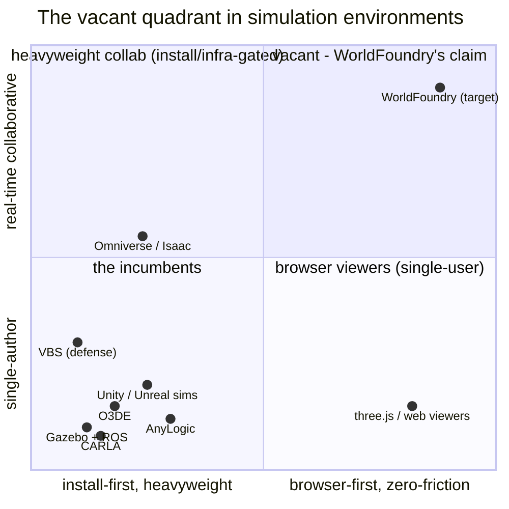
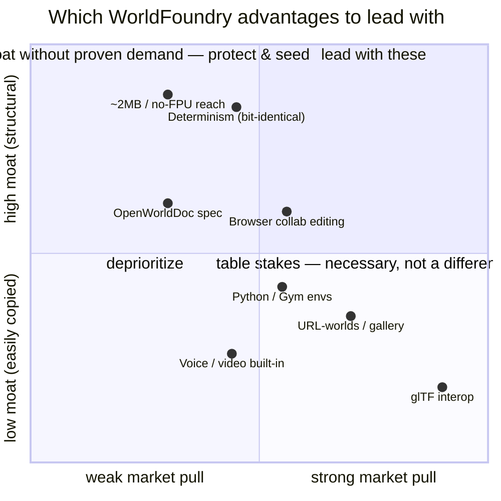
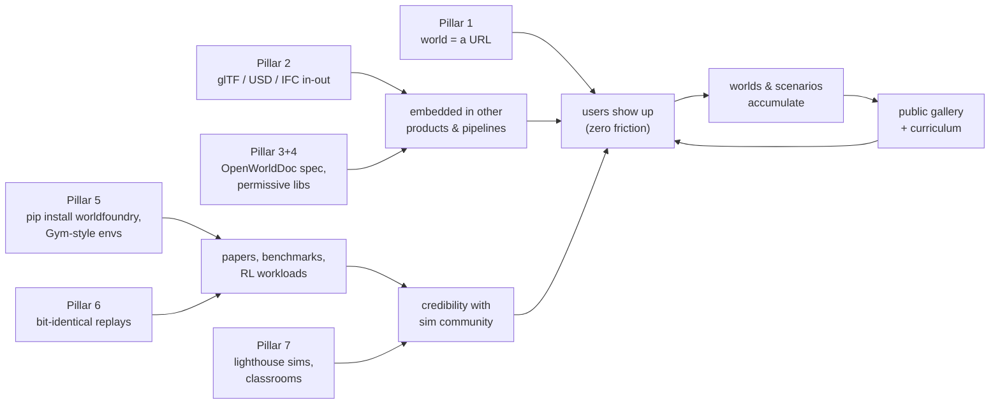
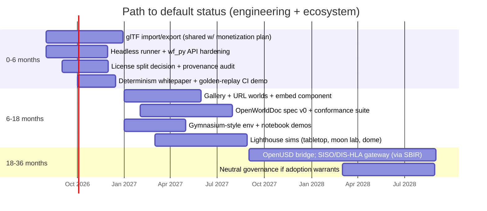

# Investigation: making WorldFoundry the default 3D world environment for simulations

**Date:** 2026-07-05
**Brief (verbatim):** *"I want WorldFoundry to become the default 3D world environment for simulations. How can we do that?"*
**Status:** Strategy analysis — opinionated, desk-only (no market research pass yet). Sibling docs: [monetization](2026-07-05-wf-edit-monetization.md) (the ten industry analyses this is the eleventh of) and [market validation](2026-07-05-wf-edit-market-validation.md).

---

## 1. What "default" actually means — and how defaults get won

"Default" is not "most capable" or "most popular by revenue." It's what a practitioner reaches for *first*, without deliberation, the way [SQLite](https://sqlite.org/) is the default embedded database, [Gazebo](https://gazebosim.org/) the default robotics simulator, [Blender](https://www.blender.org/) the default open 3D DCC (*digital content creation*) tool, and Linux the default server OS. Studying those, defaults are won on six recurring properties — none of which is "best-in-class features":

1. **Zero-friction first run.** SQLite is a single file; Godot is a 50MB download. The default is whatever works before the competitor finishes installing.
2. **Open license + no strategic fear.** Nobody gets locked in, acquired away, or invoiced later. Defaults are infrastructure, and infrastructure must be boring to depend on.
3. **File-format neutrality.** Defaults import everything and export everything; proprietary-format tools become "one stop in the pipeline," never the substrate.
4. **Embeddability.** The default is a component others build products on (SQLite is *inside* ~every phone). Tools that insist on being the whole application stay applications.
5. **Runtime ubiquity — runs on every class of hardware.** SQLite's quiet superpower is that the *identical* code runs from mainframes to smartwatches; ubiquity is what lets "reach for it without thinking" become safe across every context. A runtime that runs in one place is a tool; a runtime that runs *everywhere* is a default. This is where WorldFoundry is unusually strong (§2) and it is the property this analysis was initially under-weighting.
6. **A wedge no incumbent bothers to hold.** Linux didn't beat Solaris on Solaris's turf; it won the commodity x86 turf nobody defended, then grew.

The question is therefore not "how does WorldFoundry beat Unity" — it's **which simulation turf is undefended, and what would make reaching for WorldFoundry there thoughtless.**

## 2. Where we actually stand (honest inventory)

**Assets — several are genuinely rare:**

- **Browser-native, zero-install** (wasm/WebGL via Emscripten). A simulation world you can *send as a URL* — no incumbent sim environment can do this as its primary mode.
- **Real-time collaborative by construction** — CRDT scene document ([Yrs](https://github.com/y-crdt/y-crdt); CRDT = *conflict-free replicated data type*, multi-writer editing without a lock server) plus WebRTC voice/video/chat in the editor. There is no "Google Docs of simulation worlds" today. None.
- **Determinism.** The engine's core math is fixed-point — no floating-point drift across platforms/compilers. Bit-identical replays are a *famously* painful problem in float-based engines, and reproducibility is a first-order requirement in scientific, training, and multi-party simulation. This is the deepest technical moat in the repo and it's currently marketed as "runs on retro hardware." (Scope caveat where Jolt is in the loop — see the physics bullet below.)
- **~2 MB, everywhere — and this is a much bigger deal than "runs on retro hardware" implies.** The stripped engine is 2.43 MB (of which `.text`, the actual machine code, is 1.82 MB; ~1.0 MB compressed in the shipped Android APK — `docs/investigations/2026-04-18-android-port-size-and-ram.md`), the *same* engine spans web/wasm, Linux, Windows, Android, iOS, and Chromecast/Google TV, and **ESP32-class microcontrollers are a live target** (`engine/vendor/*/esp-idf` toolchains vendored; per `docs/investigations/2026-05-10-fixed-point-platform-survey.md`, three ESP32 SoCs have the PSRAM headroom for "a 2 MB-class engine"). The strategic point is the *pairing* with the fixed-point core: the RISC-V ESP32 parts (C3/C6/…) and the ESP32-S2 ship with **no hardware floating-point unit at all**, so a float-based engine (Unity, Unreal, Godot, O3DE, Omniverse — every incumbent in §3) physically cannot run there at usable speed. Footprint + fixed-point together open an entire hardware tier — sub-$5, no-FPU, battery-powered — that the competition is *structurally* locked out of, not merely behind on. Also self-hostable with no cloud dependency (closed-network defense/industrial relevance).
- **Scriptable actors in multiple languages** (Lua, Fennel, zForth, wasm — plus the experimental neural-forth for in-world AI/agents).
- **Python bindings already exist** (`wftools/wf_py`, Rust + PyO3) — Python being simulation's lingua franca.
- **Blender round-trip pipeline** and a modern Rust toolchain around a 25-year-old proven engine core.

**Gaps — equally real:**

- **Format lock-in to `.lev`/OAD.** Without first-class [glTF](https://www.khronos.org/gltf/) (and eventually [OpenUSD](https://openusd.org/)) in/out, WorldFoundry cannot be a substrate — the same gap flagged in the monetization doc, same fix.
- **License friction: the tree is GPL v2** (`wfsource/COPYING`, `wftools/COPYING`). Fine for a standalone tool; **fatal for embeddability** (property 4) — commercial products cannot link a GPLv2 engine. This needs a deliberate decision (§4, pillar 4).
- **Physics fidelity is mid-tier, not absent — and it complicates the determinism story.** *(Corrected 2026-07-05 — an earlier draft wrongly called Jolt "still TODO-listed.")* [Jolt Physics](https://github.com/jrouwe/JoltPhysics) **is integrated** (April 2026; see `docs/investigations/2026-04-14-jolt-physics-integration.md` on the remote line, plus months of hardening plans), including **driveable vehicles** — the moon level's Lunar Cruisers with GTA-style entry/exit — though vehicle dynamics still need work before anyone bets training outcomes on them, and the macOS/iOS Jolt builds are still catching up. Rigid-body and vehicle-adjacent sims are therefore credible; the honest ceiling is continuum physics — CFD (*computational fluid dynamics*) / FEA (*finite element analysis*) grade work — which we shouldn't chase. Determinism caveat: Jolt is float-based, so the bit-identical guarantee currently belongs to the fixed-point core; extending it through the Jolt path needs verification (Jolt does ship a [cross-platform-deterministic build mode](https://jrouwe.github.io/JoltPhysics/#deterministic-simulation)).
- **No standards presence** (no [Khronos](https://www.khronos.org/) membership, no [SISO](https://www.sisostds.org/) — the *Simulation Interoperability Standards Organization* — footprint, no DIS/HLA story), tiny community, thin docs, effectively a 1–3 person team.

## 3. The competitive map — and the vacant turf

Who is already the default, where:

| Niche | Incumbent default | Notes |
|---|---|---|
| Robotics | [Gazebo](https://gazebosim.org/) + [ROS](https://www.ros.org/) (*Robot Operating System*); [NVIDIA Isaac Sim](https://developer.nvidia.com/isaac/sim) rising | Deeply entrenched; ROS bridge ecosystems |
| Industrial digital twins | [NVIDIA Omniverse](https://www.nvidia.com/en-us/omniverse/) (OpenUSD-based) | GPU-vendor gravity + USD standardization via [AOUSD](https://aousd.org/) |
| Autonomous driving | [CARLA](https://carla.org/) (Unreal-based) | Academic default |
| Defense training | [Bohemia VBS](https://bisimulations.com/) + primes | Procurement-locked (see validation doc) |
| Discrete-event / operations research | [AnyLogic](https://www.anylogic.com/), Simio, Arena | Not really 3D-world-centric |
| Engineering/control | [MATLAB Simulink](https://www.mathworks.com/products/simulink.html) | Not 3D-world-centric |
| General 3D sim substrate (open) | [O3DE](https://o3de.org/) (Linux Foundation), [Godot](https://godotengine.org/), [Bevy](https://bevyengine.org/) | Engines, not sim *environments*; all install-first, all single-author-first |

Every one of these is **install-heavy and single-author-first**. The undefended turf, stated precisely:

> **The browser-native, real-time-collaborative, deterministic, lightweight simulation *world layer*** — where a scenario is authored by several people at once, shared as a URL, runs identically everywhere, and replays bit-for-bit.

Three honest observations about that quadrant: (a) the hard, valuable part is **CRDT simultaneous editing** — *not* the A/V. The [2026-07-07 A/V+collab validation](../investigations/2026-07-07-av-and-collab-validation.md) confirmed built-in voice/video is a neutralized non-factor (Figma won on live multiplayer with zero A/V), while real-time multi-user editing is the genuine category-definer — so lead with the editing substrate, not the WebRTC. (b) The corner is **not vacant everywhere**: [Spline](https://spline.design/) already fills browser + collaborative-3D in the *product-design / web-3D* space (funded, Figma-style multiplayer). It **is** vacant in *simulation / game-worlds / VTT*, which is where WorldFoundry's ground actually is — narrow the claim accordingly. (c) Even in that vacant sub-corner, buyer demand for browser co-editing is *assumed, not demonstrated* — the top open question is now "does the game-worlds/VTT segment actually want this?", not "does A/V win deals?" (answered: it doesn't).

**A second vacant turf — the low corner nobody in the table can reach.** The map above is drawn in browser-vs-collaborative axes, but there's an orthogonal opening the incumbents cannot follow into *at all*: **deterministic simulation on no-FPU embedded hardware** (§2). Every engine in that table is float-based, so none runs on a sub-$5 ESP32-class MCU; WorldFoundry's fixed-point core does. That unlocks a story no one else can tell — *the same world you authored collaboratively in a browser runs bit-identically on the microcontroller in the device* — i.e. hardware-in-the-loop (HIL) testing, sensor-in-the-loop training, and edge/on-device digital twins. It's a smaller near-term market than the collaboration wedge, but it is a **structural** monopoly (competitors would have to rewrite their engine to contest it), which makes it a durable differentiator worth protecting even before it's monetized.

**Footprint and determinism are one moat, not two.** Both come from the same fixed-point decision, and both are things a float-based competitor cannot copy without a ground-up rewrite: bit-identical replays (pillar 6) and no-FPU reach (§2) are the same wall seen from two sides. That is the single most defensible fact about the engine — lead with it.

**Do not fight for:** photoreal rendering, continuum-physics fidelity (CFD/FEA), GPU-vendor ecosystems. **Fight for:** authoring, sharing, reproducing, *teaching*, and *running-everywhere* simulated worlds.

### Which advantage to lead with — technical moat × market pull

The vacant-quadrant map says *where the open turf is*; this second map says *which of our own advantages to lead with*. It plots each asset/bet by how hard it is for a competitor to copy (technical moat, y) against how much the market actually pulls for it today (x):

Reading across the quadrants tells the whole prioritization: the deepest moats — **determinism** and **no-FPU embedded reach** — sit top-left in *"moat without proven demand"*: unforgeable, but the market hasn't asked for them yet, so protect and seed them rather than building the pitch around them. **glTF interop** is bottom-right *table stakes*: strong pull, zero moat — it's the monetization doc's #1 unlock, yet it differentiates nothing. **Voice/video** sits low because *as a differentiator* it's commodity WebRTC with unproven pull (keep it — it's cheap and expected — just don't lead with it). The one bet that can reach top-right *"lead with these"* is **browser collaborative editing**: the CRDT + A/V combination is genuinely hard to copy (real moat) and plausibly high-pull — but its pull is exactly the unproven **open question** from §7 (does built-in collab/A-V actually win work?), which is why it straddles the centre. The instruction the map gives: **ship the table-stakes (glTF, URL-worlds) to open the funnel → prove the pull on browser-collab to earn the top-right → keep determinism + embedded reach as the wall nobody can climb, even before they headline.**

## 4. Strategy — seven pillars

**Pillar 1 — Make "try it" a URL.** The wedge behavior for a default: paste a link, be inside the world, editing, in <10 seconds. Ship a public gallery where every world is `worldfoundry.org/w/<id>`, forkable in one click, embeddable via a `<wf-world>` web component / iframe. (The APT-repo and worldfoundry.org infra work already points this direction.)

**Pillar 2 — Interop over lock-in.** glTF import/export first (already the monetization doc's #1 engineering priority — same investment, double duty), then an OpenUSD bridge for the Omniverse world, IFC import for built-environment scenarios, and a documented, versioned `.lev`/OAD spec so others can write tooling without reading C++. Import from every incumbent; export to everything; be the pipeline's friendliest citizen.

**Pillar 3 — Own the standards vacuum: publish an open spec for *collaborative world documents*.** There is a real gap here: glTF/USD standardize *scene contents*, DIS/HLA standardize *runtime entity state* — **nothing standardizes multi-writer world *editing*** (CRDT semantics for a scene graph: object identity, conflict rules, offline merge, permission scopes). Draft "OpenWorldDoc" (working name) as a small spec + the WorldFoundry reference implementation + a conformance test suite, published Apache-2.0. Being the reference implementation of a standard is the strongest default-making move available to a small team — it's how SQLite, and not a committee, defined its niche.

**Pillar 4 — Fix the license before asking anyone to depend on us.** Options, in rough order of preference: (a) keep the *application* GPL but publish the collab/format/replay libraries + spec + bindings under Apache-2.0/MIT (clean-room or owned-code split); (b) dual-license the engine (GPL + commercial) if copyright consolidation allows; (c) full relicense of new-code trees. Given 1990s-era multi-contributor GPL v2 code, (a) is the realistic path: **new strategic surface permissive, legacy core stays GPL**. Without this, pillar 3 is dead on arrival — nobody builds on a spec whose only implementation is GPLv2. (Needs a real audit of copyright provenance; flag for legal reading, not just engineering.)

**Pillar 5 — Python-first, notebook-first, agent-first.** `wf_py` grows into the canonical API: `pip install worldfoundry`, load/author/step worlds headless, [Jupyter](https://jupyter.org/) rendering, and a [Gymnasium](https://gymnasium.farama.org/)-style environment interface so RL (*reinforcement learning*) researchers can use collaborative deterministic worlds as training environments. The neural-forth actors make "AI agents living inside reproducible worlds" a first-party story — timely, differentiated, and academically publishable.

**Pillar 6 — Determinism as the headline feature.** Rebrand the fixed-point core from retro trivia to **"bit-identical simulation, everywhere, forever"**: golden-replay files as CI artifacts (a sim test that fails byte-identically on a laptop, a phone, and a CI runner), cross-platform replay verification, court/audit-grade reproducibility for training scenarios. Write the whitepaper; this is the claim competitors physically cannot copy without rewriting their engines. Scope it honestly: the guarantee is the fixed-point core's — scenarios routed through Jolt's float pipeline can only join the claim once Jolt's cross-platform-deterministic mode is verified in our build (a concrete, publishable milestone in itself).

**Pillar 7 — Lighthouses + education flywheel.** Defaults are habits, and habits form in school. Three concrete reference deployments from assets already in the repo: (1) an emergency-tabletop scenario (ties to monetization A4.3), (2) a classroom orbital-mechanics/moon-lander lab (the moon level + countdown/lander sequence already exist), (3) a museum/planetarium dome build (the dome-view work in TODO). Pair with the B2 education channel from the monetization doc — every classroom seat is a future practitioner whose default is us.

## 5. Sequenced roadmap

Phase gates, not dates, are what matter: don't write the spec (6–18mo) before the license split (0–6mo); don't chase DIS/HLA before a lighthouse proves anyone wants the worlds.

## 6. How we'd know it's working (default-ness metrics)

- **Reach-for-first signal:** unprompted "made with WorldFoundry" worlds/repos per month; forum questions phrased as "how do I do X in WF" rather than "should I use WF."
- **Substrate signal:** third-party products embedding the viewer/libs; tools written against the `.lev`/OpenWorldDoc spec by people we've never met.
- **Reproducibility signal:** papers/CI pipelines citing golden replays; the whitepaper cited outside our own orbit.
- **Education signal:** classrooms/curricula running the lighthouse labs (counts, renewals).
- **Leading indicator to watch early:** gallery fork rate — a URL-world that nobody forks means pillar 1 shipped but the content flywheel didn't catch.

## 7. Risks, and the honest odds

- **Omniverse/USD gravity.** NVIDIA is standardizing the *scene* layer with AOUSD. Mitigation: don't compete with USD — bridge to it, and own the *editing/collab* layer it doesn't define. If AOUSD ever standardizes collaborative editing semantics, our spec either merges in (win: we wrote the reference) or loses (we're early, small, and adjacent — acceptable risk).
- **O3DE/Godot could add collab.** Plausible, but CRDT-native retrofits into float-based, install-first engines are multi-year efforts; our lead is structural, not a feature flag.
- **Physics fidelity ceiling (revised).** With Jolt integrated — vehicles included — rigid-body and basic vehicle sims are in scope; what we still lose is continuum-physics work (CFD/FEA) and *validated* vehicle dynamics: the vehicles drive, but need more work before their fidelity is a selling point. Mitigation: positioning discipline — *interaction, training, teaching, and coordination* sims first, and publish exactly which fidelity claims are validated. Say it in the docs so nobody discovers it as a betrayal.
- **GPL provenance may block the license split.** 1990s contributors may be unreachable. Mitigation: the permissive surface can be new code (collab libs, spec, bindings are all post-2025 work anyway).
- **Team size vs platform ambition.** A 1–3 person team cannot outspend anyone. The entire strategy is chosen so that openness, standards, and education do the distribution work — the only leverage that scales without headcount. Expect 3–5 years, not 18 months, to defensible default-ness in even one niche.
- **The differentiator is unproven.** Same as the validation doc's open question #1: nobody has demonstrated that built-in collab+A/V wins simulation work. The lighthouses exist to test exactly this cheaply, before the standards/licensing investments compound.

## 8. Relationship to the monetization strategy

No conflict — mostly shared rails. glTF (pillar 2) is already the monetization doc's highest-leverage item; the education flywheel (pillar 7) is channel B2 repurposed as habit formation; SBIR (A4) can *fund* the DIS/HLA gateway; the VTT wedge ships the URL-world + gallery infrastructure (pillar 1) under a revenue-generating banner first. The open-core boundary writes itself: **spec, libraries, determinism, single-player editing free forever; hosted collaboration, persistence, marketplaces, and enterprise deployment are the business.** Default status is the top of every funnel in the other ten analyses — this is the eleventh analysis because it's the one that makes the other ten cheaper.
