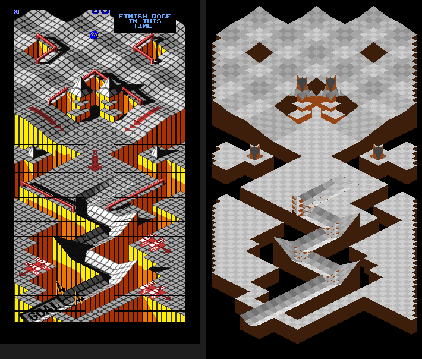

# Investigation: Marble Madness arcade — the real course-surface algorithm

**Date:** 2026‑09‑22
**ROM:** Atari Marble Madness (Set 1), 1984, Atari System 1, 68000 @ 7 MHz
**Status:** Confirmed. Decoder reproduces the game's own ground height bit‑for‑bit along a full demo run.
**Tools:** MAME 0.285 Lua (`scripts/research/mame/mm/`), `unidasm -arch m68000`, Python (`wflevels/marble-madness-3d/mm_surface.py`).
**Supersedes:** [2026‑05‑01 ROM level‑data investigation](2026-05-01-marble-madness-rom-level-data.md) — see "Why the earlier decode is not the course".

---

## Summary

The arcade stores **no explicit height map**. The isometric tile art in playfield VRAM *is* the map: for every 8×8‑unit world cell the game reads the tile word(s) at that cell's isometric position, maps the tile through a per‑level **tile → surface‑code table**, and expands the code into four height words. Those four words are **one lattice vertex** described four times — once per adjacent cell — which is how the game represents cliffs (a step between neighbours) and void (a word of 0).

The ground under the marble is a piecewise‑planar interpolation of those vertex heights, split along the cell diagonal. Re‑implementing the two routines involved (`0x1CABA` load‑four‑cells, `0x1CC62` interpolate) in Python and driving them from MAME memory dumps gives the complete Practice course: 1729 solid cells, 73 × 76 cells extent, 52 height units of drop, matching the MAME capture cell for cell.

[](mame-screenshots/practice_decoded_vs_arcade.png)

Left: 31 MAME screenshots stitched by scroll register. Right: `mm_render_iso.py` on the decoded heightfield (grey = floor, brown = cliff faces / drops to void).

---

## Why the earlier decode is not the course

The May investigation found 24‑byte "segment records" via RAM pointer scanning and decoded Practice as 13 segments with a single 27° bend. Two facts rule that out as course geometry:

- The MAME captures show Practice as a plateau with pits, then a multi‑hairpin zig‑zag chute (see stitched image). The May screenshots labelled "practice" are actually **Beginner** (black‑and‑white chute) and the "beginner" one is **Intermediate** (blue cylinders); Practice is the grey plateau with red arrow gates.
- Intermediate decoded to 4 "segments" and Silly to 5 — not a course.

Those records are real data (the game walks them per frame — see `0x26882`, a bitmap‑row scanner over a 20‑byte‑stride pointer table at `0x2BF20`) but they are not the surface.

---

## Method (summary)

1. **Boot headless.** `mame -video none -sound none -nothrottle -autoboot_script …` runs at ~7× real time; Lua `emu.register_frame_done` drives coin/start and dumps memory.
2. **Address map** (`mem.map.entries` from Lua): work RAM is only `0x400000–0x401FFF` (8 KB); `0x900000–0x9FFFFF` is an unused 1 MB mirror (all zero); playfield VRAM `0xA00000–0xA01FFF`; sprite RAM `0xA03000`; slapstic bank `0x080000–0x081FFF`.
3. **Find the marble.** Per‑frame RAM diff during motion → the marble object is at `0x400018`, with 16.16 fixed‑point **X @ +0xC (0x400024), Y @ +0x10 (0x400028), Z @ +0x14 (0x40002C)**. Confirmed by a write tap: `0x122B2/BA/C2` write them each physics frame (physics runs at 30 Hz — every other frame reads ~5 000 distinct ROM addresses, the others ~500).
4. **Find the surface code.** Routine `0x1BB50` splits X,Y into `cell = coord >> 3`, `sub = coord & 7` and sets `0x4006A2 = (sub_y >= sub_x)` — the diagonal‑triangle flag. When the cell changes, `0x1BAB2` calls `0x1CABA`. A read tap with PC filter `0x1CA00–0x1D000` logged every table it touches; `unidasm` gave the rest.
5. **Validate.** Dump RAM+VRAM+bank at three demo frames and compare the 16 words the game leaves at `0x401C28` with the Python decode (exact match at frames 600 and 1000), then compare the ball's Z with `ground(X,Y)` at 60 points along the attract‑mode demo (Z − ground = 0 at every point whose row was still in VRAM).

Six representative Lua scripts are kept at [`scripts/research/mame/mm/`](../../scripts/research/mame/mm/), one per confirmed step above (plus the full sweep and the attract survey). They are the *reproduction* path, not the discovery path — see below for the actual funnel, which ran roughly 15 script variants and included two genuine dead ends.

## Discovery process (how each address was actually found)

Reverse-engineering a raw 68000 image with no symbols is a search problem: the memory map gives no hints about which of ~8 KB of RAM words is "X position" versus "credits remaining." The approach throughout was to narrow by **behavior** (diff RAM across frames where something visibly changed) until a small enough cluster of addresses remained to confirm by **provenance** (tap the exact instruction that writes it).

### Round 1 — broad diff, mostly noise

First pass: dump the full 8 KB RAM at four points (frames 700/760/820/1300) spanning a coin-insert, start, and several seconds of gameplay, then scan for 16-bit words whose value changed by a small, same-signed step at every sample — a monotonic-drift heuristic meant to catch position/velocity-like data and reject flags or one-shot counters. This produced 20 candidates (`0x400012`, `0x40008C`–`0x4000B6`, `0x4000DC`, `0x400AB8`, `0x401DC0`, `0x401DD8`, `0x401F38`, `0x401FFA`). None of these turned out to be position — narrowing the sampling to every 4 frames over a longer window and re-running the same heuristic collapsed the "real" candidates to just `0x400012`, `0x4000DC`, `0x400AB8`, `0x401F38`, `0x401FFA`, all of which have the up-then-plateau shape of **timers or scores**, not a coordinate. Loosening the threshold again to see what was excluded surfaced dozens more addresses, several of which were revealed later to be genuinely important (`0x4003A6`, `0x400674`–`0x400682`) but for the wrong reason — those are **table pointers**, constant during a fixed level and only "changing" because the level itself changed mid-scan.

### Round 2 — two dead ends that were still useful

`mem.map.entries` (a Lua introspection call that lists the CPU's installed address ranges) showed the 68000 sees a **1 MB region at `0x900000`–`0x9FFFFF`** in addition to the real 8 KB work RAM. Dumping it at two gameplay frames 60 frames apart found it entirely zero and byte-identical page to page — an unused mirror, not a second RAM bank. Ruling this out mattered because early candidate-hunting scripts were scanning it as if it might hold level data.

Dumping playfield/sprite VRAM (`0xA00000`–`0xA03FFF`) at the same two frames found only 8 changed words, all in the sprite table around `0xA030A6`–`0xA0312C` — two sprites' on-screen pixel coordinates (confirmed later to be the marble and a gate marker). Useful as a sanity check that *something* was moving where expected, but screen-space pixel coordinates are a dead end for recovering world-space physics: the isometric projection folds X and Y into one screen axis, so it can't be inverted back to a unique (X, Y).

### Round 3 — the cluster, then a write-tap instead of more diffing

A wider, denormalized capture — every 2 frames for ~350 samples across frames 800–1500, work RAM and sprite RAM together — turned up dozens of changing addresses, too many to eyeball individually. The one structural pattern worth pursuing: six contiguous words at `0x400024`–`0x40002E`, forming three adjacent 32-bit pairs that all changed together, smoothly, every sample. That shape (three co-varying 32-bit values) is what a 3-D position vector looks like; nothing else in the capture had it.

Rather than keep diffing to confirm, the cluster was narrow enough to **tap directly**: MAME's `install_read_tap`/`install_write_tap` fire a callback with the current program counter on every access to a chosen range. Tapping reads+writes on just `0x400020`–`0x40003F` for a few physics frames gave the exact writer for each word — no ambiguity:

| address | writer PC | field |
|---|---|---|
| `0x400024`/`26` | `0x0122B2` | **X** |
| `0x400028`/`2A` | `0x0122BA` | **Y** |
| `0x40002C`/`2E` | `0x0122C2` and `0x012700` (two call sites — jump vs. fall path) | **Z** |
| `0x400034` | `0x012824`, `0x012840`, `0x0253EA` (three call sites) | a state/flag byte, not decoded further |
| `0x400036`/`38` | `0x01BAAC` | not decoded — see "Loose ends" |
| `0x40003A`/`3C`/`3E` | `0x01BAA2` | not decoded — see "Loose ends" |

This is the actual discovery step for X/Y/Z; the broad diffing rounds only got the search down to "somewhere in this cluster," and would not by themselves have distinguished position from a dozen other plausible interpretations.

### Round 4 — from writer PC to the cell-lookup routine

Disassembling around `0x01BAA2`–`0x01BB94` (`unidasm -arch m68000`, after one false start — the first attempt used a byte offset one instruction short of a real boundary and produced ~60 bytes of garbage/`ILLEGAL` opcodes before the stream resynchronized on a recognizable `movem.l …,-(A7)` prologue) revealed routine `0x1BB50`: it takes a working position pair at `0x400690`/`0x400692`, right-shifts by 3 into `0x400696`/`0x400698` (**cx, cy** — the world cell), masks by 7 into `0x40069E`/`0x4006A0` (**sub-cell offset**), and compares them into `0x4006A2` (the diagonal-triangle flag). Two different call sites feed `0x400690`/`0x400692`: one copies the live actor's X/Y fields directly (the moving-marble path), the other computes `byte × 8` from a small lookup (used for a fixed spawn-tile coordinate elsewhere) — only the first path mattered for course geometry.

From there, a **PC-filtered read tap** — log every ROM read whose instruction address falls in `0x1CA00`–`0x1D000`, alongside the marble's current position and cx/cy — run for ~200 frames of the demo, showed a stable, repeating set of table reads every time cx/cy changed. `unidasm` on that PC range gave the full routine (`0x1CABA`), including the four constant tables (`0x1EB3A`, `0x1ED0A` ×2, `0x1ED62`, `0x24B3A`) documented in "The algorithm" below.

### Round 5 — validating against the game, not against intuition

Two independent checks, both against the *running game's own computed state* rather than against each other:

- **Exact-word match.** Dumped RAM+VRAM+bank at three demo frames, decoded each with the Python re-implementation, and compared against the 16 words the game itself leaves at `0x401C28` after doing the same lookup. Frames 600 and 1000 matched exactly. Frame 1400 initially looked like a failure — all 16 words zero, versus a real dump elsewhere in the level — until checking the *raw* VRAM word at that address showed it was itself zero: the row had scrolled out of the video window by then, so "all zero" was the correct decode of "no tile is currently drawn here," not a decoder bug. This is why `mm_merge_course.py` treats a raw VRAM word of 0 as "not yet seen" rather than "void," and sweeps multiple frames instead of trusting one dump.
- **Trajectory match.** Logged (X, Y, Z, cx, cy, sub_x, sub_y) at ~60 points along a full attract-mode demo run and ran the decoder's `ground()` function against every sample. Z matched the decoded ground height everywhere except two samples: one at a cell whose row genuinely hadn't scrolled into VRAM yet at that frame (same cause as above, not a real disagreement), and one **unexplained residual of 0.75 height units** partway through the run — small enough not to affect the geometry (it's below one texel of the interpolation), but the cause was never run down. Noted here rather than left silently rounded away.

### Round 6 — the merge step's own false-positive rate

Sweeping dumps every 50 frames across a full demo run and merging per-cell (first-seen-wins) initially produced 3685 "solid" cells — but comparing to the MAME captures, over half of those (1956) had at least one corner word implying a height more than 300 units from sea level, which is not a real slope, it's the interpolation formula degenerating when one side of a cell has no floor (a corner word of 0, meaning "void from this neighbor"). The fix — reject a cell unless all four corner words are non-zero — is in `mm_merge_course.py`; it was found by comparing the "clean" cell count (1729) against the visually-obvious course extent in the stitched screenshot, not derived from the disassembly.

### Visual proof, last

Only after all of the above did rendering matter: the merged, filtered heightfield was drawn in the exact isometric projection recovered from the sprite-placement code (`screen_x = Y − X + 0x88`, …), and 31 raw MAME screenshots were stitched into one full-course reference by their scroll-register value. The two matched — rim shape, both gate pits, the central pyramid pit's two spike cones, the side ramps, the chute's zig-zags — which is the confirmation that the numeric validation in Round 5 corresponds to the geometry an arcade player actually sees.

---

## The algorithm (`0x1CABA`, load four cells)

```
cx, cy      = X>>3, Y>>3                      (0x400696, 0x400698)
row         = cx + cy + 1 − 0x15              iso row   (0 … nrows−1, nrows = level+0x18)
col         = 0x15 − cx + (row >> 1)          iso column (+0x16 on odd rows → table half)
vram        = 0xA00000 + ROWTBL[row & ~1]     ROWTBL @ 0x1EB3A: 0x4E + 0x80·(row/2)  (one VRAM row per row‑pair)
              + COLOFF[col] − 2               COLOFF @ 0x1ED0A (44 bytes)
field       = (u32 @ vram >> SHIFT[col]) & 0x7FE          SHIFT @ 0x1ED36 (44 bytes)
code        = u16 @ (TILE_TBL + field)        TILE_TBL = *(0x40065A) — per level, in slapstic bank
rowbase     = s16 @ (0x400478 + 2·row)        per‑row base (0x4000 for all playable rows)
```

`code` expands to four words:

| code range | meaning |
|---|---|
| `0` | void — all four words 0 |
| `1 … 0x7FF` | pointer: 4 bytes at `*(level) + code`; byte `b` → `0` if `b == 0` else `b + rowbase − 0x80` |
| `0x800 … 0xFFF` | indirect through RAM table `0x40076E[code & 0x7FE]` (animated / dynamic tiles), then re‑decode |
| `0x1000 … 0xEFFF` | two‑height cell: `hi = (code & 0x7F) − 0x40 + rowbase`, `lo = hi − SLOPE[(code >> 7) & 0x1F]` (SLOPE @ `0x1ED62`, entry 31 = "lo is void"); bits 12–15 pick `hi`/`lo` per word |
| `≥ 0xF000` | flat: all four words `(code & 0x7F) − 0x40 + rowbase` |

The routine runs four times, for iso cells `(row,col)`, `(row,col−1)`, `(row+1,col−1 | col)`, `(row−1,col−1 | col)` (deltas from `0x24B3A`), storing 16 words at `0x401C28` in the order cell0, cell2, cell1, cell3.

### What the four words are

`0x1CC62` computes the ground height with the triangle flag `f = (sub_y >= sub_x)`:

```
base = cell3[1]
f=1 (upper‑left triangle, verts (0,0)(8,8)(0,8)):  gx = cell1[3] − cell0[2],  gy = cell0[2] − cell3[1]
f=0 (lower‑right triangle, verts (0,0)(8,0)(8,8)):  gx = cell2[0] − cell3[1],  gy = cell1[3] − cell2[0]
h(sub_x, sub_y) = base + (gx·sub_x + gy·sub_y) / 8
```

Solving for the corner heights of world cell (cx,cy): `(0,0) = cell3[1]`, `(8,0) = cell2[0]`, `(8,8) = cell1[3]`, `(0,8) = cell0[2]`, where cell0 = (cx,cy), cell1 = (cx+1,cy), cell2 = (cx+1,cy−1), cell3 = (cx,cy−1). Substituting back, the four words of the record fetched for cell (a,b) all describe **one lattice vertex, (a, b+1)**, as seen from its four neighbouring cells:

| word | height of vertex (a, b+1) as seen from cell |
|---|---|
| 0 | (a−1, b+1) — its (8,0) corner |
| 1 | (a, b+1) — its (0,0) corner |
| 2 | (a, b) — its (0,8) corner |
| 3 | (a−1, b) — its (8,8) corner |

So the data is **vertex‑centric with per‑adjacent‑cell heights**: a continuous slope has four equal words, a cliff has two values, and `0` marks "no floor on this side". A cell is walkable iff all four of its corner words are non‑zero; if any is 0 the interpolation yields ≈ −16384 and the marble falls (that is the game's actual fall‑off behaviour, not a decoder artefact).

### Units and projection

From the sprite‑placement code at `0x1BA34`: `screen_x = Y − X + 0x88`, `screen_y = scroll + Z + 0x54 − (X+Y)/2`. So 1 XY unit = 1 px of `Y−X`, one 8‑unit cell is a 16 × 8 px diamond, and **1 height unit = 1 px**. A 2:1 pixel isometric is a 30° camera elevation, in which a vertical world unit projects to `cos 30° · √2 = 1.2247` px, so to reproduce the picture in a true 3‑D scene use **Z_world = 0.8165 × h** (in XY units). "Sea level" is `h = 0x4000`; the Practice start is at 0, the goal trough at −44, the lowest floor at −52.

---

## Practice course facts (level 0)

| item | value |
|---|---|
| level struct | `0x2BEE2` (`*(0x400474)`), pointer table `0x2BE00` (6 longs) |
| tile → surface table | `0x81874` (slapstic bank; stable across the run) |
| iso rows | 160 (`*(struct+0x18)`) |
| solid cells | 1729; extent cx 7–79, cy 7–82 |
| spawn | X = 139.97, Y = 140.0, h = 0 (cell 17,17) |
| demo respawn checkpoint | X = 284, Y = 196 |
| goal trough | cx 62–79, cy 64–67 at h −39/−44; GOAL gate at cx ≈ 77–80 |

The attract mode plays Practice (frames ~200–1150) then Beginner (~1750–3100); `scripts/research/mame/mm/mm_demo_sweep.lua` captures both.

---

## Limitations / open items

- **Two fields found by the write-tap were never decoded.** `0x400036`/`0x400038` (written by PC `0x01BAAC`) and `0x40003A`/`0x40003C`/`0x40003E` (written by PC `0x01BAA2`) sit right next to X/Y/Z in the same object and update every physics frame, but weren't needed for the surface algorithm so their meaning was never chased down — candidates include a previous-frame position (for a velocity/delta calc) or a second tracked point. `0x400034` similarly has three distinct writer call sites and was left as an unidentified state/flag byte.
- **One unexplained 0.75-height-unit residual.** In the trajectory validation (Round 5 of "Discovery process") the decoded ground height matched the ball's actual Z at every sampled point except one, where it was off by 0.75 units — smaller than one texel of the interpolation and with no visible effect on the geometry, but the cause (rounding in the slope table? a stale cx/cy read mid-transition?) was not run down.
- **VRAM is a window.** `ROWTBL` maps iso row‑pair *i* to VRAM row *i* with no wrap for rows < 128 and the game blanks rows that scroll off, so one dump never holds a whole course. `mm_merge_course.py` merges a sweep (dump every 50 frames). Courses taller than 128 iso rows (Beginner has 216) will need the wrap handled (`ROWTBL` entries 64+ continue past 0x2000 — to be checked against the write side).
- **Decorative lower floors.** The orange/yellow terraces at −58/−84 around the chute have zero words on at least one side; they are not walkable in the arcade (the marble shatters on them) and are currently omitted from the geometry.
- **Dynamic tiles** (`0x800–0xFFF`) are resolved through RAM at dump time; only 4 cells near the goal differed between dumps (the animated goal gate).
- **Hazards / actors** (marble munchers, the checkpoint arrows, the goal timer) are not part of this data.
