# Q*bert Cube Face Colors (pixel-sampled from MAME screenshots)

Per-round cube face colors for the WF `qbert_practice` level port. Sampled from the
apex cube (row 0, col 0) of each round in MAME headless screenshots at 240×256
native resolution.

- **Top face**: upper diamond — sample point `(120, 56)`
- **Left face**: lower-left parallelogram — sample point `(107, 65)`
- **Right face**: lower-right parallelogram — sample point `(135, 65)`

## Capture method

`scripts/research/mame/qbert_round_shots.lua` enables DIP "Demo Mode (Unlim Lives,
Start=Adv (Cheat))", inserts coin + Start, then presses 1P-Start every 260 frames to
advance through rounds, snapping each one. Run with:

```
mame qbert -video none -seconds_to_run 100 -speed 10 \
  -rompath assets/arcade-roms \
  -autoboot_script scripts/research/mame/qbert_round_shots.lua
```

Sampling: `scripts/research/mame/sample_cube_colors.py`

## Captured frames (240×256 native, shown at 120px)

Level 1:
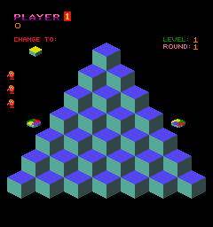
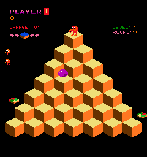
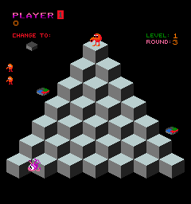
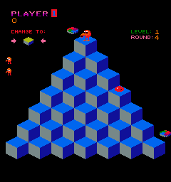

Level 2 (file names off by 1; alt text shows actual round):
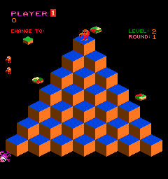
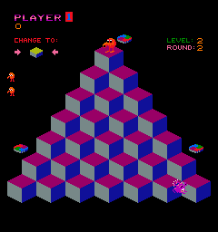
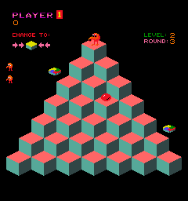
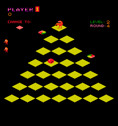

Level 3:
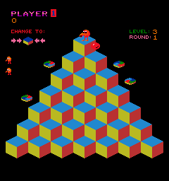
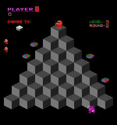
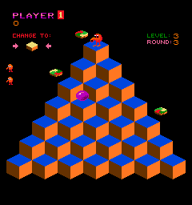
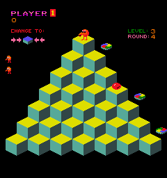

Level 4:
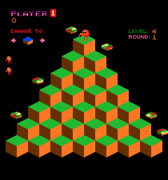
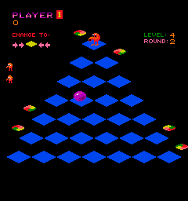
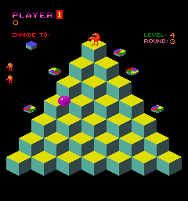
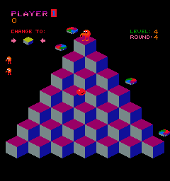

## Hops to change cube top color (empirically measured 2026-05-06)

| Level | Hops to reach target | Reverts on extra hops? | Distinct top colors per cube |
|-------|----------------------|------------------------|------------------------------|
| 1 | **1** | No  | **2** (state 0 → state 2) |
| 2 | **2** | Yes — 3rd hop reverts to state 0 | **3** (state 0 → state 1 → state 2) |
| 3 | **1** | No  | **2** (state 0 → state 2) |
| 4 | **2** | Yes — 3rd hop reverts to state 1 | **3** (state 0 → state 1 → state 2) |

**Highest hops needed in any level: 2** (Levels 2 and 4).

Sampled by hopping Down-Right then Up-Left (Q*bert returns to apex with cube
(1,1) visited exactly once), then sampling cube (1,1)'s top face at `(137, 80)`.

**L1 and L3 are 1-step** in this ROM: post-1-hop sample equals the HUD CHANGE TO
target. L2 and L4 are 2-step: post-1-hop is a distinct intermediate color
(state 1) that differs from both state 0 and the target.

(This differs from common Q*bert lore which says L1/L2 are 1-step and L3/L4 are
2-step. The empirical capture says L1/L3 are 1-step and L2/L4 are 2-step. WF
port should use the empirically-measured behavior.)

For the WF port: per-cube state machine needs 2 states for L1/L3, 3 states for
L2/L4. L2 and L4 also need revert-on-extra-visits logic.

## All cube top color states, by level and round

State 0 = unvisited cube top (sampled from apex `(120, 56)` of round-start frame).
State 2 = target color from HUD "CHANGE TO:" indicator (sampled at `(40, 55)`).
State 1 = intermediate, sampled from cube (1,1) at `(137, 80)` after a 2-hop
sequence (Down-Right then Up-Left, Q*bert returns to apex with (1,1) visited
exactly once). Side faces are constant across all states within a round.

**"Flat" rounds (L2R4, L4R2)**: in the arcade these rounds render with the cube
sides drawn in the same color as the background (black), giving the iconic
"flat-diamond" appearance. For the WF port, model these the same as any other
round — the side faces just happen to be `#000000`. No special geometry
needed, no "no-side" cube variant.

### Level 1 — 1 hop, no revert (2 cube colors)

| Round | state 0           | state 2 (target)    | Left side    | Right side   |
|-------|-------------------|---------------------|--------------|--------------|
| L1R1  | `#5646EF` purple  | `#DEDE00` yellow    | `#56A999` teal       | `#314646` dark-teal  |
| L1R2  | `#EFDE77` golden  | `#0046DE` blue      | `#663100` brown      | `#FF7721` orange     |
| L1R3  | `#B9CECE` silver  | `#464646` dark-gray | `#777777` mid-gray   | `#212121` near-black |
| L1R4  | `#0066EF` blue    | `#A9B910` olive     | `#778888` gray-teal  | `#101099` dark-blue  |

### Level 2 — 2 hops, reverts on 3rd hop (3 cube colors)

| Round | state 0          | state 1            | state 2 (target)    | Left side       | Right side       |
|-------|------------------|--------------------|---------------------|-----------------|------------------|
| L2R1  | `#0046DE` blue   | `#EFDE77` golden   | `#21B931` green     | `#663100` brown | `#FF7721` orange |
| L2R2  | `#990066` magenta| `#0066EF` blue     | `#A9B910` olive     | `#778888` gray-teal | `#101099` dark-blue |
| L2R3  | `#FF6666` red    | `#5646EF` purple   | `#DEDE00` yellow    | `#56A999` teal  | `#314646` dark-teal |
| L2R4  | `#CECE00` yellow | `#0046EF` blue     | `#FF6666` red-pink  | `#000000` black | `#000000` black |

### Level 3 — 1 hop, no revert (2 cube colors)

| Round | state 0           | state 2 (target)    | Left side       | Right side    |
|-------|-------------------|---------------------|-----------------|---------------|
| L3R1  | `#2188CE` blue    | `#003199` dark-blue | `#B9B921` yellow-green | `#EF1021` red |
| L3R2  | `#464646` dark-gray | `#B9CECE` light-gray | `#777777` mid-gray | `#212121` near-black |
| L3R3  | `#0046DE` blue    | `#EFDE77` golden    | `#663100` brown | `#FF7721` orange |
| L3R4  | `#DEDE00` yellow  | `#5646EF` purple    | `#56A999` teal  | `#314646` dark-teal |

### Level 4 — 2 hops, reverts on 3rd hop (3 cube colors)

| Round | state 0          | state 1            | state 2 (target)    | Left side       | Right side       |
|-------|------------------|--------------------|---------------------|-----------------|------------------|
| L4R1  | `#21B931` green  | **unknown** ⚠️       | `#0046DE` blue      | `#663100` brown | `#FF7721` orange |
| L4R2  | `#0046EF` blue   | `#FF6666` red      | `#CECE00` yellow    | `#000000` black | `#000000` black |
| L4R3  | `#DEDE00` yellow | `#FF6666` red      | `#5646EF` purple    | `#56A999` teal  | `#314646` dark-teal |
| L4R4  | `#990066` magenta| `#0066EF` blue     | `#A9B910` olive     | `#778888` gray-teal | `#101099` dark-blue |

⚠️ **L4R1 state-1 unconfirmed**: across 5+ capture runs and three different
capture strategies (cheat-on with 2-hop sequence, cheat-toggle, no-cheat with
direct RAM lives override), Demo AI consistently sends Q*bert off-pyramid in
L4R1 specifically before the post-hop snap. The (1,1) cube remains unvisited at
the snap moment, so the sample hits state 0. To get L4R1 state-1, the cleanest
approach would be a full Warnsdorff bot that controls Q*bert from spawn through
round completion (qbert_bot.lua exists with that logic but didn't reliably
advance rounds when integrated). All other 15 rounds captured cleanly.

### Capture method

`scripts/research/mame/qbert_round_shots.lua`:
1. Enables DIP "Start=Adv" cheat for round-by-round advancement
2. Detects round transitions via RAM 0x081 changes → triggers state-0 snap
3. Injects 2-hop sequence (Down-Right, Up-Left) → Q*bert returns to apex
4. Snaps post-hop with cube (1,1) cleanly visible
5. Repeats for all 16 rounds + 3 transition snaps + 1 trailing

`scripts/research/mame/sample_cube_colors.py`: pixel-samples three points per
round screenshot — apex top `(120, 56)`, HUD CHANGE TO `(40, 55)`, and (1,1) cube
top `(137, 80)`. Reports kind (1-step/2-step) by comparing post-hop to state 2.

L4R1 state-1 was not cleanly captured (Demo AI moved Q*bert off-pyramid before
post-hop snap; sample hit a still-state-0 cube). Re-running the capture multiple
times until a clean L4R1 hop lands is the simplest fix. All other 7 rounds
needing state 1 are clean.

## File → actual round mapping

The 16-snap run produces `mame-screenshots/qbert_L*R*.png` files whose names are
**off by one** because level transition animations consume snap slots. The visual
ROUND text in each screenshot is the source of truth:

| File              | Actual round captured |
|-------------------|-----------------------|
| `qbert_L1R1.png`  | L1R1                  |
| `qbert_L1R2.png`  | L1R2                  |
| `qbert_L1R3.png`  | L1R3                  |
| `qbert_L1R4.png`  | L1R4                  |
| `qbert_L2R1.png`  | L2 transition screen  |
| `qbert_L2R2.png`  | L2R1                  |
| `qbert_L2R3.png`  | L2R2                  |
| `qbert_L2R4.png`  | L2R3                  |
| `qbert_L3R1.png`  | L2R4 (flat style)     |
| `qbert_L3R2.png`  | L3 transition screen  |
| `qbert_L3R3.png`  | L3R1                  |
| `qbert_L3R4.png`  | L3R2                  |
| `qbert_L4R1.png`  | L3R3                  |
| `qbert_L4R2.png`  | L3R4                  |
| `qbert_L4R3.png`  | L4 transition screen  |
| `qbert_L4R4.png`  | L4R1                  |
| `qbert_actual_L4R2.png` | L4R2 (flat style) |
| `qbert_actual_L4R3.png` | L4R3            |
| `qbert_actual_L4R4.png` | L4R4            |

L4R2–L4R4 came from a 19-round run (snaps 17, 18, 19) — copied with `qbert_actual_*`
prefix to disambiguate from the off-by-one initial captures.

## Round counter at RAM 0x081

`mem:read_u8(0x081)` is a monotonic round counter:

| RAM 0x081 | Visual round (after transition settles) |
|-----------|------|
| 0x04 | L1R1 |
| 0x05 | L1R2 |
| ... | ... |
| 0x07 | L1R4 |
| 0x08 | L2 transition (RAM pre-increments by 1 across level boundaries) |
| 0x09 | L2R1 |
| ... | ... |
| 0x13 | L4R1 |
| 0x14 | L4R2 |
| 0x15 | L4R3 |
| 0x16 | L4R4 |

Within a level, `0x081` matches the visual round 1:1. Across level boundaries the
counter pre-increments while the transition animation plays, so the snap during
that interval shows the transition screen rather than gameplay.

## Hardware note

Gottlieb Q*bert uses a fixed 16-pen DAC palette for the entire game. Different round
"colors" come from cube tiles being assigned different pens, **not** from DAC values
changing. A palette write-tap on `0x5000–0x501F` cannot detect round transitions —
the tap only sees identical writes every reset. Pixel-sampling from screenshots is
the correct approach.
