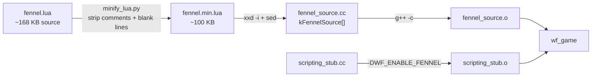
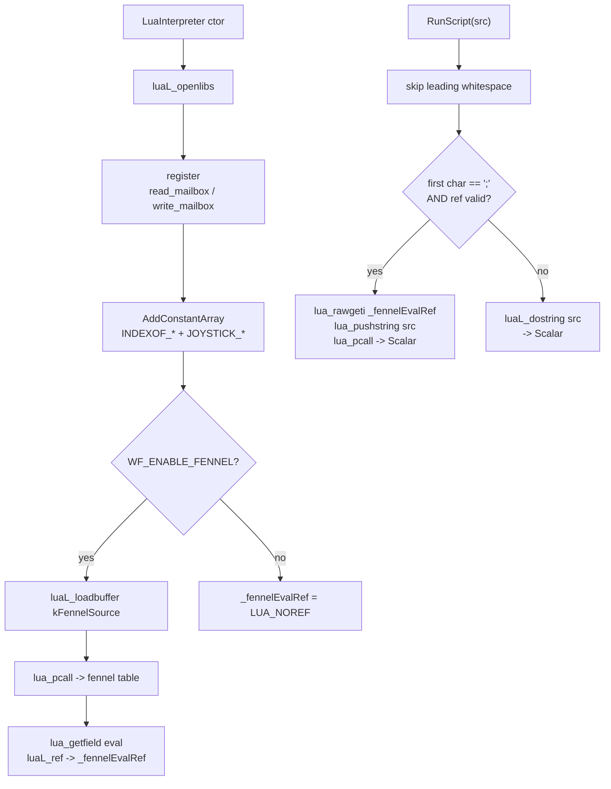

# Plan: Fennel on top of the Lua interpreter spike

**Date:** 2026-04-14
**Depends on:** `docs/plans/2026-04-13-lua-interpreter-spike.md` (landed)
**Source investigation:** `docs/investigations/2026-04-14-scripting-language-replacement.md:335-343`

## Context

The Lua interpreter spike has landed: `LuaInterpreter` in
`wftools/wf_viewer/stubs/scripting_stub.cc` replaced `NullInterpreter`,
snowgoons runs with hand-ported Lua player/director scripts byte-patched into
both `wflevels/snowgoons.iff` and `wfsource/source/game/cd.iff`, and
`-L<path>` loads a single level file directly.

The original investigation recommends a second layer: **Fennel** — a Lisp
that compiles to Lua — so power users get macros and the Scheme-ish feel of
the original WF era while Lua remains the default. Fennel ships as a single
~165 KB `fennel.lua` with zero native deps, so the integration cost is a
handful of lines in the interpreter plus one vendored file.

Goal: inside `wf_game`, scripts whose first non-whitespace byte is `;` are
compiled+executed through Fennel; all other scripts keep running as plain
Lua, unchanged. Verify by porting both snowgoons scripts (player + director)
to Fennel and confirming the engine behaves identically.

## Shape

WF targets environments without host filesystems (console/CD-era).
`fennel.lua` must therefore be baked into the engine binary, not loaded from
disk at runtime — and it's behind a **compile-time switch (`WF_ENABLE_FENNEL`,
default off)** so builds that don't want the ~100 KB cost or the Fennel
surface area get a pure-Lua engine with zero Fennel footprint.

When enabled: build-time codegen minifies `fennel.lua` (strips comments and
blank lines via a string-literal-aware Python pass), emits it as a C++ byte
array, and the interpreter calls `luaL_loadbuffer` on it at startup.
When disabled: no codegen, no member, no dispatch — `;`-prefixed scripts
fall through to the Lua path and fail as a Lua syntax error (visible in
logs, same as any malformed script).

### Build pipeline (when `WF_ENABLE_FENNEL=1`)



### Runtime dispatch inside `LuaInterpreter`



Dispatch is a one-byte sniff; `read_mailbox` / `write_mailbox` / `INDEXOF_*`
are registered once, visible to Fennel-compiled code and raw Lua alike.

The dispatch is a one-byte sniff — no language tag, no file extension.

## Scope

**In scope:**
- Vendor `fennel.lua` at `wftools/wf_viewer/stubs/fennel.lua`.
- `LuaInterpreter` loads `fennel.lua` at construction, stashes `fennel.eval`
  in the Lua registry, and routes `;`-prefixed scripts through it in
  `RunScript`.
- Port both snowgoons scripts (player + director) from Lua to Fennel.
- New patcher `scripts/patch_snowgoons_fennel.py` (Lua → Fennel, sibling to
  the existing TCL → Lua patcher; both kept for replay).
- Verify with `task run-level -- wflevels/snowgoons.iff` and `task run`.

**Out of scope:**
- Fennel macros / `import-macros`.
- `package.searchers` / Fennel `require`.
- `.fnl` → `.lua` build step.
- Removing Lua. Fennel is additive.

## Decisions

| Decision | Choice | Why |
|----------|--------|-----|
| Source fennel.lua | **Vendor in repo** (`wftools/wf_viewer/stubs/fennel.lua`) | Reproducible; single file; matches spike style |
| Detection | **Leading `;` = Fennel** | `;` is idiomatic Lisp comment AND a Lua syntax error — unambiguous |
| fennel.lua delivery | **Embedded in binary via codegen** (minify → `xxd -i` → `fennel_source.cc`, compiled + linked) | WF targets filesystem-less platforms; engine runtime belongs in the binary, not as external asset or IFF chunk |
| Compile-time switch | **`WF_ENABLE_FENNEL` (default off)** | Keeps default builds ~100 KB leaner and Fennel-free; opt-in for authors/targets that want it |
| Minification | **Strip `--` line + `--[[...]]` block comments, collapse blank lines; string-literal-aware** | ~40% size reduction with no runtime cost and no bytecode portability trap |
| Patcher | **New `patch_snowgoons_fennel.py`** (Lua → Fennel); Lua patcher untouched | Keep TCL→Lua replay intact |
| Demo port | **Both player and director** | Exercises Fennel end-to-end |
| Fennel director shape | **Per-mailbox transliteration (3 stanzas)** | Matches Lua structure; simpler padding |

## Implementation

### 1. Vendor fennel.lua
Fennel 1.6.1 `bootstrap/fennel.lua`, MIT. Copied to
`wftools/wf_viewer/stubs/fennel.lua`. Record version + SHA256 in
`docs/dev-setup.md`.

### 2. Codegen + minification in `build_game.sh`
Feature-gated on `WF_ENABLE_FENNEL` (env var, default `0`):

```bash
WF_ENABLE_FENNEL="${WF_ENABLE_FENNEL:-0}"
if [[ "$WF_ENABLE_FENNEL" == "1" ]]; then
  CXXFLAGS+=(-DWF_ENABLE_FENNEL)
  FENNEL_MIN="$OUT/fennel.min.lua"
  FENNEL_CC="$OUT/fennel_source.cc"
  python3 "$REPO_ROOT/scripts/minify_lua.py" "$STUB_SRC/fennel.lua" "$FENNEL_MIN"
  {
    echo '// AUTO-GENERATED from fennel.lua; do not edit'
    ( cd "$(dirname "$FENNEL_MIN")" && xxd -i "$(basename "$FENNEL_MIN")" ) |
      sed 's/^unsigned char fennel_min_lua\[\]/extern "C" const char kFennelSource[]/
           s/^unsigned int fennel_min_lua_len/extern "C" const unsigned int kFennelSourceLen/'
  } > "$FENNEL_CC"
  g++ "${CXXFLAGS[@]}" -c "$FENNEL_CC" -o "$OUT/fennel_source.o"
  OBJS+=("$OUT/fennel_source.o")
fi
```

When disabled (default): no codegen, no extra object, no `-D` flag — builds
stay Fennel-free with zero footprint.

### 2a. Minifier `scripts/minify_lua.py`
String-literal-aware single-pass: drops `--[[ ... ]]` (incl. `--[=[...]=]`)
long comments, `--` line comments, and collapses runs of blank lines.
Preserves all `"..."`, `'...'`, `[[...]]`, `[=[...]=]` string literals
byte-for-byte. Must also skip `--` that appears inside a long-bracket
string. Output should still be a valid Lua file.

### 3. Load Fennel in `LuaInterpreter` ctor (guarded)
Always add member `int _fennelEvalRef` (init `LUA_NOREF`) — cheap, avoids
`#ifdef` sprawl in the class definition. Only the load/dispatch code is
guarded:

```cpp
#ifdef WF_ENABLE_FENNEL
extern "C" const char kFennelSource[];
extern "C" const unsigned int kFennelSourceLen;
#endif
// ... in ctor, after AddConstantArray(joystickArray):
#ifdef WF_ENABLE_FENNEL
if (luaL_loadbuffer(_L, kFennelSource, kFennelSourceLen, "fennel.lua") != LUA_OK
    || lua_pcall(_L, 0, 1, 0) != LUA_OK) {
    std::fprintf(stderr, "fennel: load failed: %s\n", lua_tostring(_L, -1));
    lua_pop(_L, 1);
} else {
    lua_getfield(_L, -1, "eval");
    _fennelEvalRef = luaL_ref(_L, LUA_REGISTRYINDEX);
    lua_pop(_L, 1);
}
#endif
```

Non-fatal on failure; `;`-prefixed scripts fall through to the Lua path
(where they'll log a syntax error, same as any malformed Lua).

### 4. Sigil dispatch in `RunScript`
Before `luaL_dostring`, skip leading whitespace; if `*p == ';'` and
`_fennelEvalRef != LUA_NOREF`, `lua_rawgeti` the ref, push src, `lua_pcall`.

### 5. Port snowgoons scripts to Fennel
```fennel
;; snowgoons player
(write_mailbox INDEXOF_INPUT (read_mailbox INDEXOF_HARDWARE_JOYSTICK1_RAW))
```

```fennel
;; snowgoons director
(let [v (read_mailbox 100)] (when (not= v 0) (write_mailbox INDEXOF_CAMSHOT v)))
(let [v (read_mailbox 99)]  (when (not= v 0) (write_mailbox INDEXOF_CAMSHOT v)))
(let [v (read_mailbox 98)]  (when (not= v 0) (write_mailbox INDEXOF_CAMSHOT v)))
```

### 6. New patcher
`scripts/patch_snowgoons_fennel.py`: reuse `pad_to` + `main` from
`patch_snowgoons_lua.py`. Needles = padded Lua strings currently in the iff
(computed by padding the Lua replacements to the TCL needle lengths from the
Lua patcher). Replacements = Fennel strings above, padded to the same length
with trailing spaces (Fennel whitespace is benign).

### 7. Verify

**Default build (Fennel off):**
```bash
bash wftools/wf_engine/build_game.sh      # no fennel codegen
size wftools/wf_engine/wf_game            # baseline
```
- Binary size unchanged vs pre-patch baseline.
- No `fennel:` lines at startup.
- Lua scripts still work (existing snowgoons Lua patches).

**Fennel build:**
```bash
WF_ENABLE_FENNEL=1 bash wftools/wf_engine/build_game.sh
scripts/patch_snowgoons_fennel.py wflevels/snowgoons.iff
scripts/patch_snowgoons_fennel.py wfsource/source/game/cd.iff
task run-level -- wflevels/snowgoons.iff
task run
```
- `size wf_game` shows `.rodata` grew by ~100 KB (minified embedded Fennel).
- Player + director behave identically to the Lua-only build.
- `fennel error:` surfaces on deliberate syntax breakage.
- No filesystem path involved — run from any cwd.

## Critical files

- `wftools/wf_viewer/stubs/fennel.lua` — vendored (Fennel 1.6.1, MIT).
- `scripts/minify_lua.py` — **new**, string-literal-aware Lua minifier.
- `wftools/wf_engine/build_game.sh` — `WF_ENABLE_FENNEL` switch, minify +
  codegen + link; adds `-DWF_ENABLE_FENNEL` to `CXXFLAGS` when on.
- `wftools/wf_viewer/stubs/scripting_stub.cc` — `_fennelEvalRef` member
  (always), `#ifdef WF_ENABLE_FENNEL` guards around load + sigil dispatch.
- `scripts/patch_snowgoons_fennel.py` — new.
- `wflevels/snowgoons.iff`, `wfsource/source/game/cd.iff` — re-patched.
- `docs/dev-setup.md` — Fennel version + SHA note.

## Follow-ups

- Macros & `require` via `fennel.searcher` / `package.searchers`.
- `.fnl` files on disk once level build can emit Lua.
- Fennel REPL hook tying into the remote-step-debugger follow-up.
