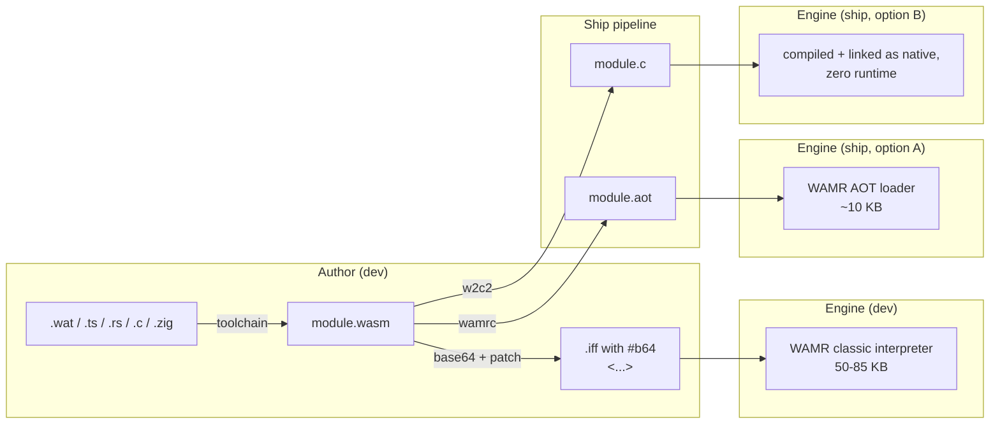

# Plan: WAMR for dev, AOT-only (or w2c2) for ship

**Date:** 2026-04-14
**Status:** **pending.** Targets the 2026-04-15 ScriptRouter convention:
the WAMR plug lives in a new `wftools/wf_viewer/stubs/scripting_wamr.{hp,cc}`
as a file-scope `wamr_engine` namespace (matching `lua_engine`'s shape),
exposing `Init / Shutdown / AddConstantArray / DeleteConstantArray /
RunScript`. Dispatch still goes through `ScriptRouter::RunScript`'s `#`
arm; `WF_WASM_ENGINE` picks which `<impl>_engine` gets called.
**Depends on:** wasm3 spike (landed in cfa739c) — proved the dispatch,
sigil, base64 wrapper, host-import ABI, and snowgoons-as-wasm end-to-end.
**Source investigation:** Conversation captured in the wasm3 spike thread;
`docs/plans/2026-04-14-wasm3-scripting-engine.md` §Follow-ups.

## Why this follow-up

The wasm3 spike is useful scaffolding but two things make it the wrong
shipping engine for WF:

1. **Size.** wasm3 at `-O2` adds ~136 KB stripped to `wf_game`. On a
   2 MB target (~4.5% of total RAM), that's load-bearing. Upstream's
   ~65 KB figure is for stripped Cortex-M builds — even tuned, the
   floor is ~60 KB, and most of it is `m3_compile.c`'s bytecode-to-
   threaded-op precompile pass, which we pay every time a script
   loads.
2. **Maintenance.** wasm3 upstream is in maintenance mode (last push
   2024-09); no AOT path; host-import globals aren't supported (spike
   had to drop the `import "consts" "INDEXOF_*"` plan); spec coverage
   beyond MVP is patchy.

**The design target that matters:** WF will eventually have
- a ship target where 90 KB of runtime is load-bearing (2 MB system, ROM
  cart), and
- a dev workflow where authors edit a `.wat`/`.ts`/`.rs` file and expect
  to see the result on the next level load without rebuilding the engine.

wasm3 covers neither well. This plan commits to the split.

## Shape

## Decisions

| Decision | Choice | Why |
|----------|--------|-----|
| Dev runtime | **WAMR classic interpreter** | Actively maintained (Bytecode Alliance), spec-complete, ~50-85 KB, AOT-compatible, same dispatch as wasm3 (drop-in) |
| Ship runtime | **WAMR AOT-only, with w2c2 as a stretch alternative** | AOT loader is ~10 KB, native speed, no interpreter in ship builds. w2c2 goes further (zero runtime) but commits to "scripts are build artifacts, no runtime load ever." Pick WAMR-AOT first because it preserves the `.wasm → .aot → load` lifecycle; re-evaluate w2c2 after WAMR-AOT ships |
| Dispatch | **Reuse `#b64\n` sigil, swap engine under `WF_WASM_ENGINE`** | No dispatch-layer changes; engines are plug-compatible. `WF_WASM_ENGINE=wamr\|wamr-aot\|w2c2`, keep `wasm3` as a historical choice, default stays `none` |
| Asset format (dev) | **Unchanged from wasm3 spike** — `#b64\n<base64-wasm>` in text chunk | Dev workflow identical across engines |
| Asset format (ship-AOT) | **`#aot\n<base64-aot>`** OR binary chunk with type tag | AOT output is target-specific (x86_64, arm64, etc.); ship pipeline picks per target. Prefer a real binary chunk type (`WSM ` / `AOT ` tags) once IFF format work lands; base64 is a spike shortcut |
| Asset format (ship-w2c2) | **N/A — transpiled to C at asset-build time, linked as a native symbol** | No asset-side representation; each module becomes `extern "C" int32_t script_<hash>(...)` in a generated TU |
| Host-import ABI | **Unchanged from wasm3** — `env.read_mailbox(i32) -> f32`, `env.write_mailbox(i32, f32)` | WAMR's `NativeSymbol` table and w2c2's generated host stubs both bind to the same signatures |
| Constant-globals (INDEXOF_*) | **Add it** — WAMR has proper host global imports, unlike wasm3 | Authors can `import "consts" "INDEXOF_INPUT" (global i32)` at instantiate time. wasm3 couldn't do this; WAMR can |
| Fuel / instruction metering | **Enable in dev, disable in ship-AOT** (or cheap counter-only in AOT) | Dev: catch infinite loops. Ship: AOT pays for metering at every instruction; disable unless a script actually needs it. Gate via `WF_WASM_METERING=1` |
| wasm3 retire | **Keep `WF_WASM_ENGINE=wasm3` until WAMR dev path is proven at parity** | Then retire (remove vendor tree + `scripting_wasm3.cc`). wasm3 was the spike; it's not load-bearing once WAMR is in |

## Implementation

### Phase 1: WAMR classic interpreter as a new `WF_WASM_ENGINE` value

1. **Vendor** `wftools/vendor/wamr-<version>/` (tarball, SHA256 in README).
   Use WAMR's minimal-profile config (disable WASI, multi-module, libc
   surface we don't need); keep classic interp only.
2. **`scripting_wamr.{hp,cc}`** — file-scope `wamr_engine` namespace,
   same five-function shape as `lua_engine` (`Init / Shutdown /
   AddConstantArray / DeleteConstantArray / RunScript`).
   `wamr_engine::RunScript` → `wasm_runtime_load` +
   `wasm_runtime_instantiate` + `wasm_runtime_lookup_function` +
   `wasm_runtime_call_wasm`. Host imports via `NativeSymbol` table built
   once at runtime init.
3. **Constant-globals import** — walk `mailboxIndexArray` + `joystickArray`
   at instantiate-time, register each as a host global. Authors can now
   write `import "consts" "INDEXOF_INPUT" (global i32)` instead of baking
   `3024`. Update `docs/scripting-languages.md` with the new author story.
4. **`build_game.sh`** — extend the `WF_WASM_ENGINE` switch to accept
   `wamr`. WAMR builds via its own CMake; add the invocation alongside
   JerryScript's (the JS plan's model).
5. **Re-patch snowgoons director WAT** to use the const imports, to
   demonstrate the surface improvement over wasm3.
6. **Verify:** selftest, director behavior, mixed-engine, and the
   wasm3-parity baseline (snowgoons runs identically under wasm3 and
   WAMR; host trace line-for-line matches).

### Phase 2: WAMR AOT-only as the ship path

1. **`wamrc` as an author-time tool.** Committed prebuilt binary per
   host (matches WABT precedent from the wasm3 spike) OR `task aot`
   that invokes it from a vendored WAMR tree. Each target ISA needs its
   own AOT module; keep per-target binaries under
   `wflevels/<level>/<script>.<target>.aot`.
2. **`WF_WASM_ENGINE=wamr-aot` build flavour.** Compiles WAMR's AOT
   runtime loader only — no interpreter TUs. ~10 KB footprint. Dispatch
   arm recognises a new subtype: `#aot\n<base64-aot>` (or, once binary
   chunks land, `AOT ` tag).
3. **Asset pipeline.** Extend `scripts/patch_snowgoons_wasm.py` (or a
   sibling `patch_snowgoons_aot.py`) to generate per-target AOT blobs at
   build time; the iff tooling picks the right one for the current
   target. For dev builds, `.wasm` still wins.
4. **Verify:** snowgoons under `WF_WASM_ENGINE=wamr-aot` runs identically;
   `size wf_game` delta drops from WAMR-interp's ~80 KB to ~10 KB.

### Phase 3 (stretch): w2c2 as a zero-runtime ship path

If WAMR-AOT's ~10 KB is still too big (or the AOT asset overhead matters
more than the runtime overhead), evaluate w2c2:

1. Transpile each `.wasm` to `.c` at asset-build time via `w2c2 module.wasm -o module.c`.
2. Link the generated `.c` into wf_game as native code. Call site is the
   generated symbol, not a runtime dispatch.
3. Host imports bind as normal C functions — the generated code already
   emits `extern` declarations.
4. Drop the `#b64\n` dispatch entirely in `wamr-aot`/`w2c2` builds; the
   "scripting engine" becomes a vtable of compiled-in functions keyed by
   script identity (hash? slot id? TBD).

Trade-off: loses runtime load. Scripts must be part of the build. This is
acceptable only if WF's authoring model is "levels are compiled assets,
not drop-in data."

## Verification (same schema as wasm3 spike)

1. **Default build (`WF_WASM_ENGINE=none`)** — unchanged; no wasm TUs
   compiled; size delta = 0.
2. **WAMR-interp build** — `size wf_game` shows ~60-85 KB text delta
   (versus wasm3's ~100 KB). Snowgoons director runs under the const-
   imports surface. Selftest OK.
3. **WAMR-AOT build** — AOT loader-only; ~10 KB text delta. Snowgoons
   director runs from a per-target `.aot` blob. Selftest-style proof
   of parse/load/call.
4. **Mixed engines** — player as Fennel, director as wasm (WAMR or AOT),
   Lua as fallthrough — all three dispatch off the leading byte.
5. **wasm3 ↔ WAMR parity** — identical trace lines for snowgoons
   director across both engines (proves the spec-level behaviour hasn't
   drifted).
6. **Size matrix** — publish a table in `docs/scripting-languages.md`:
   `none`, `wasm3`, `wamr`, `wamr-aot`, `w2c2`. Absolute stripped
   binary size per configuration.
7. **Measure and compare all options under consideration.** Produce one
   authoritative table that lets us pick the ship engine on numbers, not
   vibes. For every `WF_WASM_ENGINE` value (`none`, `wasm3`, `wamr`,
   `wamr-aot`, `w2c2`), measure:
   - **Per-.o text/data/bss** — sum across the runtime's own TUs only
     (exclude our plug + selftest, report those separately). Use `size`
     on each `.o`; this is the "what did the runtime cost by itself"
     number. Do it at `-O2` both with and without `-g`, so the number
     that matters for ship is visible next to the dev build's inflated
     number.
   - **Whole-binary stripped delta** vs `WF_WASM_ENGINE=none` — the
     honest "what does shipping this cost" figure. `strip wf_game`, diff
     filesystem size.
   - **RAM footprint, static** — runtime globals + any preallocated
     arenas the engine grabs at init. For wasm3 it's the IM3Environment
     + IM3Runtime struct + the stack we request (64 KB today); capture
     via RSS delta before/after `Wasm*RuntimeInit`.
   - **RAM footprint, per-module** — what it costs to load the snowgoons
     director. Parse + compile + instantiate. For wasm3 today that
     includes the bytes buffer we deliberately leak; quantify it. Same
     measurement under WAMR-interp and WAMR-AOT. For w2c2, the per-module
     cost is zero at runtime (it's baked into `.text`).
   - **RAM footprint, peak during call** — stack high-water for one
     `main()` invocation on the snowgoons director. Useful for the 2 MB
     target's headroom math.
   Publish as a single table in `docs/scripting-languages.md`, with the
   measurement methodology in a footnote so future engines can land
   next to the same numbers. All measurements at `-O2` on x86_64 Linux
   and (if the cross-toolchain is ready) a representative 32-bit ARM
   target.

## Follow-ups (out of scope for this plan)

- **Binary IFF chunk types** — `WSM ` and `AOT ` tag types with explicit
  length prefix; drop base64 for ~33% asset shrink. Covered in the wasm3
  plan's follow-ups; inherits here.
- **Per-target AOT cache** — build pipeline emits `script.<target>.aot`
  for every supported ISA, iff loader picks the right one.
- **Script metering** — `WF_WASM_METERING` wires WAMR's per-instruction
  hook to cap hot-loop scripts.
- **wasm GC proposal** — only relevant if AssemblyScript's
  `--runtime incremental` becomes desirable. Neither WAMR-classic nor
  wasm3 supports it today; wait for WAMR to add it upstream.
- **Retire wasm3** — once WAMR ships at parity, remove
  `wftools/vendor/wasm3-v0.5.0/`, `scripting_wasm3.{hp,cc}`, and the
  `wasm3` arm of `WF_WASM_ENGINE`. Commit the removal in one change so
  history stays clean.

## Open questions

- **Is w2c2 actually needed?** If WAMR-AOT is ~10 KB and delivers native
  speed, what does w2c2 add? Probably only the "don't ship a runtime at
  all" story. If that's not a real target constraint, skip Phase 3 and
  call it done after WAMR-AOT.
- **Per-target AOT or fat asset?** Do we ship one iff with `.aot` blobs
  for every target, or per-target iffs? Depends on the distribution
  model; can't answer until ship targets are concrete.
- **Does the const-globals surface actually improve authoring enough to
  justify redoing snowgoons WAT?** Baking `3024` works today. The win
  is consistency with the other engines (every script refers to
  `INDEXOF_INPUT`, not a magic number). Worth it, but not load-bearing.
