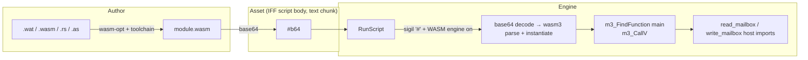
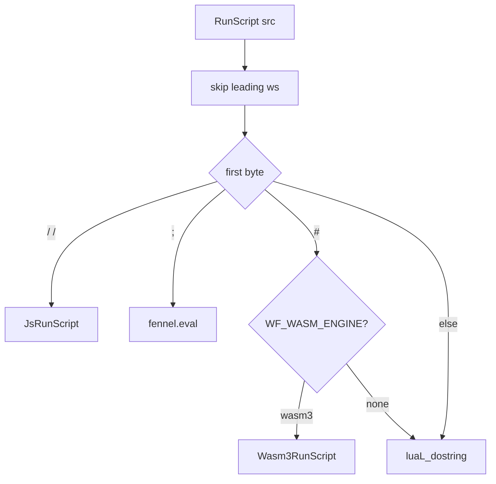

# Plan: WebAssembly (wasm3) as a third scripting engine

**Date:** 2026-04-14
**Status:** **landed 2026-04-14** (commit `cfa739c`, "wasm3 scripting
engine: base64-wrapped modules on the #b64 sigil"). Retargeted onto the
ScriptRouter convention on 2026-04-15: the `#b64\n` dispatch arm now
lives in `ScriptRouter::RunScript` in
`wftools/wf_viewer/stubs/scripting_stub.cc`, not in `LuaInterpreter`. The
plug is being renamed from the free-function `Wasm3RuntimeInit /
Wasm3RunScript / Wasm3AddConstantArray / Wasm3RuntimeShutdown` shape
into a `wasm3_engine` namespace (`Init / RunScript / AddConstantArray /
DeleteConstantArray / Shutdown`) as part of the
`docs/plans/2026-04-15-scripting-plans-align-scriptrouter.md` sweep, so
every compiled-in engine has the same five-function shape as `lua_engine`.
**Depends on:** Lua spike (landed); Fennel plan (landed/in-flight);
JS engines plan (`docs/plans/2026-04-14-pluggable-scripting-engine.md`,
which reserved sigil `#` for WebAssembly).
**Source investigation:** `docs/investigations/2026-04-14-scripting-language-replacement.md`
§ Tier 7 (WebAssembly).

## Context

WF supports a menu of independent, compile-time-selected scripting engines:
Lua (sigil-less fallthrough when compiled in), Fennel (`;`, requires Lua),
and optionally one of {QuickJS, JerryScript} (`//`). Each is its own opt-in;
a build can ship any subset, including engine-only builds with no Lua at
all. Adding **WebAssembly** completes the first horizontal slice of the
plan because it unlocks source languages the other engines can't host:
AssemblyScript, Rust, C, and Zig, all producing binary modules that share
the same `read_mailbox` / `write_mailbox` bridge every other engine
already uses. Like the JS engines, wasm3 is independent of Lua — a
wasm3-only build with no Lua TUs compiled is a supported configuration.

**Decided runtime: wasm3.** Small (~65 KB code), MIT, pure-C interpreter
(no JIT), mature enough for a spike, zero platform assumptions. Matches the
project's CD/console-era targeting ethos better than a JIT-heavy runtime.

**Runtime selection stays pluggable** — same shape as `WF_JS_ENGINE`. A
future `WF_WASM_ENGINE=wamr` or `wamr-aot` swaps implementations without
touching the dispatch. Only one wasm runtime compiled in at a time (same
rule as the JS plan: multiple JS engines at once is forbidden; sigil is
shared).

## Shape





## Decisions

| Decision | Choice | Why |
|----------|--------|-----|
| Runtime | **wasm3 v0.5.0** (MIT, ~65 KB) | Smallest viable embeddable interpreter; pure C; matches filesystem-less targets; upstream still alive (last push 2024-09) |
| Compile switch | **`WF_WASM_ENGINE=none\|wasm3`** (default `none`) | Mirrors `WF_JS_ENGINE`; same validation pattern; enum leaves room for `wamr`, `wamr-aot` |
| Sigil | **`#`** | Already reserved in the JS plan; Lua syntax error at statement position (when Lua is compiled in); distinct from `;`, `//` |
| Script storage | **Base64-wrapped in existing text chunks** (`#b64\n<base64>`) | Wasm is binary with embedded NULs; IFF script chunks are null-terminated text today. Base64 adds ~33% bytes but requires **zero** IFF format changes, zero `RunScript` signature changes. Proper binary-chunk storage is a follow-up |
| Alternate sigil `#!wat` | **deferred** | Would let authors ship `.wat` text and compile in-engine via a wat→wasm step. wasm3 has no wat frontend; would need a wabt vendor. Not worth the weight for the spike |
| Imports ABI | **`env.read_mailbox(i32) -> f32`, `env.write_mailbox(i32 mailbox, f32 value)`** | Same surface as Lua/Fennel/JS. `int` mailbox id + `f32` value matches the existing `Scalar::FromFloat` path. Actor context threaded via a module-local global (see §3) |
| Spike payload | **Embedded test module + one hand-ported snowgoons script** | Proves the loader + host imports work end-to-end against a known-good mailbox trace |

## Implementation

### 1. Vendor wasm3

```
wftools/vendor/wasm3-v0.5.0/
    source/
        m3_api_libc.c    m3_api_meta_wasi.c  m3_api_tracer.c
        m3_api_uvwasi.c  m3_api_wasi.c       m3_bind.c
        m3_code.c        m3_compile.c        m3_core.c
        m3_env.c         m3_exec.c           m3_function.c
        m3_info.c        m3_module.c         m3_parse.c
        wasm3.h          m3_*.h ...
    LICENSE  (MIT)
```

Upstream tarball is `https://github.com/wasm3/wasm3/archive/refs/tags/v0.5.0.tar.gz`.
Record version + SHA256 in `wftools/vendor/README.md` (same file the JS
plan and Fennel plan append to).

### 2. Build switch in `build_game.sh`

Add next to `WF_JS_ENGINE`:

```bash
# Feature flag: optional WebAssembly engine for the `#` sigil. One of:
#   none    (default) — no wasm compiled in, zero binary delta vs. today.
#   wasm3   — wasm3 v0.5.0 (~65 KB), pure-C interpreter, MIT.
# Future: wamr, wamr-aot. Only one wasm runtime at a time; sigil is shared.
WF_WASM_ENGINE="${WF_WASM_ENGINE:-none}"
case "$WF_WASM_ENGINE" in
    none|wasm3) ;;
    *) echo "error: WF_WASM_ENGINE must be one of: none, wasm3 (got: '$WF_WASM_ENGINE')" >&2
       exit 2 ;;
esac
WASM3_DIR="$VENDOR/wasm3-v0.5.0"
```

Conditional compile block, matching the JS engine pattern:

```bash
case "$WF_WASM_ENGINE" in
    wasm3)
        CXXFLAGS+=(-DWF_WASM_ENGINE_WASM3 -I"$WASM3_DIR/source")
        echo "  CC (stub) scripting_wasm3.cc"
        g++ "${CXXFLAGS[@]}" -c "$STUB_SRC/scripting_wasm3.cc" -o "$OUT/stubs__scripting_wasm3.o"
        OBJS+=("$OUT/stubs__scripting_wasm3.o")
        # wasm3 core (C, -O2 keeps the interpreter tolerable; warnings silenced).
        M3_CFLAGS=(-std=gnu11 -O2 -w -fno-strict-aliasing
                   -Dd_m3HasWASI=0 -Dd_m3HasMetaWASI=0 -Dd_m3HasTracer=0
                   -Dd_m3HasUVWASI=0 -I"$WASM3_DIR/source")
        for c in m3_api_libc.c m3_bind.c m3_code.c m3_compile.c \
                 m3_core.c m3_env.c m3_exec.c m3_function.c \
                 m3_info.c m3_module.c m3_parse.c; do
            obj="$OUT/m3__${c%.c}.o"
            echo "  CC (vendor) wasm3/$c"
            gcc "${M3_CFLAGS[@]}" -c "$WASM3_DIR/source/$c" -o "$obj"
            OBJS+=("$obj")
        done
        ;;
    none) : ;;
esac
```

WASI/tracer/UVWASI are compiled out via `-Dd_m3Has*=0` — we don't want the
filesystem or syscall surface.

### 3. `scripting_wasm3.cc` implementation

Single translation unit, compiled only when the switch is on. Exposes:

```cpp
// Called from the engine's scripting-runtime lifecycle (same seams that
// bring up Lua / JS when those are compiled in).
void   Wasm3RuntimeInit(MailboxesManager& mgr);
void   Wasm3RuntimeShutdown();

// Called from the dispatch layer when sigil == '#'. The dispatch layer
// today lives inline in scripting_stub.cc::LuaInterpreter::RunScript; it
// will move out when the sigil-table refactor lands (see JS plan §3).
// wasm3 does not depend on Lua being compiled in — the hook is on the
// dispatcher, not on Lua.
Scalar Wasm3RunScript(const char* src, int objectIndex);
```

Inside:

- **Runtime init** creates one `IM3Environment` and one `IM3Runtime`
  (64 KB stack is plenty for gameplay scripts). Stores `MailboxesManager*`
  and the current `objectIndex` in TU-local statics that the host import
  thunks read.
- **Host imports**: `m3_LinkRawFunction(module, "env", "read_mailbox",
  "f(i)", &hi_read_mailbox)` and similarly for `write_mailbox`. Function
  signatures follow wasm3's type-string convention (`f(i)` = returns float,
  takes one int, etc.). Thunks marshal to `ReadMailbox` /
  `WriteMailbox(Scalar::FromFloat(...))` via the stored manager +
  objectIndex.
- **Constant globals**: wasm doesn't see the engine's `INDEXOF_*` /
  `JOYSTICK_BUTTON_*` tables automatically. (These tables feed every
  compiled-in engine from `mailbox/mailbox.inc` + `scripting_stub.cc`'s
  joystick array — they're not Lua-specific.) Options, simplest first:
    - (a) Author-side: modules `import "consts" "INDEXOF_INPUT"` and we
      `m3_LinkGlobal` each constant at instantiate time.
    - (b) Generate a `.wasm` header module with the constants baked as
      exported globals, link it in, and have gameplay modules `import`
      from it.
    - **Choose (a)** for the spike; it matches how the other engines
      consume the existing `mailboxIndexArray` table. Code generation
      is straightforward: walk the same arrays every engine's
      constant-registration path already walks.
- **Per-script lifecycle**:
    1. Strip the `#` sigil + optional `b64\n` prefix from the input.
    2. Base64-decode into a stack-or-heap buffer (cap at, say, 256 KB for
       a single level-script body; most should be <10 KB).
    3. `m3_ParseModule` → `m3_LoadModule` → link host imports and
       constant-globals → `m3_FindFunction(&f, runtime, "main")` →
       `m3_CallV(f)`.
    4. Return the `i32`/`f32` result as `Scalar::FromFloat`. No result =
       return `Scalar::FromFloat(0.0f)`.
    5. **Do not free the module** if we want hot-loop scripts to be cheap.
       First-call caches by source pointer identity; subsequent calls with
       the same pointer reuse the compiled module. (This is a perf
       follow-up; spike can parse+compile per call and rely on wasm3's
       speed.)

### 4. Dispatch registration

Add the `#` arm in `scripting_stub.cc`, next to the `;` (Fennel) and `//`
(JS) branches. The existing shape:

```cpp
#ifdef WF_WASM_ENGINE_WASM3
{
    const char* p = src;
    while (*p == ' ' || *p == '\t' || *p == '\r' || *p == '\n') p++;
    if (*p == '#') {
        return Wasm3RunScript(src, objectIndex);
    }
}
#endif
```

Also: extend the compile-time sigil table the JS plan described
(`scripting_dispatch.hp` / `dispatch_table.inc`) with a `LANG_HANDLER("#",
Wasm3RunScript)` row under the `WF_WASM_ENGINE_WASM3` guard when that
registry is in place. Until it is, the inline `#ifdef` stays.

### 5. Spike payload: one embedded test module + one snowgoons port

**5a. Self-test module** — part of the wasm3 build's smoke test. Ship a
tiny `.wasm` embedded via the same codegen pattern as `fennel.lua` (minify
→ `xxd -i` into `$OUT/wasm_selftest.cc`). Contents: a function that calls
`write_mailbox(0, 42); return read_mailbox(0)`. Runtime init runs it once
at startup when `WF_WASM_DEBUG=1`; stdout logs
`wasm3: selftest mailbox r/w OK`.

Source for the selftest — hand-written `.wat` checked into
`wftools/vendor/wasm3-v0.5.0-wf/selftest.wat` and compiled via `wat2wasm`
(from wabt) at spike-author time; the committed binary is the
`selftest.wasm` that `xxd -i` produces. wabt is NOT linked into wf_game —
it's only on the developer's path to regenerate the asset.

**5b. Snowgoons port** — port **both** the player and the director to
AssemblyScript, so the docs can show wasm examples for every script in
the level (matching the Lua + Fennel coverage):

```typescript
// snowgoons player (AssemblyScript)
import { read_mailbox, write_mailbox, INDEXOF_INPUT,
         INDEXOF_HARDWARE_JOYSTICK1_RAW } from "env";

export function main(): void {
    write_mailbox(INDEXOF_INPUT, read_mailbox(INDEXOF_HARDWARE_JOYSTICK1_RAW));
}
```

```typescript
// snowgoons director (AssemblyScript)
import { read_mailbox, write_mailbox, INDEXOF_CAMSHOT } from "env";

export function main(): void {
    for (const m of [100, 99, 98]) {
        const v = read_mailbox(m);
        if (v != 0.0) write_mailbox(INDEXOF_CAMSHOT, v);
    }
}
```

Compile with `asc <script>.ts -O3 --runtime stub -o <script>.wasm`;
base64 each and byte-pad into `wflevels/snowgoons.iff` +
`wfsource/source/game/cd.iff` via a new `scripts/patch_snowgoons_wasm.py`
(reuses `pad_to` from the Lua patcher, same invariant).

Budget check: player has 77 B room (tight — matches Fennel); director has
~440 B. AssemblyScript + `--runtime stub` + `-O3` emits ~150 B for the
player and ~200 B for the director, which base64 to ~200 B and ~270 B
respectively. Player fit is close — if the player doesn't fit, fall back
to hand-written `.wat` (smaller than AssemblyScript's output) for the
player only, keep AssemblyScript for the director.

### 5c. Update `docs/scripting-languages.md`

Extend the existing Lua+Fennel side-by-side sections with the
AssemblyScript-source + wasm-binary story for each snowgoons script.
The doc's table gains concrete wasm3 numbers (sigil, size, status =
shipping). Structure mirrors the existing sections:

- **Player** section: add an "AssemblyScript" subsection with the source
  from 5b above, then a one-line note that the binary form stored in the
  iff is `#b64\n<base64>` (show the first ~20 chars for flavor).
- **Director** section: same pattern.
- **Integration surface** section: flip the wasm row from "planned" to
  "shipping"; fill in the runtime cell (`wasm3 v0.5.0`), the switch
  (`WF_WASM_ENGINE=wasm3`), and the binary cost (~65 KB core + per-module
  overhead).
- **Notes for future languages** section: add a bullet about the binary
  wrapper strategy (base64-in-text today, proper binary chunk as
  follow-up), so the wasm precedent is explicit for anyone adding a
  second binary-module language (JVM bytecode? Shockwave? No — but the
  pattern lives here regardless).

The doc update is part of this plan's deliverable; don't let it drift to
a follow-up.

### 6. No-filesystem rule

All of this is memory-only. wasm3 does not touch a filesystem. The
selftest wasm is in `.rodata`. Level-script wasm is in the existing IFF
text chunks (base64 encoded). No `fopen`, no `dlopen`, no platform-specific
wasm cache. Zero delta to CD/console portability.

## Verification

1. **Default build (`WF_WASM_ENGINE=none`)** — unchanged from today; no
   wasm TUs compiled, no link deps. `size wf_game` delta = 0.
2. **wasm3 build (`WF_WASM_ENGINE=wasm3`)** — links clean.
   - `size wf_game` shows `.text`/`.rodata` grew by ~70–80 KB (wasm3
     core + selftest module).
   - Startup in `WF_WASM_DEBUG=1` prints
     `wasm3: selftest mailbox r/w OK`.
3. **Snowgoons wasm director** — patch `wflevels/snowgoons.iff` with the
   base64 director wasm, run `task run-level -- wflevels/snowgoons.iff`,
   confirm camshot switches on mailboxes 100/99/98 (mirrors the Lua /
   Fennel director verification).
4. **Error path** — hand-corrupt the base64 (single bit-flip); engine
   logs `wasm3: parse failed: <reason>` and keeps running. Matches
   Fennel's non-fatal-failure stance.
5. **Mixed engines in one level** — player as Fennel, director as wasm3,
   Lua as fallthrough for any unsigilled scripts. All three dispatch
   correctly off the sigil.
6. **wasm3-only build** — `WF_ENABLE_LUA=0 WF_ENABLE_FENNEL=0
   WF_JS_ENGINE=none WF_WASM_ENGINE=wasm3 bash build_game.sh` links
   clean; no Lua or JS TUs compiled, no Lua link deps. Snowgoons with all
   scripts authored as wasm runs identically to the mixed build. Proves
   wasm3 is a genuinely independent engine, not a Lua plugin.
7. **Compatibility** — run the existing Lua + Fennel verification steps
   on the wasm3-enabled + Lua-on build to confirm we haven't regressed
   those paths.

## Critical files

Modify:
- `wftools/wf_engine/build_game.sh` — add `WF_WASM_ENGINE` switch,
  conditional compile/link of `scripting_wasm3.cc` + wasm3 vendor TUs.
- `wftools/wf_viewer/stubs/scripting_stub.cc` — add `#`-sigil dispatch arm
  (or the `LANG_HANDLER("#", Wasm3RunScript)` row if the sigil registry
  from the JS plan has landed).

Create:
- `wftools/vendor/wasm3-v0.5.0/` — vendored upstream.
- `wftools/vendor/wasm3-v0.5.0-wf/selftest.wat` — handwritten selftest
  source.
- `wftools/vendor/wasm3-v0.5.0-wf/selftest.wasm` — compiled selftest (build
  artifact, but checked in so wf_game builds don't need wabt).
- `wftools/wf_viewer/stubs/scripting_wasm3.cc` — the plugin.
- `wftools/wf_viewer/stubs/scripting_wasm3.hp` — externs for
  `Wasm3RunScript` / `Wasm3RuntimeInit` / `Wasm3RuntimeShutdown`.
- `scripts/patch_snowgoons_wasm.py` — Lua→wasm (base64) patcher, reuses
  `pad_to` from `patch_snowgoons_lua.py`.
- `wflevels/snowgoons/director.ts` — AssemblyScript source for the demo
  (reproducible rebuild via `asc`; committed `.wasm` is the ground truth).

Reuse:
- `MailboxesManager` — unchanged.
- `mailboxIndexArray` / `joystickArray` — walked once more to produce wasm
  imports (same globals, different binding mechanism).
- `scripts/patch_snowgoons_lua.py::pad_to` — already exported via the
  Fennel patcher; share it.

Update:
- `docs/scripting-languages.md` — per §5c: add AssemblyScript source +
  base64 preview for both snowgoons scripts (player + director), flip
  wasm's table row from "planned" to "shipping" with concrete numbers,
  note the `#` sigil and the `#b64\n` text wrapper.

## Follow-ups (out of scope for this spike)

- **Module cache** — hash source pointer + size, reuse compiled modules
  across `RunScript` calls. Necessary before wasm shows up in hot-loop
  scripts; not necessary for the spike.
- **Binary IFF chunk type** — add a real binary-safe script chunk tag
  (e.g. `WSM ` alongside `SHEL`) with explicit length, drop the base64
  wrapper. The right long-term answer; base64 is a spike shortcut.
- **`WF_WASM_ENGINE=wamr`** — Bytecode Alliance runtime; ~50–85 KB
  interpreter, adds AOT (`wamrc`) for shipping. Same dispatch, same
  imports, different TUs + link deps. Mirrors how QuickJS/JerryScript
  both live behind `WF_JS_ENGINE`.
- **`WF_WASM_ENGINE=wamr-aot`** — precompile `.wasm` to native (AOT) at
  build time; drop the interpreter entirely from shipping builds. Biggest
  perf win available to wasm, but requires a target-aware build step.
- **Fuel / instruction metering** — cap script CPU via wasm3's
  `m3_SetExecTime` or equivalent, so a runaway script can't hang a frame.
- **`.wat` toolchain integration** — ship a `task wat` that invokes
  `wat2wasm` + base64 + patcher so authoring loops don't require manual
  pipeline steps.
- **Typed accessors** — `read_actor` / `read_fixed` / `read_color`
  surface, shared across all engines per the cross-language parity TODO
  in the JS plan.

## Open question

- **Should `#` stay the sigil, or would `#!wasm\n` be clearer?** `#` alone
  is one byte and unambiguous in Lua. `#!wasm\n` is self-documenting and
  leaves room for `#!wat\n` / `#!b64\n` subtypes later. The `#!` shebang
  idiom is familiar. Tentatively: keep `#` as the discriminator byte,
  treat whatever follows up to the first `\n` as the *subtype*
  (`#b64\n...`, `#wat\n...` in a future plan). That way the dispatch
  cost stays one-byte and the format tag is per-module, inside the same
  sigil family.
