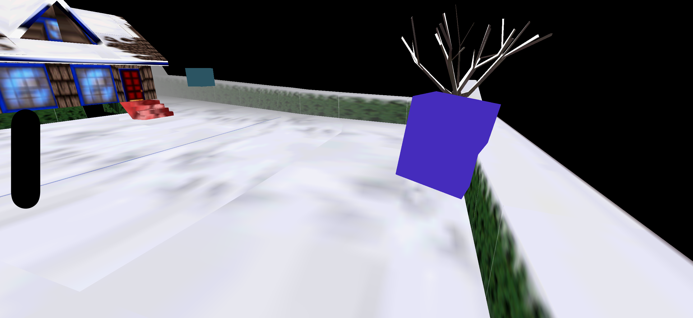

# Plan: iOS port (via Codemagic)

**Date:** 2026-04-21 (revises the 2026-04-16 doc — prior version parked the port as "blocked on lack of a Mac")
**Status:** Phase 2D steps 1+2 verified — snowgoons renders correctly on iOS (2026-04-22). Step 1 (textures): PixelMap→MTLTexture upload via root-walker accessors (`GetRoot()` + `GetRootPixelBuffer()`), per-root cache keyed on `const PixelMap*`, `MTLSamplerState` matching GL's linear/repeat under GFX_ZBUFFER, 1×1 white fallback so `[[texture(0)]]` is always bound, MSL fragment samples when `u.use_tex != 0`. Step 2 (z-buffer): the original cpu=12-tris-flat screenshot was a z-sort artifact, not camera/frustum — the render pass had no depth attachment so draws overwrote each other in submission order. Added `Depth32Float` MTLTexture (allocated to drawable size in `WFIosRenderBegin`, reused across frames, reallocated on size change), `MTLDepthStencilState` (LessEqual + writes enabled), `depthAttachmentPixelFormat` in the pipeline state. Also fixed `Mat4Perspective` to produce Metal-style NDC.z ∈ [0, 1] instead of the GL-style [-1, 1] (otherwise near-plane triangles have negative z and get clipped). Sim-verify screenshot now shows log cabin with snowy roof + blue windows, tree properly occluded by hedge, snowgoon/player character visible in center, snowy ground at correct depth relative to cabin — full snowgoons scene rendered on iPhone 17 Pro Simulator. Phase 2D step 3: lockstep render parity diff vs. Linux to catch any remaining per-vertex / shader / state differences. Phase 3 queued: touch input + on-screen HUD.
**Goal:** An arm64 IPA that runs snowgoons on a physical iPhone, installed via TestFlight (or ad-hoc), with Codemagic as the only Mac in the loop. Proof-of-viability, not a shipping product.

## Context

The original plan was shelved because Xcode + code signing + device provisioning all require macOS and this workstation is Linux-only. That blocker is now lifted: the user has a Codemagic individual plan (500 build-min/month) — cloud Mac mini runners with Xcode pre-installed, CMake support, and turnkey signing automation. Android precedent closed 2026-04-18 so the shared foundation — CMake build, `hal/android/`, `AssetAccessor`, modern VBO/shader `RendererBackend`, **Forth-only scripting** — is stable and ready to parallel. Mobile builds ship zForth as the sole scripting engine (Android's `if(ANDROID)` block in `CMakeLists.txt:26-35` disables Lua / JS / WAMR / Wren / Steam / REST API); iOS mirrors that policy. zForth is the in-level `{ Script }` engine per the `scripts-in-forth` convention anyway, so the other engines aren't load-bearing for snowgoons.

Two constraints change how the phases stage:

- **No Apple Developer Program account yet** — user will pay the $99/yr when there's something worth signing. Everything that doesn't need signing (Simulator builds, Metal backend work, touch shim) runs first. The $99 spend is gated to Phase 4.
- **No personal iPhone** — a collaborator has one. On-device verification goes through TestFlight (no per-device UDID wrangling) rather than ad-hoc install.

## Codemagic-specific implications vs. the original plan

- **No interactive Xcode / Instruments.** Runtime debug falls back to on-device log files (same pattern as Android's on-device `wf.log` — see commit history). GPU frame capture is deferred or handled out-of-band on the collaborator's Mac if available.
- **Build path is `git push` → `codemagic.yaml` → artifact.** The repo grows a `codemagic.yaml` at root describing the build workflow; no local Xcode invocation.
- **Codemagic M-series Mac minis run arm64 Simulator natively** — Simulator architecture matches device, so Metal shader behavior is a realistic preview.
- **Mind the Mac build minutes, but don't starve the bring-up.** Expect ~15–25 min for a clean CMake + Xcode build; 500 min/month ≈ 20–30 builds. It's a delicate balance: during Phases 0–2, expect to push per step — each Codemagic run is the only way to see what the Mac toolchain rejects, and skipping steps wastes more minutes than it saves. Once the pipeline is reliably green, batch commits before pushing.

## Correction to the original plan's graphics options

The 2026-04-16 doc proposed "GLES via MoltenVK" as a graphics option. MoltenVK is **Vulkan → Metal**, not GL → Metal — WF uses GLES 3.0, not Vulkan, so MoltenVK doesn't apply directly. The real options are:

- **Native Metal** (recommended) — write a `backend_metal.cc` alongside `wfsource/source/gfx/glpipeline/backend_modern.cc` implementing the `RendererBackend` interface (`wfsource/source/gfx/renderer_backend.hp:26-80`). WF's shader surface is tiny (per-vertex phong + fog, see embedded GLSL in `backend_modern.cc:58-116`). MSL port is tractable.
- **ANGLE (GL→Metal translation layer)** as fallback — Google's ANGLE ships an iOS Metal backend and could consume the existing GLSL ES shaders unchanged. Bigger runtime dependency, extra build complexity on Codemagic, but zero shader port work. Hold in reserve if Metal shader porting hits a wall.

Recommendation: native Metal. The fallback exists only if MSL translation becomes a time sink.

## Phases

### Phase 0 — Codemagic project bootstrap (no signing)

> Project + webhook wiring steps live in [codemagic-setup.md](../codemagic-setup.md) — do that once on the Codemagic/GitHub side before pushing anything here.

1. Add `codemagic.yaml` at repo root — Xcode workflow, M-series Mac mini runner, triggers on the `2026-ios` branch (new).
2. Workflow runs `cmake -G Xcode -DCMAKE_SYSTEM_NAME=iOS -DCMAKE_OSX_ARCHITECTURES=arm64 -DCMAKE_OSX_SYSROOT=iphonesimulator ...` and `xcodebuild -configuration Debug`. Initially *nothing compiles* — Phase 0 just proves the Mac runner reaches the CMake error.
3. Cut `2026-ios` branch from `2026-android` (master is badly out of date; 2026-android is where the Android port, textile-rs, levcomp-rs, and Blender round-trip work actually lives). Push; confirm Codemagic picks it up; watch the first build log.
4. **Verify:** Codemagic run lands on a CMake error mentioning the missing `hal/ios/` target (i.e. the pipeline works end-to-end even though the code doesn't).

### Phase 1 — iOS HAL skeleton + Simulator "hello, viewcontroller" (no signing)

1. Add `wfsource/source/hal/ios/` mirroring `wfsource/source/hal/android/`:
   - `asset_accessor_nsbundle.mm` — implements `AssetAccessor` (`wfsource/source/hal/asset_accessor.hp:41-60`) against `[NSBundle mainBundle]`. Android reference: `hal/android/asset_accessor_aasset.cc`.
   - `platform.mm` — malloc init, surface-size notification (parallel to `hal/android/platform.cc`).
   - `lifecycle.mm` — `HALNotifySuspend` / `HALNotifyResume` hooks driven from `UIViewController` callbacks (parallel to `hal/android/lifecycle.cc`).
   - `audio.mm` — `SoundDevice` + `MusicPlayer` init; miniaudio auto-detects CoreAudio (parallel to `hal/android/audio.cc`).
   - `input.mm` — stub; wired in Phase 3.
   - `native_app_entry.mm` — `UIApplicationMain` + root `UIViewController`, no Metal yet.
2. Extend root `CMakeLists.txt` — add `elseif(IOS)` branch parallel to the existing `if(ANDROID)` (lines 26–35, 51–57, 66–86, 372–379, 413–424). Mirror the Android scripting policy: **Forth-only** (Lua / JS / WAMR / Wren / Steam / REST API all off). Link `Foundation`, `UIKit`, `QuartzCore`, `Metal`, `MetalKit`.
3. Add `ios/` sibling of `android/` — thin Xcode wrapper: `Info.plist`, launch storyboard, `AppDelegate.swift` (or Obj-C — match whichever Apple template Codemagic's cmake iOS toolchain produces most cleanly). Bundle `cd.iff` + `level0.mid` + `florestan-subset.sf2` via Xcode copy-files phase (same assets as `android/app/src/main/assets/`).
4. **Verify:** Codemagic produces a `.app` that launches in iOS Simulator, comes up to a black `UIViewController`, doesn't crash on `HALGetAssetAccessor()`. Confirmed by log-to-file + build-artifact inspection; no visual verification needed yet.

### Phase 2 — Native Metal backend, snowgoons rendering in Simulator (no signing)

1. `wfsource/source/gfx/glpipeline/backend_metal.mm` — new backend implementing `RendererBackend` (vtable defined in `wfsource/source/gfx/renderer_backend.hp`). Match the shape of `backend_modern.cc` method-for-method.
2. Port the two embedded GLSL shaders (`backend_modern.cc:58-98` vertex, `100-116` fragment) to Metal Shading Language. Single `.metal` file; compile via Xcode build phase (Codemagic-native).
3. `CAMetalLayer` attached to the root `UIViewController`'s view. Drive frame submission from `CADisplayLink`.
4. Carve the windowing seam. `wfsource/source/gfx/gl/mesa.cc` is X11+GLX-coupled; iOS gets its own entry point in `hal/ios/` rather than ifdef'ing `mesa.cc`. Linux stays on `mesa.cc` unchanged. Interface: "HAL hands the renderer a drawable surface + dimensions."
5. Reuse the snowgoons level-load path as-is — it shouldn't know or care which backend is rendering.
6. **Verify:** Codemagic artifact runs in Simulator and renders snowgoons' first frame correctly. Golden-image comparison against the Android first-frame capture (same asset set, same scene), tolerance for Metal/GLES color-space differences. On-screen HUD disabled in this phase.

### Phase 3 — Touch input + full Simulator playthrough (no signing)

1. `hal/ios/input.mm` — `UITouch` events → hit-test the on-screen d-pad + A/B buttons → emit `EJ_BUTTONF_*` bitmask via `_HALSetJoystickButtons()`. Match the Android shim (`hal/android/input.cc`).
2. Enable the on-screen HUD that Android landed in `c20e56e` — same button layout, same TV-mode suppression conditional (default OFF on iOS; no TV mode).
3. Wire `viewWillDisappear` / `viewDidAppear` / `applicationWillResignActive` / `applicationDidBecomeActive` to `HALNotifySuspend` / `HALNotifyResume`. Events-during-suspend handling mirrors Android's `0b19119`.
4. **Verify:** Snowgoons plays in Simulator via touch: walk around, cameras cut, audio plays through CoreAudio. Send to background (Cmd-H in Simulator) and foreground again — game resumes without crashing. Demo-quality video artifact captured from Simulator for follow-up reference.

### Phase 4 — Apple Developer Program + signed IPA on Codemagic (**gated on $99 spend**)

This is the first phase that costs real money. Only start after Phase 3 is green and there's a working Simulator build worth pushing to hardware.

1. User enrolls in the Apple Developer Program ($99/yr individual). Enrollment typically takes 24–48h; can front-load paperwork while Phase 3 finishes.
2. Create a Development + Distribution signing certificate pair; create an App Store Connect app record + bundle ID (e.g. `com.worldfoundry.snowgoons`).
3. Upload certs + provisioning to Codemagic — their "automatic code signing" can manage this once the developer account is linked.
4. Extend `codemagic.yaml` with a release workflow: `-DCMAKE_OSX_SYSROOT=iphoneos` target, code-signing step, `xcodebuild -exportArchive` → signed `.ipa`.
5. **Verify:** Codemagic build artifacts include a signed arm64 `.ipa`. No TestFlight push yet — just confirm the file signs and validates with `codesign -v`.

### Phase 5 — On-device verification via collaborator's iPhone

1. TestFlight upload from Codemagic release workflow → App Store Connect processing → internal-tester invite to the collaborator's Apple ID.
2. Collaborator installs via TestFlight, runs snowgoons, reports back. Log file retrieval: bundle an on-device `wf.log` writer (parallel to the Android one) and have the collaborator AirDrop or email the log.
3. **MFi gamepad support** — `GCController` observers on `viewDidLoad`; map buttons/axes to `EJ_BUTTONF_*` via the same bitmask path as touch; OR into `_JoystickButtonsF`. Reason it lives here, not Phase 3: iOS Simulator's gamepad forwarding is flaky, so MFi can only be verified meaningfully on device. On-screen HUD auto-hides when a `GCController` is connected.
4. Lifecycle torture: lock/unlock, force-background 10×, phone calls interrupting. Confirm no Metal resource leaks, no crash on resume.
5. Second-level smoke test — pick any non-snowgoons level (`primitives.lev` / `whitestar.lev` are compiling per the `level-pipeline-proof` plan) to prove the load path isn't snowgoons-hardcoded.
6. Size matrix: IPA size (arm64) alongside APK and Linux binary — published in `docs/investigations/`.
7. **Verify:** Collaborator runs snowgoons on real hardware with both touch and (if they have one) an MFi controller; sends log + a short video. Lifecycle torture comes back clean.

## Critical files

| File | Change |
|------|--------|
| `codemagic.yaml` | **New** — at repo root. Two workflows: `ios-simulator-debug` (Phases 0–3) and `ios-device-release` (Phases 4–5). |
| `wfsource/source/hal/ios/` | **New** — 6 files mirroring `hal/android/` (see Phase 1 step 1). |
| `wfsource/source/gfx/glpipeline/backend_metal.mm` | **New** — Metal implementation of `RendererBackend`. |
| `wfsource/source/gfx/glpipeline/shaders.metal` | **New** — MSL port of `backend_modern.cc:58-116`. |
| `wfsource/source/gfx/renderer_backend.hp` | No change expected — interface is already backend-agnostic. |
| `wfsource/source/gfx/gl/mesa.cc` | No change (Linux-only); iOS gets its own surface source in `hal/ios/`. |
| `CMakeLists.txt` | **Extend** — add `elseif(IOS)` branch parallel to `if(ANDROID)` (lines 26–35, 51–57, 66–86, 372–379, 413–424). |
| `ios/` | **New** — Xcode project wrapper, `Info.plist`, launch storyboard, asset copy-files phase. Template cribbed from `android/` layout. |
| `docs/plans/2026-04-16-ios-port.md` | **Replace** — supersede with the Codemagic-era plan (this file). |
| `wf-status.md` | **Update** — flip the row from "Backlog — blocked on lack of a Mac" to "In progress — Codemagic-driven". |

## Reused from existing code

- `wfsource/source/hal/asset_accessor.hp` — `AssetAccessor` interface. NSBundle impl goes next to it in `hal/ios/`.
- `wfsource/source/hal/android/lifecycle.cc` — atomic `HALIsSuspended` pattern, copy-adapt.
- `wfsource/source/hal/android/audio.cc` — miniaudio init pattern (CoreAudio backend auto-detects).
- `wfsource/source/gfx/glpipeline/backend_modern.cc` — the shader source to port (GLSL → MSL) and the `RendererBackend` method shape to mirror.
- `android/app/src/main/java/...LogViewerActivity.java` — on-device log viewer pattern; iOS equivalent is a read-only `UITextView` over the same `wf.log` file.
- On-screen HUD layout from commit `c20e56e` — d-pad + A/B button hit-rects; straight copy.

## Open questions

- **Minimum iOS version.** Metal available since iOS 8; modern Metal features (argument buffers, etc.) need iOS 11+. Recommend iOS 13 floor — covers 95%+ of devices still in use and sidesteps deprecated API surface. Confirm when we have a collaborator device OS version.
- **Frame capture without desktop Xcode.** Codemagic doesn't help here. Options: (a) collaborator's Mac if they have one, (b) defer GPU profiling entirely for v1, (c) capture via `MTLCaptureManager` to a file on device for later analysis.
- **Audio on iOS.** miniaudio picks up CoreAudio automatically; engine-path audio (level music via `gMusicPlayer->play()` from C++) works. But **with Forth-only on mobile, there's no scripting path to trigger SFX** — the current audio API is Lua-closure-only (`scripting_lua.cc`), and Lua isn't built on iOS. snowgoons' music plays but script-triggered SFX are silent until the mailbox-wired-audio plan ([audio-mailbox-api](deferred/2026-04-17-audio-mailbox-api.md)) lands. Same limitation Android ships with today.

## Out of scope

- App Store public distribution (TestFlight is the ceiling for v1).
- iPad-specific UI (landscape-locked iPhone letterbox only; iPad just runs that).
- Haptics, gyro, camera, mic.
- Adaptive orientation / responsive layout.
- Standalone Vulkan backend.
- ANGLE-as-backup path — implement only if native Metal hits a real wall.
- Automated test coverage on iOS (parallel to Android — none yet).

## Verification matrix (how we know each phase is done)

| Phase | Verification artifact | Source of truth |
|------:|------------------------|------------------|
| 0 | Codemagic log shows CMake error about missing iOS HAL | Codemagic build run |
| 1 | `.app` launches in Simulator, no crash on `HALGetAssetAccessor` | Codemagic artifact + Simulator log |
| 2 | snowgoons first frame renders in Simulator | Golden-image diff vs. Android frame 1 |
| 3 | snowgoons plays end-to-end in Simulator with touch + audio | Demo video from Simulator |
| 4 | `codesign -v` on the release IPA passes | `.ipa` in Codemagic artifacts |
| 5 | Collaborator runs snowgoons on iPhone; `wf.log` returned; lifecycle torture clean | Video + log from collaborator |
