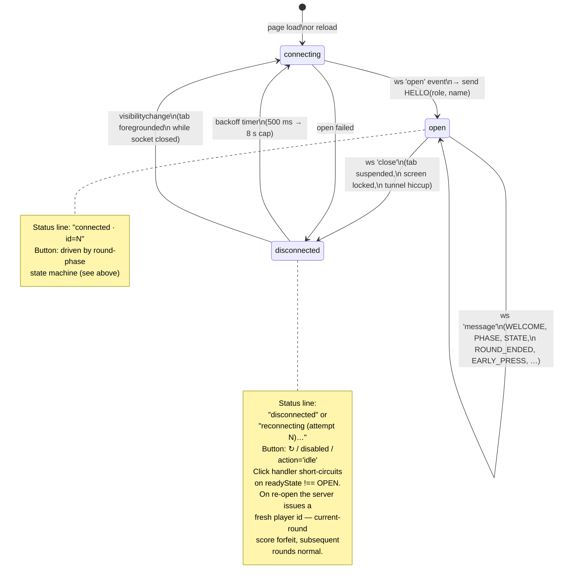

# Plan: Party Games Platform — Phase 1 (Chromecast foundation)

**Date:** 2026-04-22
**Status:** In progress
**Branch:** `party-games-platform` (off `2026-ios` HEAD `da9e5ee`), worktree `/home/will/WorldFoundry.party-games-platform`.
**Design refs:** [docs/reference/2026-04-14-party-game.md](../reference/2026-04-14-party-game.md) (reaction game — first consumer), [docs/reference/2026-04-14-party-game-cards.md](../reference/2026-04-14-party-game-cards.md) (future).

## Goal

Reusable Chromecast platform — Node.js relay server + receiver shell (TV) + controller shell (phone). Receiver loads on a real Chromecast; phone controller launches the cast and connects to the same relay; button press on phone appears on TV. **No game logic yet** — the game lives in `games/<name>/` on top of this shell in Phase 2+.

## Prerequisites

### Node.js via fnm (one-time, per-user)

We standardise on **fnm** (Fast Node Manager) for per-user Node version management. Non-privileged install, no `sudo`, trivial version switching.

```sh
# 1. Install fnm (writes to ~/.local/share/fnm/; adds init to ~/.bashrc / ~/.zshrc)
curl -fsSL https://fnm.vercel.app/install | bash

# 2. Re-source the shell (or open a new terminal)
source ~/.bashrc

# 3. Install current LTS Node
fnm install --lts
fnm default lts-latest

# 4. Verify
node --version   # v22.x or v20.x
npm --version
```

If `curl | bash` is blocked in your environment, download the binary release from <https://github.com/Schniz/fnm/releases/latest> (`fnm-linux.zip` / `fnm-macos.zip`) and extract to somewhere on `PATH`.

### Google Cast Developer account

Required for Phases 1b+ (registering the receiver URL and whitelisting your Cast device). See separate [Cast Developer registration notes in the main conversation / README]; one-time $5, ~15 min propagation after adding the test device serial.

### Chromecast on dev network

Any Chromecast 3rd-gen / Ultra / Google TV dongle on the same Wi-Fi as your phone and dev laptop. Needed from Phase 1b onwards; Phase 1a runs entirely in browser tabs.

## Sub-phases

### Phase 1a — platform shell, localhost-only smoke test

Server + receiver page + controller page, all communicating via WebSocket through the server (Architecture B per design: cloud-relay). Cast SDK loaded in receiver but tolerant of non-cast browser contexts. Verified by opening both URLs in browser tabs — button on controller → visible change on receiver.

- `party-games/platform/server/{package.json,index.js}`
- `party-games/platform/receiver-shell/{index.html,receiver.js,receiver.css}`
- `party-games/platform/controller-shell/{index.html,controller.js,controller.css}`
- `party-games/README.md` — how to run.

Protocol (minimal for 1a):

```
client → server                  server → clients
──────────────────────────       ─────────────────────────────────
HELLO(role, name?)           →   STATE({players})              // broadcast to receivers
PING()                       →   PONG(fromPlayerId)             // broadcast to receivers
```

### Phase 1b — HTTPS tunnel + Cast Console receiver app registration ✅

- `cloudflared tunnel --url http://localhost:8080` — live at `https://elderly-ethical-gear-cruises.trycloudflare.com` during dev. Quick tunnel, not persistent across restarts; for named tunnels see Phase 4.
- Cast Console → Applications → Custom Receiver **`A40DF337`** registered as `Party Games Platform (dev)` with URL `https://<tunnel>/receiver`, **unpublished** (only runs on whitelisted test devices — which is what we want).
- Cast Console → Devices → whitelist Chromecast serial: **pending** — user locating the physical device + remote.

### Phase 1c — Cast sender in the controller ✅

Commit `498f6ec`. Controller loads `cast_sender.js?loadCastFramework=1`, initialises `CastContext` with `receiverApplicationId: 'A40DF337'`, exposes a `<google-cast-launcher>` web component for the native device picker. State line reflects `idle / connecting / on <device>`. Receiver logs `SENDER_CONNECTED/DISCONNECTED` to the on-screen event log; status line appends app-data name once CAF's `READY` fires.

### Phase 1d — end-to-end button round-trip on real Cast device (waiting on propagation)

Controller PING displays on the TV receiver via actual Cast session. Registration side-quest surfaced several issues along the way — all fixed:

- **Static-asset bug (commit `bb1a0c5`).** `/receiver` HTML's `<script src="receiver.js">` resolved to `/receiver.js`, which `resolveStatic` only handled for the `/receiver/foo` form. Silent 404; page stuck on default "connecting…" text. Fix: two new routing rules for sibling assets, plus a relay.test.js case.
- **Cast SDK timing quirks (commit `bb1a0c5`).** `__onGCastApiAvailable(true)` can fire before `cast.framework` / `chrome.cast.AutoJoinPolicy` is populated; added poll-then-init, string-literal fallback for the autoJoinPolicy, and explicit seeding of the cast-state UI since CAST_STATE_CHANGED doesn't always emit an initial event.
- **Cast Console registration.** Original `A40DF337` app was wedged (device-to-app association never pushed despite "Ready For Testing"); recreated as `071CDEDD` with Sender Details populated at creation time. Cast Console claims up to **48 hours** for the first push to a newly-registered app — no per-app propagation-complete indicator visible, detected only by cast button appearing on a controller tab.
- **Device serial swap.** Registered TV serial turned out to differ from the physically-plugged-in device; added both `2628105GN0GT7C` and `31191HFGN54Q67` to the devices whitelist.
- **IPv4 DHCP.** Physical TV was IPv6-only (DHCPv4 didn't land); Cast discovery needs IPv4 mDNS. Static IP `192.168.4.50` on the TV unblocked YouTube casting as a sanity check; Party Games receiver will follow once 071CDEDD propagates.

Current state: waiting on Google's 48h window for 071CDEDD. Tunnel + server left running, Cast Console URL pinned to the current `helped-enjoy-calm-renewable.trycloudflare.com/receiver`. Leaving the Cast Console entry alone on the cautious assumption that edits could restart the propagation clock — that's unverified, not something Google documents.

### Phase 2a — reaction game state machine (mini-game 1) ✅ (playable end-to-end in browser)

Implements mini-game 1 (countdown timer) as a **game plugin** at `party-games/games/reaction/reaction.js` consumed by the platform via `createServer({ game })`. Plugin interface is minimal: `{onJoin, onLeave, onMessage}` receiving a `services = {broadcast, sendTo, getPlayers, getHost, now, schedule, random}` surface. All clocks are injectable so tests can deterministically fast-forward through countdowns + scoring windows.

State machine: `LOBBY → ROUND_COUNTDOWN → ROUND_OPEN → ROUND_ENDED → (next round | GAME_OVER) → NEW_GAME (LOBBY)`. Server owns all state + timestamps; controllers forward button presses; receiver renders phases + scoreboard.

New messages on top of the platform's HELLO/PING/STATE/WELCOME/PONG:
- Controller → server: `START_GAME` (host only from LOBBY/GAME_OVER), `BUTTON_PRESS {clientTs}`, `NEW_GAME` (host only from GAME_OVER).
- Server → clients: `PHASE {phase, scores}`, `ROUND_COUNTDOWN {roundId, showMs}`, `TIMER_FIRED {roundId, serverTs}`, `EARLY_PRESS {roundId, playerId, name}`, `ROUND_ENDED {roundId, ranks, scores}`, `GAME_OVER {winnerId, name, scores}`.

Scoring: 4/3/2/1 to 1st–4th; first to 10 pts wins. Early press → lockout for that round only, scores 0. Server-receive-timestamp adjudication (design doc §Timing).

Receiver renders: LOBBY player list; countdown with a decaying CSS bar keyed to showMs (9s); giant animated GO! on TIMER_FIRED; per-round rankings + running scoreboard; final winner screen.

Controller button label + action adapts to phase: START/NEW GAME for host in LOBBY/GAME_OVER; GO! (or LOCKED) during ROUND_OPEN.

Test coverage:
- `party-games/platform/server/test/relay.test.js` — 10 tests (platform protocol, hardening).
- `party-games/platform/server/test/reaction-integration.test.js` — 2 tests (game wired through real WebSocket server with fake clock).
- `party-games/games/reaction/test/reaction.test.js` — 13 tests (state machine in isolation).

End-to-end verification on a physical Cast device is pending Phase 1d.

### Phase 2b — image-recognition mini-game ✅ (playable end-to-end in browser; commits `3b2b00e`, `abee593`, `14a0cd2`, later reshape)

Second reaction-family mini-game, plugged into the same platform shell via `games/image/image.js`.

**Original shape (shipped in `3b2b00e`):** REVEAL (memorise target 3 s) → DISTRACTORS (4–8 non-target frames at 800 ms) → TARGET (target shown with 3 s scoring window). Early press during REVEAL/DISTRACTORS → lockout.

**Reshape after first play (`abee593` + current follow-up):** The static REVEAL/DISTRACTORS/TARGET carve-up felt mechanical. New design collapses the playing portion into a single **PLAY** phase where images from the pool cycle uniformly at random at 800 ms each for up to `MAX_ROUND_MS = 60 s`. The target appears naturally any time its slot comes up (≈5 % per frame with the default 20-emoji pool). Rules:

- Press during REVEAL → lockout.
- Press during PLAY, **before** the target has appeared in the stream at least once → lockout ("early press"; target hasn't been revealed yet).
- Press during PLAY, **after** the target has appeared at least once → counted, ranked 4/3/2/1 by server-receive timestamp order. The currently-displayed frame doesn't matter — once the round is "armed" by the target having flashed by, any tap is a commit, even if it lands on a distractor seconds later. Ranking is pure tap order across committed players.
- One press per round, per player. Round ends the moment every active player has either pressed or locked out, or 60 s, whichever first.
- **LAST_STANDING auto-win.** If a lockout leaves exactly one player un-locked (and at least one lockout has occurred — exempts solo play), the remaining player wins the round by default: server auto-records a press for them → 4 pts, broadcasts a `LAST_STANDING` event, and ends the round immediately.
- **GUARANTEED_TARGET_BY_SEQ = 40.** Pure uniform random on a 20-emoji pool means ~2% of rounds would never produce the target (observed live). If the target hasn't come up naturally by frame 40 (~32 s into the 60 s cap), force it on that frame.
- Target may show once or several times per round — depending on the roll. Ideally it appears once and everyone catches it; if the first appearance is missed, later ones give a second chance (still valid under the "armed" rule).

Phase names in this shape: `LOBBY → REVEAL → PLAY → ROUND_ENDED → (next round | GAME_OVER)`.

```mermaid
stateDiagram-v2
    [*] --> LOBBY
    LOBBY --> REVEAL: START_GAME (host only)\nnew target picked\nscores retained
    REVEAL --> REVEAL: BUTTON_PRESS → EARLY_PRESS\nplayer locked out
    REVEAL --> ROUND_ENDED: LAST_STANDING\n(lockout left 1 player un-locked)
    REVEAL --> PLAY: after 3 s reveal + 0.5 s clear\n(ROUND_REVEAL broadcast)
    PLAY --> PLAY: every 800 ms:\nSHOW_IMAGE (uniform-random pick\nor forced-target at seq 40)
    PLAY --> PLAY: BUTTON_PRESS pre-arming\n→ EARLY_PRESS, locked out
    PLAY --> PLAY: BUTTON_PRESS post-arming\n→ PRESS_RECORDED, 4/3/2/1 rank
    PLAY --> ROUND_ENDED: all players committed\n(each pressed or locked out)
    PLAY --> ROUND_ENDED: LAST_STANDING\n(lockout left 1 player un-locked)
    PLAY --> ROUND_ENDED: maxRoundMs (60 s failsafe)\nROUND_ENDED.timedOut = true
    ROUND_ENDED --> REVEAL: after 3 s pause\n(next round; scores kept)
    ROUND_ENDED --> GAME_OVER: any player hit winScore\n(default 10)
    GAME_OVER --> LOBBY: NEW_GAME (host only)\nscores reset
    LOBBY --> [*]: server shutdown

    note right of REVEAL
        Player joining now
          receives a PHASE:REVEAL
          catch-up (onJoin → sendTo)
    end note
    note right of PLAY
        Round "arms" the first time
          the target frame appears
          (targetFirstShownAt set once,
           never cleared within round).
        Current-frame-on-screen is
          irrelevant once armed.
        Target forced to appear at
          seq=40 if uniform random
          hasn't surfaced it yet.
    end note
    note left of ROUND_ENDED
        Emitted on any exit path:
          all-committed / timedOut /
          LAST_STANDING. Payload carries
          {roundId, ranks, scores,
           targetId, timedOut?}.
        LAST_STANDING also fires its
          own broadcast just before.
    end note
    note left of ROUND_ENDED
        ROUND_ENDED carries
          {roundId, ranks, scores,
           targetId, timedOut?}
        Locked-out players: 0 pts
        Un-pressed players:  0 pts
    end note
```



Controller WebSocket lifecycle (separate state machine from the round, but load-bearing — mobile browsers drop the socket aggressively on tab suspend / screen lock, so the controller needs to heal itself):



Other client-side details that aren't state-machine-shaped:

- **Late-joiner catch-up.** Game plugins' `onJoin` uses `services.sendTo` to push the current `PHASE` to the new player so their default `phase='LOBBY'` (non-host → disabled button) doesn't strand them when they arrive mid-round.
- **Receiver no-cache.** Server sets `Cache-Control: no-store` on static files so reloaded tabs always get fresh JS (avoids cached-out-of-date controller dropping into a removed phase case).
- **CAF gate.** Receiver's `ctx.start()` is gated on a Cast-capable user agent (`CrKey|Android TV|Tizen|webOS`). In a plain browser we skip CAF entirely, which silences the `ws://localhost:8008/v2/ipc` reconnect spam that would otherwise fill the console.

Messages beyond the platform base: `ROUND_REVEAL {targetId, showMs, clearMs}`, `SHOW_IMAGE {seq, imageId, showMs, isTarget, serverTs}`, `PRESS_RECORDED {roundId, playerId, name}` (fires on successful press; used by the receiver's live commit indicator), `LAST_STANDING {roundId, playerId, name}` (auto-win announcement), plus the shared `PHASE / EARLY_PRESS / ROUND_ENDED {… timedOut?} / GAME_OVER`.

Image pool: 20 visually-distinct emoji. Design doc calls for SVG at prod polish time; emoji are zero-dep and adequate for v1.

UI:
- Receiver: separate REVEAL panel (target held 3 s, fades 0.5 s); PLAY reuses the image-stream panel, continuously updating. No on-screen highlight of the target frame — the game is about recognising it from the REVEAL memorisation.
- Controller: REVEAL → "WAIT" (press locks out). PLAY → "TAP!" (press evaluated against current frame). Standard START / NEW GAME / LOCKED labels for other phases.

Test coverage (51 across three runners):
- `party-games/games/image/test/image.test.js` — 22 state-machine tests (random pool forced to 2 entries to drive target/distractor choice, press-before-arm → lockout, press-after-arm → counted, press-long-after-target-cleared still counted, ms-field-from-targetFirstShownAt, failsafe, all-committed early-end, `PRESS_RECORDED` broadcast, `GUARANTEED_TARGET_BY_SEQ` force-appearance, `LAST_STANDING` auto-win, etc.).
- `party-games/platform/server/test/image-integration.test.js` — 2 tests through real WebSocket server.
- Reaction: unchanged (13 + 2).
- Platform relay: unchanged (11 including static-file coverage).

### Phase 3+ — UX polish, PWA manifest, mobile CSS, cards game, production hosting

Per the "Out of scope" section below; expanded after Phase 2 lands.

## Proposed repo layout

```
party-games/
  README.md
  platform/
    server/
      package.json
      index.js            — http + ws; static-file server; broadcast relay
    receiver-shell/
      index.html          — loads CAF; opens WS to server; base TV layout
      receiver.js
      receiver.css
    controller-shell/
      index.html          — opens WS; base phone UI (button + name entry)
      controller.js
      controller.css
  games/                  — (empty Phase 1a; per-game subdirs in Phase 2+)
  assets/                 — (empty Phase 1a)
```

No bundler, no framework. Plain HTML/CSS/JS + Node http + `ws`.

## Out of scope for Phase 1

- Game logic (reaction or cards) — Phase 2+.
- AWS production hosting (S3+CloudFront + Lightsail) — Phase 4+.
- PWA manifest / service worker — Phase 3.
- Apple TV / Fire TV / browser-on-HDMI matrix polish — Phase 3.
- Cloudflare Tunnel → named tunnel → zero-trust reserved URL — Phase 4 (trycloudflare random URLs are fine for dev).
- Room codes / multi-room — Phase 2 when reaction game needs isolation.

## Verification

- 1a: browser tabs — receiver at `http://localhost:8080/receiver`, controller at `http://localhost:8080/controller?name=Alice`. Receiver shows `[Alice]`; click button on controller; receiver shows a ping event.
- 1b: phone Chrome → Cast → TV loads receiver via tunnel URL. Status indicator on receiver (WS connected).
- 1c: controller "Cast to TV" button launches receiver on TV without leaving the page.
- 1d: button press on phone → TV displays ping. Commit.

## Follow-up

- Phase 1d: verify on physical Cast device once 071CDEDD propagates.
- Phase 2c: scoring polish / fireworks on winner phone.
- Phase 3: PWA manifest, mobile CSS, browser-on-HDMI verification, accessibility.
- Phase 4: production hosting (AWS S3+CloudFront + Lightsail), custom domain, published Cast app review. Named Cloudflare tunnel so the Cast Console URL stops being a moving target.
- Phase 5+: cards game on the same platform.
