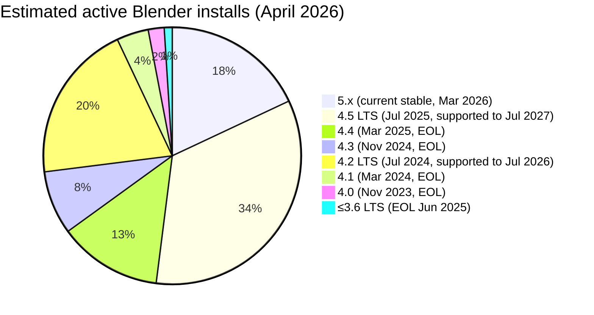

# Plan: Manual rewrite + Packaging (v3 follow-up)

**Status:** ✅ Done (2026-04-29). See addendum below re: 4.0–4.1 legacy install path. Part 1 (manual rewrite → provenance-first framing) landed in `docs/wf-asset-browser.md`. Part 2: `blender_manifest.toml` added to both `wf_blender/` and `wf_asset_browser/`; Taskfile tasks `blender-build`, `blender-install`, `blender-validate`, `blender-package` added. The install.sh `.py` gap (`asset_browser.py`, `asset_threading.py`, `providers.py`) was resolved via the addon split (`2026-04-29-addon-split.md`) — those files now live in `wf_asset_browser/` with its own correct install.sh.

## Context

Two things to address after the Sketchfab v2 implementation:

1. **Manual is too WF-commercial-centric.** The current `docs/wf-asset-browser.md` frames every licence decision as "for a commercial game" and treats WF project defaults as universal law. The tool is (intentionally) useful for any Blender project — open-source, non-commercial, hobbyist. The user also surfaced a reframing: the tool's unique value is *provenance capture*, not just filtering. The manual under-sells this.

2. **No packaging/distribution support.** The addon has no `blender_manifest.toml` (required by Blender 4.2+ extension system), the install.sh is incomplete (misses `asset_browser.py` and `asset_threading.py`), and there are no `task` commands for building or packaging the addon.

> **Note:** The pure-Python providers rewrite ([separate plan](wf-asset-browser-pure-python.md)) eliminates `wf_asset_provider.so` from the addon. This plan's packaging section assumes that plan is applied first — the only remaining native lib is `wf_core.so`.

---

## Part 1: Manual rewrite (`docs/wf-asset-browser.md`)

### What changes

#### Introduction paragraph
Current: "filters them against the project's licence policy"
New lead: **provenance-first** — the tool records where every asset came from, who made it, under what terms, and what attribution you owe. Whether you ultimately accept or reject a licence is a policy choice you configure; the tool's job is to make that choice informed and auditable.

#### Quick start step 1
Remove `"inside the wflevels/ tree"` — that's WF-specific. Replace with generic: open any `.blend` file, or run from a project directory that contains (or has an ancestor with) a `licence_policy.toml`.

#### Policy section
Add a callout box/note at the start: **The policy file is yours.** The examples below show the WF project's configuration for a commercial game. An open-source project might accept CC-BY-SA everywhere; a personal/hobbyist project might accept everything. The fallback (CC0 only) is conservative by design — configure it for your project.

#### Per-licence sections — restructure each to three beats

Each section currently has one beat: "hard block, here's why (commercial game)."
New structure:

1. **What this licence requires** (neutral legal fact)
2. **What the tool records** (the provenance capability — attribution_string, licence_url, etc.)
3. **WF project default** (clearly labelled as one project's choice, with reason)
4. **When it suits other project types** (open-source, non-commercial, personal)

Specific rewrites:

**CC-BY-SA-4.0:**
- What it requires: derivatives must be released under the same CC-BY-SA terms. The tool records `attribution_string` and `licence_url` for any asset you accept.
- WF default: `reject` — WF is a commercial game; SA would require releasing the entire game under CC-BY-SA.
- Other uses: **perfect for open-source games** that want to ensure remixed assets stay open. An open-source project should set this to `accept`.

**CC-BY-NC-4.0 / CC-BY-NC-SA-4.0:**
- What it requires: no commercial use. Tool records full provenance regardless.
- WF default: `reject` — commercial game.
- Other uses: **fine for personal/hobby projects** or academic work with no monetisation. Set to `accept` in your policy.

**CC-BY-ND-4.0 / CC-BY-NC-ND-4.0:**
- What it requires: no derivatives. Tool records provenance but flags `attribution_required = true`.
- WF default: `reject` — any pipeline modification (format conversion, re-texturing, scaling) is a derivative.
- Other uses: **rare** — background decoration used exactly as-is. Narrow waiver path via `[[waiver]]` is possible.

**Flowchart:** Remove "For a commercial game..." language. Replace with "With the WF project default policy..." to make it clear this is a specific configuration.

#### Provenance section — elevate and expand

Currently the attribution audit commands are buried at the end under "Attribution obligations audit." Move this concept forward and expand it. The provenance story:

- **Every imported asset gets a `manifest.json`** — even CC0 assets, where attribution isn't required. The record of origin is always there.
- **For CC-BY assets:** `attribution_string` contains the exact credit line the author requests. This is what goes in your credits screen — no guessing.
- **The audit command** (`grep -rl '"attribution_required": true' ...`) tells you exactly which assets in the project have outstanding obligations. Run it before any release.
- **`derived_from` field** tracks remix chains — if asset B is a modification of asset A, that relationship is preserved.
- **Future `wf_audit` CI tool** will validate every asset against its manifest automatically.

This section should appear **before** the licence-tier subsections, not after. It frames why the licences matter — because the tool actually uses the information.

---

## Part 2: Packaging / distribution

### Blender extension system background

- **Blender ≤4.1 (legacy addons):** zip containing addon folder + `__init__.py` with `bl_info` dict. Install via Edit → Preferences → Add-ons → Install from Disk.
- **Blender 4.2+ (extensions):** `blender_manifest.toml` at addon root replaces `bl_info`. Build with `blender --command extension build`. Can be submitted to extensions.blender.org. `bl_info` still works in 4.2 for backward compat but is deprecated.
- **Recommendation:** add `blender_manifest.toml` now (Blender 4.2 is current stable); keep `bl_info` in `__init__.py` for anyone still on 4.0–4.1.

### How native extensions fit into the standards

After the pure-Python providers rewrite, the addon has exactly **one** native dependency: `wf_core.so` (the OAD schema system, used by `panels.py`/`operators.py`). All asset search/download logic is pure Python (`providers.py`).

| Distribution target | Approach | Standard? |
|---|---|---|
| Local dev install (`task blender-install`) | Symlink .py + copy wf_core.so | ✅ idiomatic |
| GitHub release zip | Extract wf_core.so from wheel, bundle in zip with .py files | ✅ acceptable, very common |
| Blender Extension Hub (extensions.blender.org) | Requires per-platform zips; Hub is GPL-only | ⚠ future work — see note |

**Why wf_core.so goes next to `__init__.py` (not in `wheels/`):** The `wheels` manifest key is for Python packages Blender manages as dependencies. A compiled native extension imported directly (`import wf_core`) belongs at the addon root — that's where Blender's addon import path expects it.

**Extension Hub note:** Hub submission requires `--split-platforms` (separate zips per OS/arch) and GPL-compatible code throughout. Flag this for a future `blender-package-hub` task.

### New file: `wftools/wf_blender/blender_manifest.toml`

```toml
schema_version = "1.0.0"
id = "wf_blender"
name = "World Foundry Asset Browser"
tagline = "Licence-aware 3D asset browser with provenance tracking"
version = "0.2.0"
type = "add-on"
blender_version_min = "4.2.0"
maintainer = "World Foundry <wbnorris@gmail.com>"
license = ["SPDX:GPL-2.0-or-later"]

[build]
paths_exclude_pattern = ["__pycache__/", ".git", "*.zip", "*.log", "docs/"]
```

Notes:
- `blender_version_min = "4.2.0"` — the extension build system requires 4.2. The legacy `bl_info` `"blender": (4, 0, 0)` covers 4.0–4.1 users; both files coexist.
- `license = ["SPDX:GPL-2.0-or-later"]` — required if ever submitting to extensions.blender.org (GPL-only).
- `tagline` ≤64 chars, no trailing punctuation — enforced by `blender --command extension validate`.
- Do NOT add a `wheels` key — the Rust `.so` files are loaded directly by Python import, not managed by Blender's wheel installer.

### Fix `wftools/wf_blender/install.sh`

One gap: **missing Python files in symlinks.** The current symlink list is `__init__.py operators.py panels.py export_level.py`. Missing: `asset_browser.py` and `asset_threading.py`.

#### Updated symlink list (install.sh line 72)

```bash
for pyfile in __init__.py operators.py panels.py export_level.py asset_browser.py asset_threading.py providers.py; do
```

(`providers.py` is the new pure-Python providers module from the companion plan.)

No other changes to install.sh — it already handles `wf_core.so` correctly.

### New Taskfile.yml tasks

```yaml
blender-build:
  desc: "Build wf_core Rust native lib for the Blender addon"
  sources:
    - wftools/wf_py/src/**/*.rs
    - wftools/wf_py/Cargo.toml
  generates:
    - wftools/wf_py/target/wheels/wf_core*.whl
  cmds:
    - cd wftools/wf_py && maturin build --release

blender-install:
  desc: "Install Blender addon to local Blender (symlinks .py, copies wf_core.so; builds if needed)"
  deps: [blender-build]
  cmds:
    - bash wftools/wf_blender/install.sh

blender-validate:
  desc: "Validate the Blender extension manifest (requires Blender 4.2+)"
  cmds:
    - blender --command extension validate --source-dir wftools/wf_blender

blender-package:
  desc: "Build distributable .zip (Blender extension format); output in dist/"
  deps: [blender-build, blender-validate]
  cmds:
    - mkdir -p dist
    - |
      set -euo pipefail
      WF_CORE_WHEEL=$(find wftools/wf_py/target/wheels -name "wf_core*.whl" | sort | tail -1)
      python3 -c "
      import zipfile, shutil
      with zipfile.ZipFile('$WF_CORE_WHEEL') as z:
          sos = [n for n in z.namelist() if n.endswith('.so')]
          z.extract(sos[0], '/tmp/')
          shutil.copy('/tmp/' + sos[0], 'wftools/wf_blender/wf_core.so')
      "
    - blender --command extension build --source-dir wftools/wf_blender --output-dir dist
    - echo "Package written to dist/"
```

Dependency graph:
```
blender-build (sources/generates caching — skips maturin if wf_py Rust sources unchanged)
    │
    ├──► blender-install (calls install.sh — symlinks .py, copies wf_core.so)
    │
    └──► blender-package ◄── blender-validate
         (copies wf_core.so into addon dir, then blender extension build zips it)
```

---

## Files Modified / Created

| Action | Path |
|--------|------|
| Rewrite | `docs/wf-asset-browser.md` |
| **New** | `wftools/wf_blender/blender_manifest.toml` |
| Modify | `wftools/wf_blender/install.sh` — add missing .py symlinks (asset_browser, asset_threading, providers) |
| Modify | `Taskfile.yml` — add blender-build, blender-install, blender-validate, blender-package |

*Assumes `providers.py` exists (pure-Python plan applied first).*

---

## Verification

1. `task blender-build` — maturin succeeds, wf_core wheel appears in `target/wheels/`
2. `task blender-install` — installs to `~/.config/blender/<ver>/scripts/addons/wf_blender/`; `wf_core.so` present; all `.py` files symlinked including `asset_browser.py`, `asset_threading.py`, `providers.py`
3. Open Blender → Edit → Preferences → Add-ons → search "World Foundry" → appears, enables cleanly
4. `task blender-validate` — passes with no errors
5. `task blender-package` — `dist/wf_blender-0.2.0.zip` produced; open the zip and confirm `wf_core.so` and all `.py` files are present, no `wf_asset_provider.so`
6. Manual: render `task md -- docs/wf-asset-browser.md` and verify the provenance section appears before the licence tiers, licence descriptions are neutral then WF-specific, and CC-BY-SA notes suitability for open-source projects

---

## Addendum: Blender version distribution and the 4.0–4.1 legacy install path

`INSTALL.md` currently ships two install paths: the 4.2+ extension system and a legacy 4.0–4.1 path. The question is whether the legacy path is worth maintaining.

No public version-breakdown survey exists (blender.org survey data is behind auth). The release timeline is the best proxy:



*These are order-of-magnitude estimates derived from release cadence and LTS retention patterns — not survey data.*

**Reading:** ~94% of active installs are on 4.2 or later (the extension system). 4.0 and 4.1 combined are ~6%, both EOL with no further patches.

**4.0–4.1 verdict:** ~6% of users on EOL versions. Dropped — `INSTALL.md` now requires 4.2+; `bl_info` bumped to `(4, 2, 0)` to match `blender_manifest.toml`.

**Blender 5.x compatibility:** The addon is compatible with 5.x. Blender 5.0 (March 2026) removed `Image.bindcode` and the animation `fcurves`/`groups` direct API — neither is used here. Thumbnails go through `bpy.utils.previews.ImagePreviewCollection`, which is unchanged. Registration, `AddonPreferences`, `bpy.props`, and `UILayout` are all stable across 4.2–5.x.
