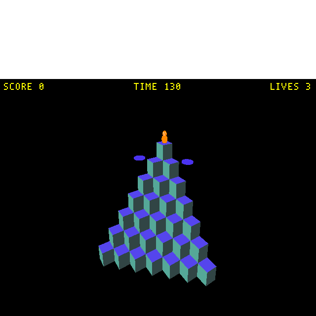

# Plan: Live Editor Bridge Phase 2 — make Blender→engine push actually work (no restart)

**Status:** DONE 2026-05-26 (~1 h). All three fixes landed in `wftools/wf_blender/`
and verified headless end-to-end by [`tests/verify_bridge_blender_push.py`](../../tests/verify_bridge_blender_push.py)
(real `blender --background` + addon → live `wf_game`): 27 objects map name→idx→engine
position exactly and a Blender move of `Actboxor01` teleports the right engine actor
with no restart.

## Context

`TODO.md:129` tracks *"Live editor bridge Phase 2 — Blender → engine property/transform
push without restart"* as **open `[ ]`**, even though
`docs/plans/2026-04-29-live-editor-bridge.md` stamps Phase 2 **"IMPLEMENTED 2026-04-29."**
The plan doc is aspirational. Verified reality:

- **Engine side genuinely works.** `scene:set_transform` / `scene:set_prop` route through
  `wfmut::SetActorPos` / `wfmut::SetActorField` (`engine/stubs/debug_server.cc:602,625`),
  field schema generated into `engine/mutation/kpropmap_generated.inc`. Exercised by
  `tests/debug_bridge_client.py`, `tests/verify_wfmut_bridge.py`, and the wf_edit C++ bridge.
- **Blender→engine direction is dead.** Three breaks, all on the Blender glue:
  1. `DebugBridge.update_index_map()` (`debug_bridge.py:151`) is **defined but never called**
     (grep across `wftools/`, `tests/` finds only the definition + self-refs). So
     `bridge.name_to_idx` stays empty `{}`; the depsgraph handler
     (`__init__.py:128`) does `idx = bridge.name_to_idx.get(obj.name)` → always `None` →
     `continue`. **Every move/property edit in Blender silently no-ops.**
  2. `WF_OT_run_level` (`operators.py:695`) launches `[game_bin, "-L<iff>"]` with **no
     `--debug-port`**, so the one-click "Run in Engine" path starts an engine with no debug
     server → a later Connect is refused.
  3. Latent crash masked by (1): the handler's unconditional `float(current)`
     (`__init__.py:142`) throws on string-valued props once the map resolves.

This plan wires the loop end-to-end so Phase 2 matches its TODO claim, and corrects the
stale doc Status.

## Root cause + fixes

### Fix 1 — populate the index map (the blocking gap)
Actor index numbering is canonical: levcomp-rs `lev_parser::name_to_index`
(`wftools/levcomp-rs/src/lev_parser.rs:97`) assigns `(i+1)` over the `.lev` object list, and
the exporter writes that list as `[o for o in context.scene.objects if o.get(SCHEMA_PATH_KEY)]`
(`export_level.py:936`). So the map the bridge needs is exactly `{i+1: o.name}` over that
**same filtered list**.

- Add a single-source-of-truth helper in `wftools/wf_blender/export_level.py`:
  `def scene_index_map(context) -> dict[int, str]` returning
  `{i + 1: o.name for i, o in enumerate(o for o in context.scene.objects if o.get(SCHEMA_PATH_KEY))}`.
  Mirrors `name_to_index` exactly.
- Call `debug_bridge.get_bridge().update_index_map(export_level.scene_index_map(context))` from:
  - `WF_OT_run_level.execute` right after the successful `export_scene_to_lev` (`operators.py:671`)
    — authoritative capture of the level just launched.
  - `WF_OT_bridge_connect.execute` (`operators.py:712`) right after a successful connect —
    fallback for "connect to an already-running engine without re-running this session"
    (same map as long as scene topology is unchanged since export).

### Fix 2 — `WF_OT_run_level` must launch a bridge-enabled engine
Append `"--debug-port", str(port)` (port from `prefs.debug_port`, default `7777`) to the
`subprocess.Popen` args at `operators.py:695-700`. Localhost bind is the safe default
(no `--debug-bind`). One-click Run → Connect → push now works without a manual `task run-debug`.

### Fix 3 — value-encoding guard for property push
Once the map resolves, `bridge.set_prop(idx, engine_key, float(current))` (`__init__.py:142`)
throws `ValueError` on string props: `wf_Script` (string; `wfmut` also rejects `common.Script`
writes — `wfmut.cpp:237`) and enum fields stored as label strings (`wf_MovementClass`,
`wf_ModelType`, maybe `wf_Mobility`; `export_level.py:71` stores `items[idx]`).

- Drop `wf_Script` from `_ENGINE_PROP_KEY` (`__init__.py:96`) — not bridge-writable.
- Guard the send: `try: v = float(current) except (TypeError, ValueError): continue`
  before `set_prop`. Numeric tunables (hp, Mass, MaxGroundSpeed, accelerations, StepSize,
  mailboxes, WriteToMailboxOnDeath) flow; enum/string fields are skipped, not crashed.
- **Deferred follow-up (log in TODO.md):** enum→index translation so MovementClass/ModelType
  can be tuned live. The schema-driven index lookup already exists in `wf_core` and the wf_edit
  C++ bridge (`engine/wf_edit/engine_bridge.cc`); porting it into the Python depsgraph path is
  its own task.

> Coordinate note: the handler sends `obj.location`; for unparented top-level WF objects this
> equals world position and matches the exporter's `bl_to_wf()` identity transform (per
> CLAUDE.md) — correct for Phase 2. Parented/delta-transformed objects are out of scope.

## Files to change
- `wftools/wf_blender/export_level.py` — add `scene_index_map(context)` helper.
- `wftools/wf_blender/operators.py` — `update_index_map` call in `WF_OT_run_level` (post-export)
  and `WF_OT_bridge_connect` (post-connect); add `--debug-port` to the Run launch.
- `wftools/wf_blender/__init__.py` — drop `wf_Script` from `_ENGINE_PROP_KEY`; wrap value
  coercion in try/except in `_depsgraph_handler`.
- `TODO.md` — flip line 129 to `[x]` (date + commit); add the enum-translation follow-up.
- `docs/plans/2026-04-29-live-editor-bridge.md` — correct the Status line (Phase 2 was *not*
  actually working from Blender until this fix; keep history honest).

Run `python3 -m py_compile` on every edited `.py` before declaring done (project rule).
Log any new gotcha to `docs/level-design-troubleshooting.md` as discovered.

## Verification (end-to-end, screenshot proof)

**Primary — real Blender via BlenderMCP, on snowgoons:**
1. `task run-debug -- wflevels/snowgoons.iff` (background); confirm `[debug] listening on :7777`;
   send `pause`.
2. BlenderMCP `execute_blender_code`: open the snowgoons `.blend`, confirm the addon registered,
   run `wf.bridge_connect`; assert `bridge.name_to_idx` is non-empty and equals the `.lev`'s
   `name_to_index`.
3. Move one uniquely identifiable object via `obj.location` → depsgraph handler fires
   `scene:set_transform`.
4. Engine `screenshot` op before/after → the **correct** actor moved (and only that one =
   index correctness proof). Then tune a numeric prop (e.g. `movebloc.MaxGroundSpeed`) and
   confirm no handler crash + visible effect.

**Fallback (no live Blender) — proves engine + map idx without the GUI:**
- Pure-python: assert the `scene_index_map` ordering matches levcomp-rs `name_to_index` for
  snowgoons (parse the exported `.lev`).
- `tests/debug_bridge_client.py`: send `scene:set_transform` for the idx the helper computes
  for a named object; screenshot; confirm the move. Extends the existing
  `tests/verify_wfmut_bridge.py` pattern.

Save screenshots under `tests/screenshots/` (e.g. `bridge_phase2_before.png` / `_after.png`)
and reference them in the plan + TODO (screenshots-for-proof rule).

## Notes
- On approval I'll mirror this plan to `docs/plans/2026-05-26-live-editor-bridge-phase2-fix.md`
  and render with `task md` (project convention), committed with the code it describes.
- Scope is the **push** direction only (the TODO item). Phase-1 read-back (`state` broadcast →
  Blender positions) is separate and not touched here.
