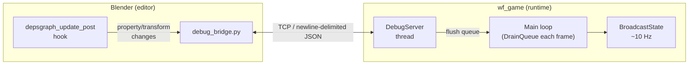
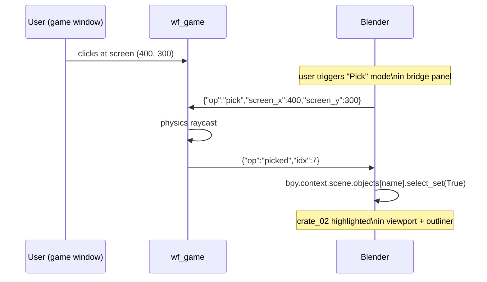
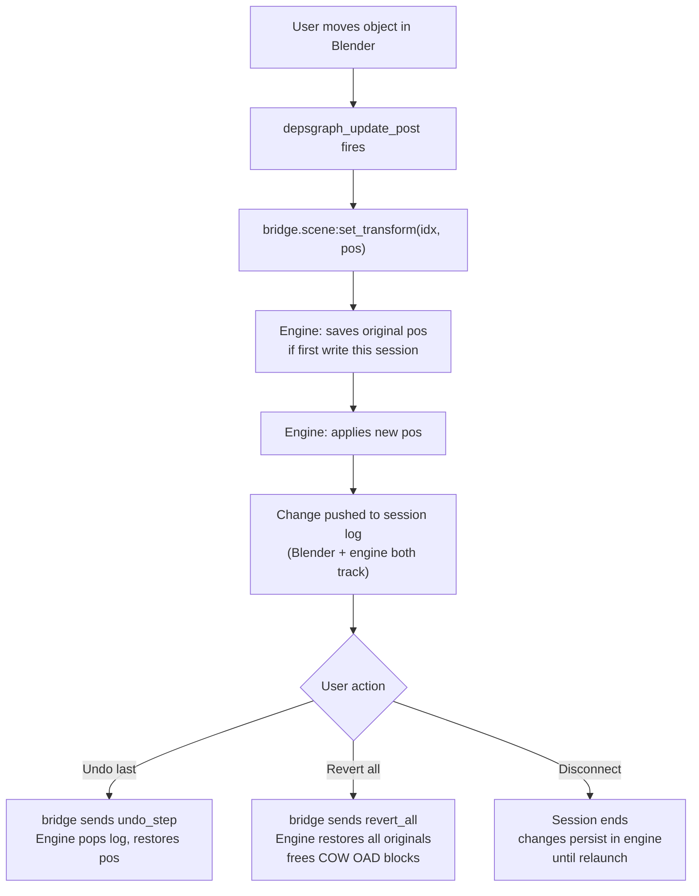

# Plan: Live Editor Bridge — play-in-editor, scene debugger, remote device debug

**Date:** 2026-04-29
**Status:** Phase 1 implemented. Phase 1.5 is analysis; Phase 2 redesign follows.
**Related:** `docs/plans/2026-04-29-blender-run-operator.md`, `docs/investigations/2026-04-29-blender-game-engine-removal.md`

---

## Problem

The "Run in Engine" operator closes the *launch* gap (one click instead of three terminal commands) but the *iteration* loop is still: edit → click → wait for build → game restarts → find the problem again → repeat.

The right model is a **bidirectional network bridge** between the running engine binary and Blender — the same basic concept Unity and Unreal use for their editor play modes, adapted to the WF architecture where the editor and runtime are separate processes.

---

## Architecture overview



**Protocol:** newline-delimited JSON over TCP. Each message is one line ending in `\n`. Simple enough to debug with `netcat`, trivial to implement in both Python and C++.

**Object identity:** WF has no named actors; actors are identified by integer index (`idxActor`, 1-based). The Blender side maintains an `idx → object name` map built during export.

**Threading model (engine side):** `DebugServer` runs on its own thread. It pushes `PendingUpdate` structs into a `std::queue` protected by a `std::mutex`. The main game loop calls `DebugServer_DrainQueue()` at the top of each frame, applies all pending changes, then `DebugServer_BroadcastState()` sends positions to connected clients at ~10 Hz. The engine never blocks on the network.

**Threading model (Blender side):** a background thread maintains the socket connection. Property-change callbacks on Blender's `depsgraph_update_post` hook push deltas to a send queue. Incoming engine messages arrive on the background thread and schedule a Blender timer callback to update the UI.

---

## Phase 1: Live Debug Bridge (MVP) — IMPLEMENTED 2026-04-29

### What you can do

| Action | How |
|---|---|
| Launch with debug port | `wf_game -Lwflevels/snowgoons.iff --debug-port 7777` |
| Connect from Blender | "Connect" button in Properties > Scene > WF Live Bridge panel |
| Teleport an object | Move object in Blender 3D view → `scene:set_transform` → engine applies next frame, no restart |
| Watch live positions | Objects in Blender update to reflect runtime positions at ~10 Hz |
| Read engine log | Engine's log messages stream to Blender's Info bar |

### Protocol messages (Phase 1)

**Blender → Engine:**

```json
{"op": "scene:set_transform", "idx": 3,   "pos": [1.2, 0, 5.1]}
{"op": "scene:set_prop",      "idx": 3,   "key": "Speed",   "value": 3.5}
{"op": "ping"}
```

**Engine → Blender:**

```json
{"op": "state", "idx": 3, "pos": [1.2, 0, 5.1]}
{"op": "log",   "level": "info", "idx": 3, "msg": "touched ground"}
{"op": "error", "msg": "actor not found", "idx": 99}
{"op": "pong"}
```

### Engine-side implementation

**New class: `DebugServer`** (`engine/stubs/debug_server.h` + `debug_server.cc`)

Follows the same pattern as `rest_api.cc`: background listener thread, mutex-protected `std::queue<PendingUpdate>`, drained by the game thread each frame.

`DebugServer_DrainQueue(Level&)` drains the queue, calls `actor->setCurrentPos(pos)` for transforms. OAD property writes are acknowledged but not yet applied (Phase 2 wires the property name→offset map).

`DebugServer_BroadcastState(Level&)` iterates `GetObjectList()`, collects positions, rate-limits to every 6th frame call (~10 Hz at 60 fps), and sends one `{"op":"state"}` line per live actor.

**Flag:** `-DWF_DEBUG_BRIDGE` (default on). Disable with `WF_DEBUG_BRIDGE=0 bash engine/build_game.sh`.

### Blender-side implementation

**New file: `wftools/wf_blender/debug_bridge.py`**

`DebugBridge` singleton with background thread, send queue, idx↔name mapping, and per-message dispatch. Blender-safe UI updates go through `bpy.app.timers`.

**New panel: `WF_PT_live_bridge`** in `panels.py` (under the scene panel). States across phases:

```mermaid
stateDiagram-v2
    direction LR
    [*] --> Disconnected

    state "Disconnected" as D {
        note: ○ Not connected\nHost: [localhost]  Port: [7777]\n[ Connect ]
    }
    state "Error" as E {
        note: ⚠ Connection refused (localhost:7777)\n[ Connect ]
    }
    state "Connected — Phase 1" as C1 {
        note: ● Connected localhost:7777  [ Disconnect ]\nFrame 4231 | 16.4 ms\n[✓] Sync transforms (10 Hz)
    }
    state "Connected — Phase 2" as C2 {
        note: ● Connected localhost:7777  [ Disconnect ]\nFrame 4231 | 16.4 ms\n[ Pause ] [ Step ] [ Resume ]\n[✓] Sync transforms  [✓] Physics overlays
    }
    state "Connected — Phase 3" as C3 {
        note: ● Connected  [ Disconnect ]\nFrame 8320 | 16.2 ms  Changes: 7\n[ ↩ Undo last ] [ ✕ Revert all ]\n[ Pause ] [ Step ] [ Resume ]
    }
    state "Paused" as P {
        note: ⏸ PAUSED  Frame 4231\n[ Step ] [ Resume ]
    }

    D --> C1  : connect (Phase 1)
    D --> E   : connect fails
    E --> D   : retry
    C1 --> D  : disconnect / error
    C1 --> C2 : upgrade (Phase 2)
    C2 --> P  : pause op
    P --> C2  : resume op
    C2 --> C3 : upgrade (Phase 3)
    C3 --> D  : disconnect / revert
```

Phase 4 script debugger sub-panel (separate `WF_PT_script_debugger`):

```mermaid
stateDiagram-v2
    direction LR
    [*] --> Idle
    state "Idle" as I {
        note: No active breakpoint
    }
    state "Paused at breakpoint" as BP {
        note: ● PAUSED at on_jump (crate_02 / idx 7)\nMailboxes:\n  EMAILBOX_LOCAL_0 = 3.14\n  EMAILBOX_LOCAL_1 = 0.0\n[ → Step ]  [ ▶▶ Resume ]  [ ✕ Clear ]
    }
    I --> BP  : engine hits set_breakpoint label
    BP --> I  : resume / clear breakpoint
    BP --> BP : step (advances one frame, stays paused)
```

**`depsgraph_update_post` handler** (registered in `__init__.py`): when an object with a WF schema moves and a bridge is connected, sends `scene:set_transform`. When a WF property changes, sends `scene:set_prop`.

**New addon preferences:** `debug_host` (default `localhost`), `debug_port` (default `7777`).

### Verification (Phase 1)

1. `task run-debug -- wflevels/snowgoons.iff` — game launches, stderr shows `[debug] listening on :7777`
2. Open `wflevels/snowgoons/snowgoons.blend` → Properties > Scene > WF Live Bridge → Connect → status shows "Connected"
3. Move a Blender object → it teleports in the game window next frame
4. Object positions in Blender drift-update at ~10 Hz as the player walks around

---

## Phase 1.5: Compare to Unity/Unreal — inform Phase 2 design

Before extending the bridge, understand what Unity and Unreal actually do and whether WF should adopt any part of it.

### How Unity Play Mode works

Unity Play Mode is **in-process**: the Editor and runtime share the same C# VM (Mono/IL2CPP). When you hit Play:

1. Unity serializes the entire scene hierarchy to an in-memory blob using its own `SerializedObject` format.
2. The Play Mode domain reloads C# scripts (or skips reload with "Enter Play Mode Options" for faster iteration).
3. The runtime runs in the same process as the editor — no network, no IPC, shared heap.
4. When you exit Play Mode, Unity deserializes the original scene state back, discarding all runtime changes.

**Live editing during play:** Yes — you can change properties while Play Mode is running. Unity's Inspector writes directly into the live `MonoBehaviour` fields in memory (no protocol, no round-trip). Move an object in the Scene view: it teleports immediately in the running game. The catch: all of this happens in the *serialized-then-restored* scene copy. When you exit Play Mode, Unity restores the pre-play state — so the runtime changes are **automatically discarded**. If a change worked and you want to keep it, you have to note it and re-apply it in editor mode manually. Unity has no "push this PIE change back to the editor world" workflow for transforms (it does for some component properties via a right-click option in specific cases).

**Remote debugging:** Unity uses the Mono debugger protocol (a variant of DAP — Debug Adapter Protocol) over TCP for attaching a C# debugger. This is code-level debugging (breakpoints, variable inspection), not game-state editing.

**Unity Remote / Remote Play:** a separate app-level protocol for previewing on device. Not exposed publicly; uses USB/WiFi mirroring at the display level, not scene-state level.

### How Unreal PIE (Play In Editor) works

Unreal PIE is also **in-process** (or optionally a separate process via "Standalone Game"):

1. The world is **duplicated** in memory — a clean copy is made so the original editor world is untouched.
2. The duplicated world runs normally; all Actors and Components live in the Engine's UObject graph.
3. Live editing during PIE: yes. The Details panel modifies the duplicated world's UObjects directly (no protocol, shared memory). Moves, property changes, and Blueprint edits take effect immediately. Unreal has one feature Unity lacks: right-click → "Keep Simulation Changes" pushes a runtime property value back into the editor world after the fact — useful for tweaking positions until they look right, then keeping them.
4. On Stop, the duplicated world is destroyed; the editor world is unchanged (except for any explicitly kept simulation changes).

**Unreal Live Link:** a separate plugin-based streaming framework for bringing external data into UE (motion capture, face tracking, cameras). It has a plugin SDK but not a public stable protocol — it's designed to write custom Live Link source plugins in C++. Not relevant to editor-play integration.

**Unreal Insights:** profiling tool with its own TCP-based protocol for telemetry. Again, not a general scene-editing protocol.

### Is there a standard protocol WF could adopt?

The broader landscape of remote debugging protocols:

| Protocol | Layer | Relevant to WF? |
|---|---|---|
| **GDB Remote Serial Protocol (RSP)** | CPU: registers, memory, breakpoints | No — too low-level; targets native code, not game state |
| **DAP (Debug Adapter Protocol)** | Code: breakpoints, step, variable inspection | **Yes for Phase 4** — worth adopting for script debugging |
| **Chrome DevTools Protocol (CDP)** | JavaScript: V8 / QuickJS debugging | **Yes for Phase 4** — QuickJS has a CDP-compatible debug server built in |
| **Lua MobDebug protocol** | Lua: breakpoints, coroutines, table inspection | Yes for Phase 4 Lua-specific path |
| **Godot remote debugger** | Code + game state: breakpoints, live-edit properties, spawn/remove nodes, scene tree | **Yes for op naming** — schema has `scene:set_object_property`, `scene:live_create_node` etc.; adopt naming convention, not wire format |
| **Unity/Unreal** | In-process shared memory | Not portable to WF's architecture |

**GDB RSP** — the original remote debugging standard (1990s). Binary protocol over TCP or serial port; used by JTAG debuggers, QEMU, OpenOCD. Covers registers, memory reads/writes, software breakpoints, single-step. Not designed for application-level concerns (no concept of "set property X on object Y"). Not relevant for the game-state bridge.

**DAP (Debug Adapter Protocol)** — Microsoft's open standard (Apache-2.0), used by VS Code, Neovim, Emacs, and most other modern editors. JSON-RPC over stdin/stdout or TCP. Covers: launch/attach, breakpoints, step/continue/next, stack frames, variable inspection, evaluate expressions. Clients (editors) and servers (language runtimes) talk through a well-specified schema. **WF should adopt DAP for Phase 4 script debugging.** Why: users get VS Code breakpoints and variable inspection for free, without WF writing any editor plugin. The DAP server lives in wf_game; the client is VS Code. The bridge and DAP are complementary — DAP does code, the bridge does game state.

**CDP (Chrome DevTools Protocol)** — the protocol used by V8, Node.js, and Chromium for JavaScript debugging. Also used by QuickJS: QuickJS includes a built-in CDP-compatible debug server (`qjs --debugger`). If WF's QuickJS scripting stub exposed this server, users could attach Chrome DevTools or VS Code directly to running scripts. No custom implementation needed — just enable the QuickJS debug server on the right port.

**Godot remote debugger** — Godot runs the game in a separate process and communicates with the editor via TCP, which is architecturally the closest match to WF's bridge. Wire encoding is Godot's binary Variant format (4-byte length-prefixed arrays, default port 6007) — but the **message schema** is what matters.

Godot's schema has two distinct layers, which turns out to be directly relevant to WF:

**Code-debugging ops** (editor → game): `step`, `next`, `out`, `continue`, `break`, `breakpoint`, `get_stack_dump`, `get_stack_frame_vars`, `evaluate`, `reload_scripts`. These map onto Phase 4 (DAP is still the better choice here since it's editor-agnostic).

**Scene/live-editing ops** (editor → game): `scene:set_object_property`, `scene:set_object_property_field`, `scene:live_node_call`, `scene:live_create_node`, `scene:live_remove_node`, `scene:live_duplicate_node`, `scene:live_reparent_node`, `scene:request_scene_tree`, `scene:inspect_objects`. These are exactly the Phase 2/3 game-state ops.

**Game → editor broadcasts**: `output` / `error` (log), `stack_dump`, `stack_frame_vars`, `evaluation_return`, per-frame profiling data. The scene-tree response carries the full node hierarchy.

**Mapping to WF ops:**

| WF bridge op | Godot equivalent |
|---|---|
| `scene:set_prop` | `scene:set_object_property` |
| `scene:set_transform` | `scene:set_object_property` (Transform property) |
| `spawn` | `scene:live_create_node` |
| `remove` | `scene:live_remove_node` |
| `pick` | `scene:inspect_objects` (closest analogue) |
| `state` broadcast | scene tree / profiling broadcasts |

**Decision:** WF adopts Godot's `scene:` namespace prefix for all scene-editing ops. Exact wire compatibility is not possible (binary Variant vs JSON, and Godot's object model doesn't map to WF's actor-index scheme), but using the same verb names makes the protocol legible to anyone who has worked with Godot's debugger. Phase 1 ops have been renamed accordingly (`scene:set_transform`, `scene:set_prop`); `ping`/`pong`/`state`/`log`/`error` remain bare as they are not scene ops.

**No established standard exists for game-state editing** — for the Phase 1/2 bridge concerns (transform sync, property writes, spawn/remove, position broadcast), there is no published open protocol. WF and Godot are the only two engines with out-of-process TCP game-state editing bridges. WF's TCP/newline-delimited JSON is the right shape, and well-positioned to become one:
- Simple enough to debug with `netcat`
- Works identically for local and remote (Android, future consoles)
- Not coupled to any particular editor
- Op names now aligned with Godot's schema where possible

**Is there any point in being protocol-compatible with Unity or Unreal?** No. Their protocols are internal, undocumented, and in-process. Wire-level compatibility with Godot is not worth the binary-encoding complexity — naming alignment is sufficient.

**Recommendation:** adopt DAP for Phase 4 script breakpoints; consider enabling the QuickJS built-in CDP server for QuickJS scripts specifically; adopt Godot's `scene:` op naming for Phase 2+ game-state ops; keep the Phase 1/2/3 bridge as newline-delimited JSON.

### What WF should take from this analysis

The key insight from both engines is that **live editing works because the editor has direct access to the live object graph.** WF's bridge approximates this through the network, which adds one-frame latency but enables the remote-device case (Android, future consoles) for free.

The feature gaps that matter are not protocol-level — they are **session control and determinism:**

| Feature | Unity PIE | Unreal PIE | WF Phase 1 | WF target |
|---|---|---|---|---|
| Editor scene isolated from runtime | Yes (serialized → restored on exit) | Yes (duplicated → discarded on exit) | Yes (separate process — free) | ✓ already |
| Runtime changes pushed back to editor | No | Manual ("Keep Simulation Changes", per-property) | No | Phase 3 |
| Pause / step / resume | Yes | Yes | No | Phase 2 |
| Click-to-select (pick ray) | Yes | Yes | No | Phase 2 |
| Property change latency | 0 (in-process) | 0 (in-process) | ~1 frame | Phase 2 |
| Remote device | Separate tool | Separate tool | Same protocol | ✓ already |
| Undo runtime changes | No | No | No | Phase 3 |

The "editor scene isolated from runtime" row deserves a closer look. Unity and Unreal go to considerable lengths — serializing or duplicating the entire world — specifically to protect the editor scene from runtime mutation. When Play ends, those runtime changes are **thrown away**. The "preservation" is of the *editor*, not the *runtime work*. It's defensive, not useful.

WF gets this for free: Blender and wf_game are separate processes, so the Blender scene is always isolated from what the engine does at runtime. No serialization pass needed.

Phase 3 targets the thing Unity/Unreal don't have: **pushing bridge changes back into the editor scene**. Unreal has a partial version (the "Keep Simulation Changes" right-click, per-property, manual) but it's a workaround for a limitation of their in-process model. WF's bridge is an explicit developer-intent channel — every message through it is an intentional edit — so replaying those changes back into Blender (or undoing them) is fully tractable.

Phase 2 closes the "pause/step/resume" and "click-to-select" gaps, making iteration *deterministic*. Phase 3 adds bidirectional change tracking — which Unity and Unreal don't have at all.

---

## Phase 2: Session control + object inspector

### Pause / step / resume

```json
{"op": "pause"}
{"op": "step",   "frames": 1}
{"op": "resume"}
```

Engine: a `_paused` flag in `DebugServer` checked at the top of the game loop. When paused, only the bridge drain runs — physics and scripts don't tick. This makes property tweaking deterministic: change a value, step one frame, observe the result.

### Object inspector: click in game → select in Blender

```json
{"op": "pick", "screen_x": 400, "screen_y": 300}
{"op": "picked", "idx": 3}
```

The engine does a physics raycast from the screen position, responds with the actor index. Blender selects the matching object in the scene.



### Property writes wired to OAD block (copy-on-write)

Phase 1 acknowledges `scene:set_prop` but doesn't apply it.

The key complication: OAD block data (`_oadData`, `CommonBlock::_commonBlockBase`) is shared read-only memory loaded from the IFF. Many actors with the same OAD values share the same underlying page — it's a flyweight compression scheme that works both on disk and in RAM. Writing into a shared page would corrupt every other actor that points to it.

Phase 2 must implement **copy-on-write** for bridge-modified actors:

1. On the first `scene:set_prop` for an actor, allocate a fresh copy of its OAD block (from `HALLmalloc` or a dedicated bridge pool).
2. Update `_oadData` and `CommonBlock::_commonBlockBase` on that actor to point to the new copy.
3. Write the new property value at the correct byte offset (derived from the OAD struct layout, which is available from the exported `.ht` file).
4. Values take effect on the next frame without any reconstruction.

Track which actors have been COW-copied so they can be freed on session end or level reload. Properties that have been modified are flagged as "bridge-overridden" so the game can detect unsaved state.

### Physics visualization in Blender viewport

Engine broadcasts collision shapes alongside transforms:

```json
{"op": "physics_debug", "idx": 3, "aabb": [...], "velocity": [...]}
```

Blender `SpaceView3D` draw handler renders wireframe boxes and velocity arrows using `gpu_extras.batch`. Toggle in the WF Live Bridge panel.

---

## Phase 3: Undo of runtime changes

Unity PIE and Unreal PIE both discard runtime changes when you exit Play Mode — the editor world is never modified. WF can do better: track every change made via the bridge and offer step-back undo.

### How it works

The engine maintains a **session change log**: for each actor modified via the bridge, it saves the original state (position and — once Phase 2 COW is done — original OAD block pointer) on first modification. Changes are pushed to a stack.

```json
{"op": "undo_step"}
{"op": "revert_all"}
```

`undo_step` pops and reverses the last bridge command. `revert_all` restores every modified actor to its pre-session state and clears the COW-allocated OAD blocks.

### Blender panel (Phase 3)

The undo stack is shown in the bridge panel (see Phase 1/2 state diagram above — "Connected Phase 3" state). The change-log flow:



### What can be undone

| Change type | Undoable? | Notes |
|---|---|---|
| Transform (teleport) | Yes | Save original `currentPos()` before first bridge write |
| OAD property | Yes | Save original OAD block pointer before COW (Phase 2 dependency) |
| Spawn (template object) | Yes | `SetPendingRemove` on the spawned actor |
| Remove | Partial | Actor is gone — remove is only undoable if the engine deferred the actual deletion until after the bridge session |
| Script hot-swap | No | Interpreter state already advanced; mailboxes are intact but script body is replaced |
| Class-name change | No | Not possible via bridge; requires relaunch anyway |

### Session state preservation

When the bridge disconnects (or the user hits "Revert all"), the engine broadcasts a final `{"op": "reverted"}` message so Blender can refresh object positions from the engine's restored state.

---

## Phase 4: Full remote debug

### Shader hot-reload

```json
{"op": "set_shader", "name": "terrain", "vert": "...", "frag": "..."}
```

Engine recompiles the shader on the main thread (where the GL context lives) at the top of the next frame. On error, the previous shader stays active and an error goes back to Blender.

### Script breakpoints (consider adopting DAP here — see Phase 1.5 analysis)

```json
{"op": "set_breakpoint", "idx": 3, "label": "on_jump"}
{"op": "break",          "idx": 3, "label": "on_jump"}
{"op": "step"}
{"op": "resume"}
```

When the engine hits the labelled point in the script, it pauses and sends local mailbox state back. "Local variables" in WF scripts are stored in **mailboxes** — not interpreter stack frames — so they survive the breakpoint round-trip cleanly.

### Remote device debug

Same protocol, different IP:

```
wf_game -L level.iff --debug-port 7777 --debug-bind 0.0.0.0
```

Blender connects to the device IP instead of localhost. This is also how **CI smoke testing** works: a headless `wf_game` instance launches on a test server, a Python script connects, steps frames, reads back state, asserts expected values.

### Performance overlay

```json
{"op": "perf", "frame_ms": 16.2, "physics_ms": 2.1, "scripts_ms": 0.8,
 "draw_calls": 142, "actors": 38}
```

Live graph in the WF Live Bridge panel. Spikes are immediately visible while iterating on scripts or adding objects.

---

## Hard limits (things that require a relaunch)

> **These two cases cannot be solved by the bridge and require a full re-export + relaunch.**

### 1. Changing a live object's class

Which C++ subclass is instantiated for an actor is decided at construction time, when the level loads. You cannot turn a `Platform` into an `Actor` in a live session. Changing the OAD schema path on an object in Blender and pushing it through the bridge has no effect — the engine is already running the original subclass. **Requires: re-export + relaunch.**

### 2. Spawning an object whose type was not in the original level

The engine's generator/template system (`ConstructTemplateObject`) can only instantiate types whose templates were loaded from the original IFF. If a Blender object uses a class that wasn't present in the level at launch, there is no template to instantiate from. One path forward: allow the bridge to push a new `SObjectStartupData` blob over the wire to register a new template at runtime — feasible but requires a compact wire format for the OAD block and is gated on the property-write work in Phase 2.

---

## Additional limitations and differences vs. Unity/Unreal

| Limitation | Notes |
|---|---|
| **One-frame latency** on all edits | Unavoidable in an out-of-process model. Not perceptible for most iteration workflows. |
| **OAD blocks are shared read-only** | Per-actor property writes require copy-on-write: allocate a fresh OAD block for the actor, update its pointers, then write. Modifying the shared page directly would corrupt every other actor pointing to it. |
| **No undo of runtime changes** | Phase 1 only. Phase 3 adds `undo_step` / `revert_all` — which Unity and Unreal don't have at all (they discard runtime changes automatically on exit). |
| **Bridge changes not reflected back to Blender on disconnect** | The Blender scene is always isolated from the runtime (separate processes), so it's never corrupted. But changes made via the bridge (teleports, property edits) don't automatically flow back into the Blender scene. Phase 3 adds `revert_all` / undo_step, and a "apply session changes to scene" op. |
| **No animation blend state** | Live bone transforms (Phase 3) can override the blend tree but internal blend weights are not exposed. |
| **Script state** | "Local variables" in WF scripts are mailboxes, not interpreter stack frames — they survive script hot-swap cleanly. Only the interpreter's transient execution state (e.g. Lua coroutine continuation) is lost on hot-swap, which is acceptable for iteration. |
| **Class-name changes require relaunch** | See Hard limits above. |
| **Novel-type spawning without a template** | See Hard limits above. |

---

## Files Modified / Created

| Action | Path |
|---|---|
| **New** | `engine/stubs/debug_server.hp` |
| **New** | `engine/stubs/debug_server.cc` |
| Modify | `wfsource/source/game/game.cc` — include + Start/DrainQueue/BroadcastState/Stop calls |
| Modify | `wfsource/source/game/main.cc` — `gDebugPort` global + `--debug-port N` flag |
| Modify | `engine/build_game.sh` — `WF_DEBUG_BRIDGE` flag + compile step |
| **New** | `wftools/wf_blender/debug_bridge.py` |
| Modify | `wftools/wf_blender/__init__.py` — register `WF_PT_live_bridge`, `depsgraph_update_post` |
| Modify | `wftools/wf_blender/panels.py` — add `WF_PT_live_bridge` panel |
| Modify | `wftools/wf_blender/install.sh` — symlink `debug_bridge.py` |
| Modify | `Taskfile.yml` — add `run-debug` task |
| **New** (planned) | `docs/wf-live-bridge.md` — user manual |

---

## Verification (Phase 1)

1. `task run-debug -- wflevels/snowgoons.iff` — game launches, stderr shows `[debug] listening on :7777`
2. Open `wflevels/snowgoons/snowgoons.blend` → Properties > Scene > WF Live Bridge → Connect → status shows "Connected"
3. Move a Blender object → it teleports in the game window next frame
4. Object transforms in Blender drift-update at ~10 Hz to reflect runtime positions
5. Engine log messages appear in Blender's Info bar

---

## What this is not

- **An engine inside Blender.** The game runs in its own process; Blender is the editor. The bridge is a narrow data channel, not a shared heap.
- **Full state sync.** Not all engine state is observable: internal AI state, accumulated physics impulses, animation blend weights. Phases 2–4 add more; Phase 1 exposes transforms and log output.
- **Protocol-compatible with Unity or Unreal.** Their protocols are internal and in-process. WF's TCP/JSON bridge is the right shape for an out-of-process architecture, and it works identically for remote device debugging.
