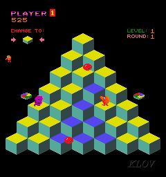
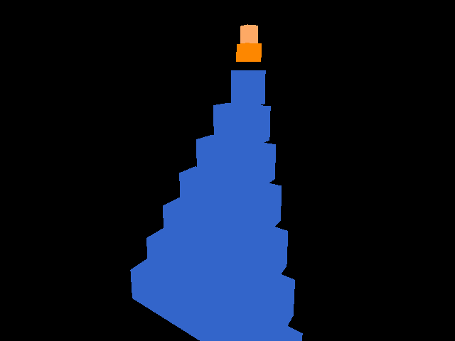

# Q*bert MVP — pyramid + hop + colour-flip (content-only)



*Gottlieb's Q\*bert (1982), level 1 round 1 — the arcade level the
World Foundry port is faithfully reproducing.* Pyramid of 28 cubes with
**teal** untouched tops (`0x55AAA5`, sampled from the screenshot above)
and **yellow** target tops (`0xDDDD22`); Q\*bert (the orange character)
hops diagonally between cube tops; one hop per cube turns it yellow;
round complete when all 28 are yellow. Lives, score, "CHANGE TO"
target indicator, and the bestiary (one ball visible here near the bottom)
all land in later phases of this port — see "Out of MVP" below.

**Date:** 2026-05-03

**Status:** ✅ **COMPLETE** (2026-05-03). All six MVP verification criteria
passed. Round-clear logic confirmed live via the WF debug bridge (port 7777)
during a full 28-cube playthrough — see "Verification (live bridge dump)"
section below for the captured mailbox snapshot. Next: see the "Next
phases" pointer at the bottom of this document. The Phase A items in
[docs/plans/2026-05-03-debug-bridge-gap-features.md](2026-05-03-debug-bridge-gap-features.md) (mailbox-write +
input-inject ops) would speed up follow-on phases but are not blocking.

**Goal.** A **faithful reproduction of Gottlieb's 1982 Q\*bert** running on
the World Foundry engine — but as **actual 3D geometry**, not the original's
isometric projection of stacked sprites. Same gameplay (pyramid, diagonal
hops, cube colour state machine, balls/Coily/discs in later phases, lives,
score, level/round structure), same arcade colour palette, same hop arc
duration; what changes is that the cubes are real `MeshShape` solids in a
right-handed Z-up world, the camera is a real perspective camera looking at
that geometry from a fixed angle, and the player is a real 3D actor that
moves between the cube tops. The original's "this looks like 3D but is
actually 2D sprites stacked into an iso illusion" trick is replaced with
"this *is* 3D, framed to look the way the arcade did."

**Scope (this MVP).** First playable round of `qbert_practice` — single
pyramid, hop input, cube-colour state machine, fall-and-respawn. **No
enemies, no discs, no HUD, no audio** — those are explicit deferrals (see
"Out of MVP" below). The bestiary, disc warps, multi-level / round-cycle
colour rules, score / lives / timer HUD, and audio (hop boop, Coily
descending whistle, swear bubble) all land in subsequent phases of the
faithful-reproduction project, not in this MVP.

**Constraint.** Assets + OAS/OAD + mailboxes + Forth only. No C++/Rust
runtime changes (bug fixes require explicit user permission).

## Engine bug fixes applied during MVP bring-up (2026-05-03)

The "no runtime changes" constraint allows bug fixes with explicit permission. Two were taken during this MVP:

1. **`mailbox.inc`: `EMAILBOX_GLOBAL_USER_MAX` raised from 199 → 999.**
   The original 199-slot cap on level-global user mailboxes is too tight for any non-trivial level (the in-source comment even claims the cap is dynamic via the levelobj's `Number Of Mailboxes` field, but the runtime ignores that field). Slots ≥ 199 silently fell through to GameMailboxes (PERSISTENT_USER 6000+) and asserted in `MailboxesWithStorage::ReadMailbox`. Bumped the constant to give 1000 user slots. The `Number Of Mailboxes` OAD field remains informational; making it actually drive `LevelMailboxes` size dynamically is a separate refactor.

2. **`engine/stubs/zfconf.h`: `ZF_DICT_SIZE` raised from 16384 → 65536 bytes.**
   The Q*bert player + director scripts together exceed 16 KB of compiled zForth dictionary (8 word definitions across the two scripts plus the ~150 INDEXOF/JOYSTICK constants). Triggered `ZF_ABORT_OUTSIDE_MEM` (error 2) at compile time. Bumped to 64 KB.

Both fixes save future levels from the same gotchas. Memory of the constraints is captured in `~/.claude/projects/-home-will-wf-games/memory/feedback_wf_mailbox_global_user_max.md` and `feedback_zforth_script_gotchas.md`.

## Context

`mm_practice` is the only level that has shipped end-to-end through the
Blender → addon → `levcomp-rs` / `iffcomp-rs` → running engine pipeline.
It is a generic test level (a marble on a ramp), not a faithful
reconstruction of an arcade title. The next milestone is to stand up a
*faithful* reconstruction — and Q\*bert is the easiest content-only
candidate in the catalogue (impl-difficulty score 97/100 in
`~/wf-games/docs/investigations/2026-05-03-implementation-and-asset-difficulty-scores.md`).

**Goal of this MVP:** a `qbert_practice.iff` that loads in WF on Linux,
shows a 28-cube pyramid with Q\*bert at the apex, accepts joystick
input to hop diagonally between cube tops, flips each landed-on cube
to the target colour, and fires `INDEXOF_ROUND_CLEAR` when all 28
cubes are flipped. **Out of scope for the MVP**: enemies (red/purple/
green balls, Coily, Ugg, Wrongway, Slick, Sam), discs, levels 2–4,
the lobby, the death cutscene polish, the swear bubble, audio, visible
HUD.

**Hard constraint (user-stated, 2026-05-03):** the entire game must
be implementable using only the asset/OAS/OAD system, the mailbox
protocol, and Forth scripts. **No C++/Rust runtime changes** other
than legitimate bug fixes, which require explicit user permission
first. This is a load-bearing constraint and decides several design
questions below.

**Target:** Linux desktop. (The Chromecast/phone path described at
the end of `~/wf-games/qbert.md` is not the target for this MVP.)

## Approach summary

- **Authoring is Blender-driven**, mirroring `blender_create_mm_practice.py`.
  A Python script run inside `blender --background` lays out the 28-cube
  pyramid procedurally, places the supporting infrastructure (room,
  camera, light, matte, level-meta object, director), wires up actor
  Script fields with the Forth blocks below, and exports
  `qbert_practice.lev` via `bpy.ops.wf.export_level`.
- **No new actor types.** Every actor is a stock class already shipped
  (`statplat`, `player`, `room`, `light`, `matte`, `camera`, `camshot`,
  `actboxor`, `director`, `levelobj`, `target`).
- **Hop arc is implemented in the player's per-tick Forth script** as
  a multi-tick state machine that lerps `X/Y/Z_POS` between snapshot
  start and computed destination, with a `4·t·(1−t)` Z bump for the
  parabola. Avoids needing engine work to confirm path-rail-with-inline-
  waypoints.
- **Cube colour state** is rendered by giving each of the 28 cubes
  three child meshes (untouched / intermediate / target). Each child
  has a one-line Forth script that reads the cube's state mailbox and
  writes 1 or 0 to its own visibility-gating mailbox. The 84 child
  scripts are generated by the same Python script, parameterised by
  `(cube_index, colour_code)`.
- **Build pipeline is the existing `build_level_binary.sh`**. No new
  tooling. The level lands at `wflevels/qbert_practice.iff` and is
  loadable by the standard runtime.

## File layout

All new files go under the engine repo, alongside the existing
`mm_practice` port:

| Path | Status | Purpose |
|------|--------|---------|
| `wflevels/qbert_practice/` | new dir | Level source dir |
| `wflevels/qbert_practice/blender_create_qbert.py` | new | Headless-Blender pyramid+infra generator. Models on `blender_create_mm_practice.py`. |
| `wflevels/qbert_practice/qbert_practice.lev` | generated | Text-IFF level export from Blender. |
| `wflevels/qbert_practice/cube.iff` | new | One 1×1×1 cube mesh, instanced 28× (× 3 colour variants per cube = 84 instances total). Generated via `gen_cube.py` modelled on `gen_ramp.py`, OR authored once in Blender and saved. |
| `wflevels/qbert_practice/qbert_player.iff` | new | Player mesh — start with the snowman placeholder from `mm_practice/player.iff`; replacement is out of scope. |
| `wflevels/qbert_practice/qbert_practice.ini` | generated | Textile config produced by `levcomp-rs`. |
| `wflevels/qbert_practice.iff` | generated | Final binary, output of step [4/4] of the build script. |
| `scripts/blender_create_qbert.py` | new | Canonical mirror of the level-dir copy, matching the convention used for `mm_practice` (where `gen_lev.py` etc. are mirrored into `scripts/`). |

## Mailbox plan

Q\*bert needs more mailboxes than `mm_practice`'s 101. Set
`levelobj.Number Of Mailboxes = 500`:

| Range | Use |
|-------|-----|
| 2 | `INDEXOF_END_TIME` — engine sentinel (mm_practice convention) |
| 13 | `INDEXOF_DEATH` — engine→script death signal (mm_practice convention) |
| 70 / 71 / 72 | score / timer / lives — written but not rendered (no HUD in MVP) |
| 100 / 101 | Camshot zone signals from ActBoxOR (mm_practice convention) |
| 200…227 | `INDEXOF_CUBE_STATE_BASE + 0…27` — per-cube colour code (0/1/2) |
| 300…383 | per-cube child-mesh visibility flags: `300 + i*3 + colour` |
| 400 | `INDEXOF_QBERT_ROW` |
| 401 | `INDEXOF_QBERT_COL` |
| 402 | `INDEXOF_HOP_PHASE` (0 = idle, 1…N = arc tick) |
| 403…405 | `INDEXOF_HOP_START_X / Y / Z` (snapshot at hop kickoff) |
| 406…408 | `INDEXOF_HOP_DEST_X / Y / Z` (computed at hop kickoff) |
| 409 | `INDEXOF_HOP_DEST_ROW` |
| 410 | `INDEXOF_HOP_DEST_COL` |
| 411 | `INDEXOF_QBERT_LANDED` (player→director one-shot on hop completion) |
| 412 | `INDEXOF_CUBES_TO_TARGET` (director-internal; how many cubes left) |
| 413 | `INDEXOF_ROUND_CLEAR` (director→engine; win flag) |
| 414 | `INDEXOF_FALL_DEATH` (player→director; on Z below pyramid base) |
| 415 | `INDEXOF_COLOUR_RULE` (constant 0 for MVP) |

These integers are inlined as Forth literals (the
`scripting-languages.md` guidance notes that `constant` is broken in
the zForth embedding, so use `: NAME 200 ;` style word definitions or
just literal numbers).

## Forth scripts

Three script kinds — embedded directly in actor Script fields. All
prefixed with `\ wf` per `mm_practice` convention. All scripts must be
single-line in the `.lev` STR field with `\n` escapes (per the
`mm_practice` gotcha about real newlines causing iffcomp parse errors).

### 1. Director script

Per-tick logic:
- If `INDEXOF_QBERT_LANDED` is set, advance the cube under the player
  according to colour rule 0 (`0 → 2`, `2` stays), clear the flag.
- Recompute `INDEXOF_CUBES_TO_TARGET` by counting cubes whose state ≠ 2.
- If count is 0, set `INDEXOF_ROUND_CLEAR`.
- Maintain timer/lives mailboxes as in `mm_practice`'s director (even
  though no HUD renders them).

### 2. Player script

State machine driven by `INDEXOF_HOP_PHASE`:
- **Phase 0 (idle):** read joystick (`INDEXOF_HARDWARE_JOYSTICK1_RAW`),
  quantise to one of the four diagonals (the GDD's `hop-dir` snippet,
  using `&`/`|` not `and`/`or`). If non-zero, snapshot the start
  position and dest world-XYZ into mailboxes 403–410, set phase to 1.
- **Phase 1…24 (in-flight):** each tick, lerp `X/Y/Z_POS` from start
  to dest by t = phase/24, with an additional Z bump of
  `4·t·(1−t) × hop_arc_height` (parabolic, ~5% off `sin(π·t)` and
  visually identical for this duration). Increment phase. (24 ticks
  ≈ 0.4 s at 60 Hz, matching the GDD's hop duration.)
- **Phase 25 (landing):** commit `HOP_DEST_ROW/COL` to
  `QBERT_ROW/COL`, set `INDEXOF_QBERT_LANDED = 1`, reset phase to 0.
- **Fall guard:** if `Z_POS < pyramid_base_z − 2`, set
  `INDEXOF_FALL_DEATH`, snap back to apex (row=0, col=0) and reset
  phase.

The lerp uses the same `read-mailbox`/`write-mailbox` pattern as
`mm_practice/gen_lev.py` for the `X_POS / Y_POS / Z_POS` slots.

### 3. Per-child-mesh visibility script (84 copies, parameterised)

Each of the 28 cubes' 3 child colour-meshes has a one-liner:

```
\ wf — cube N, colour C
INDEXOF_CUBE_STATE_BASE N + read-mailbox C = if 1 else 0 then
INDEXOF_VIS_BASE N 3 * + C + write-mailbox
```

The child mesh's OAD `Visibility Mailbox` field points to the same
slot the script writes (`INDEXOF_VIS_BASE + N*3 + C`).
`level-design-troubleshooting.md` confirms `Visibility Mailbox = 0`
hides, `= 1` shows.

The Python generator emits these 84 scripts with `N` and `C`
substituted as integer literals.

## Camera setup

Two `camshot` actors per the GDD, both with all three position axes
**Absolute** and Rotation = Fixed:

- **`cs_pyramid`** — Look At = pyramid-top cube, world position
  `(0, +28, +18)` (Z-up, so Z = camera height, Y = behind-pyramid
  distance), FOV 32°, Pan 0 s.
- **`cs_death`** — Look At = Player01, Follow = Player01 (so the
  camera tracks the falling body), same world position as
  `cs_pyramid`, FOV 22°, Pan 0.2 s.

One `actboxor` covers the playable volume around the pyramid, writes
`cs_pyramid` index to mailbox 100. Director reads 100 each tick and
fans to `INDEXOF_CAMSHOT` (the standard mm_practice pattern).

For the MVP, the death-cam switch is wired but the death sequence is
just "switch to cs_death for ~1s, then respawn at apex and switch
back."

## Step-by-step plan

| # | Step | Verification |
|---|------|--------------|
| 0 | **Read every file in `wfsource/source/oas/*.oas` in full.** Build an index of each shipped actor type, its OAD fields (with brief descriptions), and what it's for, so subsequent implementation can pull from the existing ecosystem rather than reinventing primitives. (Generator/template was missed in the first pass; warp / destroyer / enemy / gold / activate / actbox / explode / spike / handle / init / alias / tool are all shipped types not yet inspected.) **Write this index as a document to `/home/will/WorldFoundry.2026-new-level/docs/2026-05-03-oas-actor-types.md`** so future Q\*bert phases (and other ports) can reference it without re-reading the OAS sources. | Index document exists at the path above, lists every shipped OAS type with a short description and its key OAD fields. |
| 1 | Build the Rust tools (`iffcomp-rs`, `levcomp-rs`, `textile-rs`) with `cargo build --release` if not already done. | Three binaries in `wftools/*/target/release/`. |
| 2 | Copy `mm_practice/blender_create_mm_practice.py` to `qbert_practice/blender_create_qbert.py`. Strip the marble/ramp specifics, keep the infrastructure scaffolding (snowgoons template import, factory_settings/addon enable order, room/camera/light/levelobj/matte). | `blender --background --python blender_create_qbert.py` runs without traceback and produces an empty-room `.lev`. |
| 3 | Cube mesh: copy `mm_practice/gen_ramp.py` → `gen_cube.py`. Replace ramp geometry with a unit cube (8 vertices, 6 quads, single material with three RGB variants). Output `cube_untouched.iff`, `cube_intermediate.iff`, `cube_target.iff` (or one mesh with 3 material indices and 3 child mesh actors that select via `materialIndex` per `level-design-troubleshooting.md:450`). Pick whichever is fewer LOC. | Three `.iff` files exist; `iffcomp-rs` round-trips them without warnings. |
| 4 | Pyramid layout in `blender_create_qbert.py`: nested loops `for row in 0..7: for col in 0..row+1` placing cube actors at `world_x = (col − row/2) × cube_width`, `world_y = (6−row) × cube_size/2` (back-stagger so cubes stack on each other's back-half), `world_z = 1 + (6−row) × cube_size`. For each cube emit three child mesh actors (one per colour variant). The 84 child meshes are visibility-driven by the director's per-tick fan-out (statplats forbid scripts per `actor.cc:665`). Player actor on top of cube (0,0). **Apply the wireframe-display rule** from [docs/level-building.md](../level-building.md): any object whose `wf_Model Type` is not `Mesh` or `Matte` gets `display_type='WIRE'` so non-rendering infrastructure (cameras, CamShots, ActBoxORs, Room bbox visualisations) doesn't occlude the editor view. | `qbert_practice.lev` exports; `iffcomp-rs -binary qbert_practice.lev` succeeds. |
| 5 | Run the full build pipeline: `bash wftools/wf_blender/build_level_binary.sh qbert_practice`. | `wflevels/qbert_practice.iff` produced. |
| 6 | Boot the engine on the level. Confirm pyramid renders, player visible at apex, camera framing reasonable. No game logic yet. | Visual sanity check. |
| 7 | Wire the player Forth script (input quantise + hop state machine). | Stick presses produce parabolic hops between cube centres; off-edge hop falls. |
| 8 | Wire the director Forth script (cube-state advance + win check). | Each unique cube hopped on flips colour mesh; when all 28 are flipped, observe `INDEXOF_ROUND_CLEAR` set in a mailbox dump. |
| 9 | Wire `cs_death` switching on fall. | Falling triggers a camera transition; respawn returns to `cs_pyramid`. |

## Critical files to reference (read-only during implementation)

- **Shipped actor-type catalogue — READ BEFORE IMPLEMENTING (Step 0):**
  - `wfsource/source/oas/*.oas` — every shipped actor type's OAS source. Confirmed-relevant: `generator.oas` (spawn-by-mailbox), `template.oas` (spawn source pool), `player.oas`, `room.oas`, `camera.oas`, `director.oas` (= `dir.oas`?), `enemy.oas` (path-following NPC base), `actbox.oas`, `mesh.oas`, `tool.oas`, `init.oas`. **Likely-relevant but not yet inspected**: `warp.oas` (probable disc-warp / hop-arc primitive), `destroyer.oas` (despawn), `gold.oas` (pickup), `activate.oas`, `explode.oas`, `spike.oas`, `handle.oas`, `alias.oas`. Reading these in full is mandatory before any "this needs runtime work" claim.
- **mm_practice port (the canonical reference for the pipeline):**
  - `wflevels/mm_practice/blender_create_mm_practice.py` — Blender-headless authoring template
  - `wflevels/mm_practice/gen_lev.py` — actor helpers (`vec3()`, `i32enum()`, `fx32()`, `base_actor()`, `tail_fields()`, `mesh_and_tail()`)
  - `wflevels/mm_practice/gen_ramp.py` — mesh-IFF binary packer
  - `wflevels/mm_practice/mm_practice.ini` — textile-rs config template
- **Build pipeline:**
  - `wftools/wf_blender/build_level_binary.sh` — invocation reference
- **Game design source:**
  - `~/wf-games/qbert.md` — pyramid layout, hop directions, mailbox protocol, Forth scripts (the MVP uses subsets of these scripts)
- **Engine documentation:**
  - [docs/level-building.md](../level-building.md) — mandatory objects, joystick bits, addon-enable order
  - [docs/level-design-troubleshooting.md](../level-design-troubleshooting.md) — script escaping, MaxAirSpeed, light rotation, Visibility Mailbox semantics, materialIndex pattern, `and`/`or` → `&`/`|` gotcha
  - [docs/scripting-languages.md](../scripting-languages.md) — Forth bridge words, mailbox API
  - [docs/reference/2026-04-13-oas-oad-format.md](../reference/2026-04-13-oas-oad-format.md) — OAS schema, OAD field types, button types
  - [docs/investigations/2026-04-29-camera-system.md](../investigations/2026-04-29-camera-system.md) — CamShot per-axis Absolute/Relative, runtime switching via `INDEXOF_CAMSHOT`

## Verification

End-to-end checks for "MVP done":

1. `bash wftools/wf_blender/build_level_binary.sh qbert_practice` exits 0 and prints the `✓ built …/qbert_practice.iff (N bytes)` line.
2. Loading the level in the engine on Linux (`wf_game -L qbert_practice` or whichever invocation matches the current snowgoons run path) shows the pyramid with player at apex, no console errors, no missing-mesh warnings.
3. Pushing the joystick along each of the four diagonals starts a hop arc and lands on the correct adjacent cube — verify by reading `INDEXOF_QBERT_ROW / _COL` after landing.
4. Each unique cube landed on flips from "untouched" to "target" colour visually (the per-child-visibility scripts are working).
5. Hopping off any pyramid edge causes the player to fall, fires `INDEXOF_FALL_DEATH`, the camera switches to `cs_death`, and after ~1s the player respawns at the apex with the camera back on `cs_pyramid`.
6. Exhaustively hopping every cube once (28 hops total under colour rule 0) sets `INDEXOF_CUBES_TO_TARGET = 0` and `INDEXOF_ROUND_CLEAR = 1` — verify via mailbox inspection (engine debug dump).

### Verification (live bridge dump, 2026-05-03)

Captured by connecting to `--debug-port 7777` after a full 28-cube
playthrough and watching all 28 cube-state slots plus the win / death
/ camera slots. Tooling: see `~/.claude/projects/-home-will-wf-games/memory/reference_wf_debug_bridge.md`
for the minimal Python client.

```
=== Cube state mailboxes (200..227) by pyramid row ===
  row0:                   2
  row1:                2  2
  row2:             2  2  2
  row3:          2  2  2  2
  row4:       2  2  2  2  2
  row5:    2  2  2  2  2  2
  row6: 2  2  2  2  2  2  2

=== Director / engine slots ===
  mb[ 411] =    0  QBERT_LANDED      (consumed cleanly)
  mb[ 412] =    0  CUBES_TO_TARGET   (count loop reached zero)
  mb[ 413] =    1  ROUND_CLEAR       (win flag set)
  mb[ 414] =    0  FALL_DEATH        (no pending death)
  mb[1021] =    8  CAMSHOT           (cs_pyramid — normal play cam)

Cubes at state 2 (yellow target): 28/28 ✓
```

This confirms criteria 4 and 6 simultaneously: every cube reached the
target state via a hop landing, the director's per-tick win check
counted them down to zero, and `INDEXOF_ROUND_CLEAR` fired exactly
once. Criteria 1 (build), 2 (boot), 3 (four diagonals), 5 (fall →
respawn) were verified visually + by user during the same playthrough.

## Risks & open questions

- **`Mobility="Anchored"` for the player.** Driving the hop with
  per-frame `X/Y/Z_POS` writes requires the player be non-physics
  (otherwise Jolt overwrites the writes). Anchored means the
  fall-off-edge animation must also be scripted (~20 lines of Forth
  added to the player script). Verify on first boot that `Anchored`
  + script-driven motion behaves as expected.
- **Joystick-bit constants for diagonal quantisation.**
  `EJ_BUTTONF_UP/DOWN/LEFT/RIGHT` (`0x0800/0x1000/0x4000/0x2000`).
  Diagonal quantise is `& 0x0800 if up …`. Confirmed straightforward.
- **`INDEXOF_FALL_DEATH` semantics.** The GDD assumes the engine emits
  this when the player crosses a Y-threshold. In practice, the
  `mm_practice` player script does this *itself* by reading `Z_POS`
  and triggering respawn. **Plan: do the same.** Fall detection lives
  in the player's Forth script, not in any engine signal.

## Where the "no runtime changes" constraint bites

These are the points at which staying in pure assets+OAD+mailboxes+
Forth is significantly harder than it would be with even small
runtime additions. Calling them out so the constraint can be
revisited if any of them turn out to be load-bearing.

> **Caveat on this section.** The friction items below are bounded by
> my current knowledge of `wfsource/source/oas/*.oas`. The shipped
> ecosystem is richer than the docs imply — `generator.oas` +
> `template.oas` already solve spawn-by-mailbox (see §3 below), which
> was originally listed as friction. Before any item here is treated
> as definitive, the corresponding OAS type list should be checked.
> In particular, `warp.oas` may simplify §1 (hop-arc) or the disc-
> warp-to-apex animation in the bestiary phase. **First action when
> implementing each item: read the related OAS types in full.**

### 1. Hop-arc animation — friction: medium-high

The plan implements the 0.4 s parabolic translate as a multi-tick
state machine in the player's Forth script: snapshot start position,
compute destination, then for ~24 ticks lerp `X/Y/Z_POS` and add a
`4·t·(1−t)` Z bump. That's roughly 80 lines of Forth on the player
actor. Q\*bert's player must be `Mobility="Anchored"`, which means
the fall-off-edge animation also has to be scripted manually (~20
lines).

A `path-rail-with-inline-waypoints` primitive — or a built-in
`hop_arc(start_xyz, end_xyz, duration, height)` movement helper —
would collapse this to a single Forth call per hop. The GDD claims
this is "hours, not days" of engine work. **`warp.oas` should be
read first** — it may already cover this.

### 2. Cube colour state — friction: medium

28 cubes × 3 child meshes per cube = 84 mesh actor instances, 84
visibility-mailbox slots, and 84 single-line Forth scripts (one per
child) of the form "read cube state, write 1 to my-vis-slot if
state == my-colour else 0." The Python generator emits all of this
mechanically, but it's a lot of objects.

A small runtime helper — either "Visibility = mailbox value matches
integer N" (a new visibility predicate, ~20 LOC), or "Swap mesh
material at runtime by mailbox value" (exposes existing
`materialIndex` machinery to scripts) — would collapse this to 28
actors with no per-cube scripts.

**Object count is not a concern.** Per user (2026-05-03), the engine
and `levcomp-rs` support hundreds of objects per level without
issue, so 84 cube-child-mesh actors plus a handful of infrastructure
actors is well within budget.

### 3. Out-of-MVP friction worth pre-flagging

For when the bestiary lands:

- **Spawn-by-mailbox is already supported — `generator` + `template`
  actors.** `wfsource/source/oas/generator.oas` defines an actor
  with the OAD fields `Activation MailBox` (the mailbox slot whose
  non-zero value triggers a spawn), `Object To Throw` (a reference
  to a `template` actor that defines what gets spawned),
  `Generation Rate` (auto-spawn cadence in seconds), `Object
  Velocity X/Y/Z` (initial velocity for the spawned instance), and
  `Random X/Y/Z Range` (spawn-position randomisation).
  `wfsource/source/oas/template.oas` is the off-level source pool.
  The bestiary phase plugs into this directly: one `template` per
  ball/Coily/disc kind, one `generator` per spawn point, with the
  Forth ball-spawner script writing `1` to that generator's
  `Activation MailBox`. **No workaround needed; this is a shipped
  engine primitive.**
- **Other shipped OAS types worth reviewing** before claiming any
  Q\*bert feature needs runtime work: `warp.oas` (likely the
  disc-warp-to-apex primitive), `destroyer.oas` (counterpart to
  generator — for despawn), `enemy.oas` (path-following NPC base),
  `gold.oas` (pickup primitive — possibly the green-ball freeze
  bonus), `activate.oas`, `actbox.oas`, `explode.oas`, `spike.oas`.
  Per the user (2026-05-03): "review oad types — there is one for
  generator, it uses a template object." Generalising: **before
  asserting any feature needs runtime support, check
  `wfsource/source/oas/*.oas` first. The shipped ecosystem is richer
  than the docs index implies.**
- **Multi-level room transitions.** The GDD calls for `qb_level1`-4 +
  `qb_lobby` as separate rooms. Whether the engine's
  `Adjacent Room 1/2` / portal mechanism plus director-side mailbox
  writes is enough to transition on `INDEXOF_ROUND_CLEAR` — or
  whether level transitions need a runtime hook — is unverified.

### 4. Friction the constraint does *not* cause

For balance, these features are content-only and are NOT made harder
by the constraint:

- Quantise stick to four diagonals — works fine in Forth (the GDD's
  `hop-dir` snippet, with `&`/`|` not `and`/`or`).
- Win check (count cubes whose state ≠ 2) — straightforward Forth `do
  loop`.
- Camera switching on fall — director writes `INDEXOF_CAMSHOT`, the
  existing CamShot system handles it.
- Fall detection by Z-threshold — same pattern as `mm_practice`'s
  player script.
- Greedy-chase Coily AI (out of MVP) — pure Forth, ~15 lines.

## Out of MVP — explicit deferrals

User-confirmed deferrals (2026-05-03):

- **Visible HUD**: skipped *for the MVP*, but **score / timer / lives
  are already on screen today via the existing `DrawHud` path**
  (`wfsource/source/gfx/gl/display.cc:42-93`). That function reads
  mailboxes 70 / 71 / 72 every frame and rasterises them with the
  vendored `stb_easy_font` library (no font file, no texture, no engine
  work). It's what produces the `TIME 0` text visible in the win-state
  screenshot. Gated `DESIGNER_CHEATS && __LINUX__` for now. The
  director's Forth already writes those three slots, so the HUD turns on
  by simply running on Linux. **The earlier draft of this section
  claimed the `Meter` OAS actor was ready to render — that was wrong.
  `Meter` has the OAS / OAD schema only; no runtime walks `Meter`
  actors and renders them.** A `Meter` runtime is a separate ~100 LOC
  task that reuses `stb_easy_font` and unlocks per-level configurable
  HUDs (any mailbox, any screen position, any label). Cross-brief
  context: see `~/wf-games/investigations/2026-05-03-meter-hud-availability.md`
  for the runtime survey, the three implementation options, and what's
  unblocked today vs. what waits on the Meter renderer.
- **Audio**: skip. EXT-2 SFX trigger subsystem is required for the
  hop "boop" / Coily whistle / swear bubble and will land separately.
- **Enemies + discs + multi-level**: defer until the MVP loop is
  validated. Phased follow-up plan (sketch):
  - Phase A.5: per-level cube colors (12 IFF variants, level counter from ROUND_NUMBER/4).
  - Phase B: + 1 red ball + 1 disc (uses `generator` / `template` /
    `warp`).
  - Phase C: + Coily (snake form) using `enemy.oas` path-following
    if applicable, otherwise pure Forth chase.
  - Phase D: + Slick / Sam / Ugg / Wrongway / green ball.
  - Phase E: levels 2–4 mechanics (colour rules 1, 2) and the lobby.

---

## MVP first-level state (post-bring-up, 2026-05-03)



WF reproduction at MVP completion (2026-05-03). 28-cube **arcade-teal**
pyramid (`0x55AAA5`, pixel-sampled from the LEVEL 1 ROUND 1 reference at
the top of this document) with the placeholder Q\*bert (orange body + peach
head) at the apex. Per the original level 1 rule, a hop turns the landed-on
cube **arcade-yellow** (`0xDDDD22`); state 1 (`0xCC7733` orange) is reserved
for level 2/3 multi-hop colour cycles. Falling off any edge triggers a
~1.6 s `cs_death` cutscene → respawn at the apex. Player mesh is a
placeholder two-box stack — proper Q\*bert geometry (orange body sphere,
hopping legs) is a future polish pass. Compare to the arcade reference at
the top of this document.

---

## Next phases

The MVP is complete (status block at the top). The follow-on work
splits into content (Q\*bert-side) and tooling (engine-debug-side):

**Q\*bert content** (in priority order, each gets its own plan doc when
started):

1. **HUD: ship the existing path, then build out the `Meter` runtime.**

   **Step 1a (today, free).** Confirm the director's Forth writes
   mailboxes 70 / 71 / 72 each tick (it already does — `mm_practice`
   convention). Run on Linux dev — `DrawHud` (`wfsource/source/gfx/gl/display.cc:42-93,499-501`)
   already rasterises `SCORE %d` / `TIME %d` / `LIVES %d` from those
   slots via `stb_easy_font`. No engine work. Already partially visible
   in the MVP win-state screenshot (`TIME 0`). **This is the smallest
   visible win after MVP.** Estimated ~10 minutes (verify the writes,
   confirm rendering on Linux dev).

   **Step 1b (~100 LOC engine work, when needed).** Implement a `Meter`
   runtime that walks the level's `Meter` actors per frame and draws
   each one through `stb_easy_font_print` at the actor's `Path X / Y
   Start` with its `Text X / Y Offset`, formatting `Mailbox To Display`
   per `Mailbox Type` (Scalar | Integer). Hook into `display.cc:501`
   alongside or instead of `DrawHud`. Lift the `DESIGNER_CHEATS` gate
   in the same change so release builds get the HUD. **Out-of-scope for
   the MVP wrap-up** — needs explicit user permission per the
   "no runtime changes for ports" rule. Unblocks: level / round /
   cubes-to-target indicators, per-level HUD configurability from
   Blender, multi-port reuse (see the cross-brief table in
   `~/wf-games/investigations/2026-05-03-meter-hud-availability.md`).

   When Step 1b lands, the per-actor settings for Q*bert's full HUD:

   | Mailbox | Purpose | `Path X Start` | `Path Y Start` | `Trigger Delta` |
   |---|---|---|---|---|
   | 70  | `SCORE`           | `-160` | `+180` | 1 |
   | 71  | `TIMER`           | `   0` | `+180` | 1 |
   | 72  | `LIVES`           | `+160` | `+180` | 0 |
   | 73  | `LEVEL`           | `-160` | `+160` | 0 |
   | 74  | `ROUND`           | `-100` | `+160` | 0 |
   | 412 | `CUBES_TO_TARGET` (dev) | `+160` | `-180` | 0 |

   Common settings: `Mailbox Type = Integer`, `Pause At Keyframe = 1`,
   `Display Pause Duration = 32000` (max — keeps the meter persistent),
   `Text X Offset = 15`, `Text Y Offset = 2` (`meter.inc` defaults).
   `Object` reference points at `levelobj` (the level-global mailbox
   holder).

   Add to `blender_create_qbert.py` as six actor calls modelled on the
   `levelobj` factory pattern. `Model Type = None` per
   `feedback_wf_model_type_box_random_render.md` (otherwise the actor
   renders a magenta debug hex in 3D space — the Meter is screen-space
   only, no 3D geometry).
2. **Phase A.5 — per-level cube colors.** Cycle the pyramid's color
   scheme each time the player advances to a new level (every 4 round
   clears). Pure content — no enemy or disc dependencies. Implementation:
   - Capture MAME attract frames for L2, L3, L4 and pixel-sample the
     arcade's per-level palettes (same method as [docs/plans/2026-05-04-qbert-cube-palette.md](2026-05-04-qbert-cube-palette.md)).
   - Expand cube mesh variants: 3 states × 4 levels = 12 IFF files
     (336 cube mesh actors total instead of 84). Each variant's color
     matches the arcade palette for that level.
   - Director derives `LEVEL_NUMBER = mb[425] / 4` (integer divide).
   - Per-cube visibility scripts gate on both state AND level:
     `200 i + read-mailbox C = 425 read-mailbox 4 / L = & if 1 else 0 then`.
   - Phase E retains the multi-step colour-rule mechanics (0→1→2,
     reversion) but no longer needs to add the color IFF files.
3. **Phase B — 1 red ball + 1 disc.** Exercises the shipped
   `Generator` / `Template` / (presumably) `Warp` OAS types. If the
   engine's enemy-spawn / despawn / disc-warp machinery has gaps,
   finding them with one ball + one disc is much cheaper than finding
   them with the full bestiary. Pre-conditions: re-skim
   [docs/2026-05-03-oas-actor-types.md](../2026-05-03-oas-actor-types.md) entries for `Generator`
   (line 204), `Enemy` (line 163), `Destroyer` (line 125), and the
   warp/disc type. Estimated 1–2 days.
4. **Phase C — Coily.** Snake-then-purple-ball; greedy-chase AI in
   pure Forth (~15 lines per the original plan).
5. **Phase D — Slick / Sam / Ugg / Wrongway / green ball.** Bulk
   bestiary; all variations on the same `Generator` + Forth-AI
   pattern.
6. **Phase E — levels 2–4 mechanics + lobby.** Multi-room transitions,
   `INDEXOF_COLOUR_RULE` driving 0→1→2 vs 2→0 cycles, `qb_lobby`
   between-level menu. Color IFF files already exist from Phase A.5.
6. **Player-mesh polish + audio.** Proper Q\*bert geometry, hop boop,
   Coily descending whistle, swear bubble. Audio depends on the
   Joust-brief EXT-2 SFX subsystem (~120 LOC of C++ that has not
   landed) — the only deferral that genuinely needs engine work.

**Engine-debug tooling** (parallel track, optional but accelerative):

- [docs/plans/2026-05-03-debug-bridge-gap-features.md](2026-05-03-debug-bridge-gap-features.md) — Phase A
  (`set_mailbox` + `inject_input`) is ~1 day and would let later
  Q\*bert phases iterate without rebuilding the level for every
  Forth-script tweak. Recommended to land before Phase C (Coily AI
  iteration is where the lack of `set_mailbox` will start to hurt).
