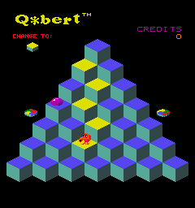
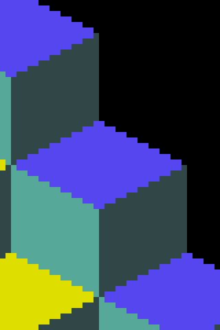

# Plan — Q✱bert per-face cube palette (arcade-faithful, ROM-verified)

## Context

User pointed out (2026-05-04) that our current cube renders are uniform single-colour blocks: every face the same RGB. In the arcade, each cube has multiple distinctly coloured faces — the iconic "stacked tilted blocks" silhouette. Our existing `gen_cube.py` produces flat-shaded uniform-colour cubes, and the existing palette memory note (`reference_arcade_museum_screenshots.md`) claimed L1R1 starting top is teal `#52A9A3` based on JPG eyeball samples. Both are wrong.

This plan replaces both the per-face structure and the palette values with **lossless ROM-rendered MAME PNG pixel samples** (authoritative — these are exactly the bytes the cabinet writes to its framebuffer).

## Reference screenshots (in repo)

All captured 2026-05-04 from MAME 0.264 against the vendored `assets/arcade-roms/qbert.zip` + `votrsc01a.7z`. PNG = lossless = authoritative pixel values.

### Cabinet instructions (rules of the game)


### Attract-mode demo gameplay (palette source)



### Cube structure zoom (face layout)



### Reference table

| Path | What it shows |
|------|---------------|
| `docs/plans/screenshots/qbert-arcade-instructions-reference.png` | Cabinet instructions screen — **the original cabinet's own rules-of-the-game text**. Frame 35 of attract-mode capture. |
| `docs/plans/screenshots/qbert-arcade-attract-gameplay-reference.png` | Attract-mode demo gameplay, mid-pyramid. Multiple cube states visible. **Primary palette source.** |
| `docs/plans/screenshots/qbert-arcade-attract-gameplay-2-reference.png` | Same scene, different beat. Cross-reference. |
| `docs/plans/screenshots/qbert-arcade-cube-zoom-reference.png` | 8× zoom of one purple-top cube. **Used to verify face boundaries pixel-by-pixel.** |
| `docs/plans/screenshots/qbert-arcade-level1-reference.jpg` (32126) | Old arcade-museum.com JPG. Kept for cross-reference; **not authoritative** — JPEG compression drifts the colours. |
| `docs/plans/screenshots/qbert-arcade-level1-mid-reference.jpg` (32127) | Old arcade-museum.com JPG. Same caveat. |

## Game rules (verified)

From the cabinet instructions screen (`qbert-arcade-instructions-reference.png`) and a 2026-05-04 Explore-agent research pass cross-referencing StrategyWiki + Pinball Land + GameFAQs:

- **L1 (all rounds 1–4)**: single-hop flip. State 0 → state 2 in one hop. No intermediate state, no reversion. Our existing director Forth (state 0 == 0 → set to 2 on LANDED) is **correct**.
- **L2**: 2-hop flip via intermediate state (0 → 1 → 2).
- **L3**: 1-hop, but revisiting a state-2 cube reverts it to 0.
- **L4**: 2-hop with revisit reversion (0 → 1 → 2; revisit → 1).
- **L5+**: full 3-state cycle.
- **Slick / Sam (green bouncing balls)** appear from L1R4. Mechanics unchanged.

The user's earlier observation that "the top is one colour, then yellow when q*bert lands" matches L1's single-hop rule exactly. **No apex pre-flip on spawn.**

## Verified palette (lossless pixel-sample of MAME PNG)

A 240×256 attract-mode-gameplay frame contains **only 13 unique colours** (matches Gottlieb hardware's 16-colour CLUT). Of those, the cube-relevant ones are:

| Hex | RGB | Pixel count | Role |
|-----|-----|-------------|------|
| `#5646EF` | (86, 70, 239) | 5822 | **Cube top — state 0 (untouched).** Purple/violet, not teal. |
| `#DEDE00` | (222, 222, 0) | 1755 | **Cube top — state 2 (target).** Yellow. (Was already correct in our `0xDDDD22` approximation.) |
| `#56A999` | (86, 169, 153) | 7195 | Cube side — **lit decoration** (left-front in iso). Teal. |
| `#314646` | (49, 70, 70) | 7209 | Cube side — **shadow decoration** (right side in iso). Dark teal. |
| `#000000` | (0, 0, 0) | 38914 | Background. |
| `#EF1021`, `#A900A9`, `#FF7700`, ... | — | small | Sprite colours (Q✱bert, Coily, Slick, etc.). Out of scope. |

**Insight from user**: the arcade fakes 3D depth via two pre-shaded side colours (lit `#56A999` + shadow `#314646`). Our WF engine has actual 3D geometry + dynamic lighting, so we don't need to bake the lit/shadow split into the texture. **Use the LIT teal directly and let the engine darken it for shadowed faces** — i.e. use `#56A999` as the cube-side base.

> Side base colour: `#56A999` (the arcade's "fully-lit" teal).

Why the lit value rather than the lit/shadow average:
- Engine lighting in WF is multiplicative — `final_pixel = material_colour × light_contribution`. Light contribution ≤ 1 (fully lit face) or < 1 (oblique/shadowed face).
- Starting from lit `#56A999`: a fully-lit face renders at `#56A999` (matches arcade lit side); a shadowed face renders at some darker shade (engine computes — naturally matches the arcade's `#314646`-ish darkening, possibly slightly different exact RGB).
- If we averaged to `#43776F` instead, fully-lit faces would render too dark and shadowed faces would render way too dark.

With our cs_pyramid camera and the existing light at world `(0, -5, 16)` (per `blender_create_qbert.py:213-215`), the engine will naturally render the camera-facing face at full brightness and the side face slightly darker, recreating the arcade's lit/shadow split dynamically.

### Cube top colour table (per state)

| State | Old (wrong) | New (verified) |
|-------|-------------|----------------|
| 0 — untouched | `0x55AAA5` (teal) | **`0x5646EF` (purple)** |
| 1 — intermediate (L2+) | `0xCC7733` (warm orange — guess) | TBD when L2 work lands; keep `0xCC7733` placeholder for now |
| 2 — target | `0xDDDD22` (yellow) | `0xDEDE00` (refined) — barely different but match the ROM exactly |

## Approach

Modify `gen_cube.py` to emit cubes with **two materials** (top + side), driven by per-face material indices in the IFF FACE chunk. Top material is state-dependent (passed as the existing `rgb_color` arg, renamed); side material is a constant `SIDE_RGB = 0x43776F`.

### Step 1 — Refactor gen_cube.py

1. Rename `build_modl(rgb_color)` → `build_modl(top_rgb, side_rgb=SIDE_RGB)`.
2. Set all 8 vertex colours to white `0xFFFFFF` so each face's material colour passes through unchanged (current code pre-tints vertices — would multiply incorrectly with multiple materials).
3. Update `MATL` chunk to carry **two** materials: mat 0 = top, mat 1 = side. (Two `(mat_flags, rgb_color, tex_bytes)` blocks back-to-back.)
4. Update `FACES` mat-idx column:
   - Top face pair (the +Z pair `(4, 5, 6, 0), (4, 6, 7, 0)`) → `mat 0` (top).
   - All other faces (bottom -Z, all four sides) → `mat 1` (side).
5. Update `VARIANTS` palette:
   ```python
   SIDE_RGB = 0x56A999   # arcade's fully-lit teal; engine lighting darkens for shadowed faces
   VARIANTS = [
       (0, 0x5646EF),   # state 0 — purple (was teal — wrong)
       (1, 0xCC7733),   # state 1 — orange placeholder (unused under L1 rule 0)
       (2, 0xDEDE00),   # state 2 — yellow (refined to match ROM)
   ]
   ```
6. Update the `if __name__ == '__main__':` driver to pass `(top_rgb, SIDE_RGB)`.

### Step 2 — Update memory note

`~/.claude/projects/-home-will-wf-games/memory/reference_arcade_museum_screenshots.md`:
- Replace the "teal `#52A9A3` (sampled)" claim with the ROM-verified palette: top state 0 = `#5646EF`, top state 2 = `#DEDE00`, side base (averaged) = `#43776F`.
- Add: arcade-museum.com JPGs are sampled with JPEG colour drift; the authoritative source is MAME PNG snapshots against the vendored ROM.
- Cite the new screenshots in `docs/plans/screenshots/qbert-arcade-attract-gameplay-reference.png`.

### Step 3 — Rebuild + visual verify

Asset-only change. No engine rebuild, no Forth changes.

```bash
cd /home/will/WorldFoundry.2026-new-level/wflevels/qbert_practice
python3 gen_cube.py
cd /home/will/WorldFoundry.2026-new-level
bash wftools/wf_blender/build_level_binary.sh qbert_practice
cd wflevels/qbert_practice && \
  ../../wftools/iffcomp-rs/target/release/iffcomp -binary \
    -o=qbert_practice-standalone.iff qbert_practice-standalone.iff.txt && \
  cp qbert_practice-standalone.iff /home/will/WorldFoundry.2026-new-level/wflevels/
```

Then `task run-level -- wflevels/qbert_practice-standalone.iff -record_video`, ffmpeg-extract a post-intro frame, and embed the WF runtime gameplay frame next to `qbert-arcade-attract-gameplay-reference.png` in the existing [docs/plans/2026-05-04-qbert-fall-lives-gameover.md](2026-05-04-qbert-fall-lives-gameover.md) "Visual reference" table.

## Files to modify

- `wflevels/qbert_practice/gen_cube.py` (~30 lines):
  - 2-material build_modl, white vertex colours, per-face mat-idx, refreshed VARIANTS palette.
- `~/.claude/projects/-home-will-wf-games/memory/reference_arcade_museum_screenshots.md`:
  - Correct the palette claim, add ROM-source citation.

## Critical files to reference (read-only)

- `wflevels/qbert_practice/gen_cube.py` — current single-material cube generator.
- `wflevels/qbert_practice/blender_create_qbert.py:73-86` — `cube_world_position` confirms cube orientation (+Z up).
- `wflevels/qbert_practice/blender_create_qbert.py:213-215` — light position `(0, -5, 16)`, drives the lit/shadow split at render time.
- `docs/plans/screenshots/qbert-arcade-instructions-reference.png` — cabinet rules (for memory).
- `docs/plans/screenshots/qbert-arcade-attract-gameplay-reference.png` — primary palette source (lossless PNG).
- `docs/plans/screenshots/qbert-arcade-cube-zoom-reference.png` — 8× cube structure (face layout sanity check).
- `assets/arcade-roms/qbert.zip` + `assets/arcade-roms/votrsc01a.7z` — vendored ROMs that produced the snapshots.

## Verification

1. **Build cleanly.** `python3 gen_cube.py` emits 3 IFFs with 2-material MATL (size grows ~264 bytes per cube file). Level rebuild succeeds. Engine rebuild NOT required.
2. **Cube top colour visible at runtime.** Capture WF runtime via `-record_video` + ffmpeg extract. Each unhopped cube's TOP face renders **purple** (state 0); each hopped cube's TOP renders **yellow** (state 2). Sides render with the engine's lit/shadow split applied to `#43776F`.
3. **Side-by-side compare.** Embed the runtime frame next to `qbert-arcade-attract-gameplay-reference.png` in the visual-reference table of [docs/plans/2026-05-04-qbert-fall-lives-gameover.md](2026-05-04-qbert-fall-lives-gameover.md). Cube tops should match colour-for-colour. Sides will differ stylistically (engine lighting rather than baked shading) but the overall hue should match the arcade's mid-tone.
4. **Existing flip behaviour unchanged.** Hopping Q✱bert onto a cube flips its top from purple to yellow; sides stay constant. Bridge: `mb[200..227]` ramps 0 → 2.
5. **Round-clear still triggers.** Full 28-cube playthrough still sets `mb[413] = 1`. No Forth changed.

## Risks & open questions

- **Vertex-colour interaction with the engine renderer.** The current code pre-tints vertex colours so even white-material renders show the right hue (vertex × material multiply). Switching all vertices to white means each face inherits its material colour cleanly. Unverified: whether the WF render path's lighting model multiplies by vertex colour AS WELL, in which case the purple/yellow tops would render at full brightness regardless of light direction, while the sides shade correctly. If lighting only modulates material colour (not vertex colour), all faces shade. If lighting modulates the multiply result (material × vertex × light), white vertices on lit material gives the correct shading. Easy to verify at impl time with one test render.
- **Side-colour: lit value vs explicit lit/shadow.** Plan uses arcade's lit teal `#56A999` directly and lets engine lighting darken oblique faces. If the engine's light is too dim and ALL cube sides render too dark (because everything is in shadow relative to the light position), bump the light intensity OR scale the side RGB up. If the engine's light is too bright and sides don't darken at all (faces all read as full lit teal), can revert to explicit 2-side palette: extend to mat 0/1/2 (top/lit/shadow `#314646`) and assign faces to lit-vs-shadow per camera-axis as in the arcade. ~15-min revert.
- **Attract demo level identity.** I assumed the gameplay-demo frame is L1R1 because only 2 cube-top colours appear (purple, yellow) — single-hop flip, no intermediate state. If MAME's attract demo actually plays a higher level (where multiple state colours coexist), the L1R1 starting top might differ. Mitigation: the 13-colour palette is the cabinet's full CLUT; even if my "state 0" / "state 2" labelling is slightly off, the colour values are correct.
- **L2+ palette unknown.** state 1 stays at the placeholder `0xCC7733` orange. When L2 work lands,
  see [docs/investigations/2026-05-04-qbert-arcade-palette-all-rounds.md](../investigations/2026-05-04-qbert-arcade-palette-all-rounds.md) — that document has
  MAME pixel-sampled per-round colors for L1R1–L2R4 and L3R1 captured 2026-05-04 using the
  "Demo Mode (Unlim Lives, Start=Adv (Cheat)" DIP switch cheat.

## Followup (out of scope here)

- L2/L3/L4 palettes — **partial data captured** in [docs/investigations/2026-05-04-qbert-arcade-palette-all-rounds.md](../investigations/2026-05-04-qbert-arcade-palette-all-rounds.md). Several target colors and all L4 colors still missing.
- ROM palette table extraction. The 13 colours we sampled come from the rendered framebuffer, not the cabinet PROM. The PROM is the ultimate ground truth; write-tap (`install_write_tap(0x5000, 0x501F, ...)`) is the definitive method for per-round ROM palette data — fix the absolute-address decoder bug (use `off - 0x5000` as index) and run against the DIP-cheat script.
- Cabinet instructions screen text rendered as part of WF's title/attract experience (not currently planned for the port; would require bitmap-font subsystem EXT-1).
