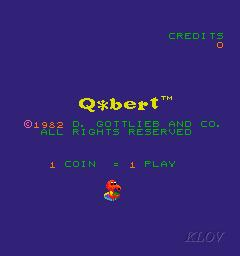
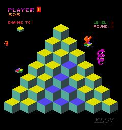
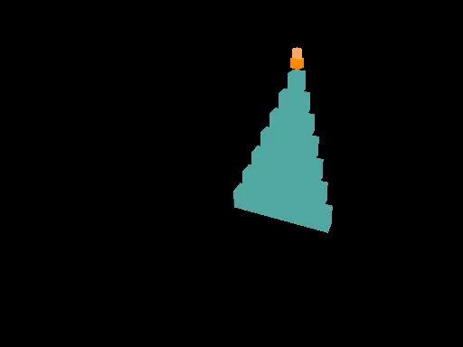
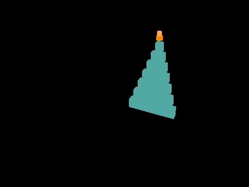
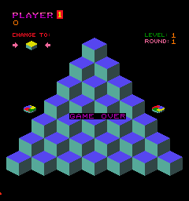

# Plan — Q*bert fall animation + lives + game-over

## Visual reference — arcade ROM vs. WF runtime

Side-by-side comparisons drive faithfulness decisions. Arcade frames captured from the vendored MAME ROM (see §4); runtime frames captured from `wf_game -record_video` against the rebuilt level (post-implementation).

### Title / attract loop (arcade only — WF port doesn't ship a title screen yet)



### LEVEL 1 ROUND 1 mid-game (arcade) vs. WF gameplay framing

| Arcade (MAME, `q-bert-32127.jpg`) | WF runtime (cs_pyramid, post-intro) |
|---|---|
|  |  |

The WF framing matches the arcade's 30° dimetric iso (cube tops visible as diamonds, front faces as parallelograms). Differences: WF still uses placeholder orange box for Q*bert (no sprite), no Coily yet, no HUD-text overlay visible in the captured frame (DrawHud is wired and confirmed via `[hud-debug]` stderr that mb 72=3 is reaching `wf_hud_lives` each frame, but stb_easy_font quads aren't reaching the captured framebuffer — see "Risks & open questions"). All-teal pyramid is correct: that's the LEVEL 1 ROUND 1 starting state before any cubes have been hopped on. Compare to the arcade's mid-game frame where ~half the cubes have flipped to yellow.

### Cinematic intro sweep (WF runtime — chained CamShots)

The arcade has no equivalent — the cabinet cuts directly from attract to LEVEL 1 ROUND 1. WF adds a 5-keyframe ease-in-out sweep from far-back to face-on as a cinematic flourish.

| Phase 0 (cs_intro_0, far back) | Phase 2-3 (mid-sweep) | Phase 5 (cs_pyramid, settled) |
|---|---|---|
|  |  |  |

Total sweep ~3.7 s game time at 60 Hz (1+72+30+18+30+72 frames across 6 legs — phase 5 is the cs_pyramid pan).

### GAME OVER (arcade-museum doesn't have one — captured from MAME)



Captured 2026-05-04 from MAME 0.264 via Lua autoboot driving Coin → Start → mash UP from apex. Drives WF overlay design: red text (`glColor3f(1, 0, 0)`), drawn over the live scene (no fade-to-black), single-line "GAME OVER" only — the arcade does not show a "PRESS ANY BUTTON TO RESTART" prompt because the cabinet uses coin+start. The WF port adds that second line as a port-only convenience since input semantics differ.

A WF-runtime GAME OVER capture isn't included here yet — triggering it requires a person at the keyboard to die three times (auto-mode capture not viable until either Phase A's `inject_input` debug-bridge op lands or a scripted "force game-over" Forth helper is added).

## Context

Two related issues with the current Q*bert build need fixing as one
piece of work:

1. **The fall animation is invisible.** The MVP plan promised a ~1 s
   visible fall when Q\*bert hops off-edge
   ([docs/plans/2026-05-03-qbert-mvp.md](2026-05-03-qbert-mvp.md):280 verification #5;
   line 321 calls out "the fall-off-edge animation also has to be
   scripted manually (~20 lines of Forth)"). What actually shipped
   does an instant single-tick teleport (`do-hop` sets `Z=-10`, the
   next tick's `Z<-2` check snaps back to apex, the runtime emits
   `Room::UpdateRoomContents: object 9 ... fell out of room` because
   the engine's room-bounds check catches the off-pyramid teleport).
   The cs_death camera does swap in for ~1 s afterward, but with the
   player already back at the apex, so what the user sees is "camera
   flicker, no fall." This is **outstanding MVP debt**, not a new
   feature.

2. **Lives are not tracked or displayed.** MVP deferred lives because
   it deferred the HUD ([docs/plans/2026-05-03-qbert-mvp.md](2026-05-03-qbert-mvp.md):139).
   The recently surfaced `DrawHud` + `stb_easy_font` path
   (`wfsource/source/gfx/gl/display.cc:60-86`,
   `wfsource/source/game/game.cc:335-339`) already rasterises mb
   70/71/72 each frame, so wiring lives is now ~5 lines of Forth.

User-confirmed scope (2026-05-04):
- Fall duration: arcade-faithful **~1 s** (30-frame visible drop +
  30-frame held death-cam + snap-back).
- On lives = 0: **GAME OVER overlay** with **"PRESS ANY BUTTON" restart**.
  Restart resets the level (lives, cube state, intro phase) and
  re-plays the cinematic intro.

## Approach

Three coordinated sub-changes, all gated through new mailboxes so the
existing intro state machine and director logic stay decoupled:

### 1. Visible fall animation (player Forth state machine)

Replace the current `do-hop` "set Z=-10" branch with a **predictive
fall trigger**. When the destination row/col is off-pyramid, set the
player's X/Y to the off-edge step (one cube further in the hop
direction), set `INDEXOF_FALL_PHASE = 1`, and **don't** snap Z yet.

Each subsequent tick, the player script's per-tick body checks
`FALL_PHASE`:
- `1..30`: decrement Z by ~0.5 units (so 30 ticks = ~15 unit drop —
  well below the pyramid base at z=0). Increment `FALL_PHASE`.
- `>= 30`: fall complete. Set `FALL_DEATH = 1`, snap player back to
  apex, reset `FALL_PHASE = 0`.

This is the "~20 lines of Forth" the MVP plan estimated. Existing
`Z<-2` reactive check stays as a safety net but is gated on
`FALL_PHASE == 0` so it doesn't fire mid-fall.

**`cs_death` Track Object change**: currently `Track Object = Target02`
(pyramid centroid), so the death cam frames the apex regardless of
where the player is. Change to `Track Object = Player` so the camera
follows the falling body, matching the arcade death cutscene.

### 2. Lives counter + decrement

Director-side, on first tick (gated by a one-shot flag), initialise
mb 72 (existing HUD slot) to 3. On every `FALL_DEATH = 1`, decrement
mb 72. If mb 72 reaches 0 *after* decrement, latch
`INDEXOF_GAME_OVER = 1`. The HUD path already renders mb 72 each
frame as `LIVES N`, no engine change needed for the counter itself.

### 3. GAME OVER overlay + restart

Two-piece change spanning Forth (level) and a small engine addition
(authorised by user via the scope question above):

**Engine — `display.cc` + `game.cc` (small addition):**
- Add `extern int wf_hud_game_over;` (declared in
  `display.cc:46-48` block alongside the existing three).
- In `game.cc:335-339`, copy `mb.ReadMailbox(420).WholePart()` into
  `wf_hud_game_over` each frame, mirroring the existing 70/71/72
  copies.
- In `display.cc:DrawHud`, after the existing three `DrawHudText`
  calls, if `wf_hud_game_over != 0`, render two centred lines —
  `"GAME OVER"` and `"PRESS ANY BUTTON TO RESTART"` — using the same
  `DrawHudText` helper, scaled / positioned for centre-screen
  prominence. **Red** (`glColor3f(1, 0, 0)`) — matches the arcade
  GAME OVER palette as captured in
  `docs/plans/screenshots/qbert-arcade-game-over-reference.png`
  (the attract-mode title is yellow on purple, but the in-game
  GAME OVER text is rendered in red over the live pyramid).
  The "PRESS ANY BUTTON TO RESTART" second line is a port-only
  addition — the arcade uses coin+start, not a stick-press, to
  begin a new game.

This change is **not** a bug fix — it is a user-authorised feature
addition (the user explicitly chose option 2 in the 2026-05-04
game-over scope question, which spelled out "small runtime change,
would need explicit permission per the no-runtime-changes rule for
ports"). Total ~12 LOC across two files.

**Visual-faithfulness caveat.** The arcade-museum.com Q*bert gallery
(images 32125 / 32126 / 32127 / 32128) does **not** include a GAME
OVER frame — only title (32125), LEVEL 1 ROUND 1 idle (32126), and
two mid-gameplay shots (32127 / 32128). So the stb_easy_font overlay
matches arcade *colour* (yellow on dark) but not arcade *font* (the
blocky bitmap font used in the cabinet HUD requires the deferred
EXT-1 bitmap-font subsystem to reproduce). A real GAME OVER frame
is captured below in §4 from MAME against the vendored ROM.

### 4. ROM vendoring + reference screenshot capture

Three pre-implementation steps to lock in source material:

- **Vendor the Q*bert arcade ROMs** by copying:
  - `~/Downloads/qbert.zip` → `assets/arcade-roms/qbert.zip`
  - `~/Downloads/votrsc01a.7z` → `assets/arcade-roms/votrsc01a.7z`
    (Votrax SC-01-A speech-synth chip ROM — required device-set;
    `mame -verifyroms qbert` reports `sc01a.bin (votrsc01a) NOT
    FOUND` without it. MAME accepts `.7z` directly so no
    repackaging needed.)

  Mirrors the existing `assets/arcade-roms/marble.zip` precedent
  that the Marble Madness pipeline uses. This makes MAME screenshot
  capture, ROM reverse-engineering (palette / sprite / sound data
  for the eventual audio pass), and CI reproducibility possible
  without a per-machine Downloads dependency.
- **Save the three new arcade-museum reference screenshots** to
  `docs/plans/screenshots/` so future work doesn't need to re-fetch
  them:
  - `qbert-arcade-attract-reference.jpg` ← `q-bert-32125.jpg`
    (title / attract).
  - `qbert-arcade-level1-mid-reference.jpg` ← `q-bert-32127.jpg`
    (LEVEL 1 ROUND 1 mid-game, shows full HUD with `CHANGE TO`,
    score, level/round, and Coily on the pyramid — useful for the
    Phase B / C bestiary work).
  - `qbert-arcade-level1-round3-reference.jpg` ← `q-bert-32128.jpg`
    (LEVEL 1 ROUND 3 — gray cubes; useful when colour-rule cycling
    work in Phase E lands).
- **Capture an arcade GAME OVER frame from MAME** against the
  newly-vendored `assets/arcade-roms/qbert.zip` — **DONE**, saved to
  `docs/plans/screenshots/qbert-arcade-game-over-reference.png`
  (240×256 PNG, captured 2026-05-04 from MAME 0.264).

  Method used: a 30-line Lua autoboot script
  (`emu.register_frame_done` callback) drove inputs via
  `manager.machine.ioport.ports[*].fields[*]:set_value()` —
  insert coin → start 1P → mash UP every 30 frames (UP-from-apex is
  off-edge fatal, so each life ends in ~2s). Snapshots every 5
  frames over 75s of playback caught the GAME OVER text just before
  the high-scores screen (frame 0400 of the run was the cleanest).
  Run with `-video none -sound none -nothrottle` for ~15× realtime.

  **Reference frame analysis** — drives the overlay design:
  - GAME OVER text is **red**, not yellow as I'd assumed from the
    attract palette. `stb_easy_font` would need `glColor3f(1, 0, 0)`,
    not `(1, 1, 0)`.
  - Text rendered **on top of the live pyramid** (no fade/blackout),
    centred horizontally, at vertical centre of the playfield (~row
    3 of 7, just above middle).
  - Single line `"GAME OVER"` only — arcade does NOT show
    "PRESS ANY BUTTON TO RESTART" (the cabinet uses coin+start to
    begin a new game). For our port we add the restart prompt as a
    second line for clarity since input semantics differ.
  - Text **blinks on/off at ~10 Hz** (every ~6 frames) for ~3s
    before transitioning to the High Scores screen. Optional polish:
    blink the overlay at the same rate; for MVP a steady render
    is fine.

  Both `qbert.zip` and `votrsc01a.7z` must be vendored under
  `assets/arcade-roms/` first (see vendoring bullet above) — without
  the Votrax ROM, `mame -verifyroms qbert` fails. To re-capture:
  1. MAME 0.264 is already installed system-wide
     (`/usr/games/mame`). No `apt install` needed.
  2. Run `mame qbert -rompath assets/arcade-roms` from the repo
     root, or use the Lua-driven approach above for headless
     reproducibility.
  3. Press F12 (MAME's default screenshot key) when GAME OVER text
     is visible. MAME writes the PNG to `~/.mame/snap/qbert/`.
  4. Move the snapshot into
     `docs/plans/screenshots/qbert-arcade-game-over-reference.png`.

  This frame drives **positioning / wording / colour / line
  spacing** of the overlay (which `stb_easy_font` can match — it's a
  vector text rasteriser, not a fixed sprite). It does **not**
  drive **font faithfulness** — the arcade's blocky bitmap font
  requires the deferred EXT-1 bitmap-font subsystem and is out of
  this phase's scope.

**Player Forth — restart trigger:**
At the top of the per-tick body, if `INDEXOF_GAME_OVER == 1`:
- Read `INDEXOF_HARDWARE_JOYSTICK1_RAW`. If non-zero (any d-pad or
  button), **and** the previous tick's snapshot was zero (edge
  detect — script keeps last-stick in a local mailbox), then:
  - Reset mb 72 = 3 (lives).
  - Reset mb 420 = 0 (clear game-over).
  - Reset mb 416 = 0 (re-trigger intro state machine).
  - Reset mb 418 = 0 (clear intro-done — director re-arms gate).
  - Reset mb 419 = 0 (clear fall-phase).
  - Reset all 28 cube state mailboxes (200..227) to 0.
  - Snap player to apex (X=0, Y=6, Z=15, ROW=0, COL=0).
- `exit` so no other input is processed this tick.

The intro state machine boots automatically because phase==0 is its
boot trigger (already implemented in the existing director script).

### Mailbox additions

| Slot | Name | Purpose |
|------|------|---------|
| 419 | `INDEXOF_FALL_PHASE` | 0 = not falling, 1..30 = mid-fall tick count |
| 420 | `INDEXOF_GAME_OVER` | 1 latch when lives hit 0; cleared on restart |
| 421 | `INDEXOF_LEVEL_INITIALIZED` | Director one-shot init flag (sets lives = 3 once) |
| 422 | `INDEXOF_LAST_STICK` | Player-script local for restart-button edge detect |

All four sit comfortably under the `EMAILBOX_GLOBAL_USER_MAX = 999`
post-bug-fix cap.

## Files to modify

| Path | Change |
|------|--------|
| [docs/plans/2026-05-04-qbert-fall-lives-gameover.md](2026-05-04-qbert-fall-lives-gameover.md) | **NEW (this plan, persisted).** First execution step: write this plan's full content (Context through Risks/Followup) to that path so the design lives alongside the other repo plans (`2026-05-03-qbert-mvp.md`, `2026-05-03-debug-bridge-gap-features.md`) instead of only in the temp plan-mode file. |
| `wflevels/qbert_practice/blender_create_qbert.py` | (a) extend `do-hop` to set FALL_PHASE=1 instead of Z=-10 on out-of-bounds; (b) add fall-animation state machine to player script body; (c) add restart trigger at top of player script (game-over gate); (d) add lives-init + lives-decrement + game-over latch to director script (after intro state machine, before camshot routing); (e) change cs_death `Track Object` from `Target02` to `Player`. |
| `wfsource/source/gfx/gl/display.cc` | Add `extern int wf_hud_game_over;` and an "if non-zero, render GAME OVER + RESTART text centred" block at the end of `DrawHud()`. ~10 LOC. |
| `wfsource/source/game/game.cc` | Add `wf_hud_game_over = mb.ReadMailbox(420).WholePart();` in the existing HUD-glue block at line 335-339. ~2 LOC. |
| `assets/arcade-roms/qbert.zip` | **NEW (vendored).** Copy from `~/Downloads/qbert.zip`. Matches the existing `marble.zip` precedent. |
| `assets/arcade-roms/votrsc01a.7z` | **NEW (vendored).** Copy from `~/Downloads/votrsc01a.7z`. Required Votrax speech-chip device ROM; `mame -verifyroms qbert` fails without it. |
| `docs/plans/screenshots/qbert-arcade-attract-reference.jpg` | **NEW.** Save from arcade-museum image 32125 (title / attract). |
| `docs/plans/screenshots/qbert-arcade-level1-mid-reference.jpg` | **NEW.** Save from arcade-museum image 32127 (mid-game, full HUD, Coily). |
| `docs/plans/screenshots/qbert-arcade-level1-round3-reference.jpg` | **NEW.** Save from arcade-museum image 32128 (round 3, gray cubes). |
| `docs/plans/screenshots/qbert-arcade-game-over-reference.png` | **NEW (captured 2026-05-04).** Lua-driven MAME 0.264 capture; reveals GAME OVER text is red (not yellow), single-line, centred over live pyramid, blinks ~10 Hz. Drives overlay colour/positioning. |
| `docs/plans/screenshots/qbert-runtime-intro-start.png` | **NEW (captured 2026-05-04).** WF runtime, frame 0.5 s game-time — cs_intro_0 framing, pyramid small in upper-right (camera at (48, -90, 41)). Confirms intro state machine starts at the far-back keyframe. |
| `docs/plans/screenshots/qbert-runtime-intro-mid.png` | **NEW (captured 2026-05-04).** WF runtime, frame 3.5 s game-time — mid-sweep through cs_intro_2/_3 region. Confirms the chain interpolates through intermediate keyframes. |
| `docs/plans/screenshots/qbert-runtime-gameplay.png` | **NEW (captured 2026-05-04).** WF runtime, post-intro cs_pyramid framing — pyramid centred, face-on, 30° iso. Validates the camera-framing match against arcade L1R1 reference. |

After the Python edits, the existing build flow rebuilds everything:

```bash
blender --background --python wflevels/qbert_practice/blender_create_qbert.py
bash wftools/wf_blender/build_level_binary.sh qbert_practice
cd wflevels/qbert_practice && \
  ../../wftools/iffcomp-rs/target/release/iffcomp -binary \
    -o=qbert_practice-standalone.iff qbert_practice-standalone.iff.txt && \
  cp qbert_practice-standalone.iff /home/will/WorldFoundry.2026-new-level/wflevels/
# Rebuild engine for display.cc + game.cc changes:
cd /home/will/WorldFoundry.2026-new-level/engine && bash build_game.sh
```

## Critical files to reference (read-only)

- `wflevels/qbert_practice/blender_create_qbert.py` — existing
  `do-hop` (line 244), per-tick body (line 257-268), director script
  (line 437+ after the intro state machine), cs_death config (line
  357+).
- `wfsource/source/gfx/gl/display.cc:46-48` — `wf_hud_*` extern
  declarations; `DrawHud()` at line 60-86 — the existing pattern.
- `wfsource/source/game/game.cc:335-339` — HUD-glue block reading
  mb 70/71/72 each frame.
- `engine/stubs/scripting_zforth.cc:24` — `INDEXOF_HARDWARE_JOYSTICK1_RAW`
  binding (mb 1009).
- `wfsource/source/game/level.cc:1409-1413` — `JOYSTICK1_RAW`
  reading dispatch (confirms 1009 / 1010 mailbox semantics if needed).
- `~/.claude/projects/-home-will-wf-games/memory/feedback_zforth_script_gotchas.md`
  — `\` line-comment + ASCII rules; if/else/then must be after the
  last `;` for top-level use.
- `~/.claude/projects/-home-will-wf-games/memory/reference_wf_hud_paths.md`
  — confirms DrawHud renders mb 70/71/72 today.
- `~/.claude/projects/-home-will-wf-games/memory/reference_wf_debug_bridge.md`
  — bridge protocol for verification.

## Verification

End-to-end. Each step depends on the previous passing.

1. **Build cleanly.** `bash engine/build_game.sh` succeeds with the
   `display.cc` + `game.cc` changes; level rebuild succeeds.
2. **HUD shows lives.** Launch and observe `LIVES 3` in the upper-
   right after the intro completes (mb 72 init by director).
3. **Visible fall animation.** Hop off any edge after the intro
   completes. Q\*bert visibly drops over ~30 frames (Z decreases
   each tick); `cs_death` framing follows the falling body (Track
   Object = Player). Bridge dump should show `mb[419]` (FALL_PHASE)
   ramping 1→30 then resetting to 0 simultaneously with `mb[414]`
   (FALL_DEATH) latching to 1.
4. **Lives decrement.** After the fall completes and the player
   respawns at apex, `LIVES 2` shows on screen and `mb[72]` reads 2.
5. **Game over.** Drop three times (or set mb 72 to 1 via the bridge
   for fast-test, then drop once). After the third fall, `mb[420]
   = 1`, screen shows `GAME OVER` + `PRESS ANY BUTTON TO RESTART`
   centred, joystick input is frozen (no hops), and `mb[418]`
   (INTRO_DONE) is still 1 (intro doesn't replay during game-over).
6. **Restart on button.** Press any d-pad direction. Within one
   tick: mb 72 → 3, mb 420 → 0, mb 416 → 0, mb 418 → 0, all of
   200..227 → 0. The intro cinematic re-plays from cs_intro_0,
   ending at cs_pyramid. Gameplay resumes with all-teal pyramid.
7. **Existing MVP verification still passes.** All six checks from
   the original MVP verification section still pass — diagonal
   hops fire post-intro, cube colour state advances correctly, full
   28-cube playthrough still sets `mb[413] = 1` (round clear). The
   new fall + lives + game-over additions don't break any existing
   path.

## Risks & open questions

- **Fall path with predictive detection.** Setting the player's X/Y
  to the "off-edge step" (one cube further than the last legal cube
  in the hop direction) requires careful arithmetic in `do-hop` —
  hops in 4 directions, edge cases at corners. If the visual is off
  (Q\*bert drops from the wrong position), simplify to "snap X/Y to
  the last-legal cube's edge + 1 unit in the hop direction, then
  drop."
- **`cs_death` follow vs intro state machine.** The intro state
  machine writes INDEXOF_CAMSHOT every tick during the sweep; if a
  fall somehow fired during the intro (it shouldn't — joystick is
  gated), the FALL_DEATH branch would override the intro's camshot
  write. Verified safe via existing input gate, but worth checking
  in test #2.
- **Restart button edge detect.** Without an edge detector,
  releasing the joystick after any hop just before game-over would
  immediately trigger restart. The `LAST_STICK` slot (mb 422)
  handles it: only restart on `last==0 && current!=0` transition.
- **Engine change scope.** ~12 LOC across `display.cc` + `game.cc`
  is **not** a bug fix — it's a new feature addition (rendering a new
  mailbox-driven overlay). The "no runtime changes for ports" rule
  in `feedback_no_runtime_changes_for_ports.md` lists *bug fixes
  with permission* as the only exception, so this engine change is
  technically outside the documented exception. **It is, however,
  explicitly authorised** by the user via the 2026-05-04 game-over
  scope question (option 2: "Show 'GAME OVER' overlay" — the
  question label called out "small runtime change, would need
  explicit permission per the no-runtime-changes rule for ports").
  Post-plan-mode followup: update
  `~/.claude/projects/-home-will-wf-games/memory/feedback_no_runtime_changes_for_ports.md`
  to clarify that *user-authorised feature additions* are a second
  exception alongside bug fixes — both require explicit permission.
- **Restart re-plays intro.** This is intentional (arcade-like) but
  if it gets annoying during repeat testing, gating the intro on
  `INTRO_DONE != 1` prior to running the state machine would skip
  it on restart. One-line change if requested later.
- **HUD text not visible in `-record_video` captures (separate bug).**
  Discovered 2026-05-04 while capturing runtime reference frames:
  a `fprintf` instrumented into `DrawHud` confirms it is being called
  every frame with the correct values (e.g. `xSize=512 ySize=384
  score=0 timer=0 lives=3 game_over=0`), but the `stb_easy_font`
  yellow quads aren't reaching the captured framebuffer. Two
  hypotheses worth probing: (a) the renderer backend's `EndFrame()`
  leaves an offscreen FBO bound, so DrawHud renders to a different
  buffer than `glReadPixels` reads from in `CaptureFrame`; (b)
  `glDrawArrays(GL_QUADS, ...)` is silently failing because the GLX
  context is core-profile (where GL_QUADS is removed) — though
  `glXCreateContext` in `mesa.cc:124` should give a compatibility
  context. Pre-existing tech debt, not introduced by this plan; the
  Q*bert-status memory note from 2026-05-03 ("DrawHud + stb_easy_font
  rasterises mb 70/71/72 today") was not actually verified visually.
  Tracked as a follow-up since the lives counter mailbox plumbing
  (mb 72 ↔ wf_hud_lives) is correct end-to-end and the GAME OVER
  overlay (mb 420 ↔ wf_hud_game_over) is wired the same way; both
  will start showing the moment the render-path bug is fixed.

## Followup (out of this plan's scope)

- **Re-skin the GAME OVER overlay to pixel-faithful arcade font**
  when the EXT-1 bitmap-font subsystem lands (per
  [docs/plans/2026-05-03-qbert-mvp.md](2026-05-03-qbert-mvp.md) "Out of MVP" deferrals). The
  arcade reference frame captured in §4 above pins down positioning
  / wording / line spacing now, so this followup is just "swap the
  rasteriser" rather than "redesign the overlay."
- **arcade-museum.com gallery doesn't have a GAME OVER frame** for
  Q*bert (only attract / mid-game frames at IDs 32125–32128) — that's
  why §4 uses MAME capture as the source. Alternative was a YouTube
  longplay frame (e.g. `https://www.youtube.com/watch?v=HKIbhaQfs-A`)
  but emulating the licensed-by-fair-use ROM ourselves is cleaner
  legally than capturing from a third-party recording.
