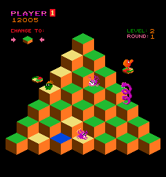
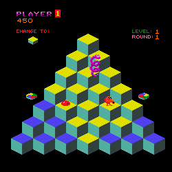
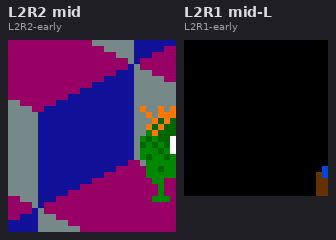
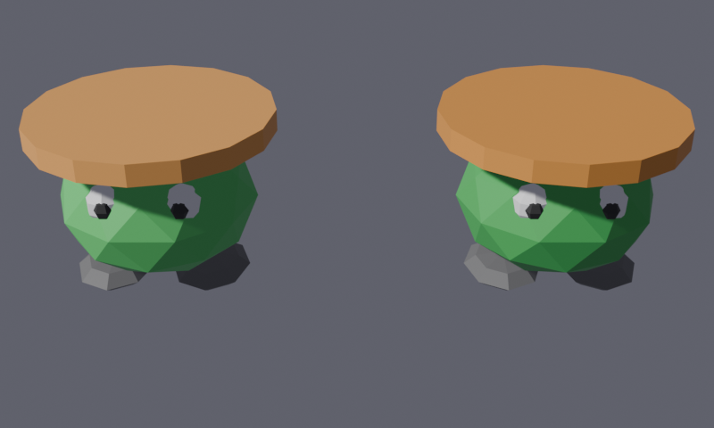
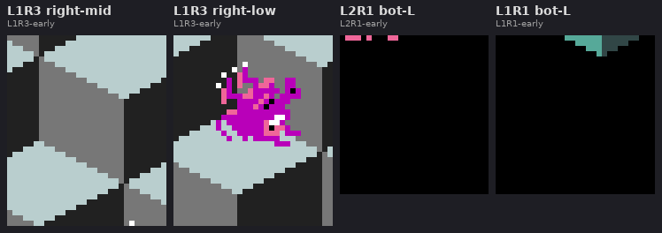
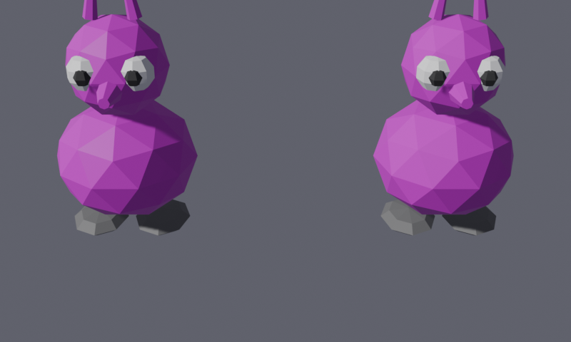
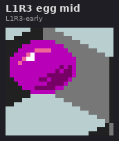
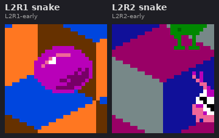
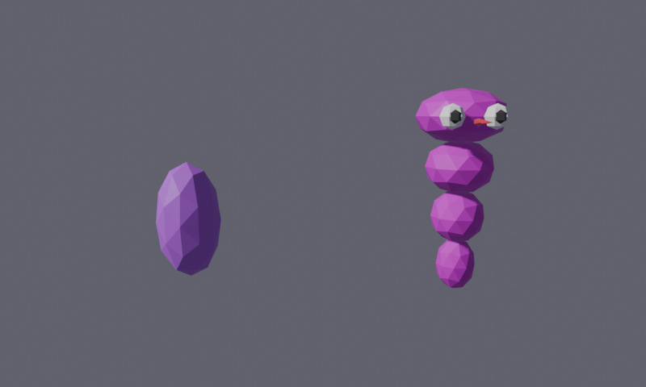

# Plan — Distinct enemy meshes (Slick/Sam, Ugg/Wrong-Way, Coily)

**Date:** 2026-05-11
**Status:** Not started

## Context

The TODO entry under **QBERT ARCADE FIDELITY / Visual polish** ([TODO.md](../../TODO.md)) calls out:

> Distinct enemy meshes — Slick/Sam currently use a hat-on-body flipper proxy; Ugg/Wrong-Way use a climber blob; Coily is stacked spheres. Replace with arcade-recognizable 3D characters.

Functionally the enemies are all in (see today's retro plans and the multi-enemy capture `qbert-all-enemies.mp4`), but visually only the player ([2026-05-10-qbert-player-mesh.md](2026-05-10-qbert-player-mesh.md)) has had a deliberate silhouette pass. The proxies read as generic shapes — Coily in particular is four stacked icospheres, which has the right *count* of segments but none of the snake personality.

This plan upgrades the three remaining enemy silhouettes to arcade-recognisable 3D forms, following the established procedural-Blender-primitives pattern used by the player mesh.

## Reference (arcade Q✱bert)

Reference comes from **MAME screenshots and web reference images**, not from ROM sprite extraction. Pixel-tile extraction adds no value for 3D-mesh authoring — we just need the silhouette and the palette, both of which a screenshot delivers directly.

**Higher-res reference search outcome (commit `7ebac47`):** the arcade game itself rendered at 240×256, so "higher res" is a category error — every authentic source is the same native resolution. Best frames sourced from [Hardcore Gaming 101](http://www.hardcoregaming101.net/qbert/) and the [Wikipedia article infobox](https://en.wikipedia.org/wiki/Q*bert). [The Spriters Resource](https://www.spriters-resource.com/arcade/qbert/) was queried but blocks direct fetch behind Cloudflare; useful for manual reference but not for scripted extraction.

**Gold reference — HG101-04** (L2R1 mid-gameplay; every enemy visible together at arcade-native resolution, allowing programmatic pixel-sampling of canonical RGB values):



**Secondary reference — Wikipedia infobox** (L1R1; Coily-snake-in-motion clearly visible):



Per-enemy crop sheets (each crop zoomed 6× nearest-neighbour from the sources above) are embedded inline in their respective phase sections below.

| Enemy | Arcade silhouette + colour (post pixel-sampling) |
|---|---|
| **Slick** | Small humanoid: **green** icosphere body + **orange** flat-dome on top (the "dome" is the creature's face/head, not a hat) + two white eyes with black pupils + stubby dark-grey feet. Body `#21BA31` `(0.13, 0.73, 0.19)`, dome `#FF7721` `(1.00, 0.47, 0.13)`. |
| **Sam** | Identical mesh to Slick; slightly darker green body + redder orange dome so Slick/Sam are visually distinguishable in 3D. Arcade sprites are pixel-identical between Slick and Sam — only the spawn-cadence differs. |
| **Ugg** | Humanoid climber: **pure magenta** body + smaller head + two big white eyes with pupils + flat feet. Body `#BA00BA` `(0.73, 0.00, 0.73)`. Runtime DELTA_PITCH +0.25 + DELTA_YAW +0.5 rev tips the mesh onto the right side face. |
| **Wrong-Way** | Identical mesh and colour to Ugg; only the side-face climbed (left vs. right) and the actor rotation differ. Body `#BA00BA`. |
| **Coily egg** | Single elongated icosphere (Z scale 1.3, XY 0.72). Material flashes purple/red at 3.75 Hz via the existing oscillator — arcade-faithful. |
| **Coily snake** | Tapered stack of 4 subdiv-2 magenta icospheres (radii 0.22 / 0.30 / 0.38 / 0.50 bottom→top) plus eyes + pupils + red forked tongue on the head. Body `#BA00BA` magenta — same as Ugg/WW. |

References:

- [Wikipedia — Q✱bert](https://en.wikipedia.org/wiki/Q*bert) — enemy roster and visual descriptions.
- Existing arcade-palette extraction work: [2026-05-04-qbert-arcade-palette-all-rounds.md](../investigations/2026-05-04-qbert-arcade-palette-all-rounds.md).

## Critical files

| File | Change |
|------|--------|
| [wflevels/qbert_practice/blender_create_qbert.py](../../wflevels/qbert_practice/blender_create_qbert.py) | Replace `_flipper_build_mesh()` (lines 1291–1331), the climber `_climber_build_mesh()` (~lines 1401–1481), and the Coily egg + snake builders (~lines 1673–1793). Mailboxes, scripts, schema wiring, rotation composition (Ugg/WW pitch+yaw) all stay; **only the geometry changes**. |
| `docs/plans/screenshots/` | Add MAME / web reference screenshots for each enemy (silhouette + palette) before/during implementation. |

**No changes** to: `enemy.oad`, `redball_script` Forth source, mailbox layouts, the `_build_*_actor` wiring (only the mesh-building helper signatures change). Slick/Sam keep `wf_Mesh Name = 'slick_mesh.iff'` / `'sam_mesh.iff'`, etc.

## Mesh budgets — actual vert/face counts

Measured post-Phase-C (commit `1527e14`) from the Blender scene:

| Actor | Verts | Faces | Notes |
|---|---:|---:|---|
| Player | 206 | 222 | Reference budget — set by [2026-05-10-qbert-player-mesh.md](2026-05-10-qbert-player-mesh.md) |
| Red ball (each of 3) | 42 | 80 | Subdiv-1 icosphere; unchanged |
| Green ball | 42 | 80 | Same mesh as red, different material |
| Slick | 252 | 322 | Body subdiv-2 (42v/80f) + 7 orange hair-cones + smoother eyes/pupils/feet |
| Sam | 252 | 322 | Same mesh shape as Slick, slightly darker green + redder orange |
| Ugg | 284 | 378 | Body + head subdiv-2 + snout cone + 2 antennae cones + smoother eyes/pupils/feet |
| Wrong-Way | 284 | 378 | Same mesh shape as Ugg, same magenta (only climb side differs) |
| Coily egg | 42 | 80 | Elongated subdiv-1 icosphere |
| Coily snake | 244 | 410 | 4 tapered subdiv-2 icosphere segments + 2 eyes + 2 pupils + 2 forked-tongue cones |
| Spinning disc (each of 2) | 34 | 64 | Pre-existing — flat cylinder; unchanged |
| **Total dynamic-actor footprint** | **~1924** | **~2538** | Player + 3 red balls + green + Slick + Sam + Ugg + WW + Coily egg + snake + 2 discs |

After the 2026-05-11 face-count doubling pass, each humanoid enemy lands at ~234–244 verts and 290–398 faces — comparable to the player's 206v/222f reference. Worst-case all-actors-on-screen footprint is ~1846 verts / ~2470 faces; the static 28-cube pyramid adds more on top, but the level-pool budget bumps from [2026-05-09-qbert-cube-palettes-16-rounds.md](2026-05-09-qbert-cube-palettes-16-rounds.md) (1344-cube fan-out) already accommodate it.

## Pattern to mirror

From `_build_qbert_player_mesh` ([2026-05-10-qbert-player-mesh.md](2026-05-10-qbert-player-mesh.md) §"Mesh construction"):

1. Single mesh object per enemy, primitives joined with `bpy.ops.object.join()`.
2. Multiple material slots; per-face `material_index` for colour partitioning. The existing flipper builder ([blender_create_qbert.py:1336–1358](../../wflevels/qbert_practice/blender_create_qbert.py)) already shows the multi-material idiom.
3. Materials use `Principled BSDF` `Base Color`; the exporter `_write_mesh_iff` ([wftools/wf_blender/export_level.py:422–537](../../wftools/wf_blender/export_level.py)) reads them.
4. Vert budget: cubes / red ball / green ball are all 42 verts; player is 206. **Original per-enemy target was "stay under ~150 verts"**, but after the face-doubling pass (`cb42484`) and arcade-faithful detail additions (hair / snout / antennae / coil / tongue) the humanoid enemies settled at 252–286 verts — see [Mesh budgets](#mesh-budgets--actual-vertface-counts) table above. Still well under the 28-cube static pyramid's contribution to the level pool.
5. Reuse `_REDBALL_VERTS` / `_REDBALL_FACES` (~42 verts, 80 faces) as a stock icosphere primitive for "body ball" components — already imported above the flipper builder.

## Approach — three independent phases

Each phase is self-contained: one mesh builder swap, one rebuild, one capture for visual check. Phases land as separate commits.

### Phase A — Slick & Sam (cube-flippers)

**Status:** Done — Blender mesh + build pipeline green; in-engine verify pending capture.

**Arcade reference** (6× zoom from L2R2 and L2R1 — Slick clearly visible as a green-bodied humanoid with an orange head-dome and white eye-pixels):



**3D mesh** (rest pose, Blender EEVEE):



Goal: cube-flipper humanoid silhouette.

1. Replace the shared-mesh `_flipper_build_mesh()` + `_build_flipper_actor()` pair with a single per-actor `_build_flipper_actor(name, mesh_name, hat_rgb, location)` that uses `bpy.ops.mesh.primitive_*` + `bpy.ops.object.join()` (matches the player-mesh pattern at [`_build_qbert_player_mesh`](../../wflevels/qbert_practice/blender_create_qbert.py)).
2. Components:
   - Body: icosphere subdiv 2, scale 0.45, Z-squash 0.75. **Green**.
   - **Hair:** cluster of 7 orange cones on top of the body — one tall centre spike (radius1=0.12, depth=0.30) plus 6 shorter cones (radius1=0.07, depth=0.22) in a ring around it, each tilted ~20° outward so they fan out like punk-rock hair. Initial commit (`bf3f61f`) replaced an earlier flat 16-sided cylinder which read as a saucer-hat — the arcade sprite has orange spiky **hair**, not a hat.
   - **Eyes:** two small white UV-spheres on +X face of body.
   - **Pupils:** smaller black UV-spheres just in front of the eyes.
   - **Feet:** two flat ovals (scaled UV-spheres), straddling ±Y, dark grey.
3. Colours (pixel-sampled from [qbert-arcade-hg101-04.png](screenshots/qbert-arcade-hg101-04.png), commit `7ebac47`): arcade has Slick & Sam **both green-bodied + orange-domed**, visually identical in the arcade sprites. Distinguish via subtle palette delta — Slick: body `#21BA31` `(0.13, 0.73, 0.19)` + dome `#FF7721` `(1.00, 0.47, 0.13)`; Sam: body `(0.08, 0.55, 0.13)` darker green + dome `(0.90, 0.38, 0.08)` redder orange. **Colour-correction history:** initial Phase-A commit had body=white + hat=green (inverted); first correction pass swapped them (`6a5dc2e`); pixel-accurate values landed in `7ebac47`.
4. Final mesh: **252 verts / 322 faces** per actor (subdiv-2 body 42v/80f + 7 hair-cones + 8-seg-5-ring eyes + 6-seg-4-ring pupils + 8-seg-4-ring feet).

### Phase B — Ugg & Wrong-Way (side-of-pyramid climbers)

**Status:** Done — Blender mesh + build pipeline green; in-engine Escher-tip verify pending capture.

**Arcade reference** (6× zoom from L1R3; the right-low crop shows the climber clearly on a cube's side face, magenta body with white eye-pixels):



**3D mesh** (upright rest pose; runtime engine rotation tips it onto the cube side face — see [2026-05-11-qbert-ugg-wrongway.md](2026-05-11-qbert-ugg-wrongway.md)):



Goal: humanoid climber that reads as "creature standing on the side of a cube" after the Escher pitch+yaw rotation.

1. Replace `_climber_build_mesh()` + `_build_climber_actor()` with a single per-actor primitive-based builder, same pattern as Slick/Sam. The rotation is applied at the actor level **after** mesh build, so model the mesh in upright rest pose (+X forward, +Z up, like the player) — the engine tips it.
2. Components:
   - Body: icosphere subdiv 2, scale 0.40, Z-squash 0.85. Magenta.
   - Head: smaller icosphere subdiv 2 on top, same magenta.
   - **Snout:** small cone (radius1=0.08, radius2=0.03, depth=0.20) protruding along +X from the head, same body magenta. Added in commit `e24025d` after arcade reference showed the climbers have a visible snout/face-spike.
   - **Antennae:** two short cones (radius1=0.04, radius2=0.02, depth=0.22) on top of head at y=±0.10, tilted outward 0.15 rad. Also added in `e24025d`.
   - **Eyes:** two large white UV-spheres on +X face of the head.
   - **Pupils:** smaller black spheres in front of the eyes.
   - **Feet:** two flat ovals at the bottom, dark grey.
   - **History note:** initial Phase-B commit had two horns on top + a smaller blob proxy; the proxy was replaced with body+head in `447b37d` (horns removed at that time), then snout + antennae added in `e24025d` after closer review of the arcade reference.
3. Body colour (pixel-sampled from [qbert-arcade-hg101-04.png](screenshots/qbert-arcade-hg101-04.png)): both Ugg and Wrong-Way use the same pure magenta `#BA00BA` `(0.73, 0.00, 0.73)` — the arcade sprites are identical; the only difference is which side of the pyramid each climbs. **Colour-correction history:** initial Phase-B commit had Ugg=orange / WW=purple; first correction swapped to pink-magenta variants (`6a5dc2e`); pixel-accurate `#BA00BA` landed in `7ebac47`.
4. Final mesh: **284 verts / 378 faces** per actor (subdiv-2 body + subdiv-2 head + snout cone + 2 antennae cones + 8-seg-5-ring eyes + 6-seg-4-ring pupils + 8-seg-4-ring feet).

### Phase C — Coily (egg + snake)

**Status:** Done — Blender mesh + build pipeline green; in-engine verify pending capture.

**Arcade reference — Coily egg** (6× zoom from L1R3; purple/magenta sphere, no face):



**Arcade reference — Coily snake** (6× zoom from L2R1 and L2R2; magenta coiled body with eyes on the head):



**3D mesh** (rest pose; egg left, snake right):



Goal: visibly snake-like Coily; egg distinct from a plain ball.

**Coily egg:**

1. Replace the unit icosphere with an elongated variant: `_EGG_VERTS = [(x*0.72, y*0.72, z*1.30) for (x,y,z) in _REDBALL_VERTS]`. Same face indices, so 42 verts / 80 faces. Material flashes purple/red as today (3.75 Hz oscillator at lines 1564–1568) — no script change.

**Coily snake:**

1. Replace `_coily_build_mesh()` + shared `_coily_mesh` datablock with a per-actor `_build_coily_snake_actor()` builder.
2. Stack 4 icosphere segments at the same `_COILY_SEG_SPACING` as before (preserves the actor-positioning math via `_COILY_HALF_HEIGHT`), but with per-segment radii in `_COILY_SEG_RADII = [0.22, 0.30, 0.38, 0.50]` bottom→top — tail is small, head is large. Each segment Z-squashed to `_COILY_SEG_HEIGHT / radius` so heights stay consistent. The arcade Coily *coil* silhouette is implied by the segmented body — vertical stack of tapered balls reads as a coiled snake from the player's view.
3. Add eyes on the head (top segment) at the head-sphere **surface**: two white UV-spheres at `(0.48, ±0.22, head_z)` + two black-sphere pupils at `(0.58, ±0.22, head_z)`. Initial commit placed eyes at x=0.32 inside the 0.50-radius head — they were buried; pushed out + grown in `1c3a4ac`.
4. **Forked tongue** (`1c3a4ac`): two narrow red cones protruding +X from below the eyes, splayed ±Y. Material red `(0.90, 0.05, 0.10)`. This is the single biggest "reads as snake" cue.
5. Material: magenta body `#BA00BA` `(0.73, 0.00, 0.73)` (same as Ugg/WW, pixel-sampled from [qbert-arcade-hg101-04.png](screenshots/qbert-arcade-hg101-04.png)), white + black eyes, red tongue. Egg stays at its existing flashing purple/red (already arcade-accurate via the 3.75 Hz flash oscillator).
6. Final mesh: snake **244 verts / 410 faces** (4 tapered subdiv-2 icosphere segments + 2 eyes + 2 pupils + 2 forked-tongue cones). Egg: **42 verts / 80 faces** (elongated icosphere).

> Note: an attempt to reshape the body into a literal helix of small spheres (commit `346b5b0`) was reverted (`4674820`) — the helix-of-balls read as "string of beads", not a snake. The tapered stack is the correct silhouette.

## Verification

Per phase, run the full qbert build pipeline and visually inspect:

```
# 1. Author in Blender — rerun the level script
blender -b wflevels/qbert_practice/qbert_practice.blend -P wflevels/qbert_practice/blender_create_qbert.py

# 2. Build .lev → .iff via wf_blender exporter (per feedback_qbert_blender_build_pipeline)
./build_level_binary.sh qbert_practice

# 3. Compile bundle
./iffcomp standalone qbert_practice

# 4. Run
cd wfsource/source/game && ./wf_game qbert_practice-standalone
```

For each phase:

- Spawn the relevant enemy via director timers (already happens at level start).
- Visually confirm: silhouette reads as the named enemy from a player-perspective camera angle.
- For Ugg/Wrong-Way: confirm the Escher pitch+yaw still looks right with the new mesh (head up the slope, feet on cube face).
- For Coily snake: confirm chase AI motion still reads as "snake" not "blob".
- Capture a short video to `qbert-<enemy>-mesh-2026-05-1X.mp4` for diffing against the prior proxy.
- After all three phases land, capture a fresh `qbert-all-enemies-v2.mp4` superseding the existing capture.

End-to-end smoke: full play of L1R1 with all enemies in flight — confirm no asset-pool overflow (memory rule: `feedback_check_git_diff_before_bumping_pools`) and no regression in the existing FALL_DEATH / Slick-cube-flip / green-ball-freeze interactions.

## Documentation artefacts (screenshots in-plan)

As each enemy mesh is developed, capture renderings/screenshots and **embed them in this plan doc** so the doc evolves from "what we'll build" into "what we built". Mirror the pattern from [2026-05-11-qbert-red-ball-enemy.md](2026-05-11-qbert-red-ball-enemy.md), which embeds a Blender-authored mesh screenshot inline.

Directory: `docs/plans/screenshots/` (already in use — see `qbert-redball-2026-05-11.png`).

Per phase, add to this plan doc:

- **Blender viewport render** of the rest-pose mesh (orthographic side + 3/4 perspective), captured via `bpy.ops.render.opengl()` or screenshot. Filename: `qbert-<enemy>-mesh-2026-05-1X.png`.
- **In-engine screenshot** of the enemy on the pyramid, captured via the existing `screenshot` debug-bridge op (see [debug-bridge phase A plan](2026-05-03-debug-bridge-phase-a.md) if it exists, otherwise the `mb[432] CAPTURE_TRIGGER` path mentioned in [2026-05-09-qbert-walker-wf-parity.md](2026-05-09-qbert-walker-wf-parity.md)). Filename: `qbert-<enemy>-ingame-2026-05-1X.png`.
- **Before/after comparison** strip: proxy mesh next to new mesh in the same camera framing. Filename: `qbert-<enemy>-before-after-2026-05-1X.png`.

Embed inline in the relevant phase section using Markdown image syntax with descriptive alt text and a caption line, e.g.:

```markdown

*Slick rest-pose mesh in Blender, viewport side view + 3/4 perspective.*
```

Each phase commit (see below) should include both the source change *and* the screenshot artefacts, so the plan doc and the visual evidence land together.

## Commit strategy

One commit per phase per the `feedback_commit_after_each_phase` rule:

1. `feat(qbert): Slick & Sam — humanoid mesh with eyes & feet`
2. `feat(qbert): Ugg & Wrong-Way — humanoid climber mesh`
3. `feat(qbert): Coily — snake silhouette with distinct head`

Optional preamble commit if reference screenshots are gathered as a separate step:

0. `chore(qbert): arcade reference screenshots for enemy meshes`

## Out of scope

- Animation (Coily curling, Slick/Sam tipping, Ugg/WW gait). Static silhouettes only; arcade attract mode is 2D anyway.
- Sprite-accurate texture mapping. Flat-shaded Principled BSDF materials only — matches the project's existing aesthetic.
- Mesh LOD. Single mesh per enemy.
- Replacing the red ball mesh (it's already a proper icosphere) or the green ball (same mesh, tinted).
- Rewriting `redball_script` or any director logic.

## Resolved questions

- **Arcade colour ground truth (resolved `7ebac47`)** — initial colour guesses for Slick/Sam/Ugg/WW were wrong (white-bodied + green-hatted; Ugg=orange; WW=purple). Pixel-sampled the correct values from [qbert-arcade-hg101-04.png](screenshots/qbert-arcade-hg101-04.png): Slick/Sam body `#21BA31` + hair `#FF7721`; Ugg/Wrong-Way + Coily snake body `#BA00BA`. Per-enemy palette table in the [Reference](#reference-arcade-qbert) section.
- **Coily shape (resolved on the tapered stack, `1c3a4ac`)** — initial mesh was 4 equal-sized stacked balls. Updated to a *tapered* stack of subdiv-2 icospheres (radii 0.22 → 0.50 bottom→top) so the largest sphere reads as a snake head sitting on a coiled body. A subsequent attempt to make the body a literal helix-of-small-spheres (`346b5b0`) was reverted (`4674820`) — it read as "string of beads" rather than a snake.
- **Slick "hat" vs. hair (resolved `bf3f61f`)** — initial mesh had a flat cylinder reading as a saucer-hat. Arcade has orange spiky hair on a green head. Replaced with a 7-cone hair cluster.
- **Ugg/WW snout & antennae (resolved `e24025d`)** — initial mesh had a plain round head. Arcade sprites have a small forward snout and two antennae on top.
