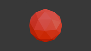

# Plan — Q✱bert Red Ball enemy (first enemy actor)

**Date:** 2026-05-11
**Status:** Done (2026-05-11, commits `2752d41` → `15705d1`; Phase B multi-ball + icosphere mesh + subdued stretch-and-squash all shipped)

## Context



The qbert_practice level header explicitly notes "No enemies, no discs, no HUD, no audio." The biggest gameplay gap from real Q✱bert is **enemies** — that's what turns the current colour-flipping demo into an actual game.

Of the arcade enemy roster (Red Ball, Green Ball, Coily, Slick, Sam, Ugg, Wrong-Way), **Red Ball** is the simplest: purely scripted motion down a diagonal, no chase AI, no state machine beyond bounce-down-and-respawn. It's the natural first enemy to wire up — it exercises every piece of infrastructure (per-actor script, per-tick movement, contact detection, player death trigger) without needing AI.

This plan implements one Red Ball that bounces continuously down the pyramid in a single arcade-style cycle. Iteration to two-balls / proper spawn timing / Green Ball / Coily comes later.

## Reference (arcade Q✱bert)

- Red Ball spawns at the cube one below the apex (row 1, either col 0 or col 1).
- It bounces straight down — always `(row+1, col)` or `(row+1, col+1)` — never sideways or up.
- One hop per ~½ second (arcade ~30 frames at 60 Hz; in WF a 12-tick HOP_COOLDOWN matches the player, so 12 ticks/hop is fine for v1).
- It despawns when it reaches the bottom row (row 6) or falls off the side (col > row).
- A new Red Ball spawns periodically. For v1 we use a continuous-respawn loop (despawn → wait → respawn at apex).
- Touching the same cube as Q✱bert at the same time = Q✱bert dies.

## What's already in place

| Infrastructure | Where |
|---|---|
| Player hop state machine, ROW/COL globals (mb 400/401) | [blender_create_qbert.py:440-572](../../wflevels/qbert_practice/blender_create_qbert.py) |
| Death pipeline: FALL_DEATH (mb 414) → cs_death → lives-- → game-over | [blender_create_qbert.py:932-937](../../wflevels/qbert_practice/blender_create_qbert.py) |
| `cube_world_position(row, col)` (Python) and equivalent math accessible from Forth | [blender_create_qbert.py:117-126](../../wflevels/qbert_practice/blender_create_qbert.py) |
| Enemy schema | [wfsource/source/oas/enemy.oad](../../wfsource/source/oas/enemy.oad); class `Enemy: public Actor` at [enemy.hp:53](../../wfsource/source/game/enemy.hp) |
| `write-actor-mailbox` zForth primitive — for cross-actor writes | added in commit `746bfac` |

## What's missing

| Piece | Plan |
|---|---|
| Red Ball mesh | v1 reuse `cube.iff` with X/Y/Z_SCALE = 0.4 (visually a small cube; iterate to octahedron via `gen_redball.py` in v2) |
| Red Ball actor | New `enemy`-schema object in blender_create_qbert.py, named `redball_1` |
| Red Ball script | wf_Script: per-tick state machine like player; ROW/COL/COOLDOWN locals; per-hop alternation between (+1,0) and (+1,+1); contact check against player ROW/COL |
| Spawn re-trigger | Director writes red-ball ROW/COL back to (0,0) and clears cooldown when ball reaches off-pyramid sentinel state |

## Mailbox layout

All new state is **local to the red ball actor**, except a tiny director-side respawn flag.

| mb | Name | Owner | Purpose |
|---|---|---|---|
| 0 (local) | `RB_ROW` | redball | Current row in pyramid (0=apex) |
| 1 (local) | `RB_COL` | redball | Current col in pyramid |
| 2 (local) | `RB_COOLDOWN` | redball | Ticks until next hop |
| 3 (local) | `RB_PATTERN` | redball | 0 = left-diagonal next, 1 = right-diagonal next (toggles each hop for zig-zag) |
| 4 (local) | `RB_PHASE` | redball | 0=idle/respawning, 1=bouncing, 2=off-pyramid |
| 461 (global) | `INDEXOF_REDBALL_RESPAWN_TIMER` | director | Ticks since last despawn; gates respawn |

Director writes `RB_PHASE = 1` via `write-actor-mailbox` to trigger respawn when the timer expires.

## Behaviour

### Red Ball script — per tick

```forth
\\ wf redball — per-tick state machine
\\ Local mb 0..4: ROW COL COOLDOWN PATTERN PHASE
\\ Reads player position from global mb 400/401.
\\ Writes its world position via INDEXOF_X/Y/Z_POS (mb 3009/3010/3011) at hop time.
\\ Latches FALL_DEATH (mb 414) on contact.

\\ Phase gate
4 read-mailbox 1 = if
  \\ bouncing — countdown
  2 read-mailbox dup 0 > if
    1 - 2 write-mailbox
  else
    drop
    \\ time to hop: pick next (dr, dc) by PATTERN, alternate, write world pos
    0 read-mailbox 1 + 0 write-mailbox        \\ ROW++
    3 read-mailbox 1 = if 1 read-mailbox 1 + 1 write-mailbox then  \\ COL++ if right-diag
    3 read-mailbox 0 = 3 write-mailbox        \\ flip PATTERN
    12 2 write-mailbox                         \\ reset COOLDOWN

    \\ Write new world position to actor X/Y/Z_POS mailboxes.
    \\ X = SQRT2 * (col - row/2) * CUBE_SIZE
    \\ Y = SQRT2 * (NUM_ROWS - 1 - row) * (CUBE_SIZE/2)
    \\ Z = CUBE_BASE_Z + row * CUBE_SIZE
    \\ (Constants embedded inline from Python at script-build time.)
    …compute and write 3009/3010/3011…

    \\ Off-pyramid check: ROW > 6 → enter PHASE 2 (respawn limbo)
    0 read-mailbox 6 > if 2 4 write-mailbox 0 461 write-mailbox then
  then

  \\ Contact check vs player
  0 read-mailbox 400 read-mailbox = if
    1 read-mailbox 401 read-mailbox = if
      1 414 write-mailbox     \\ FALL_DEATH := 1
    then
  then
then
```

### Director — respawn trigger

In the director's per-tick block, after the existing cube-state-update loop:

```forth
\\ Red Ball respawn — when RB_PHASE == 2, increment global respawn timer.
\\ When it crosses 60 ticks (~1s), respawn at (row=1, col=0).
…peek redball's mb 4 via the bridge or via a global mirror…
```

Since zForth scripts on one actor can only *write* (not read) another actor's mailboxes, we add a tiny mirror: the red ball, when entering PHASE 2, writes 0 to mb 461 (RESPAWN_TIMER). The director then increments mb 461 every tick until it reaches 60, then `write-actor-mailbox`s `1 0 RB_ACTOR_INDEX` (RB_ROW := 1) etc., and `1 4 RB_ACTOR_INDEX` (RB_PHASE := 1).

`RB_ACTOR_INDEX` is computed at Blender-export time, the same way `CUBE_ACTOR_BASE` is, and embedded into the director script as a constant.

## Critical files

| File | Change |
|---|---|
| [blender_create_qbert.py](../../wflevels/qbert_practice/blender_create_qbert.py) | (a) Remove `'enemy'` from DELETE_CLASSES OR add red ball actor explicitly. (b) Create 1 `redball_1` actor with enemy schema, mesh=cube.iff, position=apex, scale=0.4. (c) Embed RB_ACTOR_INDEX in director Forth. (d) Append red ball wf_Script (~50 lines). (e) Append director respawn block (~10 lines). |
| (no engine changes) | All infrastructure already present from cube consolidation |

## Verification

1. Build level binary; engine builds clean (no engine changes anyway).
2. Boot qbert standalone — confirm one extra actor in the level (29 actors instead of 28).
3. Visual: a small red cube bounces from one-below-apex down to the bottom row, ~12-tick hop cadence. Despawn at row 7; respawn ~60 ticks later.
4. Death: drive Q✱bert manually into the red ball's path; expect FALL_DEATH to fire, cs_death camshot, lives decrement. After 3 deaths, game-over.
5. Autopilot regression: run the walker harness. With a single red ball running, the walker will sometimes die (collision); confirm that *if* the run completes without collision, ROUND_CLEAR still fires the same way. (Walker isn't enemy-aware; that's expected.)

## Risks

- **Enemy schema may have unexpected requirements** — Mobility, Mass, NumberOfLocalMailboxes. Verify by checking how snowgoons enemies set these (or by reading [enemy.cc](../../wfsource/source/game/enemy.cc) for the init path). If `Mobility = Anchored` doesn't work for an Enemy, may need to use Platform instead.
- **`INDEXOF_X/Y/Z_POS` writes go via the same path we just fixed**: the new `JoltCharacterSetPosition` push works for Jolt-character actors. Red Ball would need either (a) `JoltMakeCharacter` so it has a character body that respects mailbox teleports, or (b) `Mobility = Anchored` so it has no physics body and `_position` is the only state. Path (b) is simpler for v1 (the ball is purely scripted, no physics interaction with cubes or player).
- **Actor index ordering**: same concern as cube-template-spawn (the next/deferred plan). Mitigation: red ball is added in a fixed position before cubes, with a hardcoded RB_ACTOR_INDEX computed at Blender-export time the way CUBE_ACTOR_BASE already is.
- **Visual quality** — a small red cube is not a red ball. v2 follow-up: `gen_redball.py` emits an icosphere or octahedron mesh.

## Out of scope

- Green Ball (same path different visual, comes when we have a real mesh pipeline)
- Coily (chase AI, much bigger)
- Slick & Sam (cube-flippers, mechanic that interacts with the existing cube-state machine)
- Ugg & Wrong-Way (side-of-pyramid movement)
- Spinning discs (extra cubes on the pyramid edges that transport Q✱bert; needs new mesh + bespoke transport state)
- Proper spawn timing per arcade rules (Red Balls have a per-round spawn frequency)
- Per-frame physics-based ball motion (parabolic arc like the player's hop) — v2 follow-up

## Follow-ups

- v2: `gen_redball.py` for octahedron mesh; replace cube.iff reference
- v2: parabolic hop arc for the ball (mirror player's hop-arc-motion follow-up)
- v3: Green Ball using the same script with different death-on-contact behaviour (turns one cube to its target colour)
- v3: spawn-timing scaling by round
