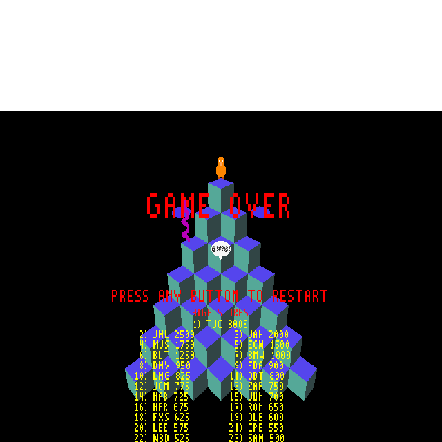

# Plan — Curse bubble "@!#?*" texture map

**Date:** 2026-05-16
**Status:** Complete

## Context

Q✱bert's death sequence shows a speech-bubble with "@!#?*" text floating above the character. The bubble mesh (`curse_bubble.iff`) displays only a plain light-yellow oval — 3D text geometry was abandoned because Blender's `text_add` generates ~90 KB of triangles that overflow the level pool (see `blender_create_qbert.py:2472`). The fix is to bake the text into a UV-mapped TGA texture applied to the bubble's front face only.

The full texture pipeline is already supported end-to-end: `export_level.py:489–512` writes MATL chunks with `TEXTURE_MAPPED` flag + 256-byte texture name when a material's Base Color is linked to `ShaderNodeTexImage`; per-vertex UVs go into the VRTX chunk (`export_level.py:474–479`); `textile-rs` auto-discovers the texture from the MATL chunk and packs it into `Room0.tga`; at runtime `rendobj3.cc:205–211` calls `callbacks.LookupTexture(textureName)`. No engine changes required.

## Approach

All changes in `wflevels/qbert_practice/blender_create_qbert.py`.

### Step 1 — `_generate_curse_bubble_texture(level_dir)`

New function before `_make_curse_bubble_mesh()`: uses PIL to render "@!#?*" centred on a 128×64 RGBA TGA with light-yellow background (255,255,178) and near-black text (20,20,20). Saves to `curse_bubble_text.tga` in the level directory.

### Step 2 — Two-material UV-mapped mesh

Modify `_make_curse_bubble_mesh(tex_path)`:
- Add `uv_layer = _bm.loops.layers.uv.new('UVMap')` after `_bm = _bmesh.new()`
- Front face: `material_index=1`, UV mapped via `U=(x/RX+1)/2`, `V=1-(z/RZ+1)/2`
- Back face, sides, tail: `material_index=0` (default), UV (0,0)
- `mat_text` slot 1: `ShaderNodeTexImage` → `Principled BSDF.Base Color`, image loaded from `tex_path`
- `mesh_data.materials`: append `mat_body` (slot 0) then `mat_text` (slot 1)

### Step 3 — Call site

Generate texture before the actor block:
```python
_curse_tex_path = _generate_curse_bubble_texture(SCRIPT_DIR)
```
Pass `_curse_tex_path` to `_make_curse_bubble_mesh(_curse_tex_path)`.

### Build

```
blender --background wflevels/qbert_practice/qbert_practice.blend \
        --python wflevels/qbert_practice/blender_create_qbert.py
bash wftools/wf_blender/build_level_binary.sh qbert_practice
iffcomp standalone (via build script)
```

## Critical files

| File | Change |
|---|---|
| `wflevels/qbert_practice/blender_create_qbert.py` | `_generate_curse_bubble_texture()`, modify `_make_curse_bubble_mesh()` |
| `wflevels/qbert_practice/curse_bubble_text.tga` | generated artifact — commit |
| `wflevels/qbert_practice/qbert_practice.blend` | updated by Blender run |
| `wflevels/qbert_practice/qbert_practice.lev` + `.iff` | rebuilt |

## Verification

1. `curse_bubble_text.tga` — 128×64 RGB (24-bit), ~25 KB. White background, dark-grey "@!#?@!" text centred. **Must be RGB not RGBA**: `textile-rs rgba_555()` maps alpha>170 → 0 (transparent), turning every fully-opaque RGBA pixel to black; 24-bit bypasses that path via `try_load_tga_bgr555`.
2. `Room0.tga` — 17 KB after textile run (was 146 bytes / 4×16 placeholder with RGBA); 100% non-zero pixels (white background + antialiased text).
3. `xxd curse_bubble.iff | grep -A2 MATL` — two MATL entries, second (`flags=0x02`) with `curse_bubble_text.tga` in the 256-byte name field.
4. Game startup log: `material: texture="curse_bubble_text.tga" bTranslucent=0 bitdepth=15 flags_in=0x2` — texture resolved at load time. (The two `texture=""` lines come from `rendacto.cc` debug-box materials with `emptyTexture`, not from the bubble.)
5. In-game screenshot (debug bridge, actor 33 moved to camera view): "@!#?@!" white speech-bubble visible on pyramid.



6. Build log shows no `cbRoom` overflow (texture replaces geometry, polygon count unchanged).
