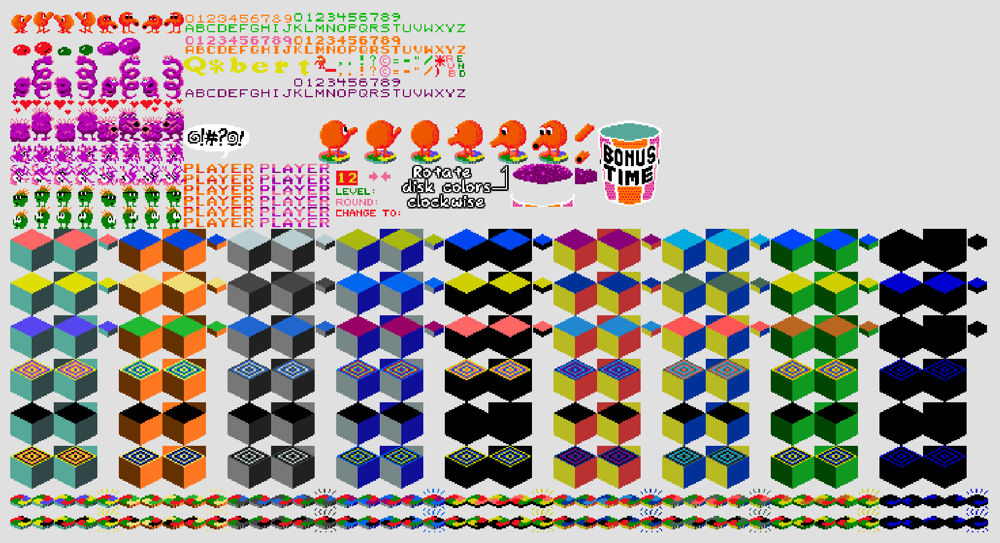
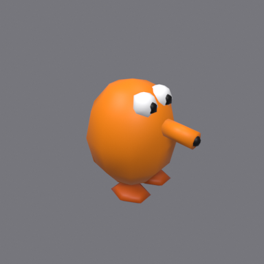
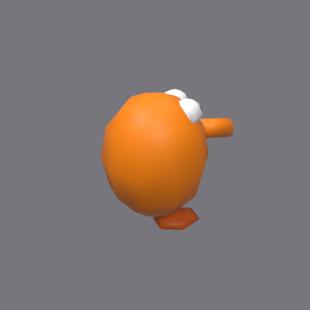
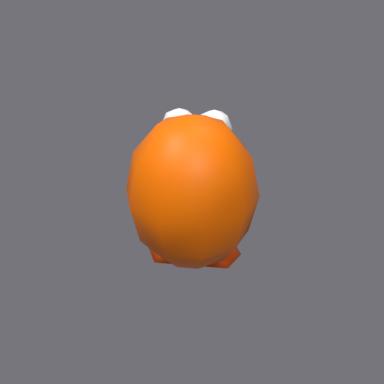
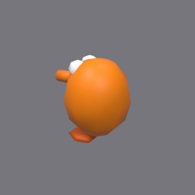
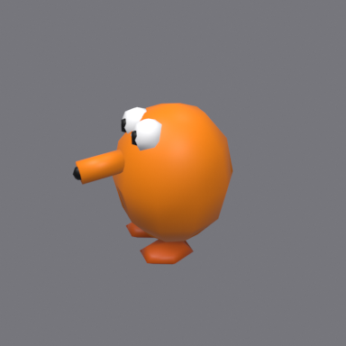
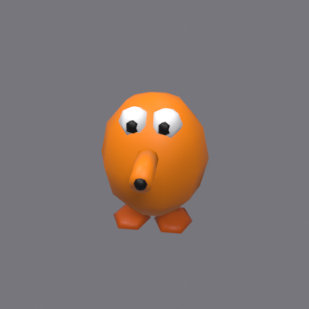

# Q✱bert model + colour-space redesign

**Status:** done (model rebuilt; player.iff + qbert_practice.iff regenerated)
**Date:** 2026-05-17

## Why

The current Q✱bert character renders as a *yellow duck* — wrong on two axes:

1. **Wrong colour from sRGB-as-linear bug.** [`wflevels/qbert_practice/blender_create_qbert.py:367-375`](../../wflevels/qbert_practice/blender_create_qbert.py) `_make_principled_material` writes the RGB triple straight into `BSDF.Base Color.default_value`, which Blender treats as **linear**. The authored value `(1.00, 0.53, 0.00)` is the sRGB code for arcade orange `#FF8700`; setting that as linear over-brightens the green channel back through the sRGB display transform and the hue shifts to yellow. Same bug affects every material made through the helper.
2. **Wrong silhouette.** Snowman body (separate body + head spheres), short cone snout (`depth=0.45`), no pupils, visible cylinder legs. Arcade Q✱bert is a single ovoid with a long trumpet snout, big eyes with black pupils, and tucked-under feet with no visible legs.

## Reference

**Authoritative — full Spriters Resource sprite sheet, asset 60496** ([source](https://www.spriters-resource.com/arcade/qbert/asset/60496/)). User-supplied (Spriters Resource blocks programmatic fetches; user pulled it via browser). Saved as [`docs/qbert/refs/qbert-spriters-resource-asset-60496.png`](../qbert/refs/qbert-spriters-resource-asset-60496.png).



Six Q✱bert poses (centre-top of sheet) confirm: single spherical body (no head bulge), short snub muzzle with two black nostril dots and a slight downward droop at the tip (visible in the side-profile poses), large tightly-spaced eyes with big black pupils on top of the body, stubby orange feet, no visible legs.

Secondary references (less faithful but useful for palette / pyramid layout):

- [`qbert-arcade-cabinet.jpg`](../qbert/refs/qbert-arcade-cabinet.jpg) — Wikipedia cabinet side-art (stylised, snout drawn longer than the sprite).
- [`qbert-arcade-gameplay.png`](../qbert/refs/qbert-arcade-gameplay.png) — small in-game pyramid screenshot (Wikipedia).
- [`qbert-concept-sketch.jpg`](../qbert/refs/qbert-concept-sketch.jpg) — Jeff Lee's pyramid layout sketch.

The harness-side iteration trail lives at [`/home/will/.claude/plans/i-want-you-to-abstract-narwhal.md`](file:///home/will/.claude/plans/i-want-you-to-abstract-narwhal.md).

## Result

3/4-profile render of the rebuilt Q✱bert mesh, Blender-headless via [`docs/qbert/catalogue/render_cards.py`](../qbert/catalogue/render_cards.py) on [`qbert_practice.blend`](../../wflevels/qbert_practice/qbert_practice.blend):


### Turntable (every 60°)

Six views from a fixed camera at `(2.8, -3.6, 2.4)` with the actor rotated about Z. 0° = snout pointing +X (engine-forward); each successive frame is +60° CCW.

<table>
<tr>
<td align="center">0°<br></td>
<td align="center">60°<br></td>
<td align="center">120°<br></td>
</tr>
<tr>
<td align="center">180°<br></td>
<td align="center">240°<br></td>
<td align="center">300°<br></td>
</tr>
</table>

## Approach

### Step 1 — Colour-space fix (one function, fixes every material)

Convert sRGB → linear before writing to `BSDF.Base Color.default_value`. Keep `mat.diffuse_color` (viewport shading) as the sRGB value — that channel is already sRGB-managed.

```python
def _srgb_to_linear(c):
    return c / 12.92 if c <= 0.04045 else ((c + 0.055) / 1.055) ** 2.4

def _make_principled_material(name, rgb):
    mat = bpy.data.materials.new(name=name)
    mat.use_nodes = True
    bsdf = mat.node_tree.nodes.get('Principled BSDF')
    if bsdf:
        lin = tuple(_srgb_to_linear(c) for c in rgb)
        bsdf.inputs['Base Color'].default_value = (*lin, 1.0)
    mat.diffuse_color = (*rgb, 1.0)
    return mat
```

Authored `(1.00, 0.53, 0.00)` now renders as `#FF8700`. Side effect: every other actor (greenball, coily egg purple, etc.) shifts toward its true sRGB target — the right outcome.

### Step 2 — Rebuild `_build_qbert_player_mesh` (lines 378–464)

Keep the function signature (returns a joined mesh named `QbertPlayerMesh`).

| Part | Final (post sprite-sheet correction) |
|------|--------------------------------------|
| Body | Single UV sphere r=0.65 at z=0.85, scaled (1.0, 1.0, 1.20). No separate head — sprite is one continuous sphere. |
| Snout | **Short snub muzzle**: cylinder r=0.13 depth=0.18 at x=0.62, z=1.10 (`mat_orange`). Reads as a small bump, ~1/5 the body width — *not* a trumpet (first attempt mis-modelled this). |
| Nostrils (new) | Two black spheres r=0.038 at x=0.74, y=±0.055, z=1.10 (`mat_pupil`) — the sprite shows them as two distinct dots on the muzzle's tip. |
| Eyes | Large white spheres r=0.18 at x=0.32, y=±0.17, z=1.40 (`mat_eye`). Tightly spaced, top of body. |
| Pupils | Black spheres r=0.09 at x=0.43, y=±0.17, z=1.40 (`mat_pupil`) — half the eye radius, so the white reads as just a ring around each pupil (matches the sprite). |
| Feet | Flattened spheres r=0.24 scale (1.3, 1.0, 0.35) at z=0.05, y=±0.26 (`mat_feet` darker orange). |
| Legs | **Removed.** Sprite shows no visible legs (earlier draft had stubs based on Wikipedia's "two-legged" text; the sprite is the authority). |

Vert count ≈ 264 polys / ~270 verts. Build pipeline ran clean (`qbert_practice.iff` 362496 bytes).

### Step 3 — Rebuild artefacts

1. Re-run `blender_create_qbert.py` headlessly to regenerate `qbert_practice.blend`.
2. Build pipeline per `feedback_qbert_blender_build_pipeline`: `build_level_binary.sh` + `iffcomp` standalone → fresh `player.iff` / `qbert_practice.iff`.
3. Boot the level for visual verification.

### Step 4 — Refresh catalogue render

```sh
blender --background wflevels/qbert_practice/qbert_practice.blend \
        --python docs/qbert/catalogue/render_cards.py
task md -- docs/qbert/catalogue.md
```

## Files

- **Edit:** `wflevels/qbert_practice/blender_create_qbert.py` (lines 367–375, 378–464)
- **Regenerated:** `qbert_practice.blend`, `player.iff`, `qbert_practice.lev{,.bin}`, `qbert_practice.iff`, `docs/qbert/catalogue/actor_player.png` (+ all other catalogue PNGs as side-effect refresh)

## Verification

1. `python3 -m py_compile` on the edited script (per `feedback_py_compile_check`).
2. Boot the level — Q✱bert at apex is saturated orange (`#FF8700`), trumpet snout visible, pupils visible, no legs protruding. Capture `tests/screenshots/qbert_player_redesign.png` per `feedback_screenshots_for_proof`.
3. Re-rendered catalogue — `actor_player` card now shows orange trumpet-nosed Q✱bert.
4. Spot-check redball / greenball / coily-egg renders — colours stay sensible after the sRGB fix.

## Follow-up

- `md-to-pdf.sh` doesn't embed remote `https://` image URLs (they fall through to plain links with the `!` stripped). One-function patch drafted but not applied — `~/python-tui-lib/scripts/md-to-pdf.sh` is outside this repo and auto-mode flagged the cross-repo edit. Track as a separate ask if the user wants it.
- `render_cards.py` actor-light energy was bumped 3× (key 800→2400, fill 400→1200, rim 300→900) because mid-tone orange under default lighting darkened perceptually toward yellow even with materials authored correctly. Not a bug in the colour pipeline — just a luminance constraint.
- The non-Q✱bert actor renders (Sam, Slick, Ugg, Wrongway) inherited the colour-space fix but their meshes are unchanged. If any of those look off vs the sprite sheet, treat as a separate redesign task.
