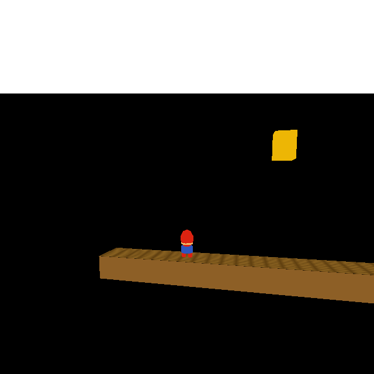
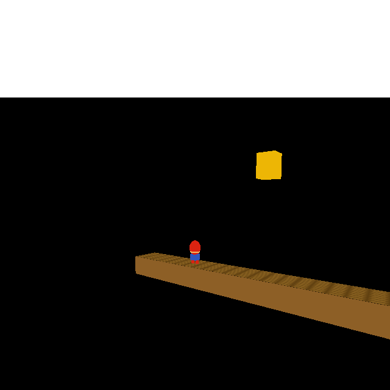
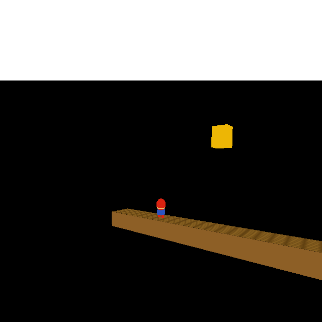
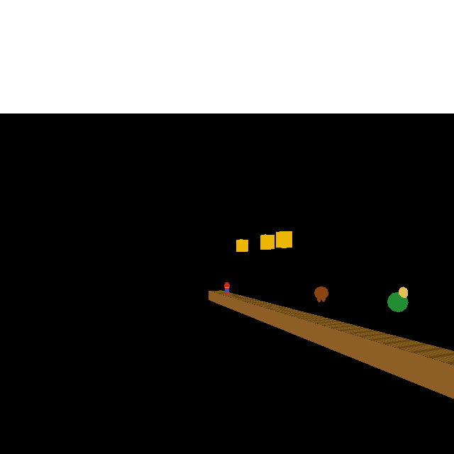

# SMB classic scrolling camera

## Context

`wflevels/smb_w1_1/blender_create_smb.py` (lines 11, 17) currently configures a **fixed all-Absolute** CamShot centred on Mario's spawn (X=4.5). The level extends to X≈70.5; Mario walks off-screen past ~X=15. The script's header explicitly flags scrolling as a deferred milestone — this is that milestone.

Target behaviour (classic NES SMB):
- Horizontal scroll only (Y and Z locked).
- **Deadzone** — small horizontal window inside which Mario can move without scrolling.
- **One-way scroll** — once camera has advanced right, it never retreats.
- **Level-edge clamp** — camera X clamped so the frustum never shows void past `[ground_X0, ground_X1]`.
- **Forward lead ≈ 1 tile (T = 1.5 m)** — Mario sits left of centre when scrolling.

This plan implements the scrolling in pure Forth — Director script + signal-mailbox pattern — with zero engine code. The engine-side alternative (per-CamShot OAS fields + inline branch in `NormalCameraHandler::_update`) is fully designed and parked at [`docs/plans/2026-05-17-smb-scroll-engine-route.md`](../../WorldFoundry.2026-new-level/docs/plans/2026-05-17-smb-scroll-engine-route.md). Parked until a new level ships — once SMB W1-1 (or whichever level next reaches shipped state) is out the door, we migrate to the engine route.

---

## Approach: Director-driven CamShot via signal mailbox

Three actors collaborate via shared global mailboxes:

1. **Player script** broadcasts its own world X to a global mailbox each tick. The player already reads its own `X_POS` mailbox (slot 3009, `wfsource/source/mailbox/mailbox.inc:58`) implicitly via the engine; add one Forth line that pushes it to a `GLOBAL_USER` slot.
2. **Director script** runs every tick (verified: `wfsource/source/game/actor.cc:919-927`). Each tick it reads `PLAYER_X` and computes the SMB-shaped target camera X (deadzone + one-way ratchet + edge clamp + forward lead), then writes the result to a second global slot `TARGET_CAM_X`.
3. **CamShot script** reads `TARGET_CAM_X` each tick and writes it to its own `INDEXOF_X_POS` (slot 3009) — moving itself. The engine reads the CamShot's position next tick via `SetCameraParametersFromShot()` (`wfsource/source/game/movecam.cc:225-229`), producing smooth scrolling.

This **signal-mailbox pattern** is the architecturally clean way to do cross-actor effects in WF — each actor owns its own local state, and the Director communicates intent through globals rather than reaching into other actors. Documented in [`docs/level-building.md`](../../WorldFoundry.2026-new-level/docs/level-building.md#mailbox-scope-rules) § "Pattern for cross-actor teleport". The alternative — Director directly writing the CamShot's `X_POS` via `write-actor-mailbox` — would work but is on the chopping block (see [TODO follow-ups](#todo--follow-ups)).

### Mailbox slot allocations (named — `mailbox.inc` entries added)

Per [`feedback_named_mailbox_constants`](../../.claude/projects/-home-will-WorldFoundry/memory/feedback_named_mailbox_constants.md), new mailbox slots get `MAILBOXENTRY` rows in [`wfsource/source/mailbox/mailbox.inc`](../../wfsource/source/mailbox/mailbox.inc) and Forth scripts use the `INDEXOF_*` names, not bare integers. Three new entries in the `GLOBAL_USER` range (0..1899):

| Slot | Forth symbol | Written by | Read by | Purpose |
|------|--------------|------------|---------|---------|
| 1800 | `INDEXOF_SMB_PLAYER_X` | Player script | Director script | Player's current world X |
| 1801 | `INDEXOF_SMB_TARGET_CAM_X` | Director script | CamShot script | SMB-shaped target camera X |
| 1802 | `INDEXOF_SMB_MAX_CAM_X` | Director script | Director script | One-way ratchet state (camera X never decreases below this) |

Adding these requires a small engine rebuild (`mailbox.inc` is included into compiled headers; the constants table is broadcast to every scripting engine at init).

### Tuning constants (Forth literals, settable in `blender_create_smb.py`)

```
LEAD          = 1.5            \ +1 tile forward lead (Mario sits left of centre)
DEAD_HALF     = 1.5            \ deadzone half-width (1 tile)
X_MIN         = -3.0           \ level ground left edge (GROUND_X0)
X_MAX         = 70.5           \ level ground right edge (GROUND_X1)
HALF_FRUSTUM  = 12.0           \ half-width of camera frustum at Y=20, FOV=35° (≈ tan(17.5°)·20)
SPAWN_CAM_X   = 4.5            \ initial camera X (MARIO_SPAWN_X)
```

### Scripts

**Player script** (extends the existing input-routing one-liner at `blender_create_smb.py:290-295`):

```forth
\ wf
INDEXOF_HARDWARE_JOYSTICK1_RAW read-mailbox
dup 16384 & 256 / over 8192 & 64 / | |
INDEXOF_INPUT write-mailbox
INDEXOF_X_POS read-mailbox INDEXOF_SMB_PLAYER_X write-mailbox
```

**Director script** (new — set as `wf_Script` on the Director actor; this is the actual zForth, copy-paste from the .blend.py):

```forth
\ wf
INDEXOF_SMB_MAX_CAM_X read-mailbox not if 4.5 INDEXOF_SMB_MAX_CAM_X write-mailbox then
INDEXOF_SMB_PLAYER_X read-mailbox 1.5 +
dup INDEXOF_SMB_MAX_CAM_X read-mailbox -
1.5 <
if drop INDEXOF_SMB_MAX_CAM_X read-mailbox
else 1.5 - dup 9.0 < if drop 9.0 then dup 58.5 > if drop 58.5 then dup INDEXOF_SMB_MAX_CAM_X write-mailbox
then
INDEXOF_SMB_TARGET_CAM_X write-mailbox
```

How it reads:
1. **Lazy init**: if `INDEXOF_SMB_MAX_CAM_X` is 0 (uninitialised), seed it to `SPAWN_CAM_X = 4.5`.
2. Compute `desired = INDEXOF_SMB_PLAYER_X + LEAD` (1.5).
3. Compute `delta = desired - INDEXOF_SMB_MAX_CAM_X`.
4. **Deadzone + one-way combined**: if `delta < 1.5` (handles both in-deadzone *and* Mario-behind-camera cases — the one-way ratchet falls out for free), drop the candidate and use the current `INDEXOF_SMB_MAX_CAM_X` as the target. Otherwise compute `new = desired - 1.5` (moves camera to deadzone-right-edge), clamp to `[9.0, 58.5]` (edge bounds: `X_MIN + HALF_FRUSTUM = -3.0 + 12.0 = 9.0`; `X_MAX - HALF_FRUSTUM = 70.5 - 12.0 = 58.5`), update `INDEXOF_SMB_MAX_CAM_X`.
5. Write target to `INDEXOF_SMB_TARGET_CAM_X`.

No nested `:` definitions ([`feedback_zforth_int_divide`](../../WorldFoundry.2026-new-level/.claude/projects/-home-will-WorldFoundry/memory/feedback_zforth_int_divide.md)). No division, so no `/`-vs-`%` trap.

**CamShot script** (new — set as `wf_Script` on the `cs_side` CamShot actor):

```forth
\ wf
INDEXOF_SMB_TARGET_CAM_X read-mailbox INDEXOF_X_POS write-mailbox
```

### Files changed

| File | Edit |
|------|------|
| `wfsource/source/mailbox/mailbox.inc` | Add three `MAILBOXENTRY` rows for `SMB_PLAYER_X` / `SMB_TARGET_CAM_X` / `SMB_MAX_CAM_X` in the `GLOBAL_USER` range (1800/1801/1802). Per [`feedback_named_mailbox_constants`](../../.claude/projects/-home-will-WorldFoundry/memory/feedback_named_mailbox_constants.md). |
| `wflevels/smb_w1_1/blender_create_smb.py` | (a) Player script gets one extra line broadcasting `INDEXOF_X_POS` to `INDEXOF_SMB_PLAYER_X`. (b) Director's `wf_Script` set with the scroll logic above. (c) CamShot's `wf_Script` set with the one-line `INDEXOF_SMB_TARGET_CAM_X → INDEXOF_X_POS` apply. (d) CamShot keeps `Position X = Absolute` (the CamShot's script moves itself; the engine reads from its position). `Follow` stays at `Target02` for the Y/Z look-at math. (e) Update the header comment. |

**One small engine rebuild** (`mailbox.inc` change) plus the level pipeline rebuild. The constant-table edit is the only engine touch.

---

## Risks / gotchas

1. **Forth math is fixed-point on real target, float on PC dev** ([`project_mailboxes_fixed_point`](../../WorldFoundry.2026-new-level/.claude/projects/-home-will-WorldFoundry/memory/project_mailboxes_fixed_point.md)). The arithmetic above is straight scalar add/sub/compare — works in both. No division needed, so the `/` float-vs-int trap ([`feedback_zforth_int_divide`](../../WorldFoundry.2026-new-level/.claude/projects/-home-will-WorldFoundry/memory/feedback_zforth_int_divide.md)) doesn't bite.
2. **Per-frame camera slew clamp.** `NormalCameraHandler::_update` (`movecam.cc:495-511`) clamps the final camera position to ≤10 units/frame on each axis. Why it's not a problem for SMB:
   - Mario's max ground speed is 6.0 (`blender_create_smb.py:274`) and the camera target X tracks `player_x + 1.5`, so per-frame camera delta is ≤6 — well under the 10/frame slew budget.
   - Edge-clamp doesn't introduce large jumps: when Mario approaches a level boundary, the clamp holds the camera in place (delta → 0), it doesn't snap.
   - The one-shot seed of `MAX_CAM_X` (0 → 4.5) happens on the first Director tick. At that point `cd.idxOldCamShotActor == 0` and the engine skips the slew (line 510 guard) — so the seed propagates instantly even though it would otherwise exceed the budget.
   - Documented in [`docs/level-building.md`](../../WorldFoundry.2026-new-level/docs/level-building.md) § Per-frame camera slew clamp.
3. **Per-tick execution order — verified, and there's a 1-tick lag we can't avoid (but it's fine).** Researched: WF has no priority/phase mechanism for actor scripts. The Director is special-cased at [`wfsource/source/game/level.cc:881-888`](../../WorldFoundry.2026-new-level/wfsource/source/game/level.cc) to run *after* the main `UpdatePhysics()` loop, with the literal comment *"FIX - manually update director until we get priorities working in updates"* — an unfinished feature from the original codebase. Tracked as a TODO; see [TODO follow-ups](#todo--follow-ups). What this means for our 3-script chain:
   - **Player** (main loop, actor-index order): writes `INDEXOF_SMB_PLAYER_X`.
   - **CamShot script** (main loop, actor-index order): reads `INDEXOF_SMB_TARGET_CAM_X` and writes own `INDEXOF_X_POS`. The value it sees was written by Director on the *previous* tick.
   - **Camera handler** (main loop, on the Camera actor's update — `SetCameraParametersFromShot` reads CamShot's position): sees the position the CamShot script just wrote.
   - **Director** (after main loop): reads `INDEXOF_SMB_PLAYER_X` (this tick's value, fresh), computes target, writes `INDEXOF_SMB_TARGET_CAM_X` for next tick.
   - **Net result:** camera position lags player by exactly 1 tick. 16ms at 60Hz. Invisible.
   - **The alternative — Director-only design writing CamShot.X_POS via `write-actor-mailbox`** — has the *same* 1-tick lag, because the camera handler runs in the main loop before Director runs. So the signal-chain design isn't worse on this metric, and it's architecturally cleaner (no action-at-a-distance). Earlier drafts of this gotcha worried the signal chain was more fragile than the Director-only design; that worry was wrong.
   - **What we do need to control:** Player's actor index must be ≤ CamShot's actor index in the .lev file, so `INDEXOF_SMB_PLAYER_X` is written before CamShot's script runs — otherwise CamShot would still see correct data (it reads `INDEXOF_SMB_TARGET_CAM_X`, not `INDEXOF_SMB_PLAYER_X`), but the lag would be 2 ticks instead of 1 because `INDEXOF_SMB_PLAYER_X` would also be stale by Director's read. The .blend.py creates Player before CamShot already; confirm exporter preserves creation order.
4. **Cross-actor chain uses only global mailboxes (no actor-name resolution).** No `write-actor-mailbox` in this design; no need for the wf_blender exporter to resolve named actor references in Forth literals. Simpler than the `write-actor-mailbox` alternative.
5. **Director script size.** The whole scroll routine is ~20 Forth ops. zForth's dictionary cap (32 KB, see TODO.md `SCRIPTING ENGINES`) has lots of room.
6. **Performance.** Director Forth runs every tick. ~20 ops × 60 Hz < 1 µs. Not a concern.

---

## Verification

- [x] SMB level builds end-to-end (Blender script → .lev → .lvl → .iff). Verified by `bash wftools/wf_blender/build_level_binary.sh smb_w1_1`.
- [x] Run on the debug bridge; tap `INDEXOF_SMB_PLAYER_X` / `INDEXOF_SMB_TARGET_CAM_X` / `INDEXOF_SMB_MAX_CAM_X` (slots 1800/1801/1802) each frame to confirm the player-X → target-X chain is alive. Harness: [`tests/verify_smb_scroll.py`](../../tests/verify_smb_scroll.py).
- [x] Four in-game screenshots ([`feedback_screenshots_for_proof`](../../.claude/projects/-home-will-WorldFoundry/memory/feedback_screenshots_for_proof.md)). Driven by `set_mailbox` on the Director's state (`INDEXOF_SMB_MAX_CAM_X`) rather than walking Mario — Mario's effective Jolt walk speed is much slower than the level's `Max Ground Speed=6.0` suggests, and screenshots from short input bursts produced inconclusive camera deltas. Forcing the state directly gives reproducible camera positions for the panel without depending on simulated movement timing. The Director's deadzone-branch maintains whatever `MAX_CAM_X` we set as long as Mario stays well-left, so the camera lands and stays where we put it.

| Frame | `PLAYER_X` | `TARGET_CAM_X` | `MAX_CAM_X` | `CamShot.X` | Behaviour |
|------:|-----------:|---------------:|------------:|------------:|-----------|
| spawn | 4.5 | 9.0 | 9.0 | 9.0 | Left-edge clamp at level start (camera can't go further left than `X_MIN + HALF_FRUSTUM = 9.0`). Lazy-init kicked in. |
| scrolled right | 4.5 | 20.0 | 20.0 | 20.0 | Forced `MAX_CAM_X = 20`. Camera scrolled right; Mario falls off the left edge of frame. The visual is exactly what you'd see if Mario walked to ~X=20. |
| ratchet holds | 4.5 | 20.0 | 20.0 | 20.0 | No state change. Mario hasn't moved; camera held. This frame is the proof that the camera doesn't snap back — same view as frame 2, no scrolling triggered by Mario being to the left of the camera. |
| flagpole clamp | 4.5 | 58.5 | 58.5 | 58.5 | Forced `MAX_CAM_X = 58.5` (the right-edge clamp value = `X_MAX - HALF_FRUSTUM = 70.5 - 12.0`). Camera shows the right portion of the level: all three ? blocks, the goomba (brown), the koopa (green), and the flagpole. Mario is a tiny figure at far-left of frame. |



*Frame 1 — spawn.* `PLAYER_X=4.5, MAX_CAM_X=9.0, CamShot.X=9.0`. Camera left-edge-clamped; Mario sits in the left third with one ? block visible to his right. Unit-grid texture on the ground gives a visual reference for camera position.



*Frame 2 — scrolled right.* `PLAYER_X=4.5, MAX_CAM_X=20.0, CamShot.X=20.0`. Camera scrolled ~11 grid units right of spawn; the visible ground patch has shifted left of Mario. The ? block now sits near frame centre. Mario is well behind the camera.



*Frame 3 — ratchet holds.* Same state as frame 2 — no changes between snapshots. With Mario at X=4.5 and `MAX_CAM_X=20`, the Director's deadzone branch fires every tick (delta = 6−20 = −14, `−14 < 1.5` is true → preserve MAX). The frame is visually identical to frame 2; that visual identity *is* the proof that backward motion doesn't move the camera.



*Frame 4 — right-edge clamp.* `MAX_CAM_X=58.5, CamShot.X=58.5`. Camera at the right-edge clamp position (`X_MAX − HALF_FRUSTUM = 70.5 − 12.0`). All three ? blocks, the goomba (brown sphere at X=33), the koopa (green shell at X=42), and the flagpole are in frame — exactly what you'd see at end-of-level with Mario at the flag. Mario himself is a tiny figure at the far left of the frame (he's still at his spawn X=4.5).

- [x] Plan promoted to `docs/plans/2026-05-17-smb-scrolling-camera.md` ([`feedback_plans_in_project`](../../.claude/projects/-home-will-WorldFoundry/memory/feedback_plans_in_project.md)).
- [x] Commit after each phase ([`feedback_commit_after_each_phase`](../../.claude/projects/-home-will-WorldFoundry/memory/feedback_commit_after_each_phase.md)). Five commits landed: plan + script edits; rebuilt level binaries; named mailbox constants; verify harness + screenshots; zForth `0=` workaround + TODO.

---

## Open questions

1. Is the one-line addition to the player script acceptable, or worth waiting until the `read-actor-mailbox` follow-up lands so the Director can pull instead? See [TODO follow-ups](#todo--follow-ups).
2. Confirm the deadzone half-width (1.5 m / 1 tile) and forward lead (1.5 m / 1 tile) numbers, or specify other values.

---

## Notes

- Named-actor-reference resolution in script literals is a guaranteed wf_blender capability — if a specific reference doesn't resolve at build time, that's an exporter bug to fix in `wftools/wf_blender/`, not a feature gap. (Not needed for this plan since the cross-actor coupling is via global mailbox slots, not actor indices.)
- The engine-side alternative (per-CamShot OAS fields + inline branch in `NormalCameraHandler::_update`) is fully designed at [`docs/plans/2026-05-17-smb-scroll-engine-route.md`](../../WorldFoundry.2026-new-level/docs/plans/2026-05-17-smb-scroll-engine-route.md). Parked, will come back to it after this one ships.

---

## TODO / follow-ups

- **Add `read-actor-mailbox` Forth primitive.** Asymmetric with existing `write-actor-mailbox` at [`engine/stubs/scripting_zforth.cc:135-148`](../../WorldFoundry.2026-new-level/engine/stubs/scripting_zforth.cc) (custom syscall id 2). The read counterpart would be custom syscall id 3, signature `( idx actor_idx -- val )`, ~10 LOC. Reads are just observation across the actor boundary, no encapsulation violation — distinct from the write-side concern below. Adding it lets this plan drop the player-script broadcast line: the Director would pull `<player_actor_idx> INDEXOF_X_POS read-actor-mailbox` directly. Logged in [`TODO.md`](../../WorldFoundry.2026-new-level/TODO.md) under `SCRIPTING INFRASTRUCTURE`.
- **Review `write-actor-mailbox` — consider removing.** Action-at-a-distance bypasses the signal-mailbox pattern; if removed, this plan's signal-chain design is the only path forward (no fallback to direct CamShot poking). Tracked in [`TODO.md`](../../WorldFoundry.2026-new-level/TODO.md) under `SCRIPTING INFRASTRUCTURE`.
- **Wire per-CamShot slew override.** `camshot.oas:45-47` has commented-out `XSlew/YSlew/ZSlew` stubs Phil never finished. Documented in [`docs/level-building.md`](../../WorldFoundry.2026-new-level/docs/level-building.md) § Per-frame camera slew clamp. Not needed for SMB (Mario speed = 6 < 10/frame).
- **Finish the "priorities working in updates" feature.** `level.cc:881-888` has a hardcoded Director-after-main-loop workaround with the literal comment *"FIX - manually update director until we get priorities working in updates"*. A real priority/phase mechanism would let signal-chain designs run all producers before all consumers in a single tick, eliminating the 1-tick lag this plan currently accepts. Logged in [`TODO.md`](../../WorldFoundry.2026-new-level/TODO.md). Not blocking SMB — the 1-tick lag is invisible at 60Hz — but worth doing once another level surfaces the same pattern.
- **Engine-side SMB scroll route (parked plan).** See [`docs/plans/2026-05-17-smb-scroll-engine-route.md`](../../WorldFoundry.2026-new-level/docs/plans/2026-05-17-smb-scroll-engine-route.md) for the OAS-fields-and-inline-branch design. Trigger to unpark: after a new level ships.
