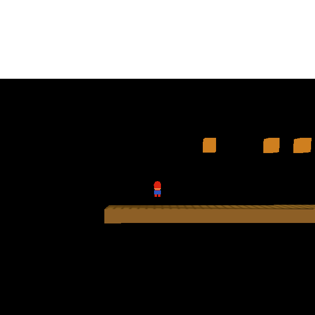

# Plan — CRDT→engine bridge (Option C): Doc edits → `wfmut` → viewport

**Date:** 2026-05-20
**Status:** **DONE 2026-05-21 (~3 h actual vs ~1–2 wk estimate) — a Properties-panel edit moves the actor on screen.** All four milestones complete; the v1 capstone of the [editor shell](2026-05-20-editor-app-shell.md) (D7) / [property panel](2026-05-20-editor-property-panel.md) (D5) line is in. Two follow-ups logged in [TODO.md](../../TODO.md): full OAD field coverage via a schema-generated `kPropMap` (D5), and the whole-`Doc` `observe_deep` observer for remote/replay/DAP edits (D3, a networking-milestone item). The estimate stays on the average-programmer scale ([feedback_estimate_average_programmer_scale](/home/will/.claude/projects/-home-will-WorldFoundry/memory/feedback_estimate_average_programmer_scale.md)); actual was fast because both halves (`wfmut` + the editable Doc) were already built — the bridge is glue.

**M3** ✓ (wire commit → `wfmut` → viewport): `RenderProperties` reports which fields committed; `editor_frame` propagates each through `PropagateToEngine(doc_index, field)` → `TranslateField` → `wfmut::SetActorPos`/`SetActorOrientation`/`SetActorField` on the live `theLevel` (game thread — the callback runs inside `RunEditor`, so no marshalling). The next `StepFrame` re-renders the mutated actor. Orientation wraps revolutions to `[0,1)` at the `Angle::Revolution` boundary. **Proof** (headless `WF_EDIT_BRIDGE_TEST`, which edits a Doc leaf as the panel commit would, then propagates): House Position Z **−0.125 → 6.000** through the full Doc→bridge→`wfmut` path (engine `GetActorPos` before/after confirms), and the viewport shows the House lifted off the snow — [before](../../tests/screenshots/wfedit_m3_before.png) → [after](../../tests/screenshots/wfedit_m3_after.png). ASan+UBSan+LSan-clean; runtime byte-unchanged (`wf_edit` gained `engine/mutation` on its include path for `wfmut.hpp` — editor target only). Next: **M4** is this status sync.

**M2** ✓ (field translation): `TranslateField(PropField) → EngineWrite{Pos|Orient|FieldFloat|FieldInt|NoOp}` + a `WF_EDIT_BRIDGE_DEBUG` `DumpTranslations` dump. On House: **17/92 fields map** (Position→`Pos`, Orientation→`Orient` in revolutions, + the 14 `kPropMap` scalar/enum fields → `FieldFloat`/`FieldInt` with the right `movebloc.`/`common.`/`mesh.` path, e.g. `Step Size`→`movebloc.StepSize`=0.55, `Max Ground Speed`→`movebloc.MaxGroundSpeed`=10.0, `Mobility`→`movebloc.Mobility`=0 via the enum label→index path; the duplicate `Model Type` accounts for the 17th); the other 75 → `NoOp` (the unmapped long tail, D4). Fixed-point/`l` suffixes are stripped in coercion; ASan+UBSan+LSan-clean. **Keying finding (D6):** fields are keyed on the OAD `name` — the *full, unique* identifier ("Step Size", "Max Ground Speed"), which is exactly the string the `.lev`/Doc carries — **not** the OAD's `displayName` (a shorter, *non-unique* UI label: four movement fields share "Acceleration", "Max Ground Speed"→"Max Speed"). Probed both directly to confirm. (`displayName` for compact panel labels is a logged follow-up.) Next: **M3** (wire the panel commit through `wfmut`).

**M1** ✓: new editor-only TU [`engine_bridge.{h,cc}`](../../engine/wf_edit/engine_bridge.cc) with `DocActorToEngineIdx(i) = i + 1` (Doc `content[i]` 0-based ↔ engine 1-based `wfmut::ActorIdx`; the engine list reserves slot 0). Verified by a `WF_EDIT_BRIDGE_DEBUG` one-shot dump (in `editor_frame`, [main.cc](../../engine/wf_edit/main.cc)) cross-checking each Doc actor's `Position` leaf against the live actor's `currentPos()`: on snowgoons **29/36 exact XYZ matches**, with the 7 exceptions understood and labelled — **5 non-actor slots** (`GetObject` returns null: Rooms live in `LevelRooms`, `Level`/`tool01`/`GeoSphere01` aren't world-placed; editing one hits `wfmut`'s graceful "not an actor" rejection) + **2 activation boxes** (`Actboxor01`/`02`, whose Y/Z the engine repositions from room geometry at load — note their engine positions are swapped, matching snowgoons' mirror-symmetric Room01/Room02). All 36 names + the X axis confirm the offset. ASan+UBSan+LSan-clean (`build-editor/`, now Debug+ASan after a stale `WF_ASAN=OFF` was reconciled to the [Debug default](/home/will/.claude/projects/-home-will-WorldFoundry/memory/project_debug_asan_default.md)); runtime byte-unchanged. Next: **M2** (field translation).
**Estimate:** ~1–2 weeks on the average-programmer scale ([feedback_estimate_average_programmer_scale](/home/will/.claude/projects/-home-will-WorldFoundry/memory/feedback_estimate_average_programmer_scale.md)) — the design doc's "direct-read engine bridge" line item ([collaborative editor design](../investigations/2026-05-18-collaborative-level-editor-design.md), line 665, cited from the [engine mutation API plan](2026-05-19-engine-mutation-api.md) step 7). De-risked: both halves already exist — `wfmut::` (engine write surface, done) and the editable Doc (property panel, done). The new work is the **glue**: identity mapping + value coercion + the commit→`wfmut` call.
**Owner:** Claude (Will reviewing)
**Branch:** `2026-new-level`

---

## Context

The [property panel](2026-05-20-editor-property-panel.md) made every Properties widget editable: an edit commits to the selected actor's Doc leaf (`DATA`/`STR`) in a `wfcrdt` transaction (`WriteFieldLeaf`, [level_doc.cc:308](../../engine/wf_edit/level_doc.cc)). **But the viewport does not change** — moving an actor's `Position` or `Mass` in the panel updates the Doc and nothing on screen. This plan closes that last hop.

The two halves are already built and shipped:

| Half | What it gives us | Status |
|------|------------------|--------|
| **Editable Doc** ([property panel](2026-05-20-editor-property-panel.md)) | The selected actor's fields, OAD-typed, edits committing to the Doc leaf at a known `child_index`. | ✅ done |
| **`wfmut::`** ([engine mutation API](2026-05-19-engine-mutation-api.md)) | `SetActorPos` / `SetActorOrientation` / `SetActorField` / `SetMailbox` over a live `Level&`, game-thread-synchronous, in-place (Jolt body synced for transform). | ✅ done |

What's missing is the bridge between them:

```
  panel edit                                           the gap this plan fills
 ┌───────────┐   WriteFieldLeaf   ┌──────────┐   ???   ┌──────────┐  StepFrame  ┌──────────┐
 │  ImGui    │ ─────────────────► │  Doc leaf│ ──────► │  wfmut:: │ ──────────► │ viewport │
 │  widget   │   (transaction)    │ DATA/STR │         │ live Actor│  (re-render)│ reflects │
 └───────────┘                    └──────────┘         └──────────┘             └──────────┘
        already done (Phase 3)                          ▲ this plan ▲
```

**Realized (M3):** editing snowgoons' House `Position` Z −0.125 → 6.0 in the panel propagates through the bridge and the House lifts off the snow:

| Before (`Z = −0.125`) | After (`Z = 6.0`) |
|---|---|
|  |  |

The `wfmut` regression suite stays green alongside (Verification #6) — the bridge consumes `wfmut`, it doesn't change it:



Three problems sit in that gap, in rising order of difficulty:

1. **Identity** — the Doc OBJ at `content[i]` (what the Outliner selects, `EditorCtx::selected`) must map to the engine actor's 1-based `wfmut::ActorIdx`. The Doc is built from `levtree parse <lev>` ([level_doc.cc](../../engine/wf_edit/level_doc.cc)); the engine loaded the `.iff` compiled from the **same** `.lev` ([main.cc:226](../../engine/wf_edit/main.cc)) — so the orderings should correspond, but system/camera actors and the 1-based vs 0-based offset have to be pinned, not assumed.
2. **Field addressing** — `wfmut::SetActorField` keys on `"block.field"` paths (`"movebloc.Mass"`), but the editor's [`PropField`](../../engine/wf_edit/property_panel.h) carries only the field **name** (`"Mass"`) — no block. And `wfmut`'s `kPropMap` ([wfmut.cpp:183](../../engine/mutation/wfmut.cpp)) is a **hand-curated 15-field subset** (4 `common`, 8 `movebloc`, 3 `mesh`), while the panel can edit all ~88 OAD fields. The bridge needs a name→path map and a coverage policy for the long tail.
3. **Value coercion** — the Doc leaf is text (`"0.0(1.15.16)"`, an enum label, a VEC3 component triple). `wfmut` wants typed values (`Vector3`, `Euler` in revolutions, `double`, `int64_t`). The panel already parses these for display; the bridge reuses that.

### The live engine handle is already reachable

`wfmut` calls take a `Level&`. The engine exposes the current level as the global `Level* theLevel` ([level.hp:109](../../wfsource/source/game/level.hp); also `WFGame::CurrentLevel()`, [game.hp:112](../../wfsource/source/game/game.hp)) — the same handle the debug bridge's `DebugServer_DrainQueue(Level& level)` ([debug_server.cc:574](../../engine/stubs/debug_server.cc)) is handed. The editor's per-frame `editor_frame` callback ([main.cc:84](../../engine/wf_edit/main.cc)) runs **inside `WFGame::RunEditor` on the game thread**, so calling `wfmut` from there satisfies its game-thread contract (the X5 cross-thread guard) with **no marshalling**. `wfmut` is already linked into `wf_edit`: it compiles at the union of `WF_DEBUG_BRIDGE` and `WF_ENABLE_EDITOR` ([CMakeLists.txt:494](../../CMakeLists.txt)), and the editor build sets `WF_ENABLE_EDITOR=ON`.

---

## Decisions

| # | Decision | Choice | Reason |
|---|----------|--------|--------|
| D1 | Where the bridge lives | **New editor TU `engine/wf_edit/engine_bridge.{h,cc}`, gated `WF_ENABLE_EDITOR`.** Owns identity mapping + field→`wfmut` translation + the propagation call. Engine code **untouched** — verify `wf_game`/Android/iOS build **byte-unchanged** (mirrors [property-panel D1a](2026-05-20-editor-property-panel.md)). | Keeps the bridge in the editor where the OAD/Doc knowledge lives; `wfmut` is the engine-side surface and already exists — no new engine code. |
| D2 | How the editor reaches the live `Level` | **Use the global `Level* theLevel`** (`#include <game/level.hp>`), null-guarded (no level loaded → skip propagation, Doc still edits). Called from `editor_frame`, which is on the game thread → `wfmut` thread contract met with no queue. | The engine already publishes `theLevel`; it's exactly what the debug bridge mutates. No new plumbing through `editor_hook` (which passes only the opaque `ctx`). |
| D3 | Trigger: observe Doc vs. drive off the panel commit | **v1 drives off the panel's commit signal** (`RenderProperties` reports the field it committed → bridge propagates it), **not** a whole-Doc observer. | `wfcrdt` exposes only **shallow** `observe` ([wfcrdt.hpp:198,223](../../engine/crdt/wfcrdt.hpp), per-`Map`/`Array`, fires on direct children) — a deep field-leaf edit lives many levels down the chunk tree, so a tree observer would need `observe_deep`, which the wrapper doesn't expose yet. In v1 the **only** writer is the local panel, which already knows `(actor, field)` at commit. This honors the design's "observe → `wfmut`" intent at the commit point. The true Doc-observer (`observe_deep` → resolve any leaf → `wfmut`, for **remote-collaborator / replay / DAP** edits) belongs to the networking milestone — flagged in Out-of-scope, with `observe_deep` named as the wrapper addition it needs. |
| D4 | Field coverage in v1 | **Transform (`Position`→`SetActorPos`, `Orientation`→`SetActorOrientation`) + the 15 `kPropMap` scalar fields.** Any other field: the Doc still updates (already works), the bridge logs "no engine mapping yet," the viewport is unchanged — graceful degradation, exactly the [property-panel D6 fallback](2026-05-20-editor-property-panel.md) shape. | These are the fields that **visibly** change the viewport (an actor moving/rotating; mass/speed/mobility under physics; `ModelType`) **and** the fields `wfmut` already supports — maximum visible win, zero new engine code. The long tail (elasticities, mailbox values, bounding box, script) mostly produces **no** visible viewport change even when applied. |
| D5 | The `kPropMap` long tail — root cause | **Don't hand-expand `kPropMap` field-by-field in this plan.** The root-cause fix is to **generate `kPropMap` from the `.ht`/`.oas` schema** so it covers every OAD field without curation — tied to the [`.ht` codegen pipeline](/home/will/.claude/projects/-home-will-WorldFoundry/memory/project_oas_ht_codegen.md). Flagged as a follow-up (TODO + Out-of-scope), triggered when a consumer needs a field outside the 15. | [feedback_root_cause_not_symptom](/home/will/.claude/projects/-home-will-WorldFoundry/memory/feedback_root_cause_not_symptom.md): hand-adding rows is the symptom patch; codegen from the schema is the real fix. v1 doesn't need it (D4 covers the visible fields), so it stays a flagged follow-up, not silent scope creep. |
| D6 | Doc field name → `wfmut` path | **Name→path table in the bridge** keyed on the OAD `name` — the *full, unique* field identifier ("Step Size", "Model Type", "Max Ground Speed"), which is exactly the string the `.lev`/Doc carries (so `PropField.name` is the key). **NOT** the OAD's `displayName` (`descriptor.xdata.displayName`): that is a shorter, *non-unique* UI label (four movement fields share "Acceleration", "Max Ground Speed"→"Max Speed") — fine for compact panel labels (logged follow-up), ambiguous for engine addressing. Each entry stores the `wfmut` `"block.field"` path + an `is_float` flag (mirrors `kPropMap`'s `is_fixed32`), since `PropField`/`OadEntry` ([oad_reader.h](../../engine/wf_edit/oad_reader.h)) carry no block. Transform names (`Position`/`Orientation`) route to the transform calls, not a path. | `kPropMap` keys are the only block info; mirroring them in a tiny editor-side table is the least-coupling way. (When D5's codegen lands, both the engine `kPropMap` and this table generate from one schema source.) **Verified empirically** (2026-05-21, M2): probed `descriptor.name` vs `descriptor.xdata.displayName` directly — `name` is the unique full label authored into the `.lev`; `displayName` is the Max-editor's terse grouped label. Initially mis-assumed `name` was a terse `"ModelType"`-style struct-member id — it isn't. |
| D7 | Value coercion + WF conventions | Doc leaf text → typed `wfmut` value: VEC3 triple → `Vector3`; `EULR` → `Euler` **in revolutions** ([feedback_angles_in_revolutions](/home/will/.claude/projects/-home-will-WorldFoundry/memory/feedback_angles_in_revolutions.md) — `wfmut::SetActorOrientation` already takes revolutions); fixed-point float → `double` (`wfmut` does the ×65536 internally); enum → its **index** `int64_t`. Reuse the panel's existing parse helpers; check for existing math constants first ([feedback_check_existing_constants](/home/will/.claude/projects/-home-will-WorldFoundry/memory/feedback_check_existing_constants.md)). | The panel already round-trips these values for display; the bridge converts the *committed* leaf, not re-derives. |
| D8 | Direction of sync | **One-way Doc → engine only. No engine → Doc write-back.** The viewport reflects the edit purely because the engine re-renders the mutated live actor each `StepFrame`; the Doc stays the source of truth. | Matches the design ("engine stays Rust-free, editor owns the Y.Doc") and [wfmut v1 "no observe-from-engine"](2026-05-19-engine-mutation-api.md) (out-of-scope §). No cycle to guard against. |
| D9 | Identity mapping shape | **Positional: `content[i]` ↔ `wfmut::ActorIdx` with a verified constant offset**, cross-checked at load against actor `currentPos()` / name so a mismatch fails loudly instead of silently mutating the wrong actor. Resolved against snowgoons in M1 (the one genuine unknown — done first, like [wfmut D2](2026-05-19-engine-mutation-api.md)). | Same `.lev` source → same order is the likely truth, but system/camera actors + 1-based offset must be **pinned**, not assumed; a wrong map silently moving actor N+1 is the worst failure mode. |

---

## Milestones (each its own commit, per [feedback_commit_after_each_phase](/home/will/.claude/projects/-home-will-WorldFoundry/memory/feedback_commit_after_each_phase.md); plan doc lands with M1 per [feedback_commit_docs_with_code](/home/will/.claude/projects/-home-will-WorldFoundry/memory/feedback_commit_docs_with_code.md))

Standing directives during execution: log gotchas to [docs/level-design-troubleshooting.md](../../docs/level-design-troubleshooting.md) the moment they surface ([feedback_level_plans_log_to_designer_guide](/home/will/.claude/projects/-home-will-WorldFoundry/memory/feedback_level_plans_log_to_designer_guide.md)); keep the plan `**Status:**` + [wf-status.md](../../wf-status.md) row in sync ([feedback_plan_status_sync](/home/will/.claude/projects/-home-will-WorldFoundry/memory/feedback_plan_status_sync.md)); read the [level-design guides](../../docs/level-building.md) before touching spawn/actor/render paths ([feedback_read_level_design_guides](/home/will/.claude/projects/-home-will-WorldFoundry/memory/feedback_read_level_design_guides.md)).

### 1. Identity mapping — `content[i]` ↔ `wfmut::ActorIdx` (the one real unknown) — first — ✅ DONE 2026-05-21 (`deed9b3`)
- **Outcome:** `DocActorToEngineIdx(i) = i + 1` verified — 29/36 snowgoons actors exact-XYZ, 5 no-engine-actor (Rooms/Level/Tool/GeoSphere), 2 engine-managed activation boxes; all 36 names + X confirm the offset. See Status.
- New `engine/wf_edit/engine_bridge.{h,cc}` (gated `WF_ENABLE_EDITOR`); add to `wf_edit` sources in `CMakeLists.txt`. Copy this plan into `docs/plans/`; add a wf-status.md Active row.
- `int DocActorToEngineIdx(int doc_index)`: establish the offset from `content[i]` (0-based, LVL dropped — [level_doc.h:24](../../engine/wf_edit/level_doc.h)) to `Actor::GetActorIndex()` ([actor.hp:200](../../wfsource/source/game/actor.hp), 1-based, 11-bit). Verify against snowgoons: for each Doc actor, fetch the engine actor at the mapped idx (`theLevel->GetObject(idx)`) and assert its `currentPos()` matches the Doc `Position` leaf (and/or name) — a `WF_EDIT_BRIDGE_DEBUG` dump of the full `doc_index → engine_idx → name/pos` correspondence is the verification artifact.
- **Gate:** the mapping is verified for all 36 snowgoons actors (or the mismatch is understood + handled — e.g. system actors excluded). No `wfmut` calls yet. Runtime byte-unchanged. ASan-clean.

### 2. Field translation — Doc field → `wfmut` op + coerced value — ✅ DONE 2026-05-21
- **Outcome:** `TranslateField` + `EngineWrite{Pos|Orient|FieldFloat|FieldInt|NoOp}` (split the planned single `Field`/`Mailbox` into `FieldFloat`/`FieldInt` to match `wfmut`'s typed overloads; `None`→`NoOp` to dodge Xlib's `#define None`). House: 17/92 mapped, long tail `NoOp`; ASan-clean. Verified via `DumpTranslations` (a dedicated `WF_EDIT_BRIDGE_DEBUG` dump, cleaner than threading through `WF_EDIT_TEST_SET`). Keyed on the OAD `name` (full unique id), not `displayName` — see Status + D6.
- `engine_bridge`: `struct EngineWrite { enum {Pos, Orient, Field, Mailbox, None} kind; std::string path; Vector3 vec; Euler eul; double d; int64_t i; }` + `EngineWrite TranslateField(const PropField&)`:
  - name `"Position"` → `{Pos, vec=parse3(data)}`; `"Orientation"` → `{Orient, eul=parse3(data) as revolutions}` (D7).
  - name in the 15-entry name→path table (D6) → `{Field, path, d|i}` coercing per `FieldKind` (Float→`double`, Int/Enum→`int64_t` index, fixed-point handled by `wfmut`).
  - `showAs=MAILBOX` (none in snowgoons today) → `{Mailbox, …}` stub.
  - anything else → `{None}` (logged "no engine mapping yet", D4).
- Reuse the panel's existing component/number parsing ([property_panel.cc](../../engine/wf_edit/property_panel.cc) `RespellNumber`/`FmtFloat`/`FmtInt`); check `Vector3`/`Scalar` constants first (D7).
- **Gate:** unit-style headless coverage (extend the `WF_EDIT_TEST_SET` harness, [main.cc:244](../../engine/wf_edit/main.cc)) — translate `Position`, `Orientation`, `Mass`, `Mobility`, `MaxGroundSpeed`, and one unmapped field; assert the produced `EngineWrite` (op + value), `None` for the unmapped one. No live engine yet. ASan-clean.

### 3. Wire commit → bridge → `wfmut` → viewport — ✅ DONE 2026-05-21
- **Outcome:** `RenderProperties` gained an optional `std::vector<int>* committed` out-param; `editor_frame` propagates each committed field via `PropagateToEngine`. Proof captured via a headless `WF_EDIT_BRIDGE_TEST` env (edits a Doc leaf, then propagates through the same `PropagateToEngine` path) — House Z −0.125→6.0, viewport shows it lifted ([before](../../tests/screenshots/wfedit_m3_before.png)/[after](../../tests/screenshots/wfedit_m3_after.png)); ASan-clean. Revolutions wrapped to `[0,1)` at the `Angle::Revolution` boundary. `--select` takes `=` not a space (gotcha). See Status.
- `RenderProperties` ([property_panel.h:74](../../engine/wf_edit/property_panel.h)) already returns a committed-bool; extend it to report **which** `PropField` committed (out-param index, or the field itself).
- In `editor_frame` ([main.cc:154](../../engine/wf_edit/main.cc)), after a commit: `engine_idx = DocActorToEngineIdx(c->selected)`; `EngineWrite w = TranslateField(field)`; dispatch via `theLevel` (null-guarded, D2) → `wfmut::SetActorPos` / `SetActorOrientation` / `SetActorField`. The next `StepFrame` re-renders the mutated actor — the viewport reflects the edit on the following frame.
- **Gate** (the headline proof, [feedback_screenshots_for_proof](/home/will/.claude/projects/-home-will-WorldFoundry/memory/feedback_screenshots_for_proof.md)): edit a snowgoons actor's `Position` in the panel → **screenshot shows it move**; edit `Orientation` → it rotates; edit `Mass`/`Mobility` → physics behaviour changes across stepped frames. Before/after PPM→PNG via the [headless screenshot recipe](/home/will/.claude/projects/-home-will-WorldFoundry/memory/project_wfedit_screenshot_capture.md) (`--screenshot PATH` with a **space**, `run_in_background`, repo-path PPM). ASan+UBSan+LSan-clean over edit→commit→propagate→step. Runtime byte-unchanged.

### 4. Docs + status sync — ✅ DONE 2026-05-21
- Plan `**Status:**` → Done w/ actuals; [wf-status.md](../../wf-status.md) Active row updated through M1–M4; [design doc](../investigations/2026-05-18-collaborative-level-editor-design.md) Tier-2 bridge milestone ticked (Option C landed; file-watch leapfrogged); the two follow-ups (`kPropMap`-codegen D5, `observe_deep` remote-edit D3) logged in [TODO.md](../../TODO.md) ([feedback_log_discoveries_in_todo](/home/will/.claude/projects/-home-will-WorldFoundry/memory/feedback_log_discoveries_in_todo.md)).

---

## Verification

1. **Runtime engine byte-unchanged** — `WF_ENABLE_EDITOR` OFF → `wf_game`/Android/iOS carry no bridge code (D1); the bridge compiles only into `wf_edit`.
2. **Identity map correct** — every snowgoons Doc actor maps to the engine actor with matching position/name (M1 dump).
3. **Edit → viewport** — `Position`/`Orientation`/`Mass`/`Mobility` panel edits visibly change the viewport; before/after screenshots (M3 gate).
4. **Graceful degradation** — an unmapped field edits the Doc and logs "no engine mapping," no crash (D4).
5. **ASan/UBSan/LSan clean** over edit→commit→translate→`wfmut`→step ([ASan by default](/home/will/.claude/projects/-home-will-WorldFoundry/memory/project_debug_asan_default.md)); built in `build-editor/` ([project_wf_edit_build_path](/home/will/.claude/projects/-home-will-WorldFoundry/memory/project_wf_edit_build_path.md)).
6. **`wfmut` regression intact** — `wfmut_smoke` + `wfmut_bridge` CTests still green (the bridge consumes `wfmut`, doesn't change it).

---

## Critical files

**Create:** `engine/wf_edit/engine_bridge.{h,cc}` — identity map + `TranslateField` + propagation call (this plan); `docs/plans/2026-05-20-crdt-engine-bridge.md` (this doc).
**Modify:** [`engine/wf_edit/main.cc`](../../engine/wf_edit/main.cc) (`editor_frame` calls the bridge after a commit; `#include <game/level.hp>` for `theLevel`), [`engine/wf_edit/property_panel.{h,cc}`](../../engine/wf_edit/property_panel.cc) (`RenderProperties` reports the committed field), `CMakeLists.txt` (`engine_bridge.cc` into `wf_edit` **under `WF_ENABLE_EDITOR`**), [wf-status.md](../../wf-status.md), [TODO.md](../../TODO.md).
**Reuse (no edits):** [`engine/mutation/wfmut.hpp`](../../engine/mutation/wfmut.hpp) (the write surface — already linked into `wf_edit`), [`wfsource/source/game/level.hp`](../../wfsource/source/game/level.hp) (`theLevel`, `GetObject`), [`wfsource/source/game/actor.hp`](../../wfsource/source/game/actor.hp) (`GetActorIndex`, `currentPos`).
**Read (context):** [`engine/crdt/wfcrdt.hpp`](../../engine/crdt/wfcrdt.hpp) (`observe` is shallow-only — D3), [property panel](2026-05-20-editor-property-panel.md), [engine mutation API](2026-05-19-engine-mutation-api.md).

---

## Out of scope (each its own later plan)

- **Whole-Doc deep observer** — propagating **remote-collaborator / replay / DAP / programmatic** Doc edits (not just the local panel) needs `wfcrdt::observe_deep` (the wrapper has shallow `observe` only — D3) + leaf→`(actor,field)` resolution. Lands with the **networking/presence** milestone; v1's commit-driven path is the seam it slots into.
- **Full OAD field coverage** — generate `kPropMap` from the `.ht`/`.oas` schema so all ~88 fields propagate (D5), tied to the [`.ht` codegen pipeline](/home/will/.claude/projects/-home-will-WorldFoundry/memory/project_oas_ht_codegen.md). Triggered when a field outside the 15 needs to drive the viewport.
- **Engine → Doc write-back** — physics moving an actor reflecting back into the Doc. The design keeps the Doc authoritative; out of scope (D8).
- **Mesh/`ModelType` hot-swap correctness** — if changing `ModelType` needs an asset reload (not just an offset write) to re-render, that reload path is its own piece; v1 writes the field and notes if the mesh doesn't visibly change.
- **`SpawnActor`/`RemoveActor` from the editor** — the Outliner add/delete → `wfmut::SpawnActor`/`RemoveActor`. `wfmut` has them ([engine mutation API](2026-05-19-engine-mutation-api.md)) but `SpawnActor` is committed-but-unconfirmed at runtime; a later editor plan once the SMB Gold work exercises it.

---

## Cross-references

- Parent: [editor shell plan](2026-05-20-editor-app-shell.md) (D7 — names this as the next plan), [property panel plan](2026-05-20-editor-property-panel.md) (D5 — stops at the Doc), [engine mutation API plan](2026-05-19-engine-mutation-api.md) (the `wfmut::` surface this consumes), [wfcrdt C++ RAII wrapper](2026-05-19-wfcrdt-cpp-raii-wrapper.md), [`.lev`↔Y.Doc translator](2026-05-20-iff-lev-ydoc-translator.md).
- Design: [collaborative editor design § Tier 2 Engine↔CRDT bridge](../investigations/2026-05-18-collaborative-level-editor-design.md) (line 665, 767).
- Sibling consumer: [live editor bridge](2026-04-29-live-editor-bridge.md) (the Blender↔engine path, also a `wfmut` consumer).
- Memory: [feedback_plans_before_implementation](/home/will/.claude/projects/-home-will-WorldFoundry/memory/feedback_plans_before_implementation.md), [feedback_root_cause_not_symptom](/home/will/.claude/projects/-home-will-WorldFoundry/memory/feedback_root_cause_not_symptom.md), [feedback_angles_in_revolutions](/home/will/.claude/projects/-home-will-WorldFoundry/memory/feedback_angles_in_revolutions.md), [feedback_check_existing_constants](/home/will/.claude/projects/-home-will-WorldFoundry/memory/feedback_check_existing_constants.md), [feedback_screenshots_for_proof](/home/will/.claude/projects/-home-will-WorldFoundry/memory/feedback_screenshots_for_proof.md), [project_wfedit_screenshot_capture](/home/will/.claude/projects/-home-will-WorldFoundry/memory/project_wfedit_screenshot_capture.md), [project_wf_edit_build_path](/home/will/.claude/projects/-home-will-WorldFoundry/memory/project_wf_edit_build_path.md), [project_debug_asan_default](/home/will/.claude/projects/-home-will-WorldFoundry/memory/project_debug_asan_default.md), [project_oas_ht_codegen](/home/will/.claude/projects/-home-will-WorldFoundry/memory/project_oas_ht_codegen.md), [feedback_commit_after_each_phase](/home/will/.claude/projects/-home-will-WorldFoundry/memory/feedback_commit_after_each_phase.md), [feedback_commit_docs_with_code](/home/will/.claude/projects/-home-will-WorldFoundry/memory/feedback_commit_docs_with_code.md).
