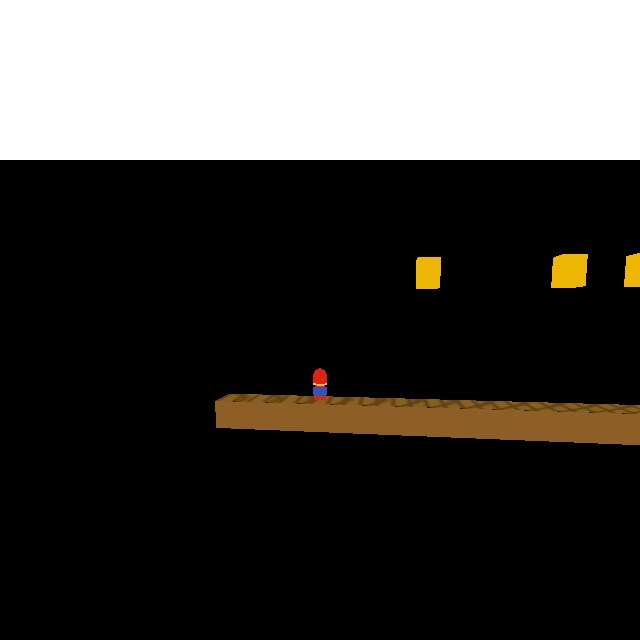
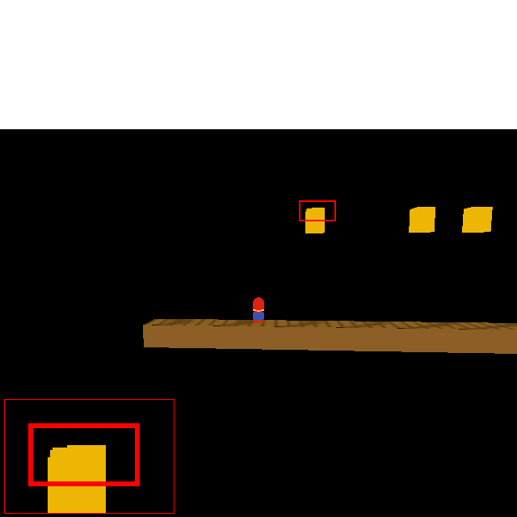

# Generator — spawn at colspace top, not center

**Status:** Done — committed `0aecb44` 2026-05-21  
**Context:** Follow-on fix discovered while verifying [2026-05-21-gold-ttl-despawn.md](2026-05-21-gold-ttl-despawn.md)

## Problem

`Generato::update()` called `GetColSpace().GetCenter(currentPos())` for the spawn position.
For the SMB `?`-block generator, the block center is Z=6.75 m — the *middle* of the block.
The coin template spawned half-embedded inside the block body, not above it.

Confirmed via `--debug-print-actors` + `fprintf` trace:

```
Generato::FIRING obj=12 spawn=(12.00,0.00,6.75) vel=(0.00,0.00,8.00)
```

Expected: coin pops out of the **top** of the block (Z=7.50 m), matching SMB arcade behaviour.

## Fix

Use the colspace unexpanded max Z for spawn height while keeping the XY center:

```cpp
Vector3 center = _physicalAttributes.GetColSpace().GetCenter( currentPos() );
Scalar  topZ   = _physicalAttributes.GetColSpace().UnExpMax( currentPos() ).Z();
Vector3 pos = Vector3( center.X(), center.Y(), topZ ) + displacement;
```

`ColSpace::UnExpMax(pos)` returns `_coarseColBox.Max(pos)` — the global-space maximum of
the unexpanded (un-grown) bounding box, which is the actor's actual surface top.

After fix, log confirms:

```
Generato::FIRING obj=12 spawn=(12.00,0.00,7.50) vel=(0.00,0.00,8.00)
```

## File

| File | Change |
|------|--------|
| `wfsource/source/game/generator.cc` | Replace `GetCenter()` with top-surface spawn; add comment |

## Notes

- `ColSpace::Max()` (expanded) was wrong — it uses the collision-safe grown box, which is
  slightly larger than the visible mesh. `UnExpMax()` is the right choice here.
- The generator is generic; this fix benefits any object spawner (coin pop, enemy spawn, etc.)
  where objects should emerge from the top surface of the spawning actor.

## Verification

Build clean (`task build`). Log shows spawn=(12.00,0.00,7.50).

Scene overview (camera pulled back to Y=−30 per [2026-05-21-camera-pullback.md](2026-05-21-camera-pullback.md);
all three `?`-blocks visible, coin arc fits in frame):



Coin (annotated red box — smaller bright-yellow square above qblock_00) at Z≈9.5 m
after one physics tick (dt≈1 s on dev machine; arc: Z = 7.5 + 8t − 6t²):


