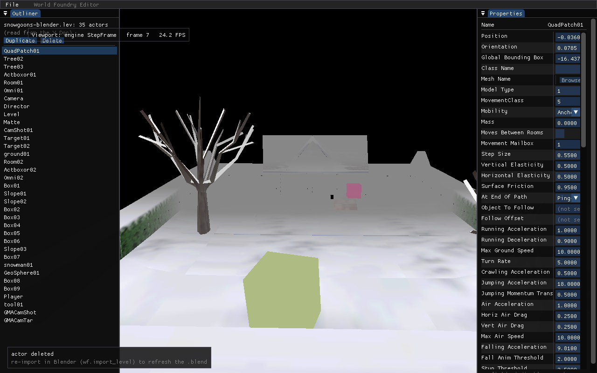
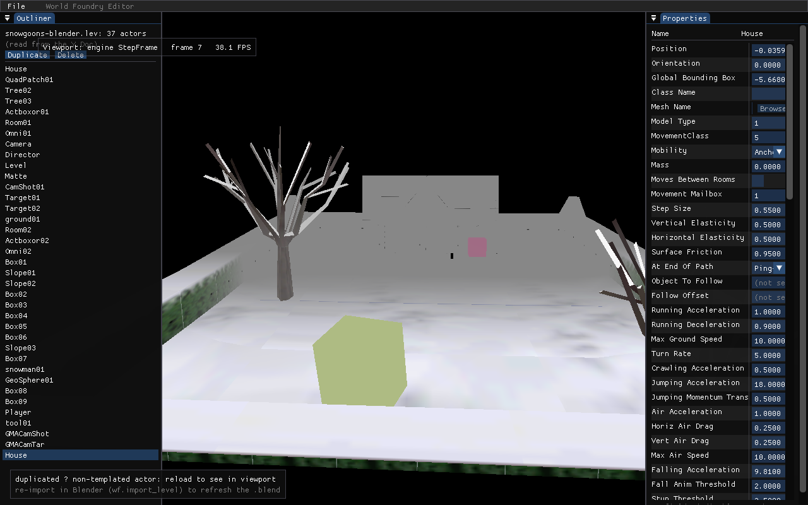
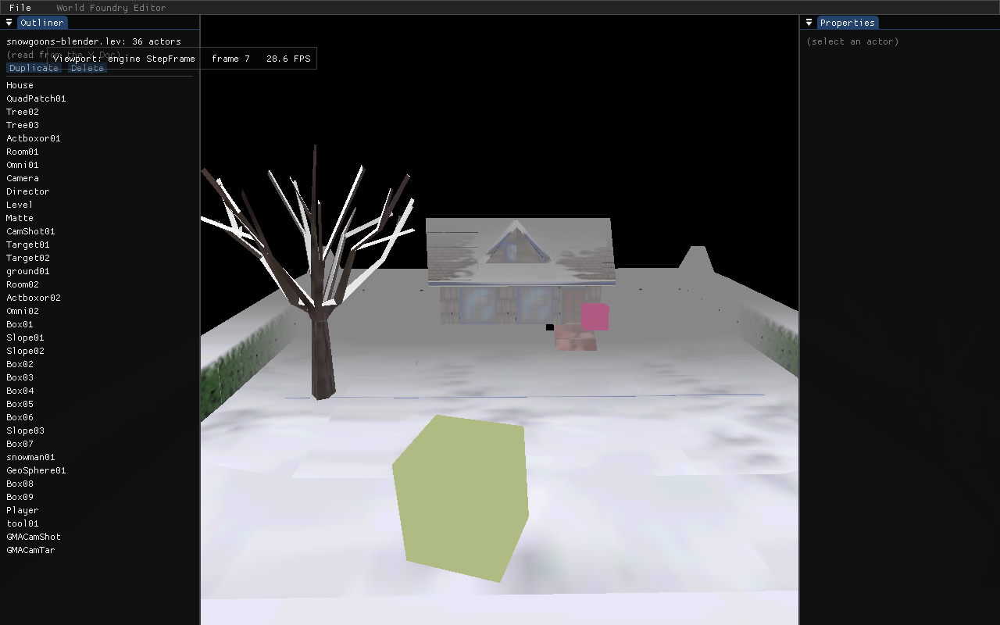

# Plan — Live Structural Sync (M2)

**Date:** 2026-05-21
**Status:** Done
**Branch:** `2026-new-level`

## Context

Outliner Duplicate/Delete (landed 2026-05-21) updates the Doc and persists correctly,
but sets `structural_dirty` which suspends all field→viewport propagation until reload.
Root cause: `DocActorToEngineIdx` uses the positional formula `doc_index + 1`, which
goes stale after any structural edit changes the actor count.

SpawnActor confirmed working for generator-class actors (2026-05-21). RemoveActor
confirmed working for gameplay actors.

## What

Replace the positional formula with a stable `doc→engine` index map. Structural edits
maintain the map instead of setting `structural_dirty`:
- **Delete**: call `RemoveActor` on the engine actor, erase the map entry → propagation
  continues for surviving actors immediately.
- **Duplicate (templated)**: call `SpawnActor`, push the new engine idx → new actor
  appears live in the viewport.
- **Duplicate (non-templated)**: push sentinel 0 → new actor's field edits are no-ops
  at the engine (toast explains); all other actors still propagate live.

`structural_dirty` is removed from the delete and templated-duplicate paths. It is kept
only for the non-templated duplicate to block the actor's own propagation (but this is
now implicit via the 0 sentinel — the field in `EditorCtx` can be dropped entirely in
a follow-up once the non-templated case is acceptable).

## Implementation

### `engine_bridge.h` — add three declarations
```cpp
void InitBridgeMap(wfcrdt::Doc& doc);          // call on level load
void BridgeNotifyDelete(int doc_i);            // call before DeleteActor
bool BridgeNotifyDuplicate(int src_doc_i, int new_doc_i); // call after DuplicateActor
```

### `engine_bridge.cc` — stable map
```cpp
static std::vector<wfmut::ActorIdx> s_doc_to_engine; // 0 = no live actor (sentinel)
```
- `InitBridgeMap`: fills `{1, 2, ..., N}` (same as old formula); called once when level loads.
- `DocActorToEngineIdx`: returns `s_doc_to_engine[doc_index]` (0 = invalid).
- `BridgeNotifyDelete(doc_i)`: save engine idx, erase from map, call `RemoveActor`.
- `BridgeNotifyDuplicate(src, new)`: `HasTemplate(src_engine_idx)` → `SpawnActor` at
  `GetActorPos(src) + Vector3(0,0,0.5)` with `parentIdx=1`; push result or 0.

### `main.cc` — wire the notify calls
- Add `InitBridgeMap` call on first frame when both `c->doc` and `theLevel` are live.
- `DoDelete`: call `BridgeNotifyDelete` before `DeleteActor`; refresh without setting `structural_dirty`.
- `DoDuplicate`: call `BridgeNotifyDuplicate` after `DuplicateActor`; only show
  "reload to see" toast (no `structural_dirty` set — 0 sentinel makes it a natural no-op).
- Remove `structural_dirty = true` from `RefreshAfterStructural`; rename to `RefreshActorList`.
- Keep `structural_dirty` field and guard in the Properties panel for any future cases,
  but stop setting it from delete/duplicate paths.

## Spawn position safety

Use source actor position + `Vector3(0, 0, 0.5f)` (0.5 WF units upward). This keeps
the spawn inside the source room and avoids exact overlap with the source actor.
Acknowledged constraints: don't spawn outside the room, don't spawn inside another
object — this offset is a best-effort heuristic for v1.

## Verification

### Steps
1. Delete a House: disappears from viewport; surviving actors' field edits still propagate live.
2. Duplicate a Generator/enemy: appears live in viewport. Field edits to the duplicate propagate immediately.
3. Duplicate a non-templated actor: toast "reload to see"; save + reload shows it; other actors unaffected.

### Screenshot evidence (headless)

| Step | Screenshot | Result |
|------|-----------|--------|
| Delete House |  | Outliner shows 35 actors; "actor deleted" toast; Properties live on QuadPatch01 |
| Dup non-templated (House) |  | Outliner shows 37 actors; "reload to see" toast; no crash |
| Dup templated (live spawn) | — needs level with Actor-kind templates | snowgoons/qbert only have Room/Tool templates (confirmed by spawn-test Part A) |

Baseline before either edit (36 actors):



### Videos (interactive, deferred)
- [ ] Delete a House — disappears from viewport live
- [ ] Duplicate a Generator/enemy — appears live; field edits propagate
- [ ] Duplicate a non-templated actor — toast; save + reload shows it

## Files

| File | Change |
|------|--------|
| `engine/wf_edit/engine_bridge.h` | Add `InitBridgeMap`, `BridgeNotifyDelete`, `BridgeNotifyDuplicate` |
| `engine/wf_edit/engine_bridge.cc` | Stable map + notify implementations; update `DocActorToEngineIdx` |
| `engine/wf_edit/main.cc` | Wire notify calls; split `RefreshAfterStructural` |
