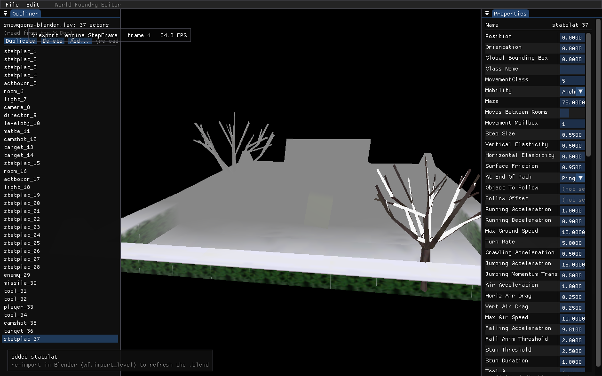

# Add Actor — wf-edit Outliner

**Date:** 2026-05-22
**Status:** Done — implemented 2026-05-22 (~1.5 h)
**Related:** [camshot enum round-trip hard-fail](2026-05-22-camshot-enum-roundtrip-hardfail.md), [Outliner add/delete](2026-05-21-outliner-add-delete.md), [CRDT→engine bridge](2026-05-20-crdt-engine-bridge.md), [editor property panel](2026-05-20-editor-property-panel.md)

## Context

The `wf-edit` Outliner can **Duplicate** and **Delete** actors but cannot add a brand-new actor of a chosen class from scratch — the one obvious gap in structural editing. Duplicate only helps when an instance of the class you want already exists in the level.

This adds an **"Add…"** action: pick a class from a dropdown, and a new actor is inserted into the CRDT Doc, populated with the **full set of fields from that class's OAD defaults**, selected, and ready to edit in the Properties panel. The fields are load-bearing — a sparse 4-field actor (the cheap alternative) would force the user to Duplicate-and-edit anyway, defeating the point — so we populate the complete field set.

Two project facts make this safe and bounded:

- **`levcomp-rs` already default-fills** any field absent from the `.lev` from the class OAD ([`wftools/levcomp-rs/src/oad_loader.rs`](../../wftools/levcomp-rs/src/oad_loader.rs):296-372, sized from the schema at `:96-117`; only `Class Name` is mandatory at parse, [`lev_parser.rs`](../../wftools/levcomp-rs/src/lev_parser.rs):240). So the actor compiles regardless.
- **The existing C++ OAD reader is reused** — `wfedit::LoadOad` ([`engine/wf_edit/oad_reader.cc`](../../engine/wf_edit/oad_reader.cc):56, already linked into `wf_edit`) yields each field's `button_type`, `name`, `show_as`, `min/max`, `def`, and parsed enum `options[]`. We do not reimplement OAD parsing; we only map those typed defaults to the `.lev` leaf spelling, which is small and well-defined (below).

## Canonical leaf formatting (the only "new" formatting, verified against the decompiler)

`levtree print` emits a `Num` literal's `text` **verbatim**, then `iffcomp` re-tokenizes it ([`wftools/levtree-rs/src/lib.rs`](../../wftools/levtree-rs/src/lib.rs):269-274). Correctness is therefore *value-match*, not byte-match — any decimal denoting the same `f64` quantizes to the same fixed-point (proven by the compile gate). The canonical spellings (`lib.rs:170-187`, mirrored by the C++ writer [`wftools/iffwrite/text.cc`](../../wftools/iffwrite/text.cc) `out_int32`/`out_scalar`):

| OAD `button_type` | Doc `chunk_type` | leaves (kind→text) |
|---|---|---|
| `BUTTON_FIXED32` (and FX16) | `FX32`/`FX16` | `DATA` num `"<def/65536.0 round-trip decimal>(1.15.16)"` |
| `BUTTON_INT32`/16/8 (plain) | `I32`/`I16`/`I8` | `DATA` num `"<def>l"` (suffix `l`/`w`/`y` by width) |
| int + `show_as ∈ {DROPMENU,RADIOBUTTONS,CHECKBOX}` (enum) | `I32` | `DATA` num `"<def>l"` **and** `STR` str `"<options[def]>"` (index and label MUST agree — the camshot hard-fail rejects disagreement) |
| `BUTTON_STRING` | `STR` | `DATA` str `"<def text or empty>"` |
| object/class/camera/light reference, filename/meshname | `STR` | `STR` str `""` (levcomp writes the 0/`-1` sentinel) |
| GROUP_*, COMMONBLOCK/ENDCOMMON, PROPERTY_SHEET, XDATA/WAVEFORM | — | **skip** (not a stored field; levcomp handles sentinels) |

Reals: format `def/65536.0` (exactly representable — denominator is 2¹⁶) with enough digits to round-trip the `f64` (e.g. `%.17g`, ensure a `.`), then append `(1.15.16)`. Mirror the C++ `out_scalar` convention; tidiness (shortest decimal) is optional, correctness is the value.

## Implementation

### 1. `AddActor(doc, className)` — [`engine/wf_edit/level_doc.cc`](../../engine/wf_edit/level_doc.cc)

Add beside `DuplicateActor` (`:517`); declare in [`level_doc.h`](../../engine/wf_edit/level_doc.h) next to `DeleteActor`/`DuplicateActor` (`:38-39`). Reuse `GenerateEid` (`:28`) and the `wfcrdt::Input` builder idiom from `DocChunkToInput`/`BuildLiteral` (`:482`, `:106`).

Build the OBJ chunk = `{ chunk_type:"OBJ", items:[ … ] }`:

- **Top-level NAME** leaf: `{ 'NAME' "<class>_<content.len()+1>" }` (instance name; matches the decompiler's `<class>_<n>` idiom).
- **Transform scaffold** (not OAD fields — they come from the object header): `Position` (VEC3), `Orientation` (EULR), `Global Bounding Box` (BOX3), each `DATA` num `"0.0(1.15.16)"` ×3/×3/×6. All-zero BBox is safe — `expand_thin_bbox` ([`lvl_writer.rs`](../../wftools/levcomp-rs/src/lvl_writer.rs):531) pushes each axis to a ≥0.25 span so the engine colbox assert never fires.
- **`Class Name`** STR field = the picked class.
- **All OAD CommonBlock fields**: `LoadOad(FindOad(className), entries)`, then for each entry build a field chunk via the helper below — **skipping** `Class Name`/`Position`/`Orientation`/`Global Bounding Box` (already emitted as scaffold) and skip-typed entries (GROUP/COMMONBLOCK/etc.).
- Stamp `_eid = GenerateEid()` and `_src_eid = ""` (empty → bridge gives no live preview; reload shows it — identical to today's non-templated duplicate).
- `content.push(obj)`; return `content.len() - 1`.

### 2. OAD-entry → field-chunk helper — `level_doc.cc` (anon namespace)

Small builders mirroring `BuildLiteral`: `LitStr(v)` → `{kind:"str",value}`, `LitNum(t)` → `{kind:"num",text}`, `Field(chunkType, fieldName, leaves…)` → `{chunk_type, items:[ {NAME …}, <leaf chunks> ]}`. The dispatch per the table above keys on `OadEntry::button_type`/`show_as`. Reuse the existing `button_type`→kind classification already encoded in [`property_panel.cc`](../../engine/wf_edit/property_panel.cc)'s `ResolveProperties` (`:193`) so the editor has one source of truth for "which button types are FX vs INT vs STR vs enum vs skip"; factor a tiny shared classifier if it avoids divergence.

`FindOad`/`OadForClass` currently live in `property_panel.cc`'s anon namespace (`:82`, `:97`) — expose a thin `wfedit::FindOad(class)`/`OadForClass(class)` (or a new `OadDefaultsForClass`) in [`property_panel.h`](../../engine/wf_edit/property_panel.h) so `level_doc.cc` can resolve the class OAD. (`LoadOad` itself is already public in [`oad_reader.h`](../../engine/wf_edit/oad_reader.h).)

### 3. Outliner UI + `DoAddActor` — [`engine/wf_edit/main.cc`](../../engine/wf_edit/main.cc)

- Add an **"Add…"** `SmallButton` in the Outliner button row (after the Duplicate/Delete `EndDisabled` at `:727`, since Add needs no selection) that calls `ImGui::OpenPopup("add_actor")`.
- A `BeginPopup("add_actor")` with an `ImGui::BeginCombo` over the class list (reuse the combo idiom at `property_panel.cc:370`), an **Add** and **Cancel** button. Class list: a `static const char* kClasses[]` from [`wfsource/source/oas/objects.lc`](../../wfsource/source/oas/objects.lc) (NullObject…gold), default selection `statplat` (a known-safe world class). Only offer classes whose `.oad` resolves (toast if `FindOad` is empty).
- `DoAddActor(c, className)` near `DoDuplicate` (`:330`): call `wfedit::AddActor`, then `RefreshActorList(c)`, `c->selected = ni`, `c->fields_for = -1`, set `c->structural_dirty = true` (so the existing "(reload for live preview)" hint shows — accurate, since untemplated adds aren't live), and a `"added <class>"` toast.

ASCII mockup of the Outliner button row + picker popup:

```
┌ Outliner ───────────────────────┐
│ snowgoons-blender.lev: 36 actors │
│ (read from the Y.Doc)            │
│ [Duplicate] [Delete] [Add…]      │
│                  ┌ add_actor ───┐│
│                  │ Class:        ││
│                  │ [ statplat ▾ ]││
│                  │ [Add] [Cancel]││
│                  └───────────────┘│
│ ───────────────────────────────  │
│  House/0                          │
│  …                                │
│  statplat_37   ← new, selected    │
└──────────────────────────────────┘
```

**Screenshot (verified):**



### 4. Headless verification hooks — `main.cc`

- **`WF_EDIT_ADD_TEST=<class>`** (CPU-only, pre-GL; mirror `WF_EDIT_STRUCT_TEST` ~`:1078`, before the `WF_EDIT_SAVE` block): `AddActor`, assert count +1 and `ReadActorFields(doc, ni)` returns `Class Name == <class>` plus a non-trivial field count (proves OAD population). Print `[add] … PASS`; honor `WF_EDIT_SAVE` if also set, else `return`.
- **`WF_EDIT_ADD_UI=<class>`** one-shot in `editor_frame` (mirror `WF_EDIT_STRUCT_UI` ~`:592`): call `DoAddActor` once at frame top so a `--screenshot` shows the new selected row + toast.

## Critical files

- [`engine/wf_edit/level_doc.cc`](../../engine/wf_edit/level_doc.cc) / [`.h`](../../engine/wf_edit/level_doc.h) — `AddActor` + the OAD→field-chunk helper (reuse `GenerateEid`, `DocChunkToInput`/`BuildLiteral` patterns).
- [`engine/wf_edit/property_panel.cc`](../../engine/wf_edit/property_panel.cc) / [`.h`](../../engine/wf_edit/property_panel.h) — expose `FindOad`/`OadForClass` (or `OadDefaultsForClass`); reuse the existing `button_type` classification.
- [`engine/wf_edit/oad_reader.h`](../../engine/wf_edit/oad_reader.h) / [`.cc`](../../engine/wf_edit/oad_reader.cc) — `LoadOad` (reused as-is; already linked).
- [`engine/wf_edit/main.cc`](../../engine/wf_edit/main.cc) — Outliner "Add…" button + class-picker popup, `DoAddActor`, `WF_EDIT_ADD_TEST`/`WF_EDIT_ADD_UI` hooks.
- [`CMakeLists.txt`](../../CMakeLists.txt) — `wf_edit_add` CTest beside `wf_edit_undo` (`:952`), CPU-only, repo-root `WORKING_DIRECTORY` so `FindLevtree` resolves.
- [`wftools/levcomp-rs/src/oad_loader.rs`](../../wftools/levcomp-rs/src/oad_loader.rs) — reference only (the default-fill contract); no change.

## Verification

1. **Build** `wf_edit` (Debug, `build-editor/`); confirm the binary timestamp advances.
2. **Headless logic** (`wf_edit_add` CTest): `WF_EDIT_ADD_TEST=statplat wf-edit --leveltree=…/snowgoons-blender.lev` → `[add] … PASS`, actor count 36→37, new actor's `Class Name`=="statplat", field count > 4.
3. **Field-by-field fidelity**: decompile snowgoons, compare a generated `statplat`'s field chunks against a real snowgoons statplat — same chunk types + leaf shapes, differing only in (default vs authored) values. This catches any leaf-format mismatch for a class that has a live exemplar.
4. **Round-trip + compile**: `WF_EDIT_ADD_TEST=statplat WF_EDIT_SAVE=tests/.add_out.lev …`; `levtree parse`→`print` is self-consistent; `build_level_binary.sh` on a level with the added actor exits 0 (the real proof that minimal-DATA + OAD default-fill yields a valid `.lvl`). Repeat for one abstract class (e.g. `light`) and the default `statplat`.
5. **Screenshot** (house rule): `WF_EDIT_ADD_UI=statplat wf-edit … --frames N --screenshot tests/.add_actor.png` (run-in-background, repo-path PPM→PNG) showing the new row selected in the Outliner, its populated Properties panel, and the "added statplat" toast. Place the real screenshot beside the mockup above when captured.
6. **Commit** after the feature builds + `wf_edit_add` passes (per commit-after-phase convention); plan/status docs in the same commit.

## Risks

- **Per-class runtime ctor asserts.** Compile is covered by levcomp default-fill; a specific class's engine ctor could still assert on a defaulted ref. Mitigation: the compile gate + keep the picker default on a known-safe world class (`statplat`); a GL smoke-load of the compiled level would catch ctor asserts if we extend the gate.
- **Enum DATA/STR agreement.** The camshot importer hard-fails on disagreement — emit `DATA <def>l` and `STR <options[def]>` consistently; the field-by-field gate (§3) confirms.
- **No live viewport preview.** `_src_eid=""` → `RebuildFromDoc` ([`engine_bridge.cc`](../../engine/wf_edit/engine_bridge.cc):84) sets `new_eng=0`; actor appears on reload only. Surface via the `structural_dirty` hint. Consistent with existing behavior; live spawn for generic actors is a separate (unconfirmed `SpawnActor`) follow-up.
- **Class `.oad` must exist.** Restrict the picker to classes with a resolvable `.oad`; toast otherwise (an empty OAD → levcomp OADSize 0 → broken instance).
