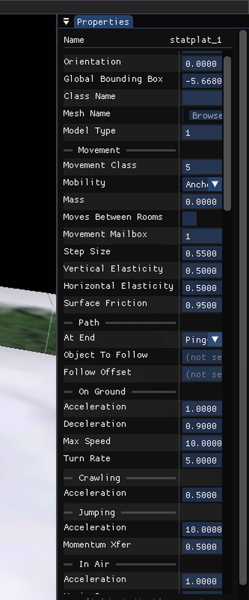

# wf-edit Properties panel: OAD section/group headers + short `displayName` labels

**Status:** Done 2026-05-22 (≈1 h)
**Scope:** editor-only (`wf_edit` target, `WF_ENABLE_EDITOR`). No engine/runtime build change.
**Files:** [`engine/wf_edit/oad_reader.h`](../../engine/wf_edit/oad_reader.h), [`oad_reader.cc`](../../engine/wf_edit/oad_reader.cc), [`property_panel.h`](../../engine/wf_edit/property_panel.h), [`property_panel.cc`](../../engine/wf_edit/property_panel.cc).
**TODO source:** [`TODO.md`](../../TODO.md) § COLLABORATIVE EDITOR — *"Property panel could show the OAD's short `displayName` for compact, Max-faithful field labels."*

## Context

The Properties panel rendered a flat, ungrouped list of an actor's fields, each labelled with its full unique OAD `name` ("Number Of Local Mailboxes", "MovementClass", "At End Of Path"). The original 3DS Max attrib editor (`git show c5761ca^:wfmaxplugins/attrib/oaddlg.cc`) rendered the **short `displayName`** ("Local Mailboxes", "Movement Class", "At End") under **grouped section headers** ("Movement", "Path", "Matte Color") — the section gives context so the label can be terse. This brings the WF panel to that compact layout. The two halves are coupled (the short label only reads unambiguously *under* a header), which is why the TODO gated `displayName` on sections landing.

`FieldKind::Section/GroupStart/GroupEnd` and the `SeparatorText` render path already existed (`property_panel.cc` render loop, `WidgetFor` cases) but were **dead code**: `ResolveProperties` emits one `PropField` per *Doc* field and tags it via `AlignByName` (an LCS over field names), but section/group OAD entries carry no instance data, so no Doc field exists for them and the LCS never surfaces them. They must be **interleaved by OAD position**, not matched.

## Verified facts (parsed the real `.oad` binaries)

`_typeDescriptor` ([`wfsource/source/oas/oad.h`](../../wfsource/source/oas/oad.h):132, `#pragma pack(1)`, 1491 B/entry) carries both `name[64]` and `xdata.displayName[64]`. Direct parse of the shipped schemas:

| `.oad` | entries | section/group markers | `displayName` ≠ `name` |
|--------|--------:|----------------------:|-----------------------:|
| `common.oad`   | 14  | 1  | 4  |
| `movebloc.oad` | 41  | 13 | 26 |
| `mesh.oad`     | 52  | 12 | 41 |
| `statplat.oad` | 129 | 31 | 78 |
| `actor.oad` / `enemy.oad` | 128 / 129 | 30 / 31 | 78 |

- **Gotcha (load-bearing):** for `GROUP_START`/`GROUP_STOP` entries the `displayName` slot holds the literal junk string `'displayName'` (an uninitialised OAS authoring default); the real group title is in `name` ('Path', 'Matte Color'). `GROUP_STOP` has `name='STOP'`.
  → **Section/group header titles come from `name`. Only regular field labels use `displayName`** (falling back to `name` when empty).

## Implementation

1. **`oad_reader`** — `OadEntry` gains `display_name`; `LoadOad` reads `d.xdata.displayName` with the same bounded `strnlen` read as `name`.
2. **`PropField`** — gains `display_label`; `pf.name` stays the Doc field name (the stable identity `AlignByName` and the CRDT→engine bridge key on). Only the *rendered* label changes.
3. **`ResolveProperties`** —
   - Blanks the names of `PROPERTY_SHEET`/`GROUP_START`/`GROUP_STOP`/`COMMONBLOCK`/`ENDCOMMON` entries when building `oad_names`, so the LCS can never consume one (it requires a non-empty name).
   - **Lazy-header interleave:** walk Doc fields with an OAD cursor `last_oad` and a `pending` header buffer; for a matched field at OAD index `j`, buffer any section/group markers in `(last_oad, j)`; flush `pending` immediately before pushing the field. Headers with no following field (the common-block tail) never flush → no empty sections.
   - Header title comes from `name` (not the junk group `displayName`); each matched field's `display_label` = its OAD `display_name`.
4. **`RenderProperties`** — column-0 text uses `display_label` (falls back to `name`); the hover tooltip now leads with the full `name` so the terse label costs no information. Section/GroupStart render as `SeparatorText`; GroupEnd is skipped (flat layout; nesting indent deferred as optional polish).

The `WF_EDIT_OAD_DEBUG` dump was extended to print each row's `kind` + `display_label` (and header rows) for deterministic verification.

## Mockup (target layout)

```
 Properties — statplat
 ┌─────────────────────────────┬───────────────────────────┐
 │ Position                    │  12.0   0.0   4.5         │   ← prefix (no OAD)
 │ Orientation                 │  0.0    0.0   0.25  rev   │
 │ Class Name                  │  statplat                 │
 ├───────────  Movement  ──────────────────────────────────┤   ← PROPERTY_SHEET (name)
 │ Movement Class              │  [Anchored ▾]             │   ← displayName, not "MovementClass"
 │ Mobility                    │  [Physics  ▾]             │
 │ Mass                        │  1.000                    │
 │ Moves Between Rooms         │  ☐                        │
 ├───────────  Path  ──────────────────────────────────────┤   ← GROUP_START (name, not 'displayName')
 │ At End                      │  [Loop ▾]                 │   ← displayName, not "At End Of Path"
 │ Object To Follow            │  (not set)                │
 └─────────────────────────────┴───────────────────────────┘
   hover "At End" → tooltip: "At End Of Path  •  I32  •  OAD"
```

### Result (headless capture, snowgoons `statplat`, actor 0)



Matches the mockup: bare prefix (Orientation / Global Bounding Box / Class Name / Mesh Name / Model Type), then `─ Movement ─` → **Movement Class** (not "MovementClass"), `─ Path ─` → **At End**, `─ On Ground ─` → **Acceleration / Deceleration / Max Speed** (not "Max Ground Speed"), and `─ Crawling ─` / `─ Jumping ─` / `─ In Air ─` each disambiguating their repeated **Acceleration** label by group — the exact rationale for terse labels under headers. `WF_EDIT_OAD_DEBUG=1` confirms 92 doc fields → 122 rows (30 headers interleaved), `matched=82`, and no empty trailing sections.

## Verification

Editor-only TUs — no engine rebuild. Build target `wf_edit` in `build-editor/` (Debug, GCC; the hyphenated `wf-edit` silently no-ops as a target name).

1. **Resolve-list dump** — `WF_EDIT_OAD_DEBUG=1 ./build-editor/wf-edit --select=0 --frames 3` on snowgoons (actor 0 is a `statplat`): `Section`/`GroupStart` rows appear interleaved (`Movement` before `Movement Class`, `Path` before `At End`), `display_label` differs from `name` where the OAD says so.
2. **Headless screenshot (proof)** — `--frames N --screenshot <repo-path>.ppm` (space-separated, run in background, repo-path PPM; `WF_EDIT_SCROLL_TO=<field>` to frame a section).
3. **Regression** — field editing still commits (the bridge keys on `pf.name`, untouched).

## Notes
- The `displayName=='displayName'` junk-slot gotcha for group markers is recorded here; promote to [`docs/level-design-troubleshooting.md`](../level-design-troubleshooting.md) if a second consumer of `xdata.displayName` appears.
