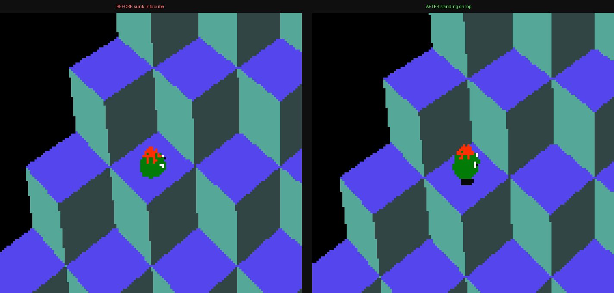
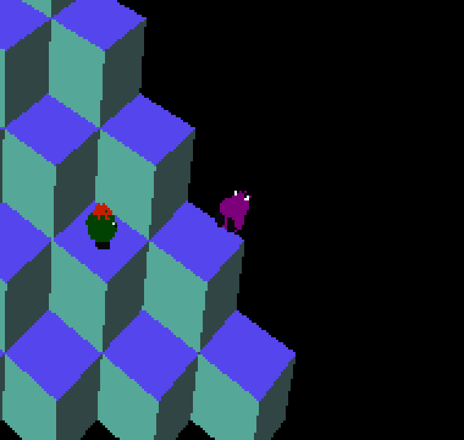

# Q✱bert — humanoid enemies use feet-origin meshes (Slick, Sam, Ugg, Wrong-Way)

**Status:** Done — implemented + verified 2026-05-22 (~2 h, most of it building the
bridge screenshot harness). `_FLIPPER_Z_BASE=14.0` and `_CLIMBER_BODY_HALF_X=0.0`
were correct first try (no tuning needed).

## Results

Verified via `tests/screenshot_qbert_enemies.py` (debug-bridge placement +
screenshot op). Descenders pinned (`PHASE=0`) at the **same** cube-top contact
point in both builds, so the only variable is the mesh origin:



*Before (left): the body is sliced off at the cube's top face — lower half buried.
After (right): the full character stands on top, dark feet resting on the cube
surface.*



*A descender on a cube top (left) and Ugg tipped onto a cube's side face (right) —
both placed correctly, neither buried nor floating.*

> **Discovery — mesh-export non-determinism.** Re-running the generator re-exports
> `player.iff` and `coily_snake_mesh.iff` byte-differently (same size, scattered
> float bytes) despite *no* change to their builds — so a fresh export is not
> byte-stable, contradicting [[feedback_blender_golden_source]]. Restored those two
> from HEAD for this commit; logged as a follow-up in TODO.md.

## Context

In a Q✱bert screenshot, the cube-flipper enemies **Slick** and **Sam** appear
sunk *into* the cubes instead of standing *on top* of them. The side-of-pyramid
climbers **Ugg** and **Wrong-Way** are the same humanoid build and must be
authored consistently (their current on-face placement leans on an offset that
is silently compensating for the same center-origin problem).

Cause: the WF engine treats an actor's position as its **feet / ground-contact
point** — the bottom-center of the model (`jolt_backend.cc:457`:
*"actor 'feet' position (WF convention)"*; the renderer places the mesh's local
origin directly at the actor position, `rendcrow.cc:273`, with no offset field).
But Slick and Sam are built body-centered: in `_build_flipper_actor()` the body
icosphere is created at local `(0,0,0)` (`blender_create_qbert.py:1647`) and the
feet hang down to local Z ≈ −0.40 (`:1683-1685`). So the model's origin is at its
*waist*, and ~0.40 of the model (feet + lower body) sits **below** the contact
point → buried in the cube.

The **player** mesh already follows the correct convention — its feet sit at
local Z ≈ 0 (body lifted to z=0.85, feet at z=0.05, `:475-481`), so its origin is
effectively at the feet. Slick and Sam are the only humanoids authored
body-centered. (The red/green balls are spheres — center-origin is fine for them;
Ugg/Wrong-Way are tipped onto cube faces with their own Z base; Coily computes a
half-height offset. None of those are affected.)

Constraint (user): fix it **at author/build time, not at runtime** — don't paper
over a mesh-authoring problem with a per-frame Z bump in the Forth script. This
matches [fix root cause, not symptom](../../CLAUDE.md): re-author the mesh so its
handle is at the feet, rather than compensating downstream.

## Approach

All changes are in [`wflevels/qbert_practice/blender_create_qbert.py`](../../wflevels/qbert_practice/blender_create_qbert.py)
and are baked at export time. The mesh-origin change is the root-cause fix; the
placement changes remove fudge terms that were silently compensating for the
center-origin meshes.

### 1. Shared helper: re-base humanoid mesh origins to the feet (root cause)

Add one helper and call it from both humanoid builders after their join:

```python
def _origin_to_feet(body):
    """Re-base a joined mesh so its lowest vertex sits at local Z=0 — putting
    the actor handle at the feet (WF ground-contact convention; the player mesh
    is authored this way). Shifts mesh DATA only; object location/origin is
    untouched, so the exported Position is unchanged. Returns the shift."""
    min_z = min(v.co.z for v in body.data.vertices)
    if min_z:
        for v in body.data.vertices:
            v.co.z -= min_z
    return min_z
```

- Call in `_build_flipper_actor()` right after `bpy.ops.object.join()` (`:1702`)
  and in `_build_climber_actor()` right after its join (`:1829`).
- **Slick/Sam** (built body-centered, feet at local Z≈−0.40, `:1647`/`:1683`):
  this lifts the model ≈0.40 so the feet land where the engine places the actor.
- **Ugg/Wrong-Way** (built body-centered, feet at local Z≈−0.44, `:1774`/`:1810`):
  same re-base — see §3 for the coupled offset change.
- Only local Z is touched; X/Y stay on the body's central axis. It also makes the
  exported local bbox (`export_level.py:929-943`, from `obj.bound_box`) start at
  minZ≈0 — a correct feet-at-0 collision box, not a waist-centered one.
- The **player** mesh is already feet-origin by construction (feet at local
  Z≈−0.03, `:475-481`) and is left unchanged.

### 2. Land the feet on the cube top, not at cube-top + ball-radius

Slick/Sam currently inherit the ball's standing base `z_base = _RB_Z_BASE = 14.5`
(`:1274`, used at `:1465`). `_RB_Z_BASE = CUBE_BASE_Z + CUBE_SIZE·(NUM_ROWS−1) +
REDBALL_HEIGHT_OFFSET`, and `REDBALL_HEIGHT_OFFSET = CUBE_SIZE/2 + 0.5` (`:973`)
where the `+0.5` ≈ the **ball's radius** (so a center-origin ball's *bottom* rests
on the cube top). For a **feet-origin** model that radius term is wrong — the feet
*are* the contact point, so the base should be the cube **top** with no radius
fudge:

```python
# Feet-origin descenders rest with feet on the cube TOP (no ball-radius term).
_FLIPPER_Z_BASE = CUBE_BASE_Z + CUBE_SIZE * (NUM_ROWS - 1) + CUBE_SIZE / 2   # = 14.0
```

In `redball_script()`, give `slick`/`sam` this base (parallel to the existing
`ugg`/`wrongway` branch at `:1270-1275`):

```python
if variant in ('ugg', 'wrongway'):
    z_base = _CLIMBER_Z_BASE; z_mul = _CLIMBER_Z_MUL
elif variant in ('slick', 'sam'):
    z_base = _FLIPPER_Z_BASE; z_mul = _RB_Z_MUL
else:
    z_base = _RB_Z_BASE; z_mul = _RB_Z_MUL
```

Also seed the **spawn-time** START_Z/END_Z for flippers from the same base. The
flipper spawn helper is `_spawn_flipper_forth(...)` (called at `:1240-1241`); the
red-ball director seeds `_RB_Z_AT_ROW_0`/`_RB_Z_AT_ROW_1` (14.5 / 12.5,
`:997-998`) into `_RB_OFF_START_Z`/`_RB_OFF_END_Z`. The flipper spawn must seed
its row-0/row-1 values off `_FLIPPER_Z_BASE` instead (i.e. 14.0 / 12.0), so the
first hop doesn't start from the ball height. Confirm the exact seed lines inside
`_spawn_flipper_forth` during implementation and update them to the flipper base.

> **Note — verify-and-tune.** Static arithmetic of the model height vs. cube-top Z
> is close to the margin (the body half-extent is ≈0.34–0.40), and the on-screen
> read is what matters. Treat change #1 (mesh origin → feet) as the definitive
> fix and change #2's exact base as screenshot-tuned: capture a **before** shot,
> apply both changes, capture an **after** shot, and nudge `_FLIPPER_Z_BASE` by a
> small constant only if the feet visibly float above or clip into the cube top.

### 3. Ugg / Wrong-Way — drop the face-offset fudge (coupled to §1)

The climbers are tipped onto the cube **side faces** by a 90° pitch about local
+Y (`UGG_PITCH/WW_PITCH = ±0.25`, `:1067-1068`) plus a yaw, and pushed out along
world X by `UGG_X_OFFSET/WW_X_OFFSET = ±(CUBE_SIZE/2 + _CLIMBER_BODY_HALF_X)`
(`:1062-1064`). Because the pitch maps the mesh's local **+Z onto the world face
normal (±X)** (`:1065-1066`), the §1 feet re-base (a ≈0.44 shift along local Z)
moves the model ≈0.44 along world X. `_CLIMBER_BODY_HALF_X = 0.4` was already
≈ that feet-below-center distance — i.e. it was silently doing the same
compensation as the Slick/Sam bug, in the rotated frame.

So with feet-origin meshes the feet sit at the actor X position directly, and the
extra outward push must drop to ≈0:

```python
_CLIMBER_BODY_HALF_X = 0.0   # feet-origin: feet land on the face at X = ±CUBE_SIZE/2
```

- **Rotations are unchanged.** Pitch/yaw are invariant to a shift along the
  height axis; only the X-offset compensates. (Confirmed by the transform
  `world = P + R·v`: re-basing `v += Δẑ` shifts the model by `Δ·(R·ẑ) = Δ·(±X̂)`,
  absorbed entirely by `P.X`.)
- **Z base unchanged.** Climbers rest at cube-*center* Z (`_CLIMBER_Z_BASE`,
  `:1076`); the local-Z re-base maps onto world X, not world Z, so their vertical
  position on the face and the spawn seeds (`:3152-3153`) need no change.
- Net on-screen result is essentially identical to today (feet on the face) but
  the mesh is now authored consistently and the collision box is feet-at-0. Exact
  `_CLIMBER_BODY_HALF_X` (0 vs a small clearance to avoid z-fighting the face)
  is screenshot-tuned — hard to eyeball, so verified via bridge placement.

## Critical files

- [`wflevels/qbert_practice/blender_create_qbert.py`](../../wflevels/qbert_practice/blender_create_qbert.py)
  - new `_origin_to_feet(body)` helper, called after the join in
    `_build_flipper_actor()` (`:1702`) and `_build_climber_actor()` (`:1829`) (§1).
  - module constants near `:973-998` — add `_FLIPPER_Z_BASE`/`_FLIPPER_Z_AT_ROW_0/1`
    (§2); change `_CLIMBER_BODY_HALF_X` `:1062` to ≈0 (§3).
  - `redball_script()` `:1270-1275` — add the `slick`/`sam` z_base branch (§2).
  - `_spawn_flipper_forth(...)` `:1163-1164` — seed START_Z/END_Z off the flipper
    base instead of `_RB_Z_AT_ROW_0/1` (§2).
- No engine, OAD/OAS, or runtime-script-hack changes — author-time only.

## Reuse / references

- Player mesh feet-at-local-0 convention: `blender_create_qbert.py:395-500`
  (`build_player_mesh`, feet `:475-481`) — the pattern Slick/Sam are being
  brought in line with.
- WF feet-anchor convention: `wfsource/source/physics/jolt/jolt_backend.cc:457`,
  `:634-636`, `:768`; render-at-position `wfsource/source/renderassets/rendcrow.cc:273`.
- Exported local bbox derives from `obj.bound_box`:
  `wftools/wf_blender/export_level.py:929-943` (so the origin shift also fixes the
  collision box automatically).

## Build & verify

Verification uses the **debug bridge** to force the (otherwise director-spawned,
parked-offscreen) enemies onto the board, then grab a screenshot. The bridge
client `tests/debug_bridge_client.py` exposes `set_mailbox(mailbox, value, idx)`
and an `{"op":"screenshot","filename":…}` op (same pattern as
`tests/screenshot_coin_arc.py`). A small capture script will, for each enemy:
write its `*_MB_ACTIVE=1`, `PHASE=1`, a fixed `ROW/COL`, and let one tick settle
its position — Slick/Sam onto cube **tops**, Ugg/Wrong-Way onto the **side
faces** — then screenshot. Launch: `wf_game -L<level> --debug-port <port>
--debug-bind 127.0.0.1`.

1. **Before shot:** capture the current `qbert_practice` build first (provable
   regression), writing PNGs under `/home/will/tmp/qbert_feet/before/`.
2. Re-export the `.blend` and rebuild:
   `bash wftools/wf_blender/build_level_binary.sh qbert_practice`
   (runs the .lev → .lev.bin → .lvl → textures → inner `.iff` chain; also build
   the `-standalone.iff` variant). `py_compile` the `.py` first.
3. **After shot:** same capture into `…/after/`; confirm all four stand with feet
   on the cube tops / side faces at multiple rows, no clipping, no float.
4. Put before/after screenshots side-by-side in this doc; tune `_FLIPPER_Z_BASE`
   and `_CLIMBER_BODY_HALF_X` if needed.
5. If anything non-obvious surfaces (mesh re-origin gotcha, Z tuning, bridge
   placement trick), log it to
   [`docs/level-design-troubleshooting.md`](../level-design-troubleshooting.md)
   the moment found.
6. Commit the code + this plan doc together, noting implementation duration.
