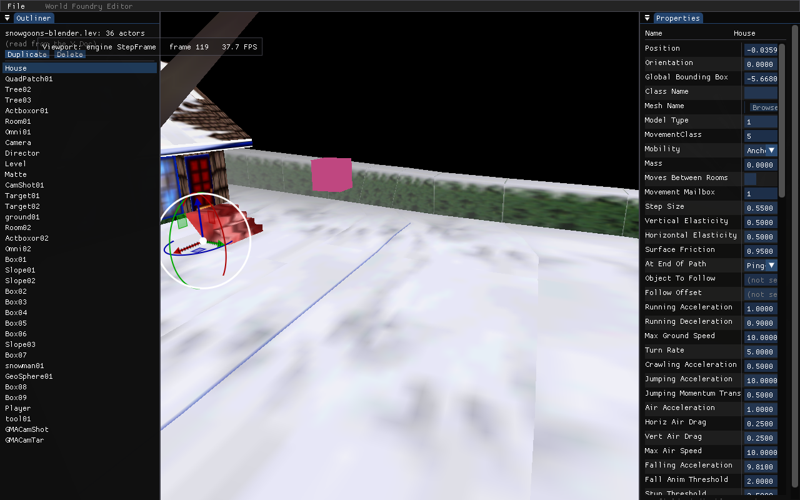

# Plan — Viewport translate + rotate gizmo for `wf-edit`

**Date:** 2026-05-22

**Status:** Done (Phases 0–3, 2026-05-22). Translate+rotate gizmo renders on the selected actor and is matrix-aligned with the engine render (proof below). **Interactive drag verified by the user** — dragging+rotating the snowgoons House moved/rotated it live and File→Save persisted the new Position/Orientation to the `.lev` (confirmed by diff). Verification also surfaced a pre-existing **editor-source path tangle**: the viewport loaded the *oracle* `snowgoons-standalone.iff` while the Doc read the *Blender* `.lev`, so a save+recompile never showed in the viewport. Fixed by adding `snowgoons-blender-standalone.iff.txt` (built by `build_level_binary.sh`) and pointing the editor's default at `snowgoons-blender-standalone.iff`, so viewport + Doc + Save+Compile all reference the same Blender source. Scale deferred (see bottom). **Phase 4 polish (G/R keys + snap) DONE 2026-05-25** — Blender-style **G**/**R**/**W** mode keys (move / rotate / both, `!WantTextInput`-gated, `!Ctrl` so Ctrl+S still saves), **S** snap toggle, a viewport toolbar overlay (Move/Rotate/Both radios + Snap checkbox + per-mode step field), and snap-pref persistence in `~/.config/wf-edit/identity.json`. Snap is active only in a pure mode (ImGuizmo shares one `snap[0]` slot between translate XYZ and rotate degrees). Toolbar render proof: [`tests/screenshots/gizmo_toolbar.png`](../../tests/screenshots/gizmo_toolbar.png) (drag interaction is user-verified — on-screen GL can't be auto-captured under Wayland).

*Headless capture (`--select=0 --frames 120 --screenshot`): the gizmo origin sits on the selected House mesh, blue (+Z) axis up, translate arrows + rotation rings projecting into the scene at the actor's world position — confirming the reconstructed view+projection matches the engine's own render.*

## Context

`wf-edit` can read, edit, live-preview, [save](2026-05-21-editor-save-roundtrip.md), and
[co-edit](2026-05-21-realtime-coediting.md) levels, but moving an actor still requires typing
X/Y/Z into the Properties panel. The biggest remaining UX gap is direct manipulation in the 3D
viewport. This plan adds a **translate + rotate gizmo** ([ImGuizmo](https://github.com/CedricGuillemet/ImGuizmo),
MIT) so the user clicks an actor and drags axis/plane handles (move) or rings (rotate) to
transform it live, with the change persisting on save and syncing to co-edit peers.

Scale is **deferred** (see end): per-actor render scale works live via mailboxes but has no
Doc/`.lev` leaf to persist to, so it needs a level-pipeline prerequisite first.

## Scope

- **Translate** — drag-to-move on X/Y/Z axes + planes. Persists via the Doc `VEC3 "Position"` leaf.
- **Rotate** — ring gizmo. Persists via the Doc `EULR "Orientation"` leaf.
- **Scale — DEFERRED** (separate follow-up; see bottom).

## Key findings (verified)

1. **Matrix alignment is the engine's own math — no engine change needed.** Engine MVP = `proj · view · model`:
   - `view = Matrix34ToFloat16(Inverse(camera.GetPosition()))` ([camera.cc](../../wfsource/source/gfx/camera.cc):206/284-288 → [rendobj3.cc](../../wfsource/source/gfx/rendobj3.cc):65 → [backend_modern.cc](../../wfsource/source/gfx/glpipeline/backend_modern.cc):526/79).
   - `proj = Mat4Perspective(60, fbw/fbh, 1, 1000)` — the editor itself sets these exact params ([main.cc](../../engine/wf_edit/main.cc):446).
   - WF uses row-vector storage; `Matrix34ToFloat16` (backend_modern.cc:159-180) transposes WF-row → GL-column. Transposing a product reverses order, so `ToGL(model · invView) == ToGL(invView) · ToGL(model)` = `view_gl · model_gl`. ImGuizmo expects column-major `proj·view·model`, so feeding it the reconstructed matrices makes the gizmo project to the **same pixels** the engine renders. The editor is the first consumer of these matrices, so alignment is screenshot-verified with a documented fallback.
2. **Camera + matrices via public accessors** (editor links `wfengine`): `theLevel->camera()->GetRenderCamera().GetPosition()` → `const Matrix34&`; `Matrix34::Inverse`, `AsEuler`, ctor `Matrix34(Euler, translation)`. `Matrix34ToFloat16` + `Mat4Perspective` are file-`static` → duplicated verbatim into the new TU with source citations.
3. **Orientation units — latent bug to fix.** The `.lev`/Doc `EULR "Orientation"` DATA is **radians** (confirmed by levcomp-rs `radians_fx_to_u16_revs` / `u16_revs_to_radians_fx: revs*TWO_PI`, [decompile.rs](../../wftools/levcomp-rs/src/decompile.rs):56-60). But `engine_bridge.cc:281` treats it as revolutions (`Angle::Revolution(w.vec[i])` on the raw radian) — a latent unit bug, never caught because no one edited Orientation via panel→bridge and checked the viewport. Phase 2 fixes it (radians→revolutions) so the gizmo's Doc-radians writes round-trip through reload + the peer `CollabDrain`→`PropagateToEngine` path.
4. **Co-edit flood risk.** `doc.observeUpdates` (main.cc:1087) sends a relay SYNC on **every** Doc commit; `WriteFieldLeaf` commits on scope exit. So live preview is `wfmut::Set*`-only (no Doc write), and the Doc leaf is written **once on drag release**.

## Phases

### Phase 0 — Vendor ImGuizmo
Vendor `ImGuizmo.h` + `ImGuizmo.cpp` under `third_party/imguizmo/` with a provenance `README.md`
(upstream URL, pinned commit, SHA256, license) + `LICENSE` — matching the committed
[nlohmann/json](../../third_party/json/README.md) single-header convention (cleaner than a full
submodule for 2 files). RTTI-free (fine under `-fno-rtti`); the target's `-w` silences its warnings;
ImGui 1.92.9 WIP docking branch is compatible. CMake (`CMakeLists.txt`, inside `if(WF_ENABLE_EDITOR …)`):
`set(IMGUIZMO_DIR …)` near `IMGUI_DIR`; add `${IMGUIZMO_DIR}/ImGuizmo.cpp` + `engine/wf_edit/gizmo.cc`
to `add_executable(wf_edit …)`; add `${IMGUIZMO_DIR}` to the target include dirs.

### Phase 1 — gizmo TU (`engine/wf_edit/gizmo.{h,cc}`)
Isolates engine-math includes from `main.cc` (mirrors `engine_bridge.cc`). Surface:
`BuildGizmoMats(engine_idx, fbw, fbh) → {view[16], proj[16], model[16], valid}`,
`ApplyGizmoToEngine(engine_idx, model_gl[16])` (live `wfmut::SetActorPos` + `SetActorOrientation`),
`CommitGizmoToDoc(doc, doc_index, model_gl[16])` (Doc `"Position"`/`"Orientation"` leaves, radians).
Internals: private `Matrix34ToGL`/`GLToMatrix34` (exact transpose pair) + `Mat4PerspectiveGL`,
citing backend_modern.cc. Model = `ToGL(Matrix34(GetActorOrientation, GetActorPos))`. Decompose
the manipulated matrix via WF `Matrix34::AsEuler` (not ImGuizmo's degree decompose) to stay in WF's
convention. `WF_EDIT_GIZMO_DEBUG` one-shot view/proj dump.

### Phase 2 — Fix Orientation unit bug (root cause)
`engine_bridge.cc` `PropagateToEngine` Orient path: convert radians→revolutions before
`Angle::Revolution(...)` (`/ TWO_PI`). Fix the misleading :281 comment. Corrects the pre-existing
panel Orientation-edit path and makes the gizmo's Doc writes round-trip.

### Phase 3 — Wire ImGuizmo into `editor_frame` (`main.cc`)
`ImGuizmo::BeginFrame()` after `ImGui::NewFrame()`; central-node rect via
`DockBuilderGetCentralNode(dock_id)`; gizmo block after the Properties `End()`, before `Render()`.
Gate `selected>=0 && theLevel && !structural_dirty && DocActorToEngineIdx>0`.
`SetDrawlist(GetForegroundDrawList())` + `SetRect(central)`; `Manipulate(view, proj, TRANSLATE|ROTATE,
WORLD, model)`. During `IsUsing()`: `ApplyGizmoToEngine` (live, no Doc) + `gizmo_active=true`. On
release: `CommitGizmoToDoc` (single SYNC) + refresh cached props + clear flag. New `EditorCtx::gizmo_active`.

### Phase 4 — Polish (optional) — DONE 2026-05-25
`G`/`R` keys (translate-only vs rotate-only, press-again or `W` → both) guarded by `!WantTextInput`;
`S` toggles grid/angle snap. Default is combined translate+rotate on the selected actor. Implemented in
[`engine/wf_edit/main.cc`](../../engine/wf_edit/main.cc) (`EditorCtx::gizmo_op`/`gizmo_snap*`, the
keyboard block, the snap-aware `ImGuizmo::Manipulate` call, and the `##gizmo_toolbar` overlay) +
`WfeditIdentity` persistence.

## Verification
- **Build:** `cmake -S . -B build-editor -DWF_ENABLE_EDITOR=ON -DCMAKE_BUILD_TYPE=Debug && cmake --build build-editor --target wf_edit -j` (target `wf_edit` underscore).
- **Alignment (core risk):** `--frames N`/`--screenshot <file>` on a level with a movable actor; gizmo origin sits **on** the rendered actor; +X = screen-right, +Z = up, +Y = into screen; rotate ring spins the mesh. Fallback below if misaligned.
- **Orientation round-trip:** panel-edit Orientation π/2 → mesh turns 90° (not ~205°). Gizmo-rotate → save → reload → preserved.
- **Persistence:** gizmo move+rotate → Save → reload `.lev` → actor at new transform.
- **Co-edit flood:** two editors on a relay; drag for seconds → **zero** SYNC during drag, **one** on release; peer B jumps to the new transform via `CollabDrain`.
- **Runtime untouched:** `git diff` shows no `wfsource/` engine-library change; `wf_game` builds.

## Risks + fallback
1. **View-matrix alignment** (primary, low — reconstruction proven equal to the engine's sequence). Fallback: a minimal read-only `RendererBackend::GetViewProjection(view[16], proj[16])` snapshotting `_proj` + the view at camera `RenderBegin` (~5-line engine change), used only behind a flag. Reconstruction is default.
2. **Projection** — not a risk (editor sets it); use `fb_w`/`fb_h` for aspect.
3. **HiDPI** — `SetRect` is logical coords; derive aspect from `fbw/fbh`; verify on the real display.
4. **Euler convention** — use WF `Matrix34::AsEuler`, not ImGuizmo's decompose.
5. **`structural_dirty`/stale map** — gated out.

## Deferred — scale (SHELVED 2026-05-25)

Per-actor scale works live (`EMAILBOX_X/Y/Z_SCALE` 3040-3042 → `_scaleX/Y/Z` →
`_renderActor->SetActorScale` → `RenderActor3D::Render`; `wfmut::SetMailbox`/`GetMailbox` reach them)
and is stored in the binary on-disk record ([levelcon.h](../../wftools/lvldump/source/levelcon.h):83,
`x/y/z_scale` at bytes 16-28) but has no named leaf in the text `.lev`/Doc
([decompile.rs](../../wftools/levcomp-rs/src/decompile.rs):24 "scale … not used during decompile").

**Decision (2026-05-25): the scale gizmo is shelved — and the missing leaf is not the real
blocker.** The mailbox scale is **render-only**: it column-multiplies the world matrix at draw
time and does **not** scale the collision bbox (`coarse` rect, `_ObjectOnDisk` bytes 36-60) or the
Jolt physics shape ([actor.cc:1606-1622](../../wfsource/source/game/actor.cc)). So a scale gizmo
wired to those mailboxes would visually stretch the mesh while collision/physics stay original-size
— a desync footgun — and persisting a render multiplier into the `.lev` fights the
Blender-golden-source model (real size = mesh geometry). That collision/physics gap is logged as a
bug in [TODO.md](../../TODO.md) § *PHYSICS*.

The proper path is **physics-correct instance scale via OAD fields** (render + collision bbox + Jolt
`ScaledShape`, authored as Blender object scale), deferred to **after the new level ships**
([TODO.md](../../TODO.md) § *DEFERRED UNTIL LEVEL* — the text/binary pipeline insertion points are
mapped there). Once that lands, the scale gizmo is a small ImGuizmo `SCALE`-mode add that mirrors
the translate/rotate `CommitGizmoToDoc` path in [gizmo.cc](../../engine/wf_edit/gizmo.cc).
