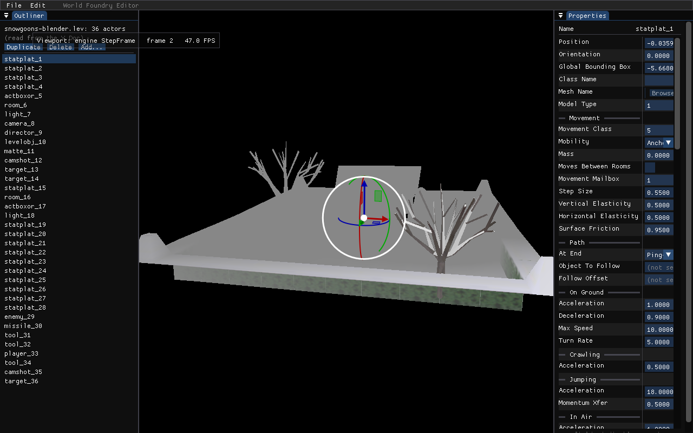
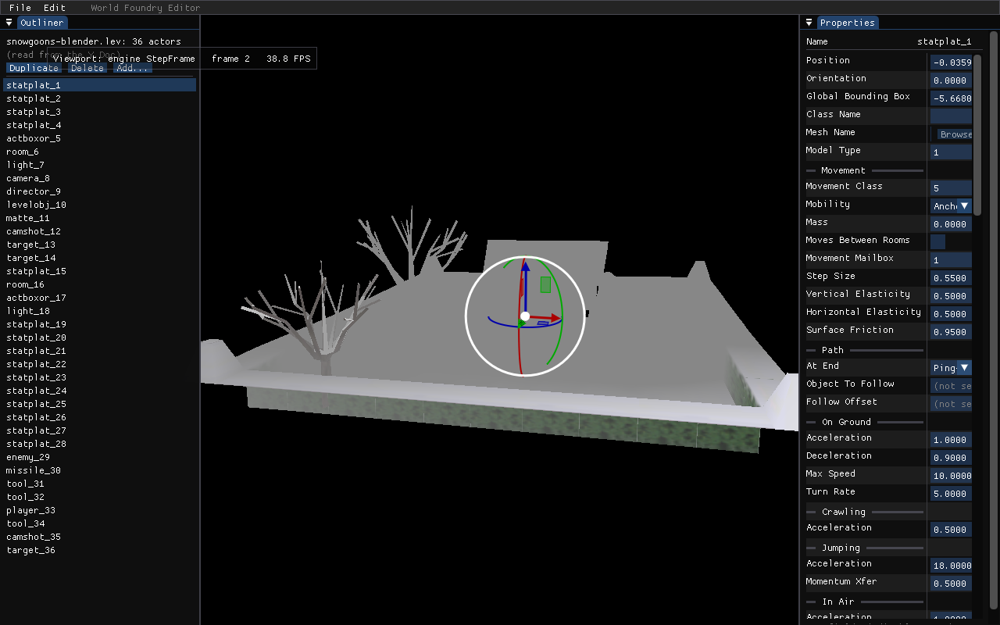

# Plan: `observe_deep` true Doc observer for the CRDT→engine bridge

**Status:** **DONE 2026-05-25 (~3 h incl. a full clean editor build).** Verified end-to-end: `wfcrdt_wrapper_test` 14/14 under ASan+UBSan (new `test_deep_observer`); `wf-edit` builds + links; the `WF_EDIT_REMOTE_TEST` harness PASSes — a **remote-origin** Position edit to a **non-selected** actor moves it in the engine purely via the deep observer (`before (7.868 -10.566 0.801)` → `after (-7.870 -10.570 0.800)`), with the before/after screenshots below showing the platform's tree mesh sliding right→left while a *different* actor stays selected.
**TODO:** [TODO.md](../../TODO.md) `## COLLABORATIVE EDITOR` — "CRDT→engine bridge: true Doc observer (`observe_deep`) for remote/replay/DAP edits."

## Context

`wf-edit`'s CRDT→engine bridge propagates a Doc field edit to the live engine
viewport **only when the edit comes from the local property panel's commit
signal** — `RenderProperties` → `PropagateToEngine` in
[`engine/wf_edit/main.cc`](../../engine/wf_edit/main.cc) (the loop around the
`RenderProperties` call). Any edit that does *not* originate from the local
panel — a **remote collaborator** (now shipped: [realtime co-editing](2026-05-21-realtime-coediting.md)
is live), an **undo/redo**, a **replay**, or a future **DAP** write — lands in
the Doc but only re-propagates the **currently-selected** actor
(`ReSyncAfterDocChange` in `main.cc`). Edits to any *non-selected* actor
silently update the Doc and never reach the viewport until the level is
reloaded.

Root cause: [`engine/crdt/wfcrdt.hpp`](../../engine/crdt/wfcrdt.hpp) exposes only
**shallow** `observe` (per-`Map`/`Array`, fires on direct children), but a
field-leaf edit lives many levels down the chunk tree. The fix: add
`observe_deep` to the wrapper + a leaf→actor resolver, and **make the deep
observer the single engine-propagation path** so every Doc writer (local,
remote, undo, replay, DAP) reaches the viewport uniformly. The engine never
writes back to the Doc, so there is no propagation cycle to guard. The trigger
("first non-local Doc writer") has fired — co-editing is shipped. This is the
networking-milestone follow-up logged by the
[CRDT→engine bridge plan](2026-05-20-crdt-engine-bridge.md).

## Design (validated)

**One propagation path.** Replace the local-commit-driven push with a deep
observer on the `content` array. [Yrs](https://github.com/y-crdt/y-crdt) v0.26.0
delivers, on every commit, the set of changed nested nodes with a **path
relative to the observed root**; for an edit under `content`, `path[0]` is the
actor's `content[i]` index. The bridge queues the touched actor indices (the
callback does **no** Doc access — Yrs forbids opening a txn inside an observer)
and flushes them at frame top, where it re-reads each actor's fields and
re-propagates the OAD-matched ones.

Why sole-path (not local-immediate + deep-for-remote): the deep path subsumes
the local one; a dual path does redundant idempotent writes and lets a deep-path
regression hide behind the immediate write. ≤1-frame latency on local edits is
imperceptible. Matches [fix root cause, not symptom](/home/will/.claude/projects/-home-will-WorldFoundry/memory/feedback_root_cause_not_symptom.md).

### Confirmed yffi / wrapper facts
- `YSubscription *yobserve_deep(Branch*, void* state, void(*cb)(void*, uint32_t count, const YEvent*))` — `libyrs.h:2389`. `YEvent{int8_t tag; union YEventContent content;}`; path via `ymap_event_path`/`yarray_event_path` → `YPathSegment[]` (`tag` = `Y_EVENT_PATH_KEY=1`/`Y_EVENT_PATH_INDEX=2`), freed by `ypath_destroy`.
- `libyrs.h` is included **only** at the wrapper boundary ([`wfcrdt.cpp`](../../engine/crdt/wfcrdt.cpp)); `engine/wf_edit/*` uses opaque event pointers. **The wrapper must decode the path into a clean wfcrdt type** so `YEvent` stays out of `engine/wf_edit`.
- Root branches are cached on the Doc for its lifetime (`wfcrdt.hpp` `Doc::_roots`), so a deep sub on `content` survives across txns — exactly like the existing shallow content observer in [`engine_bridge.cc`](../../engine/wf_edit/engine_bridge.cc).

## Changes per file

### 1. [`engine/crdt/wfcrdt.hpp`](../../engine/crdt/wfcrdt.hpp) — clean deep-observe API
- Add `struct PathSegment { bool isIndex; uint32_t index; std::string key; };` and `using DeepPath = std::vector<PathSegment>;`
- Extend the `SubKind` enum: `{ Map, Array, DocUpdates, Deep }`
- Declare on `Array`: `Subscription observeDeep(std::function<void(const std::vector<DeepPath>&)> cb);`
- Forward-declare `struct YEvent;` alongside the existing opaque event decls.

### 2. [`engine/crdt/wfcrdt.cpp`](../../engine/crdt/wfcrdt.cpp) — trampoline + decode (mirror the existing observe block + dtor switch)
- `struct DeepTrampoline { std::function<void(const std::vector<DeepPath>&)> cb; };`
- `extern "C" void wfcrdt_deep_trampoline(void* state, std::uint32_t count, const YEvent* evs)`: loop `0..count`; `switch (evs[i].tag)` → `Y_ARRAY`: `yarray_event_path(&evs[i].content.array, &len)`, `Y_MAP`: `ymap_event_path(&evs[i].content.map, &len)`; decode each `YPathSegment` (`tag==Y_EVENT_PATH_INDEX` → `isIndex`, else copy `key`); `ypath_destroy(seg, len)`; build `std::vector<DeepPath>`; call `t->cb(...)`.
- `Subscription Array::observeDeep(...)`: `new DeepTrampoline{...}`; `yobserve_deep(_branch, t, &wfcrdt_deep_trampoline)`; return `Subscription(sub, SubKind::Deep, t)`. (`_branch` is non-const — matches `yobserve_deep`'s non-const `Branch*`.)
- Add `case SubKind::Deep: delete static_cast<DeepTrampoline*>(heap); break;` in `subscription_destroy`.

### 3. [`engine/wf_edit/engine_bridge.{h,cc}`](../../engine/wf_edit/engine_bridge.cc) — queue + drain
- `engine_bridge.h`: declare `void DrainEngineSync(wfcrdt::Doc& doc);`
- `engine_bridge.cc`: add `static std::unordered_set<int> s_pending_resync;` (header already includes `<unordered_set>`) and `static std::optional<wfcrdt::Subscription> s_deep_sub;`
- In `InitBridgeMap`, after the shallow content observer:
  ```cpp
  s_deep_sub = content.observeDeep([](const std::vector<wfcrdt::DeepPath>& evs){
      for (const auto& p : evs)
          if (!p.empty() && p[0].isIndex) s_pending_resync.insert(int(p[0].index));
  });
  ```
  (Keep the shallow content observer: structural add/remove fires an event *at* `content` → empty path → skipped here, still rebuilds via `s_needs_rebuild`.)
- Implement `DrainEngineSync(doc)`: move-and-clear `s_pending_resync`; for each `idx` with `DocActorToEngineIdx(idx) >= 1`:
  `for (const auto& pf : ResolveProperties(ReadActorFields(doc, idx))) PropagateToEngine(idx, pf);`
  (`ReadActorFields`/`ResolveProperties` are already used here in `DumpTranslations`.)
  **Do NOT guard on `pf.matched`** — see Finding below.
- **R2 fix (index-invalidation):** in `UpdateBridgeMap`, when it actually rebuilds (`s_needs_rebuild` was set), `s_pending_resync.clear()` and set a one-shot `s_resync_all` flag so `DrainEngineSync` re-propagates **all** live actors that frame. A field index captured pre-rebuild can otherwise point at a different actor after a concurrent structural insert/delete (re-resolution is positional).

### 4. [`engine/wf_edit/main.cc`](../../engine/wf_edit/main.cc) — wire the single path
- After `UpdateBridgeMap`/`CollabDrain`: `if (c->doc) wfedit::DrainEngineSync(*c->doc);` — **must run after `UpdateBridgeMap`** so it reads the rebuilt `s_doc_to_engine`.
- Remove the local-commit propagate loop (after the `RenderProperties` call); **keep** the `RenderProperties` commit-to-Doc.
- Remove the `PropagateToEngine` loop in `ReSyncAfterDocChange`; **keep** `RefreshActorList` + the selected-actor panel re-resolve — the UI still needs to show remote/undo edits to the selected actor.

## Frame ordering (unchanged call site, verified safe)
`InitBridgeMap` → `UpdateBridgeMap` (rebuild + R2 clear) → `CollabDrain` (apply remote in a scoped `beginRemote` txn that commits → deep observer fills the set) → **`DrainEngineSync`** (no live txn; safe to open read txns; runs after rebuild). Remote edits applied this frame drain next frame (≤1-frame latency).

## Verification

**Unit — [`engine/crdt/wfcrdt_wrapper_test.cc`](../../engine/crdt/wfcrdt_wrapper_test.cc)** (mirror `test_observer_fires`):
1. Build `content` → actor Map → `items` Array → … nested. Register `observeDeep` capturing the last `std::vector<DeepPath>`. In a fresh txn mutate a deep leaf under `content[1]`; assert: fired once, `path[0].isIndex && index==1`, and a deeper segment decodes its `key`.
2. Direct `content` child add → assert the deep event's `path.empty()` (proves structural-vs-field discrimination).
Build/run green under `-DWF_ASAN=ON -DCMAKE_BUILD_TYPE=Debug` (wrapper-test convention).

**Integration — `WF_EDIT_*` headless harness** (mirror `RunBridgeTest`): load snowgoons, select actor A, apply a remote SYNC (`beginRemote` + `txn.apply`, as in [`wfcrdt_sync_test.cpp`](../../engine/crdt/wfcrdt_sync_test.cpp)) that edits **actor B's Position** (B ≠ selected); run one `DrainEngineSync`; assert `wfmut::GetActorPos(B_engine_idx)` changed. Direct regression for the "only selected actor reaches viewport" bug — fails on the current code, passes on the deep path.

**Screenshot proof (as-run, single instance via `WF_EDIT_REMOTE_TEST`):** `statplat_1` is selected (gizmo); a remote-origin edit slides the *non-selected* `statplat_3` from x=+7.87 to x=−7.87 — its bare-tree mesh jumps right→left, driven only by the deep observer.

| Before (`statplat_3` at x=+7.87) | After (remote edit → x=−7.87) |
|---|---|
|  |  |

(The two-`wf-edit --relay`-instance variant is belt-and-suspenders; the harness above is the gate.) Screenshot proof required per [screenshots-for-proof](/home/will/.claude/projects/-home-will-WorldFoundry/memory/feedback_screenshots_for_proof.md).

## Finding (surfaced during verification)

The first `DrainEngineSync` draft guarded propagation with `if (pf.matched)` (copied from the old `ReSyncAfterDocChange` loop) — the integration test then **FAILED**: the actor didn't move. Root cause: **`Position`/`Orientation` are per-instance transform-prefix fields, absent from the OAD** ([`property_panel.cc:42`](../../engine/wf_edit/property_panel.cc)), so they carry `matched = false`. `TranslateField` handles them **by name** (and returns `NoOp` for the genuinely-unmapped tail, which `PropagateToEngine` skips), so the `matched` guard dropped exactly the transform edits that move the viewport. Fix: propagate **every** field; let `TranslateField`/`NoOp` filter. Note this means the *old* `ReSyncAfterDocChange` path never propagated remote Position/Orientation edits even to the *selected* actor — a latent bug this change also closes.

## Risks
- **R2 (handled above):** doc-index keys invalidated by an interleaved structural edit → clear-on-rebuild + `s_resync_all`.
- **R1 (satisfied):** `DrainEngineSync` after `UpdateBridgeMap`, never before.
- **R3:** do not delete `ReSyncAfterDocChange` wholesale — keep its UI refresh.
- VEC3 multi-literal edits and multiple events/commit coalesce naturally (set keyed by actor index; re-read propagates all matched fields). Deletion-while-pending guarded by `DocActorToEngineIdx >= 1` + fresh re-read.

## Critical files
- [`engine/crdt/wfcrdt.hpp`](../../engine/crdt/wfcrdt.hpp), [`engine/crdt/wfcrdt.cpp`](../../engine/crdt/wfcrdt.cpp) — wrapper + decode
- [`engine/wf_edit/engine_bridge.h`](../../engine/wf_edit/engine_bridge.h), [`engine/wf_edit/engine_bridge.cc`](../../engine/wf_edit/engine_bridge.cc) — queue/drain/R2
- [`engine/wf_edit/main.cc`](../../engine/wf_edit/main.cc) — wiring + removals
- [`engine/crdt/wfcrdt_wrapper_test.cc`](../../engine/crdt/wfcrdt_wrapper_test.cc) — unit test
- Build: editor via `build-editor/` (CMake **Debug**); wrapper test via `cmake-build-editor/` / `-DWF_ASAN=ON`.
