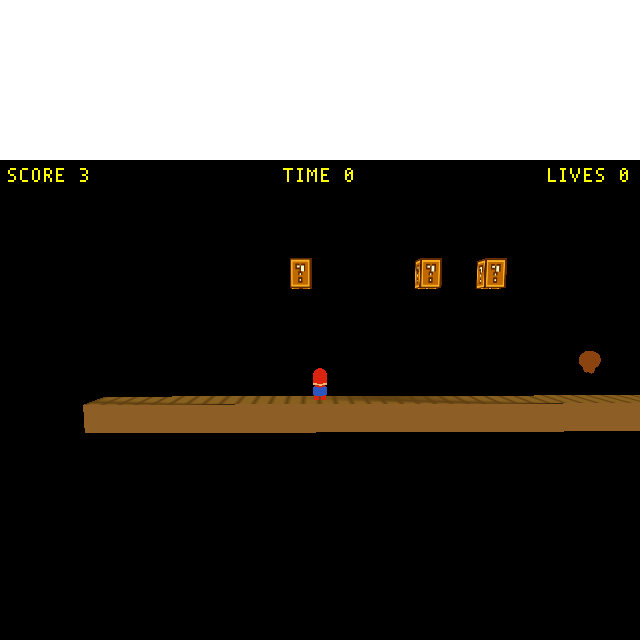

# SMB coin follow-ups: wire OAD Gold Value into the live pickup path + correct stale doc

**Status:** Done + verified (2026-05-25). `TryPickup` (`gold.cc:54`) now awards `getOad()->GoldValue` on the live proximity-pickup path; engine rebuilt clean (exit 0). Stale [coin-fixes plan](2026-05-22-smb-coin-fixes.md) status corrected to Done; dead-`Collision` path logged in `TODO.md`. **Verified headless** with a temporary `Gold Value = 3` coin: the player's GOLD mailbox (3001) and the HUD jumped straight to **3** (not 1) on pickup — . Surfaced a separate authoring-pipeline gap (see Verification).

## Context

The TTL stale-clock bug reported during play-testing is **already fixed**. Commit `948c3fbc`
(2026-05-22) added [`wfsource/source/game/level.cc`](../../wfsource/source/game/level.cc):1689
(`startupData->currentTime = theLevel->LevelClock()`) immediately before
`ConstructTemplateObject`, stamping a fresh spawn-time clock into the value-copy field that
`Gold::Gold` reads at [`gold.cc`](../../wfsource/source/game/gold.cc):29. The generator's coin
spawn routes through `SafelyConstructTemplateObject`, so it benefits. **No engine change is
needed for the TTL** — the earlier "STILL LIVE" diagnosis was wrong (it read `gold.cc:29` in
isolation and trusted the stale `Status:` line of
[the coin-fixes plan](2026-05-22-smb-coin-fixes.md)).

Confirming that surfaced two genuine gaps left over from the *same* commit:

1. **The OAD `Gold Value` field is dead.** The active pickup path is `TryPickup`
   (`gold.cc:54`, called every tick from `Gold::update()`), which hardcodes `+ Scalar::one`.
   The path that honors `getOad()->GoldValue` is `Gold::Collision` (`gold.cc:97`) — but the
   file header (`gold.cc:6`–9) documents that `Collision` is **never called** for these coins
   (they are `MOBILITY_PHYSICS` → CharacterVirtual, invisible to
   `JoltContactDispatch::FindActorForBodyID`). So the `Gold Value` field added in `948c3fbc`
   silently does nothing; every coin awards exactly 1, regardless of the OAD value.

2. **Stale plan-doc status.** [`2026-05-22-smb-coin-fixes.md`](2026-05-22-smb-coin-fixes.md)
   was *created* by `948c3fbc` but its `Status:` line still reads `Not started`, even though
   that commit implemented it. This is what produced the wrong diagnosis above.

## Changes

### 1. Wire the OAD value into the live pickup path — `gold.cc:54`

In `TryPickup`, replace the hardcoded award with the OAD-configured value, mirroring the
(currently-dead) `Gold::Collision` logic at line 97:

```cpp
// BEFORE (gold.cc:54):
pm.WriteMailbox(EMAILBOX_GOLD, pm.ReadMailbox(EMAILBOX_GOLD) + Scalar::one);
// AFTER:
pm.WriteMailbox(EMAILBOX_GOLD, pm.ReadMailbox(EMAILBOX_GOLD) + Scalar((float)getOad()->GoldValue));
```

`getOad()->GoldValue` is already proven (it compiles and is used at `gold.cc:97`).
`EMAILBOX_GOLD` is the existing named mailbox constant — keep it (no bare integers).

Leave `Gold::Collision` (`gold.cc:82`–101) as-is. It is dead for `MOBILITY_PHYSICS` coins but
harmless, and the two-path duplication is now intentional and consistent. Folding the two
paths into a shared helper is **out of scope** (separate cleanup).

### 2. Correct the stale doc status — `2026-05-22-smb-coin-fixes.md`

Flip `**Status:** Not started` to a Done line crediting `948c3fbc` for items 1–3 + the
spawn-Z offset, and noting the `Gold Value` wire-up (this change). Mark each of the five plan
items with its real state (TTL stale-clock, NES size, rightward drift, spawn-Z: done in
`948c3fbc`; friction params: verify present in the Blender script; OAD value: completed here).

### 3. Sync `wf-status.md`

Prepend a **one-sentence** paragraph to the Summary section recording that the SMB coin now
awards its OAD-configured `Gold Value` on the active proximity-pickup path (the field added in
`948c3fbc` had been wired only into the dead Jolt-`Collision` path). Link this plan doc; keep
it reverse-chronological at top.

### 4. Log the dead-`Collision` observation — `TODO.md`

Add an entry noting `Gold::Collision` is unreachable for `MOBILITY_PHYSICS`/CharacterVirtual
coins (cross-ref `gold.cc:82` + the file header), so future readers don't "fix" the
non-functional value there instead of `TryPickup`.

## Build & verify

```bash
task build                      # gold.cc changed
ls -la engine/wf_game           # confirm binary timestamp advanced (don't trust grep'd output)
```

**Done — proof captured** ([SCORE 3 screenshot](../../tests/screenshots/smb_gold_value_3.png)).
Method (all temporary, fully reverted via `git checkout` afterward):

1. Set `coin_template`'s `Gold Value = 3` in the Blender script and re-export/rebuild.
2. The fired coin (block-0 generator) arcs and **rests on open ground** at ≈(14.6, 0.75) — it
   does *not* slide. Driving Mario *under* the block makes the coin land on his **head** (rest
   Z≈2.6); since Mario's tracked position is his feet (Z≈0), dz>1.5 and the proximity pickup
   (`TryPickup`, radius 1.5 m XZ) misses. So the test spawns Mario left of the coin and walks
   him right (`inject_input joystick1_raw=0x2000`) into the ground-resting coin under bridge
   pause/step (small clamped dt → no tunnel).
3. At marioX≈13.30 (dx≈1.27, dz≈0.75, dist≈1.47 < 1.5) the player's GOLD mailbox (3001, Mario =
   actor idx 10) and the HUD both went **0 → 3** — `getOad()->GoldValue` is honored. (mb 70 was
   read via the player's own 3001; the bridge `watch` doesn't report global-idx-0 changes.)

### Authoring-pipeline gap found (separate from this fix)

`Gold Value` would **not** export from Blender: `blender_create_smb.py:38` points `OAD_DIR` at
the **stale `wftools/wf_oad/tests/fixtures`** (whose `gold.oad` predates the field, added to
canonical `wfsource/source/oas/gold.oad` in `948c3fbc`), and the exporter only emits
`schema.visible_fields()`. The proof worked by temporarily overriding the coin's
`wf_schema_path` to the canonical `gold.oad`. **Shipped behavior is safe** without that: the
`.lev` omits the field, but levcomp-rs lays out the common block from the *canonical* OAD and
emits the default `1`, so the engine reads 1 (not garbage). But the field is currently
**un-authorable from the golden source** — logged in `TODO.md`; a proper fix repoints
`OAD_DIR` at `wfsource/source/oas` (needs validating that the other classes' canonical `.oad`s
match the fixtures so the rest of the level is byte-stable). Relates to
[feedback_blender_golden_source].

- Regression: `python3 tests/verify_smb_scroll.py` → all 4 screenshots pass (run earlier).

## Commit

Single commit (code + both docs together):
`fix(gold): award OAD Gold Value on active pickup path; mark coin-fixes plan done`.

## Critical files

| File | Change |
|------|--------|
| [`wfsource/source/game/gold.cc`](../../wfsource/source/game/gold.cc) | `TryPickup` line 54 → `getOad()->GoldValue` |
| [`2026-05-22-smb-coin-fixes.md`](2026-05-22-smb-coin-fixes.md) | Status `Not started` → Done |
| [`wf-status.md`](../../wf-status.md) | One-sentence Summary row, synced with plan status |
| [`TODO.md`](../../TODO.md) | Note dead `Gold::Collision` path for MOBILITY_PHYSICS coins |
