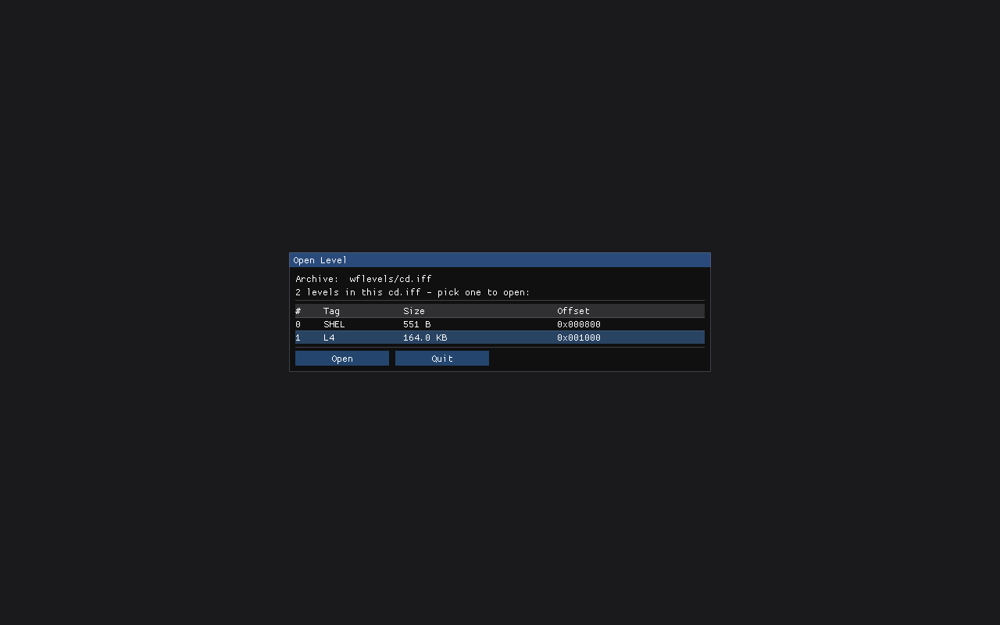

# wf-edit: in-editor cd.iff level picker (startup)

**Status:** ✅ Done 2026-05-25 (~1 h). Launching `wf-edit` on a bare multi-level `cd.iff` (no `:tag`)
now shows a startup modal listing the archive's levels (`#`/tag/size/offset); choosing one loads it
through the existing `cd.iff:<tag>` path. Verified headless: `--pick-level=L4` (by tag) and
`--pick-level=1` (by index) both load all 36 snowgoons actors, while an explicit `cd.iff:L4`, a bare
`.iff`, and a text `.lev` skip the picker and load directly (regressions green). Screenshot below.
**Date:** 2026-05-25
**Scope:** When `wf-edit` is launched on a multi-level `cd.iff` archive **without** a level selector,
show an in-editor picker that lists the archive's levels and lets the user choose **which one to load
this session**. This is a *startup-time* pick — **not** runtime level switching (per the user: "we're
not switching levels (yet?) — we're just picking a level from a cd file"). Once chosen, the level
loads through the existing `cd.iff:<tag>` path; nothing reloads, no bridge/engine teardown.

Follow-up to the [load-binary-iff plan](2026-05-25-wf-edit-load-binary-iff.md) (the "In-editor cd.iff
level picker" deferred there, now in scope).

## Context

Binary loading already works via the CLI selector `--leveltree=wflevels/cd.iff:L4`
([`level_doc.cc` `LoadLevelTreeIntoDoc`](../../engine/wf_edit/level_doc.cc)). But you have to *know*
the tag up front. Launch on a bare archive today and it's a hard error:

```
$ wf-edit --leveltree=wflevels/cd.iff
error: wflevels/cd.iff is a multi-level GAME archive — pass --level <tag|index> to pick a level, or --list to dump the TOC
```

The picker turns that error into a choice. The TOC is already enumerable —
`levcomp decompile <cd.iff> <objects.lc> --list` dumps `idx / tag / offset / size`
([`decompile.rs` `print_toc`/`parse_game_toc`](../../wftools/levcomp-rs/src/decompile.rs)) — so the
picker is a thin UI over data we can already produce.

**Why startup-only (not a File→Open mid-session).** The editor loads its level once, before the
window exists: the Doc is populated at [`main.cc:1260`](../../engine/wf_edit/main.cc) and the engine
viewport at `HALStart`/`-L` (`main.cc:1616`), with the CRDT→engine bridge holding process-global
state ([`engine_bridge.cc` `s_eid_to_engine`/`s_doc_to_engine`/`s_bridge_ready`](../../engine/wf_edit/engine_bridge.cc)).
Picking a *different* level after load would mean tearing all of that down and rebuilding it — the
deferred live-reload / bridge-reset work (review finding #5). The user explicitly scoped that out
("not switching levels yet"), so this picker runs **before** the level commits and hands the chosen
tag to the unchanged startup path.

## UI mockup

A modal shown once at startup, after the window + ImGui exist but before the level loads. Pure-ImGui
frame loop (no engine `StepFrame` yet — `HALStart` hasn't run), so it renders standalone:

```
┌─ Open Level ─────────────────────────────────────────────┐
│  Archive:  wflevels/cd.iff                                │
│  2 levels in this cd.iff — pick one to open:              │
│                                                           │
│   #   Tag     Size          Offset                        │
│  ─────────────────────────────────────────────           │
│     0  SHEL        551 B     0x000800                      │
│  ▶  1  L4       163.99 KB    0x001000                      │
│                                                           │
│  ( double-click a row, or select + Open )                 │
│                                                           │
│                              [  Open  ]   [ Quit ]        │
└───────────────────────────────────────────────────────────┘
```

Notes on the columns:
- **Tag** is the FOURCC the engine knows the level by (`SHEL` = shell/menu, `L0`–`L6` = levels). It's
  the identity carried in the archive — the binary holds no friendlier "display name", so the tag is
  what we show (consistent with the synthetic-name story in the load-binary plan).
- **Size** is the TOC's sector-granular size, human-formatted (B / KB). **Offset** is the absolute
  file offset (monospace hex), handy for debugging — could be hidden behind a "details" toggle later.
- The first real level (lowest index that isn't `SHEL`) is preselected so plain **Open** does the
  common thing.
- **Quit** (not "Cancel"): with no level chosen there's nothing to fall back to, so dismissing the
  picker exits the editor cleanly rather than booting into an empty session.

## Implementation

All in [`engine/wf_edit/`](../../engine/wf_edit); no Rust/tool change (the `--list` output already
carries everything). Three pieces:

1. **`ListCdIffLevels(cd_path) → std::vector<CdIffLevel>`** in `level_doc.cc` (+ decl in
   `level_doc.h`). `struct CdIffLevel { int index; std::string tag; long offset; long size; };`.
   Shells out to `levcomp decompile <cd.iff> <objects.lc> --list` (reusing `FindLevcomp` /
   `ObjectsLcPath` / `ShQuote` already added for the loader) and parses the fixed `--list` table
   (skip the two header lines; each row is `<idx> <tag> 0x<offset> <size>`). Returns empty on any
   failure (caller treats empty as "not a pickable archive").

2. **`bool NeedsLevelPicker(const std::string& leveltree_arg)`** — true when the arg is a bare
   multi-level archive: no `:<tag>` selector **and** `IsBinaryLevel` **and** `ListCdIffLevels` returns
   ≥ 2 entries. (A bare single-level `.iff` or a `cd.iff:tag` selector skips the picker — loads
   directly.) Keep the `IsBinaryLevel` sniff authoritative; don't key off the `.iff` extension.

3. **Picker modal + main() reorder** in `main.cc`:
   - **Relocate the Doc-load block** (`LoadLevelTreeIntoDoc` + `UndoManager` + `ReadActorNames`/`Eids`,
     currently `main.cc:1255-1278`) to **after** ImGui init (`main.cc:1493`) and before
     `SetHostGLContext`/`EditorCtx` (`main.cc:1510`). Nothing between depends on the Doc; this just
     makes the load *just-in-time* so a pre-load picker can choose the tag. The headless edit hooks
     (`WF_EDIT_TEST_SET` etc.) move with it.
   - **Before the relocated load:** if `NeedsLevelPicker(leveltree)`, run a small picker loop —
     `glfwPollEvents` → ImGui `NewFrame` → draw the modal (table of `ListCdIffLevels`) → render →
     `glfwSwapBuffers`, until the user **Open**s a row (sets `leveltree = cd.iff + ":" + tag`) or
     **Quit**s (`glfwSetWindowShouldClose` → clean exit) or the window closes. Honor `--frames`/
     `--screenshot` inside this loop too, so the picker is headless-testable.
   - **Headless aid:** `--pick-level=<tag|index>` auto-confirms the picker's selection without a
     click (so screenshot/CI runs can drive it); equivalent to the user clicking that row + Open. With
     it set, the loop confirms on frame 1.

The engine viewport (`-L<level>`) is unchanged — see below.

## Viewport (explicitly out of scope here)

The picker chooses the **Doc** (Outliner/Properties) level. The engine **viewport** still loads
`--level=`'s value via `HALStart -L<path>` — and `-L` is a single-file path, not a cd.iff+index. So
when you pick `L4` from `cd.iff`, the Outliner shows `L4`'s actors while the 3D viewport shows
whatever `--level=` resolved to (the default standalone, unless a matching `--level=` was passed).
Making the viewport track the picked archive level needs the engine's game-file + `_desiredLevelNum`
load mode wired into `--editor` (today `--editor` requires `-L<path>`, `game.cc:461`) — that's the
same level-load-machinery work as runtime switching, and stays deferred. The picker is honest about
this: it's the Outliner/Properties level chooser.

## Verification

**Done 2026-05-25.** The picker modal launched on `wflevels/cd.iff` lists both archive entries
(`SHEL` 551 B, `L4` 164.0 KB) with `L4` preselected (first non-`SHEL`), Open/Quit below:



`--pick-level=L4` and `--pick-level=1` both load all 36 snowgoons actors (`picker selected L4` →
`Outliner shows 36 actors`); explicit `cd.iff:L4`, bare `.iff`, and text `.lev` skip the picker.

Original verification plan (all satisfied):

1. **Picker appears on a bare archive.** `wf-edit --leveltree=wflevels/cd.iff --frames 30
   --screenshot …` → the modal renders with the 2 cd.iff entries (`SHEL`, `L4`). Screenshot-for-proof.
2. **Selection loads.** `--leveltree=wflevels/cd.iff --pick-level=L4 --frames 5` → stdout shows
   `Y.Doc populated … 36 top-level chunks` + `Outliner shows 36 actors` (same as the direct
   `cd.iff:L4` load).
3. **No picker when unambiguous.** A text `.lev`, a bare single-level `.iff`, and an explicit
   `cd.iff:L4` all load directly (no modal) — regression of the load-binary path.
4. **Quit path.** Quit from the picker exits 0 without loading a level (no crash, no empty session).

## Out of scope / deferred

- **Mid-session level switching / File→Open** — needs live-reload + bridge reset (finding #5).
  Explicitly deferred by the user ("not switching levels yet").
- **Viewport tracking the picked level** — needs the engine game-file/`_desiredLevelNum` load mode in
  `--editor`; deferred with the switching work.
- **A file-browser to choose the cd.iff itself** — v1 takes the archive path on the CLI; browsing to
  an arbitrary `.iff`/`cd.iff` from within the editor is a later nicety.
- **Friendly level names** — the archive carries only FOURCC tags; a tag→name map is cosmetic, later.
