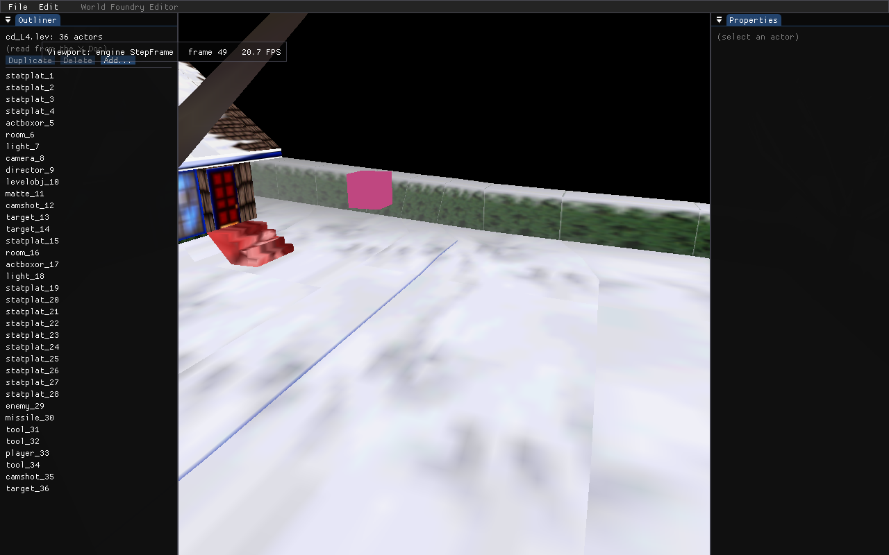
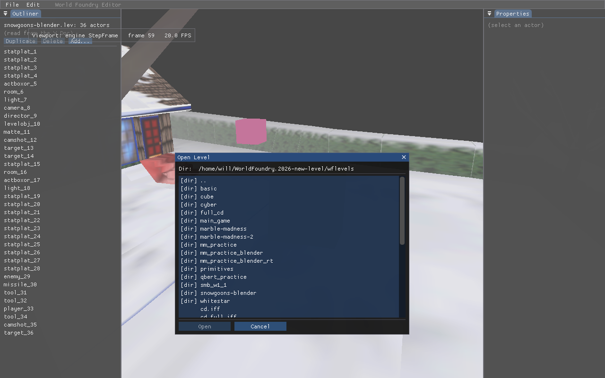

# wf-edit: finish the level-loading UX (ordered)

**Status:** DONE 2026-05-26 — #1 (Save-As label, `a290f08b`) + #2 (File→Open browser, `f2d3678e`) shipped; #3 (friendly names) dropped.

## Progress (updated 2026-05-26)

- **#1 Save-As-`.lev` labeling — DONE.** Committed `a290f08b` (main.cc only; the
  `level_doc.h` `name` stub was a #3 artefact and was reverted).
- **#3 Friendly level names — DROPPED.** The premise was wrong: the tags are already
  legible slot labels (`SHEL`→Shell, `L1`→Level 1…), so a static decode adds nothing,
  and the only part with value (the level's *content* name) is the brittle bit (dual
  source format, positional parse, `/tmp/` paths). Reinforced by the iffcomp structure:
  a level's identity is **structural** — `snowgoons.iff` roots at `LVAS` (verified bytes
  `4c56 4153`), and `L4` is a *cd.iff assembly* tag from the `{ 'L4' … [ "snowgoons.iff" ] }`
  wrapper in `cd_snowgoons.iff.txt`, **not** something to reverse-engineer by positionally
  parsing `cd_*.iff.txt`. See
  [iffcomp offsetof-arithmetic investigation, Postscript 4](../investigations/2026-04-19-iffcomp-offsetof-arithmetic.md).
- **#2 In-editor File→Open — DONE** (this session). Hand-rolled ImGui browser modal +
  `execvp` re-exec, per the spec below. File→"Open Level…" (and `Ctrl+O`) opens a browser
  rooted at `wflevels/`, listing subdirs + `.iff`/`.lev`/`.lvl` files; Open re-execs the
  editor with `--leveltree=<pick>` (preserving `--room`/`--relay`, and `--screenshot`/`--frames`
  for headless use), so a bare cd.iff re-shows the picker. A dirty Doc (`canUndo() ||
  structural_dirty`) routes through an inline "discard changes?" confirm first. Startup
  `--open` opens the browser; headless `--open-pick=<path>` re-execs on the first frame.
  **Verified headless:**
  - `--open-pick=wflevels/cd.iff:L4` → log shows `re-exec into wflevels/cd.iff:L4`, child
    loads the binary level + viewport tracks it: 
  - `--open` → browser renders over the running editor: 

## Context

The cd.iff loading thread (binary load → startup picker → viewport tracking) shipped this session.
Three rough edges remain, all in the editor's load/save UX:

1. A binary-loaded session's **Save** menu item still reads "Save Level" even though `save_path` was
   redirected to a fresh `.lev` (it's really a Save-As) — the menu lies about what it does.
2. The startup cd.iff picker shows **raw FOURCC tags** (`SHEL`, `L4`) with no human name.
3. Choosing the archive is **CLI-only** (`--leveltree=…`); there's no in-editor file open.

The user asked how to *order* these. This plan is the recommended sequence + approach for each.

**Key finding (grounds item 2):** the archive sources `wflevels/cd_*.iff.txt` map every tag to its
level file — e.g. `'L4' [ "snowgoons.iff" ]`, `'L6' [ "main_game/main_game.iff" ]`. So a friendly
name *is* recoverable (basename of the referenced file → "Snowgoons"), not a guess. It's just keyed
off the matching source `.txt`, which is a best-effort lookup.

## Recommended ordering

Small correctness win → headline UX → fuzzy-source polish. Rationale: bank the zero-risk fix first,
then the highest-value feature while editor context is hot, leave the heuristic-dependent item last.

### 1. Save-As-`.lev` labeling  (~10 min, trivial, zero risk)
- Add `bool EditorCtx::binary_source = false;` (set in `main()` when the Doc was loaded from a binary
  source — i.e. `show_picker` or `IsBinaryLevel(leveltree)`).
- In the File menu (`main.cc:918`), when `binary_source` show **"Save As .lev"** (and keep the
  redirected `save_path` from this session's load wiring); else "Save Level". Tooltip noting the
  source binary is read-only.
- Files: `engine/wf_edit/main.cc` (EditorCtx struct ~182, File menu ~918, ctx init ~1684).

### 2. In-editor File→Open  (the headline; ~2–3 h, biggest/riskiest — own commit)
- Hand-rolled minimal ImGui file browser (no vendored dialog exists): list a start dir
  (`wflevels/`, then cwd), show subdirs + files filtered to `.iff`/`.lev`/`.lvl`, navigate up/into,
  select + Open. Reuses the `RunCdIffPickerModal` framing already in `main.cc`.
- **Loads via re-exec, not in-place switch** — `execv` the editor with `--leveltree=<picked>` (a
  cd.iff with no `:tag` → the new process shows the level picker), preserving `--room`/`--relay`.
  A fresh process sidesteps the bridge/engine reset entirely, so this does **not** depend on
  finding #5 (that's only needed for *in-place* mid-session switching, still deferred).
- Guard with a "discard unsaved changes?" confirm when `undo->canUndo() || structural_dirty`.
- File→"Open Level…" menu item drives it; also offer it at startup when launched with `--open`.
- Files: `engine/wf_edit/main.cc` (new modal + File menu item + re-exec; needs `argv[0]`).

### 3. Friendly level names in the picker  (~1 h, best-effort source — last)
- In `ListCdIffLevels` (`level_doc.cc`), enrich each `CdIffLevel` with a `name`: find the sibling
  archive source (`<cdbase>.iff.txt`, else scan `wflevels/cd_*.iff.txt` for one whose TOC tags match)
  and read the per-tag `[ "<file>" ]` reference; the file's basename (sans dir/ext) is the name
  ("snowgoons" → "Snowgoons"). Fall back to the tag when no source matches.
- Picker renders `name` as a column; `SHEL` gets a static role hint ("Shell / menu").
- Files: `engine/wf_edit/level_doc.{h,cc}` (`CdIffLevel.name` + parse), `main.cc` (picker column).

## Where the broader items sit (not part of this thread)

- **Gizmo scale** (roadmap #2, ~1 h) — clean standalone editor win; do after this trio.
- **Finding #5 / `ResetBridge` + HAL decomposition** — the architectural track for *in-place*
  mid-session level switching. The File→Open above deliberately avoids needing it (re-exec). Schedule
  when true switching (keep session, swap level) is actually wanted.

## Verification

- **#1:** load `wflevels/cd.iff` → menu reads "Save As .lev"; default text `.lev` → "Save Level".
- **#2:** `--open` (or File→Open) → browser lists `.iff`/`.lev`; pick `wflevels/cd.iff` → re-exec →
  picker → level loads + viewport tracks (the flow already verified). Dirty-guard fires after an edit.
  Headless: a `--open-pick=<path>` aid to drive it without a click (mirrors `--pick-level`).
- **#3:** picker on `cd.iff` shows "Snowgoons" for `L4` (from `cd_snowgoons.iff.txt`/`cd_full.iff.txt`);
  an archive with no matching source still lists tags.
- Build `wf_edit`, confirm binary timestamp advanced; screenshot the browser + the named picker.

## Commits

- One small commit for **#1 + #3** (label + names — both light, both touch the loading UX).
- A separate focused commit for **#2** (the browser + re-exec) given its size and risk.
- Plan mirrored to `docs/plans/2026-05-25-wf-edit-loading-ux-polish.md`; manual + wf-status updated.
