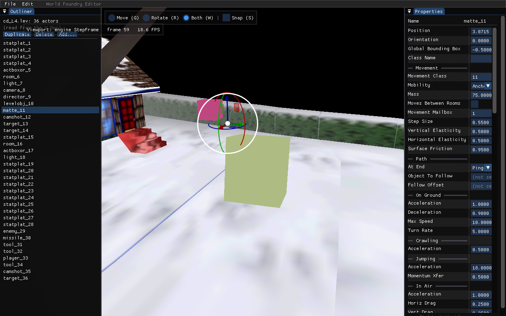

# wf-edit: load compiled binary levels (`.iff`, bare or inside `cd.iff`)

**Status:** ✅ Done 2026-05-25 (~1 h editor wiring; tooling landed earlier). `wf-edit` loads a bare
compiled `.iff` and a level selected out of a `cd.iff` archive. **Tooling:** `levcomp decompile`
parses/dumps the `cd.iff` TOC (`--list`) and selects a level (`--level <tag|index>`) — unit-tested on
the TOC byte format. **Editor wiring:** `LoadLevelTreeIntoDoc` sniffs binary-vs-text by content,
decompiles a binary input to a temp `.lev` via `levcomp decompile`, then runs the existing
`levtree`→Doc path unchanged; the `--leveltree=` CLI accepts `<file.iff>` and `<file.iff>:<TAG|index>`
(cd.iff selector). Verified headless: bare `snowgoons-blender-standalone.iff`, `cd.iff:L4` (by tag),
and `cd.iff:1` (by index) each populate the Doc with all **36** snowgoons actors; the text `.lev`
default still loads; and a binary-loaded Doc Save-As round-trips to a valid `.lev` (synthetic
`statplat_1`… names).
**Date:** 2026-05-25
**Scope:** Let `wf-edit` open a *compiled binary* level — a bare per-level LVAS `.iff` and a level
selected out of a multi-level `cd.iff` archive. The editor reads the binary read-only (no in-place
binary patch); the session is otherwise fully editable and **saves *out* to a new `.lev`** via the
existing `SaveDocToLev` — and from there recompiles to a bare `.iff` via the existing
"Save + Compile (.iff)" pipeline (see "Saving back to binary" below). What's *not* recovered is the
original authored source (names/comments are gone — see Fidelity).

## Context

The [wf-edit manual](../wf-edit-manual.md) says the editor "sources from text `.lev`/`.iff.txt`, not
a compiled `cd.iff` (a binary level isn't self-describing)." That phrasing is imprecise. The
compiled `.lvl` is **positional** — header + packed `_ObjectOnDisk` records
([`wftools/levcomp-rs/src/lvl_writer.rs`](../../wftools/levcomp-rs/src/lvl_writer.rs),
`_ObjectOnDisk` in [`wfsource/source/oas/levelcon.h`](../../wfsource/source/oas/levelcon.h)): no
inline field-name strings, values packed in the order the class schema defines. But **binary + the
OAS/OAD/`objects.lc` schema is fully decodable**, and the tool already exists:

> `levcomp decompile <input.iff> <objects.lc> [--oad-dir <dir>] [-o <out.lev>]`
> ([`wftools/levcomp-rs/src/decompile.rs`](../../wftools/levcomp-rs/src/decompile.rs))

It recurses `L4 → LVAS → LVL`, walks each object, and emits a named-field `.lev`: class names via
`objects.lc`, field names/types/enum labels via the OADs, Forth scripts via STR fields. So the
"not self-describing → out of scope" note in
[`2026-05-20-editor-property-panel.md`](2026-05-20-editor-property-panel.md) was a convention/effort
call, not a technical wall.

The editor's load path is already a shell-out: `levtree parse <file.lev>` → JSON → `wfcrdt::Doc`
([`level_doc.cc` `RunLevtreeParse`/`LoadLevelTreeIntoDoc`](../../engine/wf_edit/level_doc.cc),
wired at [`main.cc:~1259`](../../engine/wf_edit/main.cc) off the `--leveltree=` arg). So binary load
slots in as a **pre-step**: decompile the binary to a temp `.lev`, then run the existing path
unchanged.

**Fidelity — and why source order is load-bearing.** The binary stores **no object names**; actor
cross-references (`Track Object`, `Target`, `Object To Throw`, ActBoxOR's referenced object, etc.)
are stored as a **1-based actor *index*** — the `ObjectReference`/`ClassReference` OAD button types
read a 4-byte int32 ([`decompile.rs:427-433`](../../wftools/levcomp-rs/src/decompile.rs)). The
decompiler bridges this by **synthesizing** `{ClassName}_{index}` names for every object
([`decompile.rs:106-127`](../../wftools/levcomp-rs/src/decompile.rs)) and emitting reference fields
as those synthetic names ([`decompile.rs:434-449`](../../wftools/levcomp-rs/src/decompile.rs)); the
compile direction resolves reference names → index via `name_to_index`, "matching the `.lev` order"
([`lev_parser.rs:94-99`](../../wftools/levcomp-rs/src/lev_parser.rs)). Because the decompiler walks
objects in index order (`1..obj_count`), the synthetic names and the references that point at them
stay mutually consistent — **so references resolve to the right actor for read-only display.**
Field values, enums, and Forth scripts are likewise recovered. What's gone: the **authored** names
(only synthetic `{Class}_{index}` remain), source ordering beyond the index order, and comments
(already exempted as exporter noise).

You **can** save the (decompiled, possibly edited) level out to a **new `.lev`** — it carries the
synthetic names, they're used consistently on both sides, and it recompiles cleanly (and from that
`.lev`, on to a bare `.iff` via the existing compile pipeline — see "Saving back to binary"). What
you **can't** recover is the original *authored* source: with authored names gone, the
position-derived synthetic names are the only handle, so a new `.lev` is a fresh derivative, not a
reconciliation with the Blender/`.lev` golden source. (Structural editing — reorder/add/delete — is
also where index-based references get
fragile, but that's an editing concern orthogonal to this load feature.)

## Design

### Phase 1 — bare LVAS `.iff` (a single compiled level)

This is nearly free: `levcomp decompile` already handles a single-level LVAS container directly, and
the editor already shells out to a Rust tool (`RunLevtreeParse` → `popen("levtree parse …")`,
[`level_doc.cc:71`](../../engine/wf_edit/level_doc.cc)).

1. **Detect binary vs. text** in `LoadLevelTreeIntoDoc` ([`level_doc.cc:244`](../../engine/wf_edit/level_doc.cc)):
   read the first 4 bytes — a text `.lev` starts with `{`/whitespace, a binary level with an IFF
   FOURCC (`L0`/`L4`/`GAME`/`LVAS`…). Sniff, don't trust the extension.
2. **Decompile to a temp `.lev`** via a new `RunLevcompDecompile(in, sel, out_tmp)` mirroring
   `RunLevtreeParse`/`FindLevtree` ([`level_doc.cc:48`](../../engine/wf_edit/level_doc.cc)) — a
   `FindLevcomp()` (env `WF_LEVCOMP` → `wftools/levcomp-rs/target/{release,debug}/levcomp` → PATH)
   then `popen("levcomp decompile <in> <objects.lc> --oad-dir <oad> [--level <sel>] -o <tmp>")`.
   `objects.lc` = [`wfsource/source/oas/objects.lc`](../../wfsource/source/oas/objects.lc); `--oad-dir`
   = `wfsource/source/oas` (reuse the property panel's `OadForClass` dir resolution). Write `<tmp>`
   under `$TMPDIR`/`mkstemp`.
3. **Feed the temp `.lev` to the existing pipeline** — call `RunLevtreeParse(tmp)` →
   `LoadLevelTreeIntoDoc`'s existing JSON→Doc body, unchanged. Outliner, property panel, and engine
   bridge all work as-is. The CLI accepts `--level=<file.iff>` (bare) or `--level=<file.iff>:<TAG>`
   (a `cd.iff` selector, Phase 2) — split on the last `:` and pass the tag through as `--level`.
4. **Save goes to a new `.lev`, never back to the binary.** Once the level is in the Doc it's fully
   editable, and `SaveDocToLev` ([`level_save.cc:57`](../../engine/wf_edit/level_save.cc), driven by
   `DoSave`/`save_path` at [`main.cc:273`](../../engine/wf_edit/main.cc)) already `levtree print`s
   the Doc back to a `.lev` — so Save-As is essentially free and faithful (the lossless Doc schema
   round-trips the decompiled content exactly; synthetic names are used consistently, so the saved
   `.lev` recompiles cleanly). Just seed `save_path` to a fresh `.lev` (not the source binary) on a
   binary load, and surface it as **Save As `.lev`** rather than an in-place Save.

### Phase 2 — select a level out of `cd.iff` (multi-level archive)

`cd.iff` is an archive *above* LVAS: `LVLHDR {lvasTag, fileSize}` + a `TOC` of
`TOCENTRYONDISK {tag, offset, size}` (e.g. snowgoons index 5 = `L4` = snowgoons — see
[level-building.md § cd.iff](../level-building.md#cdiff--multi-level-archive)). `decompile.rs` parses
LVAS but not this archive layer yet.

**DONE — TOC parse/dump/select now lives in `levcomp decompile`** (the canonical home, so any
consumer gets it, not just an engine-linked editor):

- `levcomp decompile <cd.iff> <objects.lc> --list` → dumps the TOC (idx, tag, offset, size).
- `levcomp decompile <cd.iff> <objects.lc> --oad-dir <dir> --level <tag|index> -o out.lev` →
  slices the selected level's IFF chunk (reading its own header for the exact extent, since the TOC
  size is sector-granular) and runs the existing single-level decompile on it.

Implementation in [`decompile.rs`](../../wftools/levcomp-rs/src/decompile.rs) (`parse_game_toc` /
`print_toc` / `select_entry`, GAME-archive dispatch in `run`) + flags in
[`main.rs`](../../wftools/levcomp-rs/src/main.rs). [`DiskTOC::LoadTOC`](../../wfsource/source/iff/disktoc.cc)
was the byte-format oracle. Verified on the real `cd_full.iff` (SHEL + L0–L6; `--level L4` →
snowgoons 36 objects) + 3 unit tests pinning the TOC byte layout. **The in-process `DiskTOC` route
is dropped** — the editor shells out to `levcomp` for the archive, exactly as it already does for
`levtree`/`levcomp`, so no engine-linkage dependency and no DiskTOC change needed.

**Editor wiring (remaining):** for `cd.iff` input, shell out to `levcomp decompile … --level <sel>`
(temp `.lev`) then the existing `levtree`→Doc path. A CLI selector (`--level=cd.iff:L4`) comes first.

**Level picker UX — no existing editor picker to reuse.** The only level picker today is the in-game
**cubemenu** shell (writes `EMAILBOX_LEVEL_TO_RUN` → `_desiredLevelNum`); `wf-edit` itself takes a
single `--leveltree=`/`--level=` path (the `main.cc:869` popup is the *class* picker for Add actor,
unrelated). An in-editor "open level from `cd.iff`" picker is a Phase-2.5 follow-up: it can populate
the level list straight from `levcomp decompile --list` (which now carries the tags), so **no
`DiskTOC` tag-retaining change is needed** after all.

## Critical files

- [`engine/wf_edit/level_doc.cc`](../../engine/wf_edit/level_doc.cc) — `RunLevtreeParse` /
  `LoadLevelTreeIntoDoc`; add the decompile pre-step + binary sniff here.
- [`engine/wf_edit/main.cc`](../../engine/wf_edit/main.cc) — CLI arg(s) + load dispatch (~1209-1259);
  the read-only / save-as gating.
- [`wftools/levcomp-rs/src/decompile.rs`](../../wftools/levcomp-rs/src/decompile.rs) /
  [`main.rs`](../../wftools/levcomp-rs/src/main.rs) — the `decompile` subcommand; extend for the
  `cd.iff` archive TOC + `--level` selector (Phase 2).
- Schema inputs at runtime: [`wfsource/source/oas/objects.lc`](../../wfsource/source/oas/objects.lc)
  + the OAD dir (reuse the editor's existing `OadForClass` resolution).

## Verification

**Done 2026-05-25.** Headless loads of the bare `snowgoons-blender-standalone.iff`, `cd.iff:L4` (by
FOURCC tag), and `cd.iff:1` (by decimal index) each report `Y.Doc populated … 36 top-level chunks` +
`Outliner shows 36 actors`; the text `.lev` default still loads (regression); and `WF_EDIT_SAVE` on a
binary-loaded Doc writes a valid `.lev` (`{ 'LVL' … { 'NAME' "statplat_1" …`). The editor screenshot
below (`--leveltree=wflevels/cd.iff:L4 --select=10`) shows the Outliner (synthetic `statplat_*` /
`camera_*` names), the viewport, and the Properties panel all populated from the `cd.iff` decompile:

Original verification plan (all satisfied):

1. **Bare `.iff` round-trip parity.** Build snowgoons to binary via the normal pipeline
   ([`wftools/wf_blender/build_level_binary.sh`](../../wftools/wf_blender/build_level_binary.sh)),
   then load the binary in `wf-edit` and load the text `.lev` in a second instance; assert the same
   actor count, classes, and positions (allowing synthetic names + binary ordering). The decompiler
   already targets re-consumption, so also re-compile the decompiled `.lev` and diff actor
   count/positions against the original binary.
2. **cd.iff selection.** From `cd.iff`, load index 5 (`L4`/snowgoons); confirm the same Doc as the
   bare-`.iff` snowgoons load.
3. **Screenshots-for-proof.** Capture the editor viewport with a binary-loaded level rendering the
   actors (e.g. snowgoons from `cd.iff`), since this is a user-visible load path — `--screenshot` +
   the headless harness, like the existing editor screenshots.
4. **Read-only guard.** Confirm File→Save is disabled (or Save-As-`.lev` only) for a binary-loaded
   session.

## Saving back to binary — what's actually available

An earlier draft said "there's no binary writer, so binary write-back is out of scope." That was
wrong: WF has **two** IFF writers — the C++ [`wftools/iffwrite/`](../../wftools/iffwrite/iffwrite.hp)
(`IffWriterBinary`/`IffWriterText` with `enterChunk`/`exitChunk` + `ChunkSizeBackpatch` size
backpatching, the oracle) and the production Rust
[`iffcomp-rs`](../../wftools/iffcomp-rs/src/writer.rs). So binary output is a solved problem.

**The save model is "save out as a new file" — and that already works.** Save the Doc to a `.lev`
(`SaveDocToLev`), then, if you want a binary, run the existing compile pipeline
([`build_level_binary.sh`](../../wftools/wf_blender/build_level_binary.sh): `iffcomp -binary` →
`levcomp` → `textile` → `iffcomp -binary`). The editor already exposes that as
**File → "Save + Compile (.iff)"** ([`RunBuildLevel`](../../engine/wf_edit/level_doc.cc)). So a
binary-loaded level round-trips to a fresh `.lev` or a fresh bare `.iff` today.

**Re-packing a level back *into* a multi-level `cd.iff` is explicitly NOT a goal** (per the user:
"we don't need to save cd format — just save out the level as a new file"). The archive is an input
to read levels *out* of; saving always produces a standalone new file, never an in-place archive
edit. No re-pack work is planned.

## Out of scope / deferred

- **`cd.iff` archive re-pack** — writing an edited level back into the multi-level archive. **Not a
  goal** (user: "we don't need to save cd format — just save out the level as a new file"). Saving
  always emits a standalone new file (`.lev`, or a bare `.iff` via recompile); the archive is
  read-only input. The machinery would exist (`iffwrite`'s `ChunkSizeBackpatch` + `parse_game_toc`),
  but there's no plan to wire it.
- **In-place binary patch** — editing bytes inside the original `.iff` without going through `.lev`
  recompile. Not planned (save-out-as-new-file supersedes it).
- **Recovering authored actor names / comments / source ordering** — not in the binary; synthetic
  names are accepted.
- **In-editor cd.iff level picker** — CLI selector first; the picker is a follow-up.
