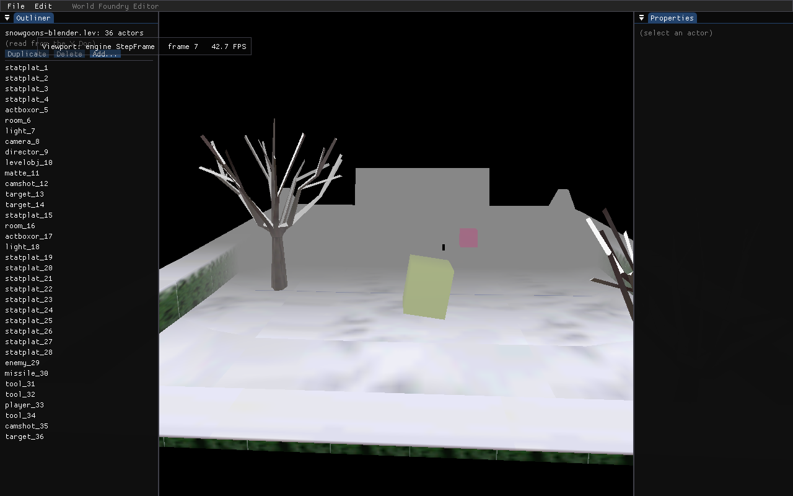

# Plan — Eliminate the local-edit render latency in `wf-edit`

**Date:** 2026-05-25
**Status:** DONE 2026-05-25 (Option A implemented, under an hour). The editor loop now runs
`editor_build` → `StepFrame` → `editor_present` each iteration, so a local edit is rendered the same
frame it is applied. `wf_edit` rebuilt clean and an 8-frame headless capture renders + exits cleanly
(proof below) — build-before-render did not break first-frame GL init.



*`./build-editor/wf-edit --frames 8 --screenshot …`: the viewport renders the snowgoons level with
the Outliner + Properties panels composited on top, and exits cleanly after 8 frames. The frame
counter reads "frame 7" — `max_frames − 1` — confirming the `--screenshot` trigger and frame counter
stay consistent across the build/present split.*

## Problem

A local edit (type a value in the Properties panel, drag the gizmo) does not appear in the 3D
viewport on the frame it is made. It is documented as "by design" at
[`main.cc:907-908`](../../engine/wf_edit/main.cc), but it is eliminable, and it is worse than
"one frame" — it is a **structural ~2-frame lag**.

### Why (root cause)

The editor loop in [`WFGame::RunEditor`](../../wfsource/source/game/game.cc) (game.cc:471-476)
renders the 3D scene at the **top** of every iteration, *before* the editor builds its UI:

```
for (;;) {
    StepFrame(false, &dt);              // (1) render 3D scene into back buffer, no swap
    if (!sEditorFrame(sEditorCtx))      // (2) editor_frame: drain → build panels → overlay → swap
        break;
}
```

`editor_frame` ([`main.cc:501`](../../engine/wf_edit/main.cc)) runs `DrainEngineSync` near its top
(~line 575), then builds the panels (a Properties edit commits to the Doc at ~line 912, queuing it
via the deep observer), then `ImGui::Render` (1131) + swap (1143). So within one iteration the
order is: **render → drain → build(commit)**. The render already happened before the edit exists,
and the drain happens before the *next* build, so:

```
it N    StepFrame_N      DRAIN_N      build_N(commit e)   swap_N        e queued
it N+1  StepFrame_N+1    DRAIN_N+1(applies e)  …          swap_N+1      StepFrame ran BEFORE drain ⇒ e not shown
it N+2  StepFrame_N+2(shows e)        …                   swap_N+2      e finally visible
```

`e` is committed in iteration N and first presented at `swap_{N+2}` — **two frames**.

Moving `DrainEngineSync` to the end of `editor_frame` (after the build) only buys 2→1: the render is
still at the loop top, ahead of the build. **Zero latency requires the 3D render to run *after* the
UI build + drain, in the same iteration.** Nothing inside `editor_frame` can achieve that while
`StepFrame` sits at the top of the loop.

## Goal

Local panel edits (and gizmo drags) appear in the viewport on the **same** frame they are made — no
added latency vs. ImGui's own redraw. Remote/undo/replay edits keep working (they arrive via
`CollabDrain` before the build, so they were never latent in the same way).

## Approach (recommended) — split the editor callback; sandwich `StepFrame`

Reorder one iteration to **build UI + drain → render 3D → overlay + swap** by splitting the single
`EditorFrameCallback` into two phases, with the engine render between them. This keeps `StepFrame`
owned by the engine and the swap owned by the editor (the current contract), just re-sequenced.

### 1. [`editor_hook.h`](../../wfsource/source/game/editor_hook.h)

```c
typedef bool (*EditorBuildCallback)(void* ctx);    // poll, build ImGui UI, commit edits, drain
typedef void (*EditorPresentCallback)(void* ctx);  // ImGui::Render + RenderDrawData + swap
void SetEditorFrameCallbacks(EditorBuildCallback build,
                             EditorPresentCallback present, void* ctx);
```

(Keep the old `SetEditorFrameCallback` as a thin shim, or replace its one caller.)

### 2. [`WFGame::RunEditor`](../../wfsource/source/game/game.cc)

```cpp
for (;;) {
    if (!sEditorBuild || !sEditorBuild(sEditorCtx))   // build UI, commit edits, drain into engine
        break;
    StepFrame(false, &dt);                            // render 3D with the post-edit engine state
    if (sEditorPresent) sEditorPresent(sEditorCtx);   // composite ImGui overlay + swap
}
```

One `StepFrame` per iteration still — only its position moves. No double-stepping of the sim.

### 3. [`main.cc`](../../engine/wf_edit/main.cc) — split `editor_frame`

- **`editor_build(ctx)`** — everything from the current top through the last `ImGui::End()` (line
  1129): `glfwPollEvents`, the window-close early-return (stays **before** `ImGui::NewFrame` so we
  never leave an unmatched frame on quit), resize re-fit, the bridge calls (`InitBridgeMap` →
  `CollabDrain` → `UpdateBridgeMap` → `DrainEngineSync`), presence, `ImGui::NewFrame`, and all panel
  building (Outliner / Properties / gizmo / chat). Returns `false` to quit.
- **`editor_present(ctx)`** — `ImGui::Render` (1131) → `ImGui_ImplOpenGL3_RenderDrawData` (1132) →
  the `--screenshot` capture (1134-1135, unchanged: it still reads the composited back buffer) →
  `glfwSwapBuffers` (1143).

Resulting order, zero latency:

```
it N   build_N(commit e + DRAIN_N applies it)   StepFrame_N(shows e)   present_N → swap_N
```

### Quit-signal detail

The `--frames`/`--screenshot` counter (frame++ and the `max_frames` check at 1145-1147) currently
rides on `editor_frame`'s return. Move `++c->frame` + the `max_frames >= 0 && frame >= max_frames`
check into `editor_build` (after the screenshot frame is presented — i.e. check at the *top* of the
next build, or have `editor_present` set a `c->should_quit` flag that `editor_build` reads). Keep the
screenshot's `frame == max_frames - 1` trigger aligned so `--frames N --screenshot P` still captures
frame N−1 and exits.

## Bonus

The gizmo's live-preview (`ApplyGizmoToEngine`, [`main.cc:996`](../../engine/wf_edit/main.cc)) writes
the engine during the build phase, so it inherits the same fix — a drag becomes truly same-frame
instead of trailing the cursor by a frame or two.

## Alternatives considered

- **(B) Single callback + a step thunk.** Keep one `editor_frame`; have `RunEditor` pass an
  `EngineStepFn` the editor invokes after its drain, before `ImGui::Render`. Fewer contract symbols
  but threads a function pointer through `EditorCtx`; messier than the clean build/present split.
- **(C) Second `StepFrame` inside `editor_frame`.** Re-render the 3D scene after the drain. Smallest
  diff, but renders the scene **twice per frame** (the loop-top render is wasted). Rejected as waste.
- **Interim: drain at end-of-build.** Move only `DrainEngineSync` to after the panel build. Cuts
  2→1 frame with a one-line move and no engine change — a fallback if the reorder is deemed too
  invasive, but it does **not** meet the "get rid of it" goal.

## Risks / verification

- **First-frame ordering.** The build now precedes the first `StepFrame`. `LoadLevel` already ran
  before the loop, so `theLevel`/camera exist; the bridge + gizmo paths are all null-guarded. Verify
  the first frame still composites (headless `--frames 2 --screenshot`).
- **ImGui `NewFrame`/`Render` pairing.** `NewFrame` (build) and `Render` (present) are now split by
  `StepFrame`. ImGui draw-data is CPU-side until `Render`, so interleaving `StepFrame`'s GL is safe —
  and `RenderDrawData` already runs *after* `StepFrame` today, so no new GL-state hazard.
- **Quit path.** Window-close returns from `editor_build` before `NewFrame` (no half-built frame);
  `--frames` exit still captures + quits (see Quit-signal detail).
- **Verification:** `cmake --build build-editor --target wf_edit`; headless
  `--frames N --screenshot` parity (viewport still renders, screenshot matches); a manual
  type-a-Position-value test (now updates same frame); confirm a two-instance relay edit still
  propagates (remote path unchanged).

## Effort

~1–1.5 h (small engine-seam change + a mechanical `editor_frame` split + a build/screenshot verify).
A step toward [HAL decomposition](2026-05-22-editor-whats-next.md) (editor owning the loop), but far
smaller in scope.
