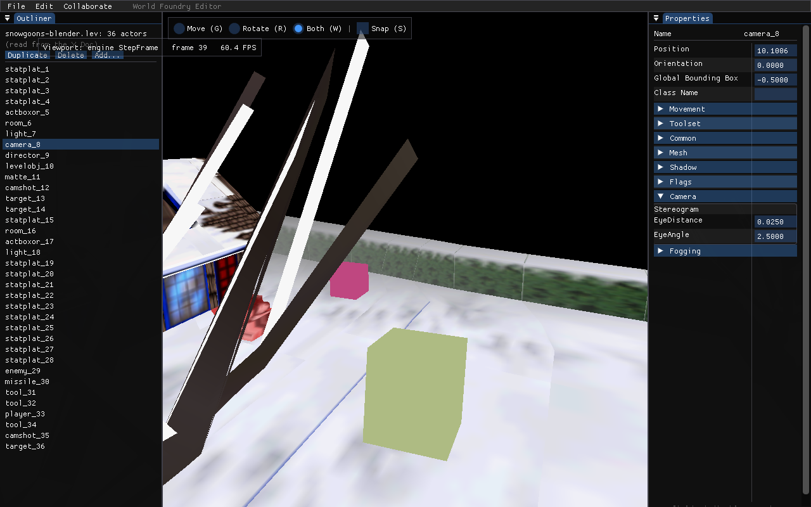
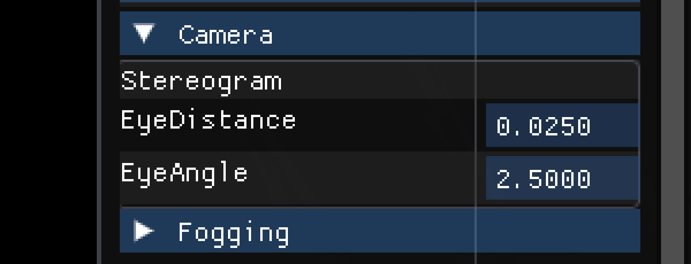

# Collapsible property sheets + boxed groups in the wf_edit property panel

**Status:** Done (2026-05-31, ~1 h). Verified headless on the snowgoons `camera`
actor — see proof shots below.

## Context

The editor's property panel (`engine/wf_edit/property_panel.cc`) currently renders
**both** OAS section markers as a flat `ImGui::SeparatorText` — a static label, no
border, no collapse. The original 3ds Max OAD UI plugin (read at
`c5761ca^:wfmaxplugins/attrib/buttons/`) drew them as **two distinct things**:

- **`PROPERTY_SHEET` (type 8)** → a **collapsible rollout**, whose default
  open/closed state came from the record's `def` field
  (`propshet.cc`: `AddRollupPage(..., _td->def ? 0 : APPENDROLL_CLOSED)`).
  `PROPERTY_SHEET_HEADER(name, active=0, …)` feeds `active` into `def`
  (`types3ds.s:26`), so the flag is already authored and already compiled into
  every `.oad` golden.
- **`GROUP_START`/`GROUP_STOP` (type 25/26)** → a **static etched-frame box**
  (`group.cc`: `SS_ETCHEDFRAME` static with `_td->name` as caption) drawn *around*
  the contained fields. Not collapsible. `GROUP_STOP` marks where the box closes.

The faithful result:

- **`PROPERTY_SHEET` → collapsible**, defaulting open/closed from the existing
  `def`/`active` value already in the data. (This is the one behavioral change vs.
  today: sheets were flat separators, now they collapse.)
- **`GROUP_START`…`GROUP_STOP` → a bordered, captioned box** around its fields —
  **not** collapsible. `GROUP_STOP` is the bottom edge (today it's a no-op). This
  restores the oracle's etched frame; the current flat-separator rendering was
  *not* faithful.

No macro edit, no `.oad` regeneration, no codegen / `test-codegen` impact — the
sheet flag is already in the data and groups need no new field.

## Layout invariants (UX conventions, not format limits)

The OAD record format *could* express arbitrary nesting, but the authoring
convention forbids it for UX reasons. Confirmed by scanning all 36 `.oas`:

- **Sheets are top-level only — no sheet inside a sheet.** Each
  `PROPERTY_SHEET_HEADER` reaches its `FOOTER` before the next header begins
  (sheets are sequential, never interleaved). ⇒ a single `section_open` bool
  suffices; no sheet-nesting stack.
- **Groups may sit one level inside a sheet — but no group inside a group.** Each
  `GROUP_START` reaches its `GROUP_STOP` before the next one. ⇒ the group box is
  only ever **one deep**.
- Groups inside a sheet **is** the normal, allowed case (`CamShot`, `Generator`,
  `Room`, …). The implementation relies on these invariants rather than handling
  general nesting.

## Established facts (verified)

- `OadEntry` carries `def` (`oad_reader.cc:~85` reads `oe.def = d.def`); `PropField`
  (`property_panel.h:37-59`) does **not** yet. Section/group headers are synthesized
  **only** through the `make_header` lambda (`property_panel.cc:265-276`) — the
  markers are unmatchable (name blanked, `:256`), so they never flow through the
  matched-field block (`:303-312`). `make_header` is the single copy site.
- Header title lives in `PropField::name` (the OAD `displayName` slot is junk for
  these markers — comment `:262-264`).
- Render loop `:605-666`: `++row` first (`:633`); `Section`/`GroupStart` →
  `SeparatorText`+continue (`:637-641`); `GroupEnd` → continue (`:643`); real
  widgets `PushID(row)` for stable IDs. Panel is a 2-col `BeginTable("props", …)`
  with `RowBg | ScrollY`.
- ImGui v1.92.9 vendored. Available: `CollapsingHeader(label, flags)`,
  `ImGuiTreeNodeFlags_DefaultOpen`, `ImGuiTreeNodeFlags_SpanAllColumns`;
  `ImGui::TablePushBackgroundChannel()/TablePopBackgroundChannel()`
  (`imgui_internal.h:3832-3833` — the supported way to draw across table rows);
  `GetWindowDrawList()->AddRect(...)`, `GetColorU32(ImGuiCol_Border)`.
  CollapsingHeader persists open state by ID; `DefaultOpen` only seeds first-seen.
- Data shape (see Layout invariants above): base `actor.inc` fields appear
  **before** the first `PROPERTY_SHEET_HEADER`. `PROPERTY_SHEET_FOOTER` emits
  **no record**, so a sheet runs until the next `PROPERTY_SHEET` marker or EOL —
  the legacy rollout model. `camera.oas` = `Camera`(open) + `Fogging`(**closed**);
  `camshot.oas` = `CamShot`(open) wrapping 6 groups (one, `Mode: Tracking`, is
  entirely commented out → empty group).

## Changes — one file only (`engine/wf_edit/property_panel.*`)

### 1. Plumb the sheet open/closed flag into `PropField`

- `property_panel.h`: add `long default_open = 0;` to `PropField`
  (`!=0` ⇒ section default-open).
- `property_panel.cc` `make_header` (`:265-276`): `h.default_open = e.def;`.

### 2. Render: collapsible sheets, boxed groups

Add `#include "imgui_internal.h"` (for the table background-channel calls).
Rewrite the marker handling in `RenderProperties` (`:630-663`). Only sheets
collapse → a single `section_open` bool (no nesting stack for collapse). Groups
push a small box-coordinate stack. `++row` stays unconditional + first so
`PushID(row)` IDs survive collapse.

```cpp
ImGui::PushID(actor_index);              // per-actor: sheet collapse state is per actor
bool section_open = true;                // before the first sheet, everything visible
struct GroupBox { float x0, y0; };
std::vector<GroupBox> groups;            // GROUP_START..GROUP_STOP box corners (≤1 deep: no group-in-group)
int row = 0;
for (auto& f : fields) {
    ++row;                               // ALWAYS advance — keeps PushID(row) stable

    if (f.kind == FieldKind::Section) {
        groups.clear();                  // defensive: a new sheet ends any stray group
        ImGui::TableNextRow();
        ImGui::TableSetColumnIndex(0);
        ImGui::PushID(row);
        ImGuiTreeNodeFlags fl = ImGuiTreeNodeFlags_SpanAllColumns;
        if (f.default_open != 0) fl |= ImGuiTreeNodeFlags_DefaultOpen;
        section_open = ImGui::CollapsingHeader(f.name.c_str(), fl);
        ImGui::PopID();
        continue;
    }

    if (!section_open) continue;         // collapsed sheet hides fields, group caption + box

    if (f.kind == FieldKind::Skip) continue;

    if (f.kind == FieldKind::GroupStart) {   // box top + caption (was: SeparatorText)
        ImGui::TableNextRow();
        ImGui::TableSetColumnIndex(0);
        const ImVec2 p = ImGui::GetCursorScreenPos();
        ImGui::TextUnformatted(f.name.c_str());   // etched-frame caption, top-left
        groups.push_back({ p.x, p.y });
        continue;
    }
    if (f.kind == FieldKind::GroupEnd) {     // box bottom — close the etched frame (was: no-op)
        if (!groups.empty()) {
            const GroupBox g = groups.back(); groups.pop_back();
            const float y1 = ImGui::GetCursorScreenPos().y;                       // below last row
            const float x1 = ImGui::GetWindowPos().x + ImGui::GetWindowContentRegionMax().x;
            ImGui::TablePushBackgroundChannel();
            ImGui::GetWindowDrawList()->AddRect(ImVec2(g.x0 - 2.f, g.y0 - 2.f),
                                                ImVec2(x1, y1),
                                                ImGui::GetColorU32(ImGuiCol_Border), 3.f);
            ImGui::TablePopBackgroundChannel();
        }
        continue;
    }

    /* …existing normal-field render at :645-662, unchanged… */
}
ImGui::PopID();
```

Exact border insets / caption styling (`TextUnformatted` vs `TextDisabled`,
rounding, padding) are tuned during implementation against the screenshot. The
`s_last_actor` Notes-reset block (`:617-623`) is unchanged; per-actor header IDs
make a separate collapse reset unnecessary.

## Edge cases

| Case | Behavior |
|---|---|
| Base fields before the first sheet (`actor.inc`) | `section_open` starts `true` → always visible, no box. |
| `Fogging` sheet (`active=0`) | no `DefaultOpen` → starts collapsed; its 3 fog fields hidden. |
| Group inside a collapsed sheet | **Runtime-only, never authored.** Verified across all 36 `.oas`: every group-bearing sheet is `active=1` (default-open); the only default-closed sheets (`Fogging`, `FieldFX`, `Sound Effects Bank`, `Music`, and the arg-less `Platform`/`Stationary Platform`) contain no groups. Reachable solely by the user manually collapsing an open sheet — handled for free: `!section_open` skips the group's `GroupStart`/`GroupEnd` together → no caption, no box, balanced stack. No special design needed. |
| Empty group (`Mode: Tracking`, all commented out) | caption + a thin box with no inner rows. Matches the oracle (frame drawn regardless). |
| Trailing fields after the last sheet | belong to that sheet (oracle-faithful — no FOOTER record ends it). |
| Stray/unbalanced `GroupEnd` | `groups.empty()` guard → no draw, no crash. New `Section` clears the stack. |
| Collapse vs `WF_EDIT_SCROLL_TO` | hidden fields never call `SetScrollHereY`; frame a *visible* field for a shot. |
| ID stability on collapse | `++row` unconditional + unchanged `PushID(row)` → ImGui per-widget state survives. |

## Verification

1. **Build** (editor = CMake **Debug**, `build-editor/`, target `wf_edit`, binary
   `build-editor/wf-edit`): `task build-wf-edit`; confirm binary mtime advanced.
2. **Find a camera actor index**: `WF_EDIT_OAD_DEBUG=1 ./build-editor/wf-edit
   --leveltree=<level-with-a-camera> --frames 3`.
3. **Headless screenshots** (run in background; `--screenshot` takes a SPACE;
   repo-path PPM; convert `ffmpeg -i x.ppm x.png`):
   - **camshot actor** — proves the boxed group across rows: `CamShot` sheet open,
     each `GROUP_START`…`GROUP_STOP` (e.g. `Bungee-Cam`, `Clipping Planes`) drawn
     as a captioned border box around its fields.
   - **camera actor** — proves sheet default open/closed: `Camera` sheet expanded
     (Stereogram group box visible), `Fogging` sheet **collapsed** by default
     (`active=0`); fog fields hidden.
4. No regression gates triggered: no `.oas`/`.oad`/codegen change →
   `task test-codegen` unaffected; default `WF_ENABLE_EDITOR=OFF` build still links
   (change is inside the existing editor TU).

### Result (verified 2026-05-31)

Built `build-editor/wf-edit`, captured the snowgoons `camera` actor (Doc index 7)
headless:
`WF_EDIT_OAD_DEBUG=1 ./build-editor/wf-edit --select=7 --frames 40 --screenshot <repo>/x.ppm`.

-  — every
  section is a framed `CollapsingHeader` with a ▶/▼ disclosure triangle; the
  data-driven defaults hold (`Movement`/`Toolset`/`Common`/`Mesh`/`Shadow`/`Flags`
  collapsed, `Camera` open).
-  —
  the open **Camera** sheet (▼) shows its **Stereogram** group as a bordered box
  around `EyeDistance`/`EyeAngle`, and **Fogging** below renders collapsed (▶) —
  `Camera,1` open vs `Fogging,0` closed, two states in one actor, proving `def`
  is plumbed per-section.

## Phasing & commits

- **Phase 1 (one commit):** `PropField::default_open` + `make_header` copy +
  collapsible-sheet render + boxed-group render. Cohesive; commit the plan doc with it.
- **Phase 2 (verification):** screenshots checked in / attached; no code.
