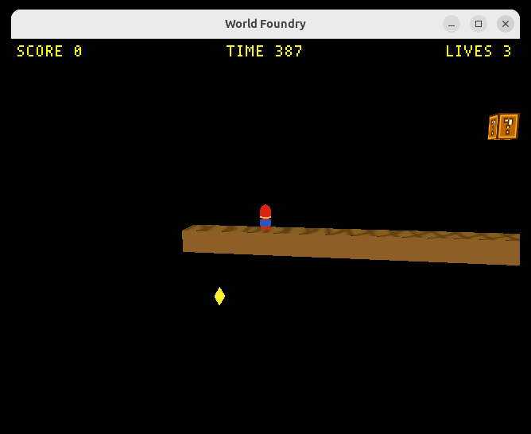
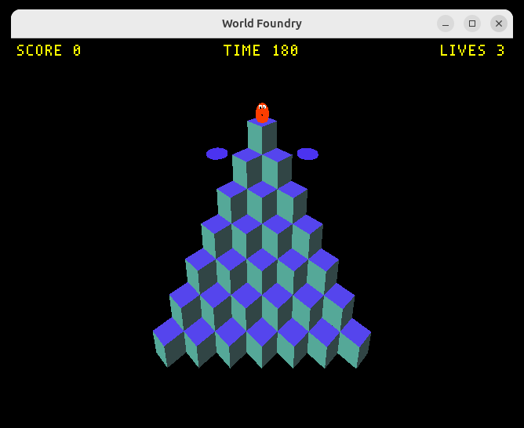
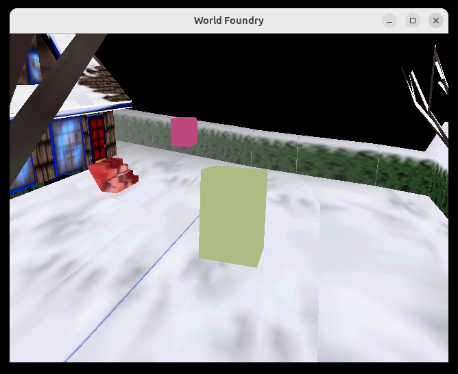

# Plan: replace `wfWindowWidth/Height` globals with `Display::GetSurfaceSize()`

**Status:** Done
**Date:** 2026-05-31
**Estimate:** ~1 h · **Actual:** ~30 min (smaller surface area than expected — the survey was thorough enough that migrations were mechanical)

## Verification screenshots

**Capture path** — identical to the pre-refactor capture (same image file as the HUD-resize plan); the refactor is a behaviour no-op for the FBO path:


**Interactive resize path** — Xlib-programmatically resized to 1500×800, captured via `xwd`. SCORE/TIME at top, text block top-left, minimap top-right (8 px margin, not clipped), lander dominating centre. The refactor preserves the prior live-resize fix because `mesa.cc`'s `ConfigureNotify` still feeds the new size in, now via `Display::SetLiveWindowSize()` instead of writing the global directly:


**No-regression check on other HUD-using levels** — same launch+xwd recipe against SMB W1-1 and qbert. Both render SCORE / TIME / LIVES at the correct corners, with no moon overlay leaking in (gated off on non-moon levels):

| SMB W1-1 | Qbert |
|---|---|
|  |  |

**Negative case** — snowgoons-blender boots with *no* HUD at all (no SCORE/TIME/LIVES, no moon overlay), confirming the gate's silent path is also intact (per [`2026-05-31-hud-gate-on-level-opt-in.md`](2026-05-31-hud-gate-on-level-opt-in.md), levels that never write the trigger mailboxes get no HUD draw at all):



## Context

`wfWindowWidth` and `wfWindowHeight` are mutable globals (`int = 640/480` defaults in `wfsource/source/gfx/gl/display.cc:479-480`) used for *two completely different things*:

1. **The size of the GL surface currently being drawn to.** Read by per-frame code: viewport setup (`display.cc:522`), projection-aspect math (`display.cc:531`), HUD layout (`display.cc:987-988` after the recent live-resize fix). Written from three platform layers (X11 `ConfigureNotify` in `mesa.cc:278-279`, Android `WFAndroidSetSurfaceSize` in `hal/android/platform.cc:61-62`, GLFW framebuffer-size loop in `engine/wf_edit/main.cc:1280` & `:3013`).
2. **The initial X window dimensions for `XCreateWindow`.** Read once at boot in `mesa.cc:149, 181`. After the window is created the platform never touches the globals through this path again.

These two purposes were mostly OK until the FBO capture path (`bRecordVideo`/`WF_GAME_SCREENSHOT_PPM`) added a *third* surface — the offscreen capture FBO with its own fixed `_xSize × _ySize`. The recent HUD-resize fix had to branch `bRecordVideo ? _xSize/_ySize : wfWindowWidth/wfWindowHeight` *at the call site*, which spreads the policy. The rest of the readers (`display.cc:522`/`:531`) still read the globals and so render into the wrong viewport when capturing.

The follow-up is to put the "what surface am I drawing to right now?" policy in **one place** — a `Display::GetSurfaceSize()` method that knows about both the live window and the capture FBO — and reduce the globals to a clearly-named init-only seed for window creation.

## Approach

Four changes, applied in order:

### 1. Add `Display::GetSurfaceSize` and `Display::SetLiveWindowSize`

In `wfsource/source/gfx/display.hp` / `display.cc`:

- Add private members `int _liveWidth, _liveHeight` (init to the same defaults Display is constructed with).
- Add `void SetLiveWindowSize(int w, int h)` — platform layers call this when the OS reports a resize.
- Add `void GetSurfaceSize(int& w, int& h) const` — branches: `bRecordVideo` → `(_xSize, _ySize)`, else `(_liveWidth, _liveHeight)`.

Also expose a static `Display* Display::GetActive()` (set in the ctor, cleared in the dtor) for callers outside the class that don't carry a `Display*`. There's only one Display at a time today; the existing `WFGame::_display` pointer is the canonical owner. This stays an internal convenience — callers prefer the instance method when they have one.

### 2. Migrate the three drawing-surface readers

| Site | Was | Becomes |
|---|---|---|
| `display.cc:522` (`WFInitGL`) | `glViewport(0, 0, wfWindowWidth, wfWindowHeight)` | Use `GetSurfaceSize()` via `Display::GetActive()` |
| `display.cc:531` (aspect) | `float(wfWindowWidth)/float(wfWindowHeight)` | Same |
| `display.cc:987-988` (HUD gate) | `bRecordVideo ? _xSize : wfWindowWidth` (etc.) | `int w,h; GetSurfaceSize(w,h); DrawHud(w,h);` — branching now lives inside `GetSurfaceSize` |

After this step the policy lives in one place; the call sites are dumb.

### 3. Move the writers to call the setter

| Site | Was | Becomes |
|---|---|---|
| `mesa.cc:278-279` (ConfigureNotify) | `wfWindowWidth = eW; wfWindowHeight = eH;` | `if (auto* d = Display::GetActive()) d->SetLiveWindowSize(eW, eH);` |
| `hal/android/platform.cc:61-62` | direct global write | same setter call |
| `engine/wf_edit/main.cc:1280, :3013` | direct global write | same setter call |

Each call site already has a check that the value changed; preserve that.

### 4. Rename the window-creation seed

The remaining read sites (`mesa.cc:149` and `:181`) want the *initial* X window geometry — a different concept that exists before any Display does. Rename the file-scope globals to make the distinction visible:

```cpp
// display.cc (or a new init header)
int wfInitialWindowWidth  = 640;
int wfInitialWindowHeight = 480;
```

`mesa.cc:149, :181` use these for `XCreateWindow`. Nothing else reads them. Drop the old `wfWindowWidth/Height` symbols entirely. Editor / Android paths pre-set the seed before `HALStart()` if they want a non-default initial window.

### Files modified

- `wfsource/source/gfx/display.hp` + `display.cc` — add the two methods, the static accessor, the new init-seed globals; migrate the three readers.
- `wfsource/source/gfx/gl/mesa.cc` — switch ConfigureNotify to the setter; switch XCreateWindow reads to the renamed seed.
- `wfsource/source/hal/android/platform.cc` — switch to the setter.
- `engine/wf_edit/main.cc` — switch the two write sites to the setter.

Nothing else compiles against `wfWindowWidth/Height` (verified by the survey).

## Why not just keep the call-site branch?

The branch at `display.cc:987` is one line, but it duplicates state: the HUD gate has to know about `bRecordVideo`, about `_xSize/_ySize`, *and* about the global window dims. Any future drawing-surface reader (a screen-space damage overlay, a different in-engine debug HUD, etc.) would have to re-implement the same branch. Worse, the two existing readers at `:522` and `:531` *don't* branch and so render into the wrong surface during capture today — silent latent bug. One method, one branch.

## Why not a singleton?

A static accessor is enough; `Display::Display()` records `this` into a static, dtor clears it. No global new, no `Instance()`-allocates pattern. Callers that already hold a `Display*` (WFGame, future plugins) should keep using the instance method directly.

## Verification

1. `task build` clean (engine).
2. `task build-editor` clean (wf_edit also touches the migrated symbols).
3. Capture-path screenshot regression: re-run `WF_GAME_SCREENSHOT_PPM=… engine/wf_game -record_video … -Lwflevels/moon_site01-standalone.iff` and confirm the resulting PNG matches `docs/plans/screenshots/2026-05-31-moon-hud-overlay-capture.png` (lander tower, astronaut speck, full HUD top-left, minimap top-right).
4. Interactive resize: `task run-moon`, drag the window to a wider aspect, confirm HUD anchors to the corners of the resized window (same behaviour as the existing fix, but now driven through the new method).
5. `git grep -nE "\bwfWindowWidth\b|\bwfWindowHeight\b"` returns nothing after the migration; old names are gone.
