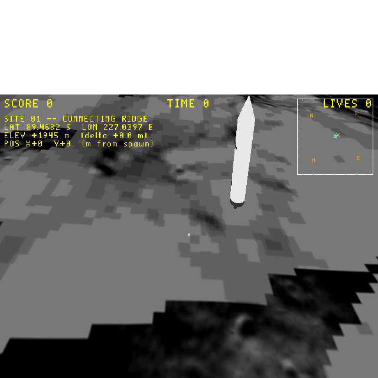

# Plan: doomstick (4-direction strafe) input on the moon level

## Context

The moon astronaut on Site 01 should walk in any direction across the 1 km² lunar surface — the level is a top-down/vista walking sim, not a side-scroller. Currently it has the *SMB W1-1 Forth script copy-pasted* with left/right strafe shifts, which works for left/right but goes through redundant machinery that only matters in non-doomstick games.

This plan switches the moon player's input mapping to the simplest possible doomstick passthrough.

## Background — what's already on

I checked all the prereqs are in place:

- `wflevels/moon_site01/moon_site01-standalone.iff.txt:RAM/FLAG` is `1l 1l` — doomstick flag set, read into `gDoomStick` at `level.cc:432`.
- `player['wf_Turn Rate'] = 0.0` in `blender_create_moon.py:340` — no rotation, so `LEFT`/`RIGHT` strafe directly (movement.cc:301-321, both branches send strafe when `turnRate == 0`).
- `player.rotation_euler.z = math.pi/2` → `currentDir = +Y`, so `UP` walks into the scene and `DOWN` walks back to the camera.
- X11 arrow keys (and IJKL) already feed `EJ_BUTTONF_UP/DOWN/LEFT/RIGHT` into `_joystickButtons` at `mesa.cc:295-313`, which is what `INDEXOF_HARDWARE_JOYSTICK1_RAW` exposes to Forth.

So all the *engine-side* pieces are already configured. The thing that isn't done is having the player's Forth script propagate UP/DOWN to `INDEXOF_INPUT` cleanly.

## What the current Forth actually does

```forth
INDEXOF_HARDWARE_JOYSTICK1_RAW read-mailbox
dup 16384 & 256 / over 8192 & 64 / | |
INDEXOF_INPUT write-mailbox
```

Trace: the final value written to INPUT is `raw | (raw & 0x4000) >> 8 | (raw & 0x2000) >> 6`. That's the original raw bits **plus** `kBtnStepLeft` and `kBtnStepRight` derived from raw LEFT/RIGHT.

Consequences:
- UP/DOWN already pass through at bits 11/12 and trigger forward/back via `EJ_BUTTONF_UP`/`EJ_BUTTONF_DOWN` in the doomstick branch (movement.cc:295-299) — so 4-direction *should* already work; the user can confirm by pressing arrow keys.
- LEFT/RIGHT triggers strafe **twice**: once via raw `EJ_BUTTONF_LEFT/RIGHT` (movement.cc:301-321 with `turnRate==0`) and once via the shifted `kBtnStepLeft/Right` (movement.cc:323-333). Net effect is 2× strafe acceleration on left/right vs. forward/back.
- Anything mapped onto bits 6/7 by the shifts would clash with `kBtnStepLeft/Right` if held by other inputs — currently nothing else does, but it's a footgun.

## Approach

Replace the shift-and-OR with a simple raw passthrough:

```forth
INDEXOF_HARDWARE_JOYSTICK1_RAW read-mailbox INDEXOF_INPUT write-mailbox
```

That's the entire script body (minus the `\\ wf` shebang).

Effect:
- All raw bits — UP/DOWN/LEFT/RIGHT and A (jump) and any other future button — flow into INPUT at their native positions.
- With `gDoomStick == true` and `TurnRate == 0`, this gives clean 4-direction strafe-style movement: UP forward, DOWN back, LEFT strafe-left, RIGHT strafe-right (all via doomstick branch), A jumps.
- No double-strafe; LEFT/RIGHT are now driven by the single raw-bit path.
- No silently-allocated INPUT bits — what you see in the raw is what the actor moves on.

The reason the current script is shaped the way it is: it was copy-pasted from `wflevels/smb_w1_1/...` where TurnRate is non-zero, so LEFT/RIGHT raw rotates the camera instead of strafing — SMB had to shift LEFT/RIGHT onto the kBtnStepLeft/Right bits to force strafe. Moon doesn't need that workaround because TurnRate=0.

## Files modified

- **`wflevels/moon_site01/blender_create_moon.py`** — replace the multi-line `player['wf_Script']` block with the one-liner passthrough.

## Verification

1. `task build-level -- moon_site01` clean (Blender re-export + standalone IFF).
2. `task run-moon`, hit:
   - `Up` arrow / `I` → astronaut walks forward (+Y, into the vista). HUD POS Y goes positive; lat readout decreases (more negative S latitude).
   - `Down` / `K` → walks backward. POS Y goes negative.
   - `Left` / `J` → strafes screen-left (-X). POS X goes negative.
   - `Right` / `L` → strafes screen-right (+X). POS X goes positive.
   - `Space` → jumps (existing behaviour).
3. Headless screenshot via the Xlib resize helper after injecting a known input via `joystick1_raw` (per [[project_smb_coin_pickup_verify]]), confirm minimap player dot moves in the expected direction.

## Estimate

~15 min: 5 min Blender edit + rebuild, 10 min run/verify.

## Verification (done)

**Status:** Done 2026-05-31. Verified via debug-bridge `inject_input` (XTest key-injection was unreliable against X auto-repeat; the canonical bridge path per [[project_smb_coin_pickup_verify]] worked).

| Held | Player Δ | Direction |
|---|---|---|
| RIGHT (0x2000) for 60 frames | X: 0 → +0.421 m | strafed screen-right ✓ |
| UP (0x0800) for 60 frames | Y: +0.004 → +0.358 m | walked forward (+Y, into the vista) ✓ |

Bridge screenshot from the moving player (lon shifted 227.0382 → 227.0397, ~+1.6×10⁻³° east; minimap dot moved upper-right of centre):



LEFT/DOWN aren't separately captured but follow the same passthrough — at TurnRate=0 they're driven by exactly the symmetric `EJ_BUTTONF_LEFT`/`EJ_BUTTONF_DOWN` bits the doomstick branch handles.
