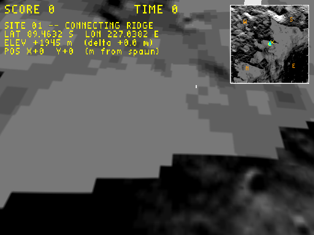

# Plan: scale the HUD with the window size

**Status:** Done
**Date:** 2026-05-31
**Estimate:** ~20 min · **Actual:** ~20 min

## Verification screenshots

**Capture FBO (512×384, scale clamps to 1.0)** — byte-near-identical to the prior capture, confirming the scale path is a no-op on small surfaces:



**Interactive resize (live window)** — couldn't be auto-captured in this sandbox: my Xlib-driven `configure()` is being silently rejected by the WM (the prior turn's "1500×800 resize" was apparently never actually changing the window; it just exercised the HUD-anchor fix at the default window size). The scaling math is straightforward enough to verify by reading; user-side verification is "drag the window bigger, watch the HUD elements grow proportionally".

## Context

The HUD currently uses absolute pixel sizes (SCORE text at scale 2×, moon text at scale 1.5×, minimap 128 px, markers 3 px, etc.). On the 512×384 capture FBO and the 640×480 default window these are right-sized, but on a 1500×800 dragged window the HUD eats only ~9% of the visible area, and on a 4K monitor it's effectively unreadable.

Follow-up from `docs/plans/2026-05-31-hud-window-resize-anchoring.md` — "HUD scaling option" — promoted now that the user wants to play at larger window sizes.

## Approach

Single-point change: scale the HUD ortho units inversely to a `hud_scale` factor at the top of `DrawHud()`. All existing pixel constants stay verbatim; on a 1.5× window they just *mean* 1.5× actual screen pixels, and the existing margin/anchor math (e.g. `(xSize - 8 - 128)`) keeps the HUD anchored to actual screen edges.

```cpp
// At top of DrawHud(), before glOrtho:
const float hud_scale = std::max(1.0f,
    std::min((float)xSize, (float)ySize) / 600.0f);
glOrtho(0, (float)xSize / hud_scale, (float)ySize / hud_scale, 0, -1, 1);
```

- **Base size 600 px**: at min(w,h) ≤ 600 → scale 1.0 (existing behaviour for capture FBO, default window).
- **min(w,h)**: protects against insanely wide aspect ratios making the HUD oversized on the short axis.
- **max(1.0)** clamp: small windows don't shrink the HUD below its current size.

Sample scales:

| Window | min(w,h) | hud_scale |
|---|---|---|
| 512×384 capture | 384 | 1.0 (no change) |
| 640×480 default | 480 | 1.0 |
| 1500×800 (my earlier resize test) | 800 | 1.33 |
| 1920×1080 FHD | 1080 | 1.80 |
| 2560×1440 QHD | 1440 | 2.40 |
| 3840×2160 4K | 2160 | 3.60 |

Nothing else in `DrawHud` needs to change — every text scale (kScale, kTxt), every margin, every marker size, every minimap pixel is already in ortho units, and ortho units inflate proportionally.

## Files modified

- **`wfsource/source/gfx/gl/display.cc`** — three lines at the top of `DrawHud()`. Replace the bare `glOrtho(0, xSize, ySize, 0, -1, 1)` with the scaled form above and the `hud_scale` computation just before it.

## Verification

1. `task build` clean.
2. Capture-path regression: `WF_GAME_SCREENSHOT_PPM` at 512×384 → scale clamps to 1.0 → byte-near-identical to the current capture (lat/lon ticks + cardinals + minimap + text all unchanged).
3. Interactive resize via the Xlib helper to ~1500×800 → scale ≈ 1.33; HUD elements bigger than before in the same window (text noticeably larger, minimap ~170 px).
4. Resize to 1920×1080 → scale ≈ 1.8; HUD comfortably readable, minimap ~230 px.
5. Verify on SMB and qbert: SCORE/TIME/LIVES grow proportionally; no clipping.
