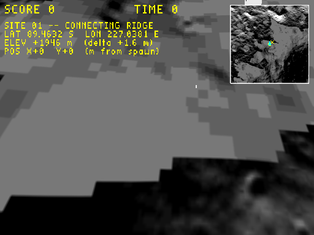
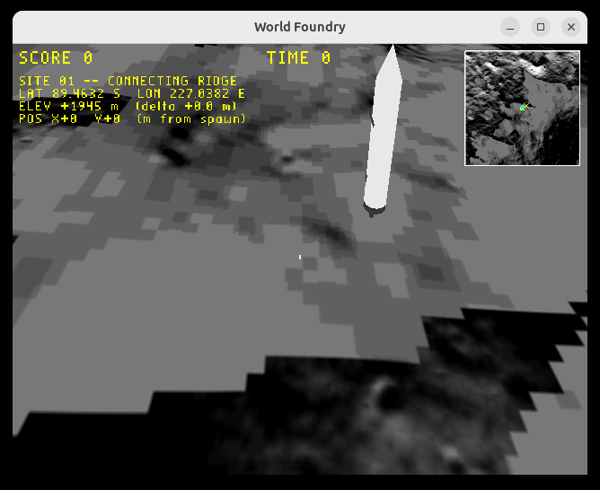

# Plan: HUD follows window resize (anchor to live window, not init size)

**Status:** Done
**Date:** 2026-05-31
**Estimate:** 30 min · **Actual:** ~25 min

## Context

When `wf_game`'s X11 window is resized larger, the 3D scene scaled to fill the new window correctly, but the HUD (SCORE / TIME / LIVES + the new moon position-display overlay) stayed clipped to a small `_xSize × _ySize` region anchored at the bottom-left of the resized window. The bigger the window, the smaller the HUD's relative footprint, until it was an unreadable cluster crammed into one corner.

Two interacting bugs:

1. **`wfWindowWidth/Height` never updated.** Default-initialised to 640/480 in `display.cc`. On X11 the resize event (`ConfigureNotify` in `mesa.cc:252`) recomputed the GL viewport but didn't write back to the globals. So *everything else* that read `wfWindowWidth/Height` (projection aspect, line-522 per-frame viewport set, HUD layout) stayed pinned at 640×480.

2. **`DrawHud` was called with the wrong surface size.** Previously `DrawHud(_xSize, _ySize)` — the FBO-init dimensions. Right for the headless capture FBO (512×384), wrong for the live X11 window.

Both surfaced this turn: (1) was latent and benign until the moon overlay added a top-right minimap, which clipped off the right edge of the 640-wide HUD viewport in a wider window. (2) emerged when fixing (1)'s downstream effects.

## Approach

Two targeted edits, no new abstractions:

### 1. Track the live X11 window size

`wfsource/source/gfx/gl/mesa.cc` — extend the existing `ConfigureNotify` handler (already there to recompute the 3D viewport) to also write `event.xconfigure.width / .height` into `wfWindowWidth / wfWindowHeight`. The 3D viewport stays an inscribed square as before; the globals just become truthful about the actual window size.

### 2. Pick the right surface dimensions at the `DrawHud` call site

`wfsource/source/gfx/gl/display.cc` — the gate that fires `DrawHud` now picks:

- `bRecordVideo` → `_xSize, _ySize` (the capture FBO size, what `WF_GAME_SCREENSHOT_PPM` and `-record_video` read from)
- otherwise → `wfWindowWidth, wfWindowHeight` (live window, now kept current by (1))

That gets the HUD anchored to the visible surface in either mode without introducing new state or a per-frame GL roundtrip (no `glGetIntegerv`).

### Why not query `glGetIntegerv(GL_VIEWPORT)` instead?

Tried it. In the live path the inscribed-square viewport reported by ConfigureNotify (e.g. `(0, -350, 1500, 1500)` on a 1500×800 window) doesn't describe the window — it's a different shape. In the capture path, the viewport carries whatever the 3D-renderer set, which doesn't necessarily match the FBO either. Asking the engine globals "what surface am I drawing to?" is cleaner than asking GL "what's the current scissor-y thing?".

## Files changed

- `wfsource/source/gfx/gl/mesa.cc` — `ConfigureNotify` handler now also writes `wfWindowWidth/Height`.
- `wfsource/source/gfx/gl/display.cc` — `DrawHud` call site picks FBO-or-window size based on `bRecordVideo`.

## Verification

1. `task build` clean.
2. Capture path unchanged — `WF_GAME_SCREENSHOT_PPM=… engine/wf_game -record_video … -Lwflevels/moon_site01-standalone.iff` produces a 512×384 PPM with the HUD anchored top-left, minimap top-right, lander + astronaut visible:

   

   SCORE/TIME at y=8, four-line text block (SITE 01 / LAT-LON / ELEV / POS), 128×128 minimap inset top-right with hillshade + spawn square + lander X + cyan compass chevron, lander tower visible in scene, astronaut speck centre.

3. Interactive resize test — launch the game, programmatically resize the X11 window via `python3-xlib`, dump it with `xwd`, convert with `gm`:

   

   Window resized to 1500×800. SCORE/TIME anchored top, 4-line text block top-left, 128×128 minimap top-right (not clipped), Starship lander dominating centre, astronaut speck mid-frame. Compare against the pre-fix screenshot the user supplied (`~/Pictures/Screenshots/Screenshot from 2026-05-31 06-56-44.png`) where the entire HUD was crammed into a tiny region of the bottom-left.

   Repro recipe (saved as ad-hoc shell, not a checked-in test):
   ```bash
   LD_LIBRARY_PATH=engine/libs DISPLAY=:0 engine/wf_game \
       --vram-width=4096 --vram-height=2048 --vram-slot-width=1024 --vram-slot-height=1024 \
       -Lwflevels/moon_site01-standalone.iff &
   sleep 4
   DISPLAY=:0 python3 -c '
   from Xlib import display
   d=display.Display(); root=d.screen().root
   def walk(w):
       try: nm=w.get_wm_name()
       except: nm=None
       if nm and "World Foundry" in nm: return w
       for c in w.query_tree().children:
           r=walk(c)
           if r: return r
   walk(root).configure(width=1500, height=800); d.sync()'
   sleep 2
   DISPLAY=:0 xwd -name "World Foundry" -out /tmp/x.xwd && gm convert /tmp/x.xwd /tmp/x.png
   ```

## Follow-ups

- **HUD scaling option**: currently HUD is fixed pixel size, so it looks small on very large windows. A future flag (e.g. `wf_hud_scale` derived from `min(wfWindowWidth, wfWindowHeight) / 600`) would scale the HUD with the window. Defer until somebody actually plays at 4K and complains.
- **Capture FBO size from CLI**: the screenshot path is currently locked to `_xSize × _ySize` set at Display init. A `--capture-size WxH` flag would let users choose 1080p captures without resizing the playing window. Defer.
- **Replace `wfWindowWidth/Height` globals** with a `Display::GetSurfaceSize()` method that internally branches on capture-vs-live. The globals predate the FBO capture path; this would consolidate the policy.
