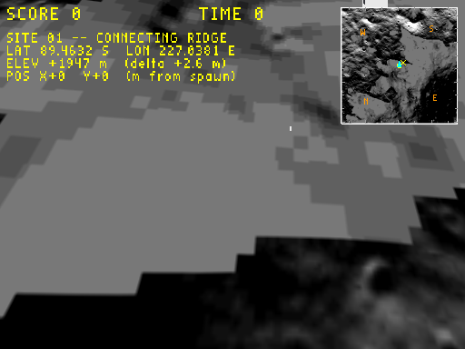
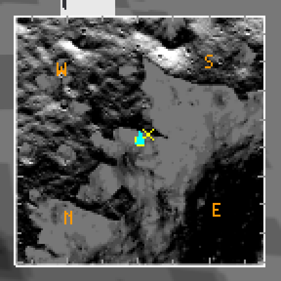

# Plan: cardinal-direction (N/S/E/W) labels on the moon minimap

**Status:** Done
**Date:** 2026-05-31
**Estimate:** ~30 min · **Actual:** ~25 min

## Verification screenshots

**Full capture** (512×384):

**4× point-sampled crop** of the minimap, with all four cardinals visible — N lower-left, S upper-right, E lower-right, W upper-left, in orange. Markers and chevron unchanged:

## Context

The moon overlay's minimap shows a top-down game-coordinate view, with the cyan compass chevron at the player's dot indicating heading direction. But at 89.46°S, the *game-world axes don't align with lunar cardinal directions* — meridian convergence means "east" in game-X actually has a measurable south component, and the minimap's up direction (game +Y) is some mix of north and east depending on where you are. The cardinal-direction overlay was deferred for v1; this implements it.

Follow-up [1] from `2026-05-31-position-display-hud-overlay-on-the-moon-level-tex.md`.

## Geometry

The South polar stereographic origin (= south pole) is at game-world `(+11000, +12000)` m (i.e. the play-area centre is offset by `(-11000, -12000)` in PS space). From the play-area centre:

- **North** (radial *outward* from pole) = `(X_c, Y_c) / ρ_c` = `(-11000, -12000) / 16278` ≈ `(-0.676, -0.738)` in game.
- **South** (toward pole) = `-N` ≈ `(+0.676, +0.738)`.
- **East** = 90° CCW rotation of N in the PS plane (because increasing PS angle = increasing longitude) = `(-N_y, +N_x)` ≈ `(+0.738, -0.676)`.
- **West** = `-E`.

Screen Y is flipped (`sy = mm_y + (1-v)*MM`), so on the minimap:

| Direction | Game vector | Screen vector | Where on minimap |
|---|---|---|---|
| N | (-0.676, -0.738) | (-0.676, +0.738) | lower-left |
| S | (+0.676, +0.738) | (+0.676, -0.738) | upper-right |
| E | (+0.738, -0.676) | (+0.738, +0.676) | lower-right |
| W | (-0.738, +0.676) | (-0.738, -0.676) | upper-left |

The 180°-from-typical-map layout (N lower-left, S upper-right) is correct: walking "south" near the south pole means walking *toward* the pole, which on our minimap is the +X, +Y game-corner = upper-right after Y flip.

## Approach

Four single-letter labels (N, S, E, W) at the minimap edges, placed at radius `MM/2 - 10` ≈ 54 px from the minimap centre in each cardinal direction. Drawn via `DrawHudText` at scale 1.0 (smallest stb_easy_font, ~6×8 px per glyph), in **bright orange** `(1.0, 0.6, 0.0)` — distinct from yellow (markers), cyan (heading chevron), and white (border/ticks).

The cardinal vectors are computed *once* per frame from the PS centre offset (constants already baked into the moon overlay block); no per-player-position recomputation. At a 1 km play area near the pole the cardinal rotation varies by ~3.5° across the area, but the labels are anchored to the minimap centre (representing the play-area centre), so showing the centre's cardinals is the right approximation.

## Files modified

- **`wfsource/source/gfx/gl/display.cc`** — in the moon-overlay block of `DrawHud()`, after the compass chevron and before the closing brace, add the 4-letter cardinal draw. ~25 lines.

## Verification

1. `task build` clean.
2. `WF_GAME_SCREENSHOT_PPM=… engine/wf_game -record_video … -Lwflevels/moon_site01-standalone.iff` capture: minimap shows orange "N" in lower-left, "S" upper-right, "E" lower-right, "W" upper-left.
3. Visual sanity-check: the cyan compass chevron's "+Y heading" direction (player initial spawn heading) should match the screen direction of the "S" label (since the player faces +Y initially = +Y game = upper-left of upper-right-ish = roughly south). Pre-implementation rough check before committing the build.
